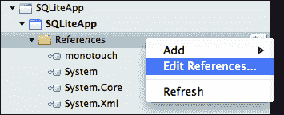
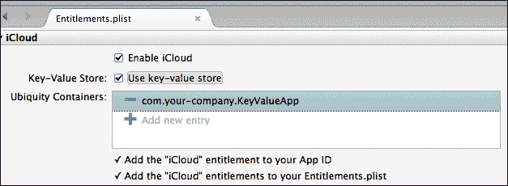

# 第四章 数据管理

在本章中，我们将涵盖以下主题：

+   创建文件

+   使用 SQLite 数据库

+   准备支持 iCloud

+   iCloud 键/值数据存储

# 简介

几乎每个应用程序都需要在文件系统中拥有永久的数据存储。在本章中，我们将讨论不同的数据存储方式。我们将看到如何创建一个**SQLite 数据库**，并在 iPhone 应用程序中使用它来管理数据。此外，我们还将学习如何在项目中使用现有的数据库。

### 注意

SQLite ([`www.sqlite.org`](http://www.sqlite.org)) 是一个自包含的事务型数据库系统。每个数据库都保存在一个独立的文件中，没有数据库服务器。在 iOS 中，SQLite 支持是原生的。

在介绍 SQLite 之后，我们将探讨**iCloud 存储**以及如何在我们的应用程序中集成它。

# 创建文件

在这个菜谱中，我们将学习如何在 iOS 设备的文件系统中创建文件。

## 准备工作

在 Xamarin Studio 中创建一个新的 iPhone**单视图应用程序**，并将其命名为`FileCreationApp`。

## 如何操作…

按照以下步骤完成此菜谱：

1.  在 Interface Builder 中打开`FileCreationAppViewController.xib`文件。

1.  在其视图中添加一个按钮和一个标签。

1.  在 Xamarin Studio 中，在控制器类的`ViewDidLoad`方法中输入以下代码：

    ```swift
    string filePath = Path.Combine (Environment.GetFolderPath(Environment.SpecialFolder.Personal), "MyFile.txt");
    using (StreamWriter sw = new StreamWriter (filePath))
    {
      sw.WriteLine ("Some text in file!");
    }
    this.btnShow.TouchUpInside += (s, e) => {
      using (StreamReader sr = new StreamReader (filePath))
      {
        this.labelStatus.Text = sr.ReadToEnd ();
      }
    };
    ```

1.  在模拟器上编译并运行应用程序。点击按钮以将文件内容填充到标签中。

## 它是如何工作的...

如前述代码所示，我们可以使用来自`System.IO 命名空间`的标准类，就像在桌面应用程序中一样。我们将为要保存的文件设置一个路径。我们将在以下代码行中这样做：

```swift
string filePath = Path.Combine (Environment.GetFolderPath(Environment.SpecialFolder.Personal), "MyFile.txt");
```

在 iOS 中，我们无法访问整个文件系统，甚至在应用程序包内部也不行。如果我们尝试在无法访问的文件夹中写入，将会发生异常。因此，我们使用`static Environment.GetFolderPath(SpecialFolder)`静态方法来检索与我们的应用程序的`Documents`文件夹相对应的`Personal`特殊文件夹。注意`Path.Combine(string, string)`的使用，它将两个字符串组合并返回一个路径。之后，我们按照以下方式创建`StreamWriter`类的新实例：

```swift
using (StreamWriter sw = new StreamWriter (filePath))
{
  sw.WriteLine ("Some text in file!");
}
```

我们使用文件的`WriteLine(string)`方法在文件中写入一些文本。要从文件中检索文本，我们创建`StreamReader`类的新实例，并使用以下代码使用其`ReadLine`方法读取文本：

```swift
using (StreamReader sr = new StreamReader (filePath))
{
  this.labelMessage.Text = sr.ReadToEnd ();
}
```

## 更多内容...

实际上，`System.IO`命名空间中几乎每个可用的类在 Xamarin.iOS 上都会工作，只要我们有访问目标文件夹的权限。

### 文档文件夹

应用程序包的`Documents`文件夹仅与该应用程序相关。如果从设备中卸载应用程序，其内容也将被删除。在此文件夹中创建的文件将自动备份到 iCloud，除非我们明确请求排除特定文件。这可以通过跳过文件的备份属性来完成。例如，如果我们想排除我们创建的`MyFile.txt`文件，我们就必须添加以下代码：

```swift
NSError error = NSFileManager.SetSkipBackupAttribute(filePath, true);
if (null == error) {
  // Success
}
```

如果在调用此方法时文件不存在，`error`对象将包含适当的错误信息。

如果我们想将文件包含到 iCloud 备份中，我们只需调用前面的方法，将`false`作为第二个参数传递。

### 注意

考虑跳过大型文件的备份属性是很重要的。苹果将拒绝包含要备份到 iCloud 的大型文件的应用程序。

iCloud 备份是 iOS 备份功能的自动程序。它主要用于从 iCloud 恢复设备。除了从 iCloud 备份中排除或包含文件之外，我们没有其他访问权限。它也与我们可以访问的 iCloud 存储不同，我们将在本章后面讨论。

### Caches 文件夹

`Caches`文件夹（`Library/Caches/`）可以用于存储应用程序特定的数据，这些数据可以由应用程序轻松重建。此文件夹中的文件不会备份到 iCloud，并且如果需要更多空间，系统可以将其删除。

我们可以通过`Environment.SpecialFolder.InternetCache`值在 iOS 应用程序中获取`Caches`文件夹的完整路径，如下面的代码所示：

```swift
string cachesFolder = Environment.GetFolderPath(Environment.SpecialFolder.InternetCache);
```

## 参见

+   *iCloud 键/值数据存储*教程

# 使用 SQLite 数据库

在本教程中，我们将学习如何创建 SQLite 数据库文件。我们将创建一个表，向其中插入一些数据，然后查询表以在屏幕上显示数据。

## 准备工作

在 Xamarin Studio 中创建一个新的 iPhone**单视图应用程序**，并将其命名为`SQLiteApp`。在视图控制器上添加三个按钮和一个标签。不要忘记将它们连接到输出端口。

## 如何操作...

执行以下步骤：

1.  添加对`Mono.Data.Sqlite`和`System.Data`程序集的引用。以下截图显示了如何向项目中添加引用：

1.  为了创建数据库和表，请在`SQLiteAppViewController`类中输入以下方法：

    ```swift
    private void CreateSQLiteDatabase (string databaseFile)
    {
      try
      {
        if (!File.Exists (databaseFile))
        {
          SqliteConnection.CreateFile (databaseFile);
          using (SqliteConnection sqlCon = new SqliteConnection (String.Format ("Data Source = {0};", databaseFile)))
          {
            sqlCon.Open ();
            using (SqliteCommand sqlCom = new SqliteCommand (sqlCon))
            {
              sqlCom.CommandText = "CREATE TABLE Customers (ID INTEGER PRIMARY KEY, FirstName VARCHAR(20), LastName VARCHAR(20))";
              sqlCom.ExecuteNonQuery ();
            }
            sqlCon.Close ();
          }
          this.lblStatus.Text = "Database created!";
        } else {
          this.lblStatus.Text = "Database already exists!";
        }
      } catch (Exception ex) {
        this.lblStatus.Text = String.Format ("Sqlite error: {0}", ex.Message);
      }
    }
    ```

1.  添加以下方法以向数据库中插入数据：

    ```swift
    private void InsertData(string databaseFile) {
      try {
        if (File.Exists(databaseFile)) {
          using (SqliteConnection sqlCon = new SqliteConnection(String.Format("Data Source = { 0};", databaseFile))) {
            sqlCon.Open();
            using (SqliteCommand sqlCom = new SqliteCommand(sqlCon)) {
              sqlCom.CommandText = "INSERT INTO Customers (FirstName, LastName) VALUES ('Dimitris', 'Tavlikos')";
              sqlCom.ExecuteNonQuery();
              }
            sqlCon.Close();
          }
          this.lblStatus.Text = "Inserted 1 row.";
        }  else {
          this.lblStatus.Text = "Database file does not exist!";
        }
      }  catch (Exception ex) {
        this.lblStatus.Text = String.Format("Sqlite error: { 0}", ex.Message);
      }
    }
    ```

1.  添加以下方法以从数据库查询数据：

    ```swift
    private void QueryData(string databaseFile) {
      try {
        if (!File.Exists(databaseFile)) {
          using (SqliteConnection sqlCon = new SqliteConnection(String.Format("Data Source = { 0};", databaseFile))) {
              sqlCon.Open();
            using (SqliteCommand sqlCom = new SqliteCommand(sqlCon)) {
              sqlCom.CommandText = "SELECT * FROM Customers WHERE FirstName='Dimitris'";
              using (SqliteDataReader dbReader = sqlCom.ExecuteReader()) {
                while (dbReader.Read()) {
                  this.lblStatus.Text = String.Format("First name: { 0}\ nLast name: { 1}", dbReader["FirstName"], dbReader["LastName"]);
                }
              }
            }
          }
        }  else {
          this.lblStatus.Text = "Database file does not exist!";
        }
      }  catch (Exception ex) {
        this.lblStatus.Text = String.Format("Sqlite error: { 0}", ex.Message);
      }
    }
    ```

1.  在`ViewDidLoad`方法中添加以下代码：

    ```swift
    string sqlitePath = Path.Combine (Environment.GetFolderPath (Environment.SpecialFolder.Personal), "MyDB.db3");
    this.btnCreate.TouchUpInside += (s, e) => this.CreateSQLiteDatabase (sqlitePath);
    this.btnInsert.TouchUpInside += (s, e) => this.InsertData(sqlitePath);
    this.btnQuery.TouchUpInside += (s, e) => this.QueryData(sqlitePath);
    ```

1.  在模拟器上编译并运行应用程序。按顺序点击每个按钮，以创建、插入和从数据库查询数据。

## 工作原理...

iOS 为 SQLite 数据库提供了原生支持。我们可以通过 Mono 的`Mono.Data.Sqlite`命名空间访问 SQLite 数据库：

```swift
using Mono.Data.Sqlite;
```

在 `CreateSQLiteDatabase` 方法内部，我们首先使用以下代码检查文件是否已存在，以避免破坏任何数据：

```swift
if (!File.Exists (databaseFile))
```

然后，我们可以继续创建数据库。我们首先使用以下代码使用 `SqliteConnection.CreateFile(string)` 静态方法创建文件：

```swift
SqliteConnection.CreateFile (databaseFile);
```

我们通过初始化一个 `SqliteConnection` 对象并调用其 `Open()` 方法来连接新创建的文件。SQLite 数据库的连接字符串是 `Data Source =` 后跟数据库文件名，如下面的代码所示：

```swift
using (SqliteConnection sqlCon = new SqliteConnection (String.Format ("Data Source = {0};", databaseFile)))
  sqlCon.Open();
```

要在数据库中创建表，初始化一个 `SqliteCommand` 对象。我们将一个标准的 SQL 字符串传递给其 `CommandText` 属性，并调用 `ExecuteNonQuery()` 方法来执行 SQL，如下面的代码所示：

```swift
sqlCom.CommandText = "CREATE TABLE Customers (ID INTEGER PRIMARY KEY, FirstName VARCHAR(20), LastName VARCHAR(20))";
sqlCom.ExecuteNonQuery ();
```

要向数据库中插入数据，我们在 `InsertData` 方法中使用以下代码：

```swift
sqlCom.CommandText = "INSERT INTO Customers (FirstName, LastName) VALUES ('Dimitris', 'Tavlikos')";
sqlCom.ExecuteNonQuery();
```

最后，我们通过 `SELECT` 语句查询数据，并通过 `SqliteDataReader` 获取数据，如下面的代码所示：

```swift
sqlCom.CommandText = "SELECT * FROM Customers WHERE FirstName='Dimitris'";
using (SqliteDataReader dbReader = sqlCom.ExecuteReader()) {
  while (dbReader.Read()) {
    this.lblStatus.Text = String.Format("First name: {0}\nLast name: {1}", dbReader["FirstName"], dbReader["LastName"]);
  }
}
```

## 还有更多...

注意使用 `try-catch` 块。它用于在创建数据库时出现错误时向用户显示消息。

### SQL 表创建

在此菜谱中，我们为我们的数据库创建了一个名为 `Customers` 的简单表。它包含三个字段。`FirstName` 和 `LastName` 参数的类型为 `VARCHAR(20)`，而 `ID` 的类型为 `INTEGER`，也是表的 `PRIMARY KEY`。

除了使用 SQL 命令创建表之外，我们还可以使用各种商业或免费 GUI 工具创建 SQLite 数据库。在互联网上简单搜索即可得到各种结果。

## 参见

+   *创建文件* 菜单

+   在第五章 *显示数据表格* 的 *Displaying data in a table* 菜单中，*Displaying Data*

# 准备 iCloud 支持

随着 iOS 5 的发布，Apple 引入了 iCloud。iCloud 是一项为 iOS 用户提供云存储的服务，具有各种配置。对于应用程序开发，我们可以使用 iCloud 存储来保存可以在同一用户账户下运行在不同设备上的应用程序的不同实例之间共享的信息。在此菜谱中，我们将学习如何准备应用程序以提供 iCloud 存储支持。

## 准备工作

在 Xamarin Studio 中创建一个新的 iPhone **单视图应用程序** 并命名为 `KeyValueApp`。为此菜谱，开发账户中需要存在一个启用了 iCloud 的 App ID。有关如何创建 App ID 的更多信息，请参阅第十四章 *部署*，*Deploying*。

## 如何操作...

执行以下步骤：

1.  双击 `Entitlements.plist` 文件以在 Xamarin Studio 中打开它。

1.  选择 **启用 iCloud** 复选框。

1.  如果它要求您选择一个账户，请从列表中选择您的 Apple 开发者账户。

1.  启用 iCloud 后，应出现**使用键值存储**复选框。启用它。**Entitlements.plist**文件设置现在应类似于以下截图：

1.  在项目选项中，在**iPhone Bundle Signing**下，为**自定义权限**字段选择**Entitlements.plist**。执行此步骤很重要，尽管该字段可能已经设置。

## 它是如何工作的...

启用 iCloud 支持只是设置我们项目适当设置的问题。通过勾选**启用 iCloud**和**使用键值存储**复选框，Xamarin Studio 在**Entitlements.plist**文件中添加必要的键，这将允许应用程序使用 iCloud 存储。

## 更多...

虽然我们可以在模拟器上运行启用 iCloud 的应用程序，但 iCloud 功能将无法工作。

## 参见

+   第十四章中的*创建配置文件*菜谱，*部署*

# iCloud 键值存储

在本菜谱中，我们将学习如何保存和检索适合存储应用程序设置或在不同设备间共享的有用数据的小量数据。

### 注意

应用程序只能使用键值存储存储最多 1 MB 的数据，最多 1024 个键。因此，它不能用于备份文件或类似功能。

## 准备工作

我们需要两个处于同一 iCloud 账户下的设备才能真正看到 iCloud 存储的实际效果。在一个设备上我们将保存一些数据，在第二个设备上我们将加载这些数据。如果只有一个设备可用，这不会成问题，因为它将完美工作，因为数据将从本地存储加载，而不是从 iCloud。

## 如何操作...

完成此菜谱的步骤如下：

1.  在 Xamarin Studio 中创建一个新的 iPhone **Single View Application** 并启用它以支持 iCloud，如前一个菜谱所示。将项目命名为`KeyValueApp`。

1.  在视图控制器上添加两个按钮和一个标签。

1.  在视图控制器的`ViewDidLoad`方法中添加以下代码：

    ```swift
    this.btnSave.TouchUpInside += (s, e) => {
      NSUbiquitousKeyValueStore kvStore = NSUbiquitousKeyValueStore.DefaultStore;
      kvStore.SetString("LastSavedSearch", "How to implement iCloud");
      kvStore.Synchronize();
      this.lblStatus.Text = "Saved!";
    };
    this.btnLoad.TouchUpInside += (s, e) => {
      NSUbiquitousKeyValueStore kvStore = NSUbiquitousKeyValueStore.DefaultStore;
      this.lblStatus.Text = string.Format("Last saved search is: {0}", kvStore.GetString("LastSavedSearch");
    };
    ```

1.  在设备上编译并运行应用程序。点击**保存**按钮将键和值保存到 iCloud。

1.  点击**加载**按钮以在标签上显示数据。

1.  如果有第二个设备，请在上面运行应用程序并点击**加载**按钮。数据将从 iCloud 中检索并在第二个设备的屏幕上显示。

## 它是如何工作的...

要将键值对保存到 iCloud，我们使用`NSUbiquitousKeyValueStore`类，该类负责处理数据。我们通过`DefaultStore`静态属性检索默认键值存储并调用其`Save`方法，如下面的代码所示：

```swift
NSUbiquitousKeyValueStore kvStore = NSUbiquitousKeyValueStore.DefaultStore;
kvStore.Save("LastSavedSearch", "How to implement iCloud ");
```

调用`Save`方法会将数据推送到队列以进行本地保存，然后上传到 iCloud。`Synchronize`方法同步键/值存储，基本上可以用来加快数据同步的过程。然而，调用该方法并不意味着数据会立即同步。iOS 负责决定何时同步数据，我们无法控制它。然而，iCloud 旨在提供无缝的同步体验，因此延迟通常不易察觉：

```swift
kvStore.Synchronize();
```

要从 iCloud 加载数据，我们只需调用`GetString`方法，传递要检索数据的键，如下所示：

```swift
kvStore.GetString("LastSavesSearch");
```

## 还有更多...

iCloud 键/值存储只接受一组特定的值，这些值类型如下：

+   `double`

+   `bool`

+   `long`

+   `NSObject[]`

+   `NSDictionary`

+   `NSData`

+   `string`

### 在键/值存储中接收更改通知

我们还可以在另一个设备上更改键/值对或一组对时收到通知。为此，我们需要添加一个通知观察者，如下所示：

```swift
NSObject coudObserver = NSUbiquitousKeyValueStore.Notifications.ObserveDidChangeExternally((s, e) => {
  if (e.ChangeReason == NSUbiquitousKeyValueStoreChangeReason.
    ServerChange) {
    e.ChangeKeys.Foreach(k => Console.WriteLine("Key changed: {0}", k));
  }
};
```

`NSUbiquitousKeyValueStoreChangeReason`枚举包含以下值：

+   **ServerChange**：它显示是否在其他设备上更改了值。

+   **QuotaViolationChange**：配额限制已达到。一些键/值对需要被移除。

+   **InitialSyncChange**：由于设备上的初始 iCloud 设置尚未完成，因此丢弃了一个键/值对。

+   **AccountChange**：用户已更改设备上的 iCloud 账户。整个键/值存储被新的 iCloud 账户中的存储所替换。

## 参见

+   *为 iCloud 准备*配方

+   第十四章中的*创建配置文件*配方，*部署*
