# 第五章。显示数据

在本章中，我们将涵盖以下主题：

+   提供列表

+   以表格形式显示数据

+   自定义行

+   编辑表格

+   表格索引

+   搜索数据

+   创建一个简单的网页浏览器

+   以网格形式显示数据

+   自定义网格

# 简介

在上一章中，我们讨论了在 iOS 应用中数据管理的可用选项。在本章中，我们将讨论向用户显示数据的各种方式。

特别是，我们将关注如何使用以下控件：

+   **UIPickerView**：此控件提供与列表框类似的功能。

+   **UITableView**：这是一个用于显示数据的非常可定制的视图。它是 iOS 应用中最常用的控件之一。

+   **UISearchBar** 和 **UISearchDisplayController**：这是一个提供易于使用界面进行数据搜索的控件组合。

+   **UIWebView**：这为应用带来了网页浏览器的功能。

+   **UICollectionView**：这以可定制的网格显示数据。

此外，我们还将学习如何在表格中提供索引，以便用户可以轻松访问大量数据。

# 提供列表

在本食谱中，我们将学习如何使用 `UIPickerView` 类。

## 准备工作

`UIPickerView` 类为我们提供了一个与列表框功能类似的控件。它专门为触摸屏幕的人手设计。它与普通列表框的主要区别在于，每一列都可以有自己的行数。要开始，创建一个新的 iPhone **单视图应用程序**项目，并将其命名为 `PickerViewApp`。

## 如何做...

执行以下步骤：

1.  在 Interface Builder 中打开 `PickerViewAppViewController.xib` 文件。在主视图中添加 `UILabel` 和 `UIPickerView` 并保存文档。

1.  回到 Xamarin Studio，在 `PickerViewAppViewController` 类中创建一个嵌套类，该类继承自 `UIPickerViewModel`，并使用以下代码：

    ```swift
    private class PickerModel : UIPickerViewModel
    ```

1.  在嵌套类中添加以下构造函数和字段：

    ```swift
    public PickerModel (PickerViewAppViewController controller) {
      this.parentController = controller;
      this.transportList = new List<string>() { "On foot", "Bicycle", "Motorcycle", "Car", "Bus" };
      this.distanceList = new List<string>() { "0.5", 	"1", "5", "10", "100" };
      this.unitList = new List<string>() { "mi", "km" };
      this.transportSelected = this.transportList[0];
      this.distanceSelected = this.distanceList[0];
      this.unitSelected = this.unitList[0];
    }
    private PickerViewAppViewController parentController;
    private List<string> transportList;
    private List<string> distanceList;
    private List<string> unitList;
    string transportSelected;
    string distanceSelected;
    string unitSelected;
    ```

1.  您现在需要重写 `UIPickerViewModel` 类中的四个方法，如下面的代码所示：

    ```swift
    public override int GetComponentCount (UIPickerView picker) {
      return 3;
    }
    public override int GetRowsInComponent(UIPickerView picker, int component) {
      switch (component) {
      case 0: 
        return this.transportList.Count;
      case 1:
        return this.distanceList.Count;
      default:
        return this.unitList.Count;
      }
    }
    public override string GetTitle (UIPickerView picker, int row, int component) {
      switch (component) {
      case 0:
        return this.transportList[row];
      case 1:
        return this.distanceList[row];
      default:
        return this.unitList[row];
      }
    }
    public override void Selected (UIPickerView picker, int row, int component) {
      switch (component) {
        case 0:
          this.transportSelected = this.transportList[row];
        break;
        case 1:
          this.distanceSelected = this.distanceList[row];
        break;
        default:
          this.unitSelected = this.unitList[row];
        break;
      }
      this.parentController.lblStatus.Text = String.Format("Transport: {0}\nDistance: {1}{2}", this.transportSelected, this.distanceSelected, this.unitSelected);
    } 
    ```

1.  最后，在控制器中的 `ViewDidLoad` 方法内将我们创建的模型对象设置为选择视图的 `Model` 属性，如下面的代码所示：

    ```swift
    this.pickerView.Model = new PickerModel (this);
    ```

1.  在模拟器上编译并运行应用。拖动选择视图中的项目，并观察标签内容根据您的选择而更改。以下截图显示了它应该看起来像什么：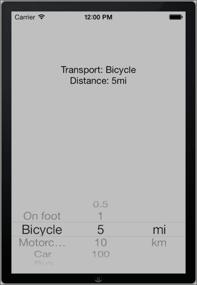

## 它是如何工作的...

`UIPickerViewModel` 类在 Objective-C 中不存在。Xamarin.iOS 提供了这个类，作为 `UIPickerViewDataSource` 和 `UIPickerViewDelegate` 原生协议的包装器，并包含这两个类的方法以供我们重写。这非常有帮助，因为我们只需要实现和分配一个类而不是两个类来为我们的选择视图。这两个协议在 Xamarin.iOS 中同时作为 `C#` 类可用。

在构造函数内部，我们初始化将用于在选择器中显示数据的列表。以下四个需要重写的方法负责显示数据：

+   `int GetComponentCount (UIPickerView picker)`: 这个方法返回我们希望选择器视图显示的列数

+   `int GetRowsInComponent (UIPickerView picker, int component)`: 这个方法返回每个组件将显示的行数

+   `string GetTitle (UIPickerView picker, int row, int component)`: 这是每行的文本

+   `void Selected (UIPickerView picker, int row, int component)`: 当用户在选择器视图的任何组件/行组合中选择一个项时，将执行此操作

我们使用在构造函数中分配的列表来显示数据。例如，`GetTitle` 方法实现如下所示：

```swift
switch (component)
{
case 0:
  return this.transportList[row];
case 1:
  return this.distanceList[row];
default:
  return this.unitList[row];
}
```

## 还有更多...

我们可以通过调用 `Select (int, int, bool)` 方法来程序化选择选择器的初始选择。前两个参数分别反映行和组件索引，而 `bool` 参数切换选择动画。使用此方法时需要注意的唯一一点是，在分配选择器的 `Model` 属性之后调用它。否则将发生异常。

### 更多 UIPickerView 定制

除了之前提供的选项外，我们还可以设置每个组件的宽度。为此，我们重写 `GetComponentWidth (UIPickerView, int)` 方法，该方法返回一个表示每个组件宽度的浮点数。

我们还可以将自定义视图作为选择器视图中的项，而不是纯文本。这可以通过重写 `GetView(UIPickerView, int, int, UIView)` 方法并返回我们希望在 `UIPickerView` 控制器的每个位置显示的视图来实现。

### 日期和时间选择

有一个名为 `UIDatePicker` 的控件，它与 `UIPickerView` 类似，专门定制用于显示和选择日期和时间值。请注意，尽管其用户界面与选择器视图相同，但它并不继承 `UIPickerView` 类。它只是使用它的一个实例作为子视图。

## 参见

+   *在表格中显示数据* 食谱

# 在表格中显示数据

在本食谱中，我们将学习如何使用 `UITableView` 类来显示数据。这个类，连同 `UITableViewCell` 对象一起，提供了一个在屏幕上以多行但单列形式显示数据的接口。

## 准备工作

要开始，在 Xamarin Studio 中创建一个新的项目，并将其命名为 `TableViewApp`。在本食谱中，我们不会使用 XIB 文件。我们将通过代码创建用户界面。

## 如何做到...

执行以下步骤：

1.  向项目中添加一个新的类，并将其命名为 `TableController`。使用以下代码从 `UITableViewController` 派生该类：

    ```swift
    public class TableController : UITableViewController
    ```

1.  在 `TableController` 类内部创建以下嵌套类：

    ```swift
    private class TableSource : UITableViewSource
    {
      public TableSource ()
      {
        this.cellID = "cellIdentifier";
        this.tableData = new Dictionary<int, string> () {
          {0, "Music"},
          {1, "Videos"},
          {2, "Images"}
        };
      }
      private readonly string cellID;
      private Dictionary<int, string> tableData;
      public override int RowsInSection (UITableView tableview, int section)
      {
        return this.tableData.Count;
      }
      public override UITableViewCell GetCell (UITableView tableView, NSIndexPath indexPath)
      {
        int rowIndex = indexPath.Row;
        UITableViewCell cell = tableView.DequeueReusableCell (this.cellID);
        if (null == cell)
        {
          cell = new UITableViewCell (UITableViewCellStyle.Default, this.cellID);
        }
        cell.TextLabel.Text = this.tableData[rowIndex];
        return cell;
      }
    }
    ```

1.  重写控制器的方法 `ViewDidLoad` 并添加以下代码行：

    ```swift
    this.TableView.Source = new TableSource ();
    ```

1.  在`FinishedLaunching`方法中添加以下代码以显示表格控制器：

    ```swift
    TableController tableController = new TableController();
    UINavigationController navController = new UINavigationController(tableController);
    window.RootViewController = navController;
    ```

1.  在模拟器上编译并运行应用程序。结果应该类似于以下截图所示：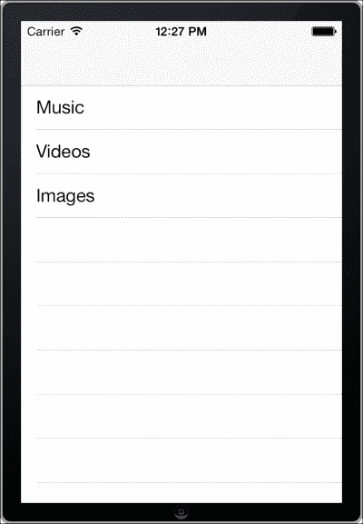

## 它是如何工作的...

我们创建的嵌套类作为`UITableView`的数据源。在以下代码中创建的类继承自 Xamarin.iOS 的`UITableViewSource`类：

```swift
private class TableSource : UITableViewSource
```

### 注意

与`UIPickerView`一样，在前面讨论的示例中，`UITableViewSource`类在 Objective-C 中不存在。它仅仅是 Xamarin.iOS 围绕`UITableViewDelegate`和`UITableViewSource`协议提供的包装对象。

在其构造函数中，我们初始化了两个变量（如下面的代码所示）：`string`，它将作为单元格的标识符，以及一个通用的`Dictionary`变量作为我们的数据源：

```swift
this.cellID = "cellIdentifier";
this.tableData = new Dictionary<int, string> () {
  {0, "Music"},
  {1, "Videos"},
  {2, "Images"}
};
```

要使`TableSource`类工作，我们需要重写两个方法。第一个方法名为`RowsInSection`，它返回表格应显示的行数。在以下代码中，我们返回数据源对象中的项目数：

```swift
return this.tableData.Count;
```

第二个方法`GetCell`返回将在表中显示的`UITableViewCell`对象。

### 注意

`UITableViewCell`类代表一行，并在`UITableView`中管理其内容。

为了更高效，表格视图在需要时创建其单元格对象。因此，我们需要通过其`DequeueReusableCell`方法从表格中获取`UITableViewCell`（之前使用过），如下面的代码所示：

```swift
UITableViewCell cell = tableView.DequeueReusableCell (this.cellID);
```

如果没有为特定的单元格标识符存在单元格，该方法将返回`null`。因此，我们使用以下代码创建将要使用的单元格：

```swift
cell = new UITableViewCell (UITableViewCellStyle.Default, this.cellID);
```

然后，我们分配特定单元格将显示的文本并使用以下代码返回：

```swift
cell.TextLabel.Text = this.tableData[rowIndex];
return cell;
```

默认情况下，`UITableViewCell`类包含两个标签，可以用来显示文本。主标签可以通过`TextLabel`属性访问，次要标签可以通过`DetailTextLabel`属性访问。请注意，当使用具有`Default`样式的单元格时，`DetailTextLabel`属性不能使用，并将返回`null`。

## 更多...

为了在用户选择特定行时提供功能，我们需要在充当`UITableViewSource`的类中重写`RowSelected`属性。默认情况下，当用户点击一行时，单元格将以浅灰色突出显示，以指示选择。要取消选择行，我们使用`UITableView.DeselectRow(NSIndexPath, bool)`方法，如下面的代码所示：

```swift
public override void RowSelected (UITableView tableView, NSIndexPath indexPath)
{
  tableView.DeselectRow (indexPath, true);
}
```

### UITableView 样式

`UITableView`可以使用两种不同的样式创建。默认样式是`Plain`。另一种可以使用的样式是`Grouped`样式。这种样式在许多 iOS 原生应用程序中正在使用，例如*设置*应用程序。

此外，`UITableView` 支持显示分为不同部分的数据。如果我们想使用不同的部分，我们必须在 `RowsInSection` 覆盖中显式返回每个部分将有的行数。

### UITableViewCell 样式

表格单元格可以有四种不同的单元格样式，这些样式由 `UITableViewCellStyle` 枚举表示。其值如下所示：

+   **默认**：这是默认单元格样式。只能使用 `TextLabel` 属性来显示文本。

+   **副标题**：这是一种提供 `DetailTextLabel` 作为 `TextLabel` 副标题的样式。

+   **值 1**：这是一种显示 `TextLabel` 和 `DetailTextLabel` 文本大小相同、颜色不同，并居中对齐单元格两侧的样式。

+   **值 2**：这是一种显示 `TextLabel` 文本比 `DetailTextLabel` 文本小的样式。这种样式用于原生 *联系人* 应用中的联系人详情屏幕。

## 参见

+   *提供列表* 菜谱

+   *自定义行* 菜谱

+   第三章，*用户界面 – 视图控制器* 中的 *在不同视图控制器间导航* 菜谱

# 自定义行

在这个菜谱中，我们将创建一个使用我们自己的自定义 `UITableViewCell` 子类来显示数据的表格视图。

## 准备工作

以与先前菜谱中创建项目相同的方式在 Xamarin Studio 中创建一个新的项目。将其命名为 `CustomRowsApp`。

## 如何操作...

执行以下步骤：

1.  向项目中添加一个新的类，并将其命名为 `CustomCell`。

1.  使用以下代码实现该类：

    ```swift
    [Register("CustomCell")]
    public partial class CustomCell : UITableViewCell {
      public const string CELLID = "CustomCell";
      public CustomCell (IntPtr handle) : base(handle) {}
      [Outlet("lblTitle")]
      public UILabel LabelTitle { get; private set; }
      [Outlet("imgView")]
      public UIImageView ImgView { get; private set; }
    }
    ```

1.  向项目中添加一个新的 **Empty iPhone Interface Definition**，并将其命名为 `CustomCell`。不用担心名称与之前创建的类冲突，因为这个是一个 XIB 文件。在 Interface Builder 中打开该文件。

1.  在画布上添加 `UITableViewCell`。以下截图显示了 Xcode 对象浏览器中选中的 `UITableViewCell`：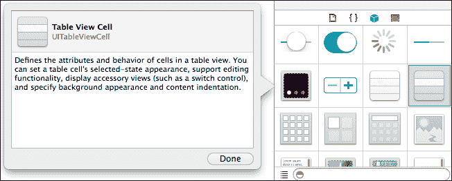

1.  在 **Identity** 检查器中将表格单元格的 **Class** 字段设置为 `CustomCell`。

1.  在 **Attributes** 检查器中将单元格的 **Identifier** 字段设置为 `CustomCell`。

1.  在单元格上添加一个 `UIImageView` 和一个 `UILabel`，并将它们连接到它们的出口。保存文档。

1.  将我们在先前的菜谱中创建的 `TableController.cs` 文件添加到项目中。将其命名空间从 `TableViewApp` 更改为 `CustomRowsApp`。

1.  将 `TableSource` 类的 `GetCell` 方法更改为以下代码：

    ```swift
    public override UITableViewCell GetCell (UITableView tableView, NSIndexPath indexPath) {
      int rowIndex = indexPath.Row;
      CustomCell cell = (CustomCell)tableView.DequeueReusableCell(CustomCell.CELLID);
      cell.LabelTitle.Text = this.tableData[rowIndex];
      return cell;
    }
    ```

1.  在 `TableController` 的 `ViewDidLoad` 方法中添加以下代码：

    ```swift
    this.TableView.RegisterNibForCellReuse (UINib.FromName("CustomCell", NSBundle.MainBundle), CustomCell.CellID);
    ```

1.  最后，确保在 `FinishedLaunching` 方法中呈现 `TableController`，如下所示：

    ```swift
    TableController tableController = new TableController();
    UINavigationController navController = new UINavigationController();
    window.RootViewController = navController;
    ```

## 它是如何工作的...

就像创建自定义视图一样，我们能够使用`UITableView`创建我们自己的自定义单元格来显示数据。主要区别在于，表格重用其单元格的实例，这样当我们想要显示多行时，它会更有效率。

为了使我们的表格视图“意识到”我们的自定义单元格，我们使用以下代码调用`RegisterNibForCellReuse`方法：

```swift
this.TableView.RegisterNibForCellReuse (UINib.FromName("CustomCell", NSBundle.MainBundle), CustomCell.CellID);
```

这样，当我们调用`GetCell`中的`DequeueReusable`单元格方法时，系统将自动为我们创建一个单元格实例或获取之前创建的一个。因此，我们不需要检查单元格是否为 null：

```swift
CustomCell cell = (CustomCell)tableView.DequeueReusableCell(CustomCell.CELLID);
```

你注意到前面讨论的两个方法调用中的共同点了吗？它们都需要一个单元格的标识符字符串。`CustomCell.CELLID`常量具有我们在 Xcode 中单元格的**标识符**字段中输入的相同值：`CustomCell`。在这种情况下，它与我们的单元格类名相同，如果我们有多个自定义单元格要显示，这将使事情保持整洁。然而，基本上，单元格的标识符可以是任何我们想要的。

## 还有更多...

我们可以创建我们需要的任何数量的自定义单元格。如前所述，我们需要确保为我们将要使用的每个单元格类设置一个唯一的标识符。此外，如果我们创建的自定义单元格具有不同的高度，我们需要确保我们在`UITableViewSource`实现中使用以下代码覆盖`GetHeightForRow`方法：

```swift
public override float GetHeightForRow (UITableView tableView, NSIndexPath indexPath) {
  return 44f; // Or whatever height we want the particular row to have.
}
```

为了提高效率，最好事先计算出行高，而不是在`GetHeightForRow`方法中计算它们。

### UITableViewCell 类的有用属性

除了在默认标签中添加文本外，`UITableViewCell`还包含一些其他属性，我们可以设置它们的值以在单元格中添加更多默认项。这些属性如下：

+   `ImageView`：接受一个`UIImageView`参数。我们可以用它来在单元格的左侧显示图像。

+   `AccessoryView`：接受任何`UIView`实例。其默认位置在单元格的右侧，位于单元格的 accessory 位置，该位置位于单元格的右侧。

+   `Accessory`：接受`UITableViewCellAccessory`类型的值。它为单元格的 accessory 提供预定义的视图，例如`DetailDisclosureButton`或`Checkmark`。

### UINib 类

`UINib`类负责在运行时加载 NIB 文件。我们通过其`FromName`静态方法实例化一个`UINib`实例，传递我们想要加载的 NIB 文件名（不带扩展名），如下面的代码所示：

```swift
UINib nib = UINib.FromName("CustomCell", NSBundle.MainBundle);
```

### 以编程方式添加内容

我们可以以编程方式向单元格添加视图。然而，我们不应直接将其添加到单元格中，而应将其添加到其`ContentView`中，使用以下代码：

```swift
// Inside our custom cell class:
this.ContentView.AddSubview(myView);
```

## 参见

+   *在表格中显示数据*配方

+   *编辑表格*配方

+   在第二章中，*用户界面 – 视图*的*创建自定义视图*配方

# 编辑表格

在本食谱中，我们将讨论如何在运行时从 `UITableView` 中插入和删除行，为用户提供适当的用户界面交互。

## 准备工作

打开我们在上一食谱中创建的 `CustomRowsApp` 项目，*自定义行*。

## 如何做...

执行以下步骤：

1.  从 `TableSource` 类中删除 `tableData` 字段，并用以下属性替换它：

    ```swift
    public List<string> TableData { get; private set; }
    ```

1.  在构造函数中使用以下代码初始化列表：

    ```swift
    this.TableData = new List<string>() { "Music", "Videos", "Images" };
    ```

1.  在 `TableSource` 类中，重写 `CommitEditingStyle` 方法并使用以下代码实现它：

    ```swift
    public override void CommitEditingStyle (UITableView tableView, UITableViewCellEditingStyle editingStyle, NSIndexPath indexPath) {
      if (editingStyle == UITableViewCellEditingStyle.Delete) {
        this.tableData.RemoveAt(indexPath.Row);
        tableView.DeleteRows(new NSIndexPath[] { indexPath }, UITableViewRowAnimation.Automatic);
      }
    }
    ```

1.  在 `TableController` 类中，使用以下代码添加一个 `UIBarButtonItem`：

    ```swift
    UIBarButtonItem btnAdd;
    public override ViewDidLoad() {
      // … existing code here.
      this.btnAdd = new UIBarButtonItem(UIBarButtonSystemItem.Add, (s, e) => {
        TableSource tableSource = (TableSource)this.TableView.Source;
        int itemCount = tableSource.TableData.Count;
        tableSource.TableData.Add(string.Format("Inserted item: {0}", itemCount));
        this.TableView.InsertRows(new NSIndexPath[] { 
          NSIndexPath.FromRowSection(itemCount, 0)
        }, UITableViewRowAnimation.Automatic);
      };
      this.NavigationItem.SetRightBarButtonItem(this.btnAdd, false);
    }
    ```

1.  在模拟器上编译并运行应用程序。点击加号按钮向表格添加新行，从右向左滑动一个项以删除项。以下截图显示了添加了一个项并滑动另一个项后的表格：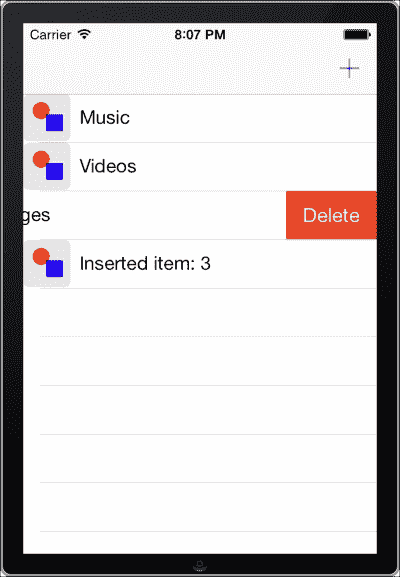

    ### 注意

    要在模拟器上滑动一个项，请点击并拖动光标向侧面。

## 它是如何工作的...

当即将进行编辑操作时，会调用 `CommitEditingStyleForRow` 方法。在我们的实现中，我们检查编辑操作是否是删除项，如果是，我们就删除该行。为此，我们首先从我们的数据源中删除相应的项，然后调用表格视图的 `DeleteRows` 方法：

```swift
this.tableData.RemoveAt(indexPath.Row);
tableView.DeleteRows(new NSIndexPath[] { indexPath }, UITableViewRowAnimation.Automatic);
```

同样，当我们想要向表格中添加一行时，我们首先将我们想要的项添加到我们的数据源中，然后调用以下 `InsertRows` 方法：

```swift
tableSource.TableData.Add(string.Format("Inserted item: {0}", itemCount));
this.TableView.InsertRows(new NSIndexPath[] { 
  NSIndexPath.FromRowSection(itemCount, 0)
}, UITableViewRowAnimation.Automatic);
```

## 更多内容...

`UITableView` 也支持编辑模式。我们可以通过调用 `SetEditing` 方法来激活/停用表格视图的编辑模式，分别传递 `true` 或 `false`，以下代码是一个示例：

```swift
this.TableView.SetEditing(true, true);
```

第二个参数确定我们是否希望表格视图通过动画过渡到/从编辑模式。

当表格视图处于编辑模式时，每一行的左侧都有一个红色减号。如果用户点击该符号，行右侧将出现 **删除** 按钮，就像他们滑动行时出现的那样。

### 为单个行启用编辑模式

我们还可以为单个行启用特定的编辑模式，甚至禁用它。为此，我们需要在我们的 `UITableViewSource` 子类中重写 `EditingStyleForRow` 方法，如下面的代码所示：

```swift
public override UITableViewCellEditingStyle EditingStyleForRow(UITableView tableView, NSIndexPath indexPath) {
  // To disable the editing style of a row:
  // return UITableViewCellEditingStyle.None;
  return UITableViewCellEditingStyle.Delete;
}
```

## 相关内容

+   *在表格中显示数据* 食谱

# 表格索引

在本食谱中，我们将学习如何在表格中提供一个索引，使用户能够快速浏览 `UITableView` 的行。

## 准备工作

在 Xamarin Studio 中创建一个新的项目，并将其命名为 `TableIndexApp`。添加一个 `UITableViewController`，如本章前面的任务所示，并实现 `TableSource` 类。

## 如何做...

执行以下步骤：

1.  在表格源类中，重写并实现以下方法：

    ```swift
    public override int NumberOfSections (UITableView tableView)
    {
      return this.tableData.Count;
    }
    public override string TitleForHeader (UITableView tableView, int section)
    {
      return Convert.ToString (this.tableData[section][0]);
    }
    public override string[] SectionIndexTitles (UITableView tableView)
    {
      return this.tableData.Select (s => Convert.ToString (s[0])).Distinct ().ToArray ();
    }
    ```

## 它是如何工作的...

在本食谱中创建的表格源包含许多不同的部分。为了简化，每个部分包含一行。`NumberOfSections` 方法返回表格将显示的总部分数。

要为每个部分设置标题，我们必须重写 `TitleForHeader` 方法，如下面的代码所示：

```swift
public override string TitleForHeader (UITableView tableView, int section)
{
  return Convert.ToString (this.tableData[section][0]);
}
```

此实现返回数据源中每个字符串的第一个字母。为了提供索引，我们重写 `SectionIndexTitles` 方法，如下面的代码所示：

```swift
public override string[] SectionIndexTitles (UITableView tableView)
{
  return this.tableData.Select (s => Convert.ToString (s[0])).Distinct ().ToArray ();
}
```

在这里，它返回数据源中每个项目的第一个字母。本项目的结果将类似于以下屏幕截图所示：

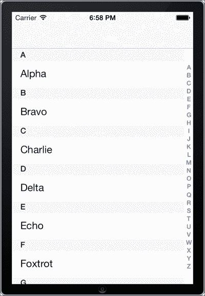

当用户在索引的任何地方触摸屏幕时，表格视图将滚动到该特定部分。

## 更多内容...

应将索引应用于具有 **普通** 样式的表格。不建议在设置了 **分组** 样式的表格上应用索引，因为索引将不易区分。

一个在表格上有索引的本地 iOS 应用程序的例子可以在本地的 *Contacts* 应用中找到。

## 参见

+   *在表格中显示数据* 的食谱

# 搜索数据

在本食谱中，我们将学习如何为表格视图中的内容提供搜索功能。

## 准备工作

在 Xamarin Studio 中创建一个新的项目，并将其命名为 `SearchTableApp`。添加 `UIViewController` 并命名为 `SearchController`。

## 如何做...

执行以下步骤：

1.  在 Interface Builder 中打开 `SearchController.xib` 文件。在 `UITableView` 中添加 **搜索栏和搜索显示控制器**。以下屏幕截图显示了在对象浏览器中选中的 `UISearchDisplayController` 对象：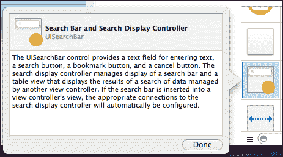

    ### 注意

    注意，在此操作之后，将自动创建并连接一些出口。我们需要大多数它们，所以我们保留它们原样。

1.  添加 `UITableView` 并将其连接到一个出口。保存文档。

1.  回到 Xamarin Studio，创建一个 `UITableViewSource` 子类，它将作为表格视图的数据源。参考本章中的 *在表格中显示数据* 食谱以获取如何执行此操作的信息。这次，确保将用于存储数据的 `List<string>` 变量是 `SearchController` 类的成员。

1.  在 `SearchController` 类中使用以下代码添加另一个 `List<string>` 变量：

    ```swift
    private List<string> filterDataList;
    ```

1.  实现一个子类，它将作为搜索显示控制器的委托对象，如下面的代码所示：

    ```swift
    private class SearchDelegate : UISearchDisplayDelegate
    {
      public SearchDelegate (TableController controller)
      {
        this.parentController = controller;
      }
      private TableController parentController;
      public override bool ShouldReloadForSearchString (UISearchDisplayController controller, string forSearchString)
      {
        this.parentController.filterDataList = this.parentController.tableData
          .Where (s => s.ToLower ().Contains (forSearchString.ToLower ()))
            .ToList ();
        this.parentController.filterDataList.Sort (delegate(string firstStr, string secondStr) {
            return firstStr.CompareTo (secondStr);
          });
        return true;
      }
    }
    ```

1.  在 `ViewDidLoad` 方法中添加以下代码，并在其中分配源和委托对象：

    ```swift
    this.TableView.Source = new TableSource (this);
    this.SearchDisplayController.SearchResultsSource = new TableSource(this);
    this.SearchDisplayController.Delegate = new SearchDelegate(this);
    ```

1.  在模拟器上编译并运行应用程序。点击搜索栏并开始输入。它将自动搜索表格并显示结果。

    你可以在 `SearchTableApp` 项目中找到完整的代码。结果将是类似于以下屏幕截图所示的表格上方的常见 iOS 搜索栏：

    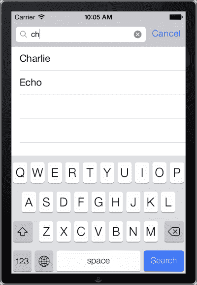

## 如何工作...

`UISearchDisplayController`类提供了一个方便的方式来搜索数据。它包含`UISearchBar`，它接受用户的输入，以及`UITableView`，它用于显示结果。在我们向视图控制器添加搜索控制器后，我们可以通过该控制器的`SearchDisplayController`属性访问它。要触发结果表格，我们必须实现`UISearchDisplayDelegate`并覆盖其`ShouldReloadForSearchString`（返回一个布尔值）方法，如下所示：

```swift
private class SearchDelegate : UISearchDisplayDelegate
```

在`ShouldReloadForSearchString`方法覆盖中，我们搜索我们的数据源，根据其`forSearchString`参数将过滤后的结果保存到新的数据源中：

```swift
this.parentController.filterDataList = this.parentController.tableData
  .Where (s => s.ToLower ().Contains (forSearchString.ToLower ()))
  .ToList ();
```

然后，我们按字母顺序排序结果并返回`true`，以便搜索控制器的表格重新加载数据，如下所示：

```swift
this.parentController.filterDataList.Sort (delegate(string firstStr, string secondStr) {
  return firstStr.CompareTo (secondStr);
});
return true;
```

搜索控制器的表格视图也需要一个源对象。在这个例子中，我们将其设置为为我们的表格创建的相同对象，如下所示：

```swift
this.TableView.Source = new TableSource (this);
this.SearchDisplayController.SearchResultsSource = new TableSource(this);
```

由于我们使用的是相同对象的实例，我们需要对其中的某些内容进行修改，以便根据哪个表格调用它来显示数据。例如，`RowsInSection`方法如下所示：

```swift
public override int RowsInSection (UITableView tableview, int section)
{
  if (tableview.Equals (this.parentController.TableView))
  {
    return this.parentController.tableData.Count;
  } else
  {
    return this.parentController.filterDataList.Count;
  }
}
```

以这种方式，我们根据哪个表格调用该方法来返回行数。同样，我们还需要在`GetCell`方法中设置每个单元格的文本标签，如下所示：

```swift
if (tableView.Equals (this.parentController.TableView))
{
  cell.TextLabel.Text = this.parentController.tableData[rowIndex];
} else
{
  cell.TextLabel.Text = this.parentController.filterDataList[rowIndex];
}
```

## 更多...

当用户点击搜索栏时，键盘出现，使搜索控制器变得活跃。要使其不活跃，我们可以挂钩到搜索栏的`SearchButtonClicked`事件。当用户点击键盘上的**搜索**按钮时，此事件将被触发：

```swift
this.SearchDisplayController.SearchBar.SearchButtonClicked += (s, e) => {
  this.SearchDisplayController.SetActive(false, true);
};
```

`SetActive`方法是我们用来启用或禁用搜索控制器的方法。

## 参见

+   *在表格中显示数据*的食谱

+   *表格索引*的食谱

# 创建简单的网页浏览器

在这个食谱中，我们将讨论使用`UIWebView`类显示在线内容。

## 准备工作

在 Xamarin Studio 中创建一个新的**单视图应用**项目，并将其命名为`WebBrowserApp`。

## 如何做到...

执行以下步骤：

1.  在 Interface Builder 中打开`WebBrowserAppViewController.xib`文件，并在主视图中添加一个`UIWebView`对象。为其创建并连接一个名为`webView`的出口。保存文档。

1.  如下代码所示，在`WebBrowserAppViewController`类中覆盖`ViewDidAppear`方法：

    ```swift
    public override void ViewDidAppear (bool animated)
    {
      NSUrl url = new NSUrl ("http://software.tavlikos.com");
      NSUrlRequest urlRequest = new NSUrlRequest (url);
      this.webView.LoadRequest (urlRequest);
    }
    ```

1.  在模拟器上编译并运行应用。观察屏幕上网站加载的情况！

## 它是如何工作的...

`UIWebView`类是 iOS SDK 的网页浏览器控件。要加载网页内容，我们只需调用其`LoadRequest`方法，该方法接受一个`NSUrlRequest`类型的参数。`NSUrlRequest`对象包含我们想要加载的 URL，如下所示：

```swift
NSUrl url = new NSUrl ("http://software.tavlikos.com");
```

## 更多...

`UIWebView`类包含一些非常有用的事件，如下所示：

+   `LoadStarted`：当控件开始加载内容时触发

+   `LoadFinished`：当内容成功加载完成后触发

+   `LoadError`：当内容加载失败时触发

### 缩放内容

`UIWebView` 的另一个重要功能是内容的自动缩放。可以通过将其 `ScalePageToFit` 属性设置为 `true` 来激活它。

### UIWebView 支持的文件

除了网页之外，`UIWebView` 控件还可以使用以下类型的文件来显示本地内容：

+   电子表格（`.xls`）

+   演示文稿（`.key.zip`）

+   数字（`.numbers.zip`）

+   页面（`.pages.zip`）

+   PDF（`.pdf`）

+   幻灯片（`.ppt`）

+   文档（`.doc`）

+   富文本格式（`.rtf`）

+   富文本格式目录（`.rtfd.zip`）

+   演示文稿（`.key`）

+   数字（`.numbers`）

+   页面（`.pages`）

# 以网格形式显示数据

在这个菜谱中，我们将讨论使用 `UICollectionView` 对象以网格布局显示数据。`UICollectionView` 类是在 iOS 6 中引入的，这是一个被 iOS 开发人员忽视的非常有用的控件。在 `UICollectionView` 之前，显示网格数据的唯一方法是通过创建自定义控件，这并不是一个很容易的任务。

## 准备工作

在 Xamarin Studio 中创建一个新的项目，并将其命名为 `CollectionViewApp`。我们还需要一些内容来显示，所以将一张图片添加到项目中。

## 如何操作...

执行以下步骤：

1.  在 Interface Builder 中打开 `CollectionViewAppViewController.xib` 文件，并在其主视图中添加一个 `UICollectionView`。以下截图显示了对象浏览器中的对象：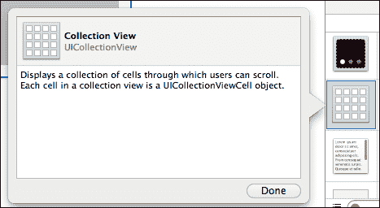

1.  回到 Xamarin Studio，添加以下类：

    ```swift
    public class ImageCell : UICollectionViewCell {
      public const string CELLID = "ImageCell";
      public ImageCell(IntPtr handle) : base(handle) {
        this.Initialize();
      }
      public UIImageView ImageView { get; private set; }
      private void Initialize() {
        this.ImageView = new UIImageView(this.ContentView.Bounds);
        this.ContentView.AddSubview(this.ImageView);
      }
    }
    ```

1.  在控制器中添加以下嵌套类：

    ```swift
    private class CollectionSource : UICollectionViewSource {
      public CollectionSource(CollectionViewAppViewController parentController) {
        this.parentController = parentController;
      }
      private CollectionViewAppViewController parentController;
      public override int GetItemsCount(UICollectionView collectionView, int section) {
        return this.parentController.collectionData.Count;
      }
      public override UICollectionViewCell GetCell(UICollectionView collectionView, NSIndexPath indexPath) {
        ImageCell cell = (ImageCell)collectionView.DeqeueReusableCell((NSString)ImageCell.Cell, indexPath);
        cell.ImageView.Image = this.parentController.collectionData[indexPath.Row];
        return cell;
      }
    }
    ```

1.  在控制器中添加以下代码：

    ```swift
    private List<UIImage> collectionData;
    public override ViewDidLoad() {
      base.ViewDidLoad();
      this.collectionData = new List<UIImage>();
      for (int i = 0; i < 30; i++) {
        this.collectionData.Add(UIImage.FromBundle("shapes"));
      }
      this.collectionView.RegisterClassForCell(typeof(ImageCell), (NSString)ImageCell.CELLID);
      this.collectionView.Source = new CollectionSource(this);
    }
    ```

1.  在模拟器上编译并运行应用程序。结果应类似于以下截图所示：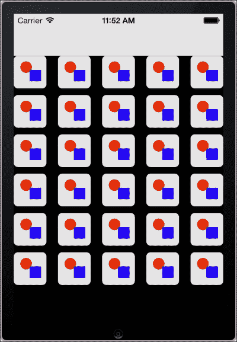

## 它是如何工作的...

`UICollectionView` 类的使用方式与 `UITableView` 类似。主要区别在于它不是在单列中显示数据，而是在网格排列中显示。`UICollectionViewSource` 类被重写以提供集合视图的数据源，如下面的代码所示：

```swift
private class CollectionSource : UICollectionViewSource {
```

就像在 `UITableViewSource` 中的表格视图一样，我们需要提供网格中的项目数量以及单个项目的对象，在这种情况下是 `UICollectionViewCell`，如下面的代码所示：

```swift
public override int GetItemsCount(UICollectionView collectionView, int section) {
  return this.parentController.collectionData.Count;
}
public override UICollectionViewCell GetCell(UICollectionView collectionView, NSIndexPath indexPath) {
  ImageCell cell = (ImageCell)collectionView.DeqeueReusableCell((NSString)ImageCell.Cell, indexPath);
  cell.ImageView.Image = this.parentController.collectionData[indexPath.Row];
  return cell;
}
```

注意，与 `UITableViewCell` 不同，`UICollectionViewCell` 类为我们提供的功能不多。因此，我们必须重写它来为集合创建自己的单元格，如下面的代码所示：

```swift
public class ImageCell : UICollectionViewCell
```

由于我们使用的是自定义单元格，我们必须通过 `RegisterClassForCell` 方法让集合视图知道它，如下面的代码所示：

```swift
this.collectionView.RegisterClassForCell(typeof(ImageCell), (NSString)ImageCell.CELLID);
```

## 还有更多...

除了使用`UICollectionViewCell`类显示单个项目外，`UICollectionView`还支持显示`UICollectionReusableView`类型的辅助视图。这些视图基本上代表集合视图中各部分的头部或尾部。

要提供辅助视图，我们需要创建自己的子类，使用以下代码：

```swift
public class CollectionHeader : UICollectionReusableView
```

然后我们需要在集合源中重写以下方法（此方法将返回我们想要的辅助视图）：

```swift
public override UICollectionReusableView GetViewForSupplementaryElement(UICollectionView collectionView, NSString elementKind, NSIndexPath indexPath) {
  CollectionHeader header = (CollectionHeader)collectionView.DequeueReusableSupplementaryView(UICollectionElementKindSection.Header, viewIdentifier, indexPath);
  return header;
}
```

`elementKind`参数是`UICollectionElementKindSection`枚举的`NSString`表示，它包含两个值：`Footer`和`Header`。

最后，我们需要调用`RegisterClassForSupplementaryView`方法来将我们的自定义类注册到集合视图中，使用以下代码：

```swift
this.collectionView.RegisterClassForSupplementaryView(typeof(CollectionHeader), UICollectionElementKindSection.Header, viewIdentifier);
```

### 更多关于 UICollectionView 的信息

在 Xamarin 网站上可以找到一个关于`UICollectionView`的优秀教程：[`docs.xamarin.com/guides/ios/user_interface/introduction_to_collection_views/`](http://docs.xamarin.com/guides/ios/user_interface/introduction_to_collection_views/)。

## 相关阅读

+   *在表格中显示数据*的食谱

+   *自定义行*的食谱

# 自定义网格

在这个食谱中，我们将学习如何自定义集合视图的显示。

## 准备工作

在这个食谱中，我们将处理我们在*在网格中显示数据*食谱中创建的`CollectionViewApp`项目。在 Xamarin Studio 中打开项目。

## 如何操作...

执行以下步骤：

1.  在控制器的`ViewDidLoad`方法中，添加以下代码：

    ```swift
    UICollectionViewFlowLayout flowLayout = new UICollectionViewFlowLayout();
    flowLayout.MinimumLineSpacing = 20f;
    flowLayout.MinimumInteritemSpacing = 4f;
    flowLayout.SectionInset = new UIEdgeInset(4f, 4f, 4f, 4f);
    flowLayout.ItemSize = new SizeF(20f, 20f);
    this.collectionView.CollectionViewLayout = flowLayout;
    ```

1.  在模拟器上编译并运行应用。结果应该与以下截图所示类似：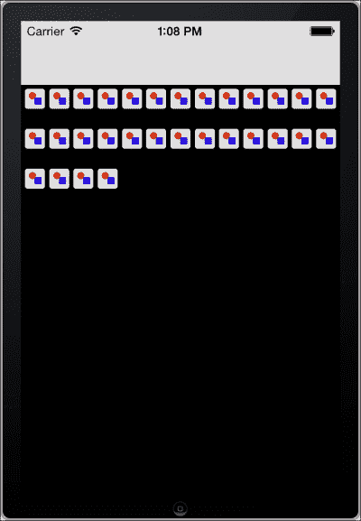

## 它是如何工作的...

可以通过`UICollectionViewLayout`类自定义集合视图的布局。`UICollectionViewFlowLayout`是这个类的子类，提供了一个简单的布局，我们可以使用它。

通过设置特定的属性，我们定义了集合视图将如何排列单元格。以下列表描述了我们在项目中设置的属性：

+   `MinimumLineSpacing`：这是网格中行之间的最小距离

+   `MinimumInteritemSpacing`：这是网格中单个项目之间的最小距离

+   `SectionInset`：这是集合视图中每个部分周围应该留空的区域

+   `ItemSize`：这是集合视图中每个项目的尺寸

以下图像显示了每个属性在集合视图中的对应关系：

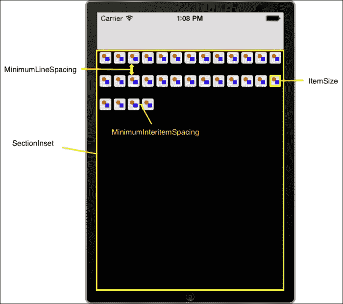

## 更多内容...

设置集合布局对象的`ItemSize`参数将调整集合视图中所有项目的尺寸。我们可以在`CollectionSource`子类中提供以下方法来为每个单元格单独设置尺寸：

```swift
[Export("collectionView:layout:sizeForItemAtIndexPath:")]
public SizeF GetSizeForItem(UICollectionView collectionView, UICollectionViewLayout layout, NSIndexPath indexPath) {
  if (indexPath.Item > 11 && indexPath.Item < 19) {
    return new SizeF(40f, 40f);
  } else {
    return new SizeF(20f, 20f);
  }
}
```

将前面的方法添加到我们自己的`CollectionSource`子类中，将得到以下截图所示的结果：

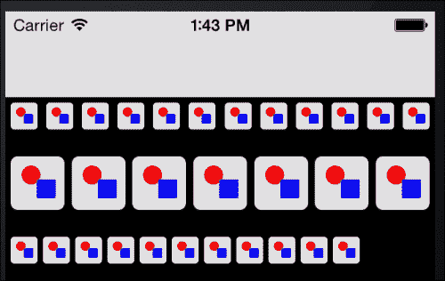

## 参见

+   *在网格中显示数据* 的配方
