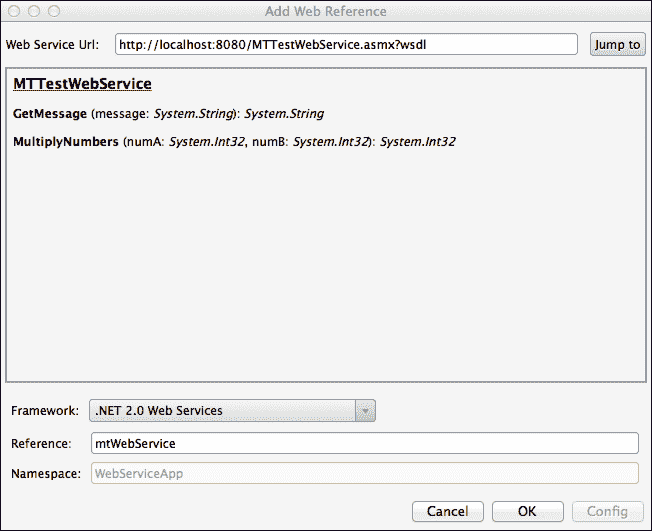

# 第六章。网络服务

在本章中，我们将涵盖以下主题：

+   消费网络服务

+   消费 REST 服务

+   与原生 API 通信

+   使用 WCF 服务

# 简介

向用户提供在线信息是移动开发的关键部分。在本章中，我们将讨论开发与网络服务通信的应用程序以提供信息。我们将了解如何基于 SOAP 消费和调用网络服务。我们还将讨论如何使用 REST 网络服务以及如何从网络服务器解析流行的 JSON 数据格式。最后但同样重要的是，我们将探讨如何使用原生 iOS API 进行通信以及如何使用 WCF 服务。

本章中的所有示例都使用**XSP**，这是一个与 Mono 框架一起提供的轻量级网络服务器；因此，无需在线或本地运行一个实时网络服务即可使用提供的代码。

# 消费网络服务

在本菜谱中，我们将学习如何在 Xamarin.iOS 项目中使用 SOAP 网络服务。

## 准备工作

在 Xamarin Studio 中创建一个新的**单视图应用程序**项目，并将其命名为`WebServiceApp`。本章的代码包含一个名为`MTWebService`的网络服务项目。这就是我们将要使用的网络服务。

要使用`MTWebService`网络服务，我们需要一个网络服务器。Mono 框架为我们提供了一个用于测试目的的 XSP 轻量级网络服务器。打开一个终端，并键入以下命令以进入网络服务的目录，将`<code_directory>`替换为下载的代码所在的路径：

```swift
cd <code_directory>/CH06_code/MTWebService/MTWebService

```

在提示符中键入`xsp4`以运行 XSP 网络服务器。您将看到类似于以下输出的内容：

```swift
xsp4
Listening on address: 0.0.0.0
Root directory: /Users/dtavlikos/projects/CH06_code/MTWebService/MTWebService
Listening on port: 8080 (non-secure)
Hit Return to stop the server.

```

网络服务器现在正在运行。

## 如何操作...

完成此菜谱的以下步骤：

1.  我们需要在项目中添加对网络服务的引用。在**解决方案**面板中的项目上右键单击，然后导航到**添加** | **添加 Web 引用**。在随后显示的对话框中，在**Web 服务 URL**字段中添加`http://localhost:8080/MTTestWebService.asmx?wsdl`，然后单击**转到**按钮。

1.  在**框架**组合框中选择**.NET 2.0 Web Services**。

1.  将**引用**字段设置为`mtWebService`。

1.  在所有设置正确输入后，对话框应类似于以下截图。单击**确定**按钮以添加 Web 引用：

1.  向`WebServiceAppViewController`添加一个按钮和标签。

1.  在控制器的`ViewDidLoad`方法中，添加以下代码：

    ```swift
    this.btnFetch.TouchUpInside += (s, e) => {
      using (MTTestWebService webService = new MTTestWebService())
      {
        this.lblOutput.Text = webService.GetMessage ("Hello Web Service!");
      }
    };
    ```

1.  将以下`using`指令添加到`WebServiceAppViewController.cs`文件中：

    ```swift
    using WebServiceApp.mtWebService;
    ```

1.  在模拟器上编译并运行应用程序。单击**获取**按钮，输出应显示在屏幕上。

## 它是如何工作的...

Xamarin.iOS 应用可以像 .NET 桌面应用程序一样消费 Web 服务。XSP 轻量级 Web 服务器在默认情况下通过安装 Mono 框架安装，这是 Xamarin 安装的要求。在终端中运行 `xsp4` 命令且不带任何参数时，它默认将其基本目录设置为当前目录并开始监听 `8080` 端口。如果 Web 服务器已启动，可以在浏览器中输入 `http://localhost:8080/MTTestWebService.asmx` 来查看 Web 服务描述。

Xamarin Studio 从提供的 URL 读取 **WSDL** 信息并创建必要的代理，这将允许我们在项目中使用 Web 服务。

然后，我们将 **Framework** 值设置为 **.NET 2.0 Web Services** 并提供一个 **Reference** 名称，这将反映 Web 引用的命名空间。为了在我们的代码中使用 Web 服务，我们实例化它，然后只需调用我们感兴趣的方法：

```swift
this.lblOutput.Text = webService.GetMessage ("Hello Web Service!");
```

## 更多内容...

除了使用本地托管 Web 服务外，互联网上还有许多示例 Web 服务。简单的搜索会产生许多结果。

### 异步调用 Web 服务方法

创建的代理还包含基于 Begin/End 和用于调用 Web 服务异步的事件的方法。以下示例展示了如何使用基于事件的方法：

```swift
MTTestWebService webService = new MTTestWebService();
webService.GetMessageCompleted += (sender, args) => this.InvokeOnMainThread(() => this.lblOutput.Text = args.Result);
webService.GetMessageAsync("Hello Web Service!");
```

注意在事件处理程序内部调用的 `InvokeOnMainThread`；它是在一个单独的线程上被调用的。因此，如果我们想在其中访问主线程，我们需要用 `InvokeOnMainThread` 来包装我们的调用。

### XSP 关闭

要关闭 XSP Web 服务器，只需在执行它的终端中点击 *Return* 键。

## 参见

+   *与原生 API 通信* 配方

# 消费 REST 服务

在这个配方中，我们将讨论如何正确使用和消费 REST 服务与 Xamarin.iOS。

## 准备工作

在 Xamarin Studio 中创建一个新的 **Single View Application** 并命名为 `ForecastApp`。在这个配方中，我们将使用 **Open Meteo Foundation** REST API。使用此 API 受此页面中声明的使用条款约束：[`openmeteofoundation.org/terms-of-use`](http://openmeteofoundation.org/terms-of-use)。

## 如何操作...

执行以下步骤以完成此配方：

1.  在 `ForecastAppViewController` 上添加一个标签和一个按钮。确保标签的 **Lines** 属性设置为至少三行。

1.  在控制器的 `ViewDidLoad` 方法中添加以下代码：

    ```swift
    this.btnForecast.TouchUpInside += async (sender, e) => {

      HttpClient client = new HttpClient();
      string jsonResponse = await client.GetStringAsync("http://api.ometfn.net/0.1/forecast/eu12/46.5,6.32/now.json");
      JsonValue jsonObj = JsonValue.Parse(jsonResponse);
      JsonArray tempArray = (JsonArray)jsonObj["temp"];
      double temp = (double)tempArray[0];
      JsonArray windSpeedArray = (JsonArray)jsonObj["wind_10m_ground_speed"];
      double windSpeed = (double)windSpeedArray[0];
      this.lblOutput.Text = string.Format("Temperature: {0}\nWind speed: {1}", temp, windSpeed);
    };
    ```

1.  将 `System.Net.Http` 和 `System.Json` 引用添加到项目中。别忘了将相应的 `using` 指令包含到 `ForecastAppViewcontroller.cs` 文件中。

1.  在模拟器上编译并运行应用程序。点击 **获取预报** 按钮以在屏幕上显示当前温度和风速。

## 它是如何工作的...

在这个菜谱中，我们创建了一个使用 REST API 获取位置当前预报的应用程序。我们使用`async`/`await`模式，允许我们异步连接和检索数据。这有助于确保我们的应用程序在连接到检索数据时不会冻结。

由于所有操作都是在点击按钮时发生的，因此其`TouchUpInside`处理方法需要标记为`async`，如下所示：

```swift
this.btnForecast.TouchUpInside += async (sender, e) => {
//..
```

然后，我们使用`HttpClient`类，它是`System.Net.Http`命名空间的一部分，为我们提供了连接到端点的异步方法，如下所示：

```swift
HttpClient client = new HttpClient();
  string jsonResponse = await client.GetStringAsync("http://api.ometfn.net/0.1/forecast/eu12/46.5,6.32/now.json");
```

我们将端点传递给`GetStringAsync`方法，并返回一个 JSON 响应字符串。

在获取响应后，我们需要解析它以从中提取所需的信息。我们通过使用`System.Json`命名空间来完成此操作。该命名空间包含一组简单的类，允许我们解析 JSON 字符串，如下所示：

```swift
JsonValue jsonObj = JsonValue.Parse(jsonResponse);
```

温度包含在 JSON 响应的`temp`键下，该键包含一个数组，尽管只有一个条目，如下所示：

```swift
JsonArray tempArray = (JsonArray)jsonObj["temp"];
double temp = (double)tempArray[0];
```

在我们从 JSON 响应中读取所需的信息后，我们按以下方式显示它：

```swift
this.lblOutput.Text = string.Format("Temperature: {0}\nWind speed: {1}", temp, windSpeed);
```

## 更多内容...

`System.Json`命名空间对于解析简单的 JSON 字符串非常有帮助。然而，如果我们必须解析大型且更复杂的对象，事情可能会变得非常复杂。我们可以下载并使用在 Xamarin.iOS 项目中的一些开源库。以下是最受欢迎的几个：

+   **Andrew Young 的 NewtonSoft Json.NET 的 Xamarin 端口**：即使这个版本已经过时，它对于 Xamarin 项目来说仍然完全可用。您可以在[`github.com/ayoung/Newtonsoft.Json`](https://github.com/ayoung/Newtonsoft.Json)找到该页面。

+   **ServiceStack.Text**：您可以在[`github.com/ServiceStack/ServiceStack.Text`](https://github.com/ServiceStack/ServiceStack.Text)找到该页面。

## 参见

+   *消费 Web 服务*菜谱

# 与原生 API 通信

在这个菜谱中，我们将讨论使用原生 iOS API 连接和消费 REST 服务。

## 准备工作

对于这个菜谱，我们将基于之前菜谱中创建的`ForecastApp`，即*消费 REST 服务*，进行工作。在 Xamarin Studio 中打开项目。

## 如何做到这一点...

执行以下步骤：

1.  在`ViewDidLoad`方法中注释掉代码并添加以下代码：

    ```swift
    this.btnForecast.TouchUpInside += (sender, e) => {
      NSUrlRequest request = new NSUrlRequest(new NSUrl("http://api.ometfn.net/0.1/forecast/eu12/46.5,6.32/now.json"));
      NSUrlConnection connection = new NSUrlConnection(request, new ConnectionDelegate((response) => {
        JsonValue jsonObj = JsonValue.Parse(response);
        JsonArray tempArray = (JsonArray)jsonObj["temp"];
        double temp = (double)tempArray[0];
        JsonArray windSpeedArray = (JsonArray)jsonObj["wind_10m_ground_speed"];
        double windSpeed = (double)windSpeedArray[0];
        this.lblOutput.Text = string.Format("Temperature: { 0}\ nWind speed: { 1}", temp, windSpeed);
        }));
      connection.Start();
    };
    ```

1.  将以下类添加到项目中：

    ```swift
    public class ConnectionDelegate : NSURLConnectionDelegate {
      private Action<string> finishedCallback;
      private StringBuilder responseData;
      public ConnectionDelegate(Action<string> callback) {
        this.finishedCallback = callback;
        this.responseData = new StringBuilder();
      }
      public override void ReceivedData(NSUrlConnection connection, NSData data) {
        if (null != data) {
          this.responseData.Append(data.ToString());
        }
      }
      public override FinishedLoading(NSUrlConnection connection) {
        if (null != this.finishedCallback) {
          this.finishedCallback(this.responseData.ToString());
        }
        this.responseData.Clear();
      }
    }
    ```

1.  在模拟器上编译并运行应用程序。点击**获取预报**按钮以获取并显示预报数据。

## 它是如何工作的…

`NSUrlConnection`类是提供基本连接功能的原生 iOS 类。我们通过传递`NSUrlRequest`和一个代理对象来初始化它，如下所示：

```swift
NSUrlRequest request = new NSUrlRequest(new NSUrl("http://api.ometfn.net/0.1/forecast/eu12/46.5,6.32/now.json"));
  NSUrlConnection connection = new NSUrlConnection(request, new ConnectionDelegate((response) => {
```

我们创建的`ConnectionDelegate`类充当我们的`NSUrlConnection`的代理对象。在类内部，我们需要重写`ReceivedData`方法以用从服务接收到的数据填充我们的内部缓冲区，如下所示：

```swift
public override void ReceivedData(NSUrlConnection connection, NSData data) { 
```

类似于从`HttpWebResponse`的`Stream`对象中读取数据，一旦有新数据可用，就会调用`ReceivedData`方法。在`ReceivedData`内部，我们确保将数据追加到我们的缓冲区。当所有数据都已接收且响应完成时，将调用`FinishedLoading`方法，如下所示：

```swift
public override void FinishedLoading(NSUrlConnection connection) {
```

在初始化`NSUrlConnection`实例后，我们调用其`Start`方法来启动连接，如下所示：

```swift
connection.Start();
```

## 更多内容...

如果连接出现错误，`NSUrlConnectionDelegate`的`FailedWithError`方法将被调用。我们可以重写它以获取发生的错误信息，如下所示：

```swift
public override void FailedWithError(NSUrlConnection connection, NSError error) {
  if (null != error) {
    Console.WriteLine("Connection error: {0}", error.LocalizedDescription);
  }
}
```

### 同步 NSUrlConnection

使用具有委托对象的`NSUrlConnection`类意味着连接将在启动它的线程上异步进行。如果我们想启动一个同步连接，可以使用`SendSynchronousRequest`静态方法，如下所示：

```swift
NSUrlResponse response;
NSError error;
NSData data = NSUrlConnection.SendSyncrhonousRequest(request, out response, out error);
// do something with data
```

### 用户体验

如您可能已经注意到的，使用`NSUrlConnection`比使用普通的 Mono BCL 类要复杂一些。通常，在大多数场景中使用 BCL 类是最佳实践，因为它有助于我们维护一个多平台代码库，等等。

然而，在某些情况下，原生 API 非常有用，并且是唯一可用的解决方案。例如，iOS 支持在后台运行某些连接功能，这些功能只能通过原生 API 实现。

## 参见

+   *消费 REST 服务*菜谱

+   在第十二章的*在后台更新数据*菜谱中，*多任务*

# 使用 WCF 服务

在这个菜谱中，我们将学习如何使用 Xamarin.iOS 消费 WCF 服务。

### 注意

WCF 服务支持仅适用于 Xamarin 的商业和企业许可证。

## 准备工作

对于这个项目，我们需要一个正在运行的 WCF 服务。WCF 服务可以在本章的代码下载中找到。要启动服务，打开终端并转到项目的目录。通过运行`start_wcfservice.sh`shell 脚本启动服务，如下所示：

```swift
cd <code_directory>/CH06_code/WcfService/WcfService
./start_wcfservice.sh

```

服务启动后，在 Xamarin Studio 中创建一个新的**单视图应用程序**，命名为`WcfServiceApp`。还需要一台运行 Windows 的机器。

## 如何操作...

执行以下步骤：

1.  在项目中将`System.Runtime.Serialization`和`System.ServiceModel`命名空间及其对应的`using`指令添加到`WcfServiceAppViewController.cs`文件中。

1.  Xamarin.iOS 不完全支持 WCF 服务。为了生成客户端代理，我们需要在 Windows 机器上使用`slsvcutil`工具。在 Windows 的命令提示符下运行以下命令：

    ```swift
    "c:\Program Files\Microsoft SDKs\Silverlight\v3.0\Tools\slsvcutil /noconfig http://192.168.0.113:8080/WcfService.svc?wsdl"

    ```

    此命令将生成一个名为`service.cs`的 C#源文件。将此文件添加到 Xamarin.iOS 项目中。将以下突出显示代码中的 IP 地址替换为您自己的以使其正确工作。

1.  在`WcfServiceAppViewController`的视图中添加一个标签和一个按钮。在`ViewDidLoad`方法中添加以下代码：

    ```swift
    this.btnFetchData.TouchUpInside += (sender, e) => {
     WcfTestServiceClient client = new WcfTestServiceClient (new BasicHttpBinding (), new EndpointAddress ("http://192.168.0.113:8080/WcfTestService.svc"));
        client.GetBookInfoCompleted += WcfTestServiceClient_GetBookInfoCompleted;
        client.GetBookInfoAsync ();
        UIApplication.SharedApplication.NetworkActivityIndicatorVisible = true;
    };
    ```

1.  最后，添加以下方法：

    ```swift
    private void WcfTestServiceClient_GetBookInfoCompleted (object sender, GetBookInfoCompletedEventArgs e)
    {
      this.InvokeOnMainThread (delegate {
        UIApplication.SharedApplication.NetworkActivityIndicatorVisible = false;
        this.lblResponse.Text = String.Format ("Book title: {0}\nAuthor: {1}", e.Result.Title, e.Result.Name);
      } );
    }
    ```

1.  在模拟器上编译并运行应用程序。点击按钮，观察从服务返回的数据填充到标签中。

## 它是如何工作的...

Xamarin.iOS 依赖于 Mono Framework 对 WCF 服务的支持，但这并不完整。尽管如此，WCF 服务可以在 iOS 应用程序中使用，这使得 Xamarin.iOS 对.NET 开发者更具吸引力。

然而，没有工具可以在 Mac 上创建客户端代理，Xamarin Studio 也无法创建合适的代理；因此，我们需要访问一台 Windows 机器来使用 Silverlight 服务模型代理生成工具（`SLsvcUtil.exe`）来完成这项工作。该工具生成的源文件允许我们在项目中使用 WCF 服务。

使用 Silverlight 版本 3.0 的`slsvcutil`创建客户端代理非常重要。

除了 Mono Framework 对 WCF 服务的支持外，还有一个限制，那就是 iOS 上不允许动态代码生成。这使得任何依赖于`System.Reflection.Emit`命名空间中的代码都无法使用。实际上，在 Xamarin.iOS 中，`System.Reflection.Emit`命名空间根本不可用。

在 Mac 上复制生成的文件后，我们将其添加到项目中，我们就准备好使用 WCF 服务了。前面高亮显示的代码显示了如何实例化服务对象。请注意，服务对象的默认构造函数不能使用，因为 Xamarin.iOS 不支持`System.Configuration`命名空间。

### 注意

实际的通信是通过在设置相应完成事件的处理器后调用方法的异步实现来进行的。请注意，在这种情况下，没有使用同步调用或`BeginInvoke`和`EndInvoke`模式的替代方案：

```swift
client.GetBookInfoCompleted += WcfTestServiceClient_GetBookInfoCompleted;
client.GetBookInfoAsync ();
```

可以通过指定的`EventArgs`派生类的`Result`属性检索服务返回的结果：

```swift
this.labelResult.Text = String.Format ("Book title: {0}\nAuthor: {1}", e.Result.Title, e.Result.Name);
```

## 更多...

当调试一个消费 WCF 服务的项目时，请记住设置服务运行在的机器的地址，而不是 localhost 或 127.0.0.1。这是因为当我们运行应用程序在设备上时，应用程序将无法连接到服务。

### 关于 Xamarin Studio 的 WCF 支持的更多信息

在“*消费 Web 服务*”配方中显示的“**添加 Web 引用**”窗口中，可以通过 Xamarin Studio 添加一个 WCF Web 引用。然而，它尚未完成，并且它生成的代理将无法工作。

### WCF 服务创建

从`WcfService`服务返回的对象以及实际的服务本身完全是在 Mac 上作为一个 Xamarin Studio 项目创建的。由于没有 WCF 项目模板，使用了**空项目**模板。

## 参见

+   *消费 Web 服务*配方
