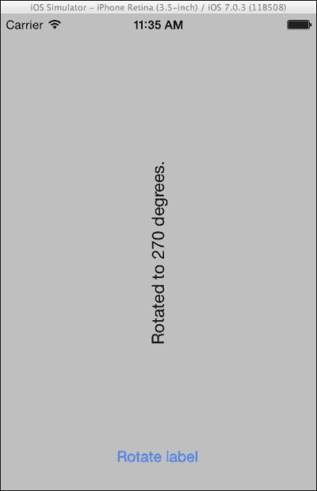
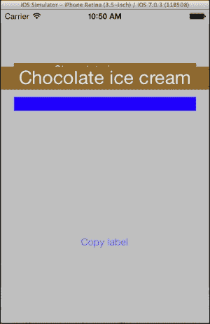
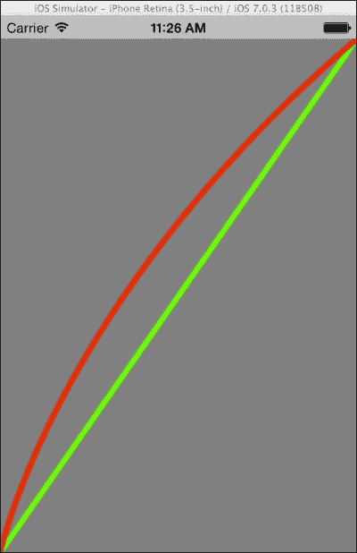
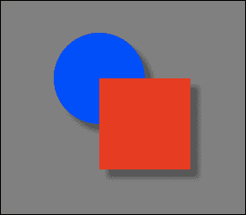
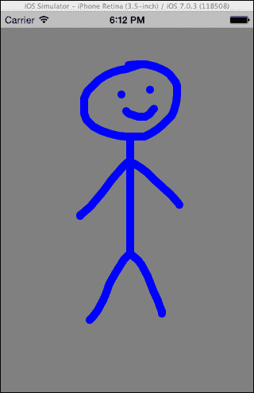

# 第十一章. 图形和动画

在这一章中，我们将涵盖以下主题：

+   动画视图

+   变换视图

+   动画图像

+   动画层

+   绘制线条和曲线

+   绘制形状

+   绘制文本

+   一个简单的绘图应用

+   创建图像上下文

# 简介

在这一章中，我们将讨论自定义绘制和动画。iOS SDK 包含两个用于这些任务的非常有用的框架：Core Graphics 和 Core Animation。

这两个框架简化了在 UI 元素上动画化和绘制 2D 图形的过程。有效使用这两个框架将在平淡无奇和令人惊叹的应用之间产生差异。毕竟，这两个框架在使 iOS 平台在其类别中独一无二方面发挥着非常重要的作用。

我们将学习如何为控件提供简单甚至更复杂的动画，以提供独特的用户体验。我们还将看到如何在屏幕上自定义绘制线条、曲线、形状和文本。最后，通过所有提供的示例，我们将创建两个绘图应用。

# 动画视图

在这个菜谱中，我们将学习如何利用 UIKit 动画在屏幕上移动 `UILabel`。

## 准备工作

在 Xamarin Studio 中创建一个新的 **Single View Application** 并将其命名为 `ViewAnimationApp`。在控制器的视图中添加一个标签和按钮。

## 如何做...

执行以下步骤：

1.  在 `ViewDidLoad` 方法中输入以下代码：

    ```swift
    this.lblOutput.BackgroundColor = UIColor.Green;
    this.btnAnimate.TouchUpInside += (sender, e) => {
      RectangleF labelFrame = this.lblOutput.Frame;
      labelFrame.Y = 380f;
      UIView.Animate(1d, 0d, UIViewAnimationOptions.CurveEaseInOut, 
        () => this.lblOutput.Frame = labelFrame, 
        () => {
          this.lblOutput.Text = "Animation ended!";
          this.lblOutput.BackgroundColor = UIColor.Red;
        });
    };
    ```

1.  在模拟器上编译并运行应用。点击 **Animate!** 按钮，观察标签过渡到视图的下半部分。

## 它是如何工作的...

`UIView` 类包含许多提供动画功能的静态方法。在这个例子中，我们通过动画简单地改变标签的位置。

要动画化视图的变化，我们调用静态的 `UIView.Animate` 方法，如下所示：

```swift
UIView.Animate(1d, 0d, UIViewAnimationOptions.CurveEaseInOut, 
    () => this.lblOutput.Frame = labelFrame, 
    () => {
      this.lblOutput.Text = "Animation ended!";
      this.lblOutput.BackgroundColor = UIColor.Red;
    });
```

以下列表解释了 `UIView.Animate` 方法的参数，分别如下：

+   **持续时间**: 这指定了动画的持续时间（以秒为单位）。

+   **延迟**: 这表示动画开始前的秒数。将其设置为零以使动画立即开始。

+   **选项**: 这包括动画的各种选项。在这个例子中，我们传递 `UIViewAnimationOptions.CurveEaseInOut`，这将对动画应用一个缓动曲线。

+   **动画**: 这是一个包含将要动画化更改的 `NSAction` 代理。在这个例子中，我们将修改后的框架设置为标签，如下所示：

    ```swift
    () => this.lblOutput.Frame = labelFrame,
    ```

+   **完成**: 这是一个 `NSAction` 代理，动画完成后将被调用。

我们可以组合多个 `UIViewAnimationOptions` 值。例如，如果我们想使动画无限重复，我们将传递 `UIViewAnimationOptions.CurveEaseInOut | UIViewAnimationOptions.Repeat`。

## 更多内容...

Xamarin.iOS 还为 `UIView` 动画提供了一个异步方法。该方法如下：

```swift
await UIView.AnimateAsync(1, () => this.lblOutput.Frame = labelFrame);
```

然而，异步方法中没有 `delay` 和 `options` 参数。

### 可动画属性

UIKit 动画支持一组特定的 `UIView` 属性。这些属性被称为 **可动画属性**。以下是可以动画化的 `UIView` 属性列表：

+   `Frame`

+   `Bounds`

+   `Center`

+   `Transform`

+   `Alpha`

+   `BackgroundColor`

+   `ContentStretch`

# 转换视图

在这个菜谱中，我们将通过应用转换来旋转 `UILabel`。此外，旋转将是动画化的。

## 准备工作

在 Xamarin Studio 中创建一个新的 **单视图应用程序**，并将其命名为 `TransformViewApp`。在控制器中添加一个标签和一个按钮。

## 如何实现...

执行以下步骤：

1.  在 `TransformViewAppViewController.cs` 文件中添加 `MonoTouch.CoreGraphics` 命名空间如下：

    ```swift
    using MonoTouch.CoreGraphics;
    ```

1.  在 `TransformViewAppViewController` 类中输入以下 `ViewDidLoad` 方法：

    ```swift
    private double rotationAngle;
    public override void ViewDidLoad ()
    {
      base.ViewDidLoad ();
      this.btnRotate.TouchUpInside += async (sender, e) => {
        this.rotationAngle += 90;
        CGAffineTransform rotation = 
        CGAffineTransform.MakeRotation((float)this.DegreesToRadians(this.rotationAngle));
        await UIView.AnimateAsync(0.5d, () => this.lblOutput.Transform = rotation);
        this.lblOutput.Text = string.Format("Rotated to {0} degrees.", this.rotationAngle);
        if (this.rotationAngle >= 360) {
          this.rotationAngle = 0;
          this.lblOutput.Transform = CGAffineTransform.MakeIdentity();
        }
      };
    }
    ```

1.  添加以下方法：

    ```swift
    public double DegreesToRadians(double degrees)
    {
      return (degrees * Math.PI / 180);
    }
    ```

1.  在模拟器上编译并运行应用程序。点击按钮并观察标签旋转。以下截图显示了标签旋转了 270 度：

## 它是如何工作的...

`MonoTouch.CoreGraphics` 命名空间是 `CoreGraphics` 框架的包装器。这个框架是 iOS 的基本图形框架。

要旋转一个视图，我们需要一个转换对象，该对象将通过视图的 `Transform` 属性应用如下：

```swift
CGAffineTransform rotation = CGAffineTransform.MakeRotation((float)this.DegreesToRadians(this.rotationAngle));
```

转换对象是 `CGAffineTransform` 类的实例，并通过 `MakeRotation` 静态方法初始化。此方法接受一个浮点值，表示要应用的旋转角度，以弧度为单位。可以使用 `DegreesToRadians` 方法将度转换为弧度。创建转换对象后，我们将其分配给标签的 `Transform` 属性，如下所示：

```swift
await UIView.AnimateAsync(0.5d, () => this.lblOutput.Transform = rotation);
```

注意，每次按钮被按下时，我们需要增加旋转角度，因为我们应用的转换不会被自动增加。如果我们应用另一个具有相同角度的旋转转换对象，将没有效果，因为它基本上是相同的转换。

当标签被旋转到完整一圈（360 度）时，我们重置 `rotationAngle` 值和转换对象如下：

```swift
this.rotationAngle = 0;
this.lblOutput.Transform = CGAffineTransform.MakeIdentity();
```

`MakeIdentity` 静态方法在将转换对象应用于视图之前，创建一个身份转换对象，这是所有视图的默认转换。

## 还有更多...

`CGAffineTransform` 类包含用于创建转换对象的多种静态方法。这些方法如下：

+   `CGAffineTransformInvert`: 这将反转当前转换并返回结果

+   `MakeIdentity`: 这将创建一个身份转换

+   `MakeRotation`: 这将创建一个旋转转换

+   `MakeScale`: 这将创建一个缩放转换

+   `MakeTranslation`: 这将创建一个平移转换

+   `Multiply`: 这将两个转换相乘并返回结果

### 转换和框架

在对一个视图应用转换后，其 `Frame` 属性不应被考虑，因为其值将是未定义的。如果需要在应用转换后更改视图的大小或位置，请分别使用 `Bounds` 和 `Center` 属性。

## 参见

+   *动画视图* 和 *动画图层* 食谱

# 动画图片

在本食谱中，我们将使用 `UIImageView` 内置的动画功能创建一个简单的图片幻灯片。

## 准备工作

在 Xamarin Studio 中创建一个新的 **单视图应用程序**，并将其命名为 `ImageAnimationApp`。在控制器上添加一个 `UIImageView` 和两个按钮。此任务的示例项目包含三张图片。将两张或更多图片添加到项目中，并确保它们的 **构建操作** 设置为 **内容**。

## 如何操作...

执行以下步骤：

1.  在 `ViewDidLoad` 方法中输入以下代码：

    ```swift
    this.imgView.ContentMode = UIViewContentMode.ScaleAspectFit;
    this.imgView.AnimationImages = new UIImage[] {
      UIImage.FromFile("Kastoria.jpg"),
      UIImage.FromFile("Parga02.jpg"),
      UIImage.FromFile("Toroni.jpg")
    };
    this.imgView.AnimationDuration = 3;
    this.imgView.AnimationRepeatCount = 10;
    this.btnStart.TouchUpInside += (sender, e) => {
      if (!this.imgView.IsAnimating) {
        this.imgView.StartAnimating();
      }
    };
    this.btnStop.TouchUpInside += (sender, e) => {
      if (this.imgView.IsAnimating) {
        this.imgView.StopAnimating();
      }
    };
    ```

1.  编译并在模拟器上运行应用程序。点击 **开始动画** 按钮以开始动画。

## 它是如何工作的...

`UIImageView` 类可以接受一个 `UIImage` 对象数组，并自动按顺序显示它们。

要加载视图将动画化的图片，按照以下方式将其图片数组分配给其 `AnimationImages` 属性：

```swift
this.imageView.AnimationImages = new UIImage[] {
  UIImage.FromFile("Kastoria.jpg"),
  UIImage.FromFile("Parga02.jpg"),
  UIImage.FromFile("Toroni.jpg")
};
```

将要显示的图片的顺序由它们在数组中的顺序定义。在设置将要动画化的图片后，我们设置动画的持续时间（以秒为单位）和它将发生的次数，如下所示：

```swift
this.imageView.AnimationDuration = 3;
this.imageView.AnimationRepeatCount = 10;
```

要开始或停止动画，分别调用 `StartAnimating` 或 `StopAnimating` 方法。

## 还有更多...

`UIImageView` 类的 `AnimationImages` 和 `Image` 属性之间没有关系。在动画进行时，设置到 `UIImageView` 类的 `Image` 属性的图片将不会显示。

### 检查动画

要确定是否正在进行动画，请检查 `UIImageView` 的 `IsAnimating` 属性。

## 参见

+   *动画视图* 食谱

+   第二章中的 *显示图片* 食谱，*用户界面 – 视图*

# 动画图层

在本食谱中，我们将学习如何使用 Core Animation 框架通过动画其图层来在屏幕上复制一个 `UILabel`。

## 准备工作

在 Xamarin Studio 中创建一个新的 **单视图应用程序**，并将其命名为 `LayerAnimation`。在控制器上添加两个标签和一个按钮。为第一个标签设置文本和背景颜色，并为第二个标签设置不同的背景颜色。

## 如何操作...

执行以下步骤：

1.  在 `LayerAnimationViewController.cs` 文件中添加 `MonoTouch.CoreAnimation` 命名空间，如下所示：

    ```swift
    using MonoTouch.CoreAnimation;
    ```

1.  在类中添加一个 `CALayer` 类型的字段，如下所示：

    ```swift
    private CALayer copyLayer;
    ```

1.  在 `ViewDidLoad` 方法中添加以下代码：

    ```swift
    this.btnCopy.TouchUpInside += (s, e) => {
      this.lblTarget.Text = string.Empty;
      this.lblTarget.BackgroundColor = UIColor.Blue;
      this.copyLayer = new CALayer();
      this.copyLayer.Frame = this.lblSource.Frame;
      this.copyLayer.Contents = this.lblSource.Layer.Contents;
      this.View.Layer.AddSublayer(this.copyLayer);
      CABasicAnimation positionAnimation = CABasicAnimation.FromKeyPath("position");
      positionAnimation.To = NSValue.FromPointF(this.lblTarget.Center);
      positionAnimation.Duration = 1;
      positionAnimation.RemovedOnCompletion = true;
      positionAnimation.TimingFunction = CAMediaTimingFunction.FromName(CAMediaTimingFunction.EaseInEaseOut);
      positionAnimation.AnimationStopped += delegate {
        this.lblTarget.BackgroundColor = this.lblSource.BackgroundColor;
        this.lblTarget.Text = this.lblSource.Text;
        this.lblTarget.TextColor = this.lblSource.TextColor;
       this.copyLayer.RemoveFromSuperLayer();
      } ;
      CABasicAnimation sizeAnimation = CABasicAnimation.FromKeyPath("bounds");
      sizeAnimation.To = NSValue.FromRectangleF(new RectangleF(0f, 0f, this.lblSource.Bounds.Width * 2f, this.lblSource.Bounds.Height * 2));
      sizeAnimation.Duration = positionAnimation.Duration / 2;
      sizeAnimation.RemovedOnCompletion = true;
      sizeAnimation.AutoReverses = true;
      this.copyLayer.AddAnimation(positionAnimation, "PositionAnimation");
    this.copyLayer.AddAnimation(sizeAnimation, "SizeAnimation");
    } ;
    ```

1.  在模拟器上编译并运行应用程序。点击**复制标签**按钮，以动画方式将第一个标签的内容复制到第二个标签。以下截图是在复制过程中捕获的：

## 它是如何工作的...

`MonoTouch.CoreAnimation`命名空间是 Core Animation 框架的包装器。

每个视图都有一个`Layer`属性，它返回视图的`CALayer`对象。在这个任务中，我们正在创建一个动画，该动画以图形方式显示从标签复制到另一个标签的内容。

而不是创建另一个标签并通过`UIView`动画移动它，我们将创建一个图层并移动该图层。我们通过设置其`Frame`和`Contents`属性来创建图层；后者是从源标签的图层设置的。然后我们使用`AddSublayer`方法将图层添加到主视图的图层中。在此之后，主视图包含一个显示相同内容且位于源标签之上的图层。我们将借助以下代码完成所有这些操作：

```swift
  this.copyLayer = new CALayer();
  this.copyLayer.Frame = this.lblSource.Frame;
  this.copyLayer.Contents = this.lblSource.Layer.Contents;
  this.View.Layer.AddSublayer(this.copyLayer);
```

为了从源标签到目标标签的过渡动画，我们将使用`CABasicAnimation`类。在步骤 3 中代码的高亮部分显示了如何初始化和设置类的实例。`FromKeyPath`静态方法创建一个新的实例，接受图层属性的名称作为参数；这个名称将被动画化。`To`属性表示属性将被动画化的值。`Duration`属性表示动画的持续时间（以秒为单位），而`RemovedOnCompletion`属性声明当动画完成后应从图层中移除动画对象。`TimingFunction`属性设置动画的行为。当动画完成后，将触发`AnimationStopped`事件。在分配给它的处理程序内部，我们将源标签的内容设置为目标标签，从而完成复制。`AutoReverses`属性表示当`To`属性的值达到时，动画应该反转。正是这个属性使得标签在达到最终位置时先变大然后变小。

当动画被添加到图层时，动画开始：

```swift
this.copyLayer.AddAnimation(positionAnimation, "PositionAnimation");
this.copyLayer.AddAnimation(sizeAnimation, "SizeAnimation");
```

## 还有更多...

可以在[`developer.apple.com/library/ios/documentation/Cocoa/Conceptual/CoreAnimation_guide/Key-ValueCodingExtensions/Key-ValueCodingExtensions.html#//apple_ref/doc/uid/TP40004514-CH12-SW2`](https://developer.apple.com/library/ios/documentation/Cocoa/Conceptual/CoreAnimation_guide/Key-ValueCodingExtensions/Key-ValueCodingExtensions.html#//apple_ref/doc/uid/TP40004514-CH12-SW2)找到`FromKeyPath`方法接受的字符串列表。

除了`To`属性外，`CABasicAnimation`类还有两个用于定义动画的属性：`From`和`By`。它们都是`NSObject`类型，但实际分配给它们的值应该是`NSValue`类型。`NSValue`类包含各种静态方法用于创建其实例。

### 层

层是非常强大和高效的物体，可以用于绘制和动画。强烈建议使用层在视图中执行动画，而不是实际视图本身。

## 参见

+   *动画视图*菜谱

# 绘制线条和曲线

在这个菜谱中，我们将实现自定义绘图，在`UIView`类上绘制两条线。

## 准备工作

在 Xamarin Studio 中创建一个新的**单视图应用程序**，命名为`DrawLineApp`。

## 如何操作...

执行以下步骤：

1.  向项目中添加一个新的类，命名为`DrawingView`，并从`UIView`派生，如下所示：

    ```swift
    public class DrawingView : UIView
    ```

1.  在`DrawingView.cs`文件中添加以下`using`指令：

    ```swift
    using MonoTouch.CoreGraphics;
    using MonoTouch.UIKit;
    using System.Drawing;
    ```

1.  向类中添加以下构造函数：

    ```swift
    public DrawingView(RectangleF frame) : base(frame) {}
    ```

1.  重写`UIView`的`Draw`方法，并使用以下代码实现它：

    ```swift
    public override void Draw (RectangleF rect)
    {
      base.Draw (rect);
      Console.WriteLine("DrawingView draw!");
      CGContext context = UIGraphics.GetCurrentContext();
      context.SetLineWidth(5f);
      context.SetStrokeColorWithColor(UIColor.Green.CGColor);
      context.AddLines(new PointF[] { 
        new PointF(0f, this.Bounds.Height),
        new PointF(this.Bounds.Width, 0f)
      } );
      context.StrokePath();
      context.SetStrokeColorWithColor(UIColor.Red.CGColor);
      context.MoveTo(0, this.Bounds.Height);
      context.AddCurveToPoint(0f, this.Bounds.Height, 50f, this.Bounds.Height / 2f, this.Bounds.Width, 0f);
      context.StrokePath();
    }
    ```

1.  在`DrawLineAppViewController`的`ViewDidLoad`重写中，初始化并添加视图，如下所示：

    ```swift
    DrawingView drawingView = new DrawingView(new RectangleF(0f, 20f, this.View.Bounds.Width, this.View.Bounds.Height));
    drawingView.BackgroundColor = UIColor.Gray;
    this.View.AddSubview(drawingView);
    ```

1.  在模拟器上编译并运行应用程序。结果应该类似于以下截图所示：

## 它是如何工作的...

`MonoTouch.CoreGraphics`命名空间是围绕本地 Core Graphics 框架的包装器。Core Graphics 框架包含在视图中进行自定义绘制所需的必要对象。

要在视图中绘制，我们必须重写其`Draw(RectangleF)`方法，如下所示：

```swift
public override void Draw (RectangleF rect)
```

在`Draw`方法内部，我们需要当前图形上下文的实例，如下所示：

```swift
CGContext context = UIGraphics.GetCurrentContext();
```

图形上下文由`CGContext`类表示。`UIGraphics.GetCurrentContext`静态方法返回当前上下文的实例。

`CGContext`类包含各种方法，允许我们在视图中绘制。我们需要设置线宽、颜色，然后添加绘制类型，如下所示：

```swift
context.SetLineWidth(5f);
context.SetStrokeColorWithColor(UIColor.Green.CGColor);
context.AddLines(new PointF[] { 
  new PointF(0f, this.Bounds.Height),
  new PointF(this.Bounds.Width, 0f)
} );
```

要添加线条，我们使用接受`PointF`结构数组作为参数的`AddLines`方法，包含每条线的起点和终点。仅仅将线条添加到上下文中是不够的。为了在视图中呈现绘制，我们调用`StrokePath`方法，如下所示：

```swift
context.StrokePath();
```

要在绘制中添加另一个项目，我们相应地重复步骤。`MoveTo`方法将当前点移动，以便附加项目将有一个曲线的起点。

## 还有更多...

当运行时需要绘制视图的内容时，会调用`Draw`方法。我们只能在`Draw`方法内部获取当前图形上下文的实例。我们不应直接调用它，因为如果这样做，`UIGraphics.GetCurrentContext`方法将返回`null`。如果我们需要强制运行时调用`Draw`方法，我们需要调用`SetNeedsDisplay()`。在调用时应小心，因为绘制操作在 CPU 使用方面代价高昂。

当不需要重新绘制整个视图区域时，我们可以调用`SetNeedsDisplayInRect`方法，传递一个在视图区域坐标系中的`RectangleF`对象，以更新我们想要更新的区域。

### `UIImageView`类上的图形上下文

`UIImageView`对象的当前图形上下文保留用于绘制图像的内容。在继承自`UIImageView`的自定义视图中调用`SetNeedsDisplay`与直接调用`Draw`方法具有相同的效果。如果我们需要在自定义图像视图中绘制，我们必须要么在其上方添加另一个视图并在该视图上绘制，要么在自定义图层上绘制并将其添加到视图的主图层中。

## 参考也

+   *绘制文本*配方

+   在第二章的*创建自定义视图*配方中，*用户界面 – 视图*

# 绘制形状

按照上一个配方中的示例，我们将在屏幕上绘制一个圆和一个正方形。

## 准备工作

在 Xamarin Studio 中创建一个新的**单视图应用程序**，并将其命名为`DrawShapeApp`。向项目中添加一个自定义视图，就像我们在上一个任务中所做的那样，并将其命名为`DrawingView`。

## 如何操作...

执行以下步骤：

1.  重写`DrawingView`类的`Draw`方法，并使用以下代码实现：

    ```swift
    CGContext context = UIGraphics.GetCurrentContext();
    context.SetFillColorWithColor(UIColor.Blue.CGColor);
    context.SetShadow(new SizeF(10f, 10f), 5f);
    context.AddEllipseInRect(new RectangleF(100f, 100f, 100f, 100f));
    context.FillPath();
    context.SetFillColorWithColor(UIColor.Red.CGColor);
    context.AddRect(new RectangleF(150f, 150f, 100f, 100f));
    context.FillPath();
    ```

1.  在`DrawShapeAppViewController`类的`ViewDidLoad`方法中，使用以下代码初始化并显示视图：

    ```swift
    DrawingView drawView = new DrawingView(new RectangleF(0f, 20f, this.View.Bounds.Width, this.View.Bounds.Height));
    drawView.BackgroundColor = UIColor.DarkGray;
    this.View.AddSubview(drawView);
    ```

1.  在模拟器上编译并运行应用程序。屏幕上的结果应该类似于以下截图所示：

## 它是如何工作的...

要在视图中绘制形状，我们需要调用适当的方法。我们首先将`CGContext`实例的填充颜色设置为以下所示：

```swift
context.SetFillColorWithColor(UIColor.Blue.CGColor);
```

要绘制一个圆，我们调用`AddEllipseInRect`方法，传递一个包含圆的边界矩形的`RectangleF`对象，如下所示：

```swift
context.AddEllipseInRect(new RectangleF(100f, 100f, 100f, 100f));
```

形状将是一个椭圆还是一个绝对圆，是通过边界矩形的尺寸定义的。然后我们按照以下方式调用`FillPath`方法：

```swift
context.FillPath();
```

阴影效果由`SetShadow`方法定义如下：

```swift
context.SetShadow(new SizeF(10f, 10f), 5f);
```

第一个参数，其类型为`SizeF`，定义了阴影的偏移量，而第二个参数定义了模糊量，以点为单位。

## 还有更多...

当调用`SetShadow`方法时，所有添加到上下文中的对象都会显示阴影。要移除阴影，调用`SetShadowWithColor`方法，传递一个完全透明的颜色或为颜色参数传递 null。

### 透明颜色

要用透明颜色填充形状，创建一个具有适当值的`CGColor`实例，如下所示：

```swift
context.SetFillColorWithColor(new CGColor(1f, 0f, 0f, 0.5f));
```

这将创建一个红色，其 alpha 值设置为 50%。

## 参见

+   *绘制线条和曲线*食谱

# 绘制文本

在本食谱中，我们将学习如何在视图中绘制带有轮廓的样式文本。

## 准备工作

在 Xamarin Studio 中创建一个新的**单视图应用程序**，并将其命名为`DrawTextApp`。向项目中添加一个自定义视图，类似于我们在前面的食谱中创建的，并将其命名为`DrawingView`。

## 如何实现...

执行以下步骤：

1.  在`DrawingView`类中实现以下`Draw`方法重写：

    ```swift
    CGContext context = UIGraphics.GetCurrentContext();
    PointF location = new PointF(10f, 100f);
    UIFont font = UIFont.FromName("Verdana-Bold", 28f);
    NSString drawText = new NSString("This text is drawn!");
    context.SetTextDrawingMode(CGTextDrawingMode.Stroke);
    context.SetStrokeColorWithColor(UIColor.Black.CGColor);
    context.SetLineWidth(4f);
    drawText.DrawString(location, font);
    context.SetTextDrawingMode(CGTextDrawingMode.Fill);
    context.SetFillColorWithColor(UIColor.Yellow.CGColor);
    drawText.DrawString(location, font);
    ```

1.  在控制器的`ViewDidLoad`方法中，初始化并显示`DrawingView`方法如下：

    ```swift
    DrawingView drawView = new DrawingView(new RectangleF(0f, 20f, this.View.Bounds.Width, this.View.Bounds.Height));
    drawView.BackgroundColor = UIColor.DarkGray;
    this.View.AddSubview(drawView);
    ```

1.  在模拟器上编译并运行应用程序。文本将显示在屏幕上。结果应类似于以下截图：

## 工作原理...

`NSString`类包含非常实用的`DrawString`方法，它将包含的文本绘制到当前上下文中。为了提供轮廓效果，我们调用`SetTextDrawingMode`方法如下：

```swift
context.SetTextDrawingMode(CGTextDrawingMode.Stroke);
```

我们传递`CGTextDrawingMode.Stroke`值。然后我们将轮廓的颜色和宽度设置为图形上下文，并在屏幕上绘制文本，如下所示：

```swift
context.SetStrokeColorWithColor(UIColor.Black.CGColor);
context.SetLineWidth(4f);
drawText.DrawString(location, font);
```

`SetStrokeColorWithColor`方法设置描边的颜色，而`SetLineWidth`方法设置描边的宽度。调用`NSString`的`DrawString`方法可以在指定位置和指定字体下在图形上下文中绘制文本。

类似地，为了填充文本，我们将文本绘制模式设置为`Fill`，如下所示：

```swift
context.SetTextDrawingMode(CGTextDrawingMode.Fill);
```

对于填充，我们不需要关心线的宽度，所以我们只需要再次调用`DrawString`方法，如下所示：

```swift
drawText.DrawString(location, font);
```

`DrawString`方法有多个重载。我们在这里使用的是接受一个`PointF`结构，它表示字符串在视图坐标系中的位置，以及一个`UIFont`实例，该实例表示文本将在屏幕上通过该字体渲染。

## 更多内容...

使用`DrawString`方法在屏幕上绘制文本非常简单，也是最快的方法。对于更复杂的功能，例如自定义文本布局、外观等，我们需要使用**CoreText 框架**。这可以通过 Xamarin.iOS 中的`MonoTouch.CoreText`命名空间访问。

### 绘制文本的大小

`NSString`类的`DrawString`方法返回文本的边界矩形的大小。然而，我们可以通过`StringSize`方法在绘制文本之前获取文本的大小，如下所示：

```swift
Console.WriteLine("Text size: {0}", drawText.StringSize(UIFont.FromName("Verdana-Bold", 28f)));
```

## 参见

+   *绘制线条和曲线*和*绘制形状*食谱

# 一个简单的绘图应用程序

在本食谱中，我们将使用我们学到的技术来创建一个绘图应用程序。

## 准备工作

在 Xamarin Studio 中创建一个新的 **单视图应用程序** 并将其命名为 `FingerDrawingApp`。再一次，我们需要一个自定义视图。添加一个从 `UIView` 继承的类并命名为 `CanvasView`。

## 如何做...

执行以下步骤：

1.  使用以下代码实现 `CanvasView` 类：

    ```swift
    public class CanvasView : UIView
    {
      public CanvasView (RectangleF frame) : base(frame)
      {
        this.drawPath = new CGPath();
      }
      private PointF touchLocation;
      private PointF previousTouchLocation;
      private CGPath drawPath;
      private bool fingerDraw;
      public override void TouchesBegan (NSSet touches, UIEvent evt)
      {
        base.TouchesBegan (touches, evt);
        UITouch touch = touches.AnyObject as UITouch;
        this.fingerDraw = true;
        this.touchLocation = touch.LocationInView(this);
        this.previousTouchLocation = touch.PreviousLocationInView(this);
        this.SetNeedsDisplay();
      }
      public override void TouchesMoved (NSSet touches, UIEvent evt)
      {
        base.TouchesMoved (touches, evt);
        UITouch touch = touches.AnyObject as UITouch;
        this.touchLocation = touch.LocationInView(this);
        this.previousTouchLocation = touch.PreviousLocationInView(this);
        this.SetNeedsDisplay();
      }
      public override void Draw (RectangleF rect)
      {
        base.Draw (rect);
        if (this.fingerDraw)
        {
          using (CGContext context = UIGraphics.GetCurrentContext())
          {
            context.SetStrokeColorWithColor(UIColor.Blue.CGColor);
            context.SetLineWidth(5f);
            context.SetLineJoin(CGLineJoin.Round);
            context.SetLineCap(CGLineCap.Round);
            this.drawPath.MoveToPoint(this.previousTouchLocation);
            this.drawPath.AddLineToPoint(this.touchLocation);
            context.AddPath(this.drawPath);
            context.DrawPath(CGPathDrawingMode.Stroke);
          }
        }
      }
    }
    ```

1.  在 `FingerDrawingAppViewController` 类的 `ViewDidLoad` 方法中，初始化并显示画布如下：

    ```swift
    CanvasView canvasView = new CanvasView(new RectangleF(0f, 20f, this.View.Bounds.Width, this.View.Bounds.Height));
    canvasView.BackgroundColor = UIColor.Gray;
    this.View.AddSubview(canvasView);
    ```

1.  在模拟器或设备上编译并运行应用程序。触摸并拖动手指（或使用光标点击并拖动）开始绘图。以下截图显示了在此应用程序中绘制的草图：

## 它是如何工作的...

在这个任务中，我们将触摸事件和自定义绘图结合起来创建一个简单的绘图应用程序。当用户触摸并移动屏幕上的手指时，我们保留触摸位置点的信息，并在 `Draw` 方法中使用这些信息来绘制线条。

在将触摸位置设置到类字段之后，我们调用 `SetNeedsDisplay` 以强制调用 `Draw` 方法。`fingerDraw` 变量用于确定 `Draw` 方法是由屏幕上的触摸触发的，而不是在视图首次加载时由运行时触发的。

每次我们调用一个方法将某些内容绘制到图形上下文中时，该上下文中的先前绘图都会被清除。为了避免这种行为，我们使用一个 `CGPath` 对象。我们可以在 `CGPath` 中添加各种绘图对象，并通过将其添加到图形上下文中来在屏幕上显示这些对象。因此，每当用户在屏幕上移动手指时，由触摸位置点定义的新线条就会被添加到路径中，并且路径会在当前上下文中绘制。

注意，我们需要保留当前触摸位置和上一个位置的信息。这是因为 `AddLineToPoint` 方法接受一个点，该点定义了线的终点，假设路径中已经有一个点。每条线的起点是通过调用 `MoveToPoint` 并传递上一个触摸位置点来定义的。

通过在屏幕上滑动手指绘制的路径基本上由一系列连续的直线组成。然而，结果是平滑的路径，它遵循手指的移动，因为每当屏幕上有单个手指移动时，`TouchesMoved` 方法就会被触发。

在将线条添加到路径之后，我们将它添加到上下文中并在图形上下文中绘制它，因此如下所示显示在屏幕上：

```swift
context.AddPath(this.drawPath);
context.DrawPath(CGPathDrawingMode.Stroke);
```

## 更多内容...

在这个任务中引入了两个新的 `CGContext` 方法：`SetLineJoin` 和 `SetLineCap`。`SetLineJoin` 方法设置每条线如何与前一条线连接，而 `SetLineCap` 方法设置线条端点的外观。

他们接受的值在以下两个表中解释：

| SetLineJoin | 描述 |
| --- | --- |
| `CGLineJoin.Miter` | 使用角度角落连接两条线 |
| `CGLineJoin.Round` | 使用圆角连接两条线 |
| `CGLineJoin.Bevel` | 使用方形端点连接两条线 |
| SetLineCap | 描述 |
| --- | --- |
| `CGLineCap.Butt` | 线条将以端点上的方形边缘结束 |
| `CGLineCap.Round` | 线条将以一个扩展到端点的圆形边缘结束 |
| `CGLineCap.Square` | 线条将以一个扩展到端点的方形边缘结束 |

### 清除绘图

要清除绘图，我们只需将`fingerDraw`变量设置为`false`并调用`SetNeedsDisplay`。这样，`Draw`方法将调用而不需要我们的自定义绘图代码，清除当前上下文。

## 相关内容

+   *绘制线条和曲线*、*绘制形状*和*绘制文本*菜谱

# 创建图像上下文

在这个菜谱中，我们将通过提供用户创建的绘图保存功能来扩展我们之前创建的手指绘图应用程序。

## 准备工作

在 Xamarin Studio 中创建一个新的**单视图应用程序**，并将其命名为`ImageContextApp`。将我们在早期任务中创建的`CanvasView`类添加到项目中。别忘了将`CanvasView.cs`文件中的命名空间更改为与新项目对应的命名空间。

## 如何做到这一点...

执行以下步骤：

1.  在`CanvasView`类中添加以下方法：

    ```swift
    public UIImage GetDrawingImage()
    {
      UIImage toReturn = null;
      UIGraphics.BeginImageContext(this.Bounds.Size);
      using (CGContext context = UIGraphics.GetCurrentContext())
      {
        context.SetStrokeColorWithColor(UIColor.Blue.CGColor);
        context.SetLineWidth(10f);
        context.SetLineJoin(CGLineJoin.Round);
        context.SetLineCap(CGLineCap.Round);
        context.AddPath(this.drawPath);
        context.DrawPath(CGPathDrawingMode.Stroke);
        toReturn = UIGraphics.GetImageFromCurrentImageContext();
      }
      UIGraphics.EndImageContext();
      return toReturn;
    }
    public void ClearDrawing()
    {
      this.fingerDraw = false;
      this.drawPath.Dispose();
      this.drawPath = new CGPath();
      this.SetNeedsDisplay();
    }
    ```

1.  在控制器的视图中添加两个按钮。一个按钮将用于保存绘图，另一个按钮用于清除画布。

1.  在`ImageContextAppViewController`类的`ViewDidLoad`方法中添加以下代码：

    ```swift
    CanvasView canvasView = new CanvasView(new RectangleF(0f, 0f, this.btnSave.Frame.Top - 10f, this.View.Bounds.Width));
    canvasView.BackgroundColor = UIColor.Gray;
    this.View.AddSubview(canvasView);
    this.btnSave.TouchUpInside += (sender, e) => {
      UIImage drawingImage = canvasView.GetDrawingImage();
      drawingImage.SaveToPhotosAlbum((img, err) => {
        if (null != err)
        {
          Console.WriteLine("Error saving image! {0}", err.LocalizedDescription);
        }
      });
    };
    this.btnClear.TouchUpInside += (sender, e) => canvasView.ClearDrawing ();
    ```

1.  在模拟器上编译并运行应用程序。在画布上绘制一些东西，然后点击**保存绘图**按钮来保存你的绘图。点击**清除画布**按钮来清除画布。然后你可以在模拟器的照片库中检查你的绘图。

## 它是如何工作的...

使用`UIGraphics`类，我们可以创建一个图像上下文，通过它可以检索我们的绘图，并将其存储在`UIImage`对象中。

要创建图像上下文，我们在`GetDrawingImage`方法内部调用`BeginImageContext`静态方法，并传递我们想要图像上下文具有的大小，如下所示：

```swift
UIGraphics.BeginImageContext(this.Bounds.Size);
```

当前上下文现在是使用`BeginImageContext`调用创建的图像上下文。然后我们重复`Draw`方法中的代码；只是这次，我们不需要向路径中添加新线条。我们只需将我们已有的路径添加到上下文中并绘制它。

添加路径后，我们可以通过调用以下`GetImageFromCurrentContext`方法来获取上下文图像：

```swift
toReturn = UIGraphics.GetImageFromCurrentImageContext();
```

最后，我们必须结束图像上下文块并返回`UIImage`对象，如下所示：

```swift
UIGraphics.EndImageContext();
return toReturn;
```

要清除屏幕上的绘图，我们只需将`fingerDraw`变量设置为`false`，并在`ClearDrawing`方法中处理并准备我们的`CGPath`对象以供重用，如下所示：

```swift
this.fingerDraw = false;
this.drawPath.Dispose();
this.drawPath = new CGPath();
```

要立即反映屏幕上的清除，我们调用以下`SetNeedsDisplay`方法：

```swift
this.SetNeedsDisplay();
```

## 还有更多...

我们无法在`Draw`方法内部创建图像上下文。这是因为当我们调用`BeginImageContext`方法时，实际上会创建一个上下文，但视图的默认上下文仍然保持为当前上下文。因此，`GetImageFromCurrentImageContext`方法会返回`null`。

### 在`UIImageView`上绘图

这里讨论的技术可以用来在自定义的`UIImageView`对象上绘图。为了在手指在屏幕上滑动时显示绘图，我们只需将其`Image`属性设置为从图像上下文获取的图像。

### 保存绘图的背景信息

你会注意到，尽管我们将`CanvasView`的背景设置为灰色，但保存的绘图却是白色的背景。这是因为视图的背景颜色不包括在绘图内。要包括它，我们只需在图形上下文中绘制一个矩形。这个矩形应该与背景颜色相同。

## 参见

+   *绘制线条和曲线*、*绘制形状*、*绘制文本*和*一个简单的绘图应用*的食谱
