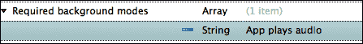
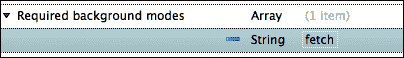

# 第十二章。多任务处理

在本章中，我们将涵盖以下主题：

+   检测应用状态

+   接收应用状态的通知

+   在后台运行代码

+   在后台播放音频

+   在后台更新数据

# 简介

当 iOS 平台在 2007 年推出时，它为用户带来了许多令人兴奋的新功能，并极大地改变了移动设备的概念。

尽管它当时取得了巨大的成功，但它缺少一些被认为是*基本*的功能。其中之一就是多任务处理，即同时运行多个进程的支持。实际上，该平台在内部支持系统进程的多任务处理，但这对开发者来说并不可用。从 iOS 4 开始，苹果提供了对多任务处理的支持，尽管它与大多数开发者习惯的还相当不同。

在本章中，我们将讨论如何利用平台的多任务功能。我们将了解在什么情况下可以使用这些功能，以及我们如何通过多任务为我们的应用用户提供功能。具体来说，我们将了解应用的状态及其运行时生命周期。通过一系列详细的示例项目，我们能够在应用处于后台时执行代码，支持音频播放，并接收数据更新。

# 检测应用状态

在这个菜谱中，我们将讨论如何检测应用的状态，并在应用从活动状态过渡到非活动状态以及相反时相应地做出反应。

## 准备工作

在 Xamarin Studio 中创建一个新的**单视图应用**，并将其命名为 `AppStateApp`。

## 如何做到这一点...

执行以下步骤：

1.  将以下方法覆盖添加到 `AppDelegate` 类中：

    ```swift
    public override void OnActivated (UIApplication application)
    {
      Console.WriteLine("Activated, application state: {0}", application.ApplicationState);	
    }
    public override void OnResignActivation (UIApplication application)
    {
      Console.WriteLine("Resign activation, application state: {0}", application.ApplicationState);
    }
    public override void DidEnterBackground (UIApplication application)
    {
      Console.WriteLine("Entered background, application state: {0}", application.ApplicationState);
    }
    public override void WillEnterForeground (UIApplication application)
    {
      Console.WriteLine("Will enter foreground, application state: {0}", application.ApplicationState);
    }
    ```

1.  要编译和运行应用，可以在模拟器或设备上操作。按下主页按钮（或在模拟器上按 *Shift* + *Command* + *H* 键）以挂起应用，并观察 Xamarin Studio 中的**应用输出**面板。

## 它是如何工作的...

`UIApplicationDelegate` 类包含由运行时发出的特定通知触发的方法。这些方法如下：

+   `OnActivated`：当应用变为活动状态时，此方法被调用，例如，当解锁屏幕时。

+   `OnResignActivation`：当应用即将变为非活动状态时，此方法被调用，例如，当屏幕锁定或发生来电时。

+   `DidEnterBackground`：当应用进入后台时，此方法被调用，例如，当按下主页按钮时。此时，应用处于挂起状态。

+   `WillEnterForeground`：当应用即将返回前台时，此方法被调用。

注意，当应用移动到后台时，`OnResignActivation` 和 `DidEnterBackground` 方法都会被调用。同样，当应用移动到前台时，`WillEnterForeground` 和 `OnActivated` 方法都会被调用。

所有这些方法都包含一个参数，该参数包含应用程序的`UIApplication`实例。`UIApplication`类包含`ApplicationState`属性，该属性返回应用程序的状态，作为`UIApplicationState`属性的值。这些值如下：

+   **活跃状态**：这表示应用程序处于活跃状态

+   **非活跃状态**：这表示应用程序处于非活跃状态，例如，当显示通知警报时

+   **后台状态**：这表示应用程序处于后台状态

## 更多内容...

有时候 iOS 会终止你的应用程序，例如，当发出内存警告而你的应用程序没有释放资源时。在这些情况下，将调用`WillTerminate`方法。

### 正确使用

前面的方法非常有用，因为它们允许我们在应用程序状态改变时保存向用户展示的当前数据。当应用程序过渡到非活跃或后台状态时，每个方法都有一定的时间来执行，因此我们应该确保它不会执行长时间运行的操作，否则 iOS 会终止应用程序。

# 接收应用程序状态的通知

在这个菜谱中，我们将讨论当应用程序的状态在`UIApplicationDelegate`实现的作用域之外发生变化时，如何接收通知。

## 准备工作

在 Xamarin Studio 中创建一个新的**单视图应用程序**，并将其命名为`NotifyStatesApp`。

## 如何实现...

执行以下步骤：

1.  在`NotifyStatesAppViewController`类中输入以下字段：

    ```swift
    private NSObject appDidEnterBackgroundObserver, appWillEnterForegroundObserver;
    ```

1.  创建以下方法：

    ```swift
    private void AddNotificationObservers()
    {
      this.appDidEnterBackgroundObserver = UIApplication.Notifications.ObserveDidEnterBackground((s, e) => Console.WriteLine("App did enter background! App state: {0}", UIApplication.SharedApplication.ApplicationState));
      this.appWillEnterForegroundObserver = UIApplication.Notifications.ObserveWillEnterForeground((s, e) => Console.WriteLine("App will enter foreground! App state: {0}", UIApplication.SharedApplication.ApplicationState));
    }
    private void RemoveNotificationObservers()
    {
      NSNotificationCenter.DefaultCenter.RemoveObservers(new [] {
        this.appDidEnterBackgroundObserver,
        this.appWillEnterForegroundObserver
      });
    }
    ```

1.  在`ViewWillAppear`的覆盖方法中，按照以下方式调用`AddNotificationObservers`方法：

    ```swift
    public override void ViewWillAppear(bool animated) {
      base.ViewWillAppear(animated);
      this.AddNotificationObservers();
    }
    ```

1.  在`ViewWillDisappear`的覆盖方法中，按照以下方式调用`RemoveNotificationObservers`方法：

    ```swift
    public override void ViewWillDisappear(bool animated) {
      base.ViewWillDisappear(animated);
      this.RemoveNotificationObservers();
    }
    ```

1.  在模拟器上编译并运行应用程序。按住主页按钮（或按*Shift* + *Command* + *H*），并在**应用程序输出**面板中查看输出。

## 它是如何工作的...

除了调用应用程序状态的`UIApplicationDelegate`对象的方法之外，iOS 还会发出我们可以接收的通知。这非常有用，因为在大多数情况下，我们需要在应用程序状态在`AppDelegate`类的作用域之外改变时收到通知。

为了完成这个任务，我们通过`UIApplication.Notifications`类使用`NSNotificationCenter`方法，如下所示：

```swift
this.appDidEnterBackgroundObserver = UIApplication.Notifications.ObserveDidEnterBackground((s, e) => Console.WriteLine("App did enter background! App state: {0}", UIApplication.SharedApplication.ApplicationState));
```

此示例仅添加了在后台和前台之间转换的通知观察者。我们可以通过其他可用的`Observe*`方法添加更多通知观察者。

结果与之前菜谱中使用的示例类似，但在这个情况下，我们在视图控制器的作用域内收到通知。

## 更多内容...

要在应用程序激活或放弃激活时添加通知观察者，我们分别使用`UIApplication.Notifications.ObserveDidBecomeActive`和`UIApplication.Notifications.ObserveWillResignActive`方法。

### 移除通知观察者

在这个例子中，我们在 `ViewWillAppear` 方法内部调用 `RemoveNotificationObservers`。然而，当应用过渡到后台时，该方法不会被调用，而只有在显示另一个视图控制器时才会被调用。

## 相关内容

+   *检测应用程序状态* 的配方

# 在后台运行代码

在这个配方中，我们将学习如何在后台执行代码，充分利用 iOS 的多任务功能。

## 准备工作

在 Xamarin Studio 中创建一个新的 **单视图应用** 并将其命名为 `BackgroundCodeApp`。

## 如何做到这一点...

执行以下步骤：

1.  在 `AppDelegate` 类中输入以下代码：

    ```swift
    private int taskID;
    public override void DidEnterBackground (UIApplication application)
    {
      if (this.taskID == 0)
      {
        this.taskID = application.BeginBackgroundTask(() => {
          application.EndBackgroundTask(this.taskID);
          this.taskID = 0;
        });
        ThreadPool.QueueUserWorkItem(delegate {
          for (int i = 0; i < 60; i++)
          {
            Console.WriteLine("Task {0} - Current time {1}", this.taskID, DateTime.Now);
            Thread.Sleep(1000);
          }
          application.EndBackgroundTask(this.taskID);
          this.taskID = 0;
        });
      }
    }
    public override void WillEnterForeground (UIApplication application)
    {
      if (this.taskID != 0)
      {
        Console.WriteLine("Background task is running!");
      } else
      {
        Console.WriteLine("Background task completed!");
      }
    }
    ```

1.  在模拟器上编译并运行应用。按住主页按钮（*Command* + *Shift* + *H*）使应用进入后台，并观察 **应用程序输出** 面板。在后台任务完成之前（1 分钟），可以通过在多任务栏或主屏幕上的图标上轻触来将应用带到前台。

## 它是如何工作的...

在前面的任务中，我们学习了如何得知应用从前台过渡到后台以及相反的情况。

iOS 的多任务处理并不完全像我们在其他平台上所习惯的那样。iOS 平台帮助我们确保前台应用将拥有所有可用的资源（以及用户的）。为了实现这一点，当应用进入后台时，它会被操作系统挂起。当它被挂起时，它不会执行任何代码。

如果我们想要防止用户按下主页按钮时应用被挂起，我们可以请求后台时间。我们请求的时间限制为 600 秒（10 分钟），这对于我们可能在后台执行的大多数任务来说已经足够了（例如，保存 UI 状态，完成文件下载/上传，关闭任何打开的连接，等等）。

要请求后台时间，我们按照以下方式调用我们的 `UIApplication` 实例的 `BeginBackgroundTask` 方法：

```swift
this.taskID = application.BeginBackgroundTask(() => {
  application.EndBackgroundTask(taskID);
  this.taskID = 0;
} );
```

该方法接受一个 `NSAction` 类型的参数并返回一个整数，该整数对应于任务 ID。`NSAction` 参数表示将在后台时间耗尽前执行的代码块。在该代码块内部，我们必须调用 `EndBackgroundTask` 方法，传递已启动任务的 ID，这将通知运行时我们不再需要后台时间。每次调用 `BeginBackgroundTask` 都应紧随 `EndBackgroundTask` 的调用。如果我们不调用此方法并且后台时间耗尽，应用将被终止。

在调用`BeginBackgroundTask`方法后，我们可以执行我们想要的代码。为了允许`DidEnterBackground`方法完成并避免阻塞主线程，我们只需将我们的代码封装到异步调用或单独的线程中。在这个例子中，我们使用`ThreadPool`中的一个线程。由于这个特定任务将在我们有时间之前完成，我们调用`EndBackgroundTask`方法来让系统知道工作已完成。我们传递给`BeginBackgroundTask`方法的代码块将不会执行，因为我们已经结束了任务。

然而，也存在用户在后台任务仍在运行时将应用带到前台的情况。为了覆盖这种场景，我们需要重写`WillEnterForeground`方法，并适当地处理它。我们可以停止后台任务（通过调用`EndBackgroundTask`），或者向用户提供某种反馈，告知任务仍在运行。这种场景也使得异步调用我们的代码成为最佳实践。如果我们的后台任务代码是同步的，那么当用户将应用带到前台且任务仍在运行时，应用将会冻结，直到任务完成。

## 还有更多...

要知道执行后台任务剩余多少时间，我们可以检查`BackgroundTimeRemaining`属性的值如下：

```swift
Console.WriteLine("Remaining time: {0}", application.BackgroundTimeRemaining);
```

### 后台代码的重要考虑因素

当您处理后台代码时，以下是需要考虑的重要点：

+   当应用处于后台时，不要更新 UI。这样做可能会导致您的应用终止或崩溃。在应用处于后台时发生的任何 UI 元素更新都会排队，以便在它返回前台时执行。这肯定会使得应用无响应。

+   不要通知用户将您的应用带到前台以给任务更多时间。这样做肯定会使得您的应用在应用商店的审批过程中被拒绝。如果后台任务正在进行中，并且用户将应用带到前台，再次将应用移回后台基本上会继续剩余的后台时间。

+   在后台执行轻量级操作，以避免运行时杀死您的应用。

+   避免使用外部资源（例如，来自资源库的资源）。

## 参见

+   *检测应用程序状态*配方

# 在后台播放音频

在这个配方中，我们将学习如何防止应用被挂起，以便允许音频播放。

## 准备工作

在 Xamarin Studio 中创建一个新的**单视图应用**，并将其命名为`BackgroundAudioApp`。在控制器的视图中添加一个按钮。您还需要一个音频文件。在这个例子中，使用了一个时长为 21 秒的 M4A 文件。

## 如何操作...

执行以下步骤：

1.  双击 `Info.plist` 文件以打开它。在底部选择 **Source** 选项卡，并添加 `UIBackgroundModes` 键（**必需的后台模式**）并设置字符串值为 audio。以下截图显示了在设置后如何在编辑器中显示键和值：

1.  在 `BackgroundAudioAppViewController.cs` 文件中添加 `MonoTouch.AVFoundation` 命名空间。

1.  在类中输入以下 `ViewDidLoad` 方法：

    ```swift
    private AVAudioPlayer audioPlayer;
    public override void ViewDidLoad ()
    {
      base.ViewDidLoad ();
      NSError error = null;
      AVAudioSession.SharedInstance().SetCategory(AVAudioSession.CategoryPlayback, out error);
      if (error != null)
      {
        Console.WriteLine("Error setting audio session category: {0}", error.LocalizedDescription);
      }
      this.audioPlayer = AVAudioPlayer.FromUrl(NSUrl.FromFilename("sound.m4a"));
      this.btnPlay.TouchUpInside += (sender, e) => this.audioPlayer.Play();
    }
    ```

1.  将声音文件添加到项目中，并将其 **Build Action** 设置为 **Content**。

1.  在设备上编译并运行应用。轻触 **播放声音** 按钮并按住主页按钮，使应用进入后台。注意，声音继续播放。

## 它是如何工作的...

为了确保我们的应用在后台时能够播放音频，我们必须在 `Info.plist` 文件中的 `UIBackgroundModes` 键中设置音频项。

在这个例子中，我们使用了 `AVAudioPlayer` 类来播放声音文件。仅仅创建类的实例并调用其 `Play` 方法是不够的。我们必须为音频会话类别设置一个特定的类型。我们将通过以下代码来完成这项工作：

```swift
NSError error = null;
AVAudioSession.SharedInstance ().SetCategory (AVAudioSession.CategoryPlayback, out error);
```

静态方法 `AVAudioSession.SharedInstance` 返回当前的音频会话对象。音频会话类别设置为 `AVAudioSession.CategoryPlayback`，允许 `AVAudioPlayer` 类在应用处于后台时播放声音。这个要求仅适用于 `MonoTouch.AVFoundation` 命名空间中的对象。

## 还有更多...

以下是可以用的音频会话类别：

+   `CategoryAmbient`: 在这个类别中，当设备屏幕锁定或设备的静音开关打开时，声音会被静音。外部资源的声音（如 iPod 应用）会与这个类别混合。

+   `CategorySoloAmbient`: 这是默认类别。使用此类别，外部资源的声音会被静音。当屏幕锁定或设备的静音开关打开时，声音会被静音。

+   `CategoryPlayback`: 在这个类别中，当屏幕锁定或静音开关打开时，声音不会被静音。外部资源的声音会被静音，但如果将 `MonoTouch.AudioToolbox.AudioSession.OverrideCategoryMixWithOthers` 属性设置为 `true`，则可以混合。

+   `CategoryRecord`: 这个类别用于录音。所有音频播放都被静音。即使在屏幕锁定的情况下，录音也会继续。

+   `CategoryPlayAndRecord`: 这个类别用于需要录音和播放音频的应用。外部资源的声音会被静音，但如果将 `MonoTouch.AudioToolbox.AudioSession.OverrideCategoryMixWithOthers` 属性设置为 `true`，则可以混合。当屏幕锁定或静音开关打开时，声音会继续播放。

+   `CategoryAudioProcessing`: 这个类别专门用于处理音频。在此类别中，声音播放和录音被禁用。

### 音频的后台状态

即使应用程序通过`Info.plist`文件配置为支持后台音频播放，播放完成后应用程序也会被挂起。

## 参见

+   在第十章中，*位置服务和地图*的*后台位置服务*菜谱

# 在后台更新数据

在这个菜谱中，我们将学习如何利用 iOS 7 的**后台获取**功能。这个功能会在系统管理的间隔自动唤醒应用程序，给它一定的时间来检索数据和更新 UI。

## 准备工作

在 Xamarin Studio 中创建一个新的**单视图应用程序**，并将其命名为`BackgroundFetchApp`。向控制器中添加一个标签。

## 如何做...

执行以下步骤：

1.  我们需要从`BackgroundFetchAppViewController`类的范围外访问标签，因此创建一个公共属性，如下所示：

    ```swift
    public UILabel LabelStatus {
      get { return this.lblStatus; }
    }
    ```

1.  打开`Info.plist`文件，在**源**选项卡下，添加`UIBackgroundModes`键（**必需的后台模式**）并设置字符串值为`fetch`。以下截图显示了设置后的编辑器：

1.  在`AppDelegate`类的`FinishedLaunching`方法中，输入以下行：

    ```swift
    UIApplication.SharedApplication.SetMinimumBackgroundFetchInterval(UIApplication.BackgroundFetchIntervalMinimum);
    ```

1.  再次在`AppDelegate`类中输入以下代码：

    ```swift
    private int updateCount;
    public override void PerformFetch (UIApplication application, Action<UIBackgroundFetchResult> completionHandler)
    {
      try {
        HttpWebRequest request = WebRequest.Create("http://software.tavlikos.com") as HttpWebRequest;
        using (StreamReader sr = new StreamReader(request.GetResponse().GetResponseStream())) {
          Console.WriteLine("Received response: {0}", sr.ReadToEnd());
        }
        this.viewController.LabelStatus.Text = string.Format("Update count: {0}/n{1}", ++updateCount, DateTime.Now);
        completionHandler(UIBackgroundFetchResult.NewData);

      } catch {
        this.viewController.LabelStatus.Text = string.Format("Update {0} failed at {1}!", ++updateCount, DateTime.Now);
        completionHandler(UIBackgroundFetchResult.Failed);
      }
    }
    ```

1.  在模拟器或设备上编译并运行应用程序。按下主页按钮（或*Command* + *Shift* + *H*）将应用程序移至后台并等待输出。但这可能需要一段时间。

## 它是如何工作的...

带有`fetch`值的`UIBackgroundModes`键启用了我们应用程序的后台获取功能。如果不设置它，应用程序将不会在后台唤醒。

在`Info.plist`中设置键后，我们覆盖`AppDelegate`类中的`PerformFetch`方法，如下所示：

```swift
public override void PerformFetch (UIApplication application, Action<UIBackgroundFetchResult> completionHandler)
```

当系统唤醒应用程序时，会调用此方法。在这个方法内部，我们可以连接到服务器并检索所需的数据。在这里需要注意的一个重要事项是，我们不需要使用 iOS 特定的 API 来连接到服务器。在这个例子中，使用了简单的`HttpWebRequest`方法来获取这个博客的内容：[`software.tavlikos.com`](http://software.tavlikos.com)。

在我们收到所需的数据后，我们必须调用传递给方法的事件处理程序，如下所示：

```swift
completionHandler(UIBackgroundFetchResult.NewData);
```

我们还需要传递获取的结果。在这个例子中，如果更新成功，我们传递`UIBackgroundFetchResult.NewData`；如果发生异常，我们传递`UIBackgroundFetchResult.Failed`。

如果我们没有在指定的时间内调用回调，应用程序将被终止。此外，它可能在未来获取数据的次数更少。

最后，为了确保一切正常工作，我们必须设置应用程序将被唤醒的间隔，如下所示：

```swift
UIApplication.SharedApplication.SetMinimumBackgroundFetchInterval(UIApplication.BackgroundFetchIntervalMinimum);
```

默认间隔是`UIApplication.BackgroundFetchIntervalNever`，所以如果我们不设置间隔，后台获取永远不会被触发。

## 更多内容

除了我们在本项目添加的功能外，后台获取完全由系统管理。我们设置的间隔只是一个指示，我们唯一能保证的是它不会早于间隔被触发。一般来说，系统会监控所有应用程序的使用情况，并确保根据应用程序的使用频率来触发后台获取。

### 注意

除了预定义的值之外，我们可以传递我们想要的任何秒数值。

### UI 更新

我们可以在`PerformFetch`方法中更新 UI。iOS 允许这样做，以便在应用程序处于后台时更新应用程序的截图。然而，请注意，我们需要将 UI 更新保持在绝对最小化。

## 参见

+   背景运行代码的配方
