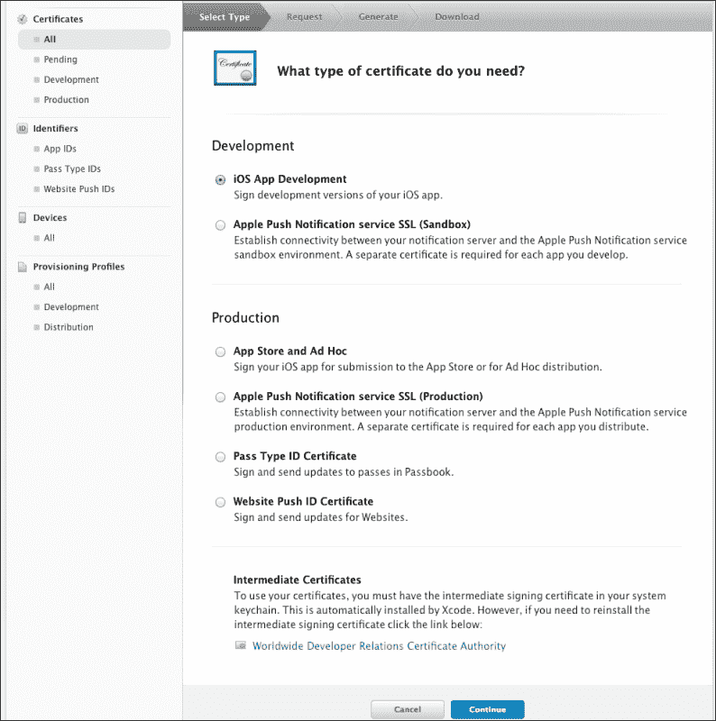
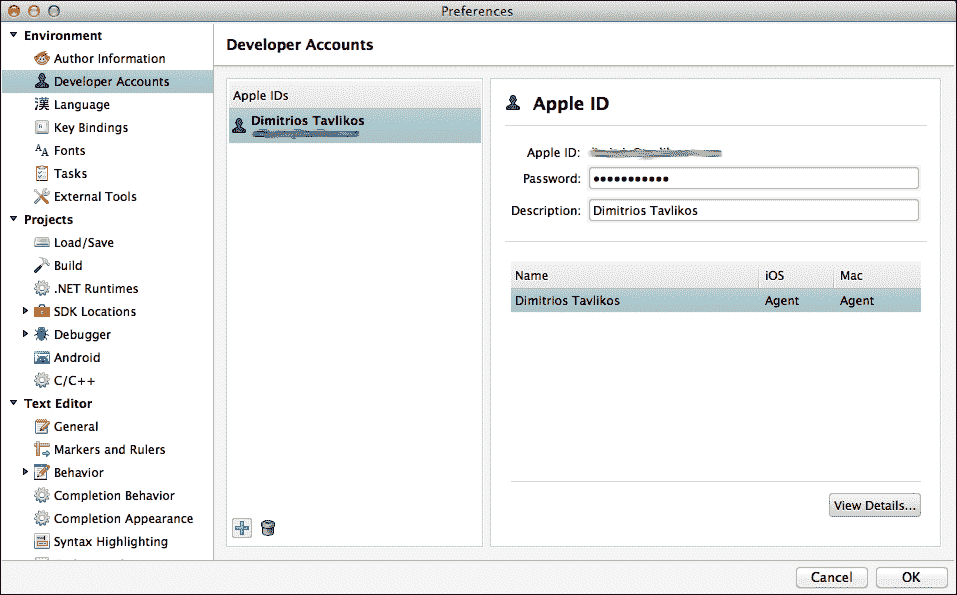
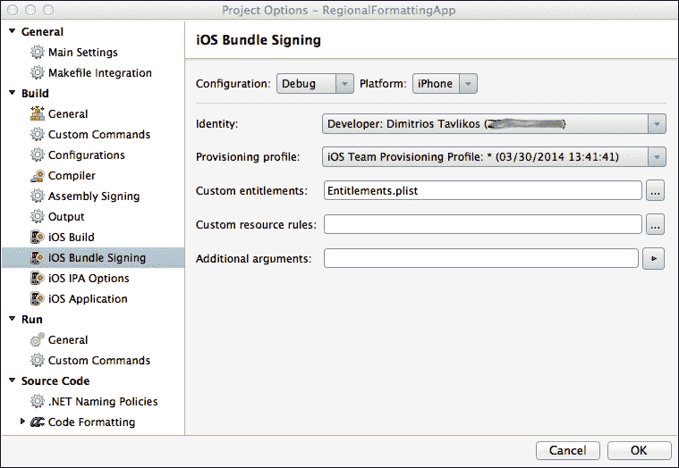
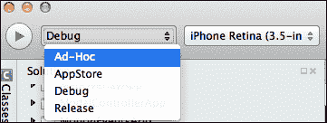
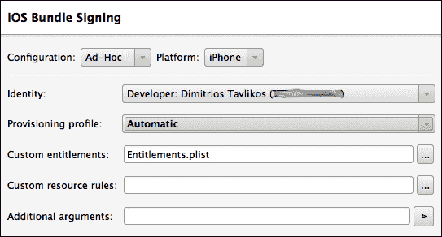
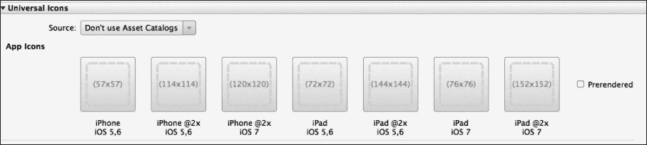
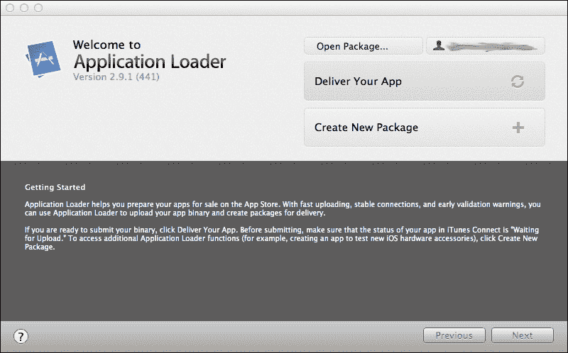

# 第十四章 部署

在本章中，我们将涵盖以下主题：

+   创建配置文件

+   创建一个 ad hoc 分发包

+   为 App Store 准备应用

+   将应用提交到 App Store

# 简介

在本章中，我们将详细介绍在开发计算机上准备和安装适当证书的所有必要步骤。我们还将学习如何创建允许我们将应用部署到设备（无论是自己的还是他人的）或发送给测试人员进行设备安装的配置文件。

最后，我们将了解如何为 App Store 提交应用以及其最终发布到 App Store 的过程。

# 创建配置文件

在本食谱中，我们将逐步指导创建和安装部署应用到设备所需的适当证书和配置文件。

## 如何操作...

以下步骤将指导您完成创建开发者证书和为应用创建适当的配置文件的过程。

我们将从开发者证书开始，如下所示：

1.  登录到[iOS 开发者网站](http://developer.apple.com/ios)。

1.  前往 iOS **配置文件门户**。

1.  从右侧菜单转到**证书、标识符和配置文件**，然后在下一页点击**证书**。

1.  点击右侧的加号（**+**）按钮添加新证书。以下截图显示了新证书的设置页面：

1.  选择**iOS 应用开发**并点击**继续**。

1.  下一页提供了在您的 Mac 上创建**证书签名请求**（**CSR**）的信息。按照说明创建 CSR 并点击**继续**。

1.  在下一页，上传 CSR 文件并点击**生成**。

1.  证书生成后，您将可以选择下载它。下载并双击`.cer`文件进行安装。Keychain Access 将打开，显示机器上安装的证书。

现在证书已安装，我们需要设置 Xamarin Studio 以便使用它。如果您尚未这样做，请关闭 Keychain Access，因为我们不需要它。执行以下步骤：

1.  打开 Xamarin Studio。

1.  打开**首选项**（*Cmd* + *,*）。

1.  在**开发者账户**选项下，点击加号按钮添加您的 Apple 开发者账户。

1.  输入您的 Apple 开发者账户凭据并点击**确定**。

以下截图显示了 Xamarin Studio 的**首选项**窗口，其中已添加了开发者账户：

现在我们已经颁发并安装了我们的开发者证书，我们需要通过以下步骤注册我们将用于调试的设备：

1.  返回到 Apple 开发者门户的**证书、标识符和配置文件**，点击页面左侧的**设备**。

1.  点击加号按钮（**+**）以添加新设备。

1.  输入设备的名称。如果您在测试不属于您的多个设备，您只能通过此名称来区分它们，所以请确保它有助于您识别设备，例如，`Mike 的 iPhone 5s`。

1.  输入设备的**唯一设备标识符**（**UDID**）。您可以通过在 Mac 上连接设备并打开 iTunes 来找到设备的 UDID。在设备的**摘要**选项卡下，点击序列号将显示 UDID。右键单击并点击**复制**。您现在可以将其粘贴到 UDID 字段中。

1.  点击**继续**。设备现在已添加到您的 Apple 开发者账户中，并可用于调试和测试您的应用。

我们已创建开发配置文件，设置好 Xamarin Studio，并将至少一个设备添加到我们的 Apple 开发者账户中。下一步是创建 App ID 和配置文件，这将允许我们的应用在设备上安装。

按照以下步骤创建 App ID：

1.  在**证书、标识符和配置文件**页面，点击页面左侧的**App IDs**。

1.  点击右侧的加号按钮（**+**）以创建新的 App ID。

1.  在**App ID 描述**部分，输入 App ID 的名称。

1.  选择**App ID 前缀**。如果没有可用的前缀，请选择**生成新**。

1.  在**App ID 后缀**部分，输入包 ID。根据说明，使用反向域名风格字符串（例如，`com.mycompany.myapp`）作为包 ID 是一个好习惯。

1.  点击**继续**，App ID 即被创建。

我们即将完成。现在，是时候创建配置文件了。执行以下步骤：

1.  点击页面左侧的**配置文件**。

1.  点击右侧的加号（**+**）按钮以创建新的配置文件。

1.  选择**iOS 应用开发**选项并点击**继续**。

1.  在下一页，选择将配置文件绑定到的 App ID 并点击**继续**。

1.  选择 App ID 后，我们需要选择开发者证书。选择我们之前创建的开发者证书后，点击**继续**。

1.  我们现在需要选择应用可以安装的设备。选择一个或多个设备并点击**继续**。请注意，应用不会安装到此处未包含的设备上。

1.  最后一步是为配置文件命名。输入您首选的名称并点击**生成**按钮。

1.  配置文件生成后，我们有下载它的选项。下载并双击 `.mobileprovision` 文件以在您的机器上安装它。Xcode 现在将打开，**组织者**窗口将显示机器上所有已安装的配置文件。

我们完成了。我们已经成功地为 iOS 开发准备了我们的机器，以及所有必要的配置文件，这将允许我们在设备上调试我们的应用！

## 它是如何工作的...

本食谱中描述的过程将允许您在连接到您的 Mac 的设备上部署和调试您的应用。它不会允许您将应用分发给测试人员或 App Store。

开发者证书是允许编译将部署到设备的应用的证书。它仅用于开发，并且一个开发者证书对应于一个 iOS 开发者计划的注册。

每个配置文件都包含有关它可以安装在其上的设备的信息。注册到 iOS 开发者计划的 Apple 开发者可以添加最多 100 台设备并将它们包含在配置文件中。

App ID 是您应用的标识符。为您的每个应用创建一个 App ID。

配置文件是允许您的应用部署到设备的电子签名。每个配置文件对应一个应用，并包含所有适当的权限，允许应用在其包含的设备（和 App ID 信息）上执行。它也是区分开发或发布应用的关键。配置文件带有有效期。在撰写本书时，配置文件的持续时间是 1 年。

## 还有更多...

要在设备上编译和调试应用，请在 Xamarin Studio 的项目选项中**iPhone 包签名**节点下选择开发者证书和配置文件，如图所示：

这必须为每个构建配置（**调试**、**发布**等）执行。

在**iPhone 应用**节点下，为您的应用设置**显示名称**、**包标识符**和**包版本**字段。如果您留空，Xamarin Studio 将使用默认值设置它们的值。具体来说，**包标识符**字段将设置为包含在 App ID 中的值。然而，如果您将**包标识符**字段设置为与 App ID 中声明的内容不同的值，则在编译时将发生错误。

### 配置文件的过期

当配置文件过期时，应用将无法在设备上运行。您可以续订现有的配置文件或创建一个新的配置文件并将其重新安装到设备上。

## 相关内容

+   *创建一个临时的发布包*食谱

+   第一章中的 *编译 iOS 项目* 食谱，*开发工具*

# 创建一个临时的发布包

在本食谱中，我们将学习如何创建我们的应用包。我们将能够将此包发送给测试人员，以便他们在他们的设备上测试它。

## 准备工作

要创建一个临时的发布包，请确保您已在 iOS 配置文件门户上为您的应用创建了一个 App ID。

## 如何操作...

创建临时配置文件的过程与创建开发分发配置文件的过程类似。以下步骤将指导您完成这个过程：

1.  创建分发证书。对于分发到未连接到您的 Mac 的各种设备，以及提交到 App Store，您需要一个已安装的分发证书。遵循之前菜谱中描述的创建开发者证书的相同步骤。不过，这次在添加新证书时，在 **生产** 部分下选择 **App Store 和临时**。所有其他必需步骤都相同。

1.  创建分发配置文件。遵循之前菜谱中描述的创建配置文件的相同步骤。不过，这次在 **分发** 部分选择 **临时** 选项，而不是 **iOS 应用开发**。

1.  下载配置文件，双击它以在您的机器上安装。

现在我们已经准备好了所有分发证书和配置文件，我们需要通过以下步骤创建我们的临时构建：

1.  在 Xamarin Studio 中打开项目。在这个例子中，使用的是 `RegionalFormattingApp` 项目。

1.  在屏幕左上角的解决方案配置组合框中选择 **临时**，如图所示：

1.  打开项目选项，在 **iPhone 包签名** 选项下，从列表中选择分发证书和配置文件。只需确保您选择的是 **临时** 配置的证书和配置文件。在下面的屏幕截图中，已经选择了分发证书：

1.  在 **iOS IPA 选项** 下，确保 **构建临时/企业包（IPA）** 已勾选。

1.  导航到菜单栏上的 **构建** | **重新构建全部** 来创建构建。

我们的应用的分发构建已经准备好了！现在是时候与我们的测试人员分享它了。以下步骤将指导您完成这个过程：

1.  在 Mac 上，打开 Finder 并导航到您项目的 `bin` 文件夹。

1.  打开 `iPhone/Ad-Hoc` 文件夹。

1.  您现在可以将 `*.ipa` 文件以及配置文件（`*.mobileprovision`）发送给测试人员。

1.  测试人员可以通过在 iTunes 中拖放这两个文件并将它们与设备同步来安装应用。

## 它是如何工作的...

对于分发应用，我们需要一个分发证书。就像开发者证书一样，分发证书一旦创建，就可以在需要时转移到另一台 Mac 上。

创建临时分发配置文件的创建过程与创建开发配置文件的过程相同。唯一的区别是我们有选择分发类型的选项，可以是 **App Store** 或 **临时**。`*.ipa` 文件是 iTunes 识别的文件。

## 还有更多...

还有一个第三方服务可以使分发过程变得非常简单。您可以创建团队并上传不同的构建版本，每当有新的构建版本时，通过电子邮件通知您的测试人员，最重要的是，跳过 iTunes 同步。您可以在[`www.testflightapp.com`](http://www.testflightapp.com)找到所有信息。请注意，TestFlight 仅用于分发。必要的证书和配置文件仍然需要创建。

### 使用 iTunes 同步 ad hoc 应用包

不同用户在他们的 iTunes 应用中设置了不同的设置。如果用户同步设备且无法在设备上找到应用，请确保在 iTunes 中选中设备的**应用**选项卡下的应用进行同步。

## 参见

+   *创建配置文件*菜谱

# 为 App Store 准备应用

在这个菜谱中，我们将讨论为准备 App Store 应用所需的重要步骤。

## 准备工作

按照前一个菜谱中的步骤为您的应用创建 App Store 分发配置文件。

## 如何操作...

在准备 App Store 的过程中，有一个非常重要的步骤是关于应用中应包含的图片。

最重要的是应用图标。这是将在用户设备上代表您应用的图标。根据目标设备，图标的尺寸应不同。Xamarin Studio 通过为每个目标设备/平台提供特定的槽位来分配图标，使得这个过程变得简单。例如，iPhone 3s 的图标大小与 iPhone 4s 的大小不同，iPhone 5 或运行 iOS 7 的后续设备的图标也是如此。

以下步骤将指导您完成这个过程：

1.  双击项目的`Info.plist`文件以在嵌入式编辑器中打开文件。以下截图显示了通用（iPhone 和 iPad）应用中所有可用的应用图标选项：

1.  点击每个相应的图标来分配图标。图标必须是 PNG 格式。

1.  现在我们已经设置了应用图标，我们需要设置启动画面。

1.  启动画面是应用启动时首先显示的内容。为 iPhone 和 iPod Touch 应用准备至少两个维度的启动画面：低分辨率版本为 320 x 480 像素，高分辨率版本为 640 x 960 像素，4 英寸设备（如 iPhone 5、iPhone 5s 等）为 640 x 1136 像素。

1.  在`Info.plist`编辑器中点击相应的框来设置启动画面。

我们现在必须设置 iTunes 艺术作品图片。这是一个 512 x 512 和 1024 x 1024 像素的图片，将在我们的应用页面上显示在 iTunes 中。它可以是你想要的任何东西；然而，一个好的做法是让它与应用图标相同。只需点击`Info.plist`文件中的相应按钮来分配 iTunes 艺术作品图片。

## 工作原理...

应用图标非常重要。这是用户将在设备屏幕上看到并点击以启动你的应用的内容。尽管所有应用图标都显示为带圆角和光效的按钮，但你不应在图标中包含这些图形特征。这些图形特征在提交到 App Store 时会自动渲染。图标应该是完美的正方形。此外，始终为图标提供背景。不要使用透明度，因为图标上的任何透明度都将显示为黑色，可能会破坏你预期的图标外观。

启动图像是应用启动时首先显示的。当启动时屏幕变黑，这意味着没有启动图像。根据苹果的 **iOS 人机界面指南** ([`developer.apple.com/library/ios/documentation/UserExperience/Conceptual/MobileHIG/index.html`](https://developer.apple.com/library/ios/documentation/UserExperience/Conceptual/MobileHIG/index.html))，这个图像应该是应用完成启动过程并准备好接受输入时加载的第一个屏幕。它应仅包含第一个屏幕的静态内容，而不是可能改变的内容，如本地化文本。

## 还有更多...

并非必须为编辑器中每个可用的槽位创建你的应用图标。实际上，即使你只创建一个低分辨率的图标，也是可以接受的，你将能够上传你的应用到 App Store。不过，当安装在高分辨率设备（如 iPad Air）上时，其质量可能不会是顶级的。这对应用及其开发者的声誉来说是不利的。

### 4 英寸屏幕启动图像

正如你可能已经注意到的，`Info.plist` 编辑器已经为视网膜（4 英寸）屏幕设置了一个启动图像，背景是纯黑色。这是因为当 iPhone 5 首次发布时，它的屏幕高度与之前的型号不同。

苹果选择帮助开发者轻松支持更高屏幕的方法要求开发者包括一个与新屏幕尺寸相匹配的启动图像。这样，iOS 在启动时会自动调整视图控制器的大小以适应新的屏幕尺寸。通过默认包含这个空白启动图像，Xamarin Studio 让我们的工作变得更简单，这样我们所有的项目都能在 4 英寸设备上正确显示。

## 参见

+   *创建配置文件* 菜谱

# 将应用提交到 App Store

在这个菜谱中，我们将介绍提交应用至 App Store 所需的步骤。

## 准备工作

对于这个菜谱，你需要准备好你的压缩版分发应用包。

## 如何操作...

提交你的应用到 App Store 的步骤如下：

1.  准备最多五张展示你应用不同方面的截图。对于 iPhone/iPod Touch 应用，肖像模式的尺寸应为 640 x 1136 像素，横屏模式的尺寸应为 1136 x 640 像素。

1.  准备最能描述您应用的文本。尽量包括最重要的功能。记住，描述是用户在下载应用之前会阅读的内容，所以越吸引人越好。

    ### 注意

    准备有助于您的应用在搜索结果中排名靠前的关键词。应用描述和关键词都是必需的。

1.  iTunes Connect 是管理并提交应用（以及其他与 App Store 相关的内容）的开发商门户。使用您的 Apple 开发者 ID 登录到 iTunes Connect ([`itunesconnect.apple.com`](http://itunesconnect.apple.com))。点击 **管理您的应用** 链接。然后，点击左上角的 **添加新应用** 按钮。按照门户上的步骤完成应用的准备。完成时，请确保应用的状态是 **等待上传**。

1.  在门户上创建新应用后，您可以使用 Application Loader 上传压缩的应用程序包。它默认安装在 Xcode 中，可以在 `/Developer/Application/Utilities` 下找到，或者通过 Spotlight 搜索。

    当您启动 Application Loader 时，它将要求您使用 Apple 开发者 ID 登录。登录后，您将看到一个以下窗口：

    

1.  点击 **提交您的应用** 按钮，它将连接到 iTunes Connect，找到您处于 **等待上传** 状态的应用，并将它们加载到列表框中。

1.  您将看到一个关于您应用的概览视图。

1.  点击 **选择...** 按钮，将出现一个对话框，允许您选择压缩的应用程序包。选择后，继续上传。

您已经准备好了！如果所有步骤都正确完成，应用将被上传，并将在 App Store 上进行发布审查。

## 它是如何工作的...

应用截图可以是 JPG、TIF 或 PNG 格式，RGB 颜色，分辨率至少为 72 DPI。

然而，图片只有在用户已经在 App Store 中查看您的应用时才重要。关键词和描述是允许您的应用在搜索结果中排名更高并使用户决定应用是否值得下载的参数。关于关键词，要明智地选择。不要包含尽可能多的关键词；反映应用关键方面的较少关键词总是更好的。

iTunes Connect 是管理应用、审查财务数据、应用下载的开发商门户，它还包括开发商需要签署的合同和协议。请确保您阅读并接受这些合同，否则您将无法继续进行应用的准备流程。在此过程中，您需要提供必要的信息，对于您的应用而言，包括如果是付费应用，其价格范围、将在哪些国家提供，以及如果您不希望它自动在通过 App Store 审查流程后立即发布，其发布日期。

当一切设置正确且应用状态为**等待上传**时，您就可以运行应用程序加载器来上传它。随着 iOS 和 iOS SDK 版本的定期发布，各种组件或流程都会发生变化。请始终确保您的 iOS SDK 版本是最新的。

## 还有更多...

在应用准备过程中某个阶段，您将需要输入一个**库存单位**（**SKU**）编号。这个编号是每个产品或服务的唯一标识符。它可以是你想要的任何数字，但请保持一个特定的模式以跟踪标识符，例如，当你开发额外的应用时。

## 参见

+   *为 App Store 准备应用* 的配方
