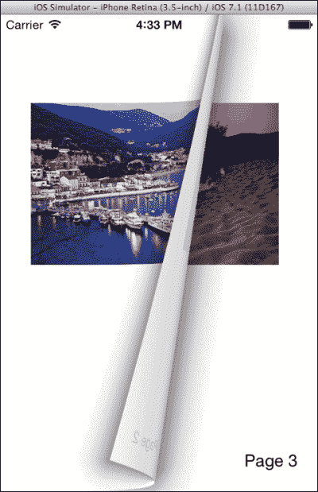
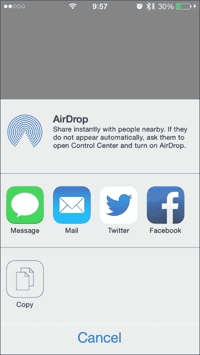
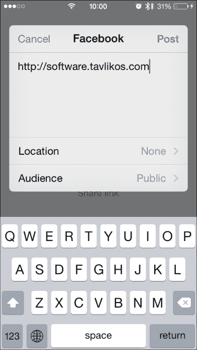
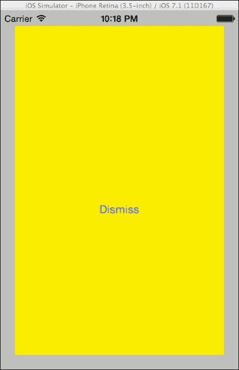
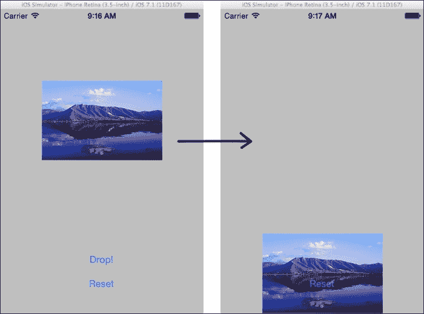

# 第十五章。高级功能

在本章中，我们将涵盖以下主题：

+   重新生成翻页效果

+   集成内容共享

+   实现自定义过渡效果

+   在 UI 元素中使用物理效果

+   实现文本到语音的功能

# 简介

在本章中，我们将探索 iOS 平台提供的众多高级功能中的一部分。

具体来说，我们将创建一个项目，显示内容分为页面，用户可以通过`UIPageViewController`类像在普通书中一样导航。

然后，我们将讨论集成内容共享功能，并使用`UIActivityViewController`在我们的应用中提供分享/发布功能。对于用户界面，我们将探讨**UIKit Dynamics**的一些基本方面，它允许丰富的动画，以提供更好的用户体验。我们还将学习如何提供视图控制器之间的自定义过渡。

在本章的最后一个小节中，我们将使用新的文本到语音功能，并创建一个应用，该应用使用`AVSpeechSynthesizer`类进行语音输出！

# 重新生成翻页效果

在本菜谱中，我们将创建一个应用，使用`UIPageViewController`类显示类似书籍的内容。

## 准备工作

在 Xamarin Studio 中创建一个新的**单视图应用**，并将其命名为`BookApp`。向项目中添加另一个控制器，并将其命名为`Page`。根据您的喜好配置`Page`控制器的外观。在此菜谱的源代码中，包含一个`UIImageView`和一个`UILabel`。

## 如何操作...

执行以下步骤：

1.  在`BookAppViewController`类中输入以下代码：

    ```swift
    private UIPageViewController pageViewController;
    private int pageCount = 3;
    public override void ViewDidLoad ()
    {
      base.ViewDidLoad ();
      Page firstPage = new Page(0);
      this.pageViewController = new UIPageViewController(UIPageViewControllerTransitionStyle.PageCurl, UIPageViewControllerNavigationOrientation.Horizontal, UIPageViewControllerSpineLocation.Min);
      this.pageViewController.SetViewControllers(new UIViewController[] { firstPage }, UIPageViewControllerNavigationDirection.Forward, false, s => { });
      this.pageViewController.GetNextViewController = this.GetNextViewController;
      this.pageViewController.GetPreviousViewController = this.GetPreviousViewController;
      this.pageViewController.View.Frame = this.View.Bounds;
      this.View.AddSubview(this.pageViewController.View);
    }

    private UIViewController GetNextViewController(UIPageViewController pageController, UIViewController referenceViewController)
    {

      Page currentPageController = referenceViewController as Page;

      if (currentPageController.PageIndex >= (this.pageCount - 1))
      {

        return null;

      }  else
      {	
        int nextPageIndex = currentPageController.PageIndex + 1;
        return new Page(nextPageIndex);

      }
    }

    private UIViewController GetPreviousViewController(UIPageViewController pageController, UIViewController referenceViewController)
    {

      Page currentPageController = referenceViewController as Page;
      if (currentPageController.PageIndex <= 0)
      {
        return null;
      }  else
      {

        int previousPageIndex = currentPageController.PageIndex - 1;

        return new Page(previousPageIndex);

      }
    }
    ```

1.  向`Page`类添加一个属性并更改其构造函数，如下面的代码所示：

    ```swift
    public Page (int pageIndex) : base ("Page", null)
    {
      this.PageIndex = pageIndex;
    }

    public int PageIndex
    {
      get;
      private set;
    }
    ```

1.  最后，在`ViewDidLoad`方法中配置将在`Page`中显示的内容：

    ```swift
    this.imgView.Image = UIImage.FromFile(string.Format("images/{0}.jpg", this.PageIndex + 1));
      this.lblPageNumber.Text = string.Format("Page {0}", this.PageIndex + 1);
    ```

1.  在模拟器上编译并运行应用。在模拟器的屏幕区域上点击并拖动光标以更改页面。结果应类似于以下截图：

## 它是如何工作的...

iOS 5 中引入的`UIPageViewController`类是许多开发人员期望的组件。它允许我们通过类似于真实书籍的效果导航内容，就像在苹果的*iBooks*应用中一样。

我们使用以下行初始化它：

```swift
this.pageViewController = new UIPageViewController(UIPageViewControllerTransitionStyle.PageCurl, UIPageViewControllerNavigationOrientation.Horizontal, UIPageViewControllerSpineLocation.Min);
```

构造函数的第一个参数确定效果的类型。目前唯一可用的值是`PageCurl`。第二个参数确定效果的方向。`Horizontal`参数是类似于书的效应的值，而`Vertical`是类似于笔记本的效应的值，其中页面在顶部装订。第三个参数确定书的装订位置。`Min`参数表示装订在屏幕的一边（在这种情况下，在左侧）。

在初始化页面控制器之后，我们需要通过调用其`SetViewControllers`方法来设置其第一页，如下面的代码所示：

```swift
this.pageViewController.SetViewControllers(new UIViewController[] { firstPage }, UIPageViewControllerNavigationDirection.Forward, 
  false, s => { });
```

该方法的第一参数是一个`UIViewController`对象的数组。我们可以为该参数设置一个或两个控制器，具体取决于设备的方向。例如，如果应用支持横屏方向，我们可能希望同时显示两个页面。第二个参数基本上决定了包含页面的导航方向。`Forward`参数意味着如果我们从右向左在屏幕上滑动，将加载下一页，而`Reverse`意味着对于相同的滑动将加载上一页。最后一个参数是委托类型`UICompletionHandler`，表示在控制器被添加后要执行的处理器。在这个例子中，我们不需要它，所以我们只传递一个空的 lambda。

接下来，我们需要为我们的“书籍”的其余页面提供数据源。Xamarin 再次通过为我们提供两个非常有用的属性来简化事情：`GetNextViewController`和`GetPreviousViewController`。这两个属性仅仅代表如果我们为页面控制器创建一个委托对象时必须重写的回调方法。除了它们的名称外，这两个方法的签名是相同的，如下面的代码所示：

```swift
UIViewController GetNextViewController(UIPageViewController pageController, UIViewController referenceViewController);
UIViewController GetPreviousViewController(UIPageViewController pageController, UIViewController referenceViewController);
```

第一个参数给我们页面控制器，而第二个参数给我们在方法调用时屏幕上当前显示的控制器。

在这些方法的实现中，我们只需返回在当前控制器之后或之前应该加载的控制器。如果我们不想激活效果，我们只需返回`null`。

最后但同样重要的是，我们通过以下代码设置页面控制器的视图大小并将其添加到父视图中，以便它将被显示：

```swift
this.pageViewController.View.Frame = this.View.Bounds;
  this.View.AddSubview(this.pageViewController.View);
```

## 更多...

如果我们想让我们的应用支持横屏方向，我们首先必须在`BookAppViewController`类中实现`ShouldAutoRotate`和`GetSupportedInterfaceOrientations`方法。其次，我们必须向`UIPageViewController`类的`SetViewControllers`方法提供两个视图控制器。

### 双面页面

正如你可能在前面的菜谱截图中所注意到的，当我们翻页时，其内容在页面的背面以相反的方式显示，就像我们通过真实书籍的一页看过去一样。我们有通过将`UIPageViewController.DoubleSided`属性设置为`true`来创建双面页面的选项。

# 集成内容共享

在这个菜谱中，我们将向应用中添加内容共享功能。应用将能够通过社交网络、电子邮件、短信或**AirDrop**来共享内容。

## 准备工作

在 Xamarin Studio 中创建一个新的**单视图应用程序**，并将其命名为`ContentShareApp`。该应用将在模拟器上运行，但在实际设备上会有更多的共享目标。

## 如何做到...

执行以下步骤：

1.  在控制器中添加一个按钮。

1.  在`ContentShareAppViewController`类中添加以下代码：

    ```swift
    private UIActivityViewController shareController;
    public override void ViewDidLoad ()
    {
      base.ViewDidLoad ();
      this.btnShare.TouchUpInside += async (sender, e) => {
        NSString link = new NSString("http://software.tavlikos.com");
        this.shareController = new UIActivityViewController(new NSObject[] {
          link
        }, null);
        this.shareController.CompletionHandler = this.ActivityCompleted;

        await this.PresentViewControllerAsync(this.shareController, true);
      };
    }
    private void ActivityCompleted(NSString activityType, bool completed)
    {
      Console.WriteLine("Activity type: {0}", activityType);
      Console.WriteLine("Completion: {0}", completed);
    }
    ```

1.  在设备上编译并运行应用。点击**分享链接**按钮，将出现类似于以下截图的屏幕：

## 它是如何工作的...

`UIActivityViewController`类负责显示可用的分享选项，具体取决于每个设备上这些选项的可用性。

要初始化一个`UIActivityViewController`实例，我们需要传递以下两个参数：

```swift
this.shareController = new UIActivityViewController(new NSObject[] {
  link
}, null);
```

第一个参数是一个`NSObject`对象的数组。在这个例子中，我们只传递一个`NSString`类型的对象。此对象是一个 URL。第二个参数是一个`UIActivity`对象的数组。在这个例子中，我们传递`null`。`UIActivity`类旨在被继承，这样我们就可以向`UIActivityViewController`添加我们自己的自定义活动“提供者”，并具有我们自己的图标和功能。

然后，我们使用以下代码设置当用户完成操作时将被调用的回调：

```swift
this.shareController.CompletionHandler = this.ActivityCompleted;
//..
private void ActivityCompleted(NSString activityType, bool completed)
{
  Console.WriteLine("Activity type: {0}", activityType);
  Console.WriteLine("Completion: {0}", completed);
}
```

通过回调，我们获取活动类型的`NSString`表示和一个布尔值，表示用户是否实际上完成了（`true`）或取消了（`false`）活动。请注意，无论用户是否在`UIActivityViewController`上点击了取消按钮，还是后来通过相应的屏幕（例如，在邮件编写屏幕中点击**取消**按钮）实际上取消了操作，此参数都将为`false`。

在我们设置了`UIActivityViewController`之后，我们使用以下代码以模态方式展示它：

```swift
await this.PresentViewControllerAsync(this.shareController, true);
```

无论用户是否完成了操作或取消了操作，控制器都将自动消失。

当我们点击一个可用的选项时，将出现相应的屏幕。以下截图显示了 Facebook 分享屏幕：



## 还有更多...

我们可以通过`ExcludeActivityTypes`属性排除我们不想显示的活动。例如，要从选项中删除邮件活动，我们将以下`NSString`对象的数组设置到该属性：

```swift
this.shareController.ExcludeActivityTypes = new NSString[] { "com.apple.UIKit.activity.Mail" };
```

# 实现自定义过渡

在这个菜谱中，我们将创建一个应用，该应用以模态方式显示视图控制器，但具有我们自己的自定义动画过渡。

## 准备工作

在 Xamarin Studio 中创建一个新的**单视图应用**，并将其命名为`CustomTransitionApp`。将另一个视图控制器添加到项目中，并将其命名为`ModalController`。最后，我们还需要在每个控制器上添加一个按钮。

## 如何操作...

执行以下步骤：

1.  将以下类添加到项目中：

    ```swift
    public class MyTransitionAnimator : UIViewControllerAnimatedTransitioning
    {
      public bool IsPresenting { get; set; }
      public override double TransitionDuration (IUIViewControllerContextTransitioning transitionContext) {
        return 1;
      }
      public override void AnimateTransition (IUIViewControllerContextTransitioning transitionContext) {
        if (this.IsPresenting) {
          UIView containerView = transitionContext.ContainerView;
          UIViewController toViewController = transitionContext.GetViewControllerForKey(UITransitionContext.ToViewControllerKey);
          containerView.AddSubview(toViewController.View);
          RectangleF frame = toViewController.View.Frame;
          toViewController.View.Frame = RectangleF.Empty;
          UIView.Animate(this.TransitionDuration(transitionContext), () => toViewController.View.Frame = new RectangleF (20f, 20f, frame.Width - 40f, frame.Height - 40f), () => transitionContext.CompleteTransition (true));
        } else {
          UIViewController fromViewController = transitionContext.GetViewControllerForKey(UITransitionContext.FromViewControllerKey);
          RectangleF frame = fromViewController.View.Frame;
          frame = RectangleF.Empty;
          UIView.Animate(this.TransitionDuration(transitionContext), () => fromViewController.View.Frame = frame, () => transitionContext.CompleteTransition (true));
        }
      }
    }
    public class MyTransitionDelegate : UIViewControllerTransitioningDelegate
    {
      private MyTransitionAnimator animator;
      public override IUIViewControllerAnimatedTransitioning PresentingController (UIViewController presented, UIViewController presenting, UIViewController source)
      {

        this.animator = new MyTransitionAnimator();
        this.animator.IsPresenting = true;
        return this.animator;
      }
      public override IUIViewControllerAnimatedTransitioning GetAnimationControllerForDismissedController (UIViewController dismissed) {
        this.animator.IsPresenting = false;
        return this.animator;
      }
    }
    ```

1.  在`CustomTransitionAppViewController`的`ViewDidLoad`方法中添加以下代码：

    ```swift
    this.btnPresent.TouchUpInside += async (sender, e) => {
      ModalController modalController = new ModalController();
      modalController.ModalPresentationStyle = UIModalPresentationStyle.Custom;
      modalController.TransitioningDelegate = new MyTransitionDelegate();
      await this.PresentViewControllerAsync(modalController, true);
    };
    ```

1.  在模拟器上编译并运行应用。点击按钮，观察模态控制器从左上角平滑地展示。结果应该类似于以下截图：

## 它是如何工作的...

要创建我们的自定义过渡，我们需要创建两个对象。

第一个对象是 `UIViewControllerAnimatedTransitioning` 的子类，如下面的代码行所示：

```swift
public class MyTransitionAnimator : UIViewControllerAnimatedTransitioning
```

这个类包含我们需要的两个方法：`TransitionDuration`，它指定了动画过渡的持续时间，以及 `AnimateTransition`，其中实际进行动画。

在 `AnimateTransition` 方法内部，我们得到一个 `IUIViewControllerContextTransitioning` 对象，该对象负责整个过程。动画将在对象为此目的创建的 `UIView` 上进行。这个 `UIView` 对象可以通过过渡上下文对象的 `ContainerView` 属性访问，如下面的代码行所示：

```swift
UIView containerView = transitionContext.ContainerView;
```

通过过渡上下文对象，我们还可以获取参与过渡的控制器。要获取目标控制器，我们调用 `GetViewControllerForKey` 方法，传递给它 `UITransitionContext.ToViewControllerKey`，如下面的代码所示：

```swift
UIViewController toViewController = transitionContext.GetViewControllerForKey(UITransitionContext.ToViewControllerKey);
```

在我们获取所需的对象后，我们将目标控制器的视图添加到过渡上下文的视图中，并使用 `UIView.Animate` 方法更改其框架。当所有动画执行完毕后，我们需要在过渡上下文中调用 `CompleteTransition` 方法，如下面的代码所示：

```swift
containerView.AddSubview(toViewController.View);
//..
UIView.Animate(this.TransitionDuration(transitionContext), () => toViewController.View.Frame = new RectangleF(20f, 20f, frame.Width, frame.Height), () => transitionContext.CompleteTransition(true));
```

第二个对象是 `UIViewControllerTransitioningDelegate` 的子类。类的声明如下面的代码行所示：

```swift
public class MyTransitionDelegate : UIViewControllerTransitioningDelegate
```

在 `MyTransitionDelegate` 子类内部，我们重写 `PresentingController` 方法并返回我们之前创建的 `MyTransitionAnimator` 实例，如下面的代码所示：

```swift
this.animator = new MyTransitionAnimator();
this.animator.IsPresenting = true;
return this.animator;
```

`MyTransitionAnimator` 的 `IsPresenting` 属性用作标志，以便动画器知道过渡是为了显示控制器还是取消显示。我们在 `GetAnimationControllerForDismissedController` 方法中将它设置为 `false`，并返回相同的 `MyTransitionAnimator` 实例，如下面的代码所示：

```swift
this.animator.IsPresenting = false;
return this.animator;
```

很明显，当控制器要被显示时，将调用一个方法，而当控制器要被取消显示时，将调用另一个方法。

最后，为了启用一切，我们将 `ModalPresentationStyle` 属性设置为 `UIModalPresentationStyle.Custom`，并将一个新的 `MyTransitioningDelegate` 实例设置到将要显示的控制器 `TransitioningDelegate` 属性中，如下面的代码所示：

```swift
modalController.ModalPresentationStyle = UIModalPresentationStyle.Custom;
modalController.TransitioningDelegate = new MyTransitionDelegate();
```

## 更多...

自定义过渡不仅限于模态控制器。我们可以使用自定义过渡将控制器推入导航控制器的导航堆栈，或者完全创建我们自己的导航堆栈。

### 在子控制器之间切换

`UIViewController` 类包含 `Transition` 方法，允许我们在父控制器内部从一个子控制器切换到另一个子控制器。

### 注意

子控制器是那些其视图是第三个控制器视图层次结构一部分的控制器。这个控制器是父控制器。

## 参见

+   在第十一章的*动画视图*菜谱中，*图形和动画*，第十一章

# 在 UI 元素中使用物理

在这个菜谱中，我们将使用 UIKit Dynamics 为图像视图添加物理属性。图像视图将从其初始位置下落到屏幕底部，模拟物体掉落在地面的效果。

## 准备工作

在 Xamarin Studio 中创建一个新的**单视图应用程序**，并将其命名为`ViewPhysicsApp`。向控制器中添加`UIImageView`和两个按钮。我们还需要一个要在图像视图中显示的图像。

## 如何操作...

执行以下步骤：

1.  在`ViewPhysicsAppViewController`类中添加以下字段：

    ```swift
    private RectangleF imageRect;
    private UIDynamicAnimator animator;
    ```

1.  在`ViewDidLoad`方法中添加以下代码：

    ```swift
    this.View.InsertSubviewBelow(this.imgView, this.btnReset);
    this.imageRect = this.imgView.Frame;
    this.imgView.Image = UIImage.FromFile("1.jpg");
    this.animator = new UIDynamicAnimator(this.View);
    ```

1.  接下来，再次在`ViewDidLoad`方法中添加以下按钮处理程序：

    ```swift
    this.btnDrop.TouchUpInside += (sender, e) => {
      UIGravityBehavior gravity = new UIGravityBehavior(this.imgView);
      UICollisionBehavior collision = new UICollisionBehavior(this.imgView);
      collision.TranslatesReferenceBoundsIntoBoundary = true;
      this.animator.AddBehaviors(gravity, collision);
    };
    this.btnReset.TouchUpInside += (sender, e) => {
      this.animator.RemoveAllBehaviors();
      this.imgView.Frame = this.imageRect;
    };
    ```

1.  在模拟器上编译并运行应用程序。点击**Drop!**按钮，观察图像视图下落到屏幕底部。点击**Reset**按钮将其重置到原始位置。以下截图显示了应用程序的初始状态和点击**Drop!**按钮后的状态：

## 它是如何工作的...

UIKit Dynamics 提供了一系列对象，允许我们向 UIKit 对象添加物理属性。

我们首先需要做的是初始化一个`UIDynamicAnimator`对象。这个类提供了所有物理动画将发生的上下文。我们传递控制器的视图，这会自动使其成为我们的 2D“物理世界”，如下面的代码行所示：

```swift
this.animator = new UIDynamicAnimator(this.View);
```

在我们创建了动态动画器之后，我们需要向其中添加一些行为。在`btnDrop`处理程序内部，我们首先确保图像视图会受到重力的影响，通过创建一个`UIGravityBehavior`实例，如下面的代码所示：

```swift
UIGravityBehavior gravity = new UIGravityBehavior(this.imgView);
```

如果我们保持原样，图像视图将直接下落到屏幕底部边界以下。因此，我们还需要一个碰撞行为，我们可以使用以下代码添加它：

```swift
UICollisionBehavior collision = new UICollisionBehavior(this.imgView);
collision.TranslatesReferenceBoundsIntoBoundary = true;
```

注意，碰撞也需要一个与之碰撞的边界，否则如果没有边界，它将产生相同的效果。在这种情况下，我们使用动画器对象的边界，如前面突出显示的代码所示。

现在我们已经设置了行为，我们将它们添加到我们的动画器中，使用以下代码来使一切动起来：

```swift
this.animator.AddBehaviors(gravity, collision);
```

## 还有更多...

我们还可以修改图像视图撞击地面时的弹跳效果。尝试在`UICollisionBehavior`初始化行下方添加以下代码：

```swift
UIDynamicItemBehavior dynBehavior = new UIDynamicItemBehavior(this.imgView);
dynBehavior.Density = 1f;
dynBehavior.Elasticity = 0.7f;
dynBehavior.Friction = 1f;
```

当然，别忘了将新的行为添加到动画器中，如下面的代码行所示：

```swift
this.animator.AddBehaviors(gravity, collision, dynBehavior);
```

如果你运行应用程序并点击**Drop!**按钮，图像在撞击地面时会弹跳得更高！

### UIKit Dynamics 使用

UIKit Dynamics 被设计用来为`UIView`对象或实现 Objective-C `UIDynamicItem`协议（在 C#中为`IUIDynamicItem`接口）的每个对象提供简单的 2D 物理。它不是用来用`UIView`对象开发游戏的。为此，我们有**SpriteKit 框架**，它可以通过`MonoTouch.SpriteKit`命名空间访问。这超出了本书的范围。

# 实现文本到语音功能

在本食谱中，我们将学习如何使用`AVSpeechSynthesizer`类，该类为许多不同的语言提供了文本到语音（TTS）功能。

## 准备工作

在 Xamarin Studio 中创建一个新的**单视图应用程序**，命名为`SpeechApp`。将一个`UITextField`和一个按钮添加到控制器中。

## 如何做到这一点...

执行以下步骤：

1.  在`SpeechAppViewController.cs`文件中添加`MonoTouch.AVFoundation`命名空间，使用以下代码：

    ```swift
    using MonoTouch.AVFoundation;
    ```

1.  在`ViewDidLoad`方法中添加以下代码：

    ```swift
    this.txtEntry.ShouldReturn = (textField) => textField.ResignFirstResponder();
    this.btnSpeak.TouchUpInside += (sender, e) => {
      AVSpeechSynthesizer synth = new AVSpeechSynthesizer();
      AVSpeechUtterance utterance = new AVSpeechUtterance(this.txtEntry.Text);
      utterance.Rate = 0.3f;
      utterance.Voice = AVSpeechSynthesisVoice.FromLanguage("en-US");
      synth.SpeakUtterance(utterance);
    };
    ```

1.  在模拟器上编译并运行应用程序。在文本字段中输入一些英文文本，然后点击**说话**按钮。当你的应用程序说话时，请听一下！

## 它是如何工作的…

`AVSpeechSynthesizer`类是在 iOS 7 中引入的。它提供了非常简单实用的文本到语音（TTS）功能。

在初始化类的实例之后，我们创建一个`AVSpeechUtterance`对象，将其传递给要处理的文本，如下面的代码所示：

```swift
AVSpeechSynthesizer synth = new AVSpeechSynthesizer();
AVSpeechUtterance utterance = new AVSpeechUtterance(this.txtEntry.Text);
```

然后，我们设置语音的速率并使用以下代码将一个语音分配给语音：

```swift
utterance.Rate = 0.3f;
utterance.Voice = AVSpeechSynthesisVoice.FromLanguage("en-US");
```

速率调整文本将被说话的速度。你可以测试各种速度以满足你的需求。

语音是一个`AVSpeechSynthesisVoice`的实例。要初始化它，我们调用`FromLanguage`静态方法，传递 BCP-47 语言代码。不幸的是，每种可用语言都只有一种语音类型，我们无法控制它。

最后，为了开始语音，我们调用合成器的`SpeakUtterance`方法，并使用以下代码将语音对象传递给它：

```swift
synth.SpeakUtterance(utterance);
```

### 注意

我们可以多次调用`SpeakUtterance`方法，每次传递一个不同的语音对象。语音合成器将排队每个语音并按顺序播放。

## 更多内容...

我们可以通过枚举`AVSpeechSynthesisVoice.GetSpeechVoices()`方法的返回值来枚举语音合成器支持的可用语言代码，如下面的代码所示：

```swift
foreach (AVSpeechSynthesisVoice eachVoice in AVSpeechSynthesisVoice.GetSpeechVoices()) {
  Console.WriteLine(eachVoice.Description);
}
```

### 调整语音

我们可以通过以下`AVSpeechUtterance`类的属性来进一步调整语音的执行方式：

+   `PitchMultiplier`：这是语音的音调。它是一个浮点数，其值在`0.5`和`2`之间。

+   `PostUtteranceDelay`，`PreUtteranceDelay`：这是在每个语音被说出之后（post）和/或之前（pre）等待的时间量，以秒为单位。

+   `Volume`：这是语音的音频音量。它在`0.0`（静音）到`1.0`（最响）之间。
