# 第一章 iOS 游戏开发

自从 iOS 设备推出以来，游戏开发一直吸引着越来越多的开发者。市场上提供了各种游戏引擎，允许开发者为 iOS 设备开始开发他们的游戏。

在本章中，我们将重点关注以下主题：

+   开始使用 SpriteKit 游戏框架

+   开发使用 SpriteKit 的迷你游戏

# 简介

苹果推出了其首个游戏引擎，允许您创建 iOS 游戏而无需依赖第三方游戏库。这是一个非常强大的框架，类似于其他 iOS 框架，在用法上与其他框架相似。它也非常容易采用和学习。它还支持许多功能，如物理模拟、纹理图集、重力、恢复系数、动画、粒子发射器、游戏中心支持等。此外，它还提供了非常丰富的 SpriteKit 开发者文档，位于苹果开发中心。这些文档非常实用且编写得很好。您可能需要首先了解游戏开发的解剖结构，才能开始使用 SpriteKit 进行游戏开发。这里有两个基本且最重要的术语；一个是场景，另一个是精灵。场景可以被认为是游戏中的层。因此，在任何游戏中，都有各种层，如得分层、HUD 层和游戏玩法层，它们可以作为不同的场景。然而，场景中的任何对象，如玩家或敌人，都可以被认为是精灵。

# 开始使用 SpriteKit 游戏框架

随着 iOS 7.0 的发布，苹果推出了其自己的原生 2D 游戏框架，称为 SpriteKit。SpriteKit 是一个优秀的 2D 游戏引擎，它支持精灵、动画、滤镜、遮罩，最重要的是它提供了物理引擎，为游戏提供真实世界的模拟。

苹果提供了一个名为“冒险游戏”的示例游戏，用于开始使用 SpriteKit。此示例项目的下载网址为[`bit.ly/Rqaeda`](http://bit.ly/Rqaeda)。

此示例项目展示了该框架的能力。然而，该项目理解起来比较复杂，对于学习来说，您可能只想做一些简单的东西。为了更深入地理解基于 SpriteKit 的游戏，我们将在这本书中构建一系列迷你游戏。为了理解 SpriteKit 游戏编程的基础，我们将在本章中构建一个迷你蚂蚁杀戮游戏。

## 准备工作

要开始使用 SpriteKit 进行 iOS 游戏开发，您有以下先决条件：

+   您需要 Xcode 5.x 版本

+   目标设备系列应为 iOS 7.0+

+   您应该运行 OS X 10.8.X 或更高版本

如果所有上述要求都得到满足，那么你就可以开始 iOS 游戏开发了。所以让我们从使用 iOS 原生游戏框架进行游戏开发开始。我们将在本章中构建一个小游戏，并在每一章中继续添加更多功能和改进。

## 如何操作...

让我们开始构建 AntKilling 游戏。按照以下步骤创建你的新 SpriteKit 项目：

1.  启动 Xcode。导航到 **文件** | **新建** | **项目...**。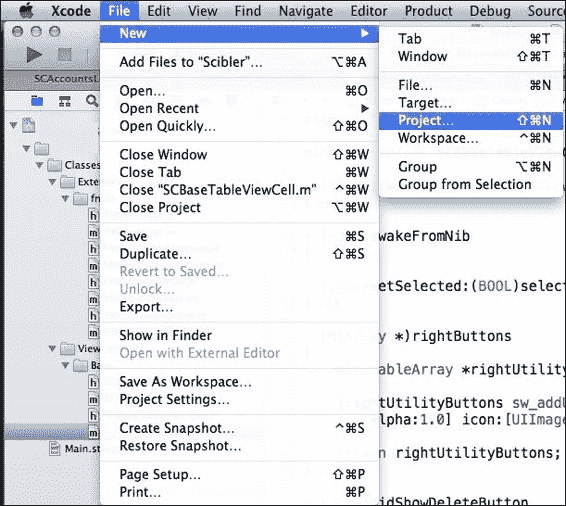

1.  然后在提示窗口中，导航到 **iOS** | **应用** | **SpriteKit 游戏** 并点击 **下一步**。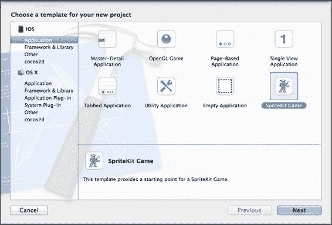

1.  在提示窗口中填写所有项目详细信息，并以 `AntKilling` 作为项目名称，提供你的 **组织名称**，设备为 **iPhone**，以及 **类前缀** 为 `AK`。点击 **下一步**。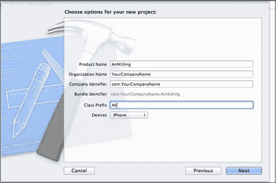

1.  在驱动器上选择一个位置以保存项目，并点击 **创建**。

1.  然后构建示例项目以检查示例项目的输出。一旦使用播放按钮构建并运行项目，你应该能在你的设备上看到以下内容：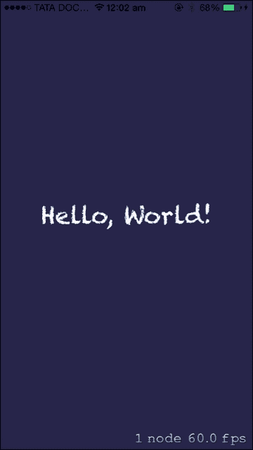

## 它是如何工作的...

以下是对入门项目的观察：

1.  如你所见，SpriteKit 的示例项目播放了一个带有背景色的标签。

1.  SpriteKit 的工作原理是场景，可以理解为游戏的层或屏幕。可以同时运行多个场景；例如，在游戏中可以同时运行游戏玩法场景、HUD 场景和得分场景。

现在我们可以查看入门项目的更多详细安排。以下是对观察的总结：

1.  在主目录中，你已经有了一个默认创建的场景，名为 **AKMyScene**。

1.  现在点击 `AKMyScene.m` 以探索代码，在屏幕上添加标签。你应该能看到以下截图类似的内容：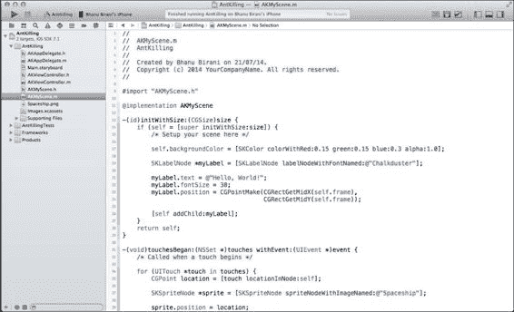

1.  现在我们将在下一节中更新此文件，用我们的代码创建 AntKilling 游戏。

1.  我们必须满足一些先决条件才能开始编写代码，例如将朝向锁定为横向，因为我们想要一个横向的游戏。

1.  要更改游戏的朝向，导航到 AntKilling 项目设置 | **目标** | **通用**。你应该能看到以下截图类似的内容：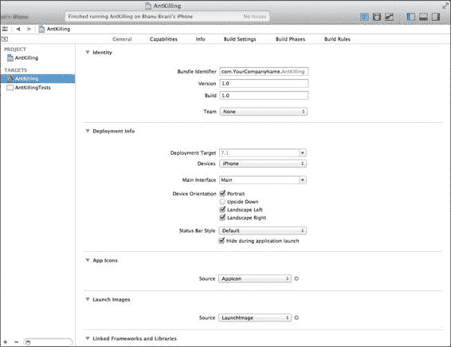

1.  现在在 **通用** 选项卡中，取消选中 **纵向** 以从设备朝向中，使最终设置应类似于以下截图：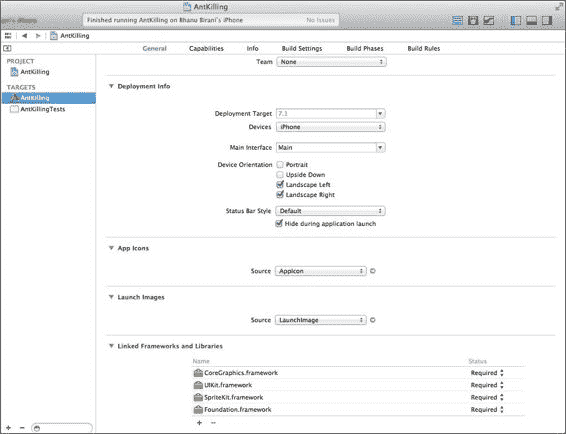

1.  现在构建并运行项目。你应该能够看到应用以横向模式运行。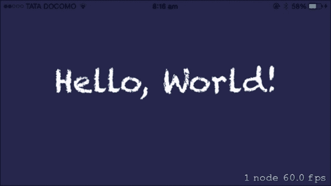

1.  屏幕的右下角显示了节点的数量和帧率。

# 使用 SpriteKit 开发小游戏

现在你已经对 SpriteKit 有了足够的了解。为了更深入地探索这个主题，让我们创建一个迷你游戏，这将帮助你更详细地理解这些概念。我们将创建一个杀蚂蚁游戏。在这个游戏中，我们将在屏幕上放置一只蚂蚁；当你点击它时，蚂蚁会进行动画。

## 准备工作

我们将使用上一节中创建的项目。为了创建一个迷你游戏，我们需要更新我们从入门项目获取的源文件。现在，是时候更新 AKMyScene 以包含我们的蚂蚁精灵了。

在进入更新代码的步骤之前，请下载本章的所有资源，并检查`assets`文件夹，其中包含本项目中使用的所有图像。

## 如何操作...

按照以下步骤依次执行以创建一个迷你游戏：

1.  打开`Resources`文件夹并将它们添加到你的 Xcode 项目中。

1.  在将资源添加到 Xcode 时，请确保选定的目标是**AntKilling**，并且已勾选**Copy items into destination group's folder (if needed)**。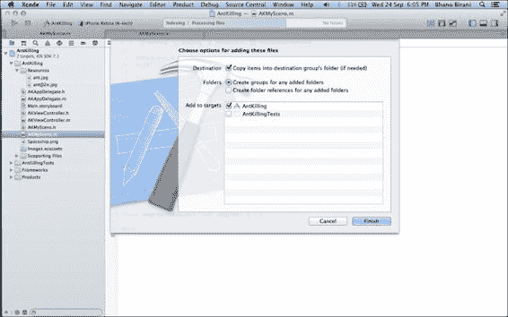

1.  现在，从`AKMyScene.m`中删除所有现有代码，使其看起来类似于以下截图：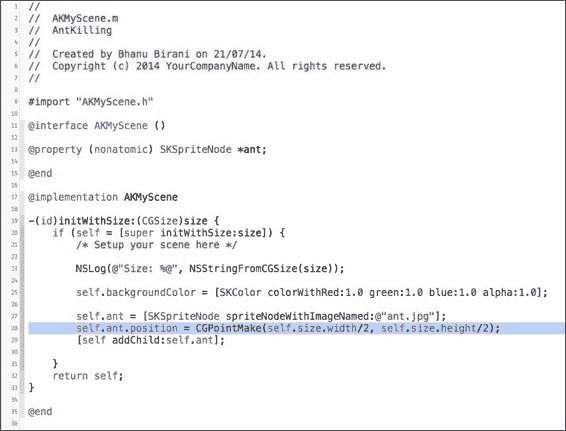

1.  现在，首先，我们创建了一个私有接口来声明私有变量：

    ```swift
    @interface AKMyScene ()
    @property (nonatomic) SKSpriteNode *ant;
    @end
    ```

1.  然后，在`init`方法中，我们打印了一个日志来打印屏幕的大小：

    ```swift
    NSLog(@"Size: %@", NSStringFromCGSize(size));
    ```

1.  现在，我们将使用以下代码行将屏幕背景色更改为白色：

    ```swift
    self.backgroundColor = [SKColor colorWithRed:1.0 green:1.0 blue:1.0 alpha:1.0];
    ```

1.  然后，我们将使用以下代码行中的`backgroundColor`属性将屏幕背景色更改为白色。

    ```swift
    self.backgroundColor = [SKColor colorWithRed:1.0 green:1.0 blue:1.0 alpha:1.0];
    ```

1.  在以下代码行中，我们使用`spriteNodeWithImageNamed`方法创建了一个精灵对象，并将图像名称传递给它。然后我们将它定位到屏幕的`100, 100`位置，这是屏幕的左下角。然后最终将其添加为子对象。

    ```swift
    self.ant = [SKSpriteNode spriteNodeWithImageNamed:@"ant.jpg"];
    self.ant.position = CGPointMake(100, 100);
    [self addChild:self.ant];
    ```

### 小贴士

**下载示例代码**

你可以从你购买的所有 Packt Publishing 书籍的账户中下载示例代码文件。[`www.packtpub.com`](http://www.packtpub.com)。如果你在其他地方购买了这本书，你可以访问[`www.packtpub.com/support`](http://www.packtpub.com/support)并注册，以便将文件直接通过电子邮件发送给你。

在游戏中，我们需要保留两套图像，一套用于正常显示，另一套用于视网膜显示。在前面代码块中，我们提供了精灵的名称为`ant.jpg`，这将自动引用视网膜设备的`ant@2x.jpg`。

现在构建并运行你的应用程序；你应该能看到以下截图类似的内容：

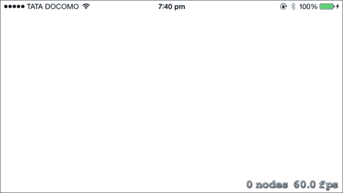

现在你可以看到，屏幕颜色已经变为白色，但屏幕上没有蚂蚁。这意味着代码中出了问题。所以，现在让我们检查我们的日志，它应该打印以下内容：

```swift
2014-07-22 19:13:27.019 AntKilling[1437:60b] Size: {320, 568}
```

因此，场景大小是错误的。场景应该打印宽度为 568，高度为 320，但它打印的是相反的。为了调试这个问题，导航到你的`AKViewController.m` `viewDidLoad`方法。你可以在`AntKilling/AntKilling/AKViewController.m`中找到这个函数的完整代码。

因此，从这个方法中，我们可以看到我们的场景正在从视图的边界中获取大小，并且这个`viewDidLoad`方法在视图被添加到视图层次结构之前就被调用了。所以它没有响应布局变化。因此，由于不一致的视图边界，我们的场景以错误的边界开始。

为了解决这个问题，我们必须将场景启动代码移动到`viewWillLayoutSubviews`方法中。在从`viewDidLoad`方法中移除代码并将其粘贴到`viewWillLayoutSubviews`之后，你可以在`AntKilling/AntKilling/AKViewController.m`中找到这个函数的完整代码。

现在，再次构建并运行应用程序；你应该能看到以下输出：


## 它是如何工作的...

所以，恭喜！你已经解决了问题。你的蚂蚁现在出现在屏幕上的指定位置。如果你仔细观察，你可以看到状态栏在游戏的顶部，这看起来并不好。为了从屏幕上移除状态栏，打开你的`AntKilling-Info.plist`文件，并添加一个值为`NO`的`UIViewControllerBasedStatusBarAppearance`属性。你的`.plist`文件应该看起来像以下截图：

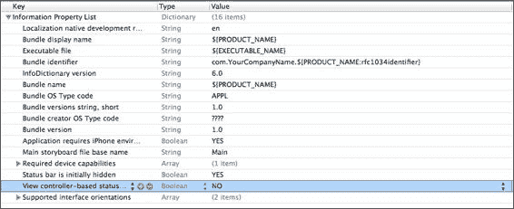

再次构建并运行你的项目；你现在应该能看到没有状态栏的游戏：

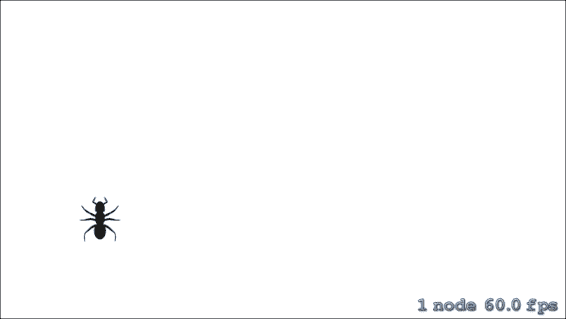

现在看起来完美了；我们的蚂蚁正如预期的那样居住在屏幕上。所以现在我们的下一个目标是在我们点击它时让蚂蚁动起来。为了实现这个目标，我们需要在`AKMyScene.m`文件中添加以下代码，就在你的`initWithSize`方法下面：

```swift
- (void)touchesBegan:(NSSet *)touches withEvent:(UIEvent *)event
{
  UITouch *touch = [touches anyObject];
  CGPoint positionInScene = [touch locationInNode:self];
  SKSpriteNode *touchedNode = (SKSpriteNode *)[self nodeAtPoint:positionInScene];
  if (touchedNode == self.ant) {
    SKAction *sequence = [SKAction sequence:@[[SKAction rotateByAngle:degreeToRadian(-3.0f) duration:0.2],
    [SKAction rotateByAngle:0.0 duration:0.1],
    [SKAction rotateByAngle:degreeToRadian(3.0f) duration:0.2]]];
    [touchedNode runAction:[SKAction repeatActionForever:sequence]];
  }
}

float degreeToRadian(float degree) {
  return degree / 180.0f * M_PI;
}
```

你可以在`AntKilling/AntKilling/AKMyScene.m`中找到这个函数的完整代码。

那么，现在让我们逐行分析一下到目前为止我们做了什么。首先，我们添加了`- (void)touchesBegan:(NSSet *)touches withEvent:(UIEvent *)event`方法来抓取场景上的所有触摸。

现在在函数的第一行允许你使用`CGPoint positionInScene = [touch locationInNode:self];`来抓取触摸。

在下一行，我们抓取了触摸并将其转换为`CGPoint positionInScene = [touch locationInNode:self];`位置。

在下一行，我们获取了被触摸的精灵：

```swift
SKSpriteNode *touchedNode = (SKSpriteNode *)[self nodeAtPoint:positionInScene];
```

现在，一旦你有了精灵对象，比较并检查选中的对象是否是蚂蚁虫。如果是蚂蚁虫，那么通过添加以下代码行来动画化对象：

```swift
SKAction *sequence = [SKAction sequence:@[[SKAction rotateByAngle:degreeToRadian(-3.0f) duration:0.2],[SKAction rotateByAngle:0.0 duration:0.1],[SKAction rotateByAngle:degreeToRadian(3.0f) duration:0.2]]];
[touchedNode runAction:[SKAction repeatActionForever:sequence]];
```

使用`SKAction`类，你可以执行各种动画序列，如`rotation`（旋转）、`moveBy`（移动）、`moveTo`（移动到）等等。此外，所有旋转方法都接受弧度作为角度。因此，为了实现旋转，我们必须在传递给任何`rotate`函数之前将度数转换为弧度。

现在，这段代码将会使选定的精灵开始动画。构建并运行项目，你将看到蚂蚁在点击时开始动画。

你很快就会注意到，当你轻敲蚂蚁时，它会开始动画，但没有办法停止这个动画。所以现在让我们添加一个方法，当你点击场景中的任何地方时，可以停止这个动画。导航到`- (void)touchesBegan:(NSSet *)touches withEvent:(UIEvent *)`事件方法，并将其更新为以下代码：

```swift
- (void)touchesBegan:(NSSet *)touches withEvent:(UIEvent *)event
{
  UITouch *touch = [touches anyObject];
  CGPoint positionInScene = [touch locationInNode:self];
  SKSpriteNode *touchedNode = (SKSpriteNode *)[self nodeAtPoint:positionInScene];
  if (touchedNode == self.ant) {
    SKAction *sequence = [SKAction sequence:@[[SKAction rotateByAngle:degreeToRadian(-3.0f)duration:0.2],
    [SKAction rotateByAngle:0.0 duration:0.1],
    [SKAction rotateByAngle:degreeToRadian(3.0f) duration:0.2]]];
    [touchedNode runAction:[SKAction repeatActionForever:sequence]];
  } else {
  [self.ant removeAllActions];
  }
}
```

现在，如果你仔细观察，你会发现我们添加了一个`if-else`条件来检查触摸是否在蚂蚁上，这允许它进行动画；当触摸在屏幕外的任何地方时，停止所有动作。为了在精灵上停止所有动作，我们可以在精灵上使用`removeAllActions`方法。
