# 第五章. 为 iOS 游戏添加音乐及 iCloud 简介

在本章中，我们将关注以下食谱：

+   为游戏添加音乐

+   添加背景和声音效果

+   iCloud 简介

+   iCloud 与 iOS 游戏的集成

# 简介

在第四章中，我们创建了一个完整的游戏，通过 FlyingSpaceship 收集金币，包含精灵、场景、透视无限滚动背景、粒子效果等，除了音乐。现在我们继续前进，添加游戏中最有趣的部分，即音乐。音乐和声音效果为游戏带来了参与感和乐趣；没有音乐的游戏是不存在的。因此，我们将集成一些酷炫和令人惊叹的背景音乐和声音效果到之前章节中构建的 FlyingSpaceship 游戏中。此外，我们还将介绍苹果最近发布的新技术 iCloud 及其框架。使用 iCloud，我们可以轻松且安全地将应用数据（如数据库）存储和检索到 iCloud，这是苹果提供的。

# 为游戏添加音乐

没有音乐或电影的完整，游戏也是如此。在这个主题中，我们的最终目标是集成一些平滑和令人惊叹的声音效果，使其看起来像一款完整的游戏，用户可以享受。因此，在 iOS 开发中，有许多方法可以将音频集成到应用或游戏中。有些是系统声音服务，AVAudioPlayer，音频队列服务和 OpenAL。所有这些都在应用中用于某些目的和效用。

在这个食谱中，我们将讨论 iOS 提供的不同方式集成音乐和声音效果。在接下来的部分中，我们将集成背景音乐和一些在 FlyingSpaceship 游戏中特定事件发生时的声音效果，这将是本章的入门套件。

## 准备工作

在开始介绍在游戏中集成音乐和声音效果的技术方法之前，我们应该了解音频是如何添加到视频、电影或需要音频的任何地方的。在游戏中，必须有背景音乐和一些在需要用户注意的事件中的声音效果。所有这些音乐和声音效果都应根据游戏的主题来决定。因此，本节的前提是具备音乐和声音效果的常识。

## 如何操作...

现在我们将探讨在我们的应用中实现声音服务的一些方法。

### 系统声音服务

这是一个播放音频文件简单的方法。为了使用系统声音服务播放音频声音并了解其工作原理，以下是一些涉及步骤：

1.  将音频文件添加到项目中，并使用`mainBundle`获取音频文件的路径：

    ```swift
    NSString *samplePath = [[NSBundle mainBundle] pathForResource:@"sample-sound" ofType:@"caf"];
    ```

1.  在这里，我们使用了`.caf`格式的音频文件。这是推荐的苹果格式。

1.  使用路径，形成一个 `NSURL`，它将被用来创建一个 `SystemSoundID`：

    ```swift
    NSURL *sampleURL = [NSURL fileURLWithPath:samplePath];
    ```

1.  然后使用之前形成的`NSURL`和代码中声明的名为`sampleSound`的`SystemSoundID`属性创建一个`systemSoundID`：

    ```swift
    AudioServicesCreateSystemSoundID((__bridge CFURLRef)sampleURL, &self.sampleSound);
    ```

1.  最后，使用`systemSoundID`，即`self.sampleSound`，播放音频文件。

    ```swift
    AudioServicesPlaySystemSound(self.sampleSound);
    ```

1.  要使用`AVAudioPlayer`播放音频声音，需要 AVFoundation 框架，因此必须导入该框架，并将音频文件添加到项目中，然后使用`mainBundle`获取音频文件的路径。要导入框架，请添加以下代码行：

    ```swift
    #import <AVFoundation/AVFoundation.h>
    ```

1.  现在创建一个`AVAudioPlayer`实例，内容为要播放的文件的`NSURL`，并带有错误。

    ```swift
    NSError *error;
    AVAudioPlayer *backgroundAudioPlayer = [AVAudioPlayer alloc] initWithContentsOfURL:file error:&error];
    ```

1.  然后，在`AVAudioPlayer`对象上调用`prepareToPlay`方法，以便准备播放音频文件。

    ```swift
    [backgroundAudioPlayer prepareToPlay];
    ```

1.  在播放音频文件之前，我们可以设置`volume`和`numberOfLoops`，最后我们可以播放音频文件。

    ```swift
    backgroundAudioPlayer.volume = 1.0;
    backgroundAudioPlayer.numberOfLoops = -1;
    [backgroundAudioPlayer play];
    ```

### AVAudioPlayer

### 音频队列服务

音频队列服务是高级音频功能，因为它是一种记录和播放音频的方法。它允许您的应用程序使用麦克风和扬声器进行硬件录制和播放，而无需了解硬件接口。它提供了精细的时间控制，用于安排播放和同步。有关音频队列服务的更多信息，请参阅*更多内容*部分。

首先，在需要低延迟精细控制音频的情况下，以上方法并不适用；在这种情况下，仅适合使用 OpenAL，这是一个由 iOS 支持的跨平台音频库。学习 OpenAL 具有陡峭的学习曲线。因此，要理解和实现它，请参阅*更多内容*部分。

## 它是如何工作的…

系统声音服务特别用于播放音频警报和简单的游戏音效，例如游戏中移动角色的点击声。使用此方法播放的每个声音都会分配一个`systemSoundID`。所有跟踪都基于此 ID，例如停止、暂停以及可以对音频应用的不同操作。我们只需添加以下几行代码即可播放声音：

```swift
NSString *samplePath = [[NSBundle mainBundle] pathForResource:@"sample-sound" ofType:@"caf"];
NSURL *sampleURL = [NSURL fileURLWithPath:samplePath];
AudioServicesCreateSystemSoundID((__bridge CFURLRef)sampleURL, &self.sampleSound);
AudioServicesPlaySystemSound(self.sampleSound);
```

`sampleSound`被声明为一个`SystemSoundID`属性，以便可以在`dealloc`方法中稍后处理声音。如果在`AudioServicesPlaySystemSound`方法之后立即处理声音，则声音将永远不会播放。

系统声音服务有一些缺点，例如仅支持`.caf`、`.aif`和`.wav`音频文件格式，声音长度不能超过 30 秒，并且一次只能播放一个声音。

## 更多内容…

除了系统声音服务和`AVAudioPlayer`之外，还有两种更高级的音频播放方式：用于播放和记录的音频队列服务以及用于精细控制时序的 OpenAL。您可以探索 Apple 的 Core Audio 概述和音频会话编程指南。

## 参见

为了更好地理解和学习音频队列服务和 OpenAL，您可以访问以下链接：

+   [`developer.apple.com/library/mac/documentation/MusicAudio/Conceptual/AudioQueueProgrammingGuide/Introduction/Introduction.html`](https://developer.apple.com/library/mac/documentation/MusicAudio/Conceptual/AudioQueueProgrammingGuide/Introduction/Introduction.html)

+   [`developer.apple.com/library/ios/documentation/audiovideo/conceptual/multimediapg/usingaudio/usingaudio.html`](https://developer.apple.com/library/ios/documentation/audiovideo/conceptual/multimediapg/usingaudio/usingaudio.html)

# 添加背景和音效

在了解了一些在应用程序中集成音频的方法之后，最常用且最简单的方法是 AVAudioPlayer。基本上，在本菜谱中，我们将添加将永远运行的背景音乐，以及在需要用户注意或用户需要被告知某些变化的具体事件上的音效。添加背景音乐和音效将在前几章中构建的 FlyingSpaceship 游戏中完成。

## 准备工作

在开始添加背景音乐和某些事件上的音效之前，我们应该对 `AVAudioPlayer` 类和 `AVFoundation` 框架有一个很好的理解。因此，本节的前提是了解如何使用 AVAudioPlayer 类播放音频，如前一道菜谱中讨论的那样。

## 如何做到这一点...

我们已经构建了完整的游戏 FlyingSpaceship，其中将在接下来的步骤中添加背景音乐和音效。为了完成这两项任务，将两个音频文件 `background-music.caf` 和 `coin-collected-sound.caf` 添加到项目的资源文件夹中。现在执行以下步骤：

1.  现在，我们将为游戏添加背景音乐，使其成为一个完整的游戏。首先，在 FlyingSpaceship 的 `FSMyScene` 文件中导入模块 `AVFoundation`。

    ```swift
    @import AVFoundation;
    ```

1.  声明一个名为 `backgroundAudioPlayer` 的属性，作为 `AVAudioPlayer` 对象。

    ```swift
    @property (nonatomic, strong) AVAudioPlayer     *backgroundAudioPlayer;
    ```

1.  如 *AVAudioPlayer* 部分的代码片段中所述，使用 `background-music.caf` 文件创建路径和 `NSURL` 文件。

    ```swift
    NSString *samplePath = [[NSBundle mainBundle] pathForResource:@"background-music.caf" ofType:nil];
    NSURL *file = [NSURL fileURLWithPath:samplePath];
    ```

1.  只需将属性 `self.backgroundAudioPlayer` 初始化为新的 `AVAudioPlayerobject`。这还需要一个错误对象和之前创建的音频文件。所有错误都将记录在我们传递的参数中对应的对象里。

    ```swift
    NSError *error;
    self.backgroundAudioPlayer = [[AVAudioPlayer alloc] initWithContentsOfURL:file error:&error];
    if (error)
    {
       NSLog(@"Error in audio play %@",[error userInfo]);
       return;
    }
    ```

1.  在此之后，调用该对象的 `prepareToPlay`，设置一些音量，例如 1.0，为了无限播放，将 `numberOfLoops` 设置为 `-1`。

    ```swift
    [self.backgroundAudioPlayer prepareToPlay];
    self.backgroundAudioPlayer.numberOfLoops = -1;
    self.backgroundAudioPlayer.volume = 1.0;
    ```

1.  最后，在这之后，播放永不结束的背景音乐。

    ```swift
    [self.backgroundAudioPlayer play];
    ```

1.  然后，将代码收集到一个名为 `startBackgroundMusic` 的函数中，其代码如下：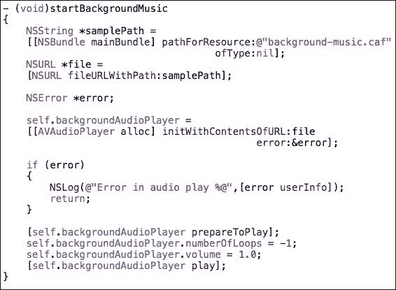

1.  要播放背景音乐，请在 `FSMyScene` 的 `initWithSize` 方法中调用 `startBackgroundMusic` 函数。

1.  现在，编译并运行项目；你应该能够听到游戏中的背景音乐。

1.  现在我们将在游戏中添加一个收集硬币时的音效。为此，声明一个名为 `coinCollectedAudioPlayer` 的属性，作为 AVAudioPlayer 对象。

    ```swift
    @property (nonatomic, strong) AVAudioPlayer     *coinCollectedAudioPlayer;
    ```

1.  如 *AVAudioPlayer* 部分的代码片段中所述，创建一个路径和一个 `NSURL` 文件，使用 `coin-collected-sound.caf` 文件。

    ```swift
    NSString *samplePath = [[NSBundle mainBundle] pathForResource:@"coin-collected-sound.caf" ofType:nil];
    NSURL *file = [NSURL fileURLWithPath:samplePath];
    ```

1.  将带有错误参数的前一个音效文件分配给 `self.coinCollectedAudioPlayer` 属性的 `AVAudioPlayer` 对象。创建此对象后，检查是否有错误，如果有，打印错误消息，然后从那里返回。

    ```swift
    NSError *error;
    self.coinCollectedAudioPlayer = [[AVAudioPlayer alloc] initWithContentsOfURL:file error:&error];
    if (error)
    {
       NSLog(@"Error in audio play %@",[error userInfo]);
       return;
    }
    ```

1.  之后，调用该对象的 `prepareToPlay`，设置一些音量，例如 1.0，一旦将 `numberOfLoops` 设置为 `1`，就播放一次。

    ```swift
    [self.coinCollectedAudioPlayer prepareToPlay];
    self.coinCollectedAudioPlayer.numberOfLoops = 1;
    self.coinCollectedAudioPlayer.volume = 1.0;
    ```

1.  最后，在完成所有这些之后，播放当太空船收集到硬币时必须播放的音效。

    ```swift
    [self.coinCollectedAudioPlayer play];
    ```

1.  在完成所有这些之后，将代码收集到一个名为 `playCoinCollectedSoundEffect` 的函数中，它看起来像这样：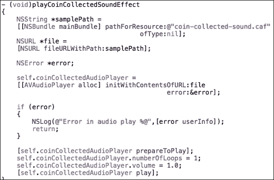

1.  要使硬币与太空船碰撞时播放，当检测到碰撞时调用 `spaceShipCollidedWithCoin` 函数时，调用 `playCoinCollectedSoundEffect` 函数。

1.  在所有背景音乐和音效集成之后，我们这一章的入门套件就准备好了。

## 它是如何工作的…

AVAudioPlayer 的工作原理以及背景音乐和音效的播放已在前面的话题中解释。这里背景音乐和音效之间的区别是 AVAudioPlayer 对象的 `numberOfLoops` 属性。对于背景音乐是 `-1`，对于太空船收集硬币的音效是 `1`。

## 还有更多…

使用相同的 AVAudioPlayer，我们可以一起播放多个音效，例如当太空船移动并且收集到硬币时播放移动的声音。所以，在音乐和音效的进一步增强上，没有限制。

## 参见

要更好地理解和学习 iOS 中的 Core Audio，请访问链接 [`developer.apple.com/library/mac/documentation/MusicAudio/Conceptual/CoreAudioOverview/CoreAudioEssentials/CoreAudioEssentials.html`](https://developer.apple.com/library/mac/documentation/MusicAudio/Conceptual/CoreAudioOverview/CoreAudioEssentials/CoreAudioEssentials.html)。

# iCloud 简介

苹果推出了一种名为 iCloud 的技术，该技术利用了使用新的 CloudKit 框架构建应用程序的能力。使用 iCloud，我们可以轻松且安全地将我们的应用程序数据以数据库的形式存储和检索在苹果构建的云中。CloudKit 框架为用户提供了一种使用他们的 iCloud Apple ID 匿名登录应用程序的方法，而无需共享他们的个人信息。最重要的是，CloudKit 让开发者专注于客户端应用程序开发，而 iCloud 本身则处理服务器端应用程序逻辑。它还提供了认证的、私有的和公共数据库存储服务，这些服务免费提供，存储限制非常高。

在本教程中，我们将介绍 iCloud 及其框架 CloudKit。我们将了解如何在 Xcode、iTunes Connect 中启用 iCloud 服务，以及如何通过开发设备的配置文件来集成 iCloud。在下一节中，我们将将 iCloud 服务集成到我们的游戏 FlyingSpaceship 中。

## 准备工作…

在开始使用 iCloud 和 CloudKit 框架进行设置之前，我们应该了解一些 Xcode 功能、iTunes Connect 和配置文件的特性。此外，我们还必须了解 iOS 中的核心数据、存储和检索数据，以便顺利使用和集成 CloudKit 框架。这些都是开始使用新技术 iCloud 及其框架的先决条件。

要将 iCloud 集成到任何应用程序中，在 Xcode 中进行设置之前，以下步骤是必须的：

+   安装了 Xcode 6 或更高版本的 Mac 计算机

+   iOS 或 Mac 开发者计划的会员资格

+   在会员中心创建代码签名标识和配置文件的权限

+   最后，在所有这些之后，我们的 Xcode 项目应该可以无错误地构建

## 如何操作…

在本教程中，我们将学习如何在我们的应用程序中启用 CloudKit 的步骤。CloudKit 是由苹果公司提供的一个应用程序服务。它仅适用于通过 App Store 或 Mac App Store 分发的应用程序。CloudKit 需要从我们的 Xcode 项目中执行一些额外的配置。我们的应用程序必须经过配置和代码签名才能访问 CloudKit 服务。因此，我们将为我们的 FlyingSpaceship 游戏启用 CloudKit。按照以下步骤在 Xcode 项目中为我们的游戏启用 CloudKit：

1.  打开我们想要启用和使用 CloudKit 服务的 Xcode 项目（FlyingSpaceship）。

1.  在项目导航器中点击**项目**，我们可以看到已选中**常规**部分。

1.  选择**FlyingSpaceship**目标，然后选择下一部分**功能**。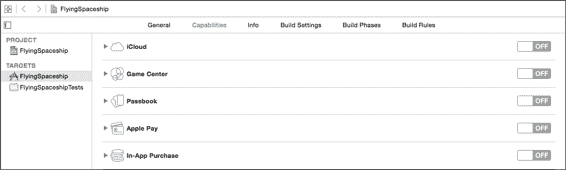

1.  现在，点击第一行，即**iCloud**，将打开一个类似的部分：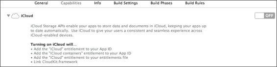

1.  现在，在右侧，切换到 iCloud，将发生一些加载。

1.  一旦加载完成，iCloud 将被启用，并显示如下截图所示选项：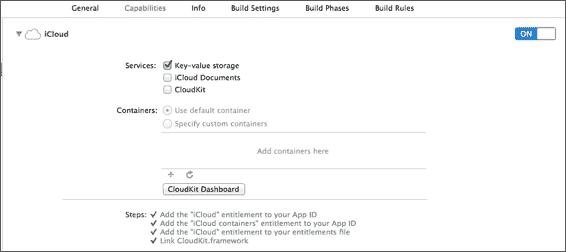

1.  如我们所见，iCloud 提供了三个服务；根据应用程序的需要启用它们。目前，我们将启用 CloudKit。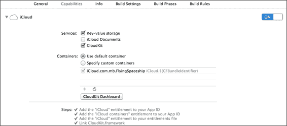

1.  此外，还有一个名为**CloudKit 仪表板**的按钮可见。点击此按钮，我们将被重定向到苹果 iTunes Connect 中应用程序 FlyingSpaceship 的 CloudKit 仪表板。CloudKit 仪表板的侧边栏、要添加的记录类型和容器部分看起来如下。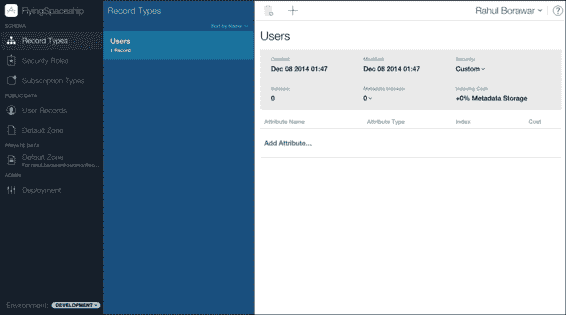

1.  仪表板用于执行许多数据库管理任务，例如修改模式和记录，如前一个屏幕截图所示。一个应用程序的容器数据库存在于开发和生产环境中。使用仪表板，我们可以对记录进行创建、删除、修改等操作。

1.  要探索登录仪表板并点击左侧列中的选项，该列有许多操作，如以下屏幕截图所示：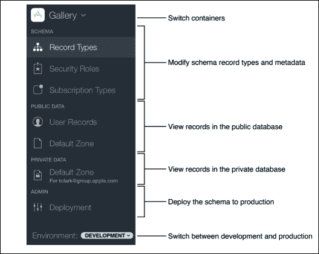

## 如何工作…

iCloud 技术提供了一种简单且安全的方式来创建一个应用程序，该应用程序将结构化应用程序和用户数据存储在称为 iCloud 的服务器上。使用 CloudKit 框架，不同设备上由不同用户启动的 iCloud 应用程序实例可以访问应用程序数据库中存储的资产。在为任何应用程序启用 iCloud 之后，我们可以为我们的应用程序创建模型对象，这些对象在多个设备上运行的应用程序之间持久存在并共享。这些数据或模型对象以记录的形式存储在数据库中，并且可以被授权用户访问。

iCloud 是苹果公司提供的一项免费服务，允许用户通过 Apple ID 在其所有设备上访问其个人数据。它通过结合基于网络的专用 API 和 OS 的全面支持来实现这一切。苹果公司通过提供服务器基础设施、备份和用户账户来鼓励构建启用 iCloud 的应用程序。

下图是 iCloud 核心思想的图示，它解决了多个设备之间同步的问题。使用 iCloud 应用程序的用户无需考虑其设备的同步。当用户采用 iCloud 存储时，如以下图所示，所有更改都会自动出现在连接到该 iCloud 账户的所有设备上。

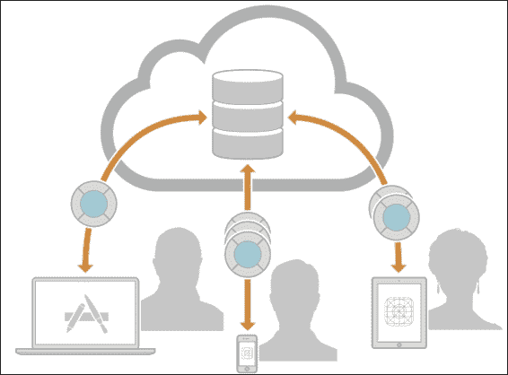

## 还有更多…

iCloud 支持许多种类的存储。存储类型包括：

+   如用户偏好、设置和简单的应用程序状态数据之类的键值存储

+   如文字处理文档和绘图之类的 iCloud 文档存储

+   结构化内容的多种设备数据库解决方案的核心数据存储

+   CloudKit 存储用于我们自行管理和共享结构化数据

要在 iCloud 上存储数据，我们可以根据我们的需求和能力使用这些方法中的任何一种。继续前进，我们可以选择这些存储类型并创建一个 iCloud 应用程序，以在多台设备上共享存储。

## 参考以下内容…

如需了解更多关于存储类型的信息，请访问链接 [`developer.apple.com/library/ios/documentation/DataManagement/Conceptual/CloudKitQuickStart/Introduction/Introduction.html#//apple_ref/doc/uid/TP40014987-CH1-SW1`](https://developer.apple.com/library/ios/documentation/DataManagement/Conceptual/CloudKitQuickStart/Introduction/Introduction.html#//apple_ref/doc/uid/TP40014987-CH1-SW1)。

# 将 iCloud 与 iOS 游戏集成

在这个菜谱中，您将学习将 iCloud 与 iOS 游戏集成的步骤。iCloud 集成在应用开发中扮演着重要角色，因为它帮助我们支持各种功能并增强跨设备同步。在这个菜谱中，我们将探索并集成游戏中的几个 iCloud 功能。

## 准备工作

到目前为止，我们已经完成了与 iCloud 玩耍的初始设置。为了将 iCloud 集成到任何应用中，我们必须注册 iOS 或 Mac 开发者计划的会员资格，并拥有设备配置文件和 AppID。为了完成这项工作并开始集成部分，我们必须查看这两个链接：

+   [`developer.apple.com/library/ios/documentation/IDEs/Conceptual/AppDistributionGuide/AddingCapabilities/AddingCapabilities.html#//apple_ref/doc/uid/TP40012582-CH26`](https://developer.apple.com/library/ios/documentation/IDEs/Conceptual/AppDistributionGuide/AddingCapabilities/AddingCapabilities.html#//apple_ref/doc/uid/TP40012582-CH26)

+   [`developer.apple.com/library/ios/documentation/IDEs/Conceptual/AppDistributionGuide/Introduction/Introduction.html#//apple_ref/doc/uid/TP40012582`](https://developer.apple.com/library/ios/documentation/IDEs/Conceptual/AppDistributionGuide/Introduction/Introduction.html#//apple_ref/doc/uid/TP40012582)

在完成所有配置部分后，我们可以在游戏 FlyingSpaceship 中开始通过 CloudKit 集成 iCloud。

## 如何操作...

iCloud 允许您轻松地从其安全服务器存储和检索数据。这也提供了在多个应用程序之间共享保存数据的附加功能。为了保存这些数据，我们的 iCloud 应用将这些数据放置在一个特殊的本地文件系统，称为 iCloud 容器。它也被称为**ubiquity container**，作为相应 iCloud 存储的本地表示。这些数据完全独立于我们应用的其他数据；由操作系统保存。

对于某些 iCloud 服务，我们的应用并不直接与 iCloud 服务器通信，相反，操作系统管理所有这些数据上传和下载，为连接到 iCloud 账户的设备。然而，CloudKit 提供了管理这些活动的功能。以下是为使用这些服务所需的步骤：

1.  配置对应用 iCloud 容器的访问。这涉及到请求权限并程序化初始化这些容器。

1.  设计应用以相应地处理 iCloud 服务的响应，例如当用户从 iCloud 注销，以及在其他设备上的我们应用实例可以编辑数据时。

1.  使用适当的 iCloud API 进行读写操作。

1.  当需要时，操作系统根据应用的设计协调数据到 iCloud 和从 iCloud 的过渡。

我们已经简要讨论了 iCloud 容器，现在是时候在我们的应用程序中实现 iCloud 容器了。要实现它们，我们将打开 Xcode 项目的 **能力** 选项卡，该选项卡管理我们应用程序的权限和容器。当我们在这个选项卡中启用 iCloud 时，Xcode 将我们的应用程序配置为默认的 iCloud 容器，其名称基于应用程序的包标识符。这个默认容器被大多数应用程序使用，如下面的截图所示：

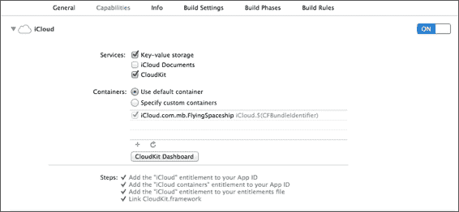

如果我们想要构建一些需要相互共享数据的应用程序，那么我们可以启用 **指定自定义容器** 选项，并且可以通过以下步骤完成：

1.  首先，在浏览器中打开 [`developer.apple.com/`](https://developer.apple.com/)，然后点击 **会员中心**。

1.  在会员中心的六个部分中，转到 **证书**、**标识符** 和 **配置文件** 部分，然后在 **iOS** 部分转到 **标识符**，那里有一个标识符类型的列表。如何操作…

1.  点击 **iCloud 容器** 选项卡，我们可以在那里看到一个默认容器。如何操作…

1.  现在，要添加另一个特定的 iCloud 容器，点击页面右上角的加号按钮，然后输入 ID `iCloud.com.mb.FlyingSpaceshipShared`。为容器添加一些描述。如何操作…

1.  执行完所有前面的步骤后，我们可以在会员中心找到我们的自定义 AppID。如何操作…

1.  当特定的容器创建后，现在转到我们应用程序 Xcode 项目的 **能力** 选项卡。我们可以在 **iCloud** 部分看到一个额外的容器。如何操作…

1.  现在要使用特定的容器，选择 **指定自定义容器** 单选按钮，然后选择 `iCloud.com.mb.FlyingSpaceshipShared` 容器。

现在，我们将为 iCloud 准备我们的代码。我们将把一些初始设置合并到代码中，以便应用程序使用 iCloud 服务。首先，当用户第一次启动启用 iCloud 的 FlyingSpaceship 游戏时，我们应该邀请他们使用 iCloud。选择应该是全部或无。因此，为了邀请用户使用 iCloud，以下是一些初始设置的步骤：

1.  在我们的应用程序启动的 `application:didFinishLaunchingWithOptions` 方法中，从 `NSFileManager` 获取 `ubiquityIdentityToken`。

    ```swift
        NSFileManager* fileManager = [NSFileManager defaultManager];
        id currentiCloudToken = fileManager.ubiquityIdentityToken;
    ```

1.  然后，通过使用 `NSFileManager` 获取的 `ubiquityIdentityToken` 属性在用户默认数据库中存档 iCloud 可用性。

    ```swift
     if (currentiCloudToken)
        {
        NSData *newTokenData = [NSKeyedArchiver archivedDataWithRootObject:currentiCloudToken];
          [[NSUserDefaults standardUserDefaults]setObject:newTokenData forKey:@"com.mb.FlyingSpaceship.UbiquityIdentityToken"];
        }
        else
        {
          [[NSUserDefaults standardUserDefaults] removeObjectForKey: @"com.mb.FlyingSpaceship.UbiquityIdentityToken"];
        }
    ```

1.  现在，保存的 `currentiCloudToken` 函数是代表当前活动 iCloud 账户的唯一令牌。使用这个令牌，我们可以比较检测当前账户是否与上一个账户不同。

1.  当用户启用飞行模式时，iCloud 将无法访问，但当前 iCloud 账户将保持登录状态，并且 `ubiquityIdentityToken` 包含当前 iCloud 账户的令牌。

1.  对于从 iCloud 注销的用户，`ubiquityIdentityToken`的值设置为`nil`。因此，为了接收通知，我们应该注册为`NSUbiquityIdentityDidChangeNotification`通知的观察者，其中接收令牌。这是一个关于 iCloud 可用性变化的通知，我们可以在通知选择器`iCloudAccountAvailabilityChanged`中相应地处理它。

    ```swift
    [[NSNotificationCenter defaultCenter] addObserver:selfselector:@selector(iCloudAccountAvailabilityChanged:)name:NSUbiquityIdentityDidChangeNotification object:nil];
    ```

1.  在存档 iCloud 令牌并注册 iCloud 通知后，我们的应用程序就准备好显示一个警报视图，以向用户展示使用 iCloud 的邀请，并提供两个选项：仅本地和使用 iCloud。为此，首先在检索令牌时保存一个布尔变量`FirstLaunchWithiCloudAvailable`：

    ```swift
      BOOL firstLaunchWithiCloudAvailable = [[NSUserDefaults standardUserDefaults] objectForKey:@"FirstLaunchWithiCloudAvailable"];
      if (firstLaunchWithiCloudAvailable == NO)
        {
          [[NSUserDefaults standardUserDefaults] setObject:[NSNumber numberWithBool:YES]
          forKey:@"FirstLaunchWithiCloudAvailable"];
        }
      [[NSUserDefaults standardUserDefaults] synchronize];
    ```

1.  此外，始终在`didFinishLauchingWithOptions`中调用`showiCloudInviteAlertView`方法。在此方法中，如果当前存在令牌（只有在用户登录到 iCloud 账户时才会存在，否则返回`NIL`）并且`FirstLaunchWithiCloudAvailable`布尔值为 YES，则向用户显示警报视图以邀请其使用 iCloud。

    ```swift
    - (void)showiCloudInviteAlertView
    {
        BOOL firstLaunchWithiCloudAvailable = [[NSUserDefaults standardUserDefaults] objectForKey:@"FirstLaunchWithiCloudAvailable"];

        if (currentiCloudToken && firstLaunchWithiCloudAvailable)
        {
         UIAlertView *alertView = [[UIAlertView alloc]  initWithTitle: @"Choose Storage Option" message: @"Should documents be stored in iCloud and available on all your devices?"
                delegate: self
                   cancelButtonTitle: @"Local Only"
               otherButtonTitles: @"Use iCloud", nil];
            [alertView show];
        }
    }
    ```

在进行所有这些更改后，`didFinishLauchingWithOptions:`方法将看起来像这样：

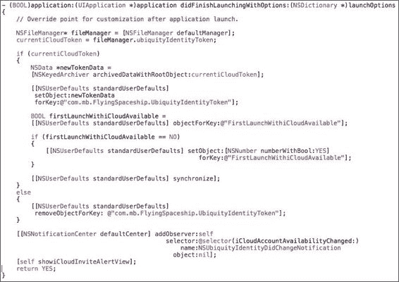

## 它是如何工作的…

如果我们开始探索 iCloud 容器，那么我们会注意到，根据应用程序对 iCloud 集成的设计，要么选择默认容器，要么创建自定义容器；iCloud 服务应相应配置。如果我们不创建任何自定义容器，则将配置默认容器，其名称将基于应用程序的包 ID。

并且为了共享数据，我们使用 iCloud 的**能力**标签页中的**指定自定义容器标识符**复选框来添加一个或多个容器 ID。我们需要指定为自定义容器创建的 ID。对于多个容器 ID，第一个 ID 是应用程序的主要 iCloud 容器。

关于自定义 iCloud 容器，当设备登录到同一应用程序的 iCloud 账户时，将提供共享功能。

现在我们将讨论为 iCloud 准备代码的方法。如果用户已登录到应用程序的 iCloud 账户，则仅返回`ubiquityIdentityToken`；否则返回`nil`。此令牌是通过`NSFileManager`对象检索的。如果存在，它还会根据应用程序对 iCloud 集成的设计保存下来，以供应用程序进一步使用。

我们正在使用`NSUbiquityIdentityDidChangeNotification`订阅通知，以获取`ubiquityIdentityToken`中所有更改的回调。例如，每当用户注销时，它都会提供回调。

有时 iCloud 可能无法供我们的应用程序使用；在这种情况下，当应用程序在后台运行时，账户将不可用。因此，应用程序必须删除所有指向用户特定 iCloud 存储的引用，并刷新依赖于 iCloud 存储的用户界面。

在令牌保存并注册了`UbiquityIdentityChange`的通知后，应用就准备好显示一个使用 iCloud 的警告。根据用户的选取，代码中会使用相关的 iCloud API，例如键值存储、iCloud 文档存储和 CloudKit 存储，以进一步处理 iCloud 数据。

## 更多内容…

如前文所述，iCloud 技术中提供了许多 iCloud 存储 API，例如键值存储、iCloud 文档存储和 CloudKit 存储。从所有这些中，正确的 API 选择取决于需要完成的目的。因此，作为一个试验，可以将飞行飞船游戏的用户数据存储在 iCloud 服务器上，并使用之前提到的任何合适的 API 进行共享。

为了学习更多并做出适当的决策，我们可以查看以下链接：

[`developer.apple.com/library/ios/documentation/General/Conceptual/iCloudDesignGuide/Chapters/iCloudFundametals.html#//apple_ref/doc/uid/TP40012094-CH6-SW28`](https://developer.apple.com/library/ios/documentation/General/Conceptual/iCloudDesignGuide/Chapters/iCloudFundametals.html#//apple_ref/doc/uid/TP40012094-CH6-SW28).

## 参见

要获取更多信息以及将 iCloud 集成到任何应用中，我们可以访问以下链接：

[`developer.apple.com/library/ios/documentation/General/Conceptual/iCloudDesignGuide/Chapters/Introduction.html#//apple_ref/doc/uid/TP40012094-CH1-SW1`](https://developer.apple.com/library/ios/documentation/General/Conceptual/iCloudDesignGuide/Chapters/Introduction.html#//apple_ref/doc/uid/TP40012094-CH1-SW1).
