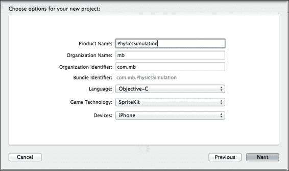
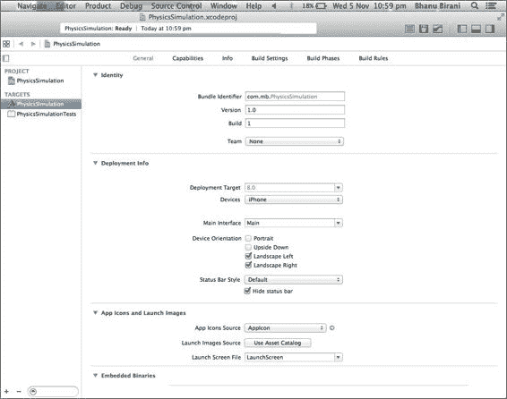
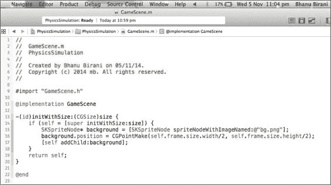
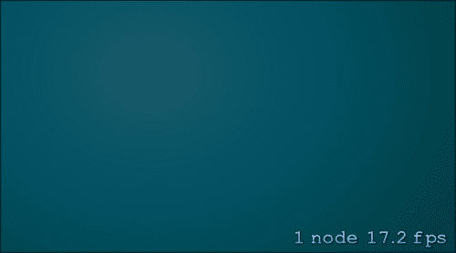
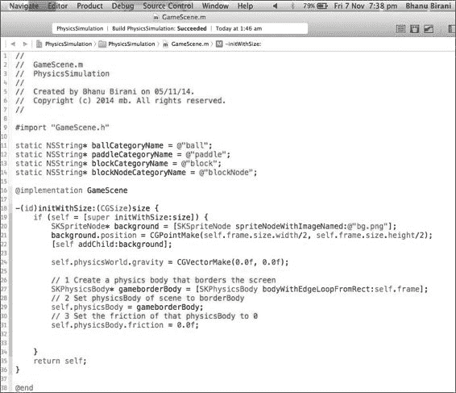
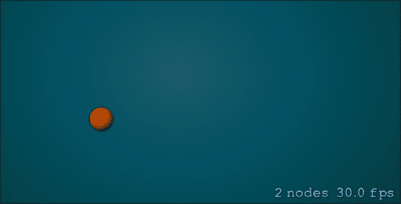
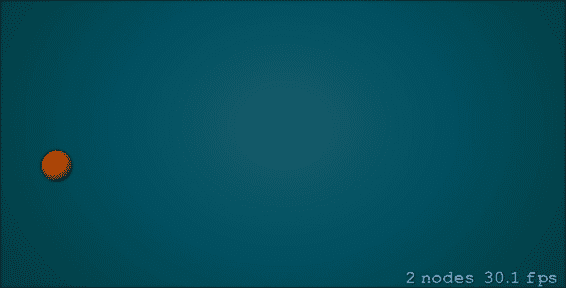
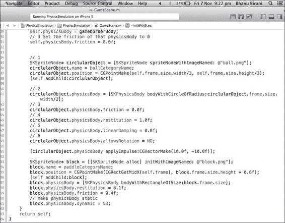
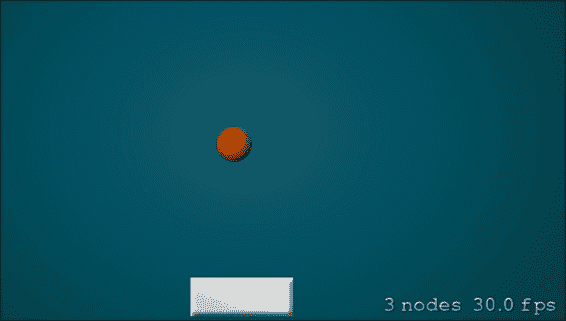
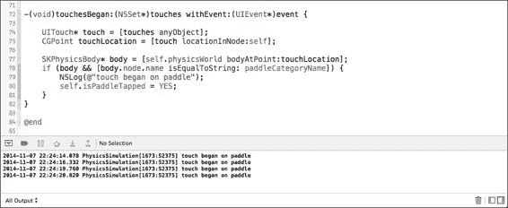

# 第六章：物理模拟

在本章中，我们将涵盖以下主题：

+   物理模拟简介

+   将物理引擎集成到游戏中

+   添加现实世界模拟

# 简介

在第五章中，我们学习了如何将音乐添加到我们的游戏中，以及如何与 iCloud 集成。现在在本章中，我们的主要重点是通过对物理模拟的介绍来为游戏添加现实感。SpriteKit 无缝集成了物理引擎，在本章中我们将探索并尝试将物理添加到我们的游戏中。基本上，SpriteKit 被分为以下两个主要组件：

+   你在屏幕上看到的图形界面，包括 UI 界面、动画、音效等

+   第二个是物理物理世界，它决定了游戏对象之间的交互和行为

# 物理模拟简介

我们都喜欢具有真实效果和动作的游戏。在本章中，我们将学习如何使我们的游戏更加逼真。你是否曾经想过如何为游戏对象提供真实效果？正是物理为游戏及其角色提供了真实效果。在本章中，我们将学习如何在游戏中使用物理。

在使用 SpriteKit 开发游戏时，你需要经常更改游戏的世界。世界是游戏中主要的对象，它包含所有其他游戏对象和物理模拟。我们还可以根据需要更新游戏世界的重力。默认世界重力为 9.8，这也是地球的重力，世界重力使得所有物体在创建后立即落向地面。

可以使用以下链接了解更多关于 SpriteKit 的信息：

[`developer.apple.com/library/ios/documentation/GraphicsAnimation/Conceptual/SpriteKit_PG/Physics/Physics.html`](https://developer.apple.com/library/ios/documentation/GraphicsAnimation/Conceptual/SpriteKit_PG/Physics/Physics.html)

## 准备工作

第一项任务是创建世界并向其中添加物体，这些物体可以按照物理原理进行交互。你可以以精灵的形式创建游戏对象，并将物理体关联到它们。你还可以设置对象的各种属性来指定其行为。

## 如何操作...

在本节中，我们将学习用于开发游戏的基本组件。我们还将学习如何设置游戏配置，包括重力、边界等世界设置。

1.  第一步是将重力应用到场景中。每个场景都有一个与之关联的物理世界。我们可以使用以下代码行来更新场景中物理世界的重力：

    ```swift
    self.physicsWorld.gravity = CGVectorMake(0.0f, 0.0f);
    ```

    目前，我们已经将场景的重力设置为 0，这意味着物体将处于自由落体状态。它们在世界中不会因为重力而受到任何力的作用。

1.  在几个游戏中，我们还需要为游戏设置边界。通常，视图的边界可以充当物理世界的边界。以下代码将帮助我们设置游戏的边界，这将与游戏场景的边界一致：

    ```swift
    // 1 Create a physics body that borders the screen
    SKPhysicsBody* gameBorderBody = [SKPhysicsBody bodyWithEdgeLoopFromRect:self.frame];
    // 2 Set physicsBody of scene to gameBorderBody
    self.physicsBody = gameBorderBody;
    // 3 Set the friction of that physicsBody to 0
    self.physicsBody.friction = 0.0f;
    ```

    在代码的第一行中，我们初始化了一个`SKPhysicsBody`对象。这个对象用于将物理模拟添加到任何`SKSpriteNode`。我们创建了一个`gameBorderBody`，其尺寸等于当前场景的帧。

    然后，我们将该物理对象分配给当前场景的`physicsBody`（每个`SKSpriteNode`对象都有一个`physicsBody`属性，通过它可以关联物理体到任何节点）。

    在此之后，我们更新了`physicsBody.friction`。这一行代码更新了我们世界的摩擦属性。摩擦属性定义了一个物理体与另一个物理体之间的摩擦值。在这里，我们将它设置为`0`，以便使物体能够自由移动，而不会减速。

1.  每个游戏对象都是继承自`SKSpriteNode`类，这使得物理体可以保持对节点的控制。让我们举一个例子，使用以下代码创建一个游戏对象：

    ```swift
    // 1
    SKSpriteNode* gameObject = [SKSpriteNode spriteNodeWithImageNamed: @"object.png"];
    gameObject.name = @"game_object";
    gameObject.position = CGPointMake(self.frame.size.width/3, self.frame.size.height/3);
    [self addChild:gameObject];

    // 2
    gameObject.physicsBody = [SKPhysicsBody bodyWithCircleOfRadius:gameObject.frame.size.width/2];
    // 3
    gameObject.physicsBody.friction = 0.0f;
    ```

    我们已经熟悉了代码的前几行，其中我们创建了精灵引用并将其添加到场景中。现在在下一行代码中，我们将物理体与该精灵关联。我们初始化了一个具有半径的圆形物理体，并将其与精灵对象关联。

    然后，我们可以更新物理体的各种其他属性，例如摩擦、恢复、线性阻尼等。

1.  物理体属性还允许你施加力。要施加力，你需要提供你想要施加力的方向。

    ```swift
    [gameObject.physicsBody applyForce:CGVectorMake(10.0f, -10.0f)];
    ```

    在代码中，我们在世界的右下角施加力。为了提供方向坐标，我们使用了`CGVectorMake`，它接受物理世界的向量坐标。

1.  你也可以施加冲量而不是力。冲量可以定义为在特定时间间隔内作用的力，并且等于在该时间间隔内产生的线性动量变化。

    ```swift
    [gameObject.physicsBody applyImpulse:CGVectorMake(10.0f, -10.0f)];
    ```

1.  在创建游戏时，我们经常使用静态对象。要创建一个矩形静态对象，我们可以使用以下代码：

    ```swift
    SKSpriteNode* box = [[SKSpriteNode alloc] initWithImageNamed: @"box.png"];
    box.name = @"box_object";
    box.position = CGPointMake(CGRectGetMidX(self.frame), box.frame.size.height * 0.6f);
    [self addChild:box];
    box.physicsBody = [SKPhysicsBody bodyWithRectangleOfSize:box.frame.size];
    box.physicsBody.friction = 0.4f;
    // make physicsBody static
    box.physicsBody.dynamic = NO;
    ```

    所以所有代码都是相同的，除了一个特殊的属性，它是动态的。默认情况下，此属性设置为`YES`，这意味着所有物理体默认都是动态的，并且可以在将此布尔值设置为`NO`后转换为静态。静态体不会对任何力或冲量做出反应。简单来说，动态物理体可以移动，而静态物理体则不能。

# 将物理引擎集成到游戏中

从本节开始，我们将开发一个具有动态移动身体和静态身体的迷你游戏。游戏的基本概念将是创建一个无限弹跳的球，并使用移动的拍子来给球提供方向。

## 准备中...

要使用物理引擎开发迷你游戏，首先创建一个新的项目。打开 Xcode，转到**文件** | **新建** | **项目**，然后导航到**iOS** | **应用程序** | **SpriteKit 游戏**。在弹出的窗口中，提供**产品名称**为`PhysicsSimulation`，导航到**设备** | **iPhone**，然后点击**下一步**，如图所示：



点击**下一步**并将项目保存在您的硬盘上。

保存项目后，您应该能够看到以下截图类似的内容：



在项目设置页面中，只需取消勾选**设备方向**部分的**纵向**，因为我们只为这个游戏支持横向模式。

图形和游戏不能长期分离；您还需要为这个游戏准备一些图形。下载图形文件夹，将其拖动并导入到项目中。确保勾选了**如果需要，将项目组文件夹中的项目复制到目标文件夹**，然后点击**完成**按钮。它应该类似于以下截图：



## 如何操作...

现在您的项目模板已准备好用于基于物理的迷你游戏。我们需要更新游戏模板项目以开始编写游戏逻辑代码。按照以下步骤将基本物理对象集成到游戏中。

1.  打开文件`GameScene.m`。这个类创建了一个将被连接到游戏中的场景。从这个类中删除所有代码，并添加以下函数：

    ```swift
    -(id)initWithSize:(CGSize)size {
        if (self = [super initWithSize:size]) {
            SKSpriteNode* background = [SKSpriteNode spriteNodeWithImageNamed:@"bg.png"];
            background.position = CGPointMake(self.frame.size.width/2, self.frame.size.height/2);
            [self addChild:background];
        }
    }
    ```

    这个`initWithSize`方法创建了一个指定大小的空白场景。`init`函数中编写的代码允许您在游戏中将背景图像放置在屏幕中央。

1.  现在当您编译并运行代码时，您将观察到背景图像在场景中放置不正确。要解决这个问题，打开`GameViewController.m`。从这个文件中删除所有代码，并添加以下函数；

    ```swift
    -(void)viewWillLayoutSubviews {
        [super viewWillLayoutSubviews];

        // Configure the view.
        SKView * skView = (SKView *)self.view;
        if (!skView.scene) {
            skView.showsFPS = YES;
            skView.showsNodeCount = YES;

            // Create and configure the scene.
            GameScene * scene = [GameScene sceneWithSize:skView.bounds.size];
            scene.scaleMode = SKSceneScaleModeAspectFill;

            // Present the scene.
            [skView presentScene:scene];
        }
    }
    ```

    为了确保视图层次结构正确布局，我们实现了`viewWillLayoutSubviews`方法。它不能在`viewDidLayoutSubviews`方法中完美工作，因为那时场景的大小是未知的。

1.  现在编译并运行应用程序。您应该能够正确地看到背景图像。它看起来类似于以下截图：

1.  因此，现在我们已经放置了背景图像，让我们给世界添加重力。打开`GameScene.m`，并在`initWithSize`方法的末尾添加以下代码行：

    ```swift
    self.physicsWorld.gravity = CGVectorMake(0.0f, 0.0f);
    ```

    这行代码将设置世界的重力为 0，这意味着将没有重力。

1.  现在我们已经移除了重力以使物体自由下落，因此创建一个围绕世界的边界非常重要，这将包含世界中的所有物体，并防止它们离开屏幕。添加以下代码行以在屏幕周围添加不可见的边界来保持物理对象：

    ```swift
    // 1 Create a physics body that borders the screen
    SKPhysicsBody* gameborderBody = [SKPhysicsBody bodyWithEdgeLoopFromRect:self.frame];
    // 2 Set physicsBody of scene to borderBody
    self.physicsBody = gameborderBody;
    // 3 Set the friction of that physicsBody to 0
    self.physicsBody.friction = 0.0f;
    ```

    在第一行，我们创建了一个基于边缘的物理边界对象，具有屏幕大小的框架。这种类型的物理体没有质量或体积，并且不受力和冲量的影响。然后我们将对象与场景的物理体关联起来。在最后一行，我们将物体的摩擦力设置为 0，以便物体与边界表面之间实现无缝交互。最终的文件应该看起来像以下截图：

    

1.  现在我们有了准备好的表面来容纳物理世界对象。让我们使用以下代码行创建一个新的物理世界对象：

    ```swift
    // 1
    SKSpriteNode* circlularObject = [SKSpriteNode spriteNodeWithImageNamed: @"ball.png"];
    circlularObject.name = ballCategoryName;
    circlularObject.position = CGPointMake(self.frame.size.width/3, self.frame.size.height/3);
    [self addChild:circlularObject];

    // 2
    circlularObject.physicsBody = [SKPhysicsBody bodyWithCircleOfRadius:circlularObject.frame.size.width/2];
    // 3
    circlularObject.physicsBody.friction = 0.0f;
    // 4
    circlularObject.physicsBody.restitution = 1.0f;
    // 5
    circlularObject.physicsBody.linearDamping = 0.0f;
    // 6
    circlularObject.physicsBody.allowsRotation = NO;
    ```

    在这里，我们已经创建了精灵，并将其添加到场景中。然后在后续步骤中，我们将圆形物理体与精灵对象关联起来。最后，我们改变该物理体的属性。

1.  现在编译并运行应用程序；你应该能在屏幕上看到圆形球体，如下面的截图所示：

1.  圆形球被添加到屏幕上，但它没有任何作用。因此，是时候在代码中添加一些动作了。在`initWithSize`方法的末尾添加以下代码行：

    ```swift
    [circlularObject.physicsBody applyImpulse:CGVectorMake(10.0f, -10.0f)];
    ```

    这将对物理体施加力，进而移动相关的球体精灵。

1.  现在编译并运行项目。你应该能看到球体移动，然后与边界碰撞并弹回，因为边界和球体之间没有摩擦力。所以现在我们在游戏中有了无限弹跳的球体。

## 它是如何工作的……

在创建物理体时，使用了一些属性来定义它们在物理世界中的行为。以下是对前面代码中使用到的属性的详细描述：

+   **恢复系数属性**定义了物体的弹跳性。将恢复系数设置为`1.0f`，意味着球体碰撞将与任何物体完美弹性。这意味着球体会以等于冲击力的力量弹回。

+   **线性阻尼**属性允许模拟流体或空气摩擦。这是通过减少物体的线性速度来实现的。在我们的例子中，我们不希望球体在移动时减速，因此我们将恢复系数设置为`0.0f`。

## 还有更多……

你可以在苹果的开发者文档中详细了解所有这些属性：[`developer.apple.com/library/IOs/documentation/SpriteKit/Reference/SKPhysicsBody_Ref/index.html`](https://developer.apple.com/library/IOs/documentation/SpriteKit/Reference/SKPhysicsBody_Ref/index.html)。

# 添加真实世界模拟

现在我们将在游戏中添加一些真正的模拟。我们将添加更多物理实体，并使它们相互交互。这将帮助我们理解各种物理对象之间的物理交互。

## 如何操作...

现在我们已经放置了无限弹跳的球。为了使游戏更有趣，让我们向其中添加更多元素。

1.  首先，我们将静态块添加到游戏中。为此，在`initWithSize`方法的末尾添加以下代码行：

    ```swift
    SKSpriteNode* block = [[SKSpriteNode alloc] initWithImageNamed: @"block.png"];
    block.name = paddleCategoryName;
    block.position = CGPointMake(CGRectGetMidX(self.frame), block.frame.size.height * 0.6f);
    [self addChild:block];
    block.physicsBody = [SKPhysicsBody bodyWithRectangleOfSize:block.frame.size];
    block.physicsBody.restitution = 0.1f;
    block.physicsBody.friction = 0.4f;
    // make physicsBody static
    block.physicsBody.dynamic = NO;
    ```

    首先，我们创建块精灵。然后，我们将物理实体与之关联，并更改物理实体对象的各项参数。这里需要注意的最重要的事情是`block.physicsBody.dynamic = NO`。默认情况下，所有物理实体都是动态的；因此，要创建静态实体，我们只需将`physicsBody.dynamic`布尔值设置为`NO`。

1.  添加代码后，最终文件应类似于以下截图：

1.  现在编译并运行代码。你应该能够在屏幕上看到具有静态实体的块。仔细观察，当球与块碰撞时，它会弹回，你可以无限地玩它。

1.  是时候添加更多动作使游戏更吸引人了。现在我们将使挡板块根据触摸移动。以下函数将帮助我们完成这项任务：

    ```swift
    -(void)touchesBegan:(NSSet*)touches withEvent:(UIEvent*)event;
    -(void)touchesMoved:(NSSet*)touches withEvent:(UIEvent*)event;
    -(void)touchesEnded:(NSSet*)touches withEvent:(UIEvent*)event;
    ```

    这些方法在您触摸屏幕时提供回调，并提供被触摸的对象列表。有三个回调用于触摸开始、触摸移动和触摸结束动作。

1.  现在，在`GameScene.m`文件中的`@implementation`行之前添加以下代码：

    ```swift
    @interface GameScene()

    @property (nonatomic) BOOL isPaddleTapped;

    @end
    ```

    因此，我们创建了一个属性来保存用户在挡板上的触摸状态。

1.  现在我们将在`GameScene.m`文件中实现`touchesBegan:withEvent`函数。在`init`方法旁边添加以下函数：

    ```swift
    -(void)touchesBegan:(NSSet*)touches withEvent:(UIEvent*)event {

        UITouch* touch = [touches anyObject];
        CGPoint touchLocation = [touch locationInNode:self];

        SKPhysicsBody* body = [self.physicsWorld bodyAtPoint:touchLocation];
        if (body && [body.node.name isEqualToString: paddleCategoryName]) {
            NSLog(@"touch began on paddle");
            self.isPaddleTapped = YES;
        }
    }
    ```

    此函数将监听触摸开始事件，并使用它来找到用户在场景中触摸的位置的实体。在下一行，我们获取触摸位置的物理实体。

1.  现在编译并运行代码。当您触摸挡板时，应该能够看到日志演示触摸在挡板上的工作。

1.  现在，让我们继续实现`touchesMoved:withEvent`并在`touchesBegan`旁边添加以下函数：

    ```swift
    -(void)touchesMoved:(NSSet*)touches withEvent:(UIEvent*)event {

        if (self.isPaddleTapped) {
            // 2 Get touch location
            UITouch* touch = [touches anyObject];
            CGPoint touchLocation = [touch locationInNode:self];
            CGPoint previousLocation = [touch previousLocationInNode:self];
            // 3 Get node for paddle
            SKSpriteNode* paddle = (SKSpriteNode*)[self childNodeWithName: paddleCategoryName];
            // 4 Calculate new position along x for paddle
            int paddleX = paddle.position.x + (touchLocation.x - previousLocation.x);
            // 5 Limit x so that the paddle will not leave the screen to left or right
            paddleX = MAX(paddleX, paddle.size.width/2);
            paddleX = MIN(paddleX, self.size.width - paddle.size.width/2);
            // 6 Update position of paddle
            paddle.position = CGPointMake(paddleX, paddle.position.y);
        }
    }
    ```

    初始时，检查挡板是否被触摸。如果是，则根据用户的触摸位置更新挡板位置。在重新定位时，我们只需确保挡板的*Y*位置不发生变化。

1.  最后，在`GameScene.m`文件中的`touchedMoved`之后添加以下函数：

    ```swift
    -(void)touchesEnded:(NSSet*)touches withEvent:(UIEvent*)event {
        self.isPaddleTapped = NO;
    }
    ```

    在触摸结束函数中，只需关闭`isPaddleTapped`标志。

1.  现在编译并运行游戏。你应该能够移动挡板块来击打球并保持其移动。你应该轻触挡板来将其移动到屏幕的左右两侧。
