# 第八章. 游戏数学和物理简介

本章将涵盖以下内容：

+   勾股定理

+   使用向量

+   物理

# 简介

在本章中，我们将学习所有将在本书接下来的几章中使用的基本数学概念。在学习游戏物理时，掌握一些基本的数学和物理知识总是好的，因为它们是制作逼真游戏的主要关键组件。例如，当我们把球扔到地上时，它会来回弹跳，直到停止。为了实现这种条件，我们必须通过更新物理参数（如恢复力、力、弹跳、摩擦等）来对物理体应用某些条件。在下一章中，我们将使用本章学到的所有物理和数学概念。

# 勾股定理

最常用的三角形是直角三角形。直角三角形有许多有趣的性质，可以在游戏中使用，使生活更简单。其中一个著名的性质是，直角三角形的斜边平方等于另外两边的平方和。

## 准备中

三角形的斜边是直角三角形的最长边，如下所示：

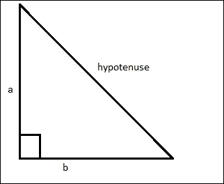

如果斜边表示为 h，勾股定理可以写成以下形式：

h² = a² + b²

如果你取两边的平方根，你将得到以下：

h = sqrt(a²+b²)

这意味着如果我们知道直角三角形的任意两边的长度，我们就可以很容易地找到第三边的长度。

当与游戏的人工智能（AI）一起工作时，我们将经常使用勾股定理来计算哪个代理更接近对象。如果边 A 比边 B 长，那么它总是更长，无论长度是否平方。现在，我们可以避免取平方根来比较距离，而只需比较平方值。

## 如何操作

这里是勾股定理的一个实际应用：

假设我们有一个位于 X（8，4）位置的枪手和他的目标位于 Y（2，1）位置。枪手只能射出最大距离为 10 个单位的子弹。因此，为了确定他是否能击中目标，必须计算他们之间的距离。这可以通过勾股定理很容易地确定。首先，计算以下图中所示的 YZ 和 XZ 边的长度：

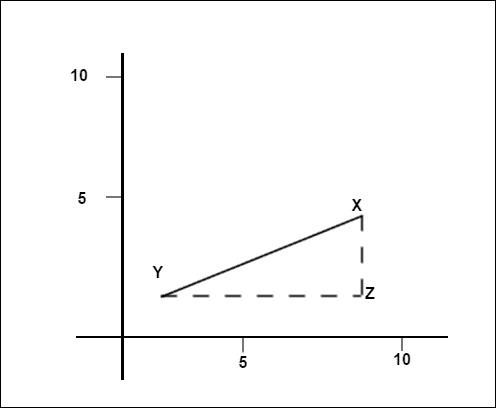

要找到 XZ 的距离，按照以下方式从枪手位置的 y 分量减去目标的 y 分量：

XZ = 4 - 1 = 3

要找到 YZ 的距离，我们做同样的操作，但使用 x 分量：

YZ = 8 - 2 = 6

现在已知 YZ 和 XZ，可以使用勾股定理计算出枪手到目标的距离，如下所示：

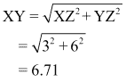

完全在目标范围内。让目标被击中！

如果你知道直角三角形的一边的长度和剩下的两个角中的一个，你可以使用三角学确定三角形的其余信息。首先，看看以下图示。它显示了直角三角形每边的名称。

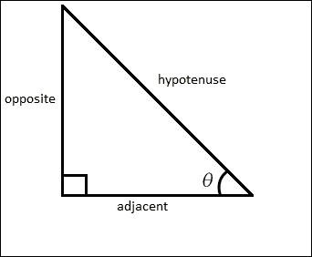

以下图示了其含义：

+   *sin(θ) = 对边/斜边*

+   *cos(θ) = 邻边/斜边*

+   *tan(θ) = 对边/邻边*

通过以下示例，我们可以看到正弦、余弦和正切函数如何被利用：

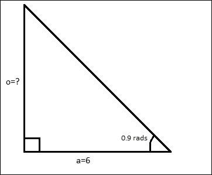

我们想要计算对边的长度，已知邻边的长度和角度。从这里我们知道，一个角度的正切等于对边除以邻边。稍微调整一下方程，我们得到以下结果：

*o = aTan(θ)*

因此，为了得到 **o**，我们只需要拿起计算器（确定正切值）并输入以下数字：

*o = 6Tan(0.9)*

*= 7.56*

# 使用向量

在设计我们游戏的 AI 时，我们将频繁使用向量数学。向量无处不在，从计算游戏代理应该向哪个方向射击到表达人工神经网络的输入和输出。你应该很好地了解它们。

让我们以点 P 为例：

P = (x, y)

当写成如下形式时，二维向量看起来几乎相同：

V = (x, y)

然而，尽管相似，向量表示两个分量：方向和幅度。以下图的右侧显示了位于原点的向量 (9, 6)：

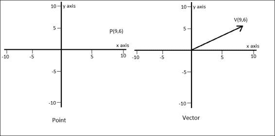

箭头的方向表示向量的方向，线的长度代表向量的幅度。一个向量可以表示车辆的速率。向量的幅度代表车辆的速率，方向代表车辆的航向。

仅从两个数字（x, y）中就能获得如此多的信息。向量也不限于二维。它们可以是任何大小。例如，你可以使用三维向量 (x, y, z) 来表示在三维空间中移动的车辆，如直升机。让我们看看你可以用向量做什么。

## 如何做

向量可以用多种方式使用，以下列出了一些：

+   向量相乘非常简单。你只需将每个分量乘以相应的值。例如，向量 V (4, 5) 乘以 2 得到 (8, 10)。

+   向量的幅度就是它的长度。在先前的例子中，向量 V (4, 5) 的幅度是从起点到点 P(4, 5) 的距离，如下图所示：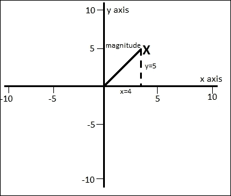

    这可以通过勾股定理轻松计算，如下所示：

    幅度 = 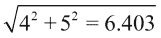

    如果你有一个三维向量，那么你会使用类似的方程：

    大小 = 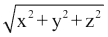

    数学家用两个垂直线围绕一个向量来表示其长度，如下所示：

    大小 = |V|

+   **归一化向量**：当一个向量被归一化时，它保留了其方向，但其大小被重新计算，使其长度为 1（长度为 1）。为此，你需要将向量的每个分量除以向量的模。数学家将公式写成以下形式：

    N = V/|V|

    因此，为了将向量（4, 5）归一化，你需要做以下操作：

    新 X = 4 /6.403 = 0.62

    新 Y = 5 /6.403 = 0.78

+   **分解向量**：可以使用三角学将一个向量分解为两个独立的向量，一个平行于*x*轴，另一个平行于*y*轴。看看表示喷气式战斗机在点 V 处的推力的向量 V，如下所示：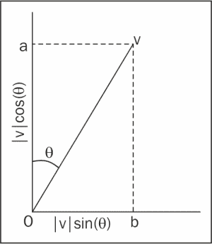

为了将 V 分解为 x/y 分量，我们需要找到**Oa**和**Ob**。这将给出飞机推力沿*y*轴的分量和沿*x*轴的分量。另一种说法是，**Oa**是沿*x*轴作用的推力量，**Ob**是沿*y*轴的分量。

首先，让我们计算沿*y*轴的推力量：**Oa**。从三角学中，我们知道：

cos(θ) = 邻边 / 斜边 = Oa / |V|

重新排列后，我们得到：

Oa = |V| Cos(θ) = y 分量

为了计算 Ob，使用以下方程：

sin(θ) = 对边 / 斜边 = Ob / |V|

给出：

Ob = |V| sin(θ) = x 分量

**点积**：点积给出了两个向量之间的角度——在编程 AI 时你将经常需要计算的角度。给定两个二维向量 u 和 v，方程看起来如下：

u.v = ux vx + uy uy //方程（1）

`.`（点）符号表示点积。方程（1）并没有给出一个角度。我承诺会给你一个角度，所以你将得到一个！这是计算点积的另一种方法：

u.v = |u| |v| cos(θ)

重新排列后，我们得到：

*cos(θ) = u.v / |u| |v|*

记住，围绕向量的垂直线表示其大小。现在是你发现归一化向量的一个有用用途的时候了。如果 v 和 u 都是归一化的，那么方程可以极大地简化为：

*cos(θ) = u.v / 1*1
 = u.v*

将方程（1）中的右侧代入方程中，我们得到：

*cos(θ) = u.v = ux vx + uy uy*

这给我们一个关于向量之间角度的方程。

## 它是如何工作的

这里有一些你刚刚学到的向量方法一起工作的例子。比如说，你有一个游戏代理，埃里克·巨魔，他站在位置 T（原点）并朝向由归一化向量 H（方向）给出的方向。他可以闻到位置 P 的无助公主，并且非常想在她被撕成碎片之前用他的棍子打她，使她变得柔软一些。为了做到这一点，他需要知道他必须旋转多少弧度才能面对她。以下图显示了这种情况：

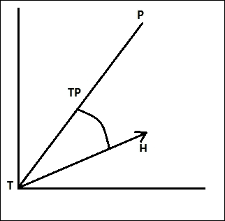

你发现你可以使用点积来计算两个向量之间的角度。然而，在这个问题中，你只有一个向量开始，**H**。因此，我们需要确定一个向量——指向公主的向量 **TP**。这是通过从点 **T** 中减去点 **P** 来计算的。因为 **T** 在原点 (0, 0)，在这个例子中，P–T= P。然而，P–T 的答案是向量，所以我们用粗体表示它，并称之为 **P**。

我们知道巨魔需要转动的角度的余弦值等于 **H** 和 **P** 的点积，前提是两个向量都进行了归一化。**H** 已经归一化，所以我们只需要归一化 **P**。记住，为了归一化一个向量，其分量被除以其大小。

因此，P 的法线（NP）是：

Np = P / |P| // 方程式 (2)

现在可以使用点积来确定角度：

cos(θ) = Np.H // 方程式 (3)

所以：

θ = cos^(-1)(Np.H) // 方程式 (4)

为了阐明这个过程，让我们再次做一遍，但这次有一些数字。比如说，巨魔位于原点 T (0, 0) 并朝向 H (1, 0)。公主站在点 P (4, 5)。巨魔需要转动多少弧度才能面对公主？我们知道我们可以使用方程式 (4) 来计算角度，但首先我们需要确定巨魔和公主之间的向量 TP 并对其进行归一化。为了获得 TP，我们从 P 中减去 T，得到向量 (4,5)。为了归一化 TP，我们将其除以其大小，得到 NTP (0.62,0.78)。最后，我们将数字代入方程式 (4)，如下所示：

*θ = cos*^(-1)*(Ntp.H)*

*θ = cos*^(-1) *((0.62 *1) + (0.78 * 0))*

*θ = cos*^(-1) *(0.62)*

*θ = 0.902 弧度*

# 物理学

物理学是研究物质和能量性质的科学分支。物理学的主题包括力学、热学、光和其他辐射、声音、电、磁和原子的结构。

## 如何做

+   **时间**: 时间是一个标量量（完全由其大小指定，没有方向）以秒为单位：

    时间 = 距离 / 速度

+   **距离**: 距离的标准单位——一个标量量——是米，缩写为 m:

    距离=速度 * 时间

+   **质量**: 质量是一个以千克为单位的标量量，缩写为 kg。质量是某种数量的度量。

+   **速度**: 速度是一个矢量量（一个具有大小和方向的量），表示距离随时间的变化率。速度的标准测量单位是米每秒，缩写为 m/s。这可以用以下数学公式表示：

    v = ∆x / ∆t

    希腊字母的大写字母 ∆，读作 delta，在数学中用来表示数量的变化。

+   **加速度**: 加速度是一个矢量量，表示速度随时间的变化率，其单位是每秒平方米，写作 m/s²。加速度可以用以下数学公式表示：

    a = ∆v / ∆t

## 它是如何工作的

上述物理属性以下列方式使用：

+   **时间**: 在游戏中，我们经常需要评估玩家以给定速度到达某个物体所需的时间。在这种情况下，我们使用勾股定理来评估物体与玩家之间的距离，然后我们将使用 *时间 = 距离/速度* 公式来评估玩家以给定速度覆盖一定距离所需的时间。

+   **距离**: 同样，为了评估玩家与物体之间的距离，我们可以使用 *距离 = 速度 * 时间* 公式来评估物体与玩家之间的距离，考虑到速度和时间是已知因素。

+   **质量**: 这是一个在处理物理引擎时经常使用的属性。当我们想要展示具有不同运动行为的两个物体时，我们可以改变它们的质量属性。考虑这样一种情况，我们想要有两个物理对象，如子弹和球。在这种情况下，子弹的质量将比球低得多，以便即使施加很小的力或冲量，子弹也能以很高的速度移动。

+   **速度**: 每当我们通过矢量对任何物理体施加力时，我们通过提供大小和方向给物理对象，从而改变该对象的速度。
