# 第九章. 自主导航代理

在本章中，我们将介绍以下食谱：

+   导航行为简介

+   实现寻找

+   实现逃离

+   实现到达

+   实现规避

+   实现徘徊

+   实现避障

+   避障

# 简介

游戏很有趣，因为它们在每个级别都具有挑战性。为了使游戏有趣，重要的是在每个级别增加游戏的难度。在游戏中击败某物总是很有趣的。在本章中，我们将学习创建游戏对象自主导航行为的各种方法。本章包含一系列食谱来展示人工智能游戏对象。为了详细了解所有概念，建议阅读上一章，它为您提供了数学和物理的把握。每个食谱都将使您了解和学习特定的自主导航行为。到本章结束时，您将能够理解和实现各种自主导航游戏行为。

# 导航行为简介

AI 角色是一种旨在用于计算机游戏以展示虚拟现实的自主导航代理。这些代理代表故事或游戏中的角色，并具有执行一些预设动作的能力。这些角色的动作由人类玩家或参与者实时指导。在游戏中，自主导航角色有时被称为非玩家或人工智能角色。AI 角色始终具有某些自主导航机器人的方面，并具有一些预定义的技能，例如他们可能会寻找游戏中的某些角色，或者他们可能会规避游戏中的角色。所有这些行为都被称为导航行为。

## 准备就绪

在本章中，我们将创建一个新的游戏来演示所有导航行为。为了开始实现，让我们创建一个新的项目。打开 Xcode，转到**文件** | **新建** | **项目**，然后选择**iOS** | **应用程序** | **SpriteKit 游戏**。在弹出的窗口中提供**产品名称**为`SteeringBehaviors`，选择**设备** | **iPhone**，然后点击**下一步**，如图所示：

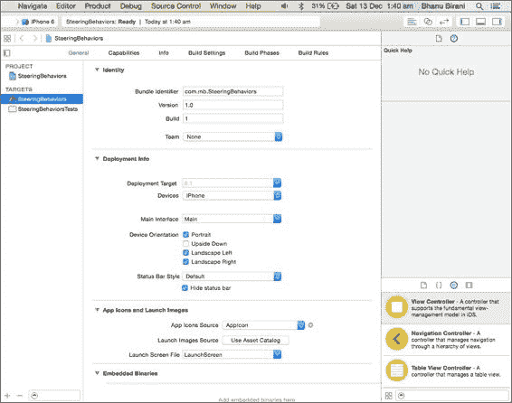

## 如何做

现在我们已经有了我们的工作样本项目，我们需要更新游戏模板项目以开始编写游戏逻辑。执行以下步骤以开始使用游戏的基本代码流程：

1.  打开`GameViewController.m`文件并更新`viewDidLoad`方法；从这个类中删除所有代码，使其看起来类似于以下代码行：

    ```swift
    - (void)viewDidLoad {
        [super viewDidLoad];

        // Configure the view.
        SKView * skView = (SKView *)self.view;
        skView.showsFPS = YES;
        skView.showsNodeCount = YES;

        // Create and configure the scene.
        SKScene * scene = [GameScene sceneWithSize:skView.bounds.size];
        scene.scaleMode = SKSceneScaleModeAspectFill;

        // Present the scene.
        [skView presentScene:scene];
    }
    ```

1.  打开`GameScene.m`文件；这个类创建一个场景，该场景将被插入到游戏中。现在，从这个类中删除所有代码，并添加以下函数：

    ```swift
    -(id)initWithSize:(CGSize)size {  
    if (self = [super initWithSize:size]) {
        self.backgroundColor = [SKColor colorWithRed:0.15 green:0.15 blue:0.3 alpha:1.0];  
    }
    }
    ```

1.  现在，编译并运行应用程序；您应该能够正确地看到背景图像。这看起来类似于以下截图：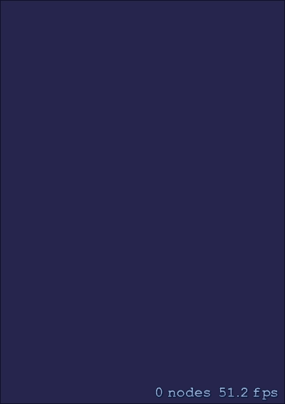

1.  现在，我们需要一个 AI 角色，我们将在这个角色上实现所有我们的 AI 行为。因此，我们将创建一个新的 `SKSpriteNode` 子类，命名为 `Player`。转到 **文件** | **新建** | **文件**，然后选择 **iOS** | **源** | **Cocoa Touch Classes**，并点击 **下一步**。现在，将 **子类为** 改为 **SKSpriteNode**，并将 **类名** 设置为 `Player`。最后的屏幕应该类似于以下截图：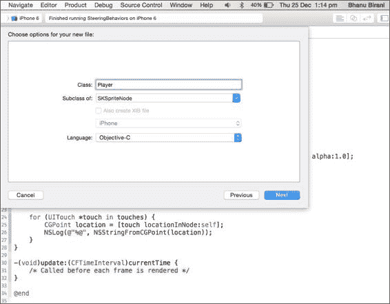

1.  现在，打开 `Player.m` 文件，并在 `@implementation` 之后添加以下代码：

    ```swift
    + (Player*) playerObject {
        // Create a new critter, and give it a name
        Player* obj = [Player spriteNodeWithColor:[SKColor whiteColor] size:CGSizeMake(30, 30)];
        obj.name = @"GamePlayer";
        return obj;
    }

    - (void) update:(float)deltaTime {

    }
    ```

1.  现在，在 `Player.h` 文件中使用以下代码添加两个方法的声明：

    ```swift
    + (Player*) playerObject;
    - (void) update:(float)deltaTime;
    ```

1.  现在，打开你的 `GameScene.m` 文件，并在 `initWithSize` 方法之后添加以下代码：

    ```swift
    - (Player *)createPlayer
    {
        Player *plyr = [Player playerObject];
        [self addChild:plyr];

        return plyr;
    }
    ```

1.  现在，在 `createPlayer` 方法之后添加 `touchesBegan` 方法。此方法将提供所有触摸事件。

1.  因此，到目前为止还没有发生任何事情。让我们让游戏在第一个状态下工作。现在，添加以下代码：

    ```swift
    Player *newPlayer = [self createPlayer];
    newPlayer.position = [touch locationInNode:self];
    ```

最终的文件应该类似于以下截图：

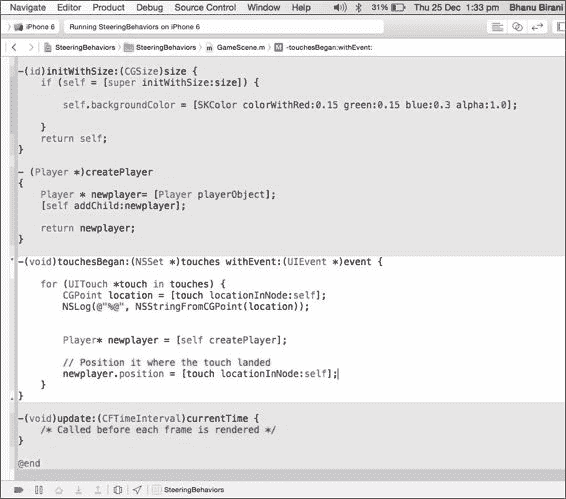

现在，编译并运行项目。触摸任何位置，你将看到在触摸位置创建了一个方块。在点击动作中向场景中添加了多个精灵。输出应该类似于以下截图：

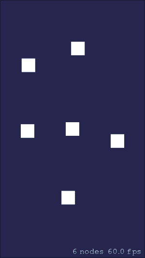

现在我们有一个单独的玩家类。这种方法将帮助我们隔离游戏角色的所有功能。同样，当我们将游戏提升到下一个级别时，这些方法非常有用，因为我们可以为各种类型的 AI 角色隔离行为。

# 实现寻找

为了实现玩家寻找行为，我们需要一个派生力，它将引导代理向目标位置移动。在寻找行为中，我们的角色会因为作用在玩家上的力更大而超过目标，这将使玩家超过目标然后返回目标。它将在一段时间后停止。

## 准备就绪

寻找行为类似于以下截图：

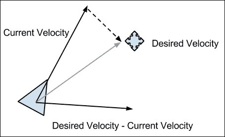

上一张图片解释了将要用于实现寻找行为的算法。在我们的情况下，我们需要寻找目标并遵循以下算法：

*Vector desiredVelocity = targetVector – player.locationVector;*

*desiredVelocity.normalize;*

*desiredVelocity *= player.maxSpeed;*

*return (desiredVelocity – agent.locationVector);*

## 如何操作

现在，我们将重新开始项目以实现寻找行为。现在，按照以下步骤实现寻找行为：

1.  打开 `Player.m` 文件，并在导入语句之后添加 `enum` 函数：

    ```swift
    typedef enum : NSUInteger {
        Seek,
        Arrive,
        Flee,
        Wander,
        Evade
    } SteeringBehaviorType;
    ```

1.  然后，在接口之后添加以下代码：

    ```swift
    @property (assign) SteeringBehaviorType behaviourType;
    @property (assign) CGPoint target;
    ```

    `enum` 包含我们要实现的行为。每次我们添加任何行为，我们都必须将其添加到这个 `enum` 中。

    目标属性将保存我们希望玩家寻找的位置，而`behaviourType`将告诉我们要实现哪种行为。

1.  现在，为了实现寻找，添加以下函数：

    ```swift
    - (void) seek:(CGPoint )target deltaTime:(float)deltaTime {

        // Work out the direction to this position
        GLKVector2 myPosition = GLKVector2Make(self.position.x, self.position.y);
        GLKVector2 targetPosition = GLKVector2Make(target.x, target.y);

        GLKVector2 offset = GLKVector2Subtract(targetPosition, myPosition);

        // Reduce this vector to be the same length as our movement speed
        offset = GLKVector2Normalize(offset);
        offset = GLKVector2MultiplyScalar(offset, 10);

      [self.physicsBody applyForce:CGVectorMake(offset.x, offset.y)];
    }
    ```

1.  现在，在更新函数中添加以下代码：

    ```swift
    if (self.behaviourType == Seek) {
      [self seek:self.target deltaTime:deltaTime];
    }
    ```

    如果玩家的行为设置为寻找，则将执行此函数。

1.  现在，我们已经准备好测试之前几步中编写的函数。因此，打开`GameScene.m`文件，并在实现文件顶部创建`newPlayer`对象的实例。实现代码应类似于以下截图：

    ```swift
    @implementation GameScene {
        float lastTime;
        Player * newplayer;
        SteeringBehaviorType behaviourType;
    }
    ```

1.  还需要在之前编写的`init`方法中添加以下代码行：

    ```swift
    self.physicsWorld.gravity = CGVectorMake(0, 0);

    newplayer = [self createPlayer];
    newplayer.position = CGPointMake(size.width/2, size.height/2);

    behaviourType = Seek;
    newplayer.behaviourType = behaviourType;

    if (behaviourType == Seek) {
        newplayer.physicsBody = [SKPhysicsBody bodyWithRectangleOfSize:CGSizeMake(30, 30)];
        newplayer.physicsBody.friction = 1.0f;
        newplayer.physicsBody.linearDamping = 1.0f;
    }
    ```

    最终的初始化函数应类似于以下截图：

    

    我们已经创建了一个`newPlayer`对象，并将其与物理体关联起来。

1.  现在，我们的玩家已经准备好寻找目标。无论我们在屏幕上点击哪里，玩家都会寻找那个位置。在`touchesBegain:withEvent`方法中，添加以下代码行：

    ```swift
    for (UITouch *touch in touches) {
        CGPoint location = [touch locationInNode:self];
        NSLog(@"%@", NSStringFromCGPoint(location));

        newplayer.target = location;
    }
    ```

1.  因此，现在我们已经准备好实现寻找行为。所以，最后，我们将在场景的每次更新时调用玩家的更新方法，以便玩家可以寻找用户点击屏幕上的位置。为此，请添加以下代码：

    ```swift
    -(void)update:(CFTimeInterval)currentTime {
       /* Called before each frame is rendered */

        if (!CGPointEqualToPoint(newplayer.target, CGPointZero)) {
            float deltaTime = currentTime - lastTime;
            [newplayer update:deltaTime];
            lastTime = currentTime;
        }
    }
    ```

    在上述代码行中，我们正在对每个`newPlayer`对象调用更新函数。

1.  现在，编译并运行项目；你将看到玩家位于屏幕中央，并且它会寻找你点击屏幕上的位置。输出应类似于以下截图：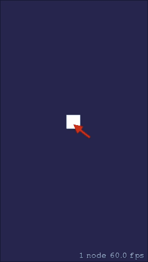

这完成了我们对玩家对象的寻找行为。

## 更多内容

你可以在苹果开发者文档中详细了解所有这些属性：[`developer.apple.com/library/IOs/documentation/SpriteKit/Reference/SKPhysicsBody_Ref/index.html`](https://developer.apple.com/library/IOs/documentation/SpriteKit/Reference/SKPhysicsBody_Ref/index.html)。

# 实现逃避

逃避行为是寻找行为的相反，它将车辆引导到目标相反的方向。我们不会产生指向目标的力，而是将玩家推离目标，因为对象必须从目标处逃离。

## 准备工作

为了实现逃避行为，我们需要逃离到目标，并遵循以下算法：

```swift
Vector desiredVelocity = player.locationVector - targetVector;
desiredVelocity.normalize;
desiredVelocity *= player.maxSpeed;
return (desiredVelocity – agent.locationVector);
```

在前面的算法中，我们正在计算将使对象从屏幕上逃离所需的力。首先，我们将计算方向向量以确定与玩家相反的方向，这样我们的对象就可以从目标处逃离。现在，在第二步中，我们将向量归一化并增加其大小到最大速度。使用此算法，我们将实现对象的逃避行为。

## 如何做

执行以下步骤以在游戏中实现逃避行为：

1.  打开`Player.m`文件，并在寻找函数之后添加以下代码行：

    ```swift
    - (void) flee:(CGPoint )target deltaTime:(float)deltaTime {

        // Work out the direction to this position
        GLKVector2 myPosition = GLKVector2Make(self.position.x, self.position.y);
        GLKVector2 targetPosition = GLKVector2Make(target.x, target.y);

        GLKVector2 offset = GLKVector2Subtract(targetPosition, myPosition);

        // Reduce this vector to be the same length as our movement speed
        offset = GLKVector2Normalize(offset);
        offset = GLKVector2MultiplyScalar(offset, -10);

        [self.physicsBody applyForce:CGVectorMake(offset.x, offset.y)];
    }
    ```

1.  现在，在更新函数中 seek 代码之后添加以下代码：

    ```swift
    if (self.behaviourType == Flee) {
        [self flee:self.target deltaTime:deltaTime];
    }
    ```

1.  现在，我们的函数已经准备好让玩家逃离。这个函数将接受一个目标，从该目标逃离。所以，我们再次使用相同的方法，当用户点击屏幕时，我们将使对象从点击点逃离。最终的`Player.m`文件应类似于以下截图：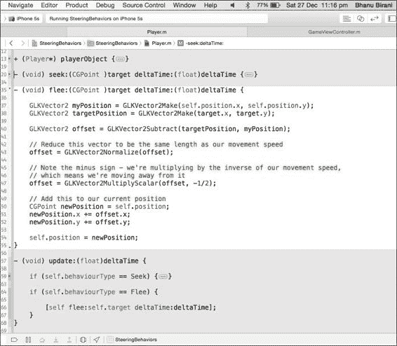

1.  现在我们已经准备好了`Player.m`类来执行逃离行为。所以，打开`GameScene.m`文件，并取以下代码行：

    ```swift
    behaviourType = Seek;
    ```

    然后，将其替换为以下代码行：

    ```swift
    behaviourType = Flee;
    ```

    此外，还需要添加以下代码：

    ```swift
    if (behaviourType == Seek)
    ```

    然后，将上述代码中的`if`条件更新为：

    ```swift
    if (behaviourType == Seek || behaviourType == Flee)
    ```

1.  `init`函数应类似于以下截图：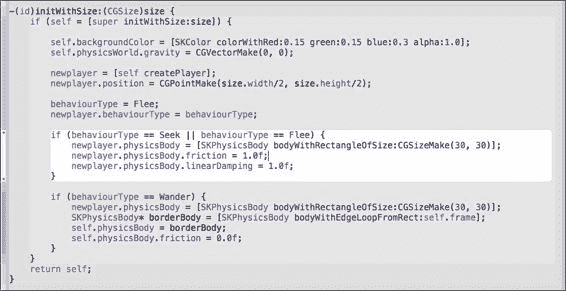

1.  那就结束了。现在编译并运行项目。你应该能看到玩家，当你点击玩家附近的任何地方时，你会看到玩家会从点击的位置逃离。

## 还有更多

你可以在苹果开发者文档中更详细地阅读所有这些属性，链接为[`developer.apple.com/library/IOs/documentation/SpriteKit/Reference/SKPhysicsBody_Ref/index.html`](https://developer.apple.com/library/IOs/documentation/SpriteKit/Reference/SKPhysicsBody_Ref/index.html)。

# 实现到达

到达（Arrive）与寻找（Seek）类似。寻找（Seek）和到达（Arrive）之间的唯一区别在于，在到达（Arrive）中，玩家会在目标位置停止。然而，在寻找（Seek）中，它会超过目标位置，然后再寻找。

## 准备工作

到达（Arrive）的技术定义是以零速度到达目标。到达行为将与寻找行为保持一致，唯一的区别是它不会超过目标。

在这种方法中，当玩家在停止半径之外时，它会以最大速度向目标移动，而一旦玩家进入停止半径，玩家的期望速度就会降至零。

## 如何操作

执行以下步骤以实现到达行为：

1.  打开`Player.m`文件，并在文件末尾添加以下代码行：

    ```swift
    - (void) arrive:(CGPoint )target deltaTime:(float)deltaTime {

        // Work out the direction to this position
        GLKVector2 myPosition = GLKVector2Make(self.position.x, self.position.y);
        GLKVector2 targetPosition = GLKVector2Make(target.x, target.y);

        GLKVector2 offset = GLKVector2Subtract(targetPosition, myPosition);

        // Reduce this vector to be the same length as our movement speed
        offset = GLKVector2Normalize(offset);
        offset = GLKVector2MultiplyScalar(offset, 5);

        // Add this to our current position
        CGPoint newPosition = self.position;
        newPosition.x += offset.x;
        newPosition.y += offset.y;

        self.position = newPosition;
    }
    ```

1.  现在，我们必须调用此函数，直到我们的玩家不在停止半径内。所以，我们将在目标点周围创建一个盒子，一旦玩家进入这个盒子，我们就停止调用到达函数。为了实现这一点，在更新方法中添加以下代码行：

    ```swift
    if (self.behaviourType == Arrive) {
        int boxWidth = 20;

        CGRect targetRect = CGRectMake(self.target.x - boxWidth, self.target.y - boxWidth, boxWidth*2, boxWidth*2);

        if (!CGRectContainsPoint(targetRect, self.position)) {
            [self arrive:self.target deltaTime:deltaTime];
        }
    }
    ```

    最终的更新函数应类似于以下截图：

    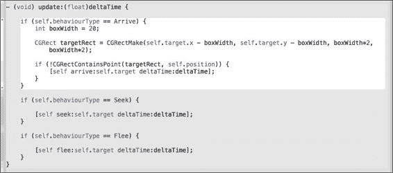

1.  现在，是时候检查我们在`Player.m`文件中编写的到达函数了。打开`GameScene.m`文件。取以下代码行：

    ```swift
    behaviourType = Flee;
    ```

    然后，将其替换为以下代码行：

    ```swift
    behaviourType = Arrive;
    ```

1.  现在，编译并运行项目；你应该能在屏幕中央看到我们的玩家。现在，点击屏幕上的任何位置为玩家提供目标。点击后，玩家将到达你点击的目标位置，并超过目标。输出应该类似于以下截图：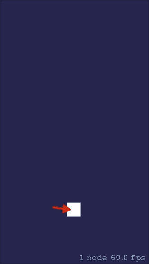

红色指针显示玩家必须到达的目标位置。

## 还有更多

你可以在苹果开发者文档中更详细地了解所有这些属性：[`developer.apple.com/library/IOs/documentation/SpriteKit/Reference/SKPhysicsBody_Ref/index.html`](https://developer.apple.com/library/IOs/documentation/SpriteKit/Reference/SKPhysicsBody_Ref/index.html)。

# 实现规避

规避类似于逃离。逃离和规避之间的唯一区别在于，在规避中，玩家将在从目标位置逃离到安全位置后停止，而在逃离中，它只是从目标位置跑出屏幕，永远不会回来。

## 准备工作

技术上，规避是从目标逃到安全位置。规避行为将与逃离行为相同，唯一的区别是它不会无限逃离目标。

在这种方法中，当目标位置在玩家的安全范围内时，玩家将逃离，直到目标位置不再在其安全范围之外。因此，在我们的情况下，我们将使玩家逃离，直到远离目标，然后将其速度降至零。

## 如何操作

执行以下步骤以实现规避行为：

1.  打开`Player.m`文件，并在文件末尾添加以下代码行：

    ```swift
    - (void) evade:(CGPoint )target deltaTime:(float)deltaTime {

        GLKVector2 myPosition = GLKVector2Make(self.position.x, self.position.y);
        GLKVector2 targetPosition = GLKVector2Make(target.x, target.y);

        GLKVector2 offset = GLKVector2Subtract(targetPosition, myPosition);

        // Reduce this vector to be the same length as our movement speed
        offset = GLKVector2Normalize(offset);

        // Note the minus sign - we're multiplying by the inverse of our movement speed,
        // which means we're moving away from it
        offset = GLKVector2MultiplyScalar(offset, -5);

        // Add this to our current position
        CGPoint newPosition = self.position;
        newPosition.x += offset.x;
        newPosition.y += offset.y;

        self.position = newPosition;
    }
    ```

1.  现在，在`update`方法中添加以下代码：

    ```swift
    if (self.behaviourType == Evade) {

        int boxWidth = 100;

        CGRect targetRect = CGRectMake(self.target.x - boxWidth, self.target.y - boxWidth, boxWidth*2, boxWidth*2);

        if (CGRectContainsPoint(targetRect, self.position)) {

            [self evade:self.target deltaTime:deltaTime];
        }
    }
    ```

1.  之后，更新函数应该看起来类似于以下截图：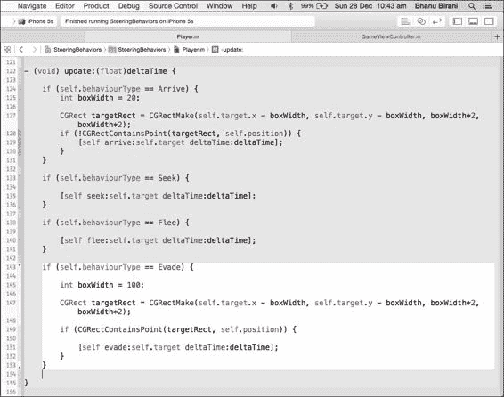

    在前面的函数中，我们在目标位置向量上绘制了一个矩形。每当玩家在这个矩形内时，就不安全。因此，它将逃离以将玩家移出矩形到安全位置。因此，我们将执行我们的规避函数，直到玩家在矩形内。

1.  现在，是时候测试我们在`Player.m`中编写的规避函数了。所以，打开`GameScene.m`文件。输入以下代码行：

    ```swift
    behaviourType = Arrive;
    ```

    然后，将此替换为以下代码行：

    ```swift
    behaviourType = Evade;
    ```

1.  最终的`init`方法应该类似于以下截图：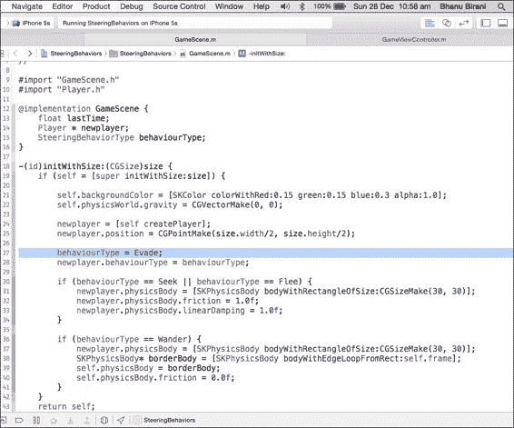

1.  现在，编译并运行项目以查看对象玩家在动作中的表现。点击玩家附近的任何位置，它将逃离以保持与你点击的位置一定的距离，如图所示：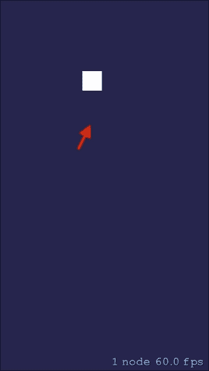

## 还有更多

你可以在苹果开发者文档中详细了解所有这些属性，网址为[`developer.apple.com/library/IOs/documentation/SpriteKit/Reference/SKPhysicsBody_Ref/index.html`](https://developer.apple.com/library/IOs/documentation/SpriteKit/Reference/SKPhysicsBody_Ref/index.html)。

# 实现游荡

你可能在游戏中经常观察到，一些角色只是随机地在他们的环境中移动。这些角色正在等待某个事件发生。例如，在任何战争游戏中，敌军士兵只是在城堡里四处游荡，试图捕捉玩家，他们会一直游荡，直到找到玩家。一旦玩家进入他们的附近，他们就会改变行为去寻找。因此，角色的游荡能力使它们看起来更加愉悦和逼真。

使游戏对象遵循路径将使其显得不真实，并会影响整体游戏玩法，使其更具预测性。因此，这些游荡行为为游戏增添了更多的乐趣和逼真性。

游荡转向行为产生逼真的移动，使玩家感觉角色只是在行走，并使整个环境感觉更加生动。

## 准备工作

实现游荡行为有多种方法。如下所示：

+   使用寻找和随机性来实现游荡。在这种方法中，游荡结合了两种行为，寻找和随机性。这意味着技术上，游荡只是在世界中的某些随机点和目标上寻找。

+   第二种方法是在角色前方评估一个虚拟点，并在其前方画一个圆，然后获取圆周上的点。现在，让对象寻找该位置。以下图像将更好地解释这种方法：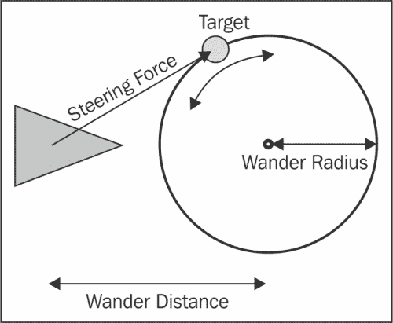

我们将实现第一种方法，因此我们将遵循以下方法：

```swift
Get targetVector
while (true) {
  Seek (targetVector);
  get anotherTargetVector;
}
```

## 如何做

现在，我们将实现游荡行为，并将我们的项目推进得更远。按照以下步骤实现游荡行为：

1.  打开`Player.m`文件，并在文件末尾添加以下代码行：

    ```swift
    int myRandom() {
        return (arc4random() % 2 ? 1 : -1);
    }

    - (void)wanderWithDeltaTime:(float)deltaTime
    {
        int boxWidth = 20;

        CGRect targetRect = CGRectMake(self.target.x - boxWidth, self.target.y - boxWidth, boxWidth*2, boxWidth*2);
        if (!CGRectContainsPoint(targetRect, self.position)) {

            [self seek:self.target deltaTime:deltaTime];

        } else {
            int offsetX = self.scene.size.width;
            int offsetY = self.scene.size.height;

            self.target = CGPointMake(arc4random() % offsetX, arc4random() % offsetY);
        }
    }
    ```

    我们已经实现了本节开头看到的算法。在这段代码中，我们在玩家前方获取一个随机局部点，然后让玩家寻找该位置。这将产生游荡行为。

1.  现在，在`update`方法中添加以下代码行：

    ```swift
    if (self.behaviourType == Wander) {
        [self wanderWithDeltaTime:deltaTime];
    }
    ```

    最终的`update`函数应类似于以下截图：

    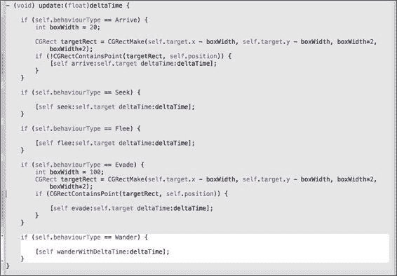

1.  现在，是时候测试我们在`Player.m`中编写的`evade`函数了。因此，打开`GameScene.m`文件，并添加以下代码行：

    ```swift
    behaviourType = Evade;
    ```

    然后，将其替换为以下代码行：

    ```swift
    behaviourType = Wander; 
    ```

    还在寻找和逃跑的 if 条件之后添加以下 if 条件：

    ```swift
    if (behaviourType == Wander) {
        newplayer.physicsBody = [SKPhysicsBody bodyWithRectangleOfSize:CGSizeMake(30, 30)];
        SKPhysicsBody* borderBody = [SKPhysicsBody bodyWithEdgeLoopFromRect:self.frame];
        self.physicsBody = borderBody;
        self.physicsBody.friction = 0.0f;
        newplayer.physicsBody.friction = 1.0f;
        newplayer.physicsBody.linearDamping = 1.0f;
    }
    ```

    最终文件应类似于以下截图：

    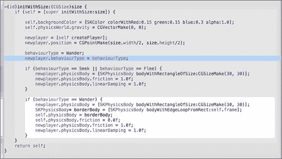

1.  现在，编译并运行项目以查看玩家对象的实际效果。点击屏幕上的任何位置，玩家将开始在屏幕上游荡，如下面的截图所示：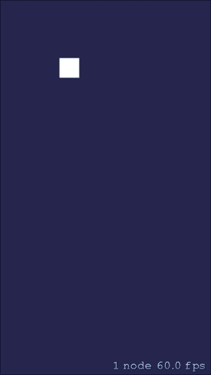

## 还有更多

你可以在苹果开发者文档中更详细地阅读所有这些属性：[`developer.apple.com/library/IOs/documentation/SpriteKit/Reference/SKPhysicsBody_Ref/index.html`](https://developer.apple.com/library/IOs/documentation/SpriteKit/Reference/SKPhysicsBody_Ref/index.html)。

# 实现墙壁避障

如果 AI 角色在游荡时撞到墙壁，它们看起来会有些奇怪。因此，我们必须使它们更加智能，以便它们可以寻找墙壁并相应地做出反应或改变方向。

游荡行为返回一个力，将 AI 从墙壁推开以避免碰撞。

## 准备中

将采用以下方法来实现墙壁避障行为：

+   创建感知墙壁的触须

+   我们将在 AI 前方使用一个触须来感知墙壁

+   当检测到墙壁时，在反射向量上施加力

## 如何实现

按照以下算法在项目中实现墙壁避障行为：

1.  该技术的视觉解释如下截图所示：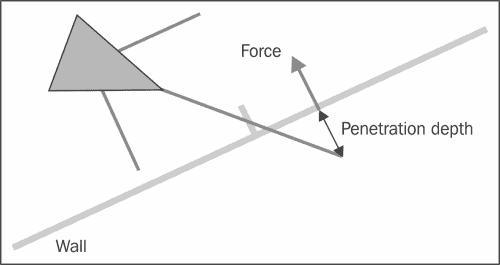

1.  创建将感知墙壁的触须：

    ```swift
    Front_Feeler = player->Get velocity; // vector
    Front_Feeler = Front_Feeler.normalize(); // vector
    ```

    这将在玩家前方投射触须。

    ```swift
    Front_Feeler =  Front_Feeler *  FeelerLength; // vector
    Front_Feeler =  Front_Feeler + player->location;
    ```

1.  现在我们已经得到了`Front_Feeler`，让我们在相同方向上施加力。这个力会将玩家推开墙壁。

1.  为了进一步微调行为，你还可以在玩家两侧额外添加两个触须。这将帮助玩家进行更平滑的转弯并看起来更真实。

# 避障

如果游戏对象表现出群体行为，那么避免彼此碰撞非常重要。此外，路径上可能有多个障碍物，角色必须智能地避开。

## 准备中

将采用以下方法来实现避障行为：

+   在玩家对象前方创建三个触须

+   让所有三个触须感知路径上的障碍物

+   如果触须感知到任何障碍物，则将玩家重新定向到相反方向

## 如何实现

按照以下算法在项目中实现避障行为。

1.  该技术的视觉解释如下截图所示：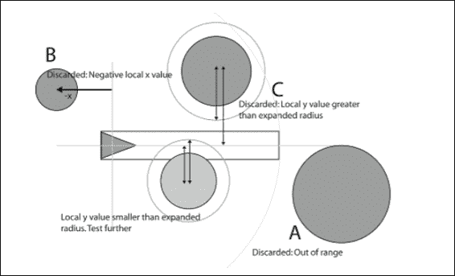

1.  创建将感知墙壁的触须：

    ```swift
    Front_Feeler = player->Get velocity; // vector
    Front_Feeler = Front_Feeler.normalize(); // vector

    Left_Feeler = player->Get velocity; // vector
    Left_Feeler = Left_Feeler.normalize(); // vector

    Right_Feeler = player->Get velocity; // vector
    Right_Feeler = Right_Feeler.normalize(); // vector

    This will project the feeler in front of the player.
    Front_Feeler =  Front_Feeler *  FeelerLength; // vector
    Front_Feeler =  Front_Feeler + player->location; 

    Left_Feeler =  Left_Feeler *  FeelerLength; // vector
    Left_Feeler =  Left_Feeler + player->location; 
    Left_Feeler->x = Left_Feeler -> x - player-> width;

    Right_Feeler =  Right_Feeler *  FeelerLength; // vector
    Right_Feeler =  Right_Feeler + player->location; 
    Right_Feeler->x = Right_Feeler -> x + player-> width;
    ```

    现在我们有了左、右和前触须。所以，当这些触须感知到它们路径上的任何物体时，它们会将玩家推开障碍物。

## 还有更多

有许多其他转向行为可以使游戏变得非常有趣。还有各种群体行为，在亲身体验这些行为之后可以进行探索。以下是一些行为：

+   **集群行为**：当物体以某种共同的行为在群体中表现时，这种行为被称为集群行为

+   **对齐**：当物体表现出某种导致特定特征与附近的代理对齐的行为时，这被称为对齐

+   **凝聚力**：在这种行为中，物体被引导向所有物体的质量中心——即，在一定半径内代理的平均位置

+   **分离**：在这种行为中，物体被引导远离所有邻居

你可以在以下链接中了解更多关于这些行为的信息：

+   [`gamedevelopment.tutsplus.com/tutorials/the-three-simple-rules-of-flocking-behaviors-alignment-cohesion-and-separation--gamedev-3444`](http://gamedevelopment.tutsplus.com/tutorials/the-three-simple-rules-of-flocking-behaviors-alignment-cohesion-and-separation--gamedev-3444)

+   [`www.red3d.com/cwr/steer/gdc99/`](http://www.red3d.com/cwr/steer/gdc99/)
