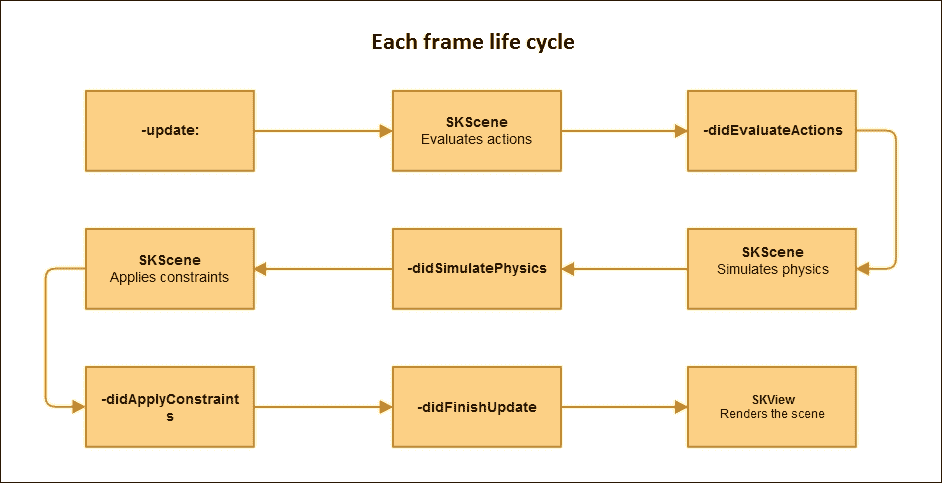
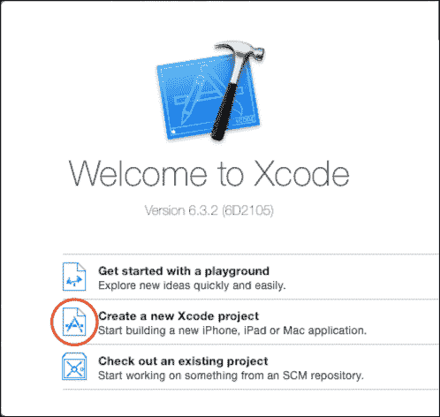
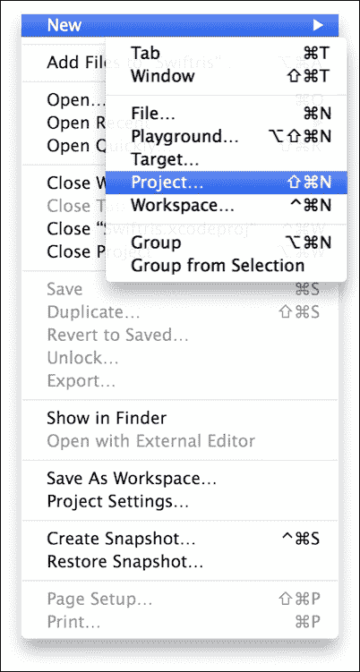
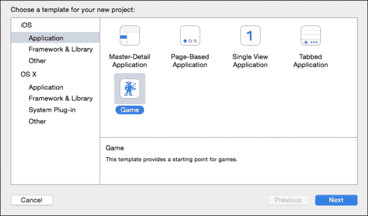
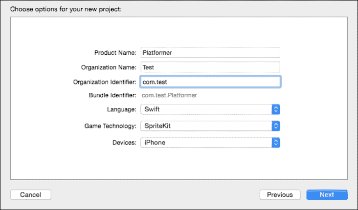
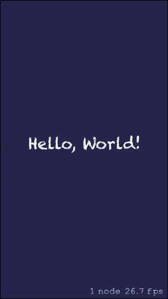

# 第一章. Sprite Kit 简介

在这本书中，我们将讨论使用 Sprite Kit 进行 iOS 游戏开发。我们将采取一种有趣的方法，并在过程中在 iPhone 上制作一个实际的 2D 平台游戏。我们将开发一个 2D（二维）游戏；一个只依赖于两个坐标的游戏。一些著名的 2D 游戏包括 *马里奥*，*爬山赛车*，*愤怒的小鸟*，*割绳子*，等等。

2D 游戏只处理沿 *x* 和 *y* 轴（左右和上下）的两个维度，但不处理沿 *z* 轴（前后）。所以基本上，玩家不能在 3D 空间中自由旋转或移动摄像头来从其他角度和视角查看对象。尽管有例外，如 2.5D 游戏；我们将在后面的章节中讨论这一点。所以，让我们不要让事情等待，直接进入这本书。

# iOS 8 的新特性是什么？

你可能熟悉苹果的移动操作系统，通常称为 iOS；这个操作系统的最新版本是 iOS 8。这个版本在其前辈 iOS 7 上有很多新增功能。这个版本的一些新增功能包括 Swift 编程语言的引入，大量的新 API，以及最重要的是，Sprite Kit 及其外围框架的改进。

在这本书中，我们将使用 Swift 编程语言而不是 Objective-C。尽管你可以使用 Sprite Kit 与 Objective-C 或 Swift 一起使用，但 Swift 提供了更简单的语法，并且学习曲线更简单。

# 了解 Swift

Swift 是苹果为在苹果设备上开发应用程序而设计的全新多范式编程语言。Swift 开发已经进行了 4 年，于 2014 年在 **全球开发者大会**（**WWDC**）上宣布。Swift 既是脚本语言也是编程语言；它具有返回多个返回值的能力。Swift 采用了许多语言中受喜爱的不同结构，包括 Objective-C、Rust、Haskell、Ruby、Python、C#、CLU 等。它具有类型安全功能，即防止你将字符串作为 `int` 传递，从而最小化代码中的可能错误。

我们将在后续章节中根据需要进一步讨论 Swift。

# 了解 Sprite Kit

Sprite Kit 是苹果的一个框架，旨在为 iOS 设备开发 2D 游戏。它是制作 iOS 设备游戏的最佳方式之一。它易于学习，功能强大，并且完全由苹果支持，这使得它比第三方游戏开发引擎更可靠。

Sprite Kit 在 iOS 7 中引入，允许轻松、快速的游戏开发；它与流行的游戏开发库 Cocos2d 有相似之处。如果你对 Cocos2d 有一定了解，Sprite Kit 对你来说将是一件轻而易举的事情。

Sprite Kit 提供了各种对游戏开发有用的功能，例如图形渲染、动画工具、声音播放、粒子系统和物理模拟。在 Sprite Kit 中，每个节点都将有一个属性名称和物理体，物理体可以由任意形状组成，如矩形、多边形、圆形、路径等。Sprite Kit 提供了一个更丰富的粒子系统，在动画过程中可以通过代码更改任何方面。在 Sprite Kit 的粒子系统中，你还可以为创建的粒子添加自定义动作。此外，Xcode 为 Sprite Kit 提供了内置支持，因此你可以在 Xcode 中直接创建复杂特效和纹理图集。这种框架和工具的组合使 Sprite Kit 成为游戏和其他需要类似动画功能的 apps 的好选择。

由于 Sprite Kit 支持丰富的渲染基础设施，并处理所有将绘图命令提交给 OpenGL 的底层工作，你可以将精力集中在解决更高级的设计问题和创建游戏功能上。

由于 Sprite Kit 是 iOS 的原生框架，它提供了内置支持以使用粒子效果、纹理效果和物理模拟。由于它是原生框架，Sprite Kit 的性能优于其他第三方框架/游戏引擎。

# Sprite Kit 的优势

Sprite Kit 的主要优势是它内置在 iOS 中。开发 2D 游戏，无需下载任何其他第三方库或依赖外部资源。其他 iOS API，如 iAd、内购等，也可以轻松使用，无需依赖额外的插件。你无需熟悉任何新的编程语言，支持 Sprite Kit 的语言也可以用于 iOS 的 app 开发。最好的是它是免费的，你可以免费获得 Sprite Kit 的所有功能。你可以在 Mac 和 iOS 上轻松运行你的游戏，你所需做的只是更改其控制方式。

# Sprite Kit 的元素

现在我们将讨论一些 Sprite Kit 的元素，这些元素对于游戏开发至关重要。在 Sprite Kit 中制作的游戏由许多场景组成，这些场景由节点构成，场景中节点的功能由动作决定。

## 场景

游戏中的关卡或环境被称为场景。我们根据需求制作场景，例如菜单、关卡等。因此，不同关卡和不同菜单有不同的场景。它就像一个画布，你在上面放置你的元素。

Sprite Kit 中的场景由一个 `SKScene` 对象表示。场景包含要渲染的精灵和其他内容。要切换场景，我们可以使用 `SKTransition` 类。

## 节点

节点是场景中所有内容的根本构建块。`SKScene` 类是 `SKNode` 类的子类，因此场景是一个根节点。`SKNode` 类本身不会在场景上绘制任何内容；我们可以将其视为其他节点类的基类。以下是一些节点子类：

+   `SKSpriteNode`：这可以用于绘制纹理精灵，播放视频内容等

+   `SK3DNode`：这可以用于将 Scene Kit 场景渲染为 2D 纹理图像

+   `SKVideoNode`：这可以用于播放视频内容

+   `SKLabelNode`：这可以用于渲染文本字符串

+   `SKShapeNode`：这可以用于根据核心图形路径渲染形状

+   `SKEmitterNode`：这可以用于创建和渲染粒子

+   `SKCropNode`：这可以用于使用蒙版裁剪子节点

+   `SKEffectNode`：这可以用于将其子节点应用核心图像滤镜

+   `SKLightNode`：这可以用于将光照和阴影应用于场景

+   `SKFieldNode`：这可以用于将物理效果应用于场景的特定部分

## 动作

一个动作告诉节点要做什么，并允许你执行不同的事情，例如：

+   在任何方向上移动节点

+   使任何节点遵循路径

+   旋转节点

+   缩放节点

+   显示或隐藏一个节点

+   更改精灵节点的内文

+   播放声音

+   从场景中删除节点

+   在一个孩子的节点上执行操作，等等

要创建一个运行动作，首先，使用特定的动作类创建动作，配置创建的动作属性，并通过传递动作对象作为参数来调用运行动作。当场景处理节点时，该节点的动作将被执行。

# Sprite Kit 的功能

Sprite Kit 提供了许多功能来简化游戏开发。这些功能可以用于增强游戏体验和性能。让我们简要讨论它们。

## 粒子编辑器

此功能是在 iOS 7 中引入的。粒子编辑器用于在游戏中添加特殊效果，例如在游戏场景中添加雾效。在这里，我们可以自定义许多事情，例如：

+   粒子的数量

+   允许的粒子数量限制

+   粒子的颜色

+   粒子的大小

+   粒子的寿命

+   场景中粒子的位置，等等

## 纹理图集生成器

纹理图集生成器将所有图像文件合并为一个或多个大图像，以提高性能。我们将在后面的章节中详细讨论这一点。建议使用较少的图像以减少绘制调用（场景上渲染的图像数量）。

## 着色器

着色器是在 iOS 8 中引入的。它们用于产生各种特殊效果；它们以高度灵活的方式在图形硬件上计算渲染效果，例如，我们在许多应用程序/游戏中看到了涟漪效果。无论用户在屏幕上触摸哪里，都会产生涟漪效果。

在 Sprite Kit 中，着色器由 `SKShaderNode` 类对象表示。

## 灯光与阴影

灯光与阴影在 iOS 8 中引入。这些效果是通过 `SKLightNode` 类对象产生的。`SKLightNode` 对象可以：

+   在场景的任何期望位置扩散灯光效果

+   在任何精灵中添加灯光

+   支持颜色和阴影

它只是一个 `SKNode` 类型，因此我们可以应用任何应用于任何 `SKNode` 的属性。

## 物理

在 Sprite Kit 中模拟物理可以通过向场景中添加物理体来实现。物理引擎的唯一目的是在模拟世界中移动对象。物理体具有对象的属性，如质量、形状、材料、当前轨迹等，并为所有这些对象计算新的位置。

在 Sprite Kit 游戏场景中的每一个对象都将拥有一个物理体。物理体对象连接到特定场景的节点树上的一个节点。每当场景计算新的动画帧时，场景将模拟作用于那些连接到节点树上的特定物理体的力和碰撞效果。我们可以使用它们的特定物理属性（如重力、质量、力、摩擦等）在这些节点上应用特定的物理属性。

## 游戏循环

以下是一个帧生命周期图：

在开始时，调用更新函数来设置游戏的逻辑。之后，场景评估动作。动作评估后，我们得到一个回调。然后，如果有的话，我们设置物理。当物理模拟完成后，我们通过 `didSimulatePhysics` 获得另一个调用。然后，我们应用约束并得到另一个回调，`didApplyConstraints`。最后一个回调方法是 `didFinishUpdate`；我们在帧完成和视图准备好渲染之前得到它。最后 `SKView` 渲染场景；帧完成，并且每秒继续 60 次。

# 设置项目

我们已经讨论了许多关于 Sprite Kit 的内容，现在是时候看看一个实际的项目并获取一些实际知识了。

## Hello World 项目

我们需要创建一个新的项目来构建 `Hello World`。Xcode 项目将您的应用程序所需的一切组织到一个方便的地方。让我们通过执行以下前两点中的任意一点，然后在列表中继续操作，来在 Xcode 中创建一个全新的游戏项目：

1.  在欢迎屏幕上点击 **创建一个新的 Xcode 项目**：

1.  相反，您也可以从文件菜单中选择 **文件** | **新建** | **项目…**：

1.  从新项目选择窗口中选择 **游戏**：

1.  下一个窗口会要求您自定义项目的选项。填写如下截图所示的字段：

    +   **产品名称**：这是游戏名称

    +   **组织名称**：如果您是个人，则您的姓名或组织的名称

    +   **组织标识符**：您组织的唯一标识符

    +   **包标识符**：这是一个默认 ID，通过组织标识符和产品名称自动生成。

    +   **语言**：您正在使用的编程语言，即 Objective-C 或 Swift

    +   **游戏技术**：正在使用的游戏框架，例如 Scene Kit、Sprite Kit、Metal 等

    +   **设备**：您希望游戏运行的设备；iPad、iPhone 或两者都行

    +   这些字段可以是您想要的任何内容

1.  按**下一步**，Xcode 将询问您要保存新项目的地方。选择一个目录，然后点击**创建**。

1.  保存后，它应该会打开 Xcode 到您全新的`Hello World`项目，具体到项目属性屏幕。在此屏幕上，取消选择**纵向**选项下的**设备方向**。此文件将自动保存，因此您不需要做任何事情：

# 结果

通过按键盘上的*⌘* + *R*或点击左上角的播放按钮来运行默认的游戏项目。如果没有模拟器，Xcode 将在启动应用之前为您下载一个。结果将如下所示：

# 摘要

我们还学习了如何创建 Sprite Kit 项目并在其中运行`Hello World`。

在下一章中，我们将深入探讨场景，以及如何将场景添加到我们的*平台游戏*中。
