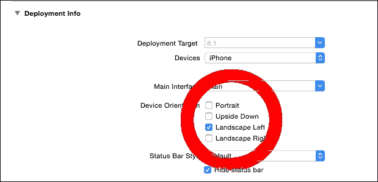
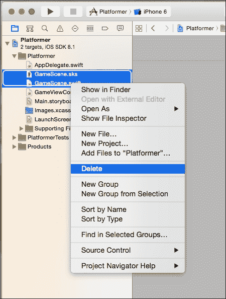
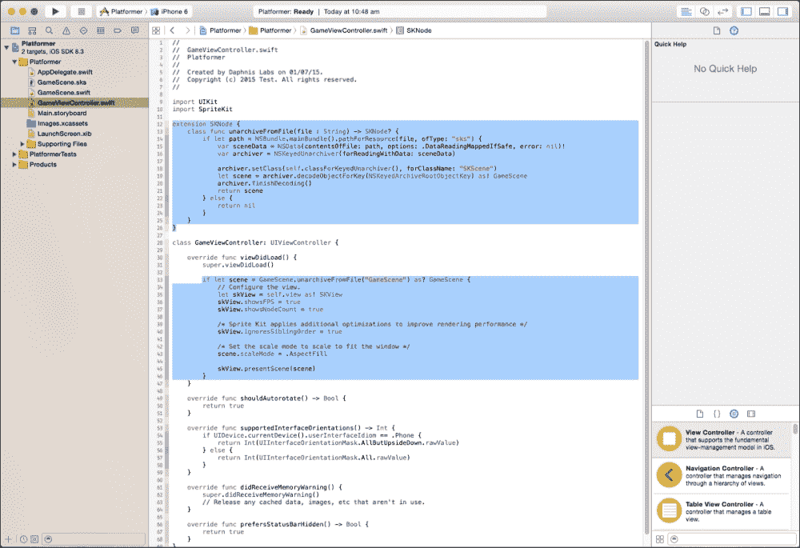
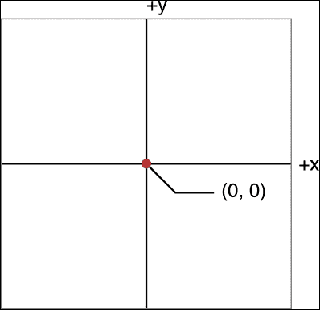
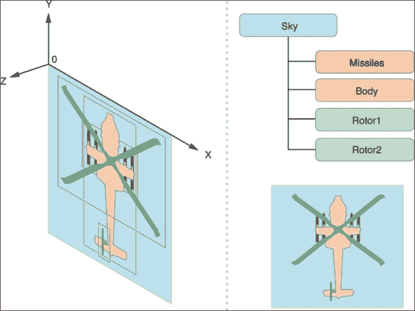
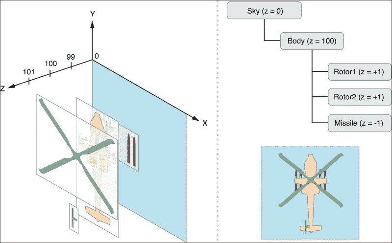
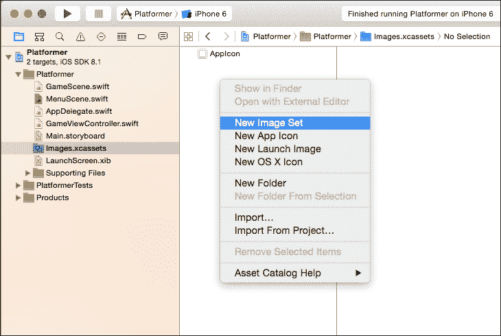
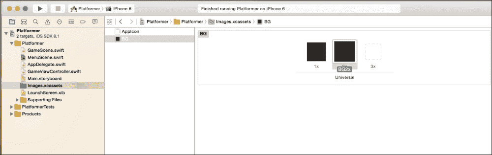

# 第二章. Sprite Kit 中的场景

在上一章中制作的 *Hello World* 游戏是 Sprite Kit 的第一步。我们还认识了 Swift 编程语言，这是我们使用 Sprite Kit 进行 iOS 游戏开发将要使用的语言。

在本章中，我们将深入探讨 Sprite Kit 项目的各种基础，并深入讨论游戏中的场景。我们还将继续开发游戏 *Platformer*，并使用它作为学习 Sprite Kit 的工具。我们将学习 Xcode 项目中的不同自动生成文件及其重要性。只有这样，我们才能理解场景是什么，以及它们在游戏开发中的重要性。进一步地，我们还将学习节点如何在 Sprite Kit 中发挥重要作用，帮助我们提高游戏优化和控制。在本章中，我们还将学习如何在游戏中添加多个场景，并成功从一个场景过渡到另一个场景，同时动画各种过渡效果。

我们将通过学习所有这些内容，并通过游戏 *Platformer* 的开发来测试我们的进度，以便在本书结束时，你能够从头开始制作自己的 2D 游戏。让我们开始吧！

# Sprite Kit 中的设备方向

有两种模式，即竖屏和横屏；在设置项目时，你可以选择你游戏的所需方向。在游戏开发过程中，你可以在 Sprite Kit 项目的属性部分随时更改方向。有四种方向可供选择：

+   竖屏

+   上下颠倒

+   横屏左

+   横屏右

你可以根据你的游戏选择任何方向。如果你想制作竖屏模式的游戏场景，你可以选择 **竖屏** 或 **上下颠倒** 选项。如果你想制作横屏模式的游戏，你可以选择 **横屏左** 或 **横屏右** 选项。如果你想制作同时支持竖屏和横屏的游戏，你也可以选择这两个选项。注意，如果你想制作同时支持竖屏和横屏模式的游戏，确保你在运行时处理游戏中精灵的位置。

# 我们项目中的方向

由于我们正在制作 *Platformer* 游戏，选择横屏模式会更好。虽然你可以选择 **横屏左** 和 **横屏右**，但选择一个方向进行编程会更简单。以下是将相同方向设置的步骤：

1.  启动我们在上一章制作的 `Platformer` 项目，可以通过双击项目目录中的 `Platformer.xcodeproj`，或者从你的 Xcode 中启动。

1.  点击 **项目导航器**，然后点击左侧面板中位于其下的 **Platformer**。

1.  取消勾选 **竖屏** 复选框，并在 **设备方向** 部分勾选 **横屏左**：

# 回顾项目元素

现在我们将讨论您 Sprite Kit 项目中的一些自动生成文件。它们可以在 Xcode 的左侧面板中找到。

## AppDelegate.swift

此文件是进入我们游戏的入口文件。当游戏从活动状态变为非活动状态（或后台状态），简单来说，当出现某些临时中断（如来电或短信消息）或用户强制退出应用程序时，其存在至关重要。此文件在项目中的本质在于，当您需要在活动和非活动状态之间执行任何特定任务时，例如，当游戏因电话而进入后台状态时保存游戏数据。

## GameScene.sks

此文件是场景内容的静态存档。此文件在编辑器中显示一个视图，用于保存游戏静态内容，如玩家的生成位置、关卡结束位置等。此文件的主要本质和重要性在于，它有助于您将游戏的动态部分和静态部分分开。现在，开发者不需要编写额外的代码来指定游戏中的琐碎元素，如生成位置等。

## GameScene.swift

此文件包含 `GameScene` 类，它是一种 `SKScene` 类型。`SKScene` 类对象用于在游戏中创建场景。当我们在前一章中开发 "Hello World" 示例游戏时，逻辑部分就在此文件中。

## GameViewController.swift

当游戏开始时，会向游戏中添加一个默认视图，该视图由游戏视图控制器控制。如果用户想要向游戏中添加场景，则它将添加到视图之上。

## Main.storyboard

这负责在屏幕上显示内容。创建了一个具有 `SKView` 视图的视图控制器的故事板，场景随后显示 Sprite Kit 游戏的内容。您可以在它们之间应用转换的同时创建额外的视图控制器和故事板。

## LaunchScreen.xib

新项目使用此启动屏幕文件创建。启动屏幕使用大小类来适应不同的屏幕尺寸和方向。

# 调整项目

我们将对已创建的项目 `Platformer` 进行一些调整。请按照以下步骤操作，以根据我们的需求定制项目：

1.  删除项目中现有的 `GameScene.swift` 和 `GameScene.sks` 文件。我们将根据需要重新创建这些文件。不用担心错误，我们将在下一步中修复它。`GameScene.swift` 是 Xcode 提供的默认场景；我们正在删除默认场景，因为我们将在游戏场景之前创建菜单场景。请看下一张截图：

1.  打开 `GameViewController.swift` 文件并删除代码，如图所示：

1.  从`Images.xcassets`中删除**Spaceship**图像。在这个项目中不需要 Spaceship 图像。

现在，你将不会在 Xcode 中看到错误，如果你运行`Platformer`，你将看不到任何东西。嗯，这不是我们想要的。现在，在我们开始编写代码之前，我们需要知道我们到目前为止已经做了什么（几乎什么都没做，只是删除了）：

+   **扩展 SKNode**：这个扩展由 Sprite Kit 插入，假设每个游戏都必须有一个初始场景，创建一个 GameScene.sks 文件。在我们的*平台游戏*开始时，我们不需要这个初始场景，因为我们将在开始时创建自己的菜单屏幕。

+   **viewDidLoad 中的 if 语句**：由于由扩展`SKNode`创建的`GameScene.sks`文件用于此语句。

现在我们将为此游戏创建自己的自定义场景，但在那之前，让我们先看看场景到底是什么。

# 什么是场景？

场景基本上是不同元素（如精灵、声音等）的逻辑集合。假设我们想要创建一个菜单，我们必须以根据我们的需求定位的方式放置一些按钮、背景和声音。

`场景`对象是节点的集合，但场景本身充当一个节点。想象一个以场景对象为根的节点树。由于场景中的所有节点都定位在定义的坐标中，它们的链接可以表示为：

*节点（内容）→ 后代节点*

节点与其后代之间的这种链接非常有用。比如说，如果你旋转树顶部的节点，所有节点都将随后旋转。

在技术术语中，`场景`是一个`SKScene`对象，它在一个视图（`SKView`对象）内部持有`SKNode`对象（例如用于精灵的`SKSpriteNode`对象），这样我们就可以渲染和使用它们。场景本身也是一个`SKNode`对象，它作为根节点并附加在`SKView`对象中。该场景所需的其他对象作为子节点添加到这个节点中。场景运行不同的动作并模拟物理（如果需要），然后渲染节点树。一个游戏由许多场景组成，我们可以通过子类化`SKScene`类来创建所需数量的场景。显示场景需要一个`SKView`对象。

# 坐标系统

在 Sprite Kit 中构建的游戏中的所有内容都与节点相关，它遵循节点树结构，其中场景是根节点，其他节点是它的子节点。当我们把节点放入节点树中时，它使用其位置属性将其放置在其父提供的坐标系中。

由于场景也是一个节点，它被放置在由`SKView`对象提供的视图中。我们在`viewDidLoad`、`GameScene`中删除的代码部分被添加为`SKView`对象的子节点。场景使用其父`SKView`对象的坐标系来渲染自身及其内容。坐标系与我们学习的基本数学中的坐标系相同。



如前图所示，如果我们从**(0,0)**向右移动，则**x**值为正，如果我们从**(0,0)**向左移动，则**x**值为负。如果我们从**(0,0)**向上移动，则**y**值为正，如果我们从**(0,0)**向下移动，则**y**值为负。坐标值以点为单位测量，当场景渲染时，它将被转换为像素。

Sprite Kit 中的所有节点都不会绘制内容。例如，`SKSpriteNode`用于在游戏中绘制精灵，但`SKNode`类不绘制任何内容，因为`SKNode`是大多数 Sprite Kit 内容的基石。

# 创建场景

当我们创建场景时，我们可以定义许多属性，如大小、原点等，以满足我们在游戏中的需求。场景大小定义了**SKView**对象中的可见区域。当然，我们可以将节点放置在这个区域之外，但它们将被渲染器完全忽略。

然而，如果我们尝试更改场景的位置属性，Sprite Kit 将会忽略它，因为场景是节点树中的根节点，其默认值是`CGPointZero`。但我们可以通过`anchorPoint`属性移动场景原点。`anchorPoint`的默认值是`(0.5,0.5)`，表示屏幕的中心点。通过重新分配新的`anchorPoint`属性，我们可以为其子节点改变坐标系。例如，如果我们设置`anchorPoint`为`(0,0)`，场景的子节点将从场景的左下角开始。

如果我们将`anchorPoint (0.5, 0.5)`或屏幕中间设置为锚点，场景的子节点将从屏幕中间开始。这完全取决于我们以及我们根据需求选择的`anchorPoint`。

# 创建节点树

场景的节点树是以父子关系创建的。作为一个场景类似于根节点，另一个节点作为其子节点。以下是一些常用的创建节点树的方法：

+   `addChild`：它将节点添加到接收者子节点列表的末尾

+   `insertChild:atIndex`：它在接收者子节点列表中的特定位置插入一个子节点

如果你想从一个节点树中移除一个节点，你可以使用以下方法：

+   `removeFromParent`：它从父节点中移除接收到的节点

# 节点树的绘制顺序

当节点树渲染时，所有子节点也会渲染。首先渲染父节点，然后按照它们添加到父节点的顺序渲染其子节点。如果你在一个场景中有很多节点需要渲染，保持它们顺序是一个困难的任务。为此，Sprite Kit 提供了一个使用*z*位置的解决方案。你可以通过使用`zPosition`属性设置节点的*z*位置。

当考虑*z*位置时，节点树将按照以下方式渲染：

+   首先，计算每个节点的全局*z*位置

+   然后，节点按照从最小的*z*值到最大的*z*值的顺序绘制

+   如果两个节点具有相同的*z*值，则先绘制祖先节点，然后按照子节点顺序绘制兄弟节点

正如你所看到的，Sprite Kit 使用基于高度的节点及其在节点树中的位置的确定性渲染顺序。但是，由于渲染顺序非常确定，Sprite Kit 可能无法应用它可能应用的某些渲染优化。例如，如果 Sprite Kit 能够收集所有共享相同纹理和绘图模式的节点，并使用单个绘图过程绘制它们，可能会更好。为了启用这些类型的优化，你必须将视图的`ignoresSiblingOrder`属性设置为`true`。

当你忽略兄弟顺序时，Sprite Kit 使用图形硬件来渲染节点，使它们按 z 轴顺序出现。它将节点排序到一个绘图顺序，以减少渲染场景所需的绘制调用次数。但是，使用这种优化的绘图顺序，你无法预测具有相同 z 轴索引的节点的渲染顺序。渲染顺序可能会在每次渲染新帧时改变。在许多情况下，这些节点的绘图顺序并不重要。例如，如果节点处于相同的高度但屏幕上不重叠，它们可以按任何顺序绘制。

因此，我们可以通过设置`ignoresSiblingOrder`属性为`false`或`true`来使用基于节点树渲染或基于深度渲染。如果我们将其设置为`true`，我们可以设置 z 位置，但如果设置为`false`，我们必须在向父节点添加子节点时注意顺序。

以下是基于节点渲染（父子渲染）的描述：



接下来是基于深度渲染（基于 z 位置的渲染）的描述：



# 在我们的游戏中添加第一个场景

现在是时候将菜单场景添加到我们的游戏中了。为此，选择`Platformer`文件夹，右键单击此文件夹，选择**New File**。选择**iOS** | **Source** | **Swift File**然后**Next**。在**Save As**中，将其命名为`MenuScene`，然后点击**Create**。

点击你的`MenuScene.swift`文件。现在该做一些代码工作了：

```swift
import SpriteKit
class MenuScene: SKScene
{
  //#1
  let PlayButton: SKSpriteNode
  let Background: SKSpriteNode
  //#2
  init(size:CGSize, playbutton:String, background:String)
  {
    PlayButton = SKSpriteNode(imageNamed: playbutton)
    Background = SKSpriteNode(imageNamed: background)
    super.init(size:size)
  }
  //#3
  required init?(coder aDecoder: NSCoder)
  {
    fatalError("init(coder:) has not been implemented")
  }
  //#4
  override func didMoveToView(view: SKView)
  {
    addChildToScene();

  }
  //#5
  func addChildToScene()
  {
    PlayButton.zPosition = 1
    Background.zPosition = 0
    Background.size = CGSize(width:self.size.width, height:self.size.height)
    addChild(PlayButton)
    addChild(Background)
  }
  //#6
  override func update(currentTime: NSTimeInterval) {

  }
}
```

在前面的代码中，我们创建了一个`MenuScene`类，其类型为`SKScene`。`SKScene`是一个用于创建场景的类。让我们看看在这个代码中使用的术语：

+   在`#1`代码块（参考前面的代码）中，我们定义了两个`SKSpriteNode`引用。一个用于播放按钮，另一个用于背景。`let`关键字表示一旦我们为这个引用分配了一个值，我们就不能改变它。如果你想改变它，你应该使用`var`关键字而不是`let`。

+   在`#2`代码块（参考前面的代码）中，我们为这个类定义了一个初始化器。初始化器用于创建特定类型的实例。在这个初始化器内部，我们初始化`PlayButton`和`Background`。我们通过设置其`size`属性为全屏大小来给背景。最后，我们通过`super.init`调用父类的`init`。

+   在 `#3` 代码块（参考前面的代码）中，我们在编译时移除错误。所需的关键字表示该类的每个子类都必须实现该初始化器。

+   在 `#4` 代码块（参考前面的代码）中，我们重写了其父类方法。`didMoveToView` 方法在视图呈现场景后立即被调用。在这里，我们调用了自定义方法 `addChildToScene`。

+   在 `#5` 代码块（参考前面的代码）中，我们定义了 `addChildToScene` 方法。在这个方法内部，我们只是给 `PlayButton` 分配了 `z` 位置，并为 `Background` 定义了 `size`。记住，我们可以使用 `z` 深度来控制哪个层将渲染在哪个之上。如果你将 `z` 深度设置为最小值，它将首先渲染，然后是最大值。这意味着 `z` 深度越低，在场景中的位置就越低。这就是为什么我们将 `Background` 的 `z` 深度设置得低于 `PlayButton`，这样 `PlayButton` 就可以渲染在 `Background` 之上。之后，我们将 `PlayButton` 和 `Background` 添加到场景中。

+   在 `#6` 代码块（参考前面的代码）中，我们只是重写了更新方法。此方法的代码将在以后更新。

哇！我们已经创建了第一个场景。现在是时候看看我们做了什么。但在那之前，我们必须将此场景添加到视图中，以便我们可以使其可见并活跃。打开你的 `GameViewController` 类，在 `super.viewDidLoad()` 下的 `viewDidLoad` 中粘贴代码：

```swift
  let menuscene = MenuScene(size: view.bounds.size, playbutton: "Play", background: "BG")
  let skview = view as SKView
  skview.showsFPS = true
  skview.showsNodeCount = true
  skview.ignoresSiblingOrder = true
  menuscene.scaleMode = .ResizeFill
  menuscene.anchorPoint = CGPoint(x: 0.5, y: 0.5)
  skview.presentScene(menuscene)
```

在此代码中，我们创建了 `menuscene` 实例并将其添加到视图中。`Play` 和 `BG` 是 PNG 精灵的名称，我们稍后会添加。我们将视图类型转换为 `SKView` 并设置了一些属性。如果我们想看到每秒帧率，我们将 `showFPS` 设置为 `true`。对于计数节点也是如此。如果我们将 `ignoresSiblingOrder` 属性设置为 `false`，那么这意味着共享相同 `z` 深度的节点将按照父到子的顺序渲染。

这意味着父节点将首先渲染，然后是其子节点。如果我们将其设置为 `true`，那么这意味着具有相同 `z` 深度的所有节点将同时渲染，而不是按照父到子的偏好顺序。为了最大化优化，我们将此值设置为 `true`；简单来说，如果你想得到更快的结果，最好将其设置为 `true`。

`.scaleMode` 用于填充视图内的场景。`ResizeFill` 表示它会调整自身大小以填充整个视图。

现在，对于 `anchorPoint`。它决定了根据父节点位置，子节点的坐标系将是什么。如果我们将其设置为 `.5, .5`，这意味着将添加到这些场景中的节点，其坐标系将从屏幕中间开始。你可以选择你感到舒适的方式。

在最后一行，我们只是将 `menuscene` 添加到视图中，以便它可以渲染。

现在，是时候向项目中添加一些图像了。首先想到的问题是，“如何在各种屏幕尺寸上保持图像的质量？”

为了优化大屏幕设备上图像的质量，我们在两个不同的大小中添加了相同的图像，1x——原始图像，和 2x——原始图像的两倍大小，以便在更大的设备上获得更好的显示质量。iOS 将自动选择适当的大小。

### 小贴士

此外，你也可以选择 3x 的图像大小，用于更大的设备。

两组图片大小足以覆盖大多数常用的屏幕尺寸。

下面是向项目中添加图片的步骤：

1.  点击 `Images.xcassets` | 选择 **New Image Set**：

1.  之后，将其命名为 `BG`，并根据大小拖放你的背景图片。如图所示：

1.  对一组游戏图片重复此过程。

1.  运行它并查看。你将看到背景全屏显示，屏幕中央有一个 **Play** 按钮。我们也可以控制 **Play** 按钮的大小，就像我们对 `Background` 做的那样。

恭喜，你创建了你的第一个场景。现在是你创建另一个场景的时候了，即 `GameScene`，以及从 `Menuscene` 到 `Gamescene` 的过渡。

# 向我们的游戏中添加另一个场景

创建 `GameScene` 文件，就像我们为 `MenuScene` 做的那样：

```swift
import SpriteKit

class GameScene: SKScene
{

  let backgroundNode = SKSpriteNode(imageNamed: "BG")

  override func didMoveToView(view: SKView) {
  addBackGround()
}

  func addBackGround()
  {
    backgroundNode.zPosition = 0
    backgroundNode.size = CGSize(width:self.size.width, height:self.size.height)
    addChild(backgroundNode)
  }

  override func update(currentTime: NSTimeInterval) {

  }

}
```

代码是自我解释的，我们只为 `GameScene` 添加了背景，这与我们对 `MenuScene` 做的相同。

# 从一个场景到另一个场景的过渡

过渡动画是通过使用一个名为 `SKTransition` 的对象来实现的；在从一个场景切换到另一个场景时，会用到这个对象来执行这个动作。正如我们所知，场景是游戏的基本构建块。在游戏中，从一个场景过渡到另一个场景在许多情况下都是必要的，例如：

+   一个加载场景，在游戏中显示其他对象正在加载时

+   一个主菜单场景，其中向用户展示了不同的选项

+   一个关卡选择菜单场景，用于选择可用的不同关卡

+   一个游戏玩法场景，其中包含游戏的主要元素

+   游戏结束场景，用于表示游戏的结束，等等

当你在已经显示场景的视图中呈现一个新的场景时，你有使用过渡来动画化从旧场景到新场景的变化的选项。使用过渡提供了连续性，因此场景变化不会突然发生，也不会打扰游戏的 UI。

当过渡发生时，场景属性会立即更新以指向新的场景。然后，动画开始。最后，对旧场景的强引用被移除。如果你需要在过渡发生后保留场景，你的游戏必须保留对旧场景的自己的强引用。

### 小贴士

**下载示例代码**

您可以从您在 [`www.packtpub.com`](http://www.packtpub.com) 的账户下载所有已购买 Packt 出版物的示例代码文件。如果您在其他地方购买了这本书，您可以访问 [`www.packtpub.com/support`](http://www.packtpub.com/support) 并注册以直接将文件通过电子邮件发送给您。

# 设置过渡期间的动画播放

通常，当两个场景之间发生过渡时，两个场景都会暂停。这意味着如果两个场景中的任何一个场景正在播放动画，它将暂停，直到过渡完成。有时，需要完成一个场景的动画效果。过渡对象上的 `pausesIncomingScene` 和 `pausesOutgoingScene` 属性定义了在过渡期间播放哪些动画。

# 创建过渡对象

通过将 `SKTransition` 作为对象使用来应用过渡；执行此操作的一些方法如下：

+   `class func crossFadeWithDuration(_ sec: NSTimeInterval) -> SKTransition`: 这将创建一个交叉淡入淡出过渡；它接受过渡的持续时间作为参数，并返回一个 `SKTransition` 对象。

+   `class func doorsCloseHorizontalWithDuration(_ sec: NSTimeInterval) -> SKTransition`: 这将创建一个过渡，新场景以一对关闭的水平门的形式出现；它也接受过渡的持续时间作为参数，并返回一个 `SKTransition` 对象。

+   `class func doorsCloseVerticalWithDuration(sec: NSTimeInterval) -> SKTransition`: 这将创建一个过渡，新场景以一对关闭的垂直门的形式出现。它也接受过渡的持续时间作为参数，并返回一个 `SKTransition` 对象。

+   `class func doorsOpenHorizontalWithDuration(_ sec: NSTimeInterval) -> SKTransition`: 这将创建一个过渡，新场景以一对开启的水平门的形式出现。它也接受过渡的持续时间作为参数，并返回一个 `SKTransition` 对象。

+   `class func doorsOpenVerticalWithDuration(_ sec: NSTimeInterval) -> SKTransition`: 这将创建一个过渡，新场景以一对开启的垂直门的形式出现。它还接受过渡的持续时间作为参数，并返回一个 `SKTransition` 对象。

+   `class func doorwayWithDuration(_ sec: NSTimeInterval) -> SKTransition`: 这将创建一个过渡，前一个场景以一对开启的门的形式消失。新场景在背景中开始，随着门的开启而逐渐靠近。它也接受过渡的持续时间作为参数，并返回一个 `SKTransition` 对象。

+   `class func fadeWithColor(_ color: UIColor, duration sec: NSTimeInterval) -> SKTransition`: 这将创建一个过渡，首先淡入到恒定颜色，然后淡入到新场景。它接受淡入颜色和过渡的持续时间作为参数，并返回 `SKTransition` 对象。

+   `class func fadeWithDuration(_ sec: NSTimeInterval) -> SKTransition`: 这创建了一个过渡效果，首先淡入黑色，然后淡入新的场景。它接受过渡的持续时间作为参数，并返回一个 `SKTransition` 对象。

+   `class func flipHorizontalWithDuration(_ sec: NSTimeInterval) -> SKTransition`: 这创建了一个过渡效果，其中两个场景在视图中通过中心线的水平方向翻转。它接受过渡的持续时间作为参数，并返回一个 `SKTransition` 对象。

+   `class func flipVerticalWithDuration(_ sec: NSTimeInterval) -> SKTransition`: 这创建了一个过渡效果，其中两个场景在视图中通过中心线的垂直方向翻转。它接受过渡的持续时间作为参数，并返回一个 `SKTransition` 对象。

+   `class func moveInWithDirection(_ direction: SKTransitionDirection, duration sec: NSTimeInterval) -> SKTransition`: 这创建了一个过渡效果，其中新场景在旧场景之上移动。它接受移动的方向和持续时间作为参数，并返回一个 SKTransition 对象。

+   `class func pushWithDirection(_ direction: SKTransitionDirection, duration sec: NSTimeInterval) -> SKTransition`: 这创建了一个过渡效果，其中新场景进入，将旧场景推出视图。它接受推动的方向和过渡的持续时间作为参数，并返回一个 SKTransition 对象。

+   `class func revealWithDirection(_ direction: SKTransitionDirection, duration sec: NSTimeInterval) -> SKTransition`: 这创建了一个过渡效果，其中旧场景从视图中移出，从而揭示其下方的新的场景。它接受揭示的方向和过渡的持续时间作为参数，并返回一个 `SKTransition` 对象。

# 在我们的游戏中添加过渡效果

现在，打开 `MenuScene`。首先，在 `MenuScene` 类中初始化代码块之前定义 `GameScene` 引用：

```swift
var gameScene : GameScene?
Add the following code below update function
override func touchesBegan(touches: NSSet, withEvent event: UIEvent)
{
  for touch: AnyObject in touches
  {
    let location = touch.locationInNode(self)
    let node = self.nodeAtPoint(location)
    if node.name == PlayButton.name
    {
      goToGameScene()
    }
  }
}

  func goToGameScene(){
  let transitionEffect = SKTransition.flipHorizontalWithDuration(1.0)
  gameScene = GameScene(size: self.size)
  gameScene!.anchorPoint = CGPoint(x: 0.5, y: 0.5)
  self.view?.presentScene(gameScene , transition:transitionEffect)

}
```

在 `didMoveToView` 中，将以下行放置在 `addChildToScene` 之下：

```swift
PlayButton.name = "PLAY"
```

如果你现在运行它，你会看到我们的菜单场景，其中有一个播放按钮和背景；如果你点击播放按钮之外的地方，什么也不会发生。当你点击播放按钮时，你会看到一个平滑的过渡到游戏场景。

在前面的代码中，`var` 是一个关键字，表示它的值可以改变。但是 `GameScene` 后面的 `?` 符号是什么意思？

`?` 符号表示引用是可选的。这意味着它可以有值，也可以是 nil。

那就是为什么我们不需要在初始化代码块中初始化它的原因。

在 `PlayButton.name = "PLAY"` 中，我们只是给 `SKSpriteNode` 对象赋予一个名称，这样当我们触摸这个精灵时，我们可以通过名称来验证它。

`touchesBegan` 是一个重写方法，用于识别触摸事件刚开始时的情况。在这个方法中，我们获取触摸位置的节点并检查是否包含所需的节点。如果存在 `SKSpriteNode` 节点，它将通过其名称被识别，并调用 `goToGameScene` 方法。

在 `goToGameScene` 方法中，我们只是添加了带有一些过渡效果的 `GameScene` 到视图中。过渡是 `SKTransition` 类的实例。在这里，我们使用了 `flipHorizontalWithDuration` 过渡效果。

你还可以调整并尝试其他可用的过渡效果。

在 `gameScene!.anchorPoint = CGPoint(x: 0.5, y: 0.5)` 中，我们在 `GameScene` 后面放置了一个感叹号。正如我们所知，`GameScene` 是可选的，我们必须告诉编译器我们知道它有值，并且我们正在强制展开其值。`!` 符号用于强制展开可选值。

# 摘要

在本章中，我们学习了设备方向以及 Sprite Kit 项目中自动生成的不同文件。我们还研究了场景，并看到了如何在 Sprite Kit 项目中创建它们。此外，我们还讨论了场景之间的过渡及其类型。

在下一章中，我们将学习关于精灵和纹理图集的内容。随着我们的深入，我们的 *Platformer* 游戏将变得更加有趣和吸引人。
