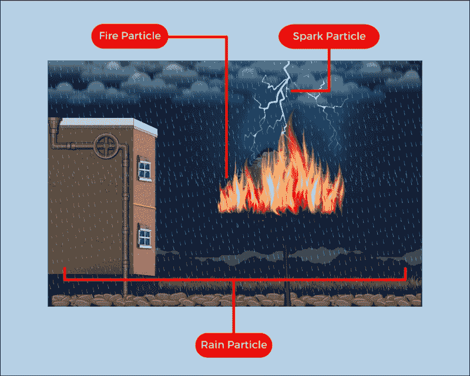
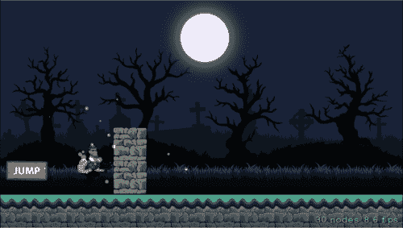
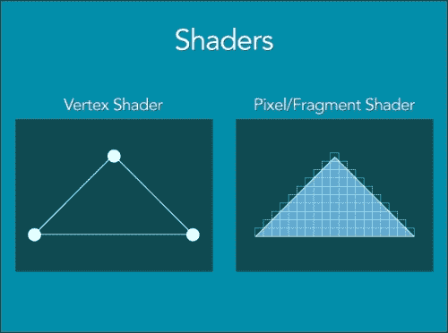
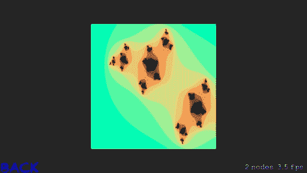
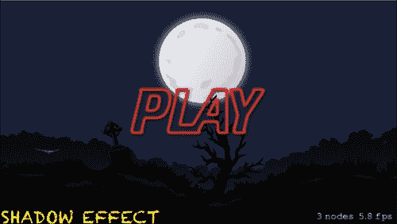

# 第七章。粒子效果和着色器

在上一章中，我们详细讨论了如何动画节点、控制、`SceneKit` 方法等。我们还讨论了处理场景动画。我们学习了 `SKAction` 类的属性和方法，同时了解了各种控制方式，例如手势识别或加速度计，通过这些方式可以玩游戏。

我们在我们的*平台游戏*中添加了玩家动画、控制和动作，这使得游戏玩起来非常有趣，学习起来也很有趣。

在本章中，我们将研究在 Sprit Kit 游戏中的粒子效果和着色器。粒子效果是 Sprite Kit 提供的非常令人兴奋的能力。我们可以使用 `SKEmitterNode` 对象生成粒子；这些粒子可以创建如雨、火、景深、火花等美丽的视觉效果。着色器是在 iOS 8 中引入到 Sprite Kit 中的。着色器用于为场景提供定制的特殊效果。`SKShader` 类用于在我们的 Sprite Kit 游戏中包含着色器。

# 粒子效果

游戏中的粒子效果是一种技术，使用小精灵或其他图形对象来模拟扩散效果，例如，通过粒子系统渲染以下效果是非常常见的：

+   火

+   爆炸

+   烟雾

+   流动的水

+   落叶

+   云朵

+   雾

+   雪

+   灰尘

+   流星

+   星星

+   星系

+   轨迹

粒子效果中的整个行为都是由发射器节点定义的。Sprite Kit 中的粒子类似于 `SKSpriteNode` 对象，其中它渲染一个纹理或非纹理图像，该图像可以在场景中调整大小、着色或混合。



不同效果的示例

# SKEmitter 节点

`SKEmitterNode` 对象是一个节点，它可以自动创建和渲染小精灵。我们可以从我们的 Xcode 中配置发射器节点的属性。我们使用粒子发射器编辑器来完成这个目的。

我们可以使用目标节点来改变粒子的目的地。以下是一个示例代码片段，演示我们如何实现相同的功能。

```swift
// CREATING THE EMITTER NODE
var emitter:SKEmitterNode = (fileNamed: "PlayerCollide.sks")
// SETTING THE EMITTER POSITION AND NAME
emitter.position = CGPointMake(0,-40)
emitter.name = "playerCollide"
// SEND THE PARTICLES TO THE SCENE
emitter.targetNode = self.scene
// ADDING EMITTER NODE
self.addChild(emitter)
```

让我们讨论在实现 Sprite Kit 的发射器节点时使用的属性和方法。

# 创建粒子效果

Sprite Kit 提供了属性和变量来根据游戏需求自定义粒子效果。让我们讨论这些属性和变量：

+   `var particleBirthRate`: 在这个属性中，你定义了发射器每秒创建的粒子数量。默认值是 `0.0`。

+   `func advanceSimulationTime(sec:NSTimeInterval)`: 这个方法帮助你推进发射器粒子的模拟。它以秒为单位接受参数，这是模拟所需的时间。最好在将发射器节点添加到场景后，使用此方法让发射器节点忙于粒子。

+   `var numParticlesToEmit`: 在这个属性中，你定义了发射器必须发射的粒子数量。默认值是`0`，这意味着发射器创建无限数量的粒子。

+   `func resetSimulation ()`: 这个方法会移除所有粒子并重新启动模拟。重置模拟会清除其内部状态。

+   `var targetNode`: 如前所述，我们可以使用 `targetNode` 来改变粒子的目标位置。如果该属性为 `nil`，则粒子被视为发射节点下的子节点。当此属性指向目标节点时，新粒子被视为目标节点的子节点，但先前生成的粒子将基于发射节点的属性进行计算。其默认值是 `nil`。

## 用于确定粒子寿命的属性

这是用户创建的粒子保持存活和功能的时间。当寿命耗尽并降至零以下时，粒子将被销毁。

+   `var particleLifetime`: 这个属性决定了粒子在秒内的平均寿命。其默认值是 `0.0`。

+   `var particleLifetimeRange`: 我们在这个属性中指定一个范围，粒子的寿命将在该范围内随机确定。

现在是时候在我们的 *Platformer* 游戏中添加粒子效果了。

## 在我们的平台游戏 `Platformer` 中添加粒子效果

让我们在 *Platformer* 游戏中集成粒子效果，在玩家碰撞时进行。我们将在方块和玩家碰撞时进行粒子模拟。

作为实现的一个初始步骤，让我们创建一个粒子效果。转到 **项目导航器** 并添加新的 **文件** | **SpriteKit 粒子文件** | **Spark** | **创建**。


您可以从一系列粒子模板中选择，例如 **Snow**（雪），**Bokeh**（散景），**Fire**（火焰），**Rain**（雨），**Spark**（火花）等等。这里我们使用的是 **Spark** 效果模板：


打开我们刚刚创建的 `ParticleEffectPlayerCollide.sks` 文件。粒子效果文件以 `.sks` 扩展名保存。您可以使用粒子发射器编辑器更改所选粒子效果的不同属性，您可以在右侧访问该编辑器。


Sprite Kit 中的粒子发射器编辑器

让我们讨论一些在 **SpriteKit 粒子发射器** 面板上显示的属性：

+   **粒子纹理（Particle Texture）**: 您可以选择用于创建粒子的图像。对于粒子纹理，也可以使用与项目相关的图像。要分配图像，必须记住，复杂且较大的图像将需要过度使用资源。建议使用简单且小的图像。

+   **出生率（Birthrate）**: 这个属性用于设置发射器生成粒子的速率。如果出生率高于粒子效果，看起来会更加密集。因此，始终建议遵循较低的出生率以获得最佳帧率。

+   **生命周期**：此属性将定义粒子在屏幕上的总生命周期。这里的**范围**指的是从第一个值**+**或**-**范围内的随机值。

+   **位置范围**：此属性将告诉您效果应距离原发射节点多远，使用**X**和**Y**坐标值。此属性的变化会影响发射器的大小。

+   **角度**：此属性将告诉粒子效果应发生的角度。这也会使用**起始**和**范围**值。

+   **速度**：此属性将定义效果应发生的初始速度。这也会使用**起始**和**范围**值。

+   **加速度**：此属性将负责粒子从源发射器使用**X**和**Y**坐标出现的加速度。

+   **透明度**：此属性将负责效果的不透明度。这也会使用**起始**和**范围**值以及**速度**。

+   **缩放**：此属性将定义用于效果的纹理/图像的**缩放**位置。这也会使用**起始**、**范围**和**速度**值。

+   **旋转**：此属性用于定义粒子效果的**旋转**速度。这也会使用**起始**、**范围**和**速度**值。

+   **颜色混合**因子：此属性用于定义粒子效果生命周期中使用的颜色。粒子在其生命周期中可能遵循不同的颜色。这将使用**因子**、**范围**和**速度**值来定义属性。

### 添加代码以方便粒子效果

在设置完所需的属性后，在`GameScene.swift`文件中创建一个粒子节点对象（`SKEmitterNode`对象）：

```swift
var particlePlayerNode = SKEmitterNode(fileNamed: "ParticleEffectPlayerCollide.sks")
```

现在，在`didMoveToView()`方法中设置位置，并隐藏创建的粒子节点。最后，将粒子节点添加到玩家中。现在`didMoveToView()`方法应如下代码所示：

```swift
override func didMoveToView(view: SKView)
    {
        self.physicsWorld.contactDelegate = self
         // JUMP BUTTON POSITION SETTING AND ADDING ONTO THE SCREEN
        self.btnJump.position = CGPointMake
(-(self.size.width/2.2), -(self.size.height/4))
        self.addChild(btnJump)

  //PROPERTIES FOR PARTICLE NODE      CHAPTER 7
        self.particlePlayerNode.zPosition = 1
        self.particlePlayerNode.hidden = true

        addBackGround()
        addRunningBar()
        addPlayer()

        //ADDING PARTICLE NODE ON SCREEN (AS CHILD TO PLAYER)
        self.player.addChild(self.particlePlayerNode)

        addBlocks()
        //addSpriteWithoutTexture()
    }
```

现在，让我们定义这个粒子效果应在何时发生，在`didBeginContact()`方法中取消隐藏我们创建的`particlePlayerNode`，因为这个方法将在发生碰撞时被调用。

`didBeginContact`方法应如下所示：

```swift
    func didBeginContact(contact: SKPhysicsContact)
    {
        // SHOWING PARTICLE EFFECT WHEN COLLISION HAPPENS
        self.particlePlayerNode.hidden = false

        var inOutActionWhenPlayerDied = SKAction.scaleBy(0.5, duration: 0.5)
        var upActionWhenPlayerDied = SKAction.moveToY(self.player.size.height * 4, duration: 2)
        var removeFromParent = SKAction.self.removeFromParent()

self.player.runAction(SKAction.sequence
([inOutActionWhenPlayerDied,
inOutActionWhenPlayerDied.reversedAction(),
upActionWhenPlayerDied,removeFromParent]),
gotoMenuScreen)

    }
```

这就是碰撞与粒子效果的外观：



现在，我们已经成功地将粒子效果添加到我们的*平台游戏*中，是时候讨论着色器和如何在我们的游戏中添加它们了。

# 着色器

Sprite Kit 中的着色器使`SKScenenode`能够以特殊、定制的绘制行为出现。这可以通过创建`SKShader`对象并分配自定义 OpenGL ES 片段着色器来实现。

如果自定义着色器（`SKShader` 对象）需要提供一个统一着色器，那么您需要创建一个或多个 `SKUniform` 对象，并将它们与您的着色器对象关联起来。着色器程序主要分为：

+   顶点着色器

+   片段着色器

让我们详细讨论这两个方面：

+   **顶点着色器**：这些着色器作用于每个顶点，大部分计算都在顶点部分完成。它们由 Sprite Kit 自动设置。由于这些着色器的计算主要在顶点部分完成，因此在形成过程中不会消耗太多 CPU 资源。

+   **片段着色器**：这些着色器是用 OpenGL 着色语言编写的。正如其名所示，它们作用于每个像素。它们使用非常重的计算，因此在需要太多着色器时会被避免。

    顶点和片段着色器的图形表示

## 使用自定义着色器的注意事项

如果您之前没有做过 GLSL 代码，编写自己的着色器是一项复杂的工作，但将着色器脚本添加到现有的 Sprite Kit 中是有意义的。

您可以从各种网站轻松获取着色器文件，并开始工作。例如，从 [`www.shadertoy.com/`](https://www.shadertoy.com/) 或 [www.glslsandbox.com](http://www.glslsandbox.com) 等网站，您将获得一个具有 `.fsh` 扩展名的简单文本文件。然后您只需将着色器代码添加到您需要的地方即可。

现在，让我们讨论一下在我们的游戏中初始化和创建新着色器对象。

## 新着色器对象的创建和初始化

方法如下所述：

+   `Init! (name: string)`：此方法通过利用 `app` 包中具有 `.fsh` 文件扩展名的片段着色器文件来初始化一个新的着色器对象。您传递文件名作为参数，并返回一个新初始化的着色器对象。

+   `Init (source: String!, uniforms: [AnyObject]!)`：此方法还使用指定的源初始化一个新的着色器对象。但除此之外，我们还可以设置一个要添加到着色器对象的 `uniforms` 列表。Uniforms 是访问片段着色器中数据的方式。Uniforms 对每个像素具有相同的值，例如，结果的图像大小。我们通过这个初始化器获得一个初始化的着色器对象。

+   `Init (source: string!)`：此方法使用包含着色器对象初始 `source` 的 `string` 初始化一个新的着色器对象。

让我们讨论一下可以用于着色器对象中统一数据的属性和方法。

## 着色器中的统一数据

方法如下所述：

+   `addUniform(uniform: SKUniform)`：此方法将一个 `uniform` 对象添加到着色器对象中。它接受要添加的 `uniform` 对象作为其参数。

+   `removeUniformNamed(name: String)`：此方法从着色器对象中删除一个 `uniform` 对象。

+   `uniformNamed(name: String)`: 此方法返回类似于特定`uniform`变量的`uniform`对象。如果未找到`uniform`对象，则返回`nil`。

+   `var uniforms: [AnyObject]`: 此属性包含与着色器相关联的所有`uniforms`列表。

为了保存自定义 OpenGL SL 着色器的统一数据，我们使用`SKUniform`对象。统一数据对所有包含`uniform`的着色器都是可用的。

## 在平台游戏中实现着色器

让我们在*平台游戏*中实现着色器，并更深入地了解着色器的集成。

1.  让我们在游戏中创建一个新的`SKScene`并在此处加载着色器。我们可以在菜单场景中放置一个按钮，它可以将我们带到这个场景。

1.  现在将一个名为`ShaderDemo.swift`的新`swift`文件添加到我们的项目中。

1.  创建一个名为`box`的`SKSpriteKit`节点，并导入一个 300 x 300 px 大小的图像`box.png`。盒子可以是任何颜色，但应该只有一个颜色，没有任何设计。我们使用这个盒子图像在盒子的边界内添加着色器效果。同时，在`ShaderDemo.swift`的`didMoveToView()`方法中设置盒子图像的位置：

    ```swift
    let box = SKSpriteNode(imageNamed: "box")
     let location = CGPoint(x: CGRectGetMidX(self.frame), y: CGRectGetMidY(self.frame))
      box.position = location
       self.addChild(box)
    ```

1.  接下来，我们必须创建实际的着色器程序，创建一个名为`blurShader.fsh`的新空文件。我们可以从任何在线资源获取此着色器的代码。以下代码是从[www.shadertoy.com](http://www.shadertoy.com)获取的。感谢 Shadertoy 团队及其贡献者为我们提供了如此简洁的资源。《blurShade.fsh》文件应如下所示：

    ```swift
    void main() {
    #define iterations 256

        vec2 position = v_tex_coord; // gets the location of the current pixel in the intervals [0..1] [0..1]
        vec3 color = vec3(0.0,0.0,0.0); // initialize color to black

        vec2 z = position; // z.x is the real component z.y is the imaginary component

        // Rescale the position to the intervals [-2,1] [-1,1]
        z *= vec2(3.0,2.0);
        z -= vec2(2.0,1.0);

        //vec2 c = z;
        vec2 c = vec2(-0.7 + cos(u_time) / 3.0,0.4 + sin(u_time) / 3.0);

        float it = 0.0; // Keep track of what iteration we reached
        for (int i = 0;i < iterations; ++i) {

            z = vec2(z.x * z.x - z.y * z.y, 2.0 * z.x * z.y);
            z += c;

            if (dot(z,z) > 4.0) { // dot(z,z) == length(z) ^ 2 only faster to compute
                break;
            }

            it += 1.0;
        }
        if (it < float(iterations)) {
            color.x = sin(it / 3.0);
            color.y = cos(it / 6.0);
            color.z = cos(it / 12.0 + 3.14 / 4.0);
        }

        gl_FragColor = vec4(color,1.0);
    }
    ```

1.  现在，我们只需要使用模式创建`SKShader`对象。将`blurshade.fsh`作为文件名，并在`didMoveToView()`方法中将它添加到精灵节点中：

    ```swift
    let pattern = SKShader(fileNamed: "blurShade.fsh")
    box.shader = pattern
    ```

1.  由于`ShaderDemo.fsh`已经准备好运行，让我们也在着色器场景中添加一个`BACK`按钮，以便用户可以返回到上一个屏幕。`ShaderDemo.swift`应如下所示：

    ```swift
    class ShaderDemo : SKScene
    {
        var menuSceneInstance : MenuScene?
        override func didMoveToView(view: SKView)
        {
            let box = SKSpriteNode(imageNamed: "box")
            let pattern = SKShader(fileNamed: "blurShade.fsh")
            let location = CGPoint(x: CGRectGetMidX(self.frame), y: CGRectGetMidY(self.frame))
            box.position = location
            box.shader = pattern
            self.addChild(box)
            addBackLabel()
        }
        override func touchesBegan(touches: NSSet, withEvent event: UIEvent)
        {
            for touch: AnyObject in touches {
                let location = touch.locationInNode(self)
                let node = self.nodeAtPoint(location)
                gotoMenuScreen()
            }
        }
        func gotoMenuScreen()
        {
            let transitionEffect = SKTransition.flipVerticalWithDuration(2)
            menuSceneInstance = MenuScene(size: self.size , playbutton: "Play", background: "BG")
            menuSceneInstance!.anchorPoint = CGPoint(x: 0.5, y: 0.5)
            self.view?.presentScene(menuSceneInstance , transition:transitionEffect)
        }
        func addBackLabel()
        {
            var backbutton = SKLabelNode(fontNamed: FontFile)
            backbutton.fontColor = UIColor.blueColor()
            backbutton.name = "BACK"
            backbutton.text = "BACK"
            backbutton.position = CGPointMake(CGRectGetMinX(self.frame) + backbutton.frame.width/2 , CGRectGetMinY(self.frame))
            backbutton.zPosition = 3
            self.addChild(backbutton)
        }
        }
    ```

    以下图像显示了代码着色器效果的外观：

    

1.  让我们也在`MenuScene.swift`中设置一个按钮，以便用户可以转到`ShaderDemo`场景。以下是为添加此按钮的代码：

    ```swift
    var shaderSceneInstance : ShaderDemo?
    func addShaderSceneBtn()
        {
            var backbutton = SKLabelNode(fontNamed: FontFile)
            backbutton.fontColor = UIColor.blueColor()
            backbutton.name = "SHADOWS"
            backbutton.text = "SHADOW EFFECT"
            backbutton.position = CGPointMake(CGRectGetMinX(self.frame) + backbutton.frame.width/2 , CGRectGetMinY(self.frame))
            backbutton.zPosition = 3
            self.addChild(backbutton)
        }
    ```

现在，代码已经准备好了。为了展示，让我们也为按钮添加一个过渡效果，以便在点击时呈现着色器场景：

```swift
func goToShaderScene(){
        let transitionEffect = SKTransition.flipHorizontalWithDuration(1.0)
        shaderSceneInstance = ShaderDemo(size: self.size)
        shaderSceneInstance!.anchorPoint = CGPoint(x: 0.5, y: 0.5)
        self.view?.presentScene(shaderSceneInstance , transition:transitionEffect)

    }
```

通过检查节点名称是否等于`"SHADOWS"`来从`touchesBegan()`方法中调用此方法，因为我们想在菜单屏幕上同时有**播放**按钮和**阴影效果**按钮：

```swift
override func touchesBegan(touches: NSSet, withEvent event: UIEvent) {
        for touch: AnyObject in touches {
            let location = touch.locationInNode(self)
            let node = self.nodeAtPoint(location)
            if node.name == PlayButton.name {
                goToGameScene()
                //goToShaderScene()

            }
            else if node.name == "SHADOWS"
            {
              goToShaderScene()
            }
        }
    }
    func goToShaderScene(){
        let transitionEffect = SKTransition.flipHorizontalWithDuration(1.0)
        shaderSceneInstance = ShaderDemo(size: self.size)
        shaderSceneInstance!.anchorPoint = CGPoint(x: 0.5, y: 0.5)
        self.view?.presentScene(shaderSceneInstance , transition:transitionEffect)

    }
```

现在文件已经准备好运行了。以下截图显示了主菜单屏幕的外观：



# 摘要

在本章中，我们详细学习了粒子效果和着色器。我们讨论了`SKEmitterNode`对象和`SKShader`对象，以及如何在我们的*平台游戏*中实现它们。我们还讨论了在 Sprite Kit 项目中添加 OpenGL ES 代码，以及我们如何在游戏中利用着色器。现在，当玩家与方块碰撞时，我们的*平台游戏*会有粒子效果，着色器场景是一个独立的屏幕，用于显示着色器效果。

在下一章中，我们将为游戏添加关卡，这将进一步提高用户的游戏体验，并帮助他们更详细地理解游戏概念。我们还将添加一个暂停按钮，以便在需要时暂停游戏。
