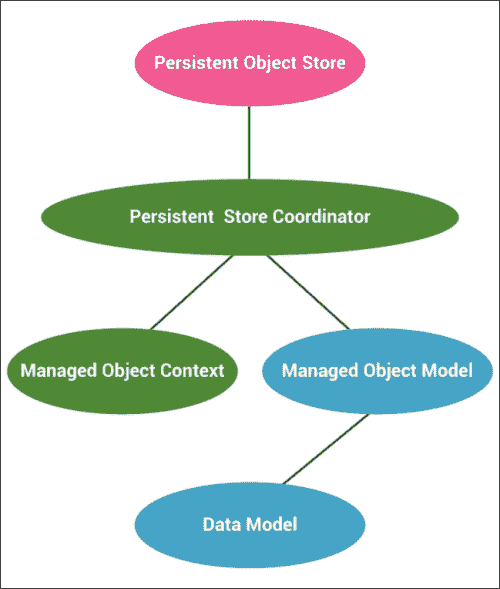
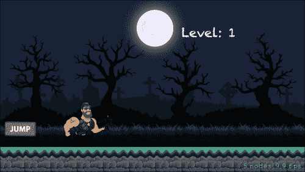
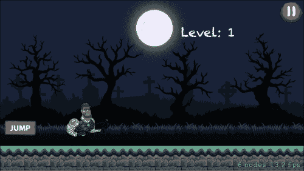
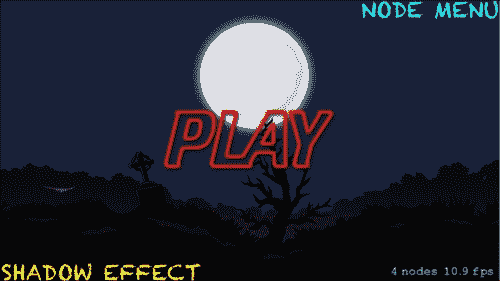

# 第八章。处理多个场景和层次

在上一章中，我们讨论了 Sprite Kit 的一个非常重大的主题，那就是粒子效果和着色器。我们还讨论了`SKEmitterNode`对象和`SKShader`对象。我们还在我们的*平台游戏*中实现了它们。在我们的游戏中实现着色器是最有趣的部分。

在本章中，我们将讨论游戏的一个重要方面，那就是增加多个层次。在游戏中拥有各种层次会使游戏更加有趣，因为随着层次的增加，游戏的复杂性也会增加，使其更具挑战性。随着游戏中增加各种层次，添加暂停按钮也变得很重要，这样游戏就可以在需要时暂停。

# 优化游戏层次

如果一个游戏以相同的难度持续运行，将会变得单调乏味，用户很快就会失去兴趣。那么，你如何让你的游戏保持有趣、刺激和具有挑战性？如果你的游戏不断增加难度并为用户添加新的挑战，它将一直保持到游戏结束。

游戏中的不同层次不过是游戏的部分或章节。通常，在大多数游戏中，游戏场景被划分为多个层次。层次将游戏划分为小节，并且一次只加载一个层次。在游戏中，层次可以用不同的名称表示，如回合、阶段、章节、幕、地图、世界等。不同的层次可以通过名称或数字来表示。如果用数字系统来表示层次，那么一个明显的类比是数字越高，层次越高。

层次的名称是游戏层次的第一印象；建议对此进行简要思考。让我们来讨论一下层次的命名：

+   **功利主义**：这主要包含一个数字系统或任何其他类似类比。这个系统给玩家提供了一个关于他们进度感的想法。

+   **位置**：这需要使用层次的地理位置作为层次名称，如城市、村庄、城镇等。这给玩家一个关于他们将会看到什么的想法。

+   **描述性**：这些更像是书的章节。这包括诸如飞艇堡垒、绿色山丘区、秋之柱等名称。

这是你可以为你的游戏层次命名的主要三种方式。除此之外，还有一种方法可以为层次起一些俏皮的名字。这完全取决于你如何命名你的层次。

要完成一个游戏层次，用户必须通过一些限制或困难，例如达到一定的分数点或执行特定任务以到达下一个层次。这通常被称为游戏进度。

程序员通常以以下两种方式之一创建不同的层次：

+   **新境界，新层次**：在这个方法中，为每个新层次创建一个新的场景。

+   **单个场景中的多级**：如果新级别在精灵或其他游戏元素上没有太多变化，我们也可以在单个场景中实现多级功能。对于每个新级别只改变一个或两个元素的游戏，单个场景可能是一个不错的选择。

## 多级策略

游戏中的不同级别定义了游戏的难度，或者某些级别表示用户在游戏中当前应该达到的点。

在大多数游戏中，级别 1 将是第一个级别的第一个`SKScene`类的名称。当从一个级别过渡到另一个级别或描述任何其他效果、动画或信息时，随着级别的增加，也有许多好的过渡选项可供选择。

我们可以使用数组或字典来存储玩家数据，例如物品、健康、达到的级别等。除非您有大量数据需要保存，否则`NSUserDefaults`可能是最佳选择。

### Core Data

对于游戏较大的数据存储需求，我们可以使用单独的数据文件。对于此类要求，Apple 提供了一款强大的工具，即 Core Data。这个工具对于存储级别信息、用户信息等非常有用。

什么是 Core Data？它是由 Apple 提供的一个框架，充当游戏与 SQLite 和其他存储环境之间的桥梁。就像 SQL 一样，您可以有表、关系和查询。与 SQLite 相比，Core Data 的优势在于它不需要语法，并且与关系数据库不同，它表示对象和类。



Core Data 中的重要术语如下：

+   **管理对象模型**：这是一个允许您建模类（实体）、关系和查询的工具。（这是由 Core Data 框架使用的）。

+   **管理对象[每行一个对象]**：这指的是在您的游戏中创建的对象。这些是您的数据类，例如玩家信息、级别信息等。每个管理对象代表您表（实体）中的一行。

+   **管理对象上下文**：这是一个重要的对象，因为它管理在模型中定义的所有上下文对象之间的关系。它还跟踪上下文对象的状态。所有与底层数据库的交互都通过上下文进行。管理对象上下文请求持久协调器以获取数据，并在必要时告诉它保存数据。

+   **持久存储协调器**：通过持久存储协调器，我们在设备上提供了一个数据存储位置。

+   **持久对象存储**：这是设备上的一个数据存储环境。

# 在我们的平台游戏平台中添加级别

让我们在*平台游戏*中添加级别。我们将在一个场景中添加级别。对于级别难度的变化，我们可以增加玩家跑步的速度，并可以指定一个距离，在该距离后级别将增加。

现在，在我们深入添加游戏中的层级之前，首先，我们应该了解正在玩的游戏层级。因此，我们将在游戏场景中添加**层级**标签，以便用户了解正在玩的游戏层级。

## 添加层级标签

**层级**标签是一个简单的文本，它将在游戏场景中显示，并作为识别正在玩的游戏层级的部分信息。如前所述，层级的名称可以是数字、位置或描述。作为层级标识符的数字，在游戏中是最常见的词源。在我们的*平台游戏*中，我们使用数字作为层级标签。

在`GameScene.swift`文件中添加以下代码。此代码将在我们的游戏中添加`level`标签功能：

```swift
func addLevelLabel()
   {
       self.levelLabel.text = "Level: 1"
       self.levelLabel.fontSize = 30
       self.levelLabel.zPosition = 3
       self.levelLabel.position = CGPointMake(CGRectGetMidX(self.frame) + scoreText.frame.width , CGRectGetMidY(self.frame) + levelLabel.frame.height * 4.2)
       self.addChild(self.levelLabel)
   }

// ADDING LEVELS
   let levelLabel = SKLabelNode(fontNamed: "Chalkduster")
   var level = 1
addLevelLabel()
```

在前面的代码中，我们使用`SKLabelNode`添加了`level`标签，并应用了字体`chalkduster`。初始层级设置为`1`，然后从那里开始递增。

这是在添加了用于标识**层级：l**的`label`后游戏的外观：



## 添加层级

随着游戏的进行，难度级别会增加。难度级别的增加可以根据任何数量的因素进行；我们可以当玩家跨越特定数量的方块时增加层级，或者当分数达到一定限制时，或者当时间增加时增加层级。

在我们的*平台游戏*中，我们将根据跨越的方块数量增加难度级别。随着游戏的进行，我们将识别出需要下一层的情况，如下所示：

+   **层级 1**：这个层级在游戏开始时加载。

+   **层级 2**：当玩家从第五个方块跳起时，我们将开始第二层。

+   **层级 3**：当玩家从第十个方块跳起时，我们将开始第三层。

+   **最后一层**：当玩家从 20 个方块跳起时，我们将引入*平台游戏*的最后一层。

随着层级的每次提升，我们也将增加游戏的难度。在我们的游戏中，我们将增加地面速度，这将使游戏更难玩。

要添加层级功能，需要在`GameScene.swift`文件中的`blockRunner`方法中添加。以下是添加了功能的代码：

```swift
func blockRunner()
   {
       // LOOP FOR THE DICTIONARY TO GET BLOCKS
       for(block, blockStatus) in self.blockStatuses
       {
           var thisBlock = self.childNodeWithName(block)!
           if blockStatus.shouldRunBlock()
           {
               blockStatus.timeGapForNextRun = random()
               blockStatus.currentInterval = 0
               blockStatus.isRunning = true
           }

           if blockStatus.isRunning
           {

               if thisBlock.position.x > blockMaxX      // IF IT IS POSITIVE (KEEP MOVING BLOCKS FROM RIGHT TO LEFT)
               {
                   thisBlock.position.x -= CGFloat(self.groundSpeed)

               }
               else                                 // #1
               {
                   thisBlock.position.x = self.origBlockPositionX
                   blockStatus.isRunning = false
                   self.numberOfBlocksCrosssed += 1
                    self.levelLabel.text = "Level: \(String(self.level))"
                   if self.numberOfBlocksCrosssed == 5
                   {
                       self.level = level + 1
                       self.groundSpeed = self.groundSpeed + 7
                   }
                   else if self.numberOfBlocksCrosssed == 10
                   {
                       self.level = level + 1
                       self.groundSpeed = self.groundSpeed + 9
                   }
                   else if self.numberOfBlocksCrosssed == 20
                   {
                       self.level = level + 1
                       self.groundSpeed = self.groundSpeed + 12
                   }
                   else if self.numberOfBlocksCrosssed > 20
                   {
                       println("Final Level")
                   }
               }
                      }
           else
           {
               blockStatus.currentInterval++
           }

       }

   }
```

在前面的代码中，在标记为`#1`的`else`语句内部，添加了增加层级的代码。该代码有一个嵌套的`if`，`else if`条件，其中我们检查了跨越的方块数量，并根据这个数量增加了层级和游戏的地面速度。

前面的代码中有四个描述层级和地面速度增加的语句。第二层在玩家跨越 5 个方块后开始，地面速度也会增加。同样，在跨越 10 和 20 个方块后，层级和地面速度也会增加。

现在，我们已经成功添加了在跨越一定数量的方块后增加层级的函数。

以下是如何在玩家穿越五个方块时，**Level: 2** 标签将看起来：


### 注意

对于拥有更多关卡的游戏，建议为关卡逻辑代码创建一个单独的文件。例如，如果我们游戏中拥有 10 个不同的关卡，那么我们也会创建一个单独的文件。

# 添加暂停功能

在游戏过程中暂停游戏是一个重要的功能。我们的游戏将受益于 `pause` 功能；它将允许玩家从上次离开的地方继续游戏。

让我们添加 `pause` 功能：

1.  主要的，我们将为 `GameScene` 创建一个 **Play/**Pause** 按钮，并配置按钮的位置和图像。我们将在 `GameScene.swift` 类内部添加以下代码行：

    ```swift
    var pauseBtn:SKSpriteNode = SKSpriteNode(imageNamed: "PLAY-PAUSE")
    ```

1.  设置 `pauseBtn` 标签的属性，例如 `size`、`position` 等，就像我们在 `addPlayPauseButton()` 方法中为其他标签所做的那样。这将是这样看起来：

    ```swift
    func addPlayPauseButton()
       {
           //self.runAction(sound)
           self.pauseBtn.name = "PAUSE"
           self.pauseBtn.zPosition = 3
           self.pauseBtn.position = CGPointMake(CGRectGetMaxX(self.frame) - pauseBtn.frame.width/2 , CGRectGetMaxY(self.frame) - pauseBtn.frame.height/2)
           self.addChild(pauseBtn)

       }
    ```

    请确保您也从 `didMoveToView()` 方法中调用它。

1.  现在，我们必须添加实际暂停游戏的功能。我们通过在 `touchesBegan()` 方法中添加以下代码来实现这一点：

    ```swift
    if self.pauseBtn.containsPoint(location)
               {
                   if(self.view?.paused == false)
                   {
                       println("Game Scene is Paused")
                       self.view?.paused = true

                   }
                   else
                   {
                       println("Game Scene is Resumed")
                       self.view?.paused = false
                   }
               }
    ```

    上述代码将在按钮被按下时暂停游戏，如果按钮再次被按下，游戏将继续。

以下截图显示了添加 `pause` 功能后游戏的外观；截图的右上角出现了一个暂停按钮：



注意右上角的暂停按钮；点击此按钮将暂停游戏。

# 添加 NODE MENU 按钮

我们创建了一个显示游戏节点示例的节点菜单场景。我们现在将在主菜单上添加一个按钮，允许用户访问节点菜单场景：

1.  首先，我们必须在开始时使用以下代码行创建 `NodeMenuScene` 的实例：

    ```swift
    var nodeMenuSceneInstance : NodeMenuScene?
    ```

1.  现在，我们必须设置 **NODE MENU** 按钮标签的属性，就像我们之前为 **Level:** 标签所做的那样。为此，在 `addNodeMenuSceneBtn()` 方法中添加以下代码，并从 `didMoveToView()` 方法中调用它：

    ```swift
    func addNodeMenuSceneBtn()
       {
           var backbutton = SKLabelNode(fontNamed: "Chalkduster")
           backbutton.fontColor = UIColor.cyanColor()
           backbutton.name = "NODEMENU"
           backbutton.text = "NODE MENU"
           backbutton.position = CGPointMake(CGRectGetMaxX(self.frame) - backbutton.frame.width/2 , CGRectGetMaxY(self.frame) - backbutton.frame.width/8)
           backbutton.zPosition = 3
           self.addChild(backbutton)
       }
    ```

1.  现在，在 `touchesBegan()` 方法中添加以下代码，通过点击我们刚刚创建的 `NODEMENU` 按钮来移动到节点菜单场景：

    ```swift
    else if node.name == "NODEMENU"
               {
                   goToNodeMenuScene()

               }
    ```

1.  使用以下代码创建从我们当前场景的过渡：

    ```swift
    func goToNodeMenuScene()
       {
           let transitionEffect = SKTransition.flipHorizontalWithDuration(1.0)
           nodeMenuSceneInstance = NodeMenuScene(size: self.size)
           nodeMenuSceneInstance!.anchorPoint = CGPoint(x: 0.5, y: 0.5)
           self.view?.presentScene(nodeMenuSceneInstance , transition:transitionEffect)
       }
    ```

在前面的代码中，我们创建了 `goToNodeMenuScene()` 方法，并为场景从一个切换到另一个添加了水平翻转的过渡效果。

以下截图显示了创建访问节点菜单场景按钮后，主菜单将看起来如何：



当有人点击按钮，**NODE MENU**，节点菜单场景将在屏幕上打开。

# 摘要

在本章中，我们在*平台游戏*中增加了难度级别。我们通过创建关卡标签和关卡递增功能来更新了我们的游戏。现在提供了一个重要功能，*暂停*。此外，我们还学会了如何通过**节点菜单**按钮集成节点菜单场景来在我们的游戏中添加场景。

在下一章中，我们将讨论性能提升技术，以及将要添加到我们的*平台游戏*中的重要额外功能。
