# *第一章*：熟悉 Xcode

欢迎来到*iOS 15 编程入门*。希望您会发现这是一本关于在 App Store 上创建和发布 iOS 15 应用的实用介绍。

在本章中，您将学习如何在您的 Mac 上下载和安装**Xcode**。您将熟悉 Xcode 用户界面的不同部分，并创建您的第一个**iOS 应用**，然后在**iOS 模拟器**中运行它。然后，您将学习如何通过 USB 将**iOS 设备**连接到 Xcode，以便在设备上运行应用，如何将**Apple ID**添加到 Xcode，以便在您的设备上创建和安装必要的数字证书，以及如何信任设备上的证书。最后，您将学习如何通过 Wi-Fi 连接到您的设备，这样您就不再需要在每次运行应用时插拔设备。

到本章结束时，您将知道如何在 iOS 模拟器或 iOS 设备上创建和运行应用，这是您在构建自己的应用时需要做的。

以下内容将涵盖：

+   从 App Store 下载和安装 Xcode

+   理解 Xcode 用户界面

+   在 iOS 模拟器中运行应用

+   使用 iOS 设备进行开发

# 技术要求

要完成本章的练习，您需要以下内容：

+   运行 macOS 11 Big Sur 或 macOS 12 Monterey 的 Apple Mac 计算机

+   Apple ID（如果您没有，您将在本章中创建一个）

+   可选，运行 iOS 15 的 iOS 设备

本章的 Xcode 项目位于本书代码包的`Chapter01`文件夹中，可以在此处下载：

[`github.com/PacktPublishing/iOS-15-Programming-for-Beginners-Sixth-Edition`](https://github.com/PacktPublishing/iOS-15-Programming-for-Beginners-Sixth-Edition)

查看以下视频，了解代码的实际效果：

[`bit.ly/3wqcqpG`](https://bit.ly/3wqcqpG)

您将从下一节开始下载 Xcode，这是 Apple 的集成开发环境（IDE），用于从 App Store 开发 iOS 应用。

小贴士

下载的大小非常大（在撰写本文时为 11.7 GB），因此可能需要一段时间才能下载。在下载之前，请确保您有足够的磁盘空间。

# 从 App Store 下载和安装 Xcode

在您开始编写 iOS 应用之前，您需要从 App Store 下载和安装 Xcode。为此，请按照以下步骤操作：

1.  从**Apple**菜单中选择**App Store**。

1.  在右上角的搜索框中，输入`Xcode`并按*回车*键。

1.  您应该在搜索结果中看到**Xcode**。点击**获取**并点击**安装**。

1.  如果您有 Apple ID，请在**Apple ID**文本框中输入它。如果您没有，请点击**创建 Apple ID**按钮，并按照逐步说明创建一个：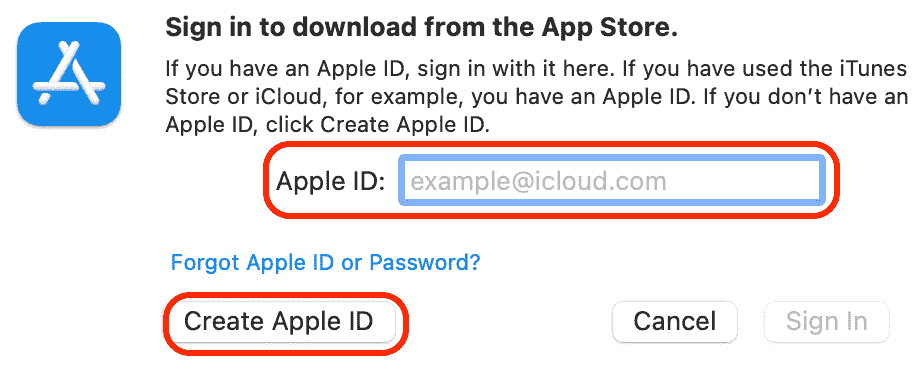

    图 1.1：Apple ID 创建对话框

    重要信息

    您可以通过此链接了解如何创建 Apple ID 的更多信息：[`support.apple.com/en-us/HT204316#appstore`](https://support.apple.com/en-us/HT204316#appstore)。

1.  Xcode 安装完成后，启动它。您应该会看到以下**欢迎使用 Xcode**屏幕。在左侧面板中点击**创建新的 Xcode 项目**：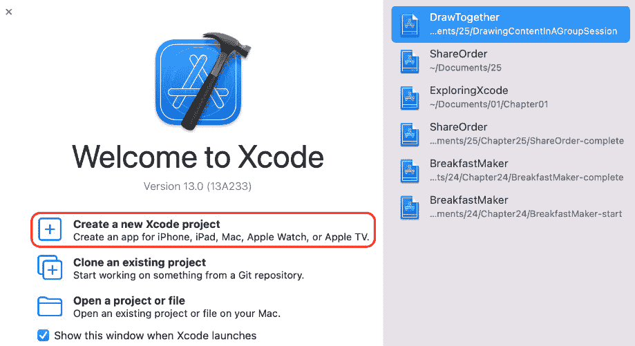

    图 1.2：欢迎使用 Xcode 屏幕

1.  您将看到以下新项目屏幕。在**选择您新项目的模板**部分，选择**iOS**。然后选择**App**并点击**下一步**：

    图 1.3：选择新项目模板屏幕

1.  您将在文本字段中看到`ExploringXcode`。

1.  `com.yourname`。这被称为反向域名命名格式，通常在这里使用。

1.  **界面**: 创建您应用用户界面的方法。将其设置为**Storyboard**。

1.  **语言**: 要使用的编程语言。将其设置为**Swift**。

    将其他设置保留为默认值，并确保所有复选框都没有勾选。完成后点击**下一步**。

1.  您将看到一个**保存**对话框。选择一个位置来保存您的项目，例如**桌面**或**文档**文件夹，然后点击**创建**：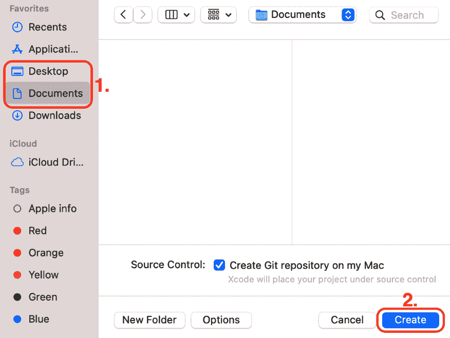

    图 1.5：保存对话框

1.  如果您看到一个对话框说**版本控制系统未提供作者信息**，请点击**修复**。

    重要信息

    您看到此对话框的原因是**源代码控制**复选框已被勾选。Apple 建议启用源代码控制。源代码控制超出了本书的范围，但如果您想了解更多关于版本控制和 Git 的信息，请参阅此链接：[`git-scm.com/video/what-is-version-control`](https://git-scm.com/video/what-is-version-control)。

1.  您将看到以下源代码控制首选项屏幕：

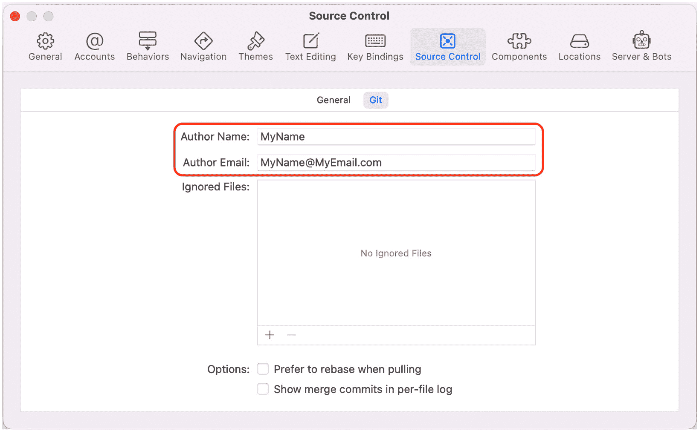

图 1.6：源代码控制首选项屏幕

输入以下信息：

+   **作者姓名**：– 您的名字

+   **作者电子邮件**：– 您的电子邮件地址

完成后，通过点击左上角的红色关闭按钮关闭**源代码控制**首选项屏幕。Xcode 主窗口将出现。

太棒了！您现在已成功下载并安装了 Xcode，并创建了您的第一个项目。在下一节中，您将了解 Xcode 用户界面。

# 理解 Xcode 用户界面

您已经创建了您的第一个 Xcode 项目！如您所见，Xcode 用户界面被分为几个不同的部分，如下所示：

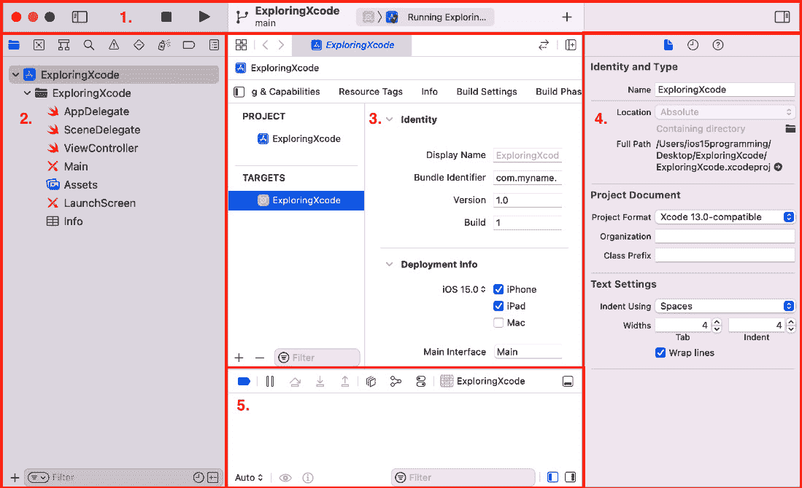

图 1.7：Xcode 用户界面

让我们更详细地看看每一部分。以下描述对应于前面截图中的数字：

+   **工具栏（1）** – 用于构建和运行你的应用，并查看运行任务的进度。

+   **导航区域（2）** – 提供快速访问项目各个部分的途径。默认情况下显示**项目导航器**。

+   **编辑区域（3）** – 允许你编辑源代码、用户界面和其他资源。

+   **检查器区域（4）** – 允许你查看和编辑在导航区域或编辑区域中选定的项目的信息。

+   **调试区域（5）** – 包含**调试栏**、**变量视图**和**控制台**。通过按*Shift + Command + Y*来切换调试区域。

接下来，让我们更仔细地检查工具栏。以下是工具栏左侧的显示：

图 1.8：Xcode 工具栏（左侧）

让我们更详细地看看每一部分。以下描述对应于前面截图中的数字：

+   **导航器按钮（1）** – 切换导航区域的开启和关闭。

+   **停止按钮（2）** – 只有在应用正在运行时才会出现在**播放**按钮旁边。停止当前运行的应用。

+   **播放按钮（3）** – 用于构建和运行你的应用。

+   **方案菜单（4）** – 显示构建项目的特定方案（**探索 Xcode**）和运行应用的设备目标（**iPhone SE (第 2 代**）。

    方案和目标不同。方案指定了构建和运行项目的设置。目标指定了应用的安装位置，存在于物理设备和模拟器中。

+   **活动视图（5）** - 显示运行任务的进度。

以下是工具栏右侧的显示：

图 1.9：Xcode 工具栏（右侧）

让我们更详细地看看每一部分。以下描述对应于前面截图中的数字：

+   **库按钮（1）** – 显示用户界面元素、代码片段和其他资源。

+   **检查器按钮（2）** – 切换检查器区域的开启和关闭。

不要被所有不同的部分吓倒，因为你在后面的章节中会详细了解它们。现在，你已经熟悉了 Xcode 界面，你将在 iOS 模拟器中运行你刚刚创建的应用，它将显示你的 iOS 设备的表示。

# 在 iOS 模拟器中运行应用

当你安装 Xcode 时，iOS 模拟器会被安装。它提供了一个模拟的 iOS 设备，这样你就可以看到你的应用看起来如何以及它的行为，而无需物理 iOS 设备。它可以模拟 iPad 和 iPhone 的所有屏幕尺寸和分辨率，这样你可以轻松地在多个设备上测试你的应用。

要在模拟器中运行你的应用，请按照以下步骤操作：

1.  点击工具栏中的**方案**菜单，你会看到一个模拟器的列表。从该菜单中选择**iPhone SE (第 2 代)**：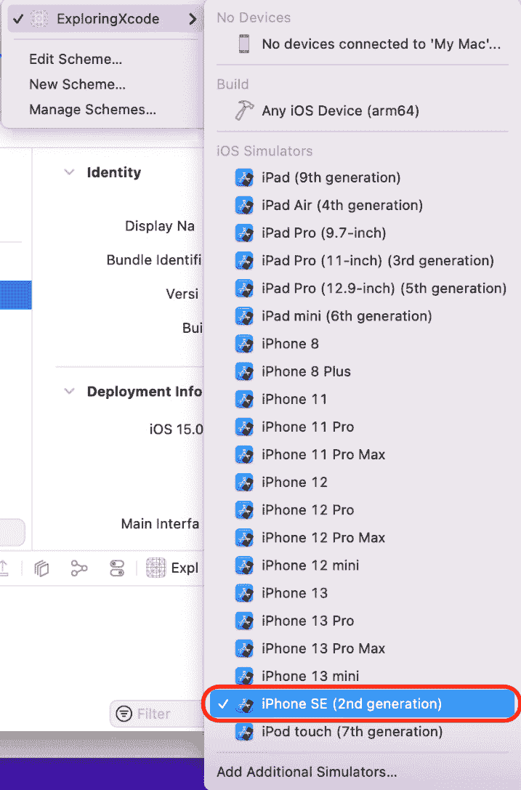

    图 1.10：Xcode 方案菜单，选择 iPhone SE（第 2 代）

1.  点击**播放**按钮来安装并运行当前所选模拟器上的应用程序。你也可以使用*Command + R*键盘快捷键。

1.  如果你看到 Mac 管理员账户的**用户名**和**密码**，并点击**继续**。

1.  模拟器将启动并显示 iPhone SE（第 2 代）的表示。你的应用程序显示一个白色屏幕，因为你还没有向你的项目添加任何内容：![图 1.11：iOS 模拟器]

    ](img/Figure_1.11_B17469.jpg)

    图 1.11：iOS 模拟器

1.  切换回 Xcode 并点击**停止**按钮（或按*Command* + *.*)来停止当前运行的项目。

你刚刚在模拟器中创建并运行了你的第一个 iOS 应用程序！做得好！

如果你查看**方案**菜单，可能会好奇**无设备**和**构建**部分是用于什么的。让我们在下一节中看看它们。

重要信息

如果你使用的是 M1 Mac，你将在**方案**菜单中看到**我的 Mac（专为 iPad 设计**）而不是**无设备**。

## 理解无设备和构建部分

在上一节中，你学习了如何在**方案**菜单中选择模拟器来运行你的应用程序。除了模拟器列表之外，**方案**菜单还有**无设备**和**构建**部分。这些允许你在真实 iOS 设备上运行应用程序，并为提交到 App Store 准备应用程序。

点击工具栏中的**方案**菜单，可以看到菜单顶部的**无设备**和**构建**部分：

![图 1.12：Xcode 方案菜单，选择任何 iOS 设备（arm64）]

](img/Figure_1.12_B17469.jpg)

图 1.12：Xcode 方案菜单，选择任何 iOS 设备（arm64）

目前，**无设备**部分显示的文本是**无设备连接到“我的 Mac”...**，因为你目前没有任何 iOS 设备连接到你的电脑。如果你插入一个 iOS 设备，它将出现在这个部分，你将能够运行你为其开发的测试应用程序。在真实设备上运行你的应用程序是推荐的，因为模拟器不会准确反映真实 iOS 设备的性能特征，并且没有一些真实设备拥有的硬件功能和软件 API。

**构建**部分只有一个菜单项，**任何 iOS 设备（arm64）**。当你需要提交到 App Store 之前存档你的应用程序时使用它。你将在*第二十六章**，测试并将你的应用程序提交到 App Store*中学习如何这样做。

现在让我们看看如何在真实 iOS 设备上构建和运行你的应用程序。尽管这本书中的大多数说明不需要你拥有 iOS 设备，所以如果你没有，请跳过下一节，直接进入*第二章**，简单值和类型*。

# 使用 iOS 设备进行开发

虽然您将能够使用此书中的大多数练习，但建议在实际的 iOS 设备上构建和测试您的应用程序，因为模拟器无法模拟某些硬件组件和软件 API。

重要信息

要全面了解模拟器和实际设备之间的所有差异，请参阅此链接：[`help.apple.com/simulator/mac/current/#/devb0244142d`](https://help.apple.com/simulator/mac/current/#/devb0244142d)。

除了您的设备外，您还需要一个 Apple ID 或付费的 Apple 开发者账户来在您的设备上构建和运行您的应用程序。目前，您将使用用于从 App Store 下载 Xcode 的相同的 Apple ID。请按照以下步骤操作：

1.  使用随您的 iOS 设备一起提供的电缆将您的设备连接到您的 Mac，并确保 iOS 设备已解锁。

    小贴士

    您可以通过在 Xcode 菜单栏中选择 **窗口** | **设备和模拟器** 来查看已连接的设备。

1.  在 **方案** 菜单中，选择您的设备（在本例中为 **iPhone**）作为运行目标：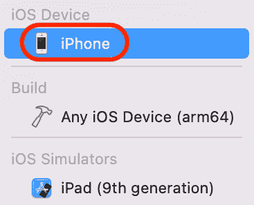

    图 1.13：已选择实际 iOS 设备的 Xcode 方案菜单

1.  等待 Xcode 完成索引和处理，这可能需要一段时间。一旦完成，**就绪**将在状态窗口中显示。

1.  通过单击 **播放** 按钮运行项目（或使用 *Command + R*）。您将得到以下错误：**“Exploring Xcode”的签名需要开发团队**：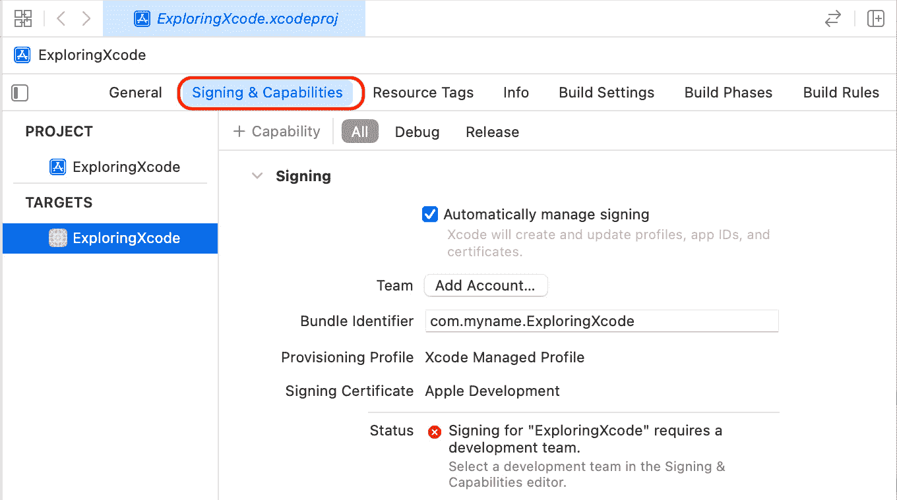

    图 1.14：Xcode 签名与能力窗格

    这是因为在 iOS 设备上运行应用程序需要数字证书，您需要将 Apple ID 或付费的 Apple 开发者账户添加到 Xcode 中，以便生成数字证书。

    重要信息

    使用 Apple ID，您可以在 iOS 设备上测试您的应用程序，但您需要一个付费的 Apple 开发者账户来在 App Store 上分发应用程序。您将在*第二十六章**，测试并将您的应用程序提交到 App Store*中了解更多信息。

    重要信息

    证书确保只有您授权的应用程序才能在您的设备上运行。这有助于防止恶意软件。您也可以通过此链接了解更多信息：[`help.apple.com/xcode/mac/current/#/dev60b6fbbc7`](https://help.apple.com/xcode/mac/current/#/dev60b6fbbc7)。

1.  单击 **添加账户...** 按钮：

    图 1.15：Xcode 签名与能力窗格，已选择“添加账户...”按钮

1.  Xcode **首选项** 窗口出现，并已选择 **账户** 窗格。输入您的 **Apple ID** 并单击 **下一步**：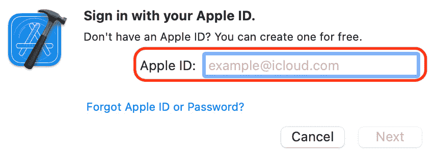

    图 1.16：Apple ID 登录对话框

    小贴士

    您也可以通过在 **Xcode** 菜单中选择 **首选项** 来访问 Xcode 首选项。

1.  当提示时，输入您的密码。几分钟后，**账户** 面板将显示您的账户设置：![图 1.17：Xcode 首选项中的账户面板

    ![图 1.17_B17469.jpg]

    图 1.17：Xcode 预设中的账户面板

1.  完成后，通过点击左上角的红色关闭按钮关闭 **首选项** 窗口。

1.  在 Xcode 的编辑器区域中，点击 **签名与能力**。确保 **自动管理签名** 已勾选，并且从 **团队** 下拉菜单中选择 **个人团队**：![图 1.18：设置账户的 Xcode 签名与能力面板

    ![图 1.18_B17469.jpg]

    图 1.18：设置 Xcode 预设中的账户面板

1.  如果您在此屏幕上仍然看到错误，请尝试更改您的 `com.myname4352.ExploringXcode`。

1.  当您构建和运行时，一切应该都能正常工作，并且您的应用将安装到您的 iOS 设备上。然而，它将无法启动，您将看到以下消息：

![图 1.19：无法启动 "ExploringXcode" 对话框

![图 1.19_B17469.jpg]

图 1.19：无法启动 "ExploringXcode" 对话框

这意味着您需要信任已安装到您设备上的证书。您将在下一节中学习如何进行此操作。

## 在您的 iOS 设备上信任开发者应用证书

**开发者应用证书** 是一个特殊文件，它将与您的应用一起安装到您的 iOS 设备上。在您的应用可以运行之前，您需要信任它。请按照以下步骤操作：

1.  在您的 iOS 设备上，点击 **设置** | **通用** | **VPN 与设备管理**：![图 1.20：iOS 设置中的设备管理设置

    ![图 1.20_B17469.jpg]

    图 1.20：iOS 设置中的设备管理设置

1.  点击 **Apple 开发者**：![图 1.21：设备管理设置中的 Apple 开发者部分

    ![图 1.21_B17469.jpg]

    图 1.21：设备管理设置中的 Apple 开发者部分

1.  点击 **信任 "Apple Development:** "：![图 1.22：信任按钮

    ![图 1.22_B17469.jpg]

    图 1.22：信任按钮

1.  点击 **信任**：![图 1.23：信任对话框

    ![图 1.23_B17469.jpg]

    图 1.23：信任对话框

1.  您应该看到以下文本，这表明应用现在已被信任：![图 1.24：带有信任证书的 Apple 开发者部分

    ![图 1.24_B17469.jpg]

    图 1.24：带有信任证书的 Apple 开发者部分

1.  在 Xcode 中点击 **播放** 按钮以重新构建和运行。您将看到您的应用在 iOS 设备上启动并运行。

恭喜！请注意，您必须使用电缆将您的 iOS 设备连接到 Mac 以构建和运行您的应用。您将在下一节中学习如何通过 Wi-Fi 连接到您的设备。

## 无线连接 iOS 设备

随着时间的推移，将您的 iOS 设备从 Mac 上拔出并重新连接会变得相当麻烦，因此您现在将配置 Xcode 通过 Wi-Fi 连接到您的 iOS 设备。请按照以下步骤操作：

1.  确保您的 iOS 设备已连接到您的 Mac，并且 Mac 和 iOS 设备处于同一无线网络中。

1.  从 Xcode 菜单栏中选择**窗口** | **设备和模拟器**：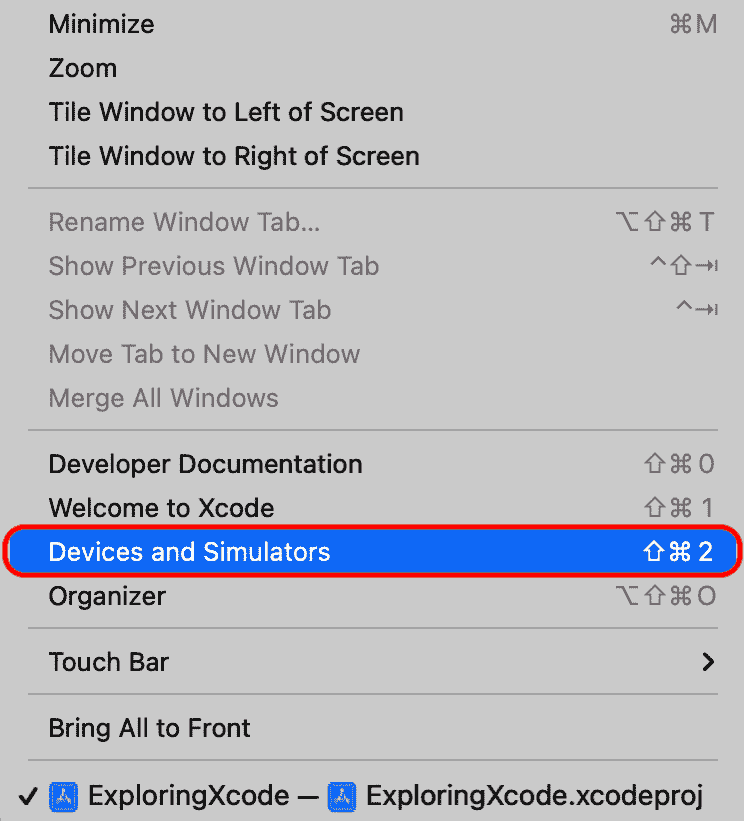

    图 1.25：选择设备和模拟器的 Xcode 窗口菜单

1.  点击标记为**通过网络连接**的复选框：

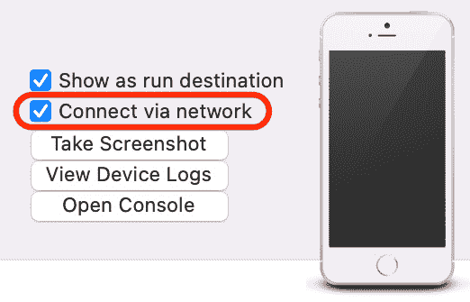

图 1.26：Xcode 设备和模拟器窗口，已勾选通过网络连接

太棒了！你的 iOS 设备现在已通过无线方式连接到 Xcode，你不再需要将其连接到 USB 线缆。

# 摘要

在本章中，你学习了如何在你的 Mac 上下载和安装 Xcode。你熟悉了 Xcode 用户界面的不同部分。你创建了你的第一个 iOS 应用，选择了一个模拟器，并构建和运行了该应用。你学习了**无设备**和**通用 iOS 设备**菜单项的用途。这使得你能够在没有 iOS 设备的情况下在你的 Mac 上创建和运行 iOS 应用。

你学习了如何通过 USB 将 iOS 设备连接到 Xcode，以便你可以在其上运行应用。你向 Xcode 添加了 Apple ID，以便可以在你的设备上创建和安装必要的数字证书，并在你的设备上信任该证书。这让你能够在实际设备上运行你的应用，从而更准确地确定它们的性能，并利用在 iOS 模拟器中不可用的功能。

最后，你学习了如何通过 Wi-Fi 连接到你的设备，因此你不再需要在运行应用时每次都插拔设备。这使得在 iOS 设备上构建和测试你的应用变得更加方便，因为任何新的构建都可以立即通过空中传输。

在下一章中，你将开始使用 Swift Playgrounds 探索 Swift 语言，并学习简单的值和类型在 Swift 中的实现方式。
