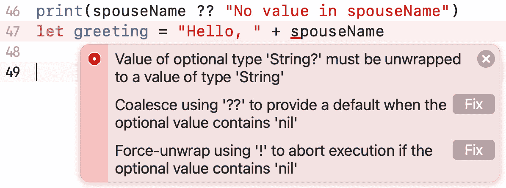

# 第三章：*第三章*: 条件语句和可选类型

在上一章中，你学习了数据类型、常量、变量和操作。到目前为止，你能够编写简单的程序来处理字母和数字。然而，程序并不总是按顺序执行。很多时候，你需要根据条件执行不同的指令。Swift 允许你通过使用 **条件语句** 来做到这一点，你也将在这章中学习如何使用它们。

另一件你可能注意到的事情是，在上一章中，每个变量或常量都被立即赋予了值。如果你需要一个可能最初没有值的变量，你将需要一个方法来创建一个可能或可能没有值的变量。Swift 允许你通过使用 **可选类型** 来做到这一点，你也将在这章中了解它们。

到本章结束时，你应该能够编写根据不同条件执行不同操作的程序，并处理可能或可能没有值的变量。

以下内容将涵盖：

+   介绍条件语句

+   介绍可选类型和可选绑定

    小贴士

    请花些时间了解可选类型。对于新手程序员来说，它们可能会有些令人畏惧。

# 技术要求

本章的 Xcode 演示文稿位于本书代码包的 `Chapter03` 文件夹中，您可以通过以下链接下载：

[`github.com/PacktPublishing/iOS-15-Programming-for-Beginners-Sixth-Edition`](https://github.com/PacktPublishing/iOS-15-Programming-for-Beginners-Sixth-Edition)

查看以下视频，看看代码的实际效果：

[`bit.ly/3woRRKq`](https://bit.ly/3woRRKq)

创建一个新的演示文稿，并将其命名为 `ConditionalsAndOptionals`。你可以一边阅读一边在这个章节中输入和运行所有代码。你将从学习条件语句开始。

# 介绍条件语句

有时，你可能需要根据特定的条件执行不同的代码块，例如以下场景：

+   在酒店选择不同的房间类型。大房间的价格会更高。

+   在在线商店之间切换不同的支付方式。不同的支付方式会有不同的程序。

+   在快餐店决定要订购什么。每种食品的准备程序都会不同。

要做到这一点，你需要使用条件语句。在 Swift 中，这是通过使用 `if` 语句（用于单个条件）和 `switch` 语句（用于多个条件）来实现的。

重要信息

想了解更多关于条件语句的信息，请访问 [`docs.swift.org/swift-book/LanguageGuide/ControlFlow.html`](https://docs.swift.org/swift-book/LanguageGuide/ControlFlow.html)。

让我们看看 `if` 语句是如何根据条件值执行不同任务的，在下一节中。

## 使用 `if` 语句

一个 `if` 语句会在条件为 `true` 时执行一段代码，如果条件为 `false`，则可选地执行另一段代码。`if` 语句看起来是这样的：

```swift
if condition {
   code1
} else {
   code2
}
```

现在我们来实现一个`if`语句来观察其效果。想象一下你正在为一家餐厅编写一个应用。这个应用将允许你检查餐厅是否营业，搜索餐厅，以及检查顾客是否超过饮酒年龄限制。

按照以下步骤操作：

1.  要检查餐厅是否营业，将以下代码添加到你的沙盒中，以创建一个常量，并在常量的值是`true`时执行一个语句。点击`isRestaurantOpen`，并将其赋值为`true`。接下来，你有一个检查存储在`isRestaurantOpen`中的值的`if`语句。由于值是`true`，`print()`语句被执行，并在 Debug 区域打印`Restaurant is open`。

1.  尝试将`isRestaurantOpen`的值改为`false`并再次运行你的代码。由于当前条件是`false`，Debug 区域将不会打印任何内容。

1.  如果一个值是`false`，你也可以执行语句。比如说，如果顾客搜索的餐厅不在应用数据库中，应用应该显示一条消息说明餐厅未找到。输入以下代码创建一个常量，并在常量的值是`false`时执行一个语句：

    ```swift
    let isRestaurantFound = false 
    if isRestaurantFound == false {
       print("Restaurant was not found")
    }
    ```

    常量`isRestaurantFound`被设置为`false`。接下来，检查`if`语句。`isRestaurantFound == false`条件返回`true`，并在 Debug 区域打印`Restaurant was not found`。

1.  尝试将`isRestaurantFound`的值改为`true`。由于当前条件是`false`，Debug 区域将不会打印任何内容。

1.  要在条件为`true`时执行一组语句，在条件为`false`时执行另一组语句，请使用`else`关键字。输入以下代码，该代码检查酒吧中的顾客是否超过饮酒年龄限制：

    ```swift
    let drinkingAgeLimit = 21 
    let customerAge = 23
    if customerAge < drinkingAgeLimit {
       print("Under age limit")
    } else {
       print("Over age limit")
    }
    ```

    在这里，`drinkingAgeLimit`被赋值为`21`，而`customerAge`被赋值为`23`。在`if`语句中，检查`customerAge < drinkingAgeLimit`。由于`23 < 21`返回`false`，所以执行`else`语句，并在 Debug 区域打印`Over age limit`。如果你将`customerAge`的值改为`19`，`customerAge < drinkingAgeLimit`将返回`true`，因此将在 Debug 区域打印`Under age limit`。

到目前为止，你只处理了单一条件。如果有多个条件怎么办？这就是`switch`语句的用武之地，你将在下一节中学习它们。

## 使用`switch`语句

要理解`switch`语句，我们先从实现一个带有多个条件的`if`语句开始。想象一下你正在编写一个交通灯程序。交通灯有三种可能的状态——红色、黄色或绿色，并且你希望根据灯光的颜色执行不同的操作。为此，你可以将多个`if`语句链接起来。按照以下步骤操作：

1.  将以下代码添加到您的游乐场中，以使用多个`if`语句实现交通灯，并点击`if`条件`trafficLightColor == "Red"`，返回`false`，因此执行`else`语句。第二个`if`条件`trafficLightColor == "Yellow"`返回`true`，因此在调试区域打印出`Caution`，并且不再评估更多的`if`条件。尝试更改`trafficLightColor`的值以查看不同的结果。

    这里使用的代码是有效的，但读起来有点困难。在这种情况下，`switch`语句会更简洁，更容易理解。`switch`语句看起来像这样：

    ```swift
    switch value {
    case firstValue:
       code1
    case secondValue:
       code2
    default: 
       code3
    }
    ```

    会对值进行检查并匹配到某个 case，然后执行该 case 的代码。如果没有任何一个 case 匹配，则执行`default` case 中的代码。

1.  这是如何将前面显示的`if`语句写成`switch`语句的方法。输入以下代码：

    ```swift
    trafficLightColor = "Yellow"
    switch trafficLightColor {
    case "Red":
       print("Stop")
    case "Yellow":
       print("Caution")
    case "Green":
       print("Go")
    default:
       print("Invalid color")
    }
    ```

与之前的版本相比，这里的代码更容易阅读和理解。`trafficLightColor`中的值是`"Yellow"`，所以`case "Yellow":`匹配，并在调试区域打印出`Caution`。尝试更改`trafficLightColor`的值以查看不同的结果。

关于`switch`语句有两件事需要记住：

+   Swift 中的`switch`语句默认不会从每个 case 的底部跌落到下一个 case。在前面显示的例子中，一旦`case "Red":`匹配，`case "Yellow":`、`case "Green":`和`default:`将不会执行。

+   `switch`语句必须覆盖所有可能的 case。在前面显示的例子中，任何除了`"Red"`、`"Yellow"`或`"Green"`之外的`trafficLightColor`值都会匹配到`default:`，并在调试区域打印出`Invalid color`。

这部分关于`if`和`switch`语句的内容到此结束。

在下一节中，你将学习关于可选值的内容，它允许你创建没有初始值的变量，以及**可选绑定**，它允许在可选值有值时执行指令。

# 介绍可选值和可选绑定

到目前为止，每次你声明一个变量或常量时，你都会立即给它赋值。但如果你想先声明一个变量，然后稍后赋值怎么办？在这种情况下，你会使用可选值。

重要信息

更多关于可选值的信息，请访问[`docs.swift.org/swift-book/LanguageGuide/TheBasics.html`](https://docs.swift.org/swift-book/LanguageGuide/TheBasics.html)。

让我们学习如何创建和使用可选值，并看看它们如何在程序中使用。想象你正在编写一个程序，其中用户需要输入他们配偶的名字。当然，如果用户没有结婚，那么这个值就不存在。在这种情况下，你可以使用可选值来表示配偶的名字。

可选可能有两种状态之一。它可以包含一个值，或者不包含值。如果可选包含一个值，你可以访问其中的值。访问可选值的这个过程称为解包可选。让我们看看这是如何工作的。按照以下步骤：

1.  将以下代码添加到你的沙盒中，以创建一个变量并打印其内容：

    ```swift
    var spouseName: String 
    print(spouseName)
    ```

1.  点击播放/停止按钮来运行它。由于 Swift 是类型安全的，它将显示一个错误，**在初始化之前使用变量'spouseName'**。

1.  要解决这个问题，你可以将空字符串赋给`spouseName`。按照以下方式修改你的代码：

    ```swift
    var spouseName: String spouseName should not have a value.
    ```

1.  由于`spouseName`最初不应该有值，让我们将其设置为可选。为此，在类型注解后输入一个问号并移除空字符串赋值：

    ```swift
    var spouseName: StringspouseName is now an optional string variable instead of a regular string variable, and the print() statement is expecting a regular string variable: Figure 3.1: Warning notificationClick the Play/Stop button. Even though there is a warning, the program will execute. Ignore the warning for now. The value of `spouseName` is shown as `"nil\n"` in the Results area, and `nil` is printed in the Debug area. `nil` is a special keyword that means the optional variable `spouseName` has no value.
    ```

1.  警告出现是因为`print`语句将`spouseName`视为`Any`类型而不是`String?`类型。点击黄色三角形以显示可能的修复方案，并选择第一个修复方案：

    图 3.2：选择第一个修复方案的展开警告通知

    语句将变为`print(spouseName ?? default value)`。注意`??`操作符的使用。如果`spouseName`没有值，它将分配`default value`。

1.  将`default value`占位符替换为`"spouseName 中没有值"`，如下所示。警告将消失。再次运行你的程序，"spouseName 中没有值"将出现在结果区域：

    图 3.3：显示默认值的区域

1.  让我们给`spouseName`赋一个值。按照以下方式修改代码：

    ```swift
    var spouseName: String?
    Nia appears in the Debug area.
    ```

1.  添加一行代码以将`spouseName`与另一个字符串连接，如下所示：

    ```swift
    print(spouseName ?? "No value in spouseName")
    String variable to an optional using the + operator. To use the string inside the optional, you'll have to unwrap it first.
    ```

1.  点击红色圆圈以显示可能的修复方案，你会看到以下内容：

    图 3.4：展开的错误通知

    第二个修复方案建议`spouseName`有值，但如果`spouseName`是`nil`，你的程序将崩溃。

1.  点击第二个修复方案，你会在代码的最后一行看到`spouseName`后面出现一个感叹号，这表示可选被强制解包：

    ```swift
    let greeting = "Hello, " + spouseName!
    ```

1.  当你的程序运行时，`Hello, Nia`被分配给`greeting`，如结果区域所示。这意味着`spouseName`已被成功解包。

1.  要看到强制解包包含`nil`的变量的效果，将`spouseName`设置为`nil`：

    ```swift
    spouseName = spouseName is now nil, the program crashed while attempting to force-unwrap spouseName.A better way of handling this is to use optional binding. In optional binding, you attempt to assign the value in an optional to a temporary variable (you can name it whatever you like). If the assignment is successful, a block of code is executed.
    ```

1.  要看到可选绑定的效果，按照以下方式修改你的代码：

    ```swift
    spouseName = Hello, Nia will appear in the Debug area. Here's how it works. If spouseName has a value, it will be unwrapped and assigned to a temporary variable, spouseTempVar, and the if statement will return true. The statements between the curly braces will be executed and the constant greeting will then be assigned the value Hello, Nia. Then, Hello, Nia will be printed in the Debug area. Note that the temporary variable spouseTempVar is not an optional.If `spouseName` does not have a value, no value can be assigned to `spouseTempVar` and the `if` statement will return `false`. In this case, the statements in the curly braces will not be executed at all.
    ```

1.  要看到可选包含`nil`时的可选绑定效果，再次将`nil`赋给`spouseName`：

    ```swift
    spouseName = spouseName is nil.
    ```

这就完成了关于可选和可选绑定的部分，你现在可以创建和使用可选变量了。太棒了！

# 摘要

你做得很好！你已经学会了如何使用 `if` 和 `switch` 语句，这意味着你现在能够编写自己的程序，根据不同的条件执行不同的操作。

你还学习了可选值和可选绑定。这意味着你现在可以表示可能存在也可能不存在的变量，并且只有当变量的值存在时才执行指令。

在下一章中，你将学习如何使用一系列值而不是单个值，以及如何使用循环重复程序语句。
