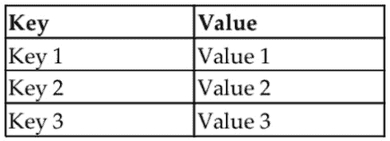

# 第五章：*第五章*：集合类型

到目前为止，你已经学到了很多！你现在可以创建一个程序，将数据存储在常量或变量中，并对它们进行操作，并且你可以使用条件语句和循环来控制流程。但到目前为止，你主要存储的是单个值。

在本章中，你将学习存储值集合的方法。Swift 有三种集合类型：**数组**，它存储一个有序的值列表；**字典**，它存储一个无序的键值对列表；以及**集合**，它存储一个无序的值列表。

到本章结束时，你将学会如何创建数组、字典和集合，以及如何对它们进行操作。

以下内容将涵盖：

+   理解数组

+   理解字典

+   理解集合

# 技术要求

本章的 Xcode 游乐场位于本书代码包的`Chapter05`文件夹中，可以在此处下载：

[`github.com/PacktPublishing/iOS-15-Programming-for-Beginners-Sixth-Edition`](https://github.com/PacktPublishing/iOS-15-Programming-for-Beginners-Sixth-Edition)

观看以下视频，看看代码的实际效果：

[`bit.ly/3H5blc2`](https://bit.ly/3H5blc2)

如果你希望从头开始，创建一个新的游乐场，并将其命名为`CollectionTypes`。你可以一边阅读一边输入并运行本章中的所有代码。

重要信息

要了解更多关于数组、字典和集合的信息，请访问[`docs.swift.org/swift-book/LanguageGuide/CollectionTypes.html`](https://docs.swift.org/swift-book/LanguageGuide/CollectionTypes.html)。

你将要学习的第一种集合类型是数组，它允许你按顺序列表存储信息。

# 理解数组

假设你想要存储以下内容：

+   便利店购物清单

+   每月必须做的家务

数组非常适合这个。数组按顺序列表存储值。它看起来是这样的：


图 5.1：数组

值必须是同一类型。你可以通过使用数组索引来访问数组中的任何值，索引从`0`开始。

如果你使用`let`关键字创建一个数组，那么一旦创建，其内容就不能更改。如果你想创建后更改数组的内容，请使用`var`关键字。

让我们看看如何使用数组。你将在下一节中通过给它赋值来创建一个数组。

## 创建一个数组

在前面的章节中，你通过声明并给它赋一个初始值来创建了一个常量或变量。你可以用同样的方式创建一个数组。

想象一下你的配偶让你去便利店买一些东西。让我们使用数组来实现一个购物清单。将以下代码添加到你的游乐场中，然后点击**播放/停止**按钮来运行它：

```swift
var shoppingList = ["Eggs", "Milk"]
```

这条指令创建了一个名为`shoppingList`的数组变量。分配的值`["Eggs", "Milk"]`是一个包含`"Eggs"`在索引`0`处的`String`数组。

在这里使用`var`关键字意味着可以修改数组的元素。由于 Swift 使用类型推断，这个数组的元素类型将是`String`。

想象一下，你需要检查在商店需要购买多少项商品。在下一节中，你将学习如何确定数组中的元素数量。

## 检查数组中的元素数量

要找出数组中有多少个元素，请使用`count`。输入并运行以下代码：

```swift
shoppingList.count
```

由于`shoppingList`数组包含两个元素，结果显示区域显示`2`。

你可以使用`isEmpty`来检查数组是否为空。输入并运行以下代码：

```swift
shoppingList.isEmpty
```

由于`shoppingList`数组包含两个元素，结果显示区域显示`false`。

小贴士

也可以通过使用`shoppingList.count == 0`来检查数组是否为空，但使用`shoppingList.isEmpty`提供更好的性能。

想象一下，你的配偶给你打电话，问你能否在商店时买鸡肉和食用油。在下一节中，你将看到如何向数组的末尾添加元素，以及在指定的数组索引处添加元素。

## 向数组添加新元素

你可以使用`append(_:)`向数组的末尾添加新元素。输入并运行以下代码：

```swift
shoppingList.append("Cooking Oil")
```

`"Cooking Oil"`已被添加到`shoppingList`数组的末尾，现在该数组包含三个元素——`"Eggs"`、`"Milk"`和`"Cooking Oil"`。这可以在结果显示区域看到。

小贴士

你也可以使用`+`运算符向数组添加新元素，以下代码：`shoppingList = shoppingList + ["Cooking Oil"]`。

你可以使用`insert(_:at:)`在指定索引处添加新项目。输入并运行以下代码：

```swift
shoppingList.insert("Chicken", at: 1)
```

这将在索引`1`处插入`"Chicken"`，因此现在`shoppingList`数组包含`"Eggs"`、`"Chicken"`、`"Milk"`和`"Cooking Oil"`。注意，`"Chicken"`是数组的第二个元素，因为第一个元素在索引`0`。这可以在结果显示区域看到。

想象一下，你已经买到了购物清单上的第一项，现在你需要知道列表中的下一项是什么。在下一节中，你将看到如何使用数组索引访问特定数组元素。

## 访问数组元素

你可以指定数组索引来访问特定元素。输入并运行以下代码：

```swift
shoppingList[2]
```

这返回存储在索引`2`处的数组元素，结果显示区域显示`"Milk"`。

想象一下，你的配偶打电话让你买豆浆而不是牛奶。由于这个数组是使用`var`关键字声明的，你可以修改其中存储的值。你将在下一节中学习如何做到这一点。

## 分配新值给特定索引

你可以通过指定索引并分配新值来替换现有的数组元素。输入并运行以下代码：

```swift
shoppingList[2] = "Soy Milk"
shoppingList
```

这将替换存储在索引`2`的`"Milk"`处的值，用`"Soy Milk"`替换。现在`shoppingList`数组包含`"Eggs"`、`"Chicken"`、`"Soy Milk"`和`"Cooking Oil"`，如结果区域所示。

注意使用的索引必须是有效的。例如，你不能使用索引`4`，因为这里唯一的有效索引是`0`、`1`、`2`和`3`。这样做会导致程序崩溃。

假设你的配偶给你打电话，告诉你冰箱里有鸡肉，所以你不再需要购买它。在下一节中，你将看到两种从数组中移除元素的方法。

## 从数组中移除元素

你可以使用`remove(at:)`从数组中移除一个元素。输入并运行以下代码：

```swift
shoppingList.remove(at: 1)
shoppingList
```

这将从`shoppingList`数组中移除索引为`1`的元素`"Chicken"`，因此现在它包含`"Eggs"`、`"Soy Milk"`和`"Cooking Oil"`。你可以在结果区域中看到这一点。

如果你需要从数组中移除最后一个元素，可以使用`removeLast()`。

假设你已经获取了列表中的每一项，并且你想再次遍历列表以确保无误。你需要依次访问数组中的每个元素并对每个元素执行操作。你将在下一节中看到如何做到这一点。

## 遍历数组

记得你在上一章中学到的`for-in`循环吗？你可以使用它来遍历数组中的每个元素。输入并运行以下代码：

```swift
for shoppingListItem in shoppingList {
   print(shoppingListItem)
}
```

这将在调试区域中打印出数组中的每个元素。

你也可以使用`1...`。输入并运行以下代码：

```swift
for shoppingListItem in shoppingList[1...] {
   print(shoppingListItem)
}
```

这将在调试区域中打印出从索引`1`开始的数组元素。

现在，你已经知道如何使用数组创建一个有序列表，例如购物清单，以及如何执行数组操作。在下一节中，我们将探讨如何使用字典存储无序列表中的键值对。

# 理解字典

假设你正在编写一个*地址簿*应用。你需要存储一个包含姓名及其对应联系号码的列表。字典对于这个用途再合适不过了。

字典在无序列表中存储**键值对**。它看起来是这样的：



图 5.2：字典

所有键必须是同一类型，并且必须是唯一的。所有值也必须是同一类型，但不一定是唯一的。键和值不必是同一类型的。你使用键来获取相应的值。

如果你使用`let`关键字创建字典，其内容在创建后不能更改。如果你想创建后更改内容，请使用`var`关键字。

让我们看看如何处理字典。你将在下一节中通过给它赋值来创建一个字典。

## 创建字典

假设你正在创建一个 *地址簿* 应用。对于这个应用，你将使用字典来存储你的联系人。就像数组一样，你可以通过声明并给它赋一个初始值来创建一个新的字典。将以下代码添加到你的沙盒中，然后点击 **播放/停止** 按钮来运行它：

```swift
var contactList = ["Shah": "+60123456789", "Aamir": "+0223456789"]
```

这条指令创建了一个名为 `contactList` 的字典变量。分配的值，`["Shah": "+60123456789", "Aamir": "+0223456789" ]`，是一个字典字面量。它代表一个包含两个元素的字典。每个元素都是一个键值对，联系人姓名作为键，联系人电话号码作为值。请注意，由于联系人姓名是键字段，它应该是唯一的。

由于 `contactList` 字典是一个变量，你可以在创建后更改字典的内容。由于类型推断，键和值都是 `String` 类型。

假设你的应用需要显示联系人的总数。在下一节中，你将学习如何确定字典中的元素数量。

## 检查字典中的元素数量

要找出字典中有多少个元素，请使用 `count`。输入并运行以下代码：

```swift
contactList.count
```

由于 `contactList` 字典中有两个元素，结果区域将显示 `2`。

你可以使用 `isEmpty` 来检查字典是否为空。输入并运行以下代码：

```swift
contactList.isEmpty
```

由于 `contactList` 字典有两个元素，结果区域将显示 `false`。

小贴士

也可以通过使用 `contactlist.count == 0` 来检查字典是否为空，但使用 `contactList.isEmpty` 提供了更好的性能。

假设你刚刚结束了一个会议，并想在你的应用中添加一个新的联系人。由于这个字典是使用 `var` 关键字声明的，你可以向其中添加键值对。你将在下一节中学习如何操作。

## 向字典中添加新元素

要向字典中添加新元素，提供一个键并为它分配一个值。输入并运行以下代码：

```swift
contactList["Jane"] = "+0229876543"
contactList
```

这将在 `contactList` 字典中添加一个新的键值对，键为 `"Jane"`，值为 `"+0229876543"`。现在它包括 `"Shah": "+60126789345"`，`"Aamir": "+0223456789"` 和 `"Jane": "+0229876543"`。你可以在结果区域看到这一点。

假设你想拨打其中一个联系人的电话，并需要该联系人的电话号码。在下一节中，你将看到如何通过指定键来访问所需值的字典元素。

## 访问字典元素

你可以指定一个字典键来访问其对应值。输入并运行以下代码：

```swift
contactList["Shah"]
```

这将返回键 `"Shah"` 的值，并且 `+60123456789` 将在结果区域显示。

假设你的某个联系人换了一个新电话，因此你需要更新该联系人的电话号码。你可以修改存储在字典中的键值对。你将在下一节中学习如何操作。

## 为现有键分配新值

你可以给现有的键分配一个新的值。输入并运行以下代码：

```swift
contactList["Shah"] = "+60126789345"
contactList
```

这将为键`"Shah"`分配一个新的值。现在`contactList`字典包含`"Shah": "+60126789345"`，`"Aamir": "+0223456789"`和`"Jane": "+0229876543"`。你可以在结果区域中看到这一点。

假设你需要在你的应用中删除一个联系人。让我们在下一节中看看如何从字典中删除元素。

## 从字典中删除元素

要从字典中删除一个元素，将`nil`赋给现有的键。输入并运行以下代码：

```swift
contactList["Jane"] = nil
contactList
```

这将从`contactList`字典中删除键为`"Jane"`的元素，现在它包含`"Shah": "+60126789345"`和`"Aamir": "+0223456789"`。你可以在结果区域中看到这一点。

如果你想要保留你正在删除的值，请使用`removeValue(for:Key)`代替。输入并运行以下代码：

```swift
var oldDictValue = contactList.removeValue(forKey: "Aamir")
oldDictValue 
contactList
```

这将从`contactList`字典中删除键为`"Aamir"`的元素，并将它的值赋给`oldDictValue`。现在`oldDictValue`包含`"+0223456789"`，而`contactList`字典包含`"Shah": "+60126789345"`。你可以在结果区域中看到这一点。

假设你想要给每个联系人打电话，祝他们新年快乐。你必须依次访问字典中的每个元素并对每个元素执行操作。你将在下一节中看到如何做到这一点。

## 遍历字典

就像数组一样，你可以使用`for-in`循环来遍历字典中的每个元素。输入并运行以下代码：

```swift
for (name, contactNumber) in contactList {
   print("\(name) : \(contactNumber)")
}
```

这会将字典中的每个元素打印到调试区域。由于字典是无序的，当你再次运行此代码时，你可能会得到不同的结果顺序。

你现在知道如何使用字典来创建一个无序的键值对列表，例如联系人列表，以及如何执行字典操作。在下一节中，我们将看看如何在一个集合中存储无序的值列表。

# 理解集合

假设你正在编写一个*电影*应用，并且想要存储电影类型列表。你可以使用集合来实现这一点。

一个集合以无序列表的形式存储值。这里是其外观：

![Figure 5.3: Set]

![Figure 5.03_B17469.jpg]

![Figure 5.3: Set]

所有值都是同一类型。

如果你使用`let`关键字创建一个集合，那么一旦创建，其内容就不能更改。如果你想创建后更改内容，请使用`var`关键字。

让我们看看如何与集合一起工作。你将在下一节中通过给它赋值来创建一个集合。

## 创建一个集合

假设你正在创建一个*电影*应用，并且想要在你的应用中存储电影类型。正如你所看到的，对于数组和字典，你可以通过声明并给它赋新值来创建一个集合。将以下代码添加到你的游乐场中，并点击**播放/停止**按钮来运行它：

```swift
var movieGenres: Set = ["Horror", "Action", "Romantic Comedy"]
```

此指令创建了一个名为 `movieGenres` 的集合变量。请注意，分配给它的集合字面量 `["Horror", "Action", "Romantic Comedy"]` 与数组字面量的格式相同，因此你使用类型注解将 `movieGenres` 的类型设置为 `Set`。否则，Swift 的类型推断将创建一个数组变量而不是集合变量。

使用 `var` 关键字意味着集合的内容可以被修改。由于类型推断，此集合的元素类型将为 `String`。

想象一下，你需要显示你应用中的总类别数。让我们在下一节看看如何找到集合中元素的数量。

## 检查集合中的元素数量

要找出集合中有多少元素，请使用 `count`。输入并运行以下代码：

```swift
movieGenres.count
```

由于 `movieGenres` 集合包含三个元素，结果区域中显示 `3`。

你可以使用 `isEmpty` 来检查一个集合是否为空。输入并运行以下代码：

```swift
movieGenres.isEmpty
```

由于 `movieGenres` 包含三个元素，结果区域中显示 `false`。

小贴士

也可以通过使用 `movieGenres.count == 0` 来检查一个集合是否为空，但使用 `movieGenres.isEmpty` 提供更好的性能。

想象一下，你应用的用户可以添加更多类别。由于这个集合是使用 `var` 关键字声明的，你可以向其中添加元素。你将在下一节中学习如何做到这一点。

## 向集合中添加一个新元素

你可以通过使用 `insert(_:)` 来向集合中添加一个新元素。输入并运行以下代码：

```swift
movieGenres.insert("War") 
movieGenres
```

这将一个新的项目 `"War"` 添加到 `movieGenres` 集合中，现在它包含 `"Horror"`、`"Romantic Comedy"`、`"War"` 和 `"Action"`。这在结果区域中显示。

想象一下，一个用户想知道某个类别是否在你的应用中可用。在下一节中，你将学习如何检查一个元素是否在集合中。

## 检查集合是否包含一个元素

要检查一个集合是否包含一个元素，请使用 `contains(_:)`。输入并运行以下代码：

```swift
movieGenres.contains("War")
```

由于 `"War"` 是 `movieGenres` 集合中的一个元素，结果区域中显示 `true`。

想象一下，一个用户想要从他的类别列表中移除一个类别。让我们在下一节看看如何从集合中移除不再需要的项目。

## 从集合中移除一个项目

要从集合中移除一个项目，请使用 `remove(_:)`。你正在移除的值可以分配给一个变量或一个常量。如果该值不在集合中，将返回 `nil`。输入并运行以下代码：

```swift
var oldSetValue = movieGenres.remove("Action")
oldSetValue 
movieGenres
```

`"Action"` 从 `movieGenres` 集合中移除并分配给 `oldSetValue`，`movieGenres` 集合现在包含 `"Horror"`、`"Romantic Comedy"` 和 `"War"`。你将在结果区域中看到这一点。

要从集合中移除所有元素，请使用 `removeAll()`。

想象一下，你想要显示你应用中所有的类别作为你应用用户的推荐。你可以遍历并执行每个集合元素的运算。让我们在下一节看看如何做到这一点。

## 遍历集合

与数组和大纲类似，您可以使用`for-in`循环遍历集合中的每个元素。输入并运行以下代码：

```swift
for genre in movieGenres {
   print(genre)
}
```

您应该在调试区域看到每个集合元素。由于集合是无序的，您在再次运行此代码时可能会得到不同的结果顺序。

假设您希望您的应用程序对您喜欢的类型与另一个人喜欢的类型进行操作。在下一节中，您将了解在 Swift 中使用集合可以执行的各种操作。

## 探索集合运算

执行集合运算，如**并集**、**交集**、**减集**和**对称差集**非常简单。输入并运行以下代码：

```swift
let movieGenres2: Set = ["Science Fiction", "War", "Fantasy"]
movieGenres.union(movieGenres2)
movieGenres.intersection(movieGenres2)
movieGenres.subtracting(movieGenres2)
movieGenres.symmetricDifference(movieGenres2)
```

在这里，您正在对两个集合`movieGenres`和`movieGenres2`执行集合运算。让我们看看每个集合运算的结果：

+   `union(_:)` 返回一个新集合，包含两个集合中的所有值，因此`{"Horror", "Romantic Comedy", "War", "Science Fiction", "Fantasy"}`将在结果区域显示。

+   `intersection(_:)` 返回一个新集合，仅包含两个集合共有的值，因此`{"War"}`将在结果区域显示。

+   `subtracting(_:)` 返回一个新集合，其中不包含指定集合中的值，因此`{"Horror", "Romantic Comedy"}`将在结果区域显示。

+   `symmetricDifference(_:)` 返回一个新集合，其中不包含两个集合共有的值，因此`{"Horror", "Romantic Comedy", "Science Fiction", "Fantasy"}`将在结果区域显示。

假设您希望您的应用程序比较您喜欢的类型与另一个人喜欢的类型。在下一节中，您将了解如何检查一个集合是否等于另一个集合，是否是另一个集合的一部分，或者与另一个集合没有任何共同点。

## 探索集合成员和相等性

检查一个集合是否等于、是另一个集合的**子集**、**超集**或**不相交**的另一个集合非常简单。输入并运行以下代码：

```swift
let movieGenresSubset: Set = ["Horror", "Romantic Comedy"]
let movieGenresSuperset: Set = ["Horror", "Romantic Comedy", "War", "Science Fiction", "Fantasy"]
let movieGenresDisjoint: Set = ["Bollywood"]
movieGenres == movieGenres2
movieGenresSubset.isSubset(of: movieGenres)
movieGenresSuperset.isSuperset(of: movieGenres)
movieGenresDisjoint.isDisjoint(with: movieGenres)
```

让我们看看这段代码是如何工作的：

+   `isEqual`运算符（`==`）检查一个集合的所有成员是否与另一个集合的成员相同。由于`movieGenres`集合的并非所有成员都与`movieGenres2`集合中的成员相同，结果区域将显示`false`。

+   `isSubset(of:)` 检查一个集合是否是另一个集合的子集。由于`movieGenresSubset`集合的所有成员都在`movieGenres`集合中，结果区域将显示`true`。

+   `isSuperset(of:)` 检查一个集合是否是另一个集合的超集。由于`movieGenres`集合的所有成员都在`movieGenresSuperset`集合中，结果区域将显示`true`。

+   `isDisjoint(with:)` 检查一个集合是否与另一个集合没有共同值。由于`movieGenresDisjoint`集合与`movieGenres`集合没有共同成员，结果区域将显示`true`。

现在，你知道了如何使用集合来创建一个无序列表，例如电影类型列表，以及如何执行集合操作。这标志着集合类型章节的结束。做得好！

# 概述

在本章中，你学习了 Swift 中的集合类型。首先，你了解了数组。这让你可以使用有序列表来表示像购物清单这样的项目，并对它进行操作。

接下来，你学习了字典。这让你可以使用无序列表来表示像联系人列表这样的项目，并对它进行操作。

最后，你学习了集合。这让你可以使用无序列表来表示像电影类型列表这样的项目，并对它进行操作。

在下一章中，你将学习如何使用函数将一组指令组合在一起。当你想在程序中多次执行一组指令时，这非常有用。
