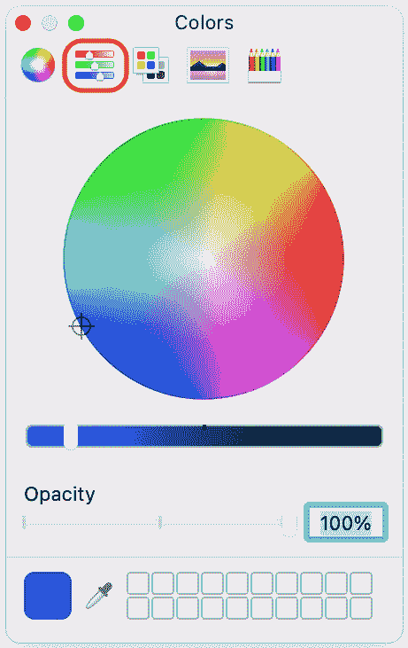

# 第九章：*第九章*：设置用户界面

在本书的*第一部分*中，你学习了 Swift 语言及其工作原理。现在你对这门语言有了很好的了解，你可以学习如何开发 iOS 应用。在本部分，你将构建一个餐厅预订应用*Let's Eat*的用户界面。你将使用 Xcode 的**Interface Builder**，并将编码保持到最小。

你将从这个章节开始学习 iOS 应用开发中使用的有用术语，这些术语在本书中被广泛使用。接下来，你将浏览*Let's Eat*应用中使用的屏幕，并学习用户如何使用该应用。最后，你将开始使用 Interface Builder 重新创建应用的 UI，从**标签栏**开始，允许用户在**探索**和**地图**屏幕之间进行选择。你将在两个屏幕的顶部添加导航栏。你还将学习如何配置应用启动时显示的**启动**屏幕，以及如何为**启动**屏幕和**标签栏按钮**使用自定义图标。

到本章结束时，你将学习到 iOS 应用开发中常用的术语，了解你的应用流程将如何，以及如何向应用添加资源，以及如何使用 Interface Builder 添加、配置和定位 UI 元素。

以下内容将涵盖：

+   学习 iOS 开发中的有用术语

+   浏览*Let's Eat*应用

+   创建新的 Xcode 项目

+   设置标签栏控制器场景

+   设置**启动**屏幕

# 技术要求

在本章中，你将创建一个新的 Xcode 项目，名为`LetsEat`。

本章的资源文件和完成的 Xcode 项目位于本书代码包的`Chapter09`文件夹中，可以在此处下载：

[`github.com/PacktPublishing/iOS-15-Programming-for-Beginners-Sixth-Edition`](https://github.com/PacktPublishing/iOS-15-Programming-for-Beginners-Sixth-Edition)

查看以下视频，看看代码的实际效果：

[`bit.ly/3qcB2kO`](https://bit.ly/3qcB2kO)

在创建项目之前，你将学习一些在 iOS 开发中常用的术语。

# 学习 iOS 开发中的有用术语

当你开始 iOS 应用开发的旅程时，你将遇到特殊的术语和定义。以下是一些最常用的术语和定义。现在先阅读一下。即使你现在可能并不完全理解，但随着你的学习，它们会变得更加清晰：

+   `UIView`类或其子类。你屏幕上看到的一切（按钮、文本字段、标签等）都是一个视图。你将使用视图来构建你的 UI。

+   `UIStackView`类，它是`UIView`的子类。它用于将视图组合成水平或垂直堆叠，这使得它们更容易使用**自动布局**进行定位，这在本节后面将进行描述。

+   `UIViewController` 类。它决定了视图向用户显示的内容，以及用户与视图交互时会发生什么。每个视图控制器都有一个 `view` 属性，其中包含对视图的引用。

+   `UITableViewController` 类，它是 `UIViewController` 类的子类。它的 `view` 属性指向一个 `UITableView` 实例（`UITableViewCell` 实例，**表格视图单元**）。

    *设置*应用以表格视图的形式显示您的设备设置：

图 9.1：设置应用

正如您所看到的，所有不同的设置（**通用**、**辅助功能**、**隐私**等）都在表格视图的表格单元中显示。

+   `UICollectionViewController` 类，它是 `UIViewController` 类的子类。它的 `view` 属性指向一个 `UICollectionView` 实例（`UICollectionViewCell` 实例，**集合视图单元**）。

    *照片*应用以集合视图的形式显示照片：

图 9.2：照片应用

正如您所看到的，缩略图在集合视图的集合视图单元中显示。

+   `UINavigationController` 类，它是 `UIViewController` 类的子类。它有一个 `viewControllers` 属性，包含一个视图控制器数组。数组中最后一个视图控制器的视图显示在屏幕上，同时在屏幕顶部还有一个导航栏。

    *设置*应用中的表格视图控制器嵌入在导航控制器中，您可以看到表格视图上方的导航栏：

图 9.3：设置应用中的导航栏

当您点击设置时，该设置的视图控制器将被添加到分配给 `viewControllers` 属性的视图控制器数组中。用户会看到该视图控制器从右侧滑入。注意屏幕顶部的导航栏，它可以包含标题和按钮。一个 **< 设置** 按钮出现在导航栏的左上角。点击此按钮将返回到上一个屏幕。

+   `UITabBarController` 类，它是 `UIViewController` 类的子类。它有一个 `viewControllers` 属性，包含一个视图控制器数组。数组中第一个视图控制器的视图显示在屏幕上，同时还有一个底部带有按钮的标签栏。最左边的按钮对应于数组中的第一个视图控制器，并且已经被选中。当您点击另一个按钮时，相应的视图控制器将被加载，其视图将显示在屏幕上。

    *照片*应用使用标签栏控制器在屏幕底部显示一行按钮：

图 9.4：照片应用中的标签栏

点击标签栏中的每个按钮将显示不同的屏幕。

+   **模型-视图-控制器 (MVC)**：这是一个在 iOS 应用开发中非常常见的模式。用户与屏幕上的视图进行交互。应用数据存储在数据模型对象中。控制器管理视图和数据模型对象之间的信息流。它将在*第十三章*中详细讨论，*开始使用 MVC 和集合视图*。

+   在*第一章*中创建的 `Exploring Xcode` 项目中，点击 `Main` 故事板文件：

图 9.5：探索 Xcode 项目，显示主故事板文件

你将看到一个场景，当你你在 iOS 模拟器中运行你的应用时，这个场景的内容将显示在屏幕上。你可以在故事板文件中拥有多个场景。

+   `ExploringXcode` 项目在其故事板中只有一个场景，因此没有任何转换，但你将在本章的后续部分看到它们。

+   **自动布局**：作为一名开发者，你必须确保你的应用在不同屏幕尺寸的设备上看起来都很好。自动布局帮助你根据你指定的约束来布局你的用户界面。例如，你可以设置一个约束来确保按钮无论屏幕大小如何都居中显示，或者当设备从纵向旋转到横向时，使文本字段扩展。

现在你已经熟悉了 iOS 应用开发中使用的术语，让我们浏览一下你将要构建的应用。

# 浏览 Let's Eat 应用

让我们快速浏览一下你将要构建的应用。*Let's Eat* 应用是一个餐厅应用，允许用户探索按菜系分类的餐厅列表或查看显示特定区域内所有餐厅的地图。你将在下一节中看到应用中使用的所有屏幕及其整体流程。

小贴士

你可以通过这个链接看到这个应用浏览的视频版本：[`bit.ly/3G0Pv7U`](https://bit.ly/3G0Pv7U)。

## 使用探索屏幕

当应用启动时，你会看到**探索**屏幕：

图 9.6：探索屏幕

让我们研究这个屏幕的不同部分。

屏幕底部的 `UITabBar` 实例（标签栏）显示包含位于屏幕顶部的**位置**按钮的 `UICollectionReusableView` 实例（部分标题）。

在你选择菜系之前，你必须通过点击**位置**按钮来选择一个位置。

## 使用位置屏幕

当你点击**位置**按钮时，你会看到**位置**屏幕：

图 9.7：位置屏幕

让我们研究这个屏幕的不同部分。

屏幕顶部有一个包含**取消**和**完成**按钮的导航栏。一个表格视图显示表格单元格中的位置列表。

您必须点击一行来选择位置，并点击**完成**按钮来确认。一旦点击**完成**，您将返回到**探索**屏幕，然后可以选择一种菜系。您也可以点击**取消**返回到**探索**屏幕而不选择位置。

## 使用**餐厅列表**屏幕

一旦设置了位置（本例中为**ASPEN, CO**），您可以点击一个菜系。这将显示**餐厅列表**屏幕：

图 9.8：餐厅列表屏幕

让我们研究一下这个屏幕的不同部分。

屏幕顶部的导航栏包含一个**返回**按钮。一个集合视图在该位置显示提供所选菜系的餐厅列表，在集合视图中显示。

您必须点击一个餐厅来查看其详情。您也可以点击**返回**按钮返回到**探索**屏幕而不选择餐厅。

## 使用**餐厅详情**屏幕

点击**餐厅列表**屏幕上的餐厅会显示该餐厅在**餐厅详情**屏幕上的详细信息：

图 9.9：餐厅详情屏幕

让我们研究一下这个屏幕的不同部分。

屏幕顶部的导航栏包含一个显示位置（本例中为**ASPEN, CO**）的按钮。一个表格视图在表格视图中显示餐厅的位置、评分、顾客评论、照片评论和位置地图。

您可以点击**ASPEN, CO**按钮返回到**餐厅列表**屏幕，或点击**添加评论**或**添加照片**按钮来显示**评论表单**或**照片滤镜**屏幕。

## 使用**查看表单**屏幕

点击**添加评论**按钮会显示**评论表单**屏幕：

图 9.10：评论表单屏幕

让我们研究一下这个屏幕的不同部分。

屏幕顶部的导航栏包含**取消**和**保存**按钮。一个表格视图在表格视图中显示评分和文本字段。

您可以在该屏幕上为餐厅设置评分并撰写评论。然后，您可以点击**保存**按钮来保存您的评分和评论，或点击**取消**按钮不保存直接返回**餐厅详情**屏幕。

## 使用**照片滤镜**屏幕

点击**添加照片**按钮会显示**照片滤镜**屏幕：

图 9.11：照片滤镜屏幕

让我们研究一下这个屏幕的不同部分。

屏幕顶部的导航栏包含**取消**、**相机**和**保存**按钮。一个图像视图显示一张图片，一个集合视图在集合视图中显示照片滤镜。

您可以在该屏幕上选择一张图片并对其应用滤镜。然后，您可以点击**保存**按钮来保存您的图片，或点击**取消**按钮不保存直接返回**餐厅详情**屏幕。

## 使用**地图**屏幕

点击标签栏中的 **地图** 按钮将显示 **地图** 屏幕：

图 9.12：地图屏幕

让我们研究这个屏幕的不同部分。

屏幕底部的一个标签栏显示 `MKMapView` 实例（地图视图），在屏幕上显示地图，并用图钉指示餐厅位置。

点击一个图钉将显示一个注释，点击注释中的按钮将显示该餐厅的 **餐厅详情** 屏幕。

这完成了应用的浏览。现在，是时候开始构建您应用的 UI 了！

# 创建一个新的 Xcode 项目

既然您已经知道了应用屏幕的样式，您就可以开始构建您的应用了。让我们先创建一个新的项目。这与您在 *第一章*，*熟悉 Xcode* 中创建 `ExploringXcode` 项目所使用的相同过程。按照以下步骤操作：

1.  启动 Xcode 并点击 **创建一个新的 Xcode 项目**。

1.  **iOS** 应已选中。选择 **App** 并点击 **下一步**。

1.  `LetsEat`

    `com.` 后跟您的名字

    `Storyboard`

    将其余设置保留为默认值。点击 **下一步**。

1.  选择一个位置来保存您的项目并点击 **创建**。

1.  您将使用 iPhone SE (第 2 代) iOS 模拟器作为测试设备。在 **方案** 菜单中，选择 **iPhone SE (第 2 代**) 模拟器。

构建并运行您的应用。您将看到一个空白白色屏幕。如果您在项目导航器中点击 `Main` 故事板文件，您将看到它包含一个包含空白视图的单个场景。这就是为什么您运行应用时只看到一个空白白色屏幕的原因。

要配置 UI，您将使用 Interface Builder 修改 `Main` 故事板文件。Interface Builder 允许您添加和配置场景。每个场景代表用户将看到的屏幕。您可以将 UI 对象，如视图和按钮，添加到场景中，并使用 **属性检查器** 配置它们。

重要信息

有关如何使用 Interface Builder 的更多信息，请访问此链接：[`help.apple.com/xcode/mac/current/#/dev31645f17f`](https://help.apple.com/xcode/mac/current/#/dev31645f17f)。

现在您已经创建了项目，您将向其中添加一个标签栏控制器场景。这个场景在屏幕底部显示一个标签栏，其中包含两个标签。点击一个标签将显示与之关联的屏幕。这些屏幕对应于应用浏览中显示的 **探索** 和 **地图** 屏幕。让我们在下一节中看看如何做到这一点。

# 设置标签栏控制器场景

如您在应用浏览中看到的，*Let's Eat* 应用在屏幕底部有一个标签栏，其中包含两个按钮，用于显示 `ViewController` Swift 文件，并将带有两个按钮的标签栏控制器场景添加到项目中。按照以下步骤操作：

1.  在项目导航器中点击 `Main` 故事板文件：

    图 9.14：项目导航器，已选择主故事板文件

1.  `Main`故事板文件的内容出现在编辑区域。如果存在，点击文档大纲按钮以折叠文档大纲。这为你提供了更多的工作空间：

    图 9.15：显示文档大纲按钮的编辑区域

1.  点击**+**按钮打开**库**：

    图 9.16：显示库按钮的工具栏

    库允许你选择要添加到场景中的 UI 对象。

1.  在过滤器字段中输入`tabbar`。一个**Tab Bar Controller**对象将出现在结果列表中：

    图 9.17：选中标签栏控制器对象的库

1.  将**Tab Bar Controller**对象拖动到故事板中，以添加一个新的标签栏控制器场景。如果它覆盖了现有的视图控制器场景，那也是可以的。你可以看到它由一个场景组成，其中包含两个箭头，代表通向两个更多场景的转换：

    图 9.18：添加了标签栏控制器场景的主故事板文件

1.  点击**-**按钮以缩小视图，并重新排列故事板中的场景，以便标签栏控制器场景和视图控制器场景都可见：

    图 9.19：显示缩小按钮的编辑区域

1.  按照所示选择指向视图控制器场景的箭头。这个箭头决定了你的应用的初始视图控制器场景，使得应用启动时视图出现：

    图 9.20：编辑区域，箭头显示初始视图控制器场景

1.  按照所示，从视图控制器场景拖动箭头到标签栏控制器场景。这使得标签栏控制器场景成为初始场景，当你启动应用时会出现标签栏：

    图 9.21：编辑区域，标签栏控制器场景作为初始视图控制器

    小贴士

    你也可以通过选择它，点击属性检查器按钮，并勾选**is Initial View Controller**复选框，将标签栏控制器场景设置为初始视图控制器场景。你将在下一节中了解更多关于属性检查器的内容。

1.  在故事板中选择现有的视图控制器场景，然后在键盘上按*Delete*键将其删除，因为你不会在这个项目中使用它。

1.  在项目导航器中选择`ViewController`文件，然后在键盘上按*Delete*键将其删除，因为您不会在这个项目中使用它：

    图 9.22：项目导航器显示要删除的文件

1.  点击弹出的对话框中的**移动到废纸篓**：

图 9.23：移动到废纸篓对话框

在 iOS 模拟器中构建并运行您的应用，您将在屏幕底部看到带有两个按钮的标签栏：

图 9.24：iOS 模拟器显示带有两个按钮的标签栏

您已成功将标签栏添加到项目中，但如您所见，按钮标题目前为**项目 1**和**项目 2**。您将在下一节中将它们更改为**探索**和**地图**。

## 设置标签栏按钮的标题

您的应用现在在屏幕底部显示了一个标签栏，但按钮标题与应用导览中显示的不匹配。为了使它们匹配，您将在属性检查器中将按钮标题配置为**探索**和**地图**。按照以下步骤操作：

1.  在项目导航器中点击`Main`故事板文件。点击文档大纲按钮以显示文档大纲。在文档大纲中点击**项目 1 场景**：

    图 9.25：文档大纲显示选中的项目 1 场景

1.  点击**项目 1 场景**下的**项目 1**按钮。点击属性检查器按钮：

    图 9.26：属性检查器被选中

1.  在`探索`下：

    图 9.27：属性检查器标题设置为探索

1.  点击`地图`：

图 9.28：属性检查器标题设置为地图

在模拟器中构建并运行您的应用。您会看到按钮的标题已分别更改为**探索**和**地图**。太棒了！

点击**探索**和**地图**按钮将显示**探索**和**地图**屏幕的场景。如应用导览所示，如果您在**探索**屏幕上点击**位置**按钮，您将在**位置**屏幕的顶部看到一个包含**取消**和**完成**按钮的导航栏。您还会在**地图**屏幕的顶部看到一个空白的导航栏。如您在应用导览中所见，一些屏幕在导航栏中有标题和按钮。在下一节中，您将学习如何向您的屏幕添加导航栏，这样您就可以根据需要稍后添加按钮和标题。

## 在导航控制器中嵌入视图控制器

正如您在应用游览中看到的，**探索** 和 **地图** 屏幕在屏幕顶部都有一个导航栏。要为两个屏幕添加导航栏，您需要将 **探索** 和 **地图** 场景的视图控制器嵌入到导航控制器中。这将使得当 **探索** 和 **地图** 屏幕显示时，导航栏会出现在屏幕顶部。按照以下步骤操作：

1.  在文档大纲中点击 **探索场景**：

    图 9.29：已选择探索场景的文档大纲

1.  选择 **编辑器** | **嵌入** | **导航控制器**：

    图 9.30：已选择嵌入 | 导航控制器的编辑器菜单

1.  一个导航控制器场景出现在 **标签栏控制器场景** 和 **探索场景** 之间：

图 9.31：显示已添加导航控制器场景的编辑区域

构建并运行您的应用。现在 **探索** 屏幕上有一个导航栏，但由于它与背景颜色相同，所以在屏幕上不明显。

在导航控制器中嵌入视图控制器会将该视图控制器添加到导航控制器的 `viewControllers` 数组中。然后导航控制器在屏幕上显示视图控制器的视图。导航控制器还会在屏幕顶部显示导航栏。

**地图** 屏幕目前还没有导航栏。现在让我们添加一个。按照以下步骤操作：

1.  在文档大纲中点击 **地图场景**：

    图 9.32：已选择地图场景的文档大纲

1.  选择 **编辑器** | **嵌入** | **导航控制器**。

1.  一个导航控制器场景出现在 **标签栏控制器场景** 和 **地图场景** 之间：

图 9.33：显示已添加导航控制器场景的编辑区域

构建并运行您的应用。现在探索和地图屏幕都有导航栏，尽管您现在看不到它们。

标签栏按钮可以在 **探索** 和 **地图** 屏幕之间切换，并且每个屏幕现在都有一个导航栏。按钮标题是正确的，但按钮本身没有图标。要获取按钮图标，您将在下一节中添加包含项目所需所有图形资源的文件。

## 添加 Assets.xcassets 文件

`Assets.xcassets` 文件包含项目资源，例如应用图标和自定义图片。由于您刚刚创建了此项目，它目前是空的。如果您还没有这样做，您需要从以下链接下载 `Assets.xcassets` 文件（它包含 *Let's Eat* 应用程序的所有资源）：

[`github.com/PacktPublishing/iOS-15-Programming-for-Beginners-Sixth-Edition`](https://github.com/PacktPublishing/iOS-15-Programming-for-Beginners-Sixth-Edition)

下载文件后，您可以按照以下步骤将其添加到项目中：

1.  您必须从项目中删除现有的 `Assets.xcassets` 文件（在项目导航器中显示为**Assets**），选择它并在项目导航器中按 *Delete* 键删除：

    图 9.34：项目导航器显示要删除的文件

1.  在弹出的对话框中点击**移动到废纸篓**。

1.  打开您下载的代码包文件中的 `Chapter09` 文件夹。您将看到其中的 `Assets.xcassets`：

    图 9.35：下载的代码包中的 Assets.xcassets 文件

1.  将新的 `Assets.xcassets` 文件拖动到项目导航器区域。将出现**选择添加这些文件的选项**对话框。勾选**如果需要则复制项目**复选框。勾选**创建组**单选按钮。将其他设置保留为默认值。点击**完成**：

    图 9.36：选择添加这些文件的选项对话框

1.  `Assets.xcassets` 文件已添加到您的项目中。请注意，它在项目导航器中显示为 `Assets`。点击它以查看其内容：

图 9.37：已选择 Assets.xcassets 的项目导航器

包含在图形资源中的图标包括标签栏按钮的图标。您将在下一节中添加**探索**和**地图**按钮的图标。

## 添加探索和地图按钮的图标

`Assets.xcassets` 文件夹。按照以下步骤将它们添加到按钮中：

1.  点击 `Main` 故事板文件。在文档大纲中的**探索场景**下点击**探索**按钮。点击属性检查器按钮：

    图 9.38：已选择的探索按钮的属性检查器

1.  在 `icon-explore-on` 下：

    图 9.39：属性检查器中图像设置为 icon-explore-on

1.  点击 `icon-map-on`：

图 9.40：属性检查器中图像设置为 icon-map-on

构建并运行您的应用。您现在可以看到探索和地图按钮现在有了图标：

图 9.41：iOS 模拟器显示带有图标的探索和地图按钮

恭喜！您刚刚已为您应用配置了标签栏！

当你的应用启动时，你可能会在看到标签栏之前短暂地看到一个白色屏幕。这个屏幕被称为**启动**屏幕，当你的应用启动时会短暂显示。你将在下一节学习如何配置这个屏幕以显示自定义颜色和应用程序徽标。

# 设置启动屏幕

你项目中的`LaunchScreen`故事板文件。当你创建 Xcode 项目时，此文件会自动创建。

你将为这个屏幕创建一个新的自定义颜色，从`Assets.xcassets`文件夹中添加一个图标，并使用自动布局约束设置图标的定位。

重要信息

有关自动布局及其使用方法的更多信息，请参阅此链接：[`developer.apple.com/library/archive/documentation/UserExperience/Conceptual/AutolayoutPG/`](https://developer.apple.com/library/archive/documentation/UserExperience/Conceptual/AutolayoutPG/).

你将在下一节创建一个新的自定义颜色。

## 配置启动屏幕的背景颜色

属性检查器可以用来修改屏幕上 UI 元素的颜色。你可以通过使用自定义的红色、绿色和蓝色值来指定你想要的精确颜色。你将通过以下步骤为启动屏幕设置自定义颜色：

1.  在你的项目导航器中点击`Launchscreen`故事板文件：

    图 9.42：选择 LaunchScreen 故事板的项目导航器

1.  在文档大纲中选择**视图**。点击属性检查器按钮。在**视图**下，点击**背景**弹出菜单：

    图 9.43：选择背景属性的属性检查器

1.  从弹出菜单中选择**自定义...**：

    图 9.44：选择自定义...的背景弹出菜单

1.  在颜色选择器中，选择第二个标签（带有三个滑块的标签）：

    图 9.45：选择第二个标签的颜色选择器

1.  在**十六进制颜色** # 框中选中`4A4A4A`：

图 9.46：显示十六进制颜色#设置为 4A4A4A 的颜色选择器

颜色由红色、绿色和蓝色组成。每种颜色的值范围从`0`到`255`。这个十六进制值将红色、绿色和蓝色值设置为`74`，从而得到一种令人愉悦的深灰色。

构建并运行你的应用。你应该在标签栏出现之前短暂地看到一个深灰色屏幕。酷！

在下一节中，你将为这个屏幕添加一个徽标，并使用自动布局约束将其定位在屏幕的精确中心，无论设备类型和方向如何。添加徽标会告知用户应用正在启动，这是让你的应用看起来不错的一种方式。

## 将 logo 和约束添加到启动屏幕

你之前添加到项目中的`Assets.xcassets`文件。你还将使用自动布局约束将 logo 放置在屏幕中央。按照以下步骤操作：

1.  在项目导航器中应仍然选择`LaunchScreen`故事板文件。点击**+**按钮以显示库：

    图 9.47：显示库按钮的工具栏

1.  点击媒体按钮以显示项目中所有的图形文件：

    图 9.48：选择媒体按钮的库

1.  在过滤器字段中输入`detail`。你将在结果中看到`detail-logo`：

    图 9.49：选择 detail-logo 的库

1.  将`detail-logo`拖动到你的视图控制器场景的视图中，并垂直和水平居中。你会看到蓝色辅助线来帮助你。完成操作后，点击自动布局对齐按钮：

    图 9.50：添加了 logo 的 Launchscreen 故事板视图控制器场景

    小贴士

    如果你没有看到自动布局对齐按钮，请点击工具栏中的检查器按钮以隐藏检查器区域。

1.  选择**在容器中水平对齐**和**在容器中垂直对齐**。点击**添加 2 个约束**：

    图 9.51：自动布局对齐弹出对话框

1.  约束已添加到`detail-logo`，并在文档大纲中可见：

图 9.52：显示 logo 约束的文档大纲

约束的作用是指定 logo 相对于视图控制器视图的位置。在这个例子中，视图控制器视图是容器。**在容器中水平对齐**计算 logo 相对于容器的左右边的水平位置，而**在容器中垂直对齐**计算 logo 相对于容器的顶部和底部的垂直位置。

构建并运行你的应用。你将在屏幕中间看到 logo。即使你在 iOS 模拟器中尝试以不同的屏幕尺寸运行应用，logo 仍然会位于屏幕的精确中心。

恭喜！你已经成功配置了你的应用**启动**屏幕！

你可能已经注意到，在 Interface Builder 中表示的屏幕与你在 iOS 模拟器中选择的 iPhone 型号不匹配，你可能会发现最小图显示会妨碍你在应用中排列屏幕。让我们对 Interface Builder 进行一些额外的配置以修复这个问题。

## 配置 Interface Builder

即使您已将 iPhone SE（第二代）配置为您的应用程序的 iOS 模拟器，您可能会发现 Interface Builder 中显示的场景是为不同的 iPhone 型号。您还可能希望隐藏最小地图显示。让我们配置 Interface Builder 以使用 iPhone SE（第二代）的屏幕并隐藏最小地图显示。按照以下步骤操作：

1.  应仍然选择`Launchscreen`故事板文件。要配置 Interface Builder，请单击设备配置按钮：

    图 9.53：显示设备配置按钮的编辑区域

1.  将出现显示不同设备屏幕的弹出窗口：

    图 9.54：带有设备弹出窗口的编辑区域

    注意已选择**iPhone 11**。

1.  从此弹出窗口中选择**iPhone SE (第二代)**：

    图 9.55：显示为 iPhone SE（第二代）选择的设备弹出窗口

1.  在设备弹出窗口中设置 iPhone SE（第二代）后，请注意场景已更改以反映 iPhone SE（第二代）的屏幕。标志仍然位于**启动**屏幕的**精确中心**：

    图 9.56：显示为 iPhone SE（第二代）选择的设备配置按钮

1.  在项目导航器中单击`Main`故事板文件。在此处配置故事板以使用 iPhone SE（第二代）：

    图 9.57：显示为`Main`故事板文件选择 iPhone SE（第二代）的设备配置按钮

1.  如果您想隐藏最小地图，请从 Xcode 菜单栏中选择**编辑器** | **最小地图**以取消选中它：

    图 9.58：显示 Canvas | 最小地图已选中的编辑器菜单

1.  确认您在`Main`故事板文件中有以下场景：

图 9.59：显示完成的主故事板文件的编辑区域

构建并运行您的应用程序。它应该像之前一样工作。

您已经为您的应用程序创建了**探索**和**地图**屏幕！做得好！

# 摘要

在本章中，您学习了 iOS 应用程序开发中使用的某些有用术语。这将使您更容易理解本书的其余部分，以及有关该主题的其他书籍或在线资源。

接下来，你还学习了*让我们吃饭*应用中使用的不同屏幕以及用户如何使用该应用。当你从头开始重新创建应用的用户界面时，你将能够将你所做的工作与实际应用的外观进行比较。

最后，你学习了如何使用界面构建器和故事板将标签栏控制器场景添加到你的应用中，配置按钮标题，并为包含项目中所需所有图形文件的`Assets.xcassets`文件配置导航栏。你还配置了自定义标签栏按钮图标，并使用自定义颜色和图标配置了应用的**启动**屏幕。这将使你熟悉为你的应用添加 UI 元素、配置它们以及设置它们的约束。

在下一章中，你将继续设置你应用的用户界面，并熟悉更多的 UI 元素。你将配置**探索**屏幕以显示一个展示集合视图和集合视图单元格的集合视图，以及一个包含按钮的集合视图部分标题，当按钮被点击时，会显示另一个视图。
