# 第十章：*第十章*：构建您的用户界面

在上一章中，您创建了一个新的 Xcode 项目，向您的应用添加了一个标签栏，允许用户在包含您的应用资源的`Assets.xcassets`文件和修改应用的自定义颜色和图标之间进行选择。当您的应用启动时，您应该会看到**启动**屏幕短暂显示。之后，**探索**屏幕将显示，但目前它是空的。

如您在*第九章*的“设置用户界面”应用浏览中看到的那样，**探索**屏幕应显示一个集合视图，显示一系列在集合视图单元格中的菜系，以及包含一个**位置**按钮的集合视图部分标题。点击**位置**按钮应显示一个包含位置列表的**位置**屏幕。

在本章中，您将使**探索**屏幕显示一个包含 20 个空**集合视图单元格**的**集合视图**，以及一个包含一个按钮的**集合视图部分标题**，当点击该按钮时，将显示表示**位置**屏幕的视图。您还将配置一个**取消**按钮来关闭此视图并返回到**探索**屏幕。

您将在您的应用中添加少量代码，但不必过于担心这一点——您将在本书的下一部分了解更多关于它的内容。

到本章结束时，您将学会如何将视图控制器添加到故事板场景中，将视图控制器中的出口链接到场景，设置集合视图单元格和集合视图部分标题，以及以模态方式呈现视图控制器。

在本章中，您将涵盖以下主题：

+   在**探索**屏幕中添加集合视图

+   将故事板元素连接到视图控制器中的出口

+   配置集合视图的数据源方法

+   向集合视图中添加集合视图部分标题

+   配置故事板元素大小

+   以模态方式呈现视图

# 技术要求

您将继续在上一章中创建的`LetsEat`项目中工作。

本章完成的 Xcode 项目位于本书代码包的`Chapter10`文件夹中，可在此处下载：

[`github.com/PacktPublishing/iOS-15-Programming-for-Beginners-Sixth-Edition`](https://github.com/PacktPublishing/iOS-15-Programming-for-Beginners-Sixth-Edition)

查看以下视频以查看代码的实际效果：

[`bit.ly/3kjIKFQ`](https://bit.ly/3kjIKFQ)

让我们从向**探索**场景添加集合视图开始，这将最终显示菜系列表和**位置**按钮。

# 在探索屏幕中添加集合视图

收集视图是`UICollectionView`类的实例。类似于电子表格程序，它显示一个单元格网格。收集视图中的每个单元格都是一个收集视图单元格，它是`UICollectionViewCell`类的实例。您将首先将收集视图添加到`Main`故事板文件的视图控制器场景中，然后添加自动布局约束使其填满屏幕。

重要信息

有关自动布局及其使用方法的更多信息，请访问[`developer.apple.com/library/archive/documentation/UserExperience/Conceptual/AutolayoutPG/`](https://developer.apple.com/library/archive/documentation/UserExperience/Conceptual/AutolayoutPG/)。

打开上一章中创建的`LetsEat`项目并运行应用程序，以确保一切仍然按预期工作，然后按照以下步骤操作：

1.  在项目导航器中点击`Main`故事板文件，然后点击“库”按钮：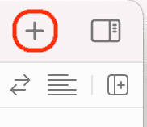

    图 10.1：显示库按钮的工具栏

1.  程序库将出现。确保已选择“对象”按钮，然后在过滤器字段中输入`collec`。一个**收集视图**对象将作为结果之一出现。将其拖动到**探索**屏幕的**视图控制器场景**视图的中间：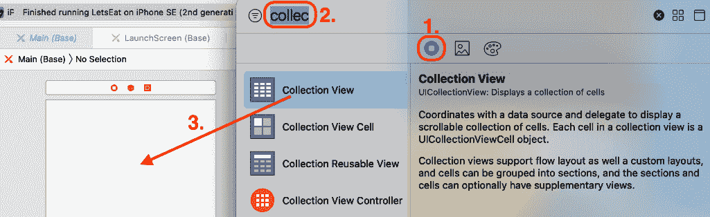

    图 10.2：已选择收集视图对象的程序库

    已添加收集视图（包含一个原型单元格），但它只占据了屏幕的一小部分。如前一章的应用程序游览中所示，它应该填满屏幕。

1.  您将使用“自动布局添加新约束”按钮将收集视图的边缘绑定到其包含视图的边缘。确保已选择收集视图。点击“自动布局添加新约束”按钮：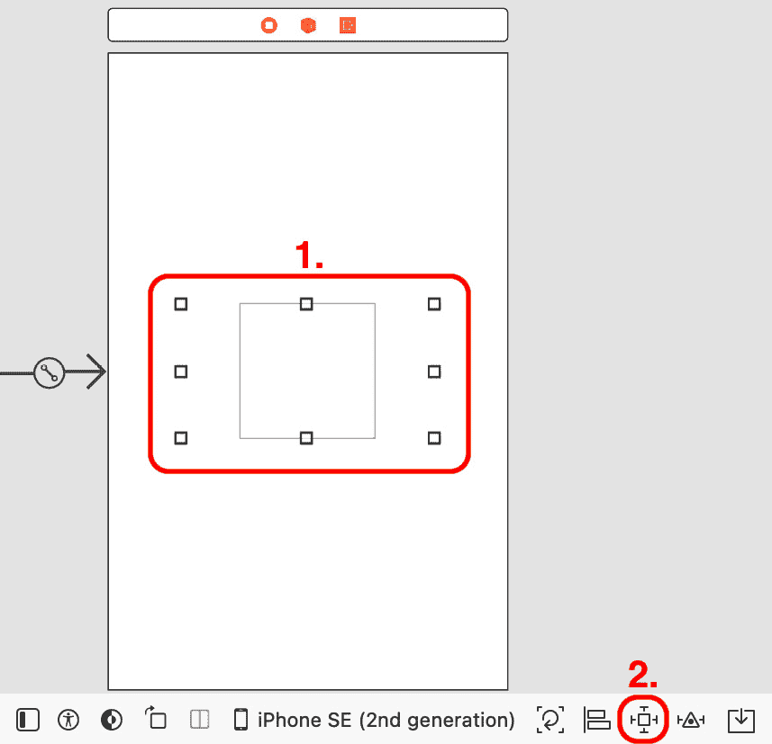

    图 10.3：已选择收集视图的视图控制器场景

1.  在顶部、左侧、右侧和底部边缘约束字段中输入`0`，然后点击所有浅红色支柱。确保所有支柱都已变为亮红色。点击`0`，将收集视图的边缘绑定到包含视图的边缘。现在，收集视图将填满屏幕，无论设备类型和方向如何。

1.  确认收集视图的四面现在都已绑定到屏幕的边缘，如图所示：

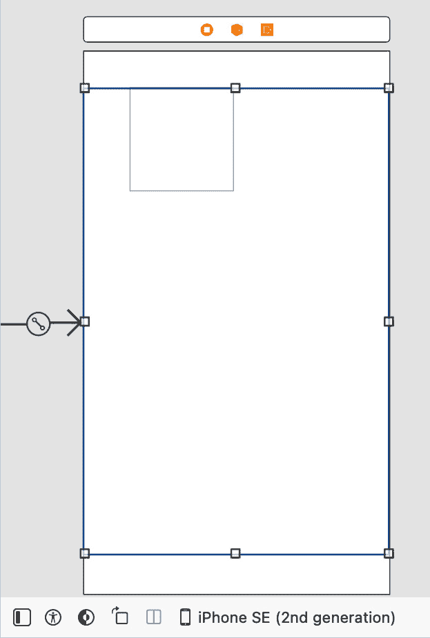

图 10.5：已填满屏幕的收集视图的视图控制器场景

您已将收集视图添加到**探索**屏幕的视图控制器场景视图中，并使用自动布局约束使其填满屏幕，但运行应用程序时**探索**屏幕仍然为空。

在下一节中，你将添加一个`ExploreViewController`类，并将在这个类中连接出口到`ExploreViewController`类中的 UI 元素，以控制**Explore**屏幕显示的内容。

# 将故事板元素连接到视图控制器中的出口

你已经在该文件中的`UIViewController`子类中添加了一个集合视图，并将 UI 元素连接到`UIViewController`子类。

重要信息

在*第十三章*“开始使用 MVC 和集合视图”中，将更详细地解释模型-视图-控制器设计模式和集合视图控制器。

让我们先向项目中添加一个 Cocoa Touch 类文件，这样你就可以在下一节中声明和定义一个`UIViewController`子类。

## 向项目中添加 Cocoa Touch 类文件

**Cocoa Touch**是用于构建 iOS、iPadOS、watchOS 和 tvOS 应用的开发环境。Cocoa Touch 类文件使你能够轻松实现任何 Cocoa Touch 类或子类。它包含基于你在创建时指定的超类的样板代码。你将在本节中将 Cocoa Touch 类文件添加到你的项目中。

首先，你将在项目中创建一个新的`Explore`组以保持事物有序。接下来，你将创建并添加一个名为`ExploreViewController`的 Cocoa Touch 类文件到这个组。你将在该文件中声明和定义一个名为`ExploreViewController`的`UIViewController`类子类，并将这个类的实例设置为**Explore**屏幕的视图控制器。你将向这个类添加属性和方法来管理你在上一节中添加的集合视图。按照以下步骤操作：

1.  在项目导航器中右键点击`LetsEat`组，然后选择**新建组**。

1.  组的名称将被突出显示。完成更改后，按键盘上的*Return*键：![Figure 10.6: 已选择 Explore 组的项目导航器

    ![img/Figure_10.06_B17469.jpg]

    图 10.6：已选择 Explore 组的项目导航器

    如果你犯了错误，请再按一次*Return*键。这将使字段可编辑，以便你可以更改名称。

1.  在项目导航器中右键点击`Explore`组，然后选择**新建文件...**。

1.  **iOS**应该已经选中。选择**Cocoa Touch Class**并点击**下一步**：![Figure 10.7: 选择新文件的模板屏幕

    ![img/Figure_10.07_B17469.jpg]

    图 10.7：选择新文件的模板屏幕

1.  **选择新文件选项**屏幕将出现：![Figure 10.8: 选择新文件选项屏幕

    ![img/Figure_10.08_B17469.jpg]

    图 10.8：选择新文件选项屏幕

1.  在`ExploreViewController`中输入以下内容

    `UIViewController`

    点击**下一步**。

1.  点击`ExploreViewController`文件已添加到项目中的`Explore`文件夹内的项目导航器中。在编辑区域中查看代码。注意，`ExploreViewController`是`UIViewController`的子类，这意味着它从`UIViewController`类继承属性和方法。在类定义中有一个方法，即`viewDidLoad()`，但现在不会使用它。

1.  从`ExploreViewController`文件中的`viewDidLoad()`类之后删除注释代码，使其看起来像这样：

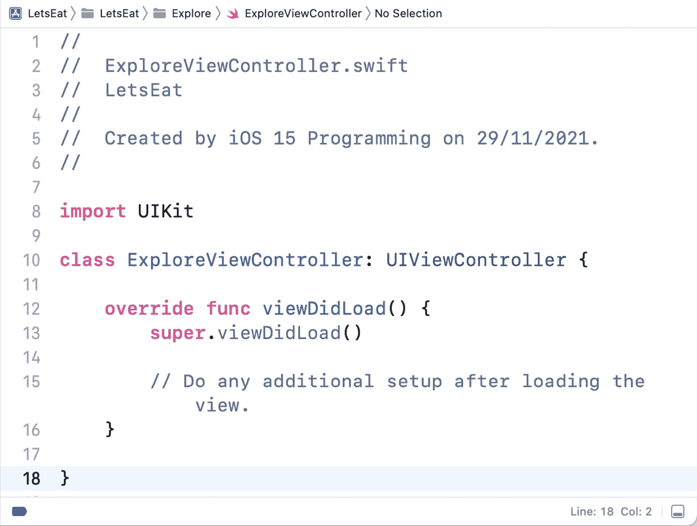

图 10.9：显示 ExploreViewController.swift 内容的编辑区域

你刚刚将包含`ExploreViewController`类声明和定义的`ExploreViewController`文件添加到你的应用程序中。

下一步是将`ExploreViewController`类分配为**探索**屏幕的视图控制器身份，并为之前添加到视图控制器场景中的集合视图分配一个**出口**。你将在下一节中看到如何完成这个操作。

## 将故事板元素连接到视图控制器

让我们回顾一下你现在所在的位置。在`Main`故事板文件中，你有一个`ExploreViewController`文件的视图控制器场景，你有一个声明和定义`ExploreViewController`类的代码。

当你运行应用程序并启用你管理集合视图显示时，你需要将`ExploreViewController`类分配为`Explore`屏幕视图控制器的身份。按照以下步骤操作：

1.  在项目导航器中点击`Main`故事板文件。确保已选择**探索**屏幕的**视图控制器场景**。在文档大纲中点击**视图控制器**图标，然后点击标识符检查器按钮：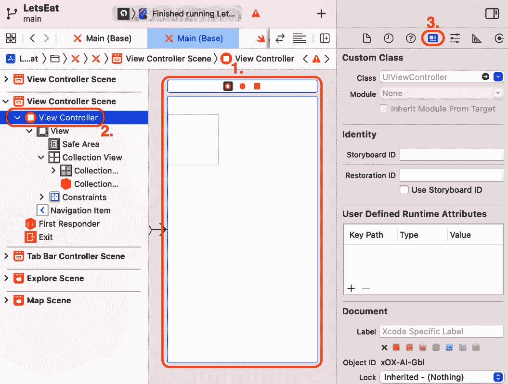

    图 10.10：已选择标识符检查器

1.  在`ExploreViewController`下：

    图 10.11：将类设置为 ExploreViewController 的标识符检查器

    当你运行应用程序时，这会创建一个`ExploreViewController`实例作为该场景的视图控制器。请注意，场景名称已从**视图控制器场景**更改为**探索视图控制器场景**。

    现在让我们为集合视图创建出口。

1.  点击导航器和检查器按钮以隐藏导航器和检查器区域，以便你有更多空间工作：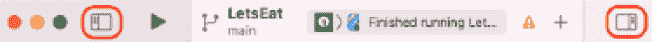

    图 10.12：显示导航器和检查器按钮的工具栏

1.  点击调整编辑器选项按钮：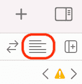

    图 10.13：调整编辑器选项按钮

1.  从弹出菜单中选择**助手**：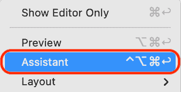

    图 10.14：选择“助手”调整编辑选项菜单

    这将在辅助编辑器中显示与此场景关联的任何 Swift 文件。

1.  如您所见，`Main`故事板文件的内容显示在编辑区域左侧，而`ExploreViewController`类定义显示在右侧。查看代码上方的小条形图。验证`ExploreViewController.swift`是否已选择：![图 10.15：显示已选择`ExploreViewController.swift`的条形图    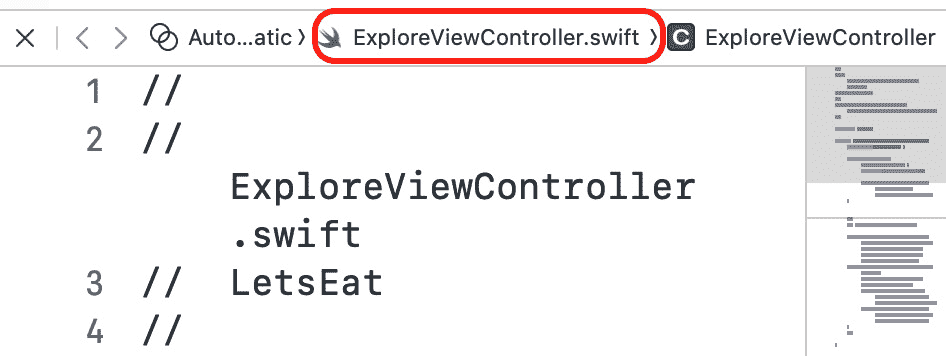

    图 10.15：显示已选择`ExploreViewController.swift`的条形图

1.  如果您没有看到已选择`ExploreViewController.swift`，请单击条形图，并从弹出菜单中选择`ExploreViewController.swift`。

1.  要连接`ExploreViewController`类中的集合视图，*Ctrl* + *拖动*从集合视图到类名声明下方`ExploreViewController`文件：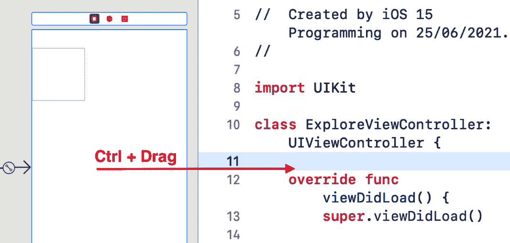

    图 10.16：编辑区域

1.  将会弹出一个小的弹出对话框。在**名称**文本框中输入出口名称`collectionView`，将**存储**设置为**强**，然后单击**连接**：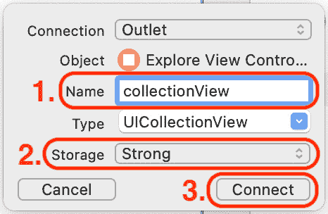

    图 10.17：创建出口的弹出对话框

1.  验证创建`collectionView`出口的代码是否已自动添加到`ExploreViewController`文件中。注意`IBOutlet`关键字，它表示`collectionView`是一个出口。完成此操作后，单击**x**关闭助手编辑器窗口：

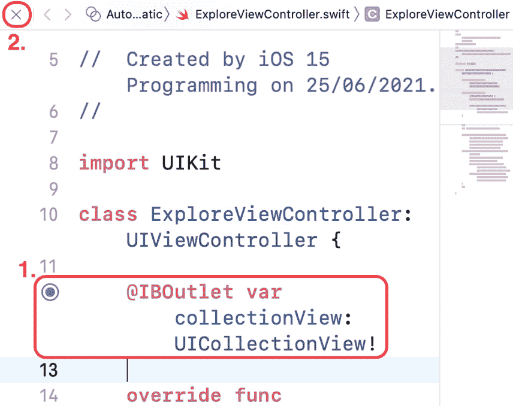

图 10.18：显示 collectionView 出口的编辑区域

现在，`ExploreViewController`类有一个出口，`collectionView`，用于在`ExploreViewController`实例中管理集合视图显示的内容。

在使用*Ctrl + 拖动*从故事板场景中的元素拖动到 Cocoa Touch 类文件时，容易出现错误。如果在这样做时出错，这可能会导致应用程序启动时崩溃。要检查集合视图和`ExploreViewController`类之间的连接是否存在错误，请按照以下步骤操作：

1.  点击导航器和检查器按钮以显示导航器和检查器区域。

1.  在**出口**部分，将`collectionView`出口连接到集合视图。

1.  如果您看到一个微小的错误图标，请单击**x**断开连接：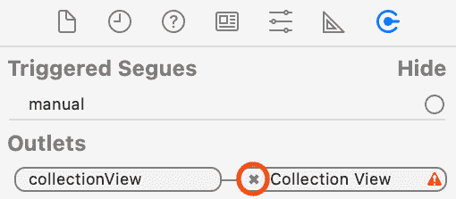

    图 10.20：显示 collectionView 出口的连接检查器

1.  在**出口**下，将`collectionView`出口从**collectionView**拖动回来以重新建立连接：

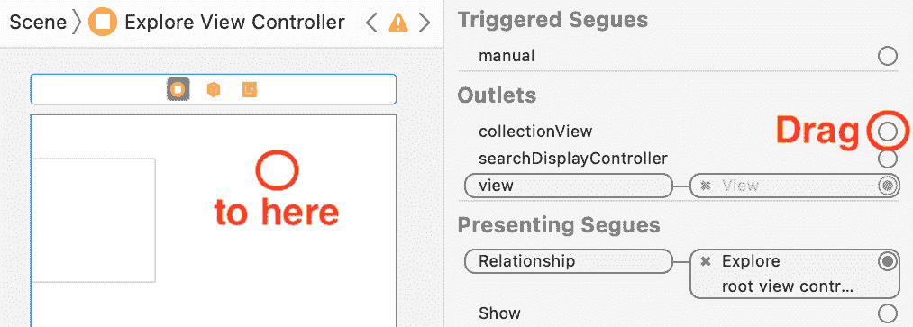

图 10.21：显示要连接的收集视图的编辑区域

到目前为止，你已经将 `ExploreViewController` 类分配为收集视图的 `ExploreViewController` 类的身份。

为了在屏幕上显示收集视图单元格，你需要通过在 `ExploreViewController` 类中添加一些代码来实现收集视图的数据源方法。你将在下一节中这样做。

# 配置用于收集视图的数据源方法

当你的应用运行时，`ExploreViewController` 类的一个实例充当 `UICollectionViewDataSource` 的视图控制器，为此目的。你所需要做的就是将收集视图的 `dataSource` 输出口连接到 `ExploreViewController` 类，并实现该协议的所需方法。

收集视图还需要知道如果用户点击收集视图单元格时应该做什么。同样，收集视图的视图控制器负责此事，苹果为此创建了 `UICollectionViewDelegate` 协议。你将连接收集视图的 `delegate` 输出口到 `ExploreViewController` 类，但你现在不会实现该协议的任何方法。

提示

协议在 *第八章**，协议、扩展和错误处理* 中有所介绍。

你将需要在本章中输入一小段代码。不用担心它的含义；你将在 *第十三章**，MVC 和收集视图入门* 中了解更多关于收集视图控制器及其相关协议的内容。

在下一节中，你将使用连接检查器将收集视图的 `dataSource` 和 `delegate` 输出口分配给 `ExploreViewController` 类。

## 设置收集视图的委托和数据源属性

`ExploreViewController` 类的一个实例将提供收集视图将显示的数据，以及用户与收集视图交互时将执行的方法。你需要将收集视图的 `dataSource` 和 `delegate` 属性连接到 `ExploreViewController` 类的输出口，以便实现这一点。按照以下步骤操作：

1.  如果你还没有这样做，点击导航器和检查器按钮以再次显示导航器和检查器区域。

1.  应该仍然选择 `Main` 故事板文件。点击 `dataSource` 和 `delegate` 输出口。从每个空圆圈拖动到文档大纲中的 **ExploreViewController** 图标：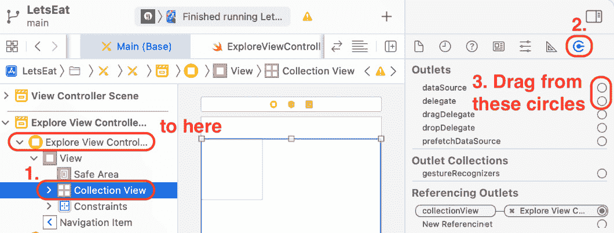

    图 10.22：连接检查器已选择

1.  验证收集视图的 `dataSource` 和 `delegate` 属性是否已连接到 `ExploreViewController` 类的输出口：

![Figure 10.23: 连接检查器已设置数据源和代理输出

![Figure_10.23_B17469.jpg]

Figure 10.23: 连接检查器已设置数据源和代理输出

在下一节中，您将添加一些代码使 `ExploreViewController` 类遵守 `UICollectionViewDataSource` 协议，并在运行您的应用程序时配置集合视图以显示 20 个集合视图单元格。

## 采用 `UICollectionViewDataSource` 和 `UICollectionViewDelegate` 协议

到目前为止，您已使 `ExploreViewController` 类成为集合视图的数据源和代理。下一步是使其采用 `UICollectionViewDataSource` 和 `UICollectionViewDelegate` 协议并实现任何必需的方法。您还将更改集合视图单元格的颜色，以便在屏幕上可见。按照以下步骤操作：

1.  在文档大纲中点击 **Collection View Cell**。这代表集合视图将显示的集合视图单元格。确保属性检查器已选中：![Figure 10.24: 属性检查器已选中

    ![Figure_10.24_B17469.jpg]

    Figure 10.24: 属性检查器已选中

1.  在 `exploreCell` 下按 Return 键。将名称设置为 `Light Gray Color` 以便在运行应用程序时可以看到它们：![Figure 10.25: 属性检查器已设置身份和背景颜色

    ![Figure_10.25_B17469.jpg]

    Figure 10.25: 属性检查器已设置身份和背景颜色

1.  在项目导航器中点击 `ExploreViewController` 文件。在类声明之后输入以下代码，使 `ExploreViewController` 类采用 `UICollectionViewDataSource` 和 `UICollectionViewDelegate` 协议：

    ```swift
    class ExploreViewController: UIViewController, UICollectionViewDataSource, UICollectionViewDelegate {
    ```

    几秒钟后，将出现一个错误。点击它以显示错误信息。

1.  错误信息表示需要使 `ExploreViewController` 类遵守 `UICollectionViewDataSource` 协议。点击 `ExploreViewController` 类。

1.  验证 `UICollectionViewDataSource` 协议的两个必需方法的存根是否已自动插入到 `ExploreViewController` 文件中，如图所示：![Figure 10.26: 显示 `UICollectionViewDataSource` 方法存根的编辑区域

    ![Figure_10.26_B17469.jpg]

    Figure 10.26: 显示 `UICollectionViewDataSource` 方法存根的编辑区域

    第一种方法告诉集合视图显示多少个单元格，而第二种方法告诉集合视图在每个集合视图单元格中显示什么。

1.  将第一个方法中的 `code` 文本替换为 `20`（如果只是一行代码，则 `return` 关键字是可选的）。这告诉集合视图显示 20 个单元格：![Figure 10.27: 显示 20 个单元格的代码编辑区域

    ![Figure_10.27_B17469.jpg]

    Figure 10.27: 显示 20 个单元格的代码编辑区域

1.  将第二个方法中的 `code` 文本替换为以下代码：

    ```swift
    let cell = collectionView.dequeueReusableCell(withReuseIdentifier: "exploreCell", for: indexPath)
    return cell
    ```

    不要担心这对你意味着什么，因为你将在 *第十三章* “开始使用 MVC 和集合视图” 中学习更多关于集合视图的内容。

构建并运行你的应用。你应该看到模拟器显示一个由 20 个浅灰色集合视图单元格组成的网格，如下所示：

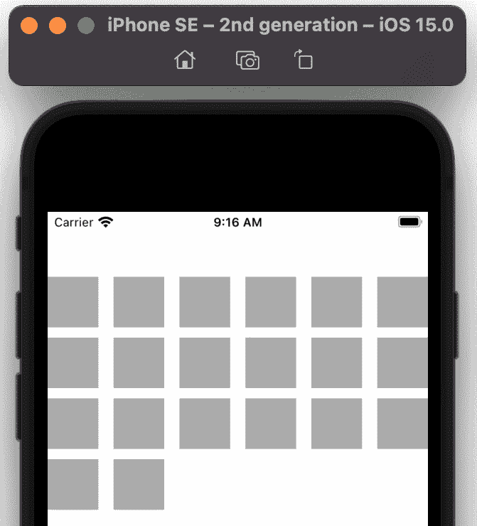

图 10.28：iOS 模拟器显示 20 个集合视图单元格

如你在 *第九章* “设置用户界面” 的应用游览中看到的，屏幕右上角应该有一个**位置**按钮。你将在下一节中启用集合视图的部分标题以容纳此按钮。

# 向集合视图中添加部分标题

集合视图可以配置部分标题和部分页脚。它们都是 `UICollectionReusableView` 类的实例。你将在 **探索** 屏幕中启用集合视图的部分标题，因此你将有一个放置 **位置** 按钮的地方。按照以下步骤操作：

1.  在项目导航器中点击 `Main` 故事板文件，然后在文档大纲中点击 **集合视图**。点击属性检查器按钮。在 **集合视图** 下，勾选 **部分标题** 复选框：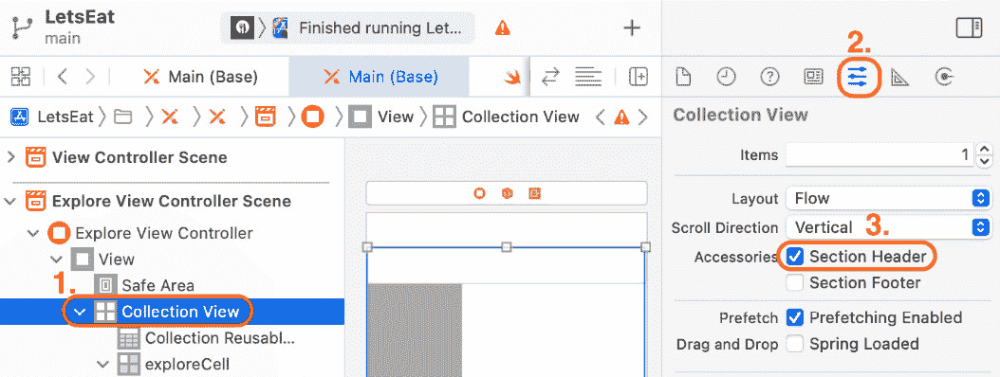

    图 10.29：属性检查器中已勾选部分标题复选框

    这将启用集合视图的部分标题。

1.  注意在完成时按 `header` 并按 *Return*：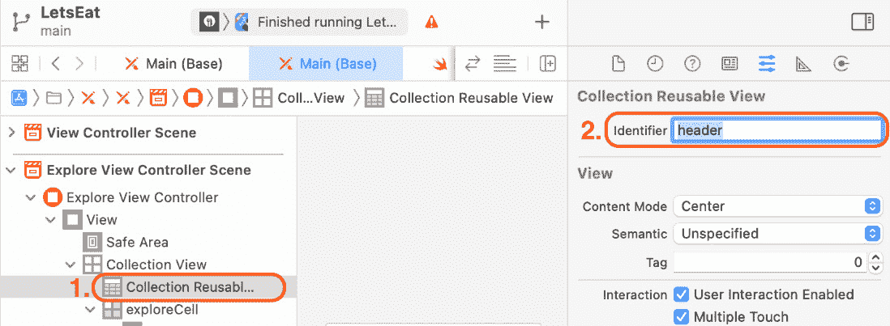

    图 10.30：属性检查器中标识符设置为 header

1.  在项目导航器中点击 `ExploreViewController` 文件。在数据源方法之前，输入以下代码：

    ```swift
    func collectionView(_ collectionView: UICollectionView, viewForSupplementaryElementOfKind kind: String, at indexPath: IndexPath) -> UICollectionReusableView {
       let headerView =
       collectionView.dequeueReusableSupplementaryView(
       ofKind: kind, withReuseIdentifier: "header", 
       for: indexPath)
       return headerView
    }
    ```

    此方法返回具有 `header` 标识符的 `UICollectionReusableView` 实例，你刚刚已配置，它将在屏幕上显示。

构建并运行你的应用。你应该看到集合视图部分标题作为集合视图单元格和导航栏之间的空白区域：

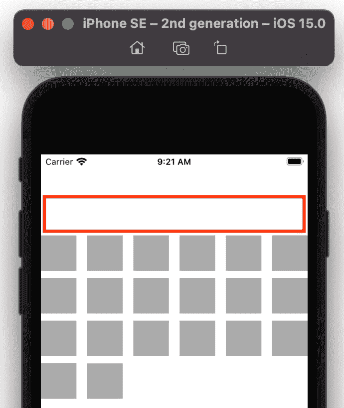

图 10.31：iOS 模拟器显示集合视图部分标题

在你添加 **位置** 按钮之前，你需要增加集合视图部分标题的高度和集合视图单元格的大小，以使它们与在应用游览中显示的 **探索** 屏幕相匹配（参考 *第九章* “设置用户界面”）。你将在下一节中使用 **大小检查器** 设置单元格大小和标题高度。

# 配置故事板元素大小

大小检查器用于更改故事板元素的大小。您将使用它来更改集合视图单元格和集合视图分区标题的大小，以使它们与在*第九章*中应用导游中显示的**探索**屏幕相匹配，*设置用户界面*。请按照以下步骤操作：

1.  在项目导航器中单击`Main`故事板文件，然后在文档大纲中单击**集合视图**。单击大小检查器按钮：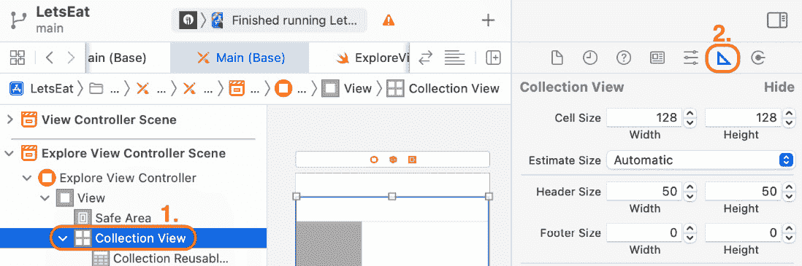

    图 10.32：大小检查器被选中

1.  集合视图大小设置将在大小检查器中显示，如图所示：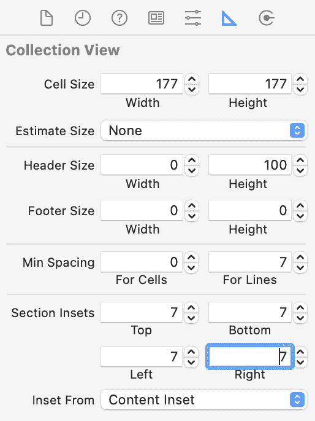

    图 10.33：大小检查器显示集合视图的大小设置

1.  配置集合视图大小设置，如下所示：

    `177`和`177`。

    `0`和`100`。

    `0`和`7`。

    `7`。

在更改每个值后，请记住按*Return*键。

大小检查器中使用的单位是点。每个点可能代表设备屏幕上的一个或多个像素。对于 iPhone SE（第二代），屏幕宽度为 375 点，高度为 667 点，尽管实际屏幕分辨率为 750 x 1,334 像素。

**单元格大小**确定集合视图单元格的大小。**标题大小**确定集合视图分区标题的大小。**最小间距**确定单元格之间的空间。**分区内边距**确定包含单元格的分区与包围视图的侧边之间的空间。这些设置特定于 iPhone SE（第二代）。在*第二十二章*中，*使用 Mac Catalyst 入门*，您将根据设备屏幕的尺寸计算最佳单元格大小。

构建并运行您的应用，您应该看到**探索**屏幕显示 20 个集合视图单元格和一个集合视图分区标题：

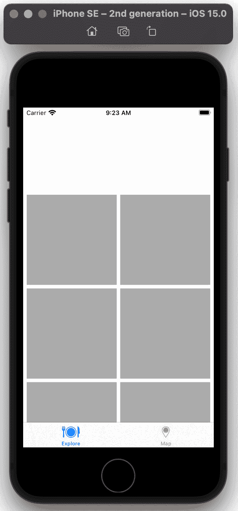

图 10.34：iOS 模拟器显示调整大小的集合视图单元格和分区标题

注意，尽管单元格中没有数据，标题中没有按钮，但它看起来与应用导游中在*第九章**设置用户界面*中显示的**探索**屏幕相似。您将在本书的下一部分配置单元格以显示数据。现在，让我们向集合视图分区标题添加一个按钮，该按钮将用于稍后显示**位置**屏幕。

# 以模态方式呈现视图

在本节中，您将向集合视图部分标题添加一个按钮。当点击时，此按钮将显示一个视图，显示**位置**屏幕。此视图将来自一个嵌入在导航控制器中的新视图控制器场景，您将将其添加到项目中。视图将以模态方式显示，这意味着在它被关闭之前，您将无法执行任何其他操作。要关闭它，您将在视图的导航栏中添加一个**取消**按钮。您还将添加一个**完成**按钮，但您将在*第十七章*“开始使用 JSON 文件”中实现其功能。

让我们从向集合视图标题添加库中的按钮开始。

## 向集合视图标题添加按钮

如*第九章*“设置用户界面”中的应用程序导游所示，屏幕右上角有一个**位置**按钮。您将在集合视图部分标题中添加一个按钮来表示**位置**按钮。按照以下步骤操作：

1.  在项目导航器中单击`Main`故事板文件。确保已选择**探索视图控制器场景**。单击库按钮以显示库：![图 10.35：显示库按钮的工具栏

    ![img/Figure_10.35_B17469.jpg]

    图 10.35：显示库按钮的工具栏

1.  在过滤器字段中输入`button`。一个**按钮**对象将在结果中显示。将按钮拖动到集合视图部分标题：![图 10.36：选择按钮对象的库

    ![img/Figure_10.36_B17469.jpg]

    图 10.36：选择按钮对象的库

1.  将按钮放置在集合视图部分标题的右侧：

![图 10.37：添加了按钮的集合视图部分标题

![img/Figure_10.37_B17469.jpg]

图 10.37：添加了按钮的集合视图部分标题

目前它的确切位置并不重要，因为您将在*第十二章*“修改和配置单元格”中自定义按钮的位置。

您现在在您的集合视图部分标题中有一个按钮。接下来，您将添加一个视图控制器场景来表示当按钮被点击时出现的**位置**屏幕。

## 添加新的视图控制器场景

如*第九章*“设置用户界面”中的应用程序导游所示，当您点击**位置**按钮时，**位置**屏幕将显示一系列位置。您将向项目中添加一个新的视图控制器场景来表示此屏幕。按照以下步骤操作：

1.  单击库按钮以显示库，并在过滤器字段中输入`view con`。**视图控制器**对象将在搜索结果中。将**视图控制器**对象拖放到故事板中：![图 10.38：选择视图控制器对象的库

    ![img/Figure_10.38_B17469.jpg]

    图 10.38：选择视图控制器对象的库

1.  将其放置在**探索视图控制器场景**的右侧：![Figure 10.39：显示视图控制器场景与探索视图控制器场景并排的编辑区域

    ![img/Figure_10.39_B17469.jpg]

    图 10.39：显示视图控制器场景与探索视图控制器场景并排的编辑区域

1.  新增的视图控制器场景应该已经选中。在文档大纲中，点击此场景的**视图控制器**图标：![Figure 10.40：选择视图控制器的文档大纲

    ![img/Figure_10.40_B17469.jpg]

    图 10.40：选择视图控制器的文档大纲

1.  您需要为**取消**和**完成**按钮腾出空间，因此您将在此视图控制器场景中嵌入导航控制器，以提供一个可以放置按钮的导航栏。从**编辑器**菜单中选择**嵌入** | **导航控制器**。

1.  导航控制器场景将出现在视图控制器场景的左侧：![Figure 10.41：显示嵌入在导航控制器中的视图控制器场景的编辑区域

    ![img/Figure_10.41_B17469.jpg]

    图 10.41：显示嵌入在导航控制器中的视图控制器场景的编辑区域

1.  使用**Ctrl** + **拖动**从按钮到导航控制器场景：![Figure 10.42：显示探索视图控制器场景中的按钮

    ![img/Figure_10.42_B17469.jpg]

    图 10.42：显示探索视图控制器场景中的按钮

1.  将会出现切换弹出菜单。选择**以模态方式呈现**：![Figure 10.43：选择“以模态方式呈现”的切换弹出菜单

    ![img/Figure_10.43_B17469.jpg]

    图 10.43：选择“以模态方式呈现”的切换弹出菜单

    这样，当按钮被点击时，视图控制器视图会从屏幕底部向上滑动。在此视图关闭之前，您将无法与其他视图进行交互。

1.  验证是否有一个切换将**探索视图控制器场景**和导航控制器场景连接在一起：

![Figure 10.44：显示探索视图控制器场景之间切换的编辑区域

和导航控制器场景

![img/Figure_10.44_B17469.jpg]

图 10.44：显示探索视图控制器场景和导航控制器场景之间切换的编辑区域

构建并运行您的应用程序。如果您点击按钮，新的视图控制器视图应该从屏幕底部向上滑动：

![Figure 10.45：iOS 模拟器显示探索和位置屏幕

![img/Figure_10.45_B17469.jpg]

图 10.45：iOS 模拟器显示探索和位置屏幕

目前，您无法关闭此视图。在下一节中，您将在导航栏中添加一个**取消**按钮，并编程使其关闭视图。您还会添加一个**完成**按钮，但暂时不会对其进行编程。

## 向导航栏添加取消和完成按钮

将视图控制器嵌入导航控制器的一个好处是屏幕顶部的导航栏。你可以在其左右两侧放置按钮。按照以下步骤将**取消**和**完成**按钮添加到导航栏：

1.  在文档大纲中点击**视图控制器场景**的**导航项**。点击库按钮：![Figure 10.46: 工具栏显示库按钮

    ![Figure_10.46_B17469.jpg]

    Figure 10.46: 显示库按钮的工具栏

1.  在过滤器字段中输入`bar b`，并将两个**栏按钮项**对象拖到导航栏的两侧：![Figure_10.47: 库中选择了栏按钮项对象

    ![Figure_10.47_B17469.jpg]

    Figure 10.47: 库中选择了栏按钮项对象

1.  点击右侧的**项目**按钮：![Figure_10.48: 选择右侧按钮的视图控制器场景

    ![Figure_10.48_B17469.jpg]

    Figure 10.48: 选择右侧按钮的视图控制器场景

1.  点击属性检查器按钮。在**栏按钮项**下，从**系统项**菜单中选择**完成**：![Figure_10.49: 属性检查器，将系统项设置为完成

    ![Figure_10.49_B17469.jpg]

    Figure 10.49: 属性检查器，将系统项设置为完成

1.  点击`viewControllers`，它包含一个视图控制器数组。当你点击`viewControllers`数组中的按钮，其视图从屏幕底部出现，覆盖**探索**屏幕。

1.  要关闭视图，你需要链接`ExploreViewController`类，当`ExploreViewController`文件执行时，在文件底部，紧接最后一个花括号之前添加以下方法：

    ```swift
    @IBAction func unwindLocationCancel(segue: UIStoryboardSegue) {
    }
    ```

1.  在项目导航器中点击`Main`故事板文件。*Ctrl + 拖动*从**取消**按钮到场景退出图标（第三个图标），并从弹出菜单中选择**unwindLocationCancelWithSegue:**：

![Figure_10.51: 显示取消按钮动作设置的视图控制器场景

![Figure_10.51_B17469.jpg]

Figure 10.51: 显示取消按钮动作设置的视图控制器场景

当你的应用运行时，点击`viewControllers`数组，使模态显示的视图消失，并执行`unwindLocationCancel(segue:)`方法。注意，此方法不执行任何操作。

构建并运行你的应用，点击**探索**屏幕部分标题中的按钮。新视图将出现在屏幕上。当你点击**取消**按钮时，新视图消失：

![Figure_10.52: iOS 模拟器显示探索和位置屏幕

![Figure_10.52_B17469.jpg]

Figure 10.52: iOS 模拟器显示探索和位置屏幕

恭喜！你已经完成了**探索**屏幕的基本结构。

# 摘要

在本章中，你向`Main`故事板文件中添加了一个集合视图，并添加了一个新文件`ExploreViewController`，其中包含了`ExploreViewController`类的实现。你将`ExploreViewController`类设置为包含集合视图的场景的视图控制器。然后，你修改了`ExploreViewController`类，使其在故事板中具有集合视图的输出，并使其成为集合视图的数据源和代理。你向集合视图中添加了一个集合视图部分标题，并设置了集合视图单元格和集合视图部分标题的大小。最后，你添加了一个按钮以显示第二个视图，并配置了一个**取消**按钮来关闭它。

到目前为止，你应该已经相当熟练地使用 Interface Builder 向故事板场景中添加视图和视图控制器，将视图控制器输出链接到故事板中的 UI 元素，设置集合视图单元格和部分标题，以及以模态方式显示视图。当你为自己的应用程序设计用户界面时，这将非常有用。

在下一章中，你将配置新的视图控制器以显示表格视图，实现应用程序的剩余屏幕，并为**地图**屏幕实现一个地图视图。
