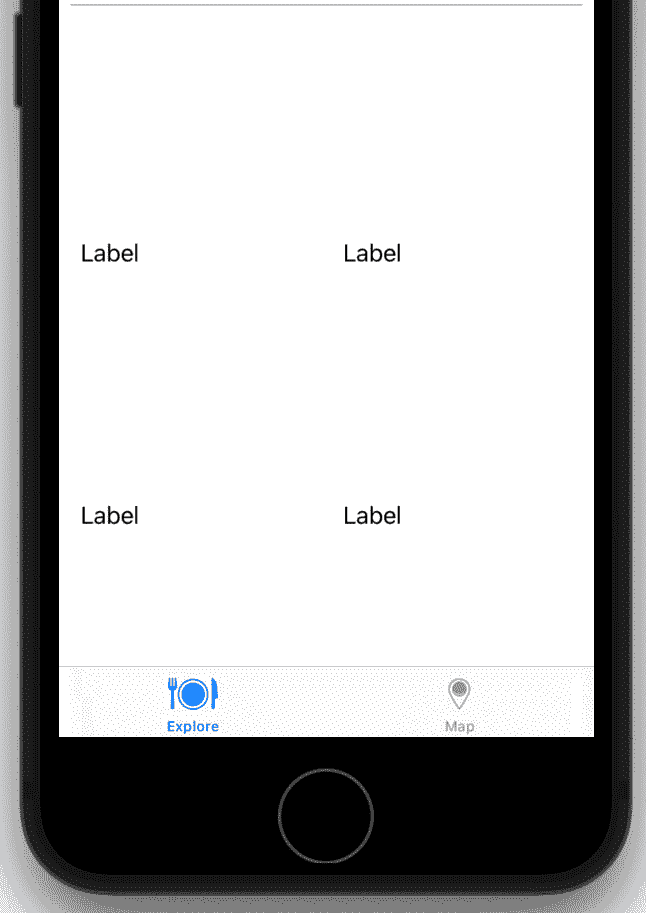

# *第十二章*：修改和配置单元格

在上一章中，你实现了应用程序所需的所有屏幕，但 **Explore**、**餐厅列表** 和 **位置** 屏幕中的单元格仍需要工作。例如，**Explore** 屏幕的收藏视图部分标题和收藏视图单元格与 *第九章**，设置用户界面* 中应用程序浏览中显示的设计不匹配。

在本章中，你将通过添加图像视图和标签来修改和配置 `exploreCell` 收藏视图单元格。对于 `restaurantCell` 收藏视图单元格，通过添加标签、按钮和图像视图来修改。你还将配置图像视图以显示默认图像。对于 `locationCell`，对于表格视图单元格。

到本章结束时，你将熟练于添加和定位用户界面元素，并知道如何使用约束来确定它们之间的相对位置。

将介绍以下主题：

+   修改 **Explore** 屏幕的收藏视图部分标题

+   修改 `exploreCell` 收藏视图单元格

+   修改 `restaurantCell` 收藏视图单元格

+   配置 `locationCell` 收藏视图单元格

# 技术要求

你将继续在上一章修改的 `LetsEat` 项目上工作。

本章完成的 Xcode 项目位于本书代码包的 `Chapter12` 文件夹中，可以在此处下载：

[`github.com/PacktPublishing/iOS-15-Programming-for-Beginners-Sixth-Edition`](https://github.com/PacktPublishing/iOS-15-Programming-for-Beginners-Sixth-Edition)

查看以下视频以查看代码的实际效果：

[`bit.ly/3kjQVSD`](https://bit.ly/3kjQVSD)

让我们从向 **Explore** 屏幕的收藏视图部分标题添加 UI 元素开始，使其与应用程序浏览中显示的相匹配。

# 修改 Explore 屏幕部分标题

让我们看看应用程序浏览中 **Explore** 屏幕的收藏视图部分标题看起来是什么样子：

Figure 12.1: 完成的 Let's Eat 应用程序的收藏视图部分标题

在此收藏视图部分标题中有四个元素：两个标签（标题和副标题）、一个按钮和一个视图（标题和按钮下方的灰色线条）。

你已经在 *第十章**，构建用户界面* 中向 **Explore** 屏幕的收藏视图部分标题添加了一个按钮。现在，你将添加标签和视图，然后修改所有元素以匹配应用程序浏览中显示的收藏视图部分标题。按照以下步骤操作：

1.  首先，在编辑器区域中打开**边界矩形**。这将用蓝色突出显示用户界面元素的边界，并使它们更容易看到。从**编辑器**菜单中选择**画布** | **边界矩形**以打开它们：

    图 12.2：Xcode 菜单栏显示编辑器 | 画布 | 边界矩形

1.  请验证集合视图部分标题的大小已正确设置。在`Main`故事板文件中找到`0`

    `100`

    

    图 12.3：集合视图部分标题的大小检查器设置

    请记住，使用的单位是点。将集合视图部分标题的宽度设置为`0`将自动使其与屏幕宽度相同。

1.  您将在集合视图部分标题中添加一个视图，作为您将添加的所有其他用户界面元素的容器。单击库按钮。在过滤器字段中输入`uiview`。一个**视图**对象将出现在结果中。将其拖动到集合视图部分标题中：

    图 12.4：选中视图对象的库

1.  在文档大纲中，将**视图**拖动到顶部，使其成为**集合可重用视图**子视图列表中的第一个项目。列表中的第一个子视图将首先绘制到屏幕上，这确保它不会覆盖按钮：

    图 12.5：显示视图位置的文档大纲

1.  您将使视图与集合视图部分标题具有相同的大小。使用`0`

    `0`

    `375`

    `100`

    

    图 12.6：视图的大小检查器设置

    **X**和**Y**值确定视图相对于集合视图部分标题的水平和垂直偏移量，而**宽度**和**高度**值确定视图的宽度和高度。这使得此视图的左上角位置与集合视图部分标题的左上角位置相同，将视图的宽度设置为与屏幕相同的宽度（375 点），并将视图的高度设置为 100 点。这将使您稍后添加约束更容易，因为您将添加的视图相对于此容器视图进行定位。

1.  您需要标签来在过滤器字段中显示`标签`。一个**标签**对象将出现在结果中。将两个**标签**对象拖动到您之前拖入的视图中：

    图 12.7：选中标签对象的库

1.  两个标签都必须是容器视图的子视图，因为您将相对于容器视图中的位置对它们应用约束。在文档大纲中，验证两个**标签**对象都是**视图**的子视图，并且**视图**是**集合可重用视图**的子视图：

    图 12.8：包含两个标签的视图

1.  按钮也必须是容器视图的子视图，因为它也将相对于容器视图应用约束。在文档大纲中选择**按钮**，并将其拖动到**视图**上，使其成为**视图**的子视图。完成时，它应该看起来像这样：

    图 12.9：显示 Collection Reusable View 子视图的文档大纲

1.  在集合视图部分标题中的标签之一应设置为自定义灰色颜色。您将在您的资产目录中创建一个文件夹，并向其中添加新的自定义颜色。单击`Assets.xcassets`文件。在文档大纲的空白区域右键单击，如图所示：

    图 12.10：Assets.xcassets 文件夹显示文档大纲

1.  从弹出菜单中选择**新建文件夹**以创建新文件夹：

    图 12.11：已选择新建文件夹的弹出菜单

1.  将文件夹的名称更改为`colors`：

    图 12.12：Assets.xcassets 文件夹显示 colors 文件夹

    您将把所有自定义颜色放在这个文件夹中。

1.  现在，您将在项目中添加一个新的自定义颜色。右键单击`colors`文件夹，并选择**新建颜色集**：

    图 12.13：已选择新建颜色集的弹出菜单

1.  单击新创建的颜色集。确保`LetsEat Light Gray`，设置`8 位十六进制`并将`#AFAFB2`输入到**十六进制**字段中，完成后按*Return*键：

    图 12.14：LetsEat Light Gray 属性检查器设置

    注意，在**任何外观**颜色框旁边，有一个**暗外观**颜色框。如果用户开启**暗模式**，则使用**暗外观**颜色框中的颜色。保留默认值。

    重要信息

    要了解更多关于暗模式的信息，请访问此链接：[`support.apple.com/en-us/HT210332`](https://support.apple.com/en-us/HT210332)。

1.  您将创建第二种颜色，当您修改`LetsEat Dark Gray`并设置`#AAAAAA`时使用：

    图 12.15：LetsEat 深灰色属性检查器设置

1.  对于`LetsEat 深灰色`，您将把**暗外观**颜色改为更深的灰色。单击**暗外观**颜色框并单击**显示颜色面板**按钮：

    图 12.16：选择显示颜色面板按钮的属性检查器

1.  要设置颜色，选择滑块面板，从弹出菜单中选择**灰度滑块**并单击从左数第二个灰色阴影，如图所示：

    图 12.17：LetsEat 深灰色暗外观的颜色面板设置

1.  确认`colors`文件夹的内容如下：

    图 12.18：Assets.xcassets 显示 colors 文件夹的内容

1.  要将标签配置为副标题，点击`Main`故事板文件并选择一个标签。点击属性检查器按钮并更新以下值：

    `普通`然后在下面的空文本字段中添加`请选择一个位置`

    `LetsEat 亮灰色`

    `系统半粗体 13.0`

    

    图 12.19：副标题标签的属性检查器设置

1.  在选择标签的情况下，单击大小检查器按钮。在`8`部分更新以下值

    `24`

    `359`

    `21`

    

    图 12.20：副标题标签的大小检查器设置

    此标签是您之前添加到集合视图部分标题中的容器视图的子视图。这意味着标签的位置将相对于此视图。标签的左上角将水平偏移 8 点，垂直偏移 24 点，出现在集合视图部分标题的左上角下方和右侧。标签的宽度将是 359 点，高度是 21 点。

1.  要将另一个标签设置为标题，选择它并单击属性检查器按钮。更新以下值：

    `普通`然后在下面的空文本字段中添加`探索`

    `系统粗体 40.0`

    

    图 12.21：标题标签的属性检查器设置

1.  在选择标签的情况下，单击大小检查器按钮。在视图部分更新以下值：

    `8`

    `45`

    `255`

    `37`

    

    图 12.22：标题标签的大小检查器设置

    这些设置将此标签向右偏移`8`点，并在容器视图的左上角下方偏移`45`点，将其定位在第一个标签下方。请注意，它不会延伸到整个右侧，为稍后要添加的按钮留出一些空间。

1.  要为按钮配置自定义图片，请选择它，然后在属性检查器中，更新以下值在`自定义`中，并从`btn-location`下的字段中删除文本

    图 12.23：位置按钮的属性检查器设置

    此图片包含在您在*第九章**，设置用户界面*中添加到您的应用的`Assets.xcassets`文件中。

1.  仍然选择按钮，点击大小检查器按钮。更新以下值在`271`

    `50`

    `96`

    `25`

    

    图 12.24：位置按钮的大小检查器设置

1.  您最后要添加的是集合视图部分标题底部的细灰色线条。点击库按钮。在过滤器字段中输入`uiview`。结果中会出现一个**视图**对象。将**视图**对象拖放到容器视图中：

    图 12.25：选择视图对象的库

1.  要将新添加的视图定位到正确位置，请点击大小检查器按钮，并更新以下值在`8`

    `89`

    `359`

    `1`

    

    图 12.26：灰色线条视图的大小检查器设置

    这样会将视图放置在所有其他元素下方，但它是不透明的。

1.  要为视图设置颜色，请点击属性检查器按钮并设置`LetsEat Light Gray`：

图 12.27：灰色线条视图的属性检查器设置

所有必需的用户界面元素都已添加。构建并运行您的应用。您的集合视图部分标题现在应该看起来像这样：

图 12.28：显示完成集合视图部分标题的 iOS 模拟器

如您所见，集合视图部分标题现在与应用导览中显示的设计相匹配。它在 iPhone SE（第二代）模拟器上运行得很好，但要确保它在其他屏幕尺寸上也能工作，您将添加自动布局约束。您将在下一节中这样做。

## 将自动布局添加到探索屏幕的标题部分

如果你现在在 iPhone SE（第二代）模拟器中构建并运行你的应用，集合视图部分标题看起来会很棒，但如果你切换到更大屏幕的模拟器，你会看到一些图形元素的位置不正确。正如你在前面的章节中看到的，自动布局确保 UI 适应设备的屏幕尺寸和方向。例如，启动屏幕上的“Let's Eat”应用标志无论在哪种设备上都保持在屏幕的精确中心，而在“位置”屏幕中的表格视图即使在设备旋转时也占据所有可用屏幕空间。

到目前为止，你只使用了与单个用户界面元素相关的自动布局约束。在本节中，你将把它们添加到集合视图部分标题内的多个用户界面元素中。你将首先向容器视图添加约束，然后继续向其中所有其他项目添加约束。按照以下步骤操作：

1.  选择文档大纲中包含其他视图的**视图**：

    Figure 12.29: 文档大纲显示容器视图

1.  点击“添加新约束”按钮并输入以下值以设置此视图的约束：

    `0`

    `0`

    `0`

    `90`

    完成后，点击**添加 4 个约束**按钮。这将绑定容器视图的顶部、左侧和右侧边缘到集合视图部分标题的边缘。视图的高度设置为 90 点，这决定了底部边缘的位置。

1.  在文档大纲中选择**请选择位置**标签：

    Figure 12.30: 文档大纲显示副标题标签

1.  点击“添加新约束”按钮并输入以下值以设置此标签的约束：

    `24`

    `8`

    `8`

    `21`

    完成后，分别点击`24`个点、`8`个点和`8`个点。注意，标签的宽度未设置，允许它在运行在屏幕较小或较大的模拟器上时进行变化。与之前一样，设置高度约束决定了标签底部边缘的位置。

1.  在文档大纲中选择**位置**按钮：

    Figure 12.31: 文档大纲显示位置按钮

1.  点击“添加新约束”按钮并输入以下值以设置此按钮的约束：

    `5`

    `8`

    `96`

    `25`

    完成后，点击**添加 4 个约束**按钮。由于**位置**按钮位于**请选择位置**标签下方，因此顶部约束决定了**位置**按钮顶部边缘与标签底部边缘之间的空间，而不是容器视图的顶部边缘。**位置**按钮的右侧边缘与容器视图的右侧边缘之间的空间设置为 8 点，宽度和高度约束决定了**位置**按钮的左侧和底部边缘的位置。

1.  在文档大纲中选择灰色线**视图**：

    图 12.32：显示灰色线视图的文档大纲

1.  点击**添加新约束**按钮，并输入以下值以设置此视图的约束：

    `8`

    `8`

    `0`

    `1`

    完成后，点击**添加 4 个约束**按钮。视图的左右边缘与容器视图的左右边缘之间的空间设置为 8 点，视图的底部边缘绑定到容器视图的底部边缘。高度约束决定了视图顶部边缘的位置。

1.  在文档大纲中选择**探索**标签：

    图 12.33：显示标题标签的文档大纲

1.  点击**添加新约束**按钮，并输入以下值以设置此标签的约束：

    `0`

    `8`

    `8`

    `37`

    完成后，点击**添加 4 个约束**按钮。标签的顶部边缘绑定到**请选择位置**标签的底部边缘。标签的左侧边缘与容器视图的左侧边缘之间的空间为 8 点。标签的右侧边缘与**位置**按钮的左侧边缘之间的空间为 8 点。高度约束决定了标签底部边缘的位置。

您已经完成了在**探索**屏幕的集合视图部分标题中添加所有视图的自动布局约束。尝试使用不同的模拟器运行您的应用，以查看用户界面如何适应不同的屏幕尺寸。太酷了！

您可能想知道为什么在添加约束之前需要使用大小检查器设置用户界面元素的位置。实际上，您不必这样做，但通过这样做，可以使添加约束变得更加容易，因为当您点击**添加新约束**按钮时，您看到的约束值是从当前用户界面元素之间的空间中派生出来的。

对于新手开发者来说，使用自动布局可能会有些挑战。请慢慢来。如果它不能正常工作，请清除所有约束并重新开始。为此，请点击屏幕底部的**解决自动布局问题**按钮并选择**清除约束**：

图 12.34：选择清除约束的自动布局问题菜单

你已经将所有必需的用户界面元素和约束添加到了下一节中`exploreCell`集合视图单元格的集合视图部分标题中。你将添加一些用户界面元素，使其与应用导览中显示的单元格相匹配。

# 修改 exploreCell 集合视图单元格

让我们看看在应用导览中`exploreCell`集合视图单元格看起来是什么样子：

图 12.35：完成后的 Let's Eat 应用的 exploreCell 集合视图单元格

在上一章中，你为`exploreCell`集合视图单元格设置了背景颜色，并配置了集合视图以显示 20 个单元格的网格。现在，你将移除背景颜色，并将用户界面元素添加到`exploreCell`集合视图单元格中，以匹配应用导览中的设计。按照以下步骤操作：

1.  在开始之前，检查`exploreCell`集合视图单元格的初始设置。在`exploreCell`的文档大纲中选择`exploreCell`。设置`默认`：

    图 12.36：exploreCell 集合视图单元格的属性检查器设置

1.  你将在`exploreCell`集合视图单元格中添加一个容器视图。点击库按钮。在过滤器字段中输入`uiview`。一个**视图**对象将出现在结果中。将其拖入原型单元格：

    图 12.37：选择视图对象的库

1.  为了确保新添加视图的约束可以正确设置，请验证`exploreCell`**内容视图**是否选中：

    图 12.38：选择视图的文档大纲

1.  点击“添加新约束”按钮，并输入以下值以设置新添加视图的约束：

    `0`

    `0`

    `0`

    `40`

    完成后，点击`exploreCell`集合视图单元格。底部边缘的位置由底部约束决定，该约束设置了视图底部边缘与`exploreCell`集合视图单元格底部边缘之间的距离。你将在稍后在这个空间中添加一个标签。

1.  你将添加一个图像视图来显示一道菜的照片。点击库按钮。在过滤器字段中输入`image`。一个**图像视图**对象将出现在结果中。将其拖到之前添加的视图上方：

    图 12.39：选择图像视图对象的库

1.  为了确保图像视图的约束可以正确设置，请验证**图像视图**是否是你之前添加的**视图**的子视图，并且已选中：

    图 12.40：选中图像视图的文档大纲

1.  点击添加新约束按钮，并输入以下值以设置图像视图的约束：

    `0`

    `0`

    `0`

    `0`

    完成后，点击 **添加 4 个约束** 按钮。这将绑定图像视图的边缘到您之前添加的视图的边缘。

1.  您将添加一个标签来显示菜系类型。点击库按钮。在过滤器字段中输入 `label`。一个 **标签** 对象将出现在结果中。将其拖动到您刚刚添加的图像视图和单元格底部之间的空间：

    图 12.41：选中标签对象的书库

1.  为了确保标签的约束可以正确设置，请验证 `exploreCell` 集合视图单元格的 **内容视图**，而不是您之前添加的 **视图** 的子视图：

    图 12.42：选中标签的文档大纲

1.  点击添加新约束按钮，并输入以下值以设置标签的约束：

    `9`

    `8`

    `8`

    `21`

    完成后，点击 `9` 个点。标签的左右边缘与 `exploreCell` 内容视图的相应边缘之间的空间都设置为 `8` 个点。高度约束通过设置标签上下边缘之间的空间来确定标签底部边缘的位置。

    所有必要的约束都已添加。构建并运行您的应用：

图 12.43：iOS 模拟器显示完成的 exploreCell 集合视图单元格

如您所见，**探索**屏幕现在更接近应用浏览中显示的设计。每个单元格现在都有一个图像视图和位于其下的标签，并且已添加所有必要的约束。太棒了！

注意，与上一节不同，在添加约束之前，您没有使用大小检查器设置用户界面元素的位置。您可以在添加少量元素时这样做，并且每个元素相对于其他元素的相对位置是不言自明的。

您已将所有必需的用户界面元素和约束添加到 `exploreCell` 集合视图单元格中。现在，您已经完成了对 `exploreCell` 集合视图单元格的修改，接下来在下一节中，我们将通过向其中添加一些用户界面元素来修改 `restaurantCell` 集合视图单元格。

# 修改 restaurantCell 集合视图单元格

让我们看看在应用浏览中 `restaurantCell` 集合视图单元格看起来是什么样子：

图 12.44：完成的 Let's Eat 应用程序的 restaurantCell 集合视图单元格

如您所见，`restaurantCell` 集合视图单元格有许多元素。您现在将修改它以匹配应用程序浏览中显示的设计。所需更改的摘要如下：

+   将 `restaurantCell` 集合视图单元格的大小调整为更大，并将背景颜色更改为默认颜色。

+   添加一个视图，然后添加一个标签和一个包含三个按钮的堆叠视图来显示可预订的时间。

+   添加一个视图，然后添加一个图像视图来显示餐厅的照片。

+   在左上角添加一个标签来显示餐厅的名称。

+   在名称标签下方添加一个标签来显示餐厅提供的菜肴。

您将使用大小检查器来定位所有元素，这将使添加必要的自动布局约束更容易。请慢慢操作，以减少出错的机会。按照以下步骤操作：

1.  您将首先设置 `restaurantCell` 集合视图单元格的大小。在 `Main` 故事板文件中，点击 `335` 和 `312`。设置为 `None`:

    图 12.45：餐厅单元格集合视图单元格的大小检查器设置

1.  要检查 `restaurantCell` 集合视图单元格的标识符和背景颜色，请点击文档大纲中的 `restaurantCell`。点击属性检查器按钮。确认 `restaurantCell`。设置 `默认`:

    图 12.46：餐厅单元格集合视图单元格的属性检查器设置

1.  你将在筛选字段中为 `uiview` 添加一个容器视图。结果中会出现一个 **View** 对象。将其拖入原型单元格：

    图 12.47：选择 View 对象的库

1.  选择新添加的视图后，点击大小检查器按钮。为 `55` 更新以下值

    `245`

    `224`

    `56`

    

    图 12.48：容器视图的大小检查器设置

1.  你将在筛选字段中添加一个包含文本 `label` 的标签。结果中会出现一个 **Label** 对象。将其拖入你刚刚添加的视图中：

    图 12.49：选择 Label 对象的库

1.  选择标签后，点击大小检查器按钮。在 `0` 中更新以下值

    `2`

    `224`

    `21`

    

    图 12.50：可用时间标签的大小检查器设置

1.  在下面的空文本字段中设置和配置 `Plain`，然后添加 `Available Times`

    `居中`

    `系统粗体 17.0`

    

    Figure 12.51: 可用时间标签的属性检查器设置

1.  你将添加带有预约时间的按钮到视图中。点击图书馆按钮。在过滤器字段中输入`button`。一个**按钮**对象将出现在结果中。将其拖动到与**可用时间**标签相同的视图中：

    Figure 12.52: Library with Button object selected

1.  要设置按钮的文本和背景，选择它并点击属性检查器按钮。更新以下值：

    `System`

    `Default`

    在下面的空白文本字段中输入`Plain`，然后添加`7:30pm`

    `System Bold 15.0`

    `White Color`

    `time-bg`

    

    Figure 12.53: 预约按钮的属性检查器设置

1.  要验证按钮的宽度和高度，点击大小检查器按钮。在`68`中更新以下值

    `27`

    

    Figure 12.54: 预约按钮的大小检查器设置

1.  如应用浏览中所见，有三个预约按钮。选择按钮并按*Command + C*复制。按*Command + V*两次粘贴。你现在应该有三个按钮。按照以下方式排列它们：

    Figure 12.55: 显示按钮排列的视图

1.  在堆叠视图中嵌入用户界面元素使它们更容易管理。你将把所有按钮嵌入到堆叠视图中。点击一个按钮，然后按*Shift*并点击其他两个按钮。现在所有三个按钮都应该被选中：

    Figure 12.56: 显示所有按钮被选中的视图

1.  从**编辑器**菜单中选择**嵌入 | 堆叠视图**。这将把所有三个按钮放入一个有 1 行 3 列单元格的堆叠视图中。

1.  通过检查文档大纲中的**堆叠视图**的子视图来验证所有按钮现在都是堆叠视图的子视图：

    Figure 12.57: 显示所有按钮嵌入在堆叠视图中的视图

    重要信息

    你可以通过这个链接了解更多关于堆叠视图的信息：[`developer.apple.com/documentation/uikit/uistackview`](https://developer.apple.com/documentation/uikit/uistackview).

1.  选择`Horizontal`

    `Fill`

    `Equal Spacing`

    `10`

    

    Figure 12.58: 堆叠视图的属性检查器设置

1.  要在包含视图中定位堆叠视图，点击大小检查器按钮。在`0`中更新以下值

    `29`

    

    Figure 12.59: 堆叠视图的大小检查器设置

1.  你将为`restaurantCell`集合视图单元格添加一个容器视图。这个视图将包含一个显示餐厅照片的图像视图。点击库按钮。在过滤器字段中输入`uiview`。结果中会出现一个**视图**对象。将其拖入原型单元格：

    图 12.60：选择视图对象的库

1.  选择视图后，点击大小检查器按钮。在`11`中更新以下值

    `42`

    `316`

    `200`

    

    图 12.61：容器视图的大小检查器设置

1.  你将为之前添加的容器视图添加一个图像视图。点击库按钮。在过滤器字段中输入`image`。结果中会出现一个**图像视图**对象。将其拖入你刚刚添加的视图中：

    图 12.62：选择图像视图对象的库

1.  为了为图像视图设置一个临时的占位图像，选择它并点击属性检查器按钮。设置`american`。

    图 12.63：图像视图的属性检查器设置

    你将在*第十四章*中使用代码加载图像，*将数据加载到集合视图中*。

1.  为了在容器视图中定位图像视图，选择它并点击大小检查器按钮。在`0`中更新以下值

    `0`

    `316`

    `200`

    

    图 12.64：图像视图的大小检查器设置

1.  你将添加标签，用于显示餐厅的名称和它提供的菜系类型。点击库按钮。在过滤器字段中输入`label`。结果中会出现一个**标签**对象。将两个**标签**对象拖入原型单元格：

    图 12.65：选择标签对象的库

1.  其中一个标签将用于餐厅名称。选择一个标签并点击属性检查器按钮。将字体样式设置为`System Bold 17.0`以配置此标签。

    图 12.66：名称标签的属性检查器设置

1.  为了在`restaurantCell`集合视图单元格中定位此标签，选择标签并点击大小检查器按钮。在`10`中更新以下值

    `3`

    `315`

    `19`

    

    图 12.67：名称标签的大小检查器设置

1.  另一个标签将用于显示餐厅提供的菜系。选择另一个标签并点击属性检查器按钮。更新以下值以配置其字体和颜色：

    `LetsEat Dark Gray`

    `System 14.0`

    

    图 12.68：餐饮标签的属性检查器设置

1.  此标签应位于显示餐厅名称的标签下方。选中标签后，点击大小检查器按钮。更新`restaurantCell`集合视图单元格中的以下值：

    `10`

    `22`

    `315`

    `16`

图 12.69：餐饮标签的大小检查器设置

您已为`restaurantCell`添加了所有元素，并使用大小检查器设置了它们的定位。现在，您需要为它们添加自动布局约束以确保用户界面适应设备屏幕大小和方向。您将在下一节中这样做。

## 向餐厅单元格集合视图单元格添加自动布局约束

正如您之前为`exploreCell`集合视图单元格所做的那样，您现在将为`restaurantCell`中的所有元素添加自动布局约束。由于您已经使用大小检查器定位了元素，它们之间的相对位置和约束值应该已经正确设置，这将使您添加约束变得容易。由于`restaurantCell`中有许多元素，请在本节中留出时间。按照以下步骤操作：

1.  要设置包含餐厅名称的标签的约束，请选择顶部的`restaurantCell`集合视图单元格。验证是否已选择正确的标签。它应该是黑色而不是浅灰色。

1.  点击“添加新约束”按钮并输入以下值：

    `3`（包围视图顶部边缘和顶部边缘之间的空间）

    `10`（包围视图左侧边缘和左侧边缘之间的空间）

    `10`（包围视图右侧边缘和右侧边缘之间的空间）

    `19`（顶部和底部边缘之间的空间）

    完成后，点击**添加 4 个约束**按钮。

1.  要设置包含餐厅菜系的标签的约束，请选择`restaurantCell`集合视图单元格。验证是否已选择正确的标签。它应该是浅灰色而不是黑色。

1.  点击“添加新约束”按钮并输入以下值：

    `0`（将上一个标签的顶部边缘绑定到底部边缘）

    `10`（包围视图左侧边缘和左侧边缘之间的空间）

    `10`（包围视图右侧边缘和右侧边缘之间的空间）

    `16`（顶部和底部边缘之间的空间）

    完成后，点击**添加 4 个约束**按钮。

1.  要设置包含餐厅照片的图像视图的约束，请在文档大纲中选择包含图像视图的**视图**：

    图 12.72：选择容器视图的文档大纲

1.  点击“添加新约束”按钮并输入以下值：

    `4`（标签的顶部边缘和底部边缘之间的空间）

    `316`（左右边缘之间的空间）

    `200`（顶部和底部边缘之间的空间）

    点击“完成时添加 3 个约束”按钮。请注意，此视图的水平位置尚未设置。

1.  点击“对齐”按钮，勾选`0`。完成时点击“添加 1 个约束”按钮。这会将视图的水平位置设置为包围视图的中心。由于已设置此视图的宽度，可以自动确定左右边缘的位置。

1.  要设置包含餐厅照片的图像视图的约束，请在文档大纲中选择**american**：

    图 12.73：选择图像视图的文档大纲

1.  点击“添加新约束”按钮并输入以下值：

    `0`

    `0`

    `0`

    `0`

    点击“完成时添加 4 个约束”按钮。这将绑定图像视图的边缘到包围视图。

1.  要设置包含标签和按钮的视图的约束，请在文档大纲中选择包含**可用时间**标签和**Stack View**的**视图**：

    图 12.74：选择容器视图的文档大纲

1.  点击“添加新约束”按钮并输入以下值：

    `3`（包含图像视图的视图的顶部边缘和底部边缘之间的空间）

    `224`（左右边缘之间的空间）

    `56`（顶部和底部边缘之间的空间）

    点击“完成时添加 3 个约束”按钮。请注意，此视图的水平位置尚未设置。

1.  点击“对齐”按钮。勾选`0`。完成时点击“添加 1 个约束”按钮。这会将视图的水平位置设置为**内容视图**的中心。由于已设置此视图的宽度，可以自动确定左右边缘的位置。

1.  要设置包含按钮的堆叠视图的约束，请在文档大纲中选择**Stack View**：

    图 12.75：选择 Stack View 的文档大纲

1.  点击“添加新约束”按钮并输入以下值：

    `6`（`0`（包围视图的左边缘和左边缘之间的空间）的顶部边缘和底部边缘之间的空间）

    `0`（包围视图的右边缘和右边缘之间的空间）

    `27`（顶部和底部边缘之间的空间）

    完成后，点击**添加 4 个约束**按钮。

1.  要设置**可用时间**标签的约束，在文档大纲中选择**可用时间**标签：

    图 12.76：选中可用时间标签的文档大纲

1.  点击添加新约束按钮并输入以下值：

    `2`（顶部边缘和封装视图顶部边缘之间的空间）

    `0`（将左侧边缘绑定到封装视图的左侧边缘）

    `0`（将右侧边缘绑定到封装视图的右侧边缘）

    `21`（顶部和底部边缘之间的空间）

    完成后，点击**添加 4 个约束**按钮。

`restaurantCell`集合视图单元格的所有自动布局约束都已设置。构建并运行你的应用，转到**餐厅列表**屏幕。你应该看到以下内容：

图 12.77：iOS 模拟器显示完成的`restaurantCell`集合视图单元格

如你所见，`restaurantCell`集合视图单元格现在看起来就像应用导览设计，并且已经添加了所有必要的约束。太棒了！

你已经将所有必需的用户界面元素和约束添加到了`restaurantCell`中。现在你已经完成了对`restaurantCell`的修改，接下来让我们在下一节中修改**位置**屏幕中的表格视图单元格。

# 配置`locationCell`表格视图单元格

本章最后要做的就是配置`locationCell`内部的表格视图单元格。按照以下步骤操作：

1.  在`1`中找到由按钮触发的视图控制器场景：

    图 12.78：表格视图的属性检查器设置

    表格视图中将出现一个原型表格视图单元格。

1.  要设置单元格的样式和标识符，点击**基本**

    `locationCell`

    

    图 12.79：`locationCell`表格视图单元格的属性检查器设置

    注意，原型表格视图单元格的名称将更改为`locationCell`。当你将样式从`自定义`更改为`基本`时，单元格中应出现单词`标题`。这只是一个占位符。你将在稍后代码中更改此值。

1.  要设置单元格的字体大小，点击`locationCell`的`20`：

图 12.80：`locationCell`表格视图单元格中文本的属性检查器设置

如果你现在构建并运行你的应用，然后转到**位置**屏幕，它仍然会显示为空白，因为你还没有添加任何代码来在单元格中显示数据。你将在*第十五章*“使用表格视图入门”中这样做。

# 摘要

在本章中，你通过向`exploreCell`集合视图单元格添加一个图像视图和一个标签，以及必要的约束来修改了它内部的单元格。对于`restaurantCell`集合视图单元格，你添加了标签、按钮和一个图像视图，配置它显示默认图像，并添加了必要的约束。对于`locationCell`。

你现在知道如何使用 Interface Builder 添加和配置多个用户界面元素，使用大小检查器设置它们的大小和位置，并使用添加新约束和对齐按钮应用必要的约束，以确保与不同屏幕尺寸和方向兼容。这在你设计自己的用户界面时将非常有用。你也应该能够轻松地原型化你自己的应用的外观和流程。

到目前为止，你已经完成了故事板和设计设置。你可以浏览应用应该拥有的每一个屏幕，看看它们的样子，尽管这些屏幕中没有任何实际数据。如果这个应用就像一座正在建造的房子，那么你现在已经建好了所有的墙壁和地板，房子现在可以开始内部装修了。干得好！

这本书的第二部分到此结束。在下一部分，你将开始输入应用运行所需的所有代码。在下一章，你将开始学习更多关于**模型-视图-控制器**设计模式的知识。你还将了解集合视图是如何工作的，这对于理解**探索**和**餐厅列表**屏幕的工作方式至关重要。
