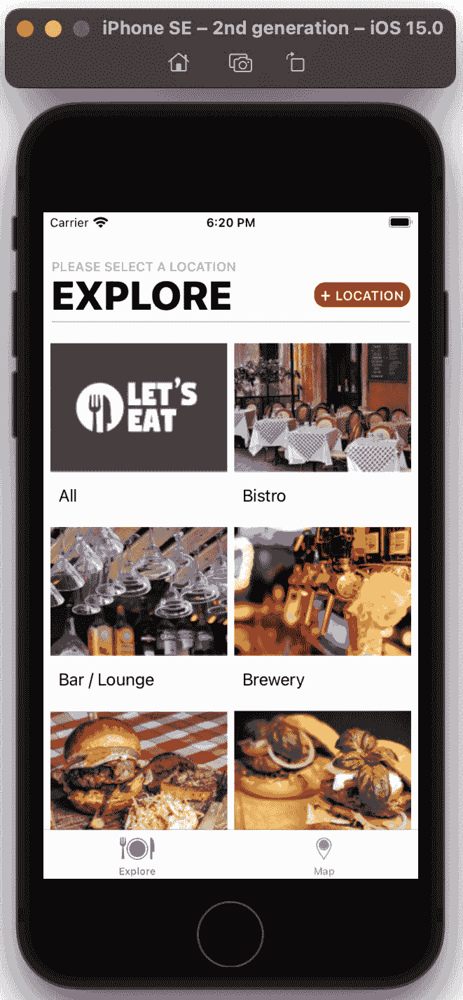
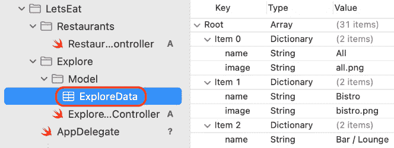
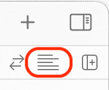
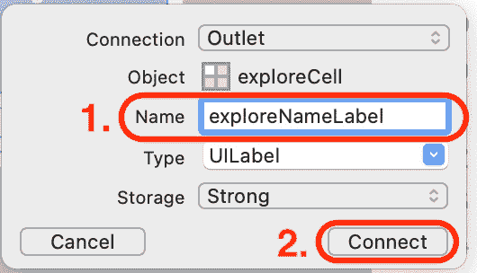
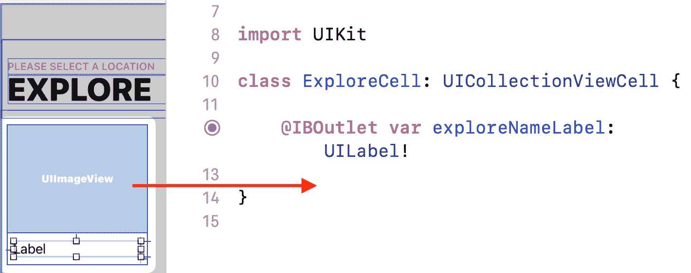
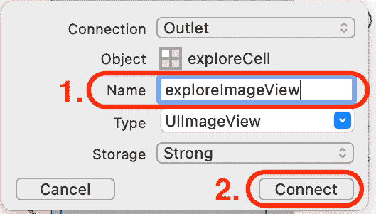
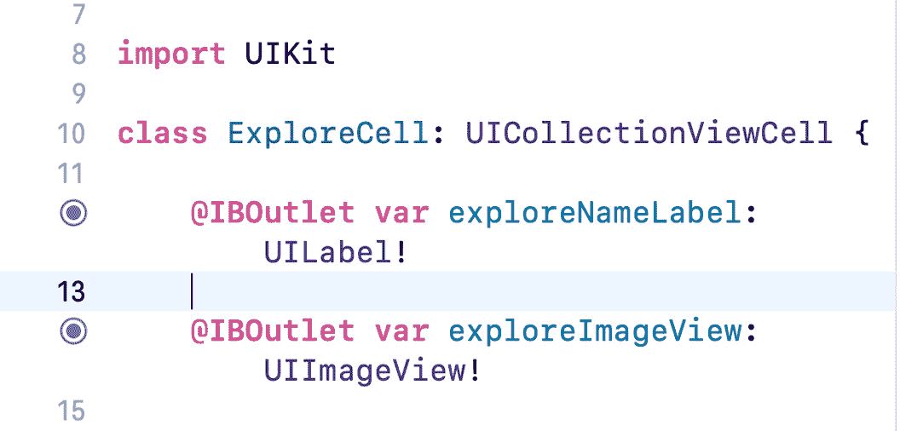
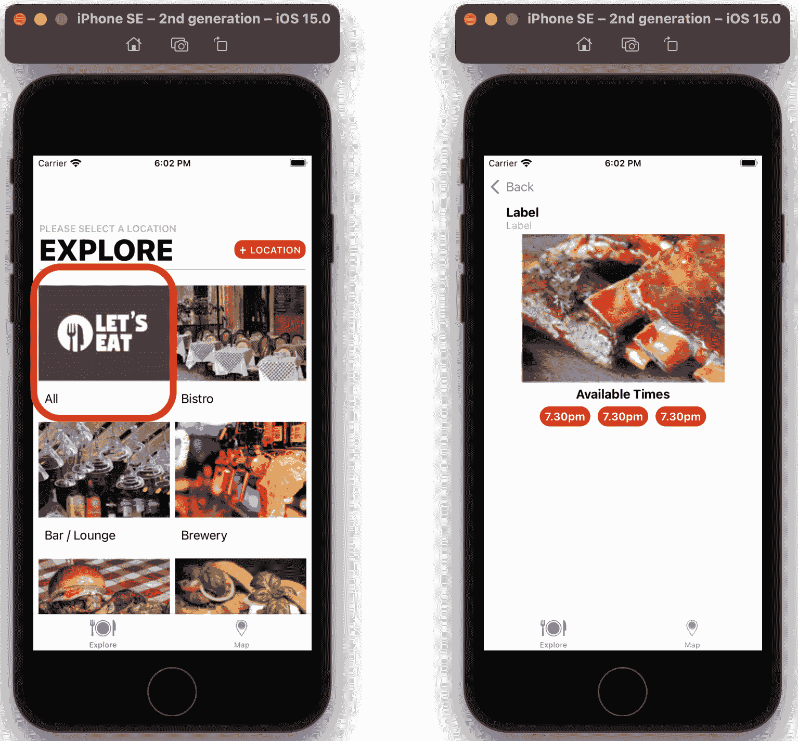

# *第十四章*：将数据放入集合视图

在上一章中，你学习了模型-视图-控制器（MVC）设计模式和集合视图。你还回顾了**探索**和**餐厅列表**屏幕，并看到了这两个屏幕中的集合视图是如何工作的。然而，到目前为止，这两个屏幕只是显示不包含任何数据的单元格。如*第九章*“设置用户界面”中的应用程序导游所示，**探索**屏幕应显示一系列菜系，而**餐厅列表**屏幕应显示一系列餐厅。

在本章中，你将实现用于**探索**屏幕的模型对象，使其显示一系列菜系。你将从学习你将使用的模型对象开始。接下来，你将学习属性列表，并了解它们如何用于存储菜系数据，你还将创建一个 Swift 结构，可以存储菜系实例。之后，你将创建一个数据管理类，从属性列表中读取数据并填充结构数组。这个结构数组然后将作为**探索**屏幕中集合视图的数据源。

到本章结束时，你将学习如何使用属性列表存储数据，如何创建模型对象，如何创建一个可以从属性列表中加载数据到模型对象数组的数据库管理类，如何配置视图控制器以向集合视图提供模型对象，以及如何配置集合视图以在屏幕上显示数据。

以下内容将涵盖：

+   理解模型对象

+   理解`.plist`文件

+   创建一个表示菜系的结构

+   实现一个数据管理类以从`.plist`文件中读取数据

+   在集合视图中显示数据

# 技术要求

你将继续在*第十二章*“修改和配置单元格”中修改的`LetsEat`项目上工作。

本章的资源文件和完成的 Xcode 项目位于本书代码包的`Chapter14`文件夹中，可以在此处下载：

[`github.com/PacktPublishing/iOS-15-Programming-for-Beginners-Sixth-Edition`](https://github.com/PacktPublishing/iOS-15-Programming-for-Beginners-Sixth-Edition)

查看以下视频以查看代码的实际效果：

[`bit.ly/3mWQ8sJ`](https://bit.ly/3mWQ8sJ)

让我们从查看所需的不同模型对象开始，这些模型对象用于存储初始数据，将数据加载到应用程序中，并在应用程序内存储数据。

# 理解模型对象

如你在*第十三章*“开始使用 MVC 和集合视图”中学到的，iOS 应用程序的一个常见设计模式是模型-视图-控制器，或 MVC。为了回顾，MVC 将应用程序分为三个不同的部分：

+   **模型**：这处理数据存储、表示和数据处理任务。

+   **视图**：这是用户可以与之交互的屏幕上的任何内容。

+   **控制器**：这管理着模型和视图之间信息流的流程。

让我们回顾一下在应用导览中看到的 **探索** 屏幕的设计，它看起来像这样：



图 14.1：iOS 模拟器显示应用导览中的探索屏幕

构建并运行您的应用，**探索**屏幕将看起来像这样：


图 14.2：iOS 模拟器显示您的应用中的探索屏幕

如您所见，所有的单元格目前都是空的。根据 MVC 设计模式，您已经完成了视图（集合视图部分标题和集合视图）和控制器（`ExploreViewController` 类）的实现。现在，您将添加模型对象，这些对象将提供要显示的数据。

首先，您将在项目中添加一个属性列表，`ExploreData.plist`，它包含每个菜谱的名称和图像文件名。菜谱图像本身已经存在于您的 `Assets.xcassets` 文件夹中。接下来，您将创建一个模型对象，`ExploreItem`，它将是一个具有两个属性的构造型。一个属性将用于存储菜谱名称，另一个将用于存储图像文件名。之后，您将创建一个数据管理类，`ExploreDataManager`，它将从 `ExploreData.plist` 加载数据，将其放入 `ExploreItem` 实例的数组中，并将数组提供给 `ExploreViewController` 实例。最后，您将修改 `ExploreViewController` 类，使其能够为集合视图提供数据以显示。

要了解更多关于属性列表文件的信息，现在让我们将 `ExploreData.plist` 添加到您的项目中，看看它是如何存储菜谱数据的。

# 理解 .plist 文件

苹果开发了属性列表来存储数据结构或对象状态，以便稍后重新构成和传输。它们通常用于存储应用程序的首选项。属性列表文件使用 `.plist` 文件名扩展名，因此通常被称为 `.plist` 文件。您将在项目中使用包含菜谱数据的 `.plist` 文件，`ExploreData.plist`。

您需要下载此书的代码包以获取 `ExploreData.plist` 文件。之后，您可以使用 Xcode 来查看其内容。请按照以下步骤操作：

1.  如果您还没有这样做，请从以下链接下载资源文件和此 Xcode 项目：[`github.com/PacktPublishing/iOS-15-Programming-for-Beginners-Sixth-Edition`](https://github.com/PacktPublishing/iOS-15-Programming-for-Beginners-Sixth-Edition)。

1.  打开 `Chapter14` 文件夹，然后查看 `resources` 文件夹以找到 `ExploreData.plist`。此文件存储菜谱名称和图像文件名。

1.  打开 `LetsEat` 项目，在项目导航器中右键单击 `Explore` 文件夹，然后选择 **新建组**。

1.  将您刚刚添加的新组重命名为 `Model`。

1.  将 `ExploreData.plist` 拖动到该组中。

1.  确保已勾选 **如果需要则复制项目**，然后点击 **完成**。

当您在项目导航器中单击 `ExploreData.plist` 时，您将看到一个包含字典的数组，如下所示：



图 14.3：编辑区域显示 ExploreData.plist 的内容

每个字典都有两个元素。第一个元素有一个键 `name`，描述了一种菜系类型。第二个元素有一个键 `image`，包含一个菜系图像的文件名。所有菜系图像都存储在项目中的 `Assets.xcassets` 文件中。

要使用 `ExploreData.plist` 中包含的数据，您需要在应用程序中创建一个结构来存储它，以便以后可以通过 `ExploreViewController` 实例访问它。您将在下一节中创建它。

# 创建一个结构来表示一种菜系

要创建一个可以在您的应用程序中表示菜系的模型对象，您需要在项目中添加一个新文件 `ExploreItem`，并声明一个具有菜系名称和图像属性的 `ExploreItem` 结构。按照以下步骤操作：

1.  右键单击 `Model` 文件夹，然后选择 **新建文件**。

1.  **iOS** 应已选中。选择 **Swift 文件**，然后点击 **下一步**。

1.  将文件命名为 `ExploreItem`，然后点击 `import` 语句。

    重要信息

    `import` 语句允许您将其他代码库导入到项目中，从而让您能够使用它们中的类、属性和方法。`Foundation` 是 Apple 的核心框架之一，您可以在以下位置了解更多信息：[`developer.apple.com/documentation/foundation`](https://developer.apple.com/documentation/foundation)。

1.  将以下代码添加到文件中，以声明一个名为 `ExploreItem` 的结构：

    ```swift
    struct ExploreItem {
    }
    ```

1.  在最后一个大括号之前添加以下代码，以向 `ExploreItem` 结构添加两个可选的 `String` 属性：

    ```swift
    Struct ExploreItem {
    name property will store the cuisine name, and the image property will store the filename of an image from the Assets.xcassets file.Important InformationStructures are covered in *Chapter 7*, *Classes, Structures, and Enumerations.*
    ```

结构会自动获得默认初始化器。您可以通过以下语句创建 `ExploreItem` 的实例：

```swift
let myExploreItem = ExploreItem(name:"name", 
image:"image")
```

然而，`ExploreData.plist` 中的名称和图像文件名存储为字典元素，如下例所示：

`["name": "All", "image": "all.png"]`

重要信息

字典在 *第五章*，*集合类型* 中介绍。

您将创建一个自定义初始化器，该初始化器接受一个字典作为参数，并将从字典元素中获取的值分配给 `ExploreItem` 实例中的属性。您将使用扩展来将此自定义初始化器添加到 `ExploreItem` 结构中。

重要信息

扩展在 *第八章*，*协议、扩展和错误处理* 中介绍。

按照以下步骤操作：

1.  在 `ExploreItem` 结构声明之后输入以下内容以添加一个扩展：

    ```swift
    extension ExploreItem {

    }
    ```

    你将使用这个扩展来向 `ExploreItem` 结构添加初始化器方法。

1.  在扩展的大括号之间添加以下内容以声明一个自定义初始化器方法：

    ```swift
    init(dict: [String: String]) {

    }
    ```

    忽略出现的错误，因为你将很快修复它。这个初始化器接受一个字典作为参数。注意键和值都是字符串。

1.  在初始化器的大括号之间添加以下内容：

    ```swift
    self.name = dict["name"]
    self.image = dict["image"]
    ```

    这将字典中键为 `"name"` 的项的值分配给 `name` 属性，将键为 `"image"` 的项的值分配给 `image` 属性。

    完成的扩展应如下所示：

    ```swift
    extension ExploreItem {
       init(dict: [String: String]) {
          self.name = dict["name"]
          self.image = dict["image"]
       }
    }
    ```

    到目前为止，你有一个结构，`ExploreItem`，它有两个 `String` 属性，`name` 和 `image`。当你创建这个结构的实例时，你将传递一个包含键和值的字典，键和值都是 `String` 类型。`name` 键的值将被分配给 `name` 属性，`image` 键的值将被分配给 `image` 属性。

在下一节中，你将实现一个数据管理类。这将读取 `ExploreData.plist` 文件中的字典数组并将字典元素的值分配给 `ExploreItem` 实例。

# 实现一个数据管理类以从 .plist 文件读取数据

你已经向项目中添加了一个 `.plist` 文件，`ExploreData.plist`，其中包含餐饮数据，并且你已经创建了一个结构，`ExploreItem`，可以存储每个餐饮的详细信息。现在，你需要创建一个新的类，`ExploreDataManager`，它可以读取 `.plist` 文件中的数据并将其存储在 `ExploreItem` 实例的数组中。你将把这个类称为数据管理类。按照以下步骤操作：

1.  右键点击 **Model** 文件夹并选择 **New File**。

1.  **iOS** 应该已经选中。选择 **Swift File**，然后点击 **Next**。

1.  将文件命名为 `ExploreDataManager` 并点击 **Create** 以在编辑器区域显示其内容。

1.  在文件中输入以下代码以声明 `ExploreDataManager` 类：

    ```swift
    class ExploreDataManager {

    }
    ```

1.  在大括号之间输入以下代码以实现一个方法，`loadData()`，它将读取 `ExploreData.plist` 文件的全部内容并返回一个字典数组：

    ```swift
    private func loadData() -> [[String: String]] {
       let decoder = PropertyListDecoder()
       if let path = Bundle.main.path(forResource:
       "ExploreData", ofType: "plist"), 
       let exploreData = FileManager.default.contents(
       atPath: path), 
       let exploreItems = try? decoder.decode([[String: 
       String]].self, from: exploreData) {
          return exploreItems
       }
       return [[:]]
    }
    ```

    让我们分解这个方法：

    ```swift
    private
    ```

    `private` 关键字表示该方法只能在这个类内部使用。

    ```swift
    func loadData() -> [[String: String]]
    ```

    `loadData()` 方法声明没有参数，并返回一个字典数组，每个字典包含键和值都是 `String` 类型的元素。

    ```swift
    let decoder = PropertyListDecoder()
    ```

    这个语句创建了一个属性列表解码器实例，它将用于解码 `ExploreData.plist` 文件中的数据。

    ```swift
    if let path = Bundle.main.path(forResource:
    "ExploreData", ofType: "plist"),
    ```

    当你构建你的应用时，结果是一个包含所有应用资源的文件夹，称为应用程序包。`ExploreData.plist` 就在这个包内。这个语句试图获取 `ExploreData.plist` 文件的路径并将其分配给一个常量，`path`。

    ```swift
    let exploreData = FileManager.default.contents(
    atPath: path),
    ```

    此语句尝试从 `path` 获取存储的 `ExploreData.plist` 文件并将其分配给一个常量，`exploreData`。

    ```swift
    let exploreItems = try? decoder.decode([[String: 
    String]].self, from: exploreData) {
    ```

    如果您在项目中点击 `ExploreData.plist`，请注意，根级别的对象是一个数组，并且数组中的每个项目都是一个字典，如下所示：


图 14.4：显示 ExploreData.plist 中数组和字典的编辑区域

此语句尝试从 `ExploreData.plist` 文件的内容创建一个数组并将其分配给一个常量，`exploreItems`：

```swift
   return exploreItems
}
```

如果可选绑定成功，此语句将返回 `exploreItems` 作为字典数组，并且每个字典都是 `[String: String]` 类型：

```swift
   return [[:]]
}
```

如果可选绑定失败，将返回一个空的字典数组。

到目前为止，您有一个数据管理器类，`ExploreDataManager`，它包含一个方法，可以从 `ExploreData.plist` 文件加载数据并将其分配给一个数组，`exploreItems`。在下一节中，您将了解如何使用该数组中的字典来初始化 `ExploreItem` 实例，这些实例最终将被传递给管理 **Explore** 屏幕的 `ExploreViewController` 实例。

## 使用数据管理器初始化 ExploreItem 实例

目前，您有一个数据管理器类，`ExploreDataManager`。此类包含一个方法，`loadData()`，它从 `ExploreData.plist` 读取数据并返回一个字典数组。您将添加一个方法，使用该数组中的字典创建和初始化 `ExploreItem` 实例。按照以下步骤操作：

1.  在 `ExploreDataManager` 类定义中，在 `loadData()` 方法之前添加以下代码以实现一个 `fetch()` 方法：

    ```swift
    func fetch() {
       for data in loadData() {
          print(data)
       }
    }
    ```

    此方法将调用 `loadData()`，它返回一个字典数组。然后使用 `for` 循环将数组中每个字典的内容打印到调试区域，以确保已成功读取 `ExploreData.plist` 文件。

1.  在项目导航器中点击 `ExploreViewController` 文件。将以下代码添加到 `viewDidLoad()` 方法中。这将在 `ExploreViewController` 实例加载其视图时创建一个 `ExploreDataManager` 实例并调用其 `fetch()` 方法：

    ```swift
    override func viewDidLoad() {
       super.viewDidLoad()
    ExploreData.plist file are read and printed in the Debug area, as shown:Figure 14.5: Debug area displaying contents of ExploreData.plistNow, you'll assign the `name` and `image` strings from each dictionary in the array to an `ExploreItem` instance.
    ```

1.  点击 `ExploreDataManager` 文件。在 `fetch()` 方法之前添加一个属性声明来存储 `ExploreItem` 实例数组：

    ```swift
    private var exploreItems: [ExploreItem] = []
    ```

    这向 `ExploreDataManager` 类添加一个属性 `exploreItems` 并将其分配给一个空数组。

1.  在 `fetch()` 方法内部，将 `print()` 语句替换为以下语句，该语句初始化 `ExploreItem` 实例并将它们追加到 `exploreItems` 数组中：

    ```swift
    exploreItems.append(ExploreItem(dict: data))
    ```

    `ExploreItem` 类中的自定义初始化器将 `ExploreData.plist` 中读取的每个字典中的 `name` 和 `image` 字符串分配给 `ExploreData` 实例的 `name` 和 `image` 属性。

1.  验证 `ExploreDataManager` 文件的内容看起来如下：

    ```swift
    import Foundation
    class ExploreDataManager {
       private var exploreItems: [ExploreItem] = []
       func fetch() {
          for data in loadData() {
             exploreItems.append(ExploreItem(dict: 
             data))
          }
       }
       private func loadData() -> [[String: String]] {
          let decoder = PropertyListDecoder()
          if let path = Bundle.main.path(forResource:
          "ExploreData", ofType: "plist"), 
          let exploreData = 
          FileManager.default.contents(atPath: path), 
          let exploreItems = try? 
          decoder.decode([[String: String]].self, 
          from: exploreData) {
             return exploreItems
          }
          return [[:]]
       }
    }
    ```

到目前为止，您已经有一个`ExploreDataManager`类，它从`ExploreData.plist`文件中读取数据并将其存储在`exploreItems`数组中，这是一个`ExploreItem`实例的数组。这个数组将是`ExploreViewController`实例管理的集合视图的数据源。它包含的菜谱信息最终将在**探索**屏幕中显示。

# 在集合视图中显示数据

您已经实现了一个数据管理类`ExploreDataManager`，它从`ExploreData.plist`文件中读取菜谱数据并将其存储在`ExploreItem`实例的数组中。现在，您将修改`ExploreViewController`类，使其使用该数组作为**探索**屏幕中集合视图的数据源。

目前，在`ExploreCell`中的集合视图用于此目的。然后，您可以配置集合视图的视图控制器`ExploreViewController`，从`ExploreDataManager`实例获取菜谱详情并将其提供给集合视图进行显示。要创建`ExploreCell`，请按照以下步骤操作：

1.  在项目导航器中右键点击`Explore`文件夹并选择**新建组**。

1.  将新组`View`重命名。

1.  右键点击`View`文件夹并选择**新建文件**。

1.  **iOS**应该已经选中。选择**Cocoa Touch 类**，然后点击**下一步**。

1.  按照以下配置类：

    `ExploreCell`

    `UICollectionViewCell`

    `未选中`

    `Swift`

    点击**下一步**。

1.  点击**创建**。

1.  将在您的项目中添加一个名为`ExploreCell`的新文件。在其中您将看到以下内容：

    ```swift
    import UIKit
    class ExploreCell: UICollectionViewCell {
    }
    ```

    重要信息

    `UIKit`为 iOS 应用提供了所需的基础设施。您可以在这里了解更多信息：[`developer.apple.com/documentation/uikit`](https://developer.apple.com/documentation/uikit)。

1.  现在，您将`ExploreCell`类分配为`exploreCell`集合视图单元格的标识。在项目导航器中点击`Main`故事板文件，然后在文档大纲中的**探索视图控制器场景**内点击`exploreCell`。点击标识检查器按钮：![Figure 14.6：选择身份检查器]

    ![img/Figure_14.06_B17469.jpg]

    图 14.6：选择身份检查器

1.  在`ExploreCell`下。这设置了一个`ExploreCell`实例作为`exploreCell`的管理器。完成设置后按*回车*键：

![Figure 14.7：显示 exploreCell 类设置的标识检查器]

![img/Figure_14.07_B17469.jpg]

图 14.7：显示 exploreCell 类设置的标识检查器

您刚刚声明并定义了`ExploreCell`类，并将其分配为`exploreCell`集合视图单元格的管理器。现在，您将在该类中创建输出，这些输出将连接到`exploreCell`集合视图单元格中的图像视图和标签，以便您可以控制它们显示的内容。

## 连接 exploreCell 中的输出

为了管理`exploreCell`集合视图中单元格显示的内容，将其连接到`ExploreCell`类中的输出。您将使用辅助编辑器来完成此操作。请按照以下步骤操作：

1.  点击导航器和检查器按钮以隐藏导航器和检查器区域。这将为您提供更多的工作空间：

    图 14.8：显示导航器和检查器按钮的工具栏

1.  点击调整编辑器选项按钮以显示菜单：

    图 14.9：调整编辑器选项按钮

1.  从菜单中选择**辅助**以显示辅助编辑器：

    图 14.10：调整编辑器选项菜单，已选择辅助

1.  要为 `ExploreCell` 类创建输出端口，辅助编辑器路径应设置为 `自动 | ExploreCell.swift`。如果您在路径中看不到 `ExploreCell.swift`，请从辅助编辑器的路径下拉菜单中选择 `exploreCell` 集合视图单元格的 `ExploreCell.swift`：

    图 14.11：显示 ExploreCell.swift 的辅助编辑器栏

1.  *Ctrl + 拖动* 从集合视图单元格中的**标签**元素到括号之间的空间，如图所示。这将为它创建一个输出端口：

    图 14.12：显示 ExploreCell.swift 的编辑区域

1.  在弹出对话框中，在**名称**字段中输入 `exploreNameLabel` 以设置输出端口的名称：

    图 14.13：创建 exploreNameLabel 输出端口时的弹出对话框

1.  *Ctrl + 拖动* 从 `exploreNameLabel` 属性。这将为它创建一个输出端口：

    图 14.14：显示 ExploreCell.swift 的编辑区域

1.  在弹出对话框中，在**名称**字段中输入 `exploreImageView` 以设置输出端口的名称：

    图 14.15：创建 exploreImageView 输出端口的弹出对话框

1.  `exploreNameLabel` 和 `exploreImageView` 输出端口已添加到 `ExploreCell` 类，并连接到 `exploreCell` 集合视图单元格的图像视图和标签元素，如图所示：

    图 14.16：显示 exploreNameLabel 和 exploreImageView 输出端口的编辑区域

1.  点击**x**按钮关闭辅助编辑器：


图 14.17：辅助编辑器关闭按钮

在 `Main` 故事板文件中，`exploreCell` 集合视图单元格已经设置了一个类，`ExploreCell`。集合视图单元格的图片视图和标签的出口也已创建并分配。现在，你可以设置 `ExploreCell` 实例中的 `exploreNameLabel` 和 `exploreImageView` 出口，以便在应用运行时在每个单元格中显示菜名和图片。

提示

你可以在连接检查器中检查是否正确连接了出口。

在下一节中，你将在 `ExploreDataManager` 中添加代码，以提供 `collectionView` 要显示的单元格数量，并提供一个 `ExploreItem` 实例，其属性将用于确定单元格将显示的图片和标签。

## 实现额外的数据管理器方法

如你在 *第十三章* *“MVC 和集合视图入门”* 中所学，集合视图需要知道要显示多少个单元格以及每个单元格中要放入什么内容。你将在 `ExploreDataManager` 类中添加两个方法，这两个方法将提供 `exploreItems` 数组中 `ExploreItem` 实例的数量，并在指定的数组索引处返回一个 `ExploreItem` 实例。在项目导航器中点击 `ExploreDataManager` 文件，并在 `loadData()` 方法之后添加这两个方法：

```swift
func numberOfExploreItems() -> Int {
   exploreItems.count
}
func exploreItem(at index: Int) -> ExploreItem {
   exploreItems[index]
}
```

第一个方法 `numberOfExploreItems()` 将确定集合视图要显示的单元格数量。

第二个方法 `exploreItem(at:)` 将返回一个与集合视图中单元格位置相对应的 `ExploreItem` 实例。

在下一节中，你将更新 `ExploreViewController` 类中的集合视图数据源方法，以提供集合视图中要显示的单元格数量，并为每个单元格提供菜名和图片。

## 更新 ExploreViewController 中的数据源方法

`ExploreViewController` 类中的数据源方法目前设置为显示 20 个单元格，每个单元格包含一个空的图片视图和标签。你将更新它们以从 `ExploreDataManager` 实例获取要显示的单元格数量以及每个单元格中要放入的数据。按照以下步骤操作：

1.  点击 `ExploreViewController` 文件，找到 `viewDidLoad()` 方法。它应该看起来像这样：

    ```swift
    override func viewDidLoad() {
       super.viewDidLoad()
       let manager = ExploreDataManager()
       manager.fetch()
    }
    ```

    这意味着 `ExploreDataManager` 实例仅在 `viewDidLoad()` 方法中可用。你需要使其对整个类可用。

1.  将 `let manager = ExploreDataManager()` 这一行移动到 `collectionView` 属性声明之后，以便在 `ExploreViewController` 类的所有方法中都可以使用 `ExploreDataManager` 实例，如下所示：

    ```swift
    @IBOutlet var collectionView: UICollectionView!
    let manager = ExploreDataManager()
    ```

1.  按照以下所示更新 `collectionView(_:numberOfItemsInSection:)`。这将使集合视图为 `items` 数组中的每个元素显示一个单元格：

    ```swift
    func collectionView(_ collectionView: UICollectionView, numberOfItemsInSection section: Int) -> Int {
       manager.numberOfExploreItems()
    }
    ```

1.  按照以下所示更新 `collectionView(_:cellForItemAt:)`，使用来自相应数组元素的 `items` 数组中的数据来设置每个单元格的图片视图和标签：

    ```swift
    func collectionView(_ collectionView: UICollectionView, cellForItemAt indexPath: IndexPath) -> UICollectionViewCell {
       let cell = collectionView.dequeueReusableCell(
       withReuseIdentifier: "exploreCell", for: 
       indexPath) ExploreCell.

    ```

    let exploreItem = manager.exploreItem(at:

    indexPath.row)

    ```swift

    Gets the `ExploreItem` instance that corresponds to the current cell in the collection view. In other words, the first cell in the collection view corresponds to the first `ExploreItem` instance in the `exploreItems` array, the second cell corresponds to the second `ExploreItem` instance, and so on.

    ```

    cell.exploreNameLabel.text = exploreItem.name

    ```swift

    Sets the `text` property of the cell's `nameLabel` to the name of the `ExploreItem` instance.

    ```

    cell.exploreImageView.image = UIImage(named:

    exploreItem.image!)

    ```swift

    Gets the `image` string from the `ExploreItem` instance, gets the corresponding image from the `Assets.xcassets` file, and assigns it to the `image` of the cell's `imgExplore` property.
    ```

构建并运行应用。你将在**探索**屏幕上看到不同菜系的图片和文本的集合视图。点击集合视图中的一个单元格将显示**餐厅列表**屏幕：



图 14.18：iOS 模拟器显示探索和餐厅列表屏幕

到目前为止，`ExploreData.plist`文件。在*第十七章*，“使用 JSON 文件入门”中，你将修改`RestaurantListViewController`类，使**餐厅列表**屏幕显示提供所选菜系的餐厅列表。但在你能够做到这一点之前，你需要在**位置**屏幕中设置一个位置，这将提供一个在该位置所有可用餐厅的列表。这将在下一章中介绍。

# 摘要

在本章中，你向项目中添加了一个属性列表文件，`ExploreData.plist`。你实现了`ExploreItem`结构，它是`ExploreDataManager`的模型对象，用于从`ExploreData.plist`读取数据，将数据放入`ExploreItem`实例的数组中，并将其提供给`ExploreViewController`。你为`exploreCell`集合视图单元格创建了一个类。最后，你在`ExploreViewController`类中配置了数据源方法，使用`ExploreItem`实例的数组中的数据来填充集合视图，现在**探索**屏幕显示了一个菜系列表。做得好！

现在，你已经知道如何使用`.plist`文件向应用提供数据，创建模型对象，创建将`.plist`文件加载到模型对象中的数据管理类，配置集合视图以显示已加载的数据，以及配置集合视图的视图控制器。如果你希望创建使用集合视图的自己的应用，这将非常有用。

在下一章中，你将了解表格视图，它在某些方面与集合视图相似，并配置**位置**屏幕，在点击**探索**屏幕中的**位置**按钮时，在表格视图中显示位置列表。
