# *第十五章*：开始使用表格视图

在上一章中，您配置了 `ExploreViewController` 类，这是 `ExploreData.plist` 在集合视图中的视图控制器。

在本章中，您将从学习表格视图和表格视图控制器开始。您将使用 playground 以编程方式实现表格视图（这意味着使用代码而不是 storyboards 实现），以了解表格视图的工作原理。接下来，您将从头开始创建一个用于 `.plist` 文件的表格视图控制器，以保存位置列表，创建一个数据管理类以从 `.plist` 文件中读取数据，并配置表格视图控制器以从数据管理器获取数据并将其提供给表格视图。然后，**位置** 屏幕将显示餐厅位置列表。

到本章结束时，您将学会如何创建 `.plist` 文件，以及如何实现表格视图控制器。这将使您能够在自己的应用中实现使用 `.plist` 文件作为数据源的 `.plist` 文件和表格视图。

本章将涵盖以下主题：

+   理解表格视图

+   创建 `LocationViewController` 类

+   为表格视图添加位置数据

+   创建 `LocationDataManager` 类

# 技术要求

您将首先在 playground 中工作，然后继续在上一章中修改的 `LetsEat` 项目上工作。

本章的 playground 和完成的 Xcode 项目位于本书代码包的 `Chapter15` 文件夹中，可以在此处下载：

[`github.com/PacktPublishing/iOS-15-Programming-for-Beginners-Sixth-Edition`](https://github.com/PacktPublishing/iOS-15-Programming-for-Beginners-Sixth-Edition)

观看以下视频以查看代码的实际效果：

[`bit.ly/3obiApY`](https://bit.ly/3obiApY)

让我们从通过在 playground 中实现一个管理表格视图的视图控制器来了解表格视图的工作原理开始。创建一个新的 playground 并将其命名为 `TableViewBasics`。您可以在接下来的部分中输入并运行所有显示的代码。

# 理解表格视图

*Let's Eat* 应用在 **位置** 屏幕中使用表格视图来显示餐厅位置列表。表格视图使用单列排列的行来呈现表格视图单元格。

重要信息

要了解更多关于表格视图的信息，请访问 [`developer.apple.com/documentation/uikit/uitableview`](https://developer.apple.com/documentation/uikit/uitableview)。

表格视图显示的数据通常由视图控制器提供。为表格视图提供数据的视图控制器必须遵守 `UITableViewDataSource` 协议。此协议声明了一个方法列表，告诉表格视图显示多少个单元格以及每个单元格中显示什么内容。

重要信息

要了解更多关于 `UITableViewDataSource` 协议的信息，请访问 [`developer.apple.com/documentation/uikit/uitableviewdatasource`](https://developer.apple.com/documentation/uikit/uitableviewdatasource)。

为了提供用户交互，表格视图的视图控制器还必须遵守 `UITableViewDelegate` 协议，该协议声明了一系列在用户与表格视图交互时被触发的方法。

重要信息

要了解更多关于 `UITableViewDelegate` 协议的信息，请访问 [`developer.apple.com/documentation/uikit/uitableviewdelegate`](https://developer.apple.com/documentation/uikit/uitableviewdelegate)。

要了解表格视图是如何工作的，你将实现一个视图控制器子类来控制你的 `TableViewBasics` 游乐场中的表格视图。由于游乐场中没有故事板，你不能像前几章那样使用库来添加 UI 元素。相反，你将完全通过编程方式完成所有操作。按照以下步骤操作：

1.  打开你在本章开头创建的 `TableViewBasics` 游乐场。在游乐场的最顶部，删除 `var` 语句并添加 `import PlaygroundSupport` 语句。

    你的游乐场现在应该包含以下内容：

    ```swift
    import UIKit
    import statement imports the API for creating iOS apps. The second allows the playground to display a live view, which you will use to display the table view.
    ```

1.  在 `import` 语句之后添加以下代码以声明 `TableViewExampleController` 类：

    ```swift
    class TableViewExampleController: UIViewController {
    }
    ```

    此类是 `UIViewController` 的子类，这是一个苹果公司提供的用于管理屏幕上视图的类。

1.  在大括号内添加以下代码以声明 `TableViewExampleController` 类的表格视图属性和数组属性：

    ```swift
    class TableViewExampleController: UIViewController {
    tableView property is an optional property that will be assigned a UITableView instance. The names array is the model object that will be used to provide data to the table view. A table view displays a single column of rows on the screen, and each row contains a table view cell instance. Similar to collection views, table views need to know how many rows to display and what to put in each row. To provide this information to the table view, you will make the `TableViewExampleController` class conform to the `UITableViewDataSourceProtocol`.This protocol has two required methods:*   `tableview(_:numberOfRowsInSection:)` is called by the table view to determine how many table view cells to display. *   `tableView(_:cellForRowAt:)` is called by the table view to determine what to display in each table view cell.
    ```

让我们添加一些代码使 `TableViewExampleController` 类遵守 `UITableViewDataSource` 协议。按照以下步骤操作：

1.  要使 `TableViewExampleController` 类采用 `UITableViewDataSource` 协议，在超类名称后输入一个逗号，然后输入 `UITableViewDataSource`。你的代码应如下所示：

    ```swift
    class TableViewExampleController: UIViewController, UITableViewDataSource {
    ```

1.  将会出现一个错误，因为你还没有实现两个必需的方法。点击错误图标：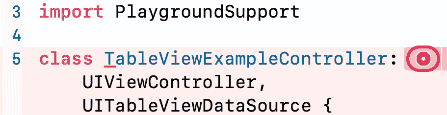

    图 15.1：显示错误图标的编辑区域

1.  出现的错误信息表明缺少 `UITableViewDataSource` 协议所需的两个方法。点击 **修复** 按钮将必需的方法存根添加到类中：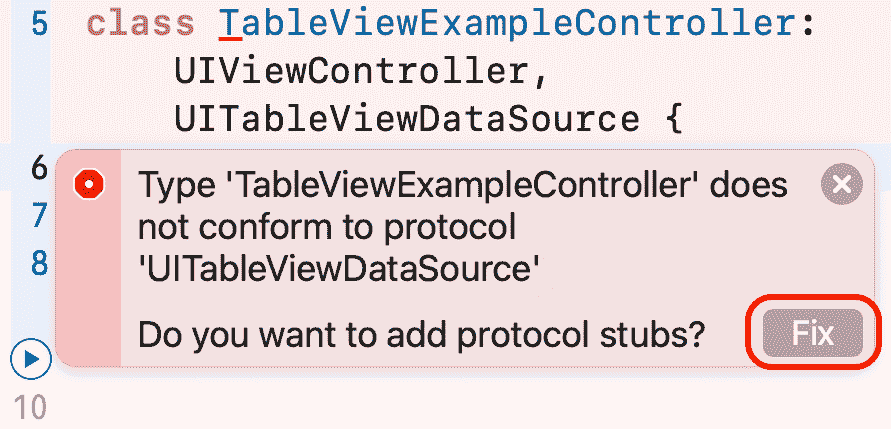

    图 15.2：错误解释和修复按钮

1.  确认你的代码看起来像这样：

    ```swift
    class TableViewExampleController: UIViewController,
    UITableViewDataSource {
       func tableView(_ tableView: UITableView,
       numberOfRowsInSection section: Int) -> Int {
          code
       }
       func tableView(_ tableView: UITableView,
       cellForRowAt indexPath: IndexPath) ->
       UITableViewCell {
          code
       }
       var tableView: UITableView?
       var names: [String] = ["Divij","Aamir","Shubham"]
    }
    ```

1.  在类定义中，惯例规定属性应在任何方法声明之前在顶部声明。重新排列代码，使属性声明在顶部，如下所示：

    ```swift
    class TableViewExampleController: UIViewController,
    UITableViewDataSource {
       var tableView: UITableView?
       var names: [String] = ["Divij","Aamir","Shubham"]
       func tableView(_ tableView: UITableView, 
       numberOfRowsInSection section: Int) -> Int {
    ```

1.  要使表格视图为 `names` 数组中的每个元素显示一行，请在 `tableView(_:numberOfRowsInSection:)` 方法定义中的 `code` 单词处点击，并输入 `names.count`。完成的方法应如下所示：

    ```swift
    func tableView(_ tableView: UITableView, numberOfRowsInSection section: Int) -> Int {
       names.count returns the number of elements inside the names array. Since there are three names in it, this will make the table view display three rows.
    ```

1.  要使表格视图在每个单元格中显示名称，请在`tableView(_:cellForRowAt:)`方法定义中的`code`单词处单击并输入以下内容：

    ```swift
    func tableView(_ tableView: UITableView, cellForRowAt 
    indexPath: IndexPath) -> UITableViewCell {
    cell. Imagine you have 1,000 items to display in a table view. You don't need 1,000 rows containing 1,000 table view cells—you only need just enough to fill the screen. Table view cells that scroll off the top of the screen can be reused to display items that appear at the bottom of the screen. To make sure you are using the right type of cell, you set the reuse identifier to Cell. This reuse identifier will be registered with the table view later.

    ```

    let name = names[indexPath.row]

    ```swift

    The `indexPath` value locates the row in the table view. The first row has an `indexPath` containing section `0` and row `0`. `indexPath.row` returns `0` for the first row, so `name` is assigned the first element in the `names` array.

    ```

    cell.textLabel?.text = name

    ```swift

    This assigns `name` to the `text` property of the table view cell's `textLabel`.

    ```

    return cell

    ```swift

    This returns the table view cell, which is then displayed on the screen.This method is executed for each row in the table view.
    ```

1.  确认你的`TableViewExampleController`类看起来像这样：

    ```swift
    class TableViewExampleController: UIViewController, 
    UITableViewDataSource {
       var tableView: UITableView?
       var names: [String] = ["Divij","Aamir","Shubham"]
       func tableView(_ tableView: UITableView, 
       numberOfRowsInSection section: Int) -> Int {
          names.count
       }
       func tableView(_ tableView: UITableView,
       cellForRowAt indexPath: IndexPath) ->
       UITableViewCell {
          let cell = tableView.dequeueReusableCell(
          withIdentifier: "Cell", for:indexPath) 
          let name = names[indexPath.row]
          cell.textLabel?.text = name 
          return cell
       }
    }
    ```

你已经完成了`TableViewExampleController`类的实现。现在你将编写一个名为`createTableView()`的方法，以创建其实例。在属性声明之后输入以下代码以声明和定义`createTableView()`方法：

```swift
func createTableView() {
   self.tableView = UITableView(frame: CGRect(x: 0, y: 0,
   width: self.view.frame.width, 
   height: self.view.frame.height)) 
   self.tableView?.dataSource = self 
   self.tableView?.backgroundColor = .white 
   self.tableView?.register(UITableViewCell.self,
   forCellReuseIdentifier: "Cell")
   self.view.addSubview(self.tableView!)
}
```

让我们分解一下：

```swift
self.tableView = UITableView(frame: CGRect(x: 0, y: 0, width: self.view.frame.width, height: self.view.frame.height))
```

这将创建一个与包含视图大小完全相同的`UITableView`新实例，并将其分配给`tableView`。

```swift
self.tableView?.dataSource = self
```

这告诉表格视图其数据源是`TableViewExampleController`的一个实例。

```swift
self.tableView?.backgroundColor = .white
```

这将表格视图的背景颜色设置为白色。

```swift
self.tableView?.register(UITableViewCell.self, forCellReuseIdentifier: "Cell")
```

这将表格视图单元格的重用标识符设置为`"Cell"`。此重用标识符将在`tableView(_:cellForRowAt:)`方法中用于识别可重用的单元格。

```swift
self.view.addSubview(self.tableView!)
```

这将表格视图作为子视图添加到`TableViewExampleController`实例的视图中。

现在你必须调用此方法。`UIViewController`类有一个方法`viewDidLoad()`，当其视图被加载时会被调用。此方法由`TableViewExampleController`类继承，你需要重写它以调用`createTableView()`。按照以下步骤操作：

1.  在`createTableView()`方法之前输入以下代码：

    ```swift
    override func viewDidLoad() { 
       super.viewDidLoad() 
       self.view.bounds = CGRect(x: 0, y: 0, 
       width: 375, height: 667)
       createTableView()
    }
    ```

    这设置了实时视图的大小，创建了一个表格视图并将其作为子视图添加到`TableViewExampleController`实例的视图中。然后使用数据源方法来确定要显示多少个表格视图单元格以及每个表格视图单元格中要放置的内容。`tableView(_:numberOfRowsInSection:)`返回`3`，因此显示三行。`tableView(_:cellForRowAt:)`将每个单元格的文本设置为`names`数组中的对应名称。

1.  确认你的完成代码看起来像这样：

    ```swift
    import UIKit
    import PlaygroundSupport
    class TableViewExampleController: UIViewController, 
    UITableViewDataSource {
       var tableView: UITableView?
       var names: [String] = ["Divij","Aamir","Shubham"]
       override func viewDidLoad() { 
          super.viewDidLoad() 
          self.view.bounds = CGRect(x: 0, y: 0, 
          width: 375, height: 667)
          createTableView()
       }
       func createTableView() {
          self.tableView = UITableView(frame: CGRect(x: 0,
          y: 0, width: self.view.frame.width, height: 
          self.view.frame.height)) 
          self.tableView?.dataSource = self 
          self.tableView?.backgroundColor = .white
          self.tableView?.register(UITableViewCell.self, 
          forCellReuseIdentifier: "Cell")
          self.view.addSubview(self.tableView!)
       }
       func tableView(_ tableView: UITableView, 
       numberOfRowsInSection section: Int) -> Int {
          names.count
       }
       func tableView(_ tableView: UITableView,
       cellForRowAt indexPath: IndexPath) ->
       UITableViewCell {
          let cell = tableView.dequeueReusableCell(
          withIdentifier: "Cell", for:indexPath)
          let name = names[indexPath.row]
          cell.textLabel?.text = name 
          return cell
       }
    }
    ```

1.  在 playground 中的所有其他代码之后输入以下内容：

    ```swift
    PlaygroundPage.current.liveView = TableViewExampleController()
    ```

    此命令创建了一个`TableViewExampleController`实例，并在 playground 的实时视图中显示其视图。

1.  运行 playground。如果你看不到表格视图，请点击调整编辑器选项按钮：![图 15.3：调整编辑器选项按钮]

    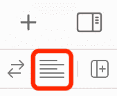

    ![图 15.3：调整编辑器选项按钮]

1.  确保从弹出菜单中选择**实时视图**：![图 15.4：调整带有实时视图选择的编辑器选项菜单]

    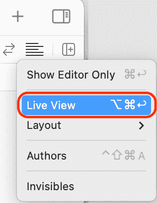

    ![图 15.4：调整带有实时视图选择的编辑器选项菜单]

1.  你将看到表格视图显示一个包含三个名称行的表格，如下所示：

![图 15.5：显示带有名称的表格视图的 playground 实时视图]

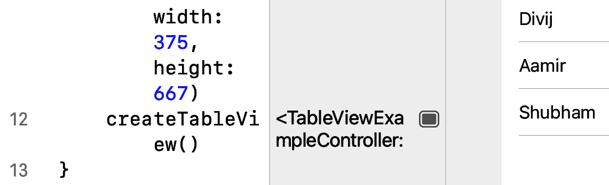

![图 15.5：显示带有名称的表格视图的 playground 实时视图]

太好了！现在你已经知道了表格视图的工作原理，让我们完成**位置**屏幕的实现。你将在下一节中创建这个屏幕的视图控制器，以便它可以管理表格视图将显示的内容。

# 创建`LocationViewController`类

如*第九章*中应用程序导览所示，*设置用户界面*，`locationCell`。根据**模型-视图-控制器**（**MVC**）设计模式，你已经完成了所需的视图，但你还没有完成控制器或模型。

目前，当你点击**探索**屏幕中的**位置**按钮时，会显示一个空白的表格视图：

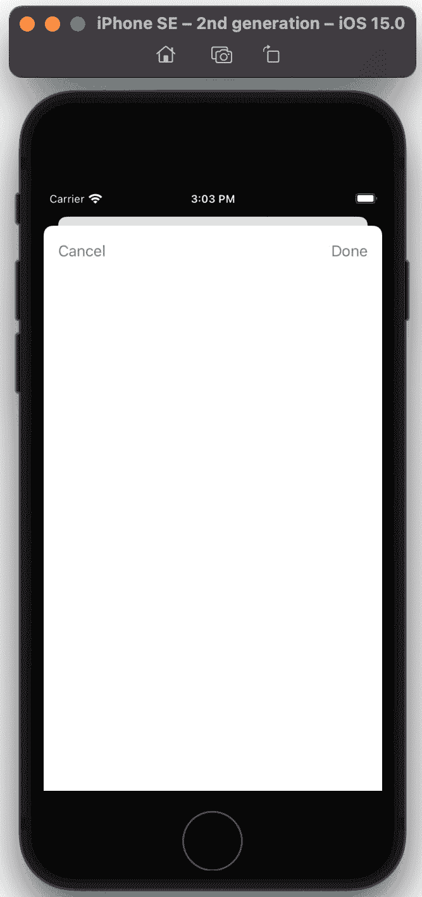

图 15.6：iOS 模拟器显示应用中的位置屏幕

你将创建`LocationViewController`类作为**位置**屏幕的视图控制器，向其中添加一个表格视图的输出端口，并将其配置为表格视图的数据源和代理。按照以下步骤操作：

1.  从上一章打开你的`LetsEat`项目。通过右键点击`LetsEat`文件夹并选择`视图`和`模型`，在项目内创建一个新的文件夹`Location`。完成后，你将看到以下文件夹结构：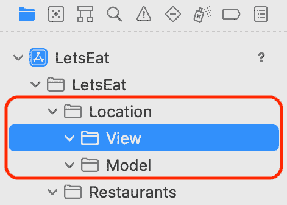

    图 15.7：项目导航器显示位置文件夹和子文件夹

1.  右键点击`Location`文件夹并选择**新建文件**。

1.  **iOS**应该已经选中。选择**Cocoa Touch Class**并点击**下一步**。

1.  使用以下详细信息配置类：

    `LocationViewController`

    `UIViewController`

    `未选中`

    `Swift`

    点击**下一步**。

1.  点击`LocationViewController`文件出现在项目导航器中。

`LocationViewController`文件已经创建，其中包含`LocationViewController`类的声明。现在你将设置当你轻触**位置**按钮时显示的视图控制器场景的标识为此类。按照以下步骤操作：

1.  在项目导航器中打开`Main`故事板文件。

1.  选择当你点击`LocationViewController`时显示的视图控制器场景。注意场景的名称将更改为**Location View Controller Scene**：

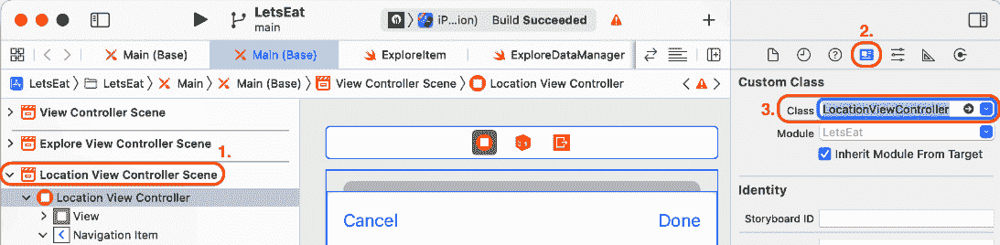

图 15.8：位置视图控制器场景的标识检查器设置

太棒了！在下一节中，让我们将表格视图连接到`LocationViewController`类中的一个输出端口。通过这样做，**位置**屏幕的`LocationViewController`实例将能够管理表格视图。

## 将表格视图连接到`LocationViewController`类

目前，将`LocationViewController`类的实例分配给`LocationViewController`并分配表格视图给它。按照以下步骤操作：

1.  如果需要，点击导航器和检查器按钮以隐藏导航器和检查器区域。

1.  点击调整编辑器选项按钮并从菜单中选择**辅助**。

1.  在`Main`故事板文件中，点击文档大纲中的表格视图。辅助编辑器应设置为**自动 > LocationViewController.swift**，如图所示：![图 15.9：显示`LocationViewController.swift`的辅助编辑器栏

    ![img/Figure_15.09_B17469.jpg]

    图 15.9：显示`LocationViewController.swift`的辅助编辑器栏

1.  *Ctrl + 拖动*从`viewDidLoad()`：![图 15.10：显示`LocationViewController`文件内容的编辑区域

    ![img/Figure_15.10_B17469.jpg]

    图 15.10：显示`LocationViewController`文件内容的编辑区域

1.  在弹出菜单中，在**名称**字段中输入`tableView`并点击**连接**：![图 15.11：创建`tableView`出口的弹出对话框

    ![img/Figure_15.11_B17469.jpg]

    图 15.11：创建`tableView`出口的弹出对话框

1.  验证`tableView`出口是否已添加到`LocationViewController`类并连接到故事板中的表格视图：![图 15.12：显示`LocationViewController`文件内容的编辑区域

    ![img/Figure_15.12_B17469.jpg]

    图 15.12：显示`LocationViewController`文件内容的编辑区域

1.  点击**x**按钮关闭辅助编辑器：

![图 15.13：辅助编辑器关闭按钮

![img/Figure_15.13_B17469.jpg]

图 15.13：辅助编辑器关闭按钮

你已经将表格视图连接到了`LocationViewController`类中的出口。为了使表格视图能够显示数据和响应用户交互，`LocationViewController`类必须遵守`UITableViewDataSource`和`UITableViewDelegate`协议并实现所需的方法。你将在下一节中完成这项工作。

## 添加数据源和委托方法

表格视图的视图控制器必须采用`UITableViewDataSource`和`UITableViewDelegate`协议，并实现所需的方法以允许数据显示和用户交互。在本节中，你将连接`LocationViewController`到表格视图的`dataSource`和`delegate`出口并实现所需的数据源方法。你将在*第十七章**，开始使用 JSON 文件*中实现委托方法。按照以下步骤操作：

1.  如果需要，点击导航器和检查器按钮以显示导航器和检查器区域。

1.  在`Main`故事板文件中，确保你在文档大纲中选择表格视图。点击连接检查器按钮。从`dataSource`和`delegate`出口拖动到文档大纲中的`LocationViewController`图标：![图 15.14：显示`LocationViewController`类出口的连接检查器

    ![img/Figure_15.14_B17469.jpg]

    图 15.14：连接检查器显示`LocationViewController`类的输出端

    这将表格视图连接到`LocationViewController`类的输出端。

1.  验证表格视图的`dataSource`和`delegate`属性是否已连接到`LocationViewController`类的输出端：

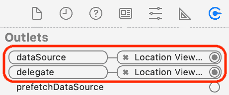


图 15.15：连接检查器已设置数据源和代理输出端

接下来，你将使`LocationViewController`遵守`UITableViewDataSource`协议并实现该协议所需的这些方法。按照以下步骤操作：

1.  在项目导航器中点击`LocationViewController`文件，并从`LocationViewController`类定义中删除所有注释代码，只留下以下内容：

    ```swift
    class LocationViewController: UIViewController {
       @IBOutlet weak var tableView: UITableView!
       override func viewDidLoad(){
          super.viewDidLoad()
       }
    }
    ```

1.  要使`LocationViewController`采用`UITableViewDataSource`协议，在超类名称`UIViewController`后输入逗号，并输入`UITableViewDataSource`。完成操作后，你的代码应如下所示：

    ```swift
    class LocationViewController: UIViewController, 
    UITableViewDataSource {
    ```

1.  由于你尚未实现两个必需的方法，将出现错误。点击错误图标以查看错误信息：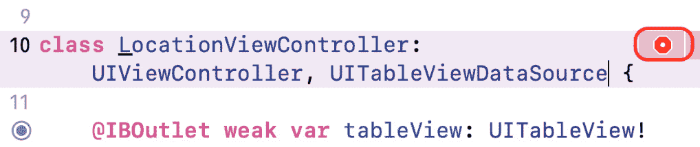

    图 15.16：显示错误图标的编辑区域

1.  点击**修复**按钮将所需的方法存根添加到类中：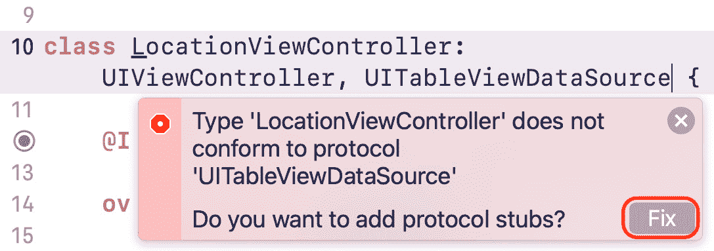

    图 15.17：错误解释和修复按钮

1.  重新排列代码，使属性声明和`viewDidLoad()`方法位于顶部。这遵循了 iOS 开发的一般编码约定，并使你的代码更容易维护。完成操作后，验证你的代码如下所示：

    ```swift
    class LocationViewController: UIViewController, 
    UITableViewDataSource {
       @IBOutlet var tableView: UITableView!
       override func viewDidLoad() {
          super.viewDidLoad()
       }
       func tableView(_ tableView: UITableView,
       numberOfRowsInSection section: Int) -> Int {
          code
       }
       func tableView(_ tableView: UITableView,
       cellForRowAt indexPath: IndexPath) ->
       UITableViewCell {
          code
       }
    }
    ```

1.  在第一个必需的方法内部，点击单词`code`并输入`10`。这将使表格视图显示 10 行。完整的方法应如下所示：

    ```swift
    func tableView(_ tableView: UITableView, numberOfRowsInSection section: Int) -> Int {
       10
    }
    ```

1.  在第二个必需的方法内部，点击单词`code`并输入以下内容，使表格视图在每一行显示字符串`"A Cell"`：

    ```swift
    func tableView(_ tableView: UITableView, cellForRowAt 
    indexPath: IndexPath) -> UITableViewCell {
    locationCell identifier and assigns it to cell. You set this identifier in the Main storyboard file in *Chapter 12*, *Modifying and Configuring Cells*.

    ```

    cell.textLabel?.text = "A Cell"

    ```swift

    This assigns a string, `"A Cell"` to the `text` property of the table view cell's `textLabel`.

    ```

    return cell

    ```swift

    This returns the cell, which is then displayed on the screen. This process is repeated for the number of cells that are given in the first method, which, in this case, is 10.
    ```

构建并运行你的项目。点击如图所示的`A Cell`：

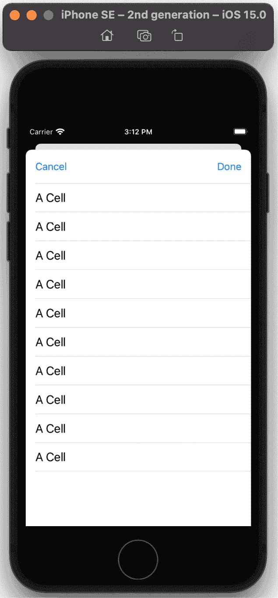


图 15.18：iOS 模拟器显示表格视图单元格

你已经完成了`LocationsViewController`类的实现，并且你的表格视图现在正在显示表格视图单元格。太棒了！现在，既然你的表格视图的视图控制器已经设置好了，让我们在下一节创建一些模型对象，以便为它提供数据。

# 为表格视图添加位置数据

在此阶段，你已经创建并配置了`LocationViewController`类。这个类的实例将作为包含位置数据的`.plist`文件中的表格视图的数据源，但你将从头创建一个，并向其中添加位置数据。按照以下步骤操作：

1.  右键点击`Location`文件夹中的`Model`文件夹，并选择**新建文件**。

1.  在过滤器字段中输入`proper`；**属性列表**将在窗口中显示。选择**属性列表**并点击**下一步**。

1.  将文件命名为`Locations`，然后点击**创建**。

`Locations.plist`文件已添加到项目中。在上一章中，你已经看到了`ExploreData.plist`如何将数据存储为数组字典。你将配置`Locations.plist`，使其以相同的格式存储**位置**屏幕的数据，然后将所有餐厅位置添加到其中。按照以下步骤操作：

1.  点击`Locations.plist`并将其更改为**数组**。注意左侧的展开三角形应指向下方。点击**+**按钮：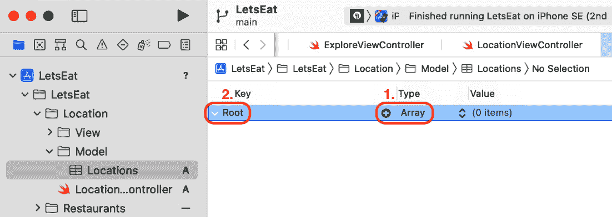

    图 15.19：显示位置.plist 内容的编辑区域

1.  将一个新的条目**项目 0**添加到数组中。将类型更改为**字典**。点击展开三角形使其指向下方。点击**+**按钮：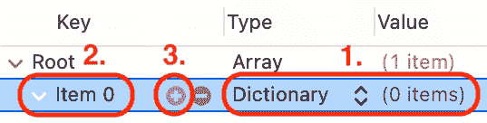

    图 15.20：添加了项目 0 的位置.plist

1.  将一个新的条目**新条目**添加到**项目 0**字典中。点击**+**按钮：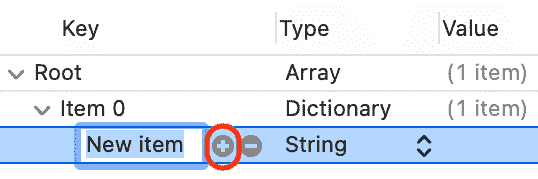

    图 15.21：添加了新条目的位置.plist

1.  将第二个条目添加到`city`，并将值设置为`Aspen`。对于第二个条目，将键更改为`state`，并将值更改为`CO`：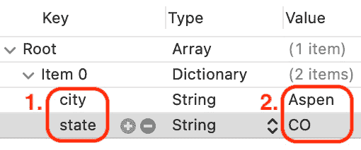

    图 15.22：在项目 0 中添加了城市和州的位置.plist

1.  点击**项目 0**字典旁边的展开三角形以折叠它：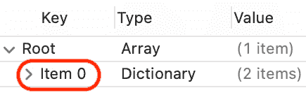

    图 15.23：折叠了项目 0 的位置.plist

1.  选择**项目 0**，然后在键盘上按*Command + C*复制它，并按*Command + V*粘贴。你会看到一个新条目，**项目 1**：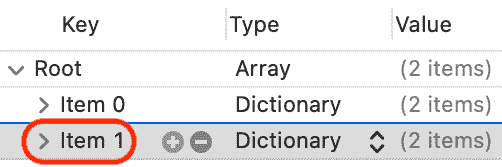

    图 15.24：复制并粘贴了项目 0 的位置.plist

1.  点击`Boston`旁边的展开三角形以及将州设置为`MA`：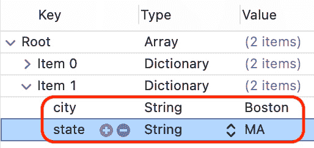

    图 15.25：配置了项目 1 的位置.plist

1.  通过添加以下城市和州继续相同的过程：

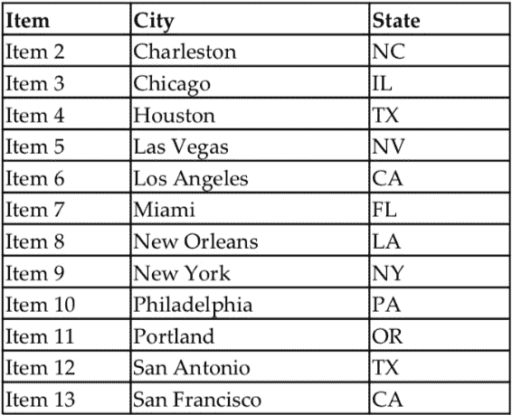

完成的`.plist`文件应如下所示：

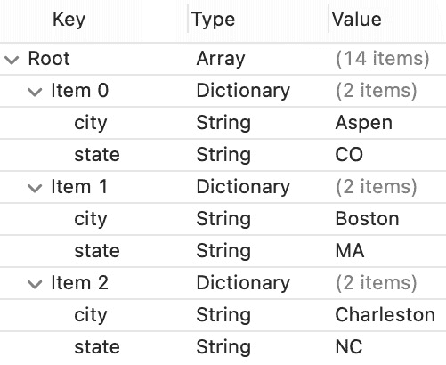

图 15.26：完成的位置.plist

`Locations.plist`文件已完成。在下一节中，你将创建一个数据管理类，类似于上一章中创建的类，该类将读取`Locations.plist`文件并将其提供给**位置**屏幕的`LocationViewController`实例。

# 创建 LocationDataManager 类

如前一章所述，你将创建一个数据管理类，从 `Locations.plist` 加载位置数据，并将其提供给 **Locations** 屏幕的 `LocationsViewController` 实例。然后，这些数据将用于在 **Locations** 屏幕中填充表格视图。按照以下步骤操作：

1.  右键点击 `Location` 文件夹中的 `Model` 文件夹，并选择 **New File**。

1.  **iOS** 应该已经选中。选择 **Swift File** 并点击 **Next**。

1.  将此文件命名为 `LocationDataManager` 并点击 `Create`。

1.  在项目导航器中点击 `LocationDataManager` 文件，在 `import` 语句之后，输入以下内容以声明 `LocationDataManager` 类：

    ```swift
    class LocationDataManager {
    }
    ```

1.  在大括号内，添加一个数组属性 `locations`，用于存储位置列表：

    ```swift
    private var locations: [String] = []
    ```

    `private` 关键字表示 `locations` 属性只能由本类中的方法访问。

1.  在属性声明之后添加以下方法：

    ```swift
    private func loadData() -> [[String: String]] {
       let decoder = PropertyListDecoder()
       if let path = Bundle.main.path(forResource:
       "Locations", ofTypes: "plist"),
       let locationsData = Filemanager.default.contents(
       atPath: path),
       let locations = try? decoder.decode([[String:
       String]].self, from: locationsData) {
          return locations
       }
       return [[:]]
    }
    func fetch() {
       for location in loadData() {
          if let city = location["city"], let
          state = location["state"] {
             locations.append("\(city), \(state)")
          }
       }
    }
    func numberOfLocationItems() -> Int {
       locations.count
    }
    func locationItem(at index: Int) -> String {
       locations[index]
    }
    ```

    这些方法与 `ExploreDataManager` 中的方法类似。让我们分解一下：

    ```swift
    loadData() 
    ```

    加载 `Locations.plist` 的内容，并返回一个字典数组。每个字典存储一个位置的城市和州。

    ```swift
    fetch() 
    ```

    接收 `loadData()` 提供的数组，将每个元素的 `city` 和 `state` 连接起来，并将生成的字符串追加到 `locations` 数组中。

    ```swift
    numberOfLocationItems() 
    ```

    返回 `locations` 数组中的元素数量。

    ```swift
    locationItem(at:) 
    ```

    返回存储在 `locations` 数组给定数组索引处的字符串。

现在 `LocationDataManager` 类已经完成，让我们配置 `LocationViewController` 类，使其能够从 `LocationDataManager` 实例获取数据并将其提供给表格视图。你将在下一节中完成此操作。

## 在表格视图中显示数据

当前是 `"A Cell"`。你将更新 `LocationViewController` 类以使用 `LocationDataManager` 实例作为数据源。按照以下步骤操作：

1.  在项目导航器中点击 `LocationViewController` 文件。在 `LocationViewController` 类定义中 `viewDidLoad()` 方法之前，创建一个 `LocationDataManager` 实例，并将其分配给一个属性 `manager`，输入以下内容：

    ```swift
    let manager = LocationDataManager()
    ```

1.  在 `viewDidLoad()` 方法内部，通过调用 `manager.fetch()` 获取表格视图的数据：

    ```swift
    override func viewDidLoad() { 
       super.viewDidLoad() 
       manager.fetch()
    }
    ```

1.  修改 `tableView(_:numberOfRowsInSection:)` 以从 `manager` 获取表格视图中要显示的行数：

    ```swift
    func tableView(_ tableView: UITableView,
    numberOfRowsInSection section: Int) -> Int {
       manager.numberOfLocationItems()
    }
    ```

1.  修改 `tableView(_:cellForRowAt:)` 如下所示，以便表格视图在每个表格视图中显示包含城市和州的字符串：

    ```swift
    func tableView(_ tableView: UITableView, cellForRowAt
    indexPath: IndexPath) -> UITableViewCell {
       let cell = tableView.dequeueReusableCell(
       withIdentifier: "locationCell", for: indexPath)
       cell.textLabel?.text =
       text property of the table view cell's textLabel to the corresponding element in the locations array. The indexPath returns the section and row number of a particular row in a table view. For example, the first row has an indexPath containing section 0 and row 0. indexPath.row returns 0 for the first row, so manager returns the string stored at index 0 in the locations array. This string is then assigned to the text property of the first table view cell's textLabel.
    ```

构建并运行你的应用。你应该在表格视图中看到来自 `ExploreData.plist` 的位置信息：

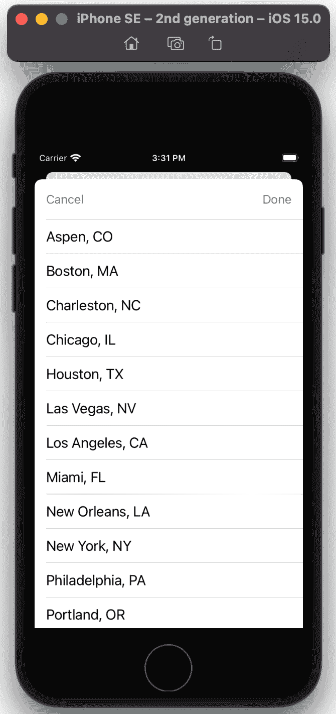

图 15.27：iOS 模拟器显示完成的 **Locations** 屏幕

你已经完成了 **Locations** 屏幕的实现。做得好！

# 摘要

在本章中，你学习了表格视图和表格视图控制器，并在游乐场中实现了一个表格视图的视图控制器。接下来，你从头开始实现了`LocationViewController`类，这是一个用于`.plist`文件的表格视图控制器，名为`Locations.plist`，用于存储位置列表。你创建了一个数据管理类，`LocationDataManager`，用于从`.plist`文件中读取数据。最后，你配置了`LocationViewController`类，使其从`LocationDataManager`实例获取数据，并将其提供给表格视图，以便**位置**屏幕显示餐厅位置列表。

这将使你能够从头开始创建`.plist`文件以存储数据，并实现使用`.plist`文件作为数据源的自定义表格视图。太棒了！

在下一章中，你将为**地图**屏幕添加一个地图视图，并配置它以显示餐厅位置。你还将为**地图**屏幕设置自定义标注，并设置**餐厅详情**屏幕，该屏幕将在标注呼出中的按钮被点击时显示。
