# *第十六章*：开始使用 MapKit

在上一章中，你学习了表格视图和表格视图控制器，并完成了**位置**屏幕的实现。现在它显示餐厅位置的列表。

在本章中，你将在`MKAnnotation`协议上显示餐厅位置，这允许你将你创建的类与特定的地图位置关联起来。你将创建一个新的类`RestaurantItem`，使其符合此协议。接下来，你将创建`MapDataManager`，一个数据管理类，它从`.plist`文件中加载餐厅数据并将其放入`RestaurantItem`实例的数组中。你将创建一个新的`DataManager`协议来读取`.plist`文件，并将`MapDataManager`和`ExploreDataManager`类更新以避免冗余代码（重构）。之后，你将创建一个`MapViewController`类，它是`RestaurantDetailViewController`类的视图控制器，也是`MapViewController`实例的视图控制器。最后，你将使用扩展来清理和组织你的代码，使其更容易阅读和维护。

到本章结束时，你将学会如何创建自定义地图注释视图并将其添加到地图中，如何使用故事板引用将故事板链接在一起，以及如何使用扩展来组织你的代码，使其更容易阅读。

以下内容将涵盖：

+   理解和创建注释

+   向地图视图添加注释

+   从地图视图转到**餐厅详情**屏幕

+   组织你的代码

# 技术要求

你将继续在上一章中修改的`LetsEat`项目上工作。

本章的资源文件和完成的 Xcode 项目位于本书代码包的`Chapter16`文件夹中，可以在此处下载：

[`github.com/PacktPublishing/iOS-15-Programming-for-Beginners-Sixth-Edition`](https://github.com/PacktPublishing/iOS-15-Programming-for-Beginners-Sixth-Edition)

查看以下视频以查看代码的实际效果：

[`bit.ly/3kEKEB7`](https://bit.ly/3kEKEB7)

现在我们来了解地图注释，它们用于在**地图**屏幕上标记餐厅位置。

# 理解和创建注释

在*第十一章**，完成用户界面*中，你向`MKMapView`类添加了一个地图视图。你可以在苹果*地图*应用中看到它的样子。

重要信息

要了解更多关于`MKMapView`的信息，请参阅[`developer.apple.com/documentation/mapkit/mkmapview`](https://developer.apple.com/documentation/mapkit/mkmapview)。

当你构建并运行你的应用时，你将在屏幕上看到一个地图。屏幕上可见的地图部分可以通过设置地图的`region`属性来指定。

重要信息

要了解更多关于区域及其创建方法的信息，请参阅 [`developer.apple.com/documentation/mapkit/mkmapview/1452709-region`](https://developer.apple.com/documentation/mapkit/mkmapview/1452709-region)。

`MKAnnotationView` 类上的图钉。要向地图视图添加图钉，您需要一个遵循 `MKAnnotation` 协议的对象。此协议允许您将一个对象与特定的地图位置关联起来。

重要信息

要了解更多关于 `MKAnnotation` 协议的信息，请参阅 [`developer.apple.com/documentation/mapkit/mkannotation`](https://developer.apple.com/documentation/mapkit/mkannotation)。

任何对象都可以通过实现一个包含地图位置的 `coordinate` 属性来遵循 `MKAnnotation` 协议。可选的 `MKAnnotation` 协议属性包括 `title`，一个包含注释标题的字符串，以及 `subtitle`，一个包含注释副标题的字符串。

当遵循 `MKAnnotation` 协议的对象位于屏幕上可见的地图区域时，地图视图会要求其代理（通常是视图控制器）提供一个相应的 `MKAnnotationView` 类实例。这个实例在地图上显示为一个图钉。

重要信息

要了解更多关于 `MKAnnotationView` 的信息，请参阅 [`developer.apple.com/documentation/mapkit/mkannotationview`](https://developer.apple.com/documentation/mapkit/mkannotationview)。

如果用户滚动地图并且 `MKAnnotationView` 实例离开屏幕，它将被放入重用队列并在稍后回收，类似于表格视图单元格和集合视图单元格的回收方式。`MKAnnotationView` 实例可以自定义以显示自定义图标，并且在被点击时可以显示呼出气泡。呼出气泡可以包含执行动作的按钮，例如显示屏幕。

对于您的应用，您将创建一个新的类，`RestaurantItem`，该类遵循 `MKAnnotation` 协议。让我们看看如何在下一节中创建这个类。

## 创建 RestaurantItem 类

为了在 `RestaurantItem` 上表示餐厅位置，该类遵循 `MKAnnotation` 协议。这个类将有一个 `coordinate` 属性来存储餐厅的位置，一个 `title` 属性来存储餐厅名称，以及一个 `subtitle` 属性来存储它提供的菜系。

您需要设置餐厅位置以设置 `RestaurantItem` 实例的 `coordinate` 属性。餐厅数据（包括其位置）将以 `.plist` 文件的形式提供。在您创建 `RestaurantItem` 类之前，您需要将此 `.plist` 文件导入到您的应用中。按照以下步骤操作：

1.  打开 `LetsEat` 项目。在项目导航器中，右键单击 `LetsEat` 文件夹并创建一个名为 `Map` 的新组。

1.  右键单击 `Map` 文件夹并创建一个名为 `Model` 的新组。

1.  如果你还没有这样做，请从[`github.com/PacktPublishing/iOS-15-Programming-for-Beginners-Sixth-Edition`](https://github.com/PacktPublishing/iOS-15-Programming-for-Beginners-Sixth-Edition)下载完成的项目和项目资源，并在`Chapter16`文件夹中的`resources`文件夹内找到`Maplocations.plist`文件。

1.  将`Maplocations.plist`文件拖动到项目中的`Model`文件夹，并点击它以查看其内容。你会看到它是一个字典数组，每个字典包含一家餐厅的详细信息（包括其位置）。你将在`RestaurantItem`类中创建属性以存储你将使用的数据，这些数据最终将在**餐厅详情**屏幕上显示：


图 16.1：编辑区域显示 MapLocations.plist 的内容

按照以下步骤创建`RestaurantItem`类：

1.  右键点击`Model`文件夹并选择**新建文件**。

1.  **iOS**应该已经选中。选择**Cocoa Touch Class**然后点击**下一步**。

1.  按照以下方式配置文件：

    `RestaurantItem`

    `NSObject`

    `Swift`

    点击**下一步**。

1.  点击`RestaurantItem`文件出现在项目导航器中。

1.  在`RestaurantItem`文件中，在`import UIKit`语句之后输入以下内容以导入`MapKit`框架：

    ```swift
    import MapKit
    ```

    这使你可以访问`MKAnnotation`和`MKMapViewDelegate`等协议。

1.  修改类声明如下以采用`MKAnnotation`协议：

    ```swift
    class RestaurantItem: NSObjectcoordinate property, which is required to conform to MKAnnotation. You will do so shortly.
    ```

1.  在大括号之间输入以下内容：

    ```swift
    let name: String?
    let cuisines: [String]
    let lat: Double?
    let long: Double?
    let address: String?
    let postalCode: String?
    let state: String?
    let imageURL: String?
    let restaurantID: Int?
    ```

    这些属性将保存从`Maplocations.plist`文件获取的数据。让我们看看它们是用来做什么的：

    `name`存储餐厅的名称。

    `cuisines`存储餐厅提供的菜系。

    `lat`和`long`存储餐厅位置的纬度和经度。

    `address`存储餐厅的地址。

    `postalCode`存储餐厅的邮政编码。

    `state`存储餐厅所在的州。

    `imageURL`存储指向餐厅照片的链接。

    `restaurantID`存储用作餐厅标识符的唯一数字。

    注意，你还没有为存储`Maplocations.plist`文件中包含的每个餐厅的详细信息创建属性，这是可以的。你只需要为将在**餐厅详情**屏幕上显示的详细信息创建属性。

1.  你将使用自定义初始化器使用`.plist`文件中的数据初始化`RestaurantItem`实例。在最后一个属性声明之后输入以下内容：

    ```swift
    init(dict: [String: AnyObject]) {
       self.lat = dict["lat"] as? Double
       self.long = dict["long"] as? Double 
       self.name = dict["name"] as? String  
       self.cuisines = dict["cuisines"] as? [String] ?? []
       self.address = dict["address"] as? String
       self.postalCode = dict["postalCode"] as? String
       self.state = dict["state"] as? String 
       self.imageURL = dict["image_url"] as? String
       self.restaurantID = dict["id"] as? Int
    }
    ```

    尽管这个初始化器看起来很复杂，但实际上非常简单。每一行都查找特定的字典项键并将其值分配给相应的属性。例如，第一行查找包含`lat`键的字典项并将其关联的值分配给`lat`属性。

1.  你将使用 `lat` 和 `long` 属性来创建 `coordinate` 属性的值，这是符合 `MKAnnotation` 所必需的。在 `init(dict:)` 方法之后输入以下内容以实现它：

    ```swift
    var coordinate: CLLocationCoordinate2D {
       guard let lat = lat, let long = long else { 
          return CLLocationCoordinate2D() 
       }
       return CLLocationCoordinate2D(latitude: lat,
       longitude: long)
    }
    ```

    `coordinate` 属性的类型是 `CLLocationCoordinate2D`，它包含一个地理位置。`coordinate` 属性的值不是直接分配的；`guard` 语句从 `lat` 和 `long` 属性中获取纬度和经度值，然后用于创建 `coordinate` 属性的值。这样的属性被称为 **计算属性**。

1.  在 `coordinate` 属性之后添加以下代码以实现 `title` 属性：

    ```swift
    var title: String? {
       name
    }
    ```

    `title` 是一个计算属性，它返回 `name` 属性的内容。

1.  最后，在 `title` 属性之后添加以下代码以实现 `subtitle` 属性：

    ```swift
    var subtitle: String? {
       if cuisines.isEmpty { 
          return "" 
       } else if cuisines.count == 1 { 
          return cuisines.first 
       } else { 
          return cuisines.joined(separator: ", ") 
       }
    }
    ```

    `subtitle` 也是一个计算属性。第一行检查 `cuisines` 属性是否为空，如果是，则返回一个空字符串。如果 `cuisines` 属性包含一个项目，则返回该项目。如果 `cuisines` 属性包含多个项目，则每个项目都会添加到一个字符串中，项目之间用逗号分隔。例如，如果 `cuisines` 包含 `["American", "Bistro", "Burgers"]` 数组，生成的字符串将是 `"American, Bistro, Burgers"`。

    你的 `RestaurantItem` 类现在已完成且没有错误，应该看起来像这样：

    ```swift
    import UIKit 
    import MapKit
    class RestaurantItem: NSObject, MKAnnotation {
       let name: String?
       let cuisines: [String]
       let lat: Double?
       let long: Double?
       let address: String?
       let postalCode: String?
       let state: String?
       let imageURL: String?
       let restaurantID: Int?
       init(dict: [String: AnyObject]) {
          self.lat = dict["lat"] as? Double
          self.long = dict["long"] as? Double 
          self.name = dict["name"] as? String  
          self.cuisines = dict["cuisines"] as? [String] 
          ?? []
          self.address = dict["address"] as? String
          self.postalCode = dict["postalCode"] as? String
          self.state = dict["state"] as? String 
          self.imageURL = dict["image_url"] as? String
          self.restaurantID = dict["id"] as? Int
       }
       var coordinate: CLLocationCoordinate2D {
          guard let lat = lat, let long = long else {
             return CLLocationCoordinate2D() 
          }
          return CLLocationCoordinate2D(latitude: lat,
          longitude: long)
       }
       var title: String? {
          name
       }
       var subtitle: String? {
          if cuisines.isEmpty { 
             return "" 
          } else if cuisines.count == 1 { 
             return cuisines.first 
          } else { 
             return cuisines.joined(separator: ", ") 
          }
       }
    }
    ```

到目前为止，你已经将 `Maplocations.plist` 文件添加到你的应用中，并且已经创建了 `RestaurantItem` 类。接下来，让我们创建一个数据管理类，它从 `Maplocations.plist` 文件中读取餐厅数据，并将其放入一个 `RestaurantItem` 实例数组中，以便你的应用使用。

## 创建 MapDataManager 类

如同你在前面的章节中所做的那样，你将创建一个数据管理类，名为 `MapDataManager`，它将从 `Maplocations.plist` 文件中加载餐厅数据，并将数据放入一个 `RestaurantItem` 实例数组中。按照以下步骤操作：

1.  右键点击 `Map` 文件夹内的 `Model` 文件夹，并选择 **新建文件**。

1.  **iOS** 应该已经选中。选择 **Swift 文件** 然后点击 **下一步**。

1.  将此文件命名为 `MapDataManager`。点击项目导航器中出现的 `MapDataManager` 文件。

1.  在 `MapDataManager` 文件中，在 `import` 语句之后添加以下内容以声明 `MapDataManager` 类：

    ```swift
    class MapDataManager {

    }
    ```

1.  在大括号之间添加以下属性以存储从 `.plist` 文件中读取的 `RestaurantItem` 实例：

    ```swift
    private var items: [RestaurantItem] = []
    var annotations: [RestaurantItem] {
       items 
    }
    ```

    `items` 数组将包含 `RestaurantItem` 实例。`private` 使得 `items` 数组只能在 `MapDataManager` 类内部访问，而 `annotations` 是一个计算属性，当访问时返回 `items` 数组的副本。这允许其他对象访问 `items` 数组的内容，但不能修改它。

1.  在属性声明之后添加以下方法以加载`.plist`文件，读取其内部数据，并将其存储在`RestaurantItem`实例数组中：

    ```swift
    private func loadData() -> [[String: AnyObject]] {
       guard let path = Bundle.main.path(forResource:
       "MapLocations", ofType: "plist"), 
       let itemsData = FileManager.default.contents(
       atPath: path),
       let items = try! PropertyListSerialization
       .propertyList(from: itemsData, format: nil) as? 
       [[String: AnyObject]] else {
          return [[:]]
       }
       return items
    } 
    func fetch(completion: (_ annotations: 
    [RestaurantItem]) -> ()){
       if !items.isEmpty { 
          items.removeAll() 
       }
       for data in loadData() {
          items.append(RestaurantItem(dict: data))
       }
       completion(items)
    }
    ```

    `loadData()`和`fetch(completion:)`方法执行与`ExploreDataManager`类中的`loadData()`和`fetch()`方法相同的任务。

    小贴士

    你可能希望重新阅读*第十四章**，将数据添加到集合视图中*，以刷新你对`ExploreDataManager`类的记忆。

然而，这里使用的`loadData()`方法能够返回一个包含字典的数组，其中值是`AnyObject`类型。这是必要的，因为与`ExploreData.plist`文件不同，`MapLocations.plist`文件不仅包含`[String: String]`类型的字典。此外，这里使用的`fetch(completion:)`方法有一个作为参数的完成闭包，它可以接受任何接受`RestaurantItems`数组作为参数的函数或闭包：

```swift
(_ annotations:[RestaurantItem]) -> ())
```

有时候，你不知道一个操作何时会完成。例如，你需要在从互联网下载文件后执行一个动作，但你不知道下载需要多长时间。你可以指定一个完成闭包，一旦操作完成就应用它。在这种情况下，完成闭包将处理`items`数组，一旦`.plist`文件中的所有数据都被读取。

现在再次考虑`MapLocations.plist`文件：

![Figure 16.2: Editor area showing array and dictionaries in MapLocations.plist]

![img/Figure_16.02_B17469.jpg]

图 16.2：显示 MapLocations.plist 中的数组和字典的编辑区域

此文件的结构与`ExploreData.plist`相同。`Root`项是一个包含字典的数组。由于`ExploreData.plist`和`MapLocations.plist`都有一个字典数组，因此如果你能创建一个单一的方法来加载`.plist`文件并在需要的地方使用它，将会更高效。你将在下一节中这样做。

## 创建 DataManager 协议

你将不会在每个类中创建一个方法来加载`.plist`文件，而是创建一个新的协议`DataManager`来处理`.plist`文件加载。此协议将实现一个使用扩展加载`.plist`文件的方法。

小贴士

你可能希望重新阅读*第八章**，协议、扩展和错误处理*，该章节涵盖了协议和扩展。

在你创建了`DataManager`协议之后，任何需要加载`.plist`文件的自定义类都可以采用它。你需要修改`ExploreDataManager`和`MapDataManager`类以采用此协议。按照以下步骤操作：

1.  右键点击`LetsEat`文件夹，创建一个名为`Misc`的新组。

1.  右键点击`Misc`文件夹，选择**新建文件**。

1.  **iOS**应该已经选中。选择**Swift 文件**然后点击**下一步**。

1.  将此文件命名为`DataManager`。点击**创建**。

1.  在项目导航器中点击 `DataManager` 文件，并声明 `DataManager` 协议如下：

    ```swift
    import Foundation
    loadPlist(file:) that takes a string as a parameter and returns an array of dictionaries. The string will hold the name of the .plist file to be loaded.
    ```

1.  在协议声明之后添加一个扩展，包含 `loadPlist(file:)` 方法的实现：

    ```swift
    import Foundation
    protocol DataManager {
       func loadPlist(file name: String) -> 
       [[String: AnyObject]]
    }
    loadPlist(file:) method. This method looks for a .plist file specified in the name parameter inside the application bundle. If the file is not found, an empty array of dictionaries is returned. Otherwise, the contents of the .plist file are loaded into an array of dictionaries of type [String: AnyObject] and returned. 
    ```

现在您有了这个协议，您将修改 `MapDataManager` 和 `ExploreDataManager` 类以采用它。当您将现有代码修改为更有效地完成相同的事情时，这个过程被称为 **重构**。

在下一节中，您将开始重构 `MapDataManager` 类以符合 `DataManager` 协议。

## 重构 MapDataManager 类

`MapDataManager` 类已经有一个 `loadData()` 方法，它被硬编码为读取 `Maplocations.plist`。现在您已经创建了 `DataManager` 协议，您将修改 `MapDataManager` 类以使用它。按照以下步骤操作：

1.  在项目导航器中选择 `MapDataManager` 文件，找到并删除 `loadData()` 方法。您会看到一个错误，因为 `fetch()` 方法调用了您刚刚删除的 `loadData()` 方法。您将在稍后修复这个问题。

1.  将 `DataManager` 协议添加到类声明中，如下所示：

    ```swift
    class MapDataManagerloadPlist(file:) method available to the MapDataManager class.
    ```

1.  将 `fetch()` 方法中的 `for data in loadData()` 行按照以下方式修改以修复错误：

    ```swift
    for data in MapDataManager class should look like this:

    ```

    import Foundation

    class MapDataManager: DataManager {

    private var items: [RestaurantItem] = []

    var annotations: [RestaurantItem] {

    items

    }

    func fetch(completion: (_ annotations:

    [RestaurantItem]) -> ()){

    if !items.isEmpty {

    items.removeAll()

    }

    for data in loadPlist(file: "MapLocations") {

    items.append(RestaurantItem(dict: data))

    }

    completion(items)

    }

    }

    ```swift

    ```

错误应该已经消失了。在下一节中，您将同样重构 `ExploreDataManager` 类以使其符合 `DataManager` 协议。

## 重构 ExploreDataManager 类

与 `MapDataManager` 类类似，`ExploreDataManager` 类也有一个 `loadData()` 方法，它被硬编码为读取 `ExploreData.plist`。

提示

您可能希望重新阅读 *第十四章*，“将数据放入集合视图”，以刷新您对 `ExploreDataManager` 类的记忆。

您需要将 `ExploreDataManager` 类中与 `MapDataManager` 类相同的更改进行修改。按照以下步骤操作：

1.  在项目导航器中选择 `ExploreDataManager` 文件，找到并删除 `loadData()` 方法。忽略错误，因为它将在稍后修复。

1.  将 `DataManager` 协议添加到类声明中，如下所示：

    ```swift
    class ExploreDataManagerloadPlist(file:) method available to the ExploreDataManager class.
    ```

1.  按照以下方式修改 `fetch()` 方法以修复错误：

    ```swift
       func fetch() {
          for data in data is cast as [String: String] so that it can be used to initialize instances of the ExploreItem class.You can now make any class that needs to load a `.plist` file containing an array of dictionaries adopt the `DataManager` protocol, as you did here with the `MapDataManager` and `ExploreDataManager` classes. It's not always clear when you should refactor, but the more experience you have, the easier it becomes. One indication that you need to refactor is when you are writing the same code in more than one class.
    ```

你已经完成了 `MapDataManager` 类的实现，创建了 `DataManager` 协议，并将 `MapDataManager` 和 `ExploreDataManager` 类重构为符合此协议。使用 `MapDataManager` 类，你可以从 `MapLocations.plist` 文件加载数据，并返回一个 `RestaurantItem` 实例数组。现在，让我们看看如何使用这个数组向地图视图添加标记，这些标记将在 **Map** 屏幕上显示为图钉。

# 向地图视图添加标记

在 *第十一章**，完成用户界面*，你向项目中添加了地图视图到 `MapLocations.plist` 文件，并创建了 `RestaurantItem` 和 `MapDataManager` 类。还记得 MVC 设计模式吗？在这个阶段，你已经创建了 **Map** 屏幕的视图和模型，所以你现在只需要视图控制器。

视图控制器将负责以下任务：

+   向地图视图添加符合 `MKAnnotation` 协议的 `RestaurantItem` 实例。

+   对于地图视图中显示的区域内的 `RestaurantItem` 实例，提供地图视图请求的 `MKAnnotationView` 实例。

+   提供自定义的 `MKAnnotationView` 实例，当点击时显示包含按钮的呼出气泡，并在按钮点击时显示 **Restaurant Detail** 屏幕。

你将首先创建 `MapViewController` 类，作为下一节中 **Map** 屏幕的视图控制器。

## 创建 MapViewController 类

你已经为 `MapViewController` 创建了视图和模型对象，使其成为 **Map** 屏幕的视图控制器。按照以下步骤操作：

1.  右键点击 `Map` 文件夹，选择 **New File**。

1.  **iOS** 应已选中。选择 **Cocoa Touch Class** 然后点击 **Next**。

1.  按照以下方式配置文件：

    `MapViewController`

    `UIViewController`

    `Swift`

    点击 **Next**。

1.  在项目导航器中点击 `MapViewController` 文件。

1.  在 `MapViewController` 文件中，在 `import UIKit` 之后添加以下行以导入 `MapKit` 框架：

    ```swift
    import MapKit
    ```

1.  修改类声明如下，使 `MapViewController` 类采用 `MKMapViewDelegate` 协议：

    ```swift
    class MapViewController: UIViewController, 
    MKMapViewDelegate {
    ```

你已经声明了 `MapViewController` 类。在下一节中，你将把这个类指定为 **Map** 屏幕的视图控制器，并为地图视图创建一个出口。

## 连接地图视图的出口

为 `MapViewController` 类创建视图控制器场景，使其成为 **Map** 屏幕的视图控制器，并为地图视图添加一个出口。按照以下步骤操作：

1.  点击 `Main` 故事板文件。点击 `MapViewController`：![Figure 16.3: Identity inspector showing Class setting for MapViewController

    ![img/Figure_16.03_B17469.jpg]

    ![Figure 16.3: Identity inspector showing Class setting for MapViewController]

1.  在文档大纲中选择 **Map View**：![Figure 16.4: Document outline with Map View selected]

    ![img/Figure_16.04_B17469.jpg]

    图 16.4：选择地图视图的文档大纲

1.  点击调整编辑器选项按钮。

1.  在弹出菜单中选择辅助选项。

1.  辅助编辑器出现，显示了`MapViewController`文件的内容。从地图视图*Ctrl + 拖动*到类声明下方空隙：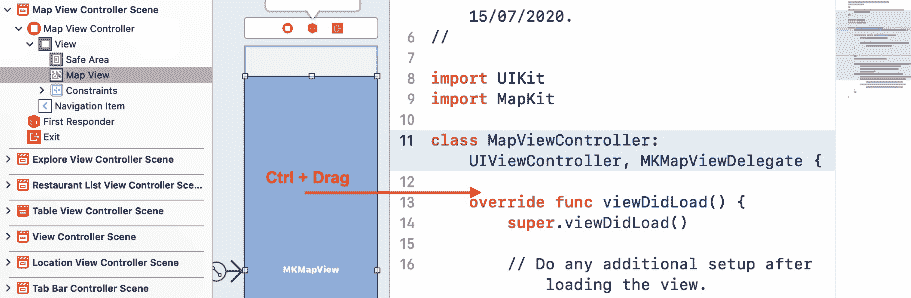

    图 16.5：显示 MapViewController 文件内容的编辑器区域

1.  在**名称**字段中输入`mapView`并点击**连接**：

    图 16.6：创建 mapView 输出端口时的弹出对话框

1.  地图视图已连接到`MapViewController`类中的`mapView`输出端口。点击**x**按钮关闭辅助编辑器：

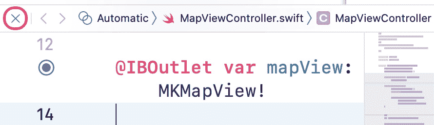

图 16.7：辅助编辑器关闭按钮

`MapViewController`类现在有一个输出端口`mapView`，通过添加一个基于餐厅位置生成新区域的方法将其链接到`MapDataManager`类中的地图视图，因此它可以提供地图区域以供地图视图显示。

## 设置要显示的地图视图区域

在地图视图中，屏幕上可见的地图部分称为区域。要指定一个区域，你需要该区域中心点的坐标以及表示要显示的地图尺寸的水平和垂直跨度。

`MapDataManager`类中的`fetch(completion:)`方法返回一个`RestaurantItem`实例数组。你将实现一个方法`initialRegion(latDelta:longDelta:)`，从该数组中获取第一个`RestaurantItem`实例，获取餐厅的坐标，并使用它们来创建一个区域。按照以下步骤操作：

1.  在项目导航器中点击`MapDataManager`文件。在`import Foundation`语句之后，添加`import MapKit`。

1.  在关闭花括号之前，实现`initialRegion(latDelta:longDelta:)`方法如下：

    ```swift
    func initialRegion(latDelta: CLLocationDegrees, 
    longDelta: CLLocationDegrees) -> MKCoordinateRegion {
       guard let item = items.first else {
          return MKCoordinateRegion()
       }
       let span = MKCoordinateSpan(latitudeDelta: 
       latDelta, longitudeDelta: longDelta)
       return MKCoordinateRegion(center: item.coordinate,
       span: span)
    }
    ```

    让我们分解一下：

    ```swift
    func initialRegion(latDelta: CLLocationDegrees, longDelta: CLLocationDegrees) -> MKCoordinateRegion
    ```

    此方法接受两个参数并返回一个`MKCoordinateRegion`实例。`latDelta`指定要显示的地图区域的北到南距离（以度为单位）。一度大约是 69 英里。`longDelta`指定要显示的地图区域的东到西距离（以度为单位）。返回的`MKCoordinateRegion`实例确定将在屏幕上显示的区域。

    ```swift
    guard let item = items.first else { return MKCoordinateRegion() }
    ```

    `guard`语句从`RestaurantItem`实例数组中获取第一个项目并将其分配给`item`。如果数组为空，则返回一个空的`MKCoordinateRegion`实例。

    ```swift
    let span = MKCoordinateSpan(latitudeDelta: latDelta, longitudeDelta: longDelta)
    ```

    `latDelta`和`longDelta`用于创建一个`MKCoordinateSpan`实例，这是要创建的区域水平和垂直跨度。

    ```swift
    return MKCoordinateRegion(center: item.coordinate, span: span)
    ```

    使用`item`的坐标属性和`MKCoordinateSpan`实例创建并返回一个`MKCoordinateRegion`实例。

现在，地图区域已经确定，你可以根据它们的 `coordinate` 属性确定哪些 `RestaurantItem` 实例位于此区域。记住，`RestaurantItem` 类符合 `MKAnnotation`。作为地图视图的视图控制器，`MapViewController` 类负责为该区域内的任何 `RestaurantItem` 实例提供 `MKAnnotationView` 实例。

在下一节中，你将修改 `MapViewController` 类以提供地图视图显示区域内的 `RestaurantItem` 实例的 `MKAnnotationViews`。

## 在地图视图中显示 MKAnnotationView 实例

到目前为止，你已经有 `MapViewController` 类来管理 `MapDataManager` 类中的 `initialRegion(latDelta:longDelta:)` 方法上的地图视图，以设置地图区域。现在，你将修改 `MapViewController` 类以从 `MapDataManager` 类获取 `RestaurantItem` 实例的数组并将其添加到地图视图中。按照以下步骤操作：

1.  在项目导航器中点击 `MapViewController` 文件并删除注释代码。

1.  在 `mapView` 属性声明之后，添加以下代码以创建 `MapDataManager` 类的实例并将其分配给 `manager`：

    ```swift
    private let manager = MapDataManager() 
    ```

1.  在 `viewDidLoad()` 之后添加以下方法。此方法将 `RestaurantItem` 实例（符合 `MKAnnotation` 协议）添加到地图视图中：

    ```swift
    func setupMap(_ annotations: [RestaurantItem]) {
       mapView.setRegion(manager.initialRegion(
       latDelta: 0.5, longDelta: 0.5), animated: true)
       mapView.addAnnotations(manager.annotations)
    }
    ```

    `setupMap(_:)` 方法接受一个参数 `annotations`，它是一个 `RestaurantItem` 实例的数组。它使用 `MapDataManager` 类的 `initialRegion(latDelta:longDelta:)` 方法设置地图视图要显示的区域，然后将 `annotations` 数组中的每个 `RestaurantItem` 实例添加到地图视图中。然后，地图视图的代理（在本例中为 `MapViewController` 类）自动为该区域内的每个 `RestaurantItem` 实例提供 `MKAnnotationView` 实例。

1.  在 `setupMap(_:)` 方法之前添加以下方法。此方法调用 `MapDataManager` 实例的 `fetch(completion:)` 方法，并将 `setupMap(_:)` 方法作为完成闭包传入：

    ```swift
    func initialize() {
       manager.fetch {(annotations) in
       setupMap(annotations)}
    }
    ```

    `fetch(completion:)` 方法加载 `MapLocations.plist` 文件，并创建并将 `RestaurantItem` 实例的数组分配给 `items` 数组。`annotations` 属性返回 `items` 数组的副本。然后，该数组由传入作为完成闭包的 `setupMap(_:)` 方法处理。

1.  在 `viewDidLoad()` 中调用 `initialize()` 方法，以便在地图视图加载时调用：

    ```swift
    override func viewDidLoad() { 
       super.viewDidLoad() 
       initialize()
    }
    ```

构建并运行应用程序。你应该在 **地图** 屏幕上看到图钉（`MKAnnotationView` 实例）：

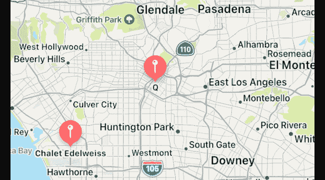

图 16.8：iOS 模拟器显示标准 MKAnnotationView 实例

在地图区域中为每个 `RestaurantItem` 实例添加了一个 `MKAnnotationView` 实例。每个 `MKAnnotationView` 实例由一个图钉表示。你现在地图上有显示餐厅位置的图钉，但需要添加代码来显示应用导览中所示的定制图钉。你将在下一节中完成这项工作。

## 创建自定义 `MKAnnotationView` 实例

目前，`MKAnnotationView` 实例看起来像图钉。你可以用自定义图像替换标准图钉图像。`Assets.xcassets` 文件中有一个自定义图像，你将配置 `MapViewController` 类使用它。这将使屏幕上的图钉与应用导览中的图钉相匹配。你还将配置每个图钉，以便在点击时显示呼出气泡。按照以下步骤操作：

1.  在项目导航器中点击 `MapViewController` 文件。

1.  在 `initialize()` 方法中，在开括号之后添加以下代码。这使得 `MapViewController` 类成为地图视图的代理：

    ```swift
    func initialize() {
       mapView.delegate = self
    ```

1.  在 `setupMap(_:)` 方法之后添加以下方法。此方法为地图视图显示区域内的每个 `MKAnnotation` 实例返回一个自定义的 `MKAnnotationView` 实例：

    ```swift
    func mapView(_ mapView: MKMapView, viewFor annotation:
    MKAnnotation) -> MKAnnotationView? {
       let identifier = "custompin"
       guard !annotation.isKind(of: MKUserLocation.self)
       else { 
          return nil 
       }
       let annotationView: MKAnnotationView
       if let customAnnotationView = 
       mapView.dequeueReusableAnnotationView(
       withIdentifier: identifier) {
          annotationView = customAnnotationView 
          annotationView.annotation = annotation
       } else {
          let av = MKAnnotationView(annotation: 
          annotation, reuseIdentifier: identifier)
          av.rightCalloutAccessoryView = 
          UIButton(type: .detailDisclosure)
          annotationView = av
       }
       annotationView.canShowCallout = true 
       if let image = UIImage(named: 
            "custom-annotation") {
                annotationView.image = image 
                annotationView.centerOffset = CGPoint(
                x: -image.size.width / 2, 
                y: -image.size.height / 2)
       }
       return annotationView
    }
    ```

    让我们分解一下：

    ```swift
    func mapView(_ mapView: MKMapView, viewFor 
    annotation: MKAnnotation) -> MKAnnotationView?
    ```

    这是 `MKMapViewDelegate` 协议中指定的委托方法之一。当 `MKAnnotation` 实例位于地图区域内时，它会触发，并返回一个 `MKAnnotationView` 实例，用户将在屏幕上看到它。你将使用此方法用自定义图钉替换默认图钉。

    ```swift
    let identifier = "custompin"
    ```

    常量 `identifier` 被分配了 `"custompin"` 字符串。这将作为重用标识符。

    ```swift
    guard !annotation.isKind(of: MKUserLocation.self) 
    else { 
       return nil 
    }
    ```

    除了你指定的注释外，`MKMapView` 实例还会为用户位置添加一个注释。这个 `guard` 语句检查注释是否是用户位置。如果是，则返回 `nil`，因为用户位置不是餐厅位置。

    ```swift
    let annotationView: MKAnnotationView
    ```

    `annotationView` 是 `MKAnnotationView` 类型的常量。你创建这个常量是为了稍后配置和返回它。

    ```swift
    if let customAnnotationView = 
    mapView.dequeueReusableAnnotationView (withIdentifier:
    identifier) { 
       annotationView = customAnnotationView 
       annotationView.annotation = annotation
    }
    ```

    `if` 语句检查是否有任何现有的注释最初是可见的，但现在不再在屏幕上。如果有，那个注释的 `MKAnnotationView` 实例可以被重用，并分配给 `annotationView` 变量。`annotation` 参数被分配给 `annotationView` 的 `annotation` 属性。

    ```swift
    else {
       let av = MKAnnotationView(annotation: annotation, 
       reuseIdentifier: identifier) 
       av.rightCalloutAccessoryView = 
       UIButton(type: .detailDisclosure)
       annotationView = av
    }
    ```

    如果没有可重用的现有`MKAnnotationView`实例，将执行`else`子句。使用之前指定的重用标识符（`custompin`）创建一个新的`MKAnnotationView`实例。通过调用配置`MKAnnotationView`实例。当你点击地图上的标记时，会出现一个调用气泡，显示标题（餐厅名称）、副标题（菜系）和一个按钮。你将在稍后编程按钮以呈现你刚刚创建的`MKAnnotationView`实例，在调用气泡中显示额外信息，并将自定义图像设置为存储在`Assets.xcassets`中的`custom-annotation`图像。当添加自定义图像时，注释使用图像的中心作为标记点，因此使用`centerOffset`属性设置标记点的正确位置，位于标记的尖端。

    ```swift
    return annotationView
    ```

    返回自定义的`MKAnnotationView`实例。

构建并运行你的应用。你可以在地图上看到自定义的标记：

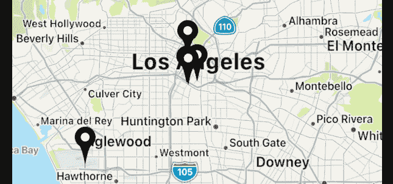

图 16.9：iOS 模拟器显示自定义 MKAnnotationView 实例

你已经使用从`MapDataManager`类获取的数据配置了`MKAnnotationView`实例。点击标记会显示一个调用气泡，显示餐厅名称和它提供的菜系。调用气泡中的按钮目前不起作用。你将在下一节中配置按钮以呈现**餐厅详情**屏幕。

# 从地图屏幕切换到餐厅详情屏幕

`MKAnnotationView`实例，点击一个会显示一个调用气泡，显示餐厅详情。调用气泡中的按钮目前不起作用。

在你之前下载的`resources`文件夹中，你会找到名为`RestaurantDetail.Storyboard`、`PhotoFilter.Storyboard`和`ReviewForm.Storyboard`的完成的故事板，你需要将这些故事板添加到你的项目中。这些故事板包含了**餐厅详情**屏幕、**照片滤镜**屏幕和**评论表单**屏幕的场景。

将`RestaurantDetail`故事板文件呈现出来。你将在下一节中这样做。

## 创建和配置故事板引用

`Main`故事板文件中有许多场景。随着你的项目增长，你会发现跟踪应用中的所有场景更具挑战性。管理这些场景的一种方法是为它们创建额外的故事板文件，并使用故事板引用来链接它们。你将添加`RestaurantDetail`、`PhotoFilter`和`ReviewForm`故事板文件到你的项目中，并且你将使用故事板引用将`Main`故事板文件链接到`RestaurantDetail`故事板文件。按照以下步骤将故事板引用添加到你的项目中：

1.  打开`Main`故事板文件，并点击库按钮。

1.  在过滤器字段中输入`story`。一个**Storyboard Reference**对象将出现在结果中。

1.  将`Main`故事板文件拖动到**地图视图控制器场景**旁边：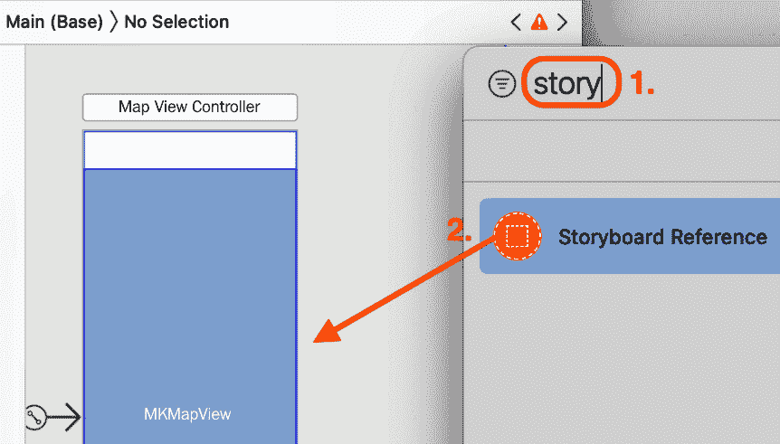

    图 16.10：选择 Storyboard Reference 对象的库

1.  打开您之前下载的`resources`文件夹，并找到您将添加到项目中的三个故事板文件（`RestaurantDetail.storyboard`、`PhotoFilter.storyboard`和`ReviewForm.storyboard`）：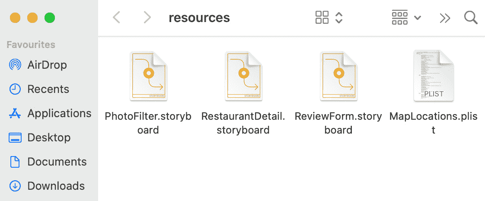

    图 16.11：资源文件夹的内容

1.  在项目导航器中，在您的`LetsEat`文件夹内创建一个名为`RestaurantDetail`的新文件夹，并将`RestaurantDetail`故事板文件复制到其中：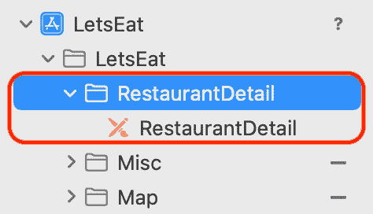

    图 16.12：项目导航器显示 RestaurantDetail 文件夹及其内容

1.  在您的`LetsEat`文件夹内创建一个名为`ReviewForm`的新文件夹，并将`ReviewForm`故事板文件复制到其中，然后在您的`LetsEat`文件夹内创建一个名为`PhotoFilter`的新文件夹，并将`PhotoFilter`故事板文件复制到其中：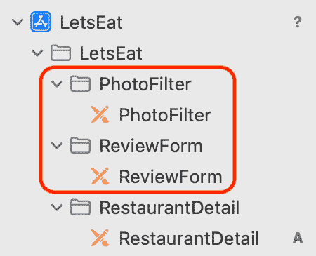

    图 16.13：项目导航器显示 PhotoFilter 和 ReviewForm 文件夹及其内容

1.  现在您将为之前添加到项目中的 Storyboard Reference 分配`RestaurantDetail`故事板文件。点击`Main`故事板文件，选择您之前添加的故事板引用，并点击属性检查器按钮。在`RestaurantDetail`下：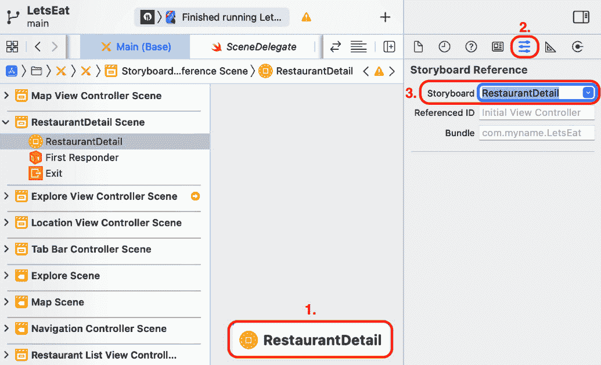

    图 16.14：RestaurantDetail 故事板引用的属性检查器设置

1.  从**地图**屏幕中`MKAnnotationView`实例的呼出气泡按钮处*Ctrl + 拖动*。

1.  您将为这个转场设置一个标识符。稍后，当呼出气泡按钮被点击时，您将添加一个使用此标识符执行转场的方法。选择连接**地图视图控制器场景**到故事板引用的转场：

    图 16.16：地图视图控制器场景和 RestaurantDetail 故事板引用之间的转场

1.  在属性检查器中，在`showDetail`下：

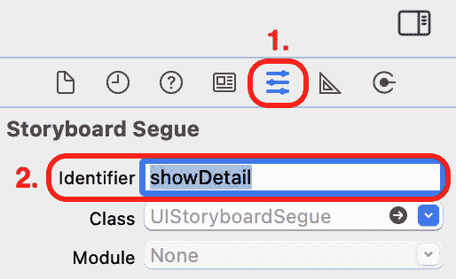

图 16.17：showDetail 转场的属性检查器设置

现在，您已经使用转场将**地图**屏幕的视图控制器场景与**餐厅详情**屏幕的视图控制器场景链接起来。在下一节中，您将实现一个方法，当呼出气泡按钮被点击时，显示**餐厅详情**屏幕。

## 执行 showDetail 转场

你已经链接了`showDetail`的视图控制器场景。现在你需要一个方法来执行这个转换，但在实现它之前，你将创建一个包含此项目所有转换标识符的枚举。这通过在你稍后代码中输入转换标识符时启用自动完成来减少潜在的错误。按照以下步骤操作：

1.  在`LetsEat`文件夹内的`Misc`文件夹上右键点击并选择**新建文件**。

1.  **iOS**应该已经选中。选择**Swift 文件**然后点击**下一步**。

1.  将此文件命名为`Segue`。点击后，`Segue`文件将出现在项目导航器中。

1.  在`import`语句之后添加以下内容以声明和定义`Segue`枚举：

    ```swift
    enum Segue: String { 
       case showDetail 
       case showRating 
       case showReview
       case showAllReviews 
       case restaurantList 
       case locationList 
       case showPhotoReview 
       case showPhotoFilter
    }
    ```

    注意，`Segue`枚举的类型是`String`，因此每个情况的原始值都是字符串。例如，`showDetail`情况的原始值是`"showDetail"`。

现在你可以添加一个方法，当点击呼出气泡按钮时执行`showDetail`转换。在项目导航器中点击`MapViewController`文件，并在`setupMap(_:)`方法之后添加以下方法：

```swift
func mapView(_ mapView: MKMapView, annotationView view: 
MKAnnotationView, calloutAccessoryControlTapped control: 
UIControl) {
   self.performSegue(withIdentifier: 
   Segue.showDetail.rawValue, sender: self)
}
```

`mapView(_:annotationView:calloutAccessoryControlTapped:)`是`MKMapViewDelegate`协议中指定的一种方法。当用户点击呼出气泡按钮时，它会触发。

`self.performSegue(withIdentifier: Segue.showDetail.rawValue, sender: self)`使用`"showDetail"`标识符执行转换，显示**餐厅详情**屏幕。

构建并运行你的项目。在**地图**屏幕上，点击一个标记并点击呼出气泡内的按钮：

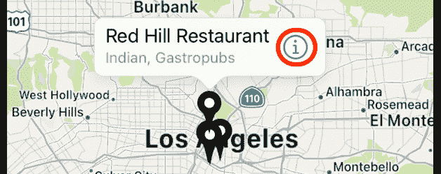

图 16.18：iOS 模拟器显示呼出气泡按钮

新的**餐厅详情**屏幕出现，但它不包含任何关于餐厅的详细信息：

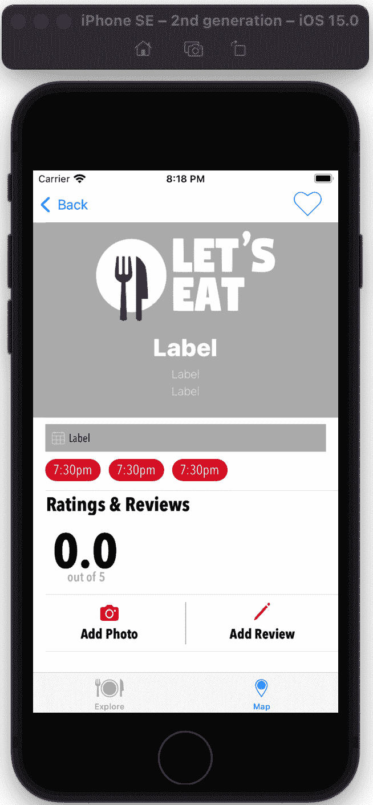

图 16.19：iOS 模拟器显示餐厅详情屏幕

你将使**餐厅详情**屏幕显示在第*第十八章**，静态表格视图中的数据展示*中餐厅的详细信息，但现在，让我们只是将所选餐厅的数据传递到**餐厅详情**屏幕的视图控制器，并将其打印到调试区域。你将在下一节中这样做。

## 将数据传递到餐厅详情屏幕

当点击时显示呼出气泡的`MKAnnotationView`实例。当呼出气泡中的按钮被点击时，将`RestaurantItem`实例传递到尚未创建的**餐厅详情**屏幕的视图控制器。按照以下步骤现在创建它：

1.  在`RestaurantDetail`文件夹上右键点击并选择**新建文件**。

1.  **iOS**应该已经选中。选择**Cocoa Touch 类**然后点击**下一步**。

1.  按照以下方式配置文件：

    `RestaurantDetailViewController`

    `UITableViewController`

    `Swift`

    点击**下一步**。

1.  点击`RestaurantDetailViewController`文件出现在项目导航器中。

1.  删除所有注释代码。你的文件应该看起来像这样：

    ```swift
    import UIKit
    class RestaurantDetailViewController: 
    UITableViewController {
       override func viewDidLoad() {
          super.viewDidLoad()
       }
    }
    ```

1.  在`viewDidLoad()`方法之前声明一个名为`selectedRestaurant`的属性：

    ```swift
    var selectedRestaurant: RestaurantItem?
    ```

    这个属性保存了将被从`MapViewController`实例传递到`RestaurantDetailViewController`实例的`RestaurantItem`实例：

1.  在`viewDidLoad()`方法中关闭花括号之前添加以下代码，以将`RestaurantItem`实例的内容打印到调试区域：

    ```swift
    dump(selectedRestaurant as Any)
    ```

    这确认了`MapViewController`实例已成功将`RestaurantItem`实例传递给`RestaurantDetailViewController`实例。

1.  确认你的文件看起来像以下这样：

    ```swift
    import UIKit
    class RestaurantDetailViewController: UITableViewController {
       var selectedRestaurant: RestaurantItem?
       override func viewDidLoad() { 
          super.viewDidLoad() 
          dump(selectedRestaurant as Any)
       }
    }
    ```

1.  在`RestaurantDetail`文件夹内点击`RestaurantDetail`故事板文件。选择`RestaurantDetailViewController`：![Figure 16.20: Identity inspector settings for Restaurant Detail View Controller scene

    ![img/Figure_16.20_B17469.jpg]

    图 16.20：餐厅详情视图控制器场景的标识检查器设置

    注意场景名称将更改为**餐厅详情视图控制器场景**。

1.  在项目导航器中点击`MapViewController`文件。

1.  在`private let manager = MapDataManager()`语句之后添加一个属性来保存`RestaurantItem`实例：

    ```swift
    var selectedRestaurant: RestaurantItem?
    ```

1.  在`func mapView(_:annotationView:calloutAccessoryControlTapped:)`方法中，在调用`self.performSegue(withIdentifier:sender:)`方法之前添加以下代码：

    ```swift
    func mapView(_ mapView: MKMapView, annotationView 
    view: MKAnnotationView, calloutAccessoryControlTapped 
    control: UIControl){
    RestaurantItem instance associated with MKAnnotationView instance that was tapped and assigns it to selectedRestaurant.
    ```

1.  要从`MapViewController`实例将`RestaurantItem`实例传递到`RestaurantDetailViewController`实例，你需要重写名为`prepare(for:sender:)`的`UIViewController`方法。在`viewDidLoad()`之后输入以下代码：

    ```swift
    override func prepare(for segue: UIStoryboardSegue, sender: Any?){
       switch segue.identifier! {
          case Segue.showDetail.rawValue:
             showRestaurantDetail(segue: segue)
          default:
             print("Segue not added")
       }
    }
    ```

    在切换到另一个视图控制器之前，视图控制器会执行`prepare(for:sender:)`方法。在这种情况下，这个方法在调用`showDetail`之前被调用，在这种情况下，`showRestaurantDetail(segue:)`方法被调用。这个方法将为`RestaurantDetailViewController`实例设置`selectedRestaurant`属性。你会看到一个错误，因为`showRestaurantDetail(segue:)`还没有被创建。

1.  在`setupMap(_:)`方法之后添加以下代码以实现`showRestaurantDetail(segue:)`：

    ```swift
    func showRestaurantDetail(segue: UIStoryboardSegue) {
       if let viewController = segue.destination as? 
       RestaurantDetailViewController, let restaurant = 
       selectedRestaurant {
          viewController.selectedRestaurant = restaurant
       }
    }
    ```

    这确保了过渡目标是`RestaurantDetailViewController`实例。如果是，临时常量`restaurant`被分配了`MapViewController`实例中的`selectedRestaurant`属性。然后`restaurant`被分配给`RestaurantDetailViewController`实例中的`selectedRestaurant`属性。

    换句话说，从`RestaurantItem`实例获取的餐厅详情被传递到`RestaurantDetailViewController`实例。

构建并运行你的应用。在 **地图** 屏幕上，点击一个标记并然后点击呼叫按钮。**餐厅详情** 屏幕将出现。点击报告导航器并点击如图所示的第一个条目。你应该在编辑器区域看到餐厅的详细信息：

![Figure 16.21：报告导航器显示第一个条目的内容

![img/Figure_16.21_B17469.jpg]

图 16.21：报告导航器显示第一个条目的内容

你已经为 `RestaurantDetailViewController` 实例添加了故事板，现在它有了在 **地图** 屏幕上选择的 `RestaurantItem` 实例的数据。太好了！你将在下一章配置 **餐厅详情** 屏幕以显示这些数据。

你在本章中做了很多工作，所以在你进入下一章之前，让我们组织你编写的代码，使其更容易理解。你将在下一节中使用扩展来完成此操作。

# 组织你的代码

随着你的程序变得更加复杂，你将使用扩展（在第 *第八章**，协议、扩展和错误处理）来组织你的代码。扩展可以帮助你使代码更易于阅读并避免杂乱。

你将组织四个类：`ExploreViewController`、`RestaurantListViewController`、`LocationViewController` 和 `MapViewController`。你将使用扩展将相关代码块分离。让我们从下一节中的 `ExploreViewController` 类开始。

## 重构 `ExploreViewController` 类

你将使用扩展将 `ExploreViewController` 文件中的代码划分为不同的部分。按照以下步骤操作：

1.  在项目导航器中点击 `ExploreViewController` 文件。在最后的括号闭合之后，添加以下内容：

    ```swift
    // MARK: Private Extension
    private extension ExploreViewController {
       // code goes here
    }
    // MARK: UICollectionViewDataSource
    extension ExploreViewController: 
    UICollectionViewDataSource {
       // code goes here
    }
    ```

    在这里，你正在创建两个扩展。第一个扩展将是私有的，这意味着这个扩展的内容只能被 `ExploreViewController` 类访问。第二个扩展将包含所有的 `UICollectionViewDataSource` 方法。

1.  你会得到一个错误，因为 `UICollectionViewDataSource` 出现在两个地方。从文件顶部的类声明中删除 `UICollectionViewDataSource`。你的类声明应该看起来像这样：

    ```swift
    class ExploreViewController: UIViewController, UICollectionViewDelegate {
    ```

1.  将所有 `UICollectionViewDataSource` 方法移动到第二个扩展中。它应该看起来像这样：

    ```swift
    // MARK: UICollectionViewDataSource
    extension ExploreViewController: 
    UICollectionViewDataSource {
       viewDidLoad() as clean as possible, you will create an initialize() method inside the private extension, and put everything you need to initialize the view controller in there. After that, you will call initialize() in viewDidLoad(). 
    ```

1.  在 `private` 扩展内添加 `initialize()` 方法：

    ```swift
    func initialize() {
       manager.fetch()
    }
    ```

1.  将 `unwindLocationCancel(segue:)` 方法也移动到 `private` 扩展内部。

1.  确认私有扩展看起来如下：

    ```swift
    // MARK: Private Extension
    private extension ExploreViewController {
       func initialize() {
          manager.fetch()
       }
       @IBAction func unwindLocationCancel(segue:
       UIStoryboardSegue) {
       }
    }
    ```

1.  最后，按照以下方式修改 `viewDidLoad()`：

    ```swift
    override func viewDidLoad() { 
       super.viewDidLoad() 
       initialize()
    }
    ```

这种方式分离代码的好处现在可能并不明显，但随着你的类变得更加复杂，你会发现查找特定方法以及维护代码变得更加容易。在你对其他文件做同样操作之前，让我们看看下一节中 `// MARK:` 语法是如何使用的。

## 使用 `// MARK:` 语法

`// MARK:` 语法用于在代码的不同部分之间轻松导航。让我们看看它做了什么：

1.  查看位于工具栏下方可见的路径，并点击显示的部分：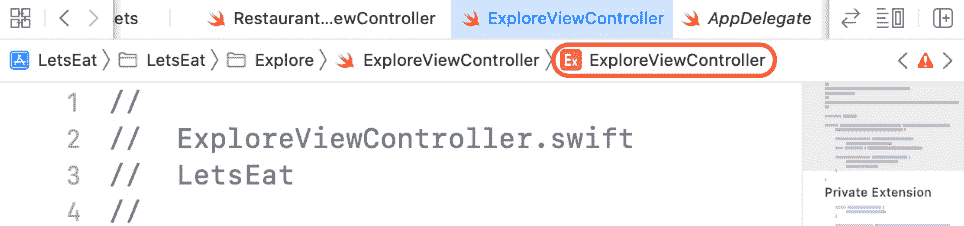

    

    图 16.22：显示路径的编辑区域

1.  将显示一个菜单，你将看到 `// MARK:` 语法。这使你能够轻松跳转到这些部分：

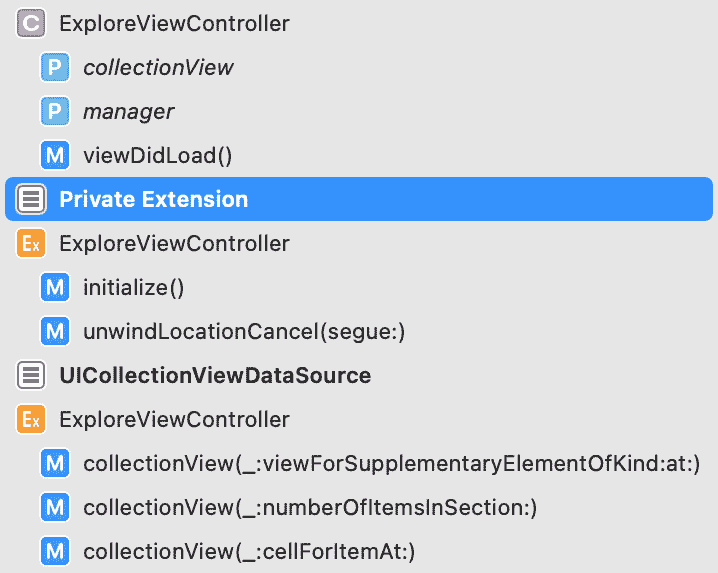


图 16.23：选择 Private 扩展的路径菜单

你已经组织了 `ExploreViewController` 类，接下来让我们通过重构并添加扩展来处理 `RestaurantListViewController` 类。

## 重构 `RestaurantListViewController` 类

你将为 `RestaurantListViewController` 类添加两个扩展，类似于你在 `ExploreViewController` 类中添加的。按照以下步骤操作：

1.  在项目导航器中点击 `RestaurantListViewController` 文件。在最后的括号闭合之后，添加以下内容：

    ```swift
    // MARK: Private Extension
    private extension RestaurantListViewController {
       // code goes here
    }
    // MARK: UICollectionViewDataSource 
    extension RestaurantListViewController: 
    UICollectionViewDataSource {
       // code goes here
    }
    ```

    你将在第一个扩展中放置 `RestaurantListViewController` 类的私有方法，并在第二个扩展中放置所有的 `UICollectionViewDataSource` 方法。

1.  从文件顶部的类声明中删除 `UICollectionViewDataSource`。你的类声明应该看起来像这样：

    ```swift
    class RestaurantListViewController: UIViewController, UICollectionViewDelegate {
    ```

1.  将所有的 `UICollectionViewDataSource` 方法移动到第二个扩展中。完成后的样子应该是这样的：

    ```swift
    // MARK: UICollectionViewDataSource extension 
    RestaurantListViewController: 
    UICollectionViewDataSource {
    func collectionView(_ collectionView: 
    UICollectionView, numberOfItemsInSection 
       section: Int) -> Int {
          1
       }
    func collectionView(_ collectionView: 
    UICollectionView, cellForItemAt indexPath: 
       IndexPath) -> UICollectionViewCell {
          collectionView.dequeueReusableCell(
    withReuseIdentifier: "restaurantCell", 
          for: indexPath)
       }
    }
    ```

你已经完成了 `RestaurantListViewController` 类的组织，接下来让我们在下一节中清理 `LocationViewController` 类。

## 重构 `LocationViewController` 类

如同之前一样，你将在 `LocationViewController` 文件中添加两个扩展。按照以下步骤操作：

1.  在项目导航器中点击 `LocationViewController` 文件。在最后的括号闭合之后，添加以下内容：

    ```swift
    // MARK: Private Extension
    private extension LocationViewController {
       // code goes here
    }
    // MARK: UITableViewDataSource
    extension LocationViewController: 
    UITableViewDataSource {
       // code goes here
    }
    ```

    第一个扩展将包含 `LocationViewController` 类的私有方法。第二个扩展将包含所有的 `UITableViewDataSource` 方法。

1.  从文件顶部的类声明中删除 `UITableViewDataSource`。你的类声明应该看起来像这样：

    ```swift
    class LocationViewController: UIViewController {
    ```

1.  将所有的 `UITableViewDataSource` 方法移动到第二个扩展中。完成后的样子应该是这样的：

    ```swift
    // MARK: UITableViewDataSource
    extension LocationViewController: UITableViewDataSource 
    {
       func tableView(_ tableView: UITableView, 
       numberOfRowsInSection section: Int) -> Int {
          manager.numberOfLocationItems()
       }
       func tableView(_ tableView: UITableView, 
    cellForRowAt indexPath: IndexPath) -> 
       UITableViewCell {
          let cell = tableView.dequeueReusableCell(
          withIdentifier: "locationCell", for: indexPath)
    cell.textLabel?.text = 
          manager.locationItem(at: indexPath.row)
          return cell
       }
    }
    ```

1.  就像你在 `ExploreViewController` 类中所做的那样，你将在第一个扩展中创建一个 `initialize()` 方法，并将初始化 `LocationViewController` 类所需的所有内容放入其中。在第一个扩展中添加以下内容：

    ```swift
    // MARK: Private Extension
    private extension LocationViewController {
       func initialize() {
          manager.fetch()
       }
    }
    ```

1.  按照以下方式修改 `viewDidLoad()` 方法以调用 `initialize()` 方法：

    ```swift
    override func viewDidLoad() { 
       super.viewDidLoad() 
       initialize()
    }
    ```

你已经完成了 `LocationViewController` 类的组织，接下来让我们在下一节中清理 `MapViewController` 类。

## 重构 `MapViewController` 类

如同之前对其他类所做的，你将为 `MapViewController` 类添加两个扩展。按照以下步骤操作：

1.  在项目导航器中点击 `MapViewController` 文件。在最后的括号闭合之后，添加以下内容：

    ```swift
    // MARK: Private Extension
    private extension MapViewController {
       // code goes here
    }
    // MARK: MKMapViewDelegate
    extension MapViewController: MKMapViewDelegate {
       // code goes here
    }
    ```

    第一个扩展将包含 `MapViewController` 类的私有方法。第二个将包含所有的 `MKMapViewDelegate` 方法。

1.  从文件顶部的类声明中删除 `MKMapViewDelegate`。你的类定义应该看起来像这样：

    ```swift
    class MapViewController: UIViewController {
    ```

1.  将所有 `MKMapViewDelegate` 方法移动到第二个扩展中。它应该看起来像这样：

    ```swift
    // MARK: MKMapViewDelegate
    extension MapViewController: MKMapViewDelegate {
    func mapView(_ mapView: MKMapView, annotationView 
    view: MKAnnotationView, 
       calloutAccessoryControlTapped control: UIControl){
    guard let annotation = 
    mapView.selectedAnnotations.first else 
    { 
    return 
          }
    selectedRestaurant = annotation as? 
    RestaurantItem 
    self.performSegue(withIdentifier: 
          Segue.showDetail.rawValue, sender: self)
       }
    func mapView(_ mapView: MKMapView, viewFor 
       annotation:MKAnnotation) -> MKAnnotationView? {
          let identifier = "custompin"
    guard !annotation.isKind(of: 
    MKUserLocation.self) else { 
    return nil 
          }
          let annotationView: MKAnnotationView
          if let customAnnotationView = mapView.
    dequeueReusableAnnotationView(withIdentifier: 
    identifier) { 
    annotationView = customAnnotationView 
             annotationView.annotation = annotation
          } else {
    let av = MKAnnotationView(annotation: 
             annotation, reuseIdentifier: identifier)
    av.rightCalloutAccessoryView = 
             UIButton(type: .detailDisclosure)
             annotationView = av
          }
          annotationView.canShowCallout = true
          if let image = UIImage(named: "custom-
    annotation") { 
             annotationView.image = image
    annotationView.centerOffset = 
    CGPoint(x: -image.size.width / 2, 
             y: -image.size height / 2 )
          }
          return annotationView
       }
    }
    ```

1.  将 `initialize()`, `setupMap(_:)`, 和 `showRestaurantDetail(segue:)` 方法移动到第一个扩展中。它应该看起来像这样：

    ```swift
    // MARK: Private Extension
    private extension MapViewController {
    func initialize() { 
    mapView.delegate = self 
    manager.fetch { (annotations) in 
          setupMap(annotations) }
       }
       func setupMap(_ annotations: [RestaurantItem]) {
          mapView.setRegion(manager.currentRegion(
          latDelta: 0.5, longDelta: 0.5), animated: true)
          mapView.addAnnotations(manager.annotations)
       }
       func showRestaurantDetail(segue:UIStoryboardSegue){
          if let viewController = segue.destination as?
    RestaurantDetailViewController, let restaurant 
          = selectedRestaurant {
    viewController.selectedRestaurant 
             = restaurant
          }
       }
    }
    ```

你已经使用扩展组织了所有四个视图控制器（`ExploreViewController`, `RestaurantListViewController`, `LocationViewController`, 和 `MapViewController`）。做得好！

# 摘要

在本章中，你创建了一个新的类，`RestaurantItem`，它符合 `MKAnnotation` 协议。接下来，你创建了 `MapDataManager`，一个数据管理类，它从 `.plist` 文件中加载数据并将其放入 `RestaurantItem` 实例的数组中。你创建了 `DataManager` 协议，并将 `MapDataManager` 和 `ExploreDataManager` 类重构为使用此协议。之后，你创建了 `MapViewController` 类，它是 `RestaurantDetailViewController` 类的视图控制器，也是 `MapViewController` 实例的视图控制器。此时，你知道如何创建符合 `MKAnnotation` 协议的对象，如何将它们添加到地图视图中，以及如何创建自定义的 `MKAnnotationViews`，这使你能够将标注地图添加到自己的项目中。

你还向项目中添加了故事板文件，学习了如何使用故事板引用，并使用扩展组织了你的视图控制器类（`ExploreViewController`, `RestaurantListViewController`, `LocationViewController`, 和 `MapViewController`）。这将帮助你组织大型项目的故事板和代码，使其更容易阅读和维护。

在下一章中，你将学习关于 **JSON** 文件的知识，以及如何从它们中加载数据，以便 **餐厅列表** 和 **地图** 屏幕可以显示特定餐厅的详细信息。
