# *第十七章*: 开始使用 JSON 文件

在上一章中，您配置了 `.plist` 文件。您为每个餐厅位置配置了自定义注释，并在其中配置了呼出按钮，以便在点击时显示**餐厅详情**屏幕。您还使用扩展来组织代码，使其更容易阅读和维护。

在本章中，您将使用存储在 `.plist` 文件中的数据。接下来，您将配置 `LocationViewController` 类以在用户在 `ExploreViewController` 实例中选择位置时存储该位置，当选择一种菜系时，`ExploreViewController` 类将传递所选位置和菜系到 `RestaurantListViewController` 实例。最后，`RestaurantListViewController` 类将被修改以从与所选位置和菜系对应的 JSON 文件中获取餐厅列表并显示在**餐厅列表**屏幕上。

到本章结束时，您将了解如何从 JSON 文件中加载数据并进行解析，以便在自己的应用中使用。您还将学习关于 `UITableViewDelegate` 方法以及如何从一个视图控制器传递数据到另一个视图控制器的方法。

以下内容将涵盖：

+   从 JSON 文件中获取数据

+   在您的应用中使用来自 JSON 文件的数据

+   配置 `MapDataManager` 实例以使用来自 `RestaurantDataManager` 实例的数据

+   存储用户选择的地点

+   将位置和菜系信息传递给 `RestaurantListViewController` 实例

# 技术要求

您将继续在上一章中修改的 `LetsEat` 项目上工作。

本章的资源文件和完成的 Xcode 项目位于本书代码包的 `Chapter17` 文件夹中，可在此处下载：

[`github.com/PacktPublishing/iOS-15-Programming-for-Beginners-Sixth-Edition`](https://github.com/PacktPublishing/iOS-15-Programming-for-Beginners-Sixth-Edition)

观看以下视频以查看代码的实际运行情况：

[`bit.ly/3Hl8Ulz`](https://bit.ly/3Hl8Ulz)

让我们从学习如何读取和解析 JSON 文件以获取用于应用中的数据开始。

# 从 JSON 文件中获取数据

在*第十四章**，将数据加载到集合视图中*，您学习了如何加载文件，使用数据管理类从文件中读取数据，并将其放入应用中的对象中。在本章中，您也将做同样的事情，不同的是，您将读取来自 JSON 文件而不是 `.plist` 文件的数据。这将模拟从在线基于 Web 的服务中读取数据，其中 JSON 是一种常用的格式。让我们先了解更多关于 JSON 文件以及它们是如何工作的信息。

## 理解 JSON 格式

JavaScript 对象表示法 (JSON) 是一种在文件中结构化数据的方式，既可以被人阅读，也可以被计算机读取。许多 iOS 应用通过与在线基于 Web 的服务合作来访问 JSON 文件，这些文件随后被用来为应用提供数据。

在本章中，您将不会学习如何连接到在线服务。相反，您将使用从 [`opentable.herokuapp.com`](http://opentable.herokuapp.com) 下载的示例 JSON 文件，这些文件已被 Craig Clayton 为本书修改。您将看到，处理 JSON 文件与处理 `.plist` 文件类似。

为了帮助您理解 JSON 格式，您需要将示例 JSON 文件添加到您的项目中，并查看其中一个的结构。按照以下步骤操作：

1.  在项目导航器中，在 `Misc` 文件夹内创建一个新的组，并将其命名为 `JSON`。

1.  如果您尚未下载本章的项目文件，请从以下链接下载：[`github.com/PacktPublishing/iOS-15-Programming-for-Beginners-Sixth-Edition`](https://github.com/PacktPublishing/iOS-15-Programming-for-Beginners-Sixth-Edition).

1.  解压文件夹，打开 `Chapter17` 文件夹中的 `resources` 文件夹。您应该在里面看到几个 JSON 文件。

1.  将所有 JSON 文件拖放到您刚刚创建的 `JSON` 文件夹中。

1.  在出现的屏幕上点击 **完成**。

1.  每个 JSON 文件都包含特定城市的餐厅详细信息。点击 `Charleston.json`，您应该看到以下内容：


图 17.1：显示 `Charleston.json` 内容的编辑区域

如您所见，文件以一个开方括号开始，文件内的每个项目都由包含餐厅信息的键值对组成，这些键值对被花括号包围，并用逗号分隔。在文件的最后，您可以看到一个闭方括号。方括号表示数组，花括号表示字典。换句话说，JSON 文件包含一个字典数组，这与您之前使用过的 `.plist` 文件完全相同。

现在您已经看到了 JSON 文件的样子，让我们在下一节创建一个数据管理类，以便将数据从 JSON 文件加载到您的应用中。

## 创建 `RestaurantDataManager` 类

您已经学会了如何在 *第十四章* “将数据放入集合视图” 中创建一个数据管理类来从 `.plist` 文件加载数据。现在，您将创建 `RestaurantDataManager`，这是一个数据管理类，用于从您之前添加到项目中的 JSON 文件加载数据。您将看到，从 JSON 文件加载数据将与从 `.plist` 文件加载数据类似。

重要信息

要了解更多关于解析 JSON 文件的信息，请观看这里可用的视频：[`developer.apple.com/videos/play/wwdc2017/212/`](https://developer.apple.com/videos/play/wwdc2017/212/).

在您创建 `RestaurantDataManager` 类之前，您需要修改 `RestaurantItem` 类，使其符合 `Decodable` 协议。采用此协议允许您使用 `JSONDecoder` 类，通过 JSON 文件中的数据填充 `RestaurantItem` 实例。

重要信息

要了解更多关于 Decodable 和 JSON 解码器类的信息，请查看以下链接：

[`developer.apple.com/documentation/foundation/archives_and_serialization/encoding_and_decoding_custom_types`](https://developer.apple.com/documentation/foundation/archives_and_serialization/encoding_and_decoding_custom_types)

[`developer.apple.com/documentation/foundation/jsondecoder`](https://developer.apple.com/documentation/foundation/jsondecoder)

要修改`RestaurantItem`类以使其符合`Decodable`协议，请按照以下步骤操作：

1.  在项目导航器中，点击`Map`文件夹中`Model`文件夹内的`RestaurantItem`文件。修改`RestaurantItem`类的声明以采用`Decodable`协议，如下所示：

    ```swift
    class RestaurantItem: NSObject, MKAnnotation, 
    Decodable {
    ```

1.  删除`init()`方法并添加以下枚举以使`RestaurantItem`类符合`Decodable`协议：

    ```swift
    enum CodingKeys: String, CodingKey {
       case name
       case cuisines 
       case lat
       case long 
       case address
       case postalCode = "postal_code" 
       case state
       case imageURL = "image_url"
       case restaurantID = "id"
    }
    ```

    `CodingKeys`枚举将`RestaurantItem`类的属性与 JSON 文件中的键匹配。这允许`JSONDecoder`实例从 JSON 文件中获取值并将它们分配给`RestaurantItem`类中的属性。如果键名与属性名不匹配，你可以将键映射到属性，如前一个代码块中所示，对于`postalCode`、`imageURL`和 restaurantID。

    修改`RestaurantItem`类后，你将在`MapDataManager`文件中的`fetch(completion:)`方法中看到一个错误。不用担心，你将在下一节中修复它。

现在让我们创建`RestaurantDataManager`类，它将读取 JSON 文件并将数据放入一个`RestaurantItem`实例数组中。按照以下步骤操作：

1.  右键点击`Restaurants`文件夹，创建一个名为`Model`的新组。然后右键点击`Model`文件夹并选择**New File**。

1.  **iOS**应该已经选中。选择**Swift File**然后点击**Next**。

1.  将此文件命名为`RestaurantDataManager`。点击`RestaurantDataManager`文件出现在项目导航器中。

1.  在`import`语句之后添加以下内容以声明`RestaurantDataManager`类：

    ```swift
    class RestaurantDataManager {

    }
    ```

1.  在大括号之间添加以下属性以保存一个`RestaurantItem`实例数组：

    ```swift
    private var restaurantItems: [RestaurantItem] = []
    ```

    `restaurantItems`数组将存储从 JSON 文件中获取的`RestaurantItem`实例。`private`关键字表示它只能从这个类内部访问。

1.  在`restaurantItems`属性之后添加以下方法以读取 JSON 文件并返回一个`RestaurantItem`实例数组：

    ```swift
    func fetch(location: String, selectedCuisine: 
    String = "All", completionHandler: (_ 
    restaurantItems: [RestaurantItem]) -> Void) { 
       if let file = Bundle.main.url(forResource: 
       location, withExtension: "json") {
          do {
             let data = try Data(contentsOf: file)
             let restaurants = try JSONDecoder().decode(
             [RestaurantItem].self, from: data)
             if selectedCuisine != "All" {
                restaurantItems = restaurants.filter {
                  ($0.cuisines.contains(selectedCuisine))
                }
             } else { 
                restaurantItems = restaurants 
             }
          } catch {
             print("There was an error \(error)")
          }
       }
       completionHandler(restaurantItems)
    }
    ```

    让我们分解一下：

    ```swift
    func fetch(location: String, selectedCuisine: 
    String = "All", completionHandler: (_ restaurantItems:
    [RestaurantItem]) -> Void)
    ```

    此方法接受三个参数：`location`，一个包含餐厅位置的字符串，`selectedCuisine`，一个包含用户选择的菜系的字符串，以及`completionHandler`，一个闭包，用于在方法执行完毕后处理此方法的执行结果。如果您不提供`selectedCuisine`的值，它将默认为`"All"`。

    ```swift
    if let file = Bundle.main.url(forResource: location, 
    withExtension: "json")
    ```

    这将获取应用包中 JSON 文件的网络地址并将其分配给`file`。

    `do`代码块：

    第一条语句尝试将`file`的内容分配给`data`。下一条语句尝试使用`JSONDecoder`实例解析`data`并将其存储为`RestaurantItem`实例数组，该数组被分配给`restaurants`。在下一条语句中，如果`selectedCuisine`不是`All`，则使用`{($0.cuisines.contains(selectedCuisine))}`闭包将`filter`方法应用于`restaurants`数组。这导致一个`RestaurantItem`实例数组，其中`cuisines`属性包含用户选择的菜系，并将此数组分配给`restaurantItems`。否则，整个`restaurants`数组被分配给`restaurantItems`。

    `catch`代码块：

    如果`do`代码块失败，此操作将在调试区域打印错误信息。

    ```swift
    completionHandler(items)
    ```

    此语句使用提供的闭包处理`restaurantItems`数组。

    注意，当你使用 Xcode 调用此方法时，自动完成功能会给你两个可能的选择；一个包含`selectedCuisine:`参数（该参数包含所选菜系字符串）的选项，另一个不包含（`selectedCuisine`设置为全部）。

1.  在`fetch(location:selectedCuisine:completionHandler:)`方法之后添加一个方法，返回`restaurantItems`数组中的项目数量：

    ```swift
    func numberOfRestaurantItems() -> Int {
       restaurantItems.count
    }
    ```

    你将调用此方法来确定在**餐厅列表**屏幕中显示的收集视图单元格的数量。

1.  在`numberOfRestaurantItems()`方法之后添加一个方法，从`restaurantItems`数组中返回索引提供的`RestaurantItem`实例：

    ```swift
    func restaurantItem(at index: Int) -> 
    RestaurantItem {
       restaurantItems[index]
    }
    ```

    你将调用此方法来配置**餐厅列表**屏幕中每个收集视图单元格的内容。

已创建`RestaurantDataManager`类，它允许你读取存储在`JSON`文件中的数据并将其放入`RestaurantItem`实例数组中。在使用它之前，你需要相当大幅度地修改你的项目。让我们看看在下一节中显示**地图**和**餐厅列表**屏幕所需的条件。

# 在你的应用中使用来自 JSON 文件的数据

让我们回顾一下应用的工作原理。在**地图**屏幕中，用户将看到用户位置附近的全部餐厅。点击餐厅将显示一个呼出气泡，点击呼出按钮将显示该餐厅的详细信息在**餐厅详情**屏幕中。

在**探索**屏幕中，用户将点击**位置**按钮并在**位置**屏幕上选择一个位置，例如**查尔斯顿，北卡罗来纳州**。选择位置后，用户点击**完成**按钮，将返回到**探索**屏幕。然后，用户将在**探索**屏幕中选择一个菜系，该位置提供该菜系的餐厅列表将在**餐厅列表**屏幕中显示。点击餐厅将显示该餐厅的详细信息在**餐厅详情**屏幕中。

你需要执行以下操作：

+   配置`MapViewController`类，以便从 JSON 文件而不是`.plist`文件中获取餐厅列表。这将修复`MapDataManager`类中的`fetch(completion:)`方法的错误。

+   配置`LocationViewController`类以存储用户选定的位置。

+   将选定的位置传递给`ExploreViewController`实例。

+   配置`ExploreViewController`类，以便将选定的位置和菜系传递给`RestaurantListViewController`实例。

+   配置`RestaurantListViewController`类，以便从与选定位置对应的 JSON 文件中获取餐厅列表。

+   配置`RestaurantListViewController`类，以便根据选定的位置和菜系显示餐厅列表。

这可能看起来有些令人畏惧，所以您将逐步进行。首先，您将配置`MapDataManager`类，使其从 JSON 文件而不是`.plist`文件中读取数据。

# 配置 MapDataManager 实例以使用 RestaurantDataManager 实例的数据

目前，`MapDataManager`文件中存在一个错误。这是因为您在`MapDataManager`类中的`fetch(completion:)`方法调用了您从`RestaurantItem`类中移除的初始化方法。您现在将更新`MapDataManager`类，使其使用`RestaurantDataManager`实例作为数据源，从而修复错误。在项目导航器中点击`MapDataManager`文件（位于`Map`文件夹中的`Model`文件夹内），并按以下方式更新`fetch(completion:)`方法：

```swift
func fetch(completion: (_ annotations: [RestaurantItem]) -> ()){
   let manager = RestaurantDataManager()
manager.fetch(location: "Boston", completionHandler: { 
      (restaurantItems) in self.items = restaurantItems
      completion(items)
   })
}
```

让我们分解一下：

```swift
func fetch(completion: (_ annotations: [RestaurantItem]) -> ())
```

此方法有一个完成方法参数。完成方法将在方法执行完毕后用于处理结果。

```swift
let manager = RestaurantDataManager() 
```

这将创建一个`RestaurantDataManager`类的实例，并将其分配给`manager`。

```swift
manager.fetch(location: "Boston", completionHandler: { 
   (restaurantItems) in self.items = restaurantItems
   completion(items)
})
```

这将调用`manager`实例的`fetch()`方法，从`Boston.json`获取餐厅列表。目前这是硬编码的，因为 iOS 模拟器没有功能性的 GPS。要查看不同位置的餐厅，请更改用于另一个位置的 JSON 文件名称。此方法返回的`RestaurantItem`实例数组被分配给`MapViewController`实例的`items`数组，并且传入的完成方法用于处理此数组。正如您在上一章中看到的，这将生成将在**地图**屏幕中添加到地图视图的注释。

重要信息

要了解更多关于如何确定您位置的信息，请访问[`developer.apple.com/documentation/mapkit/mkmapview/converting_a_user_s_location_to_a_descriptive_placemark`](https://developer.apple.com/documentation/mapkit/mkmapview/converting_a_user_s_location_to_a_descriptive_placemark)。

如果您现在运行您的应用程序并选择**地图**屏幕，您应该会看到波士顿的餐厅标记。

在下一节中，您将配置`LocationViewController`类，使其能够存储用户选定的位置。

# 存储用户选定的位置

目前，`LocationDataManager` 类从 `Locations.plist` 加载数据并将位置信息存储在字符串数组中。你将创建一个新的结构 `LocationItem`，并配置 `LocationDataManager` 类以将位置存储在 `LocationItem` 实例数组中。之后，你将修改 `LocationViewController` 类，使其能够存储包含用户选中位置的一个 `LocationItem` 实例。然后你可以将此实例传递到你的应用中的 `RestaurantListViewController` 实例。按照以下步骤：

1.  右键单击 `Location` 文件夹内的 `Model` 文件夹，然后选择 **New File**。

1.  **iOS** 应已选中。选择 **Swift File** 然后点击 **Next**。

1.  将此文件命名为 `LocationItem`。点击后，`LocationItem` 文件将出现在项目导航器中。

1.  在 `LocationItem` 文件中，在 `import` 语句之后添加以下内容以声明和定义 `LocationItem` 结构：

    ```swift
    struct LocationItem { 
       let city: String?
       let state: String?
    }
    extension LocationItem {
       init(dict: [String: String]) {
          self.city = dict["city"]
          self.state = dict["state"]
       }
       var cityAndState: String {
          guard let city = self.city, let state = 
          self.state else { 
             return "" 
          }
          return "\(city), \(state)"
       }
    }
    ```

    `LocationItem` 结构有两个 `String` 属性，`city` 和 `state`。

    `init()` 方法接受一个字典 `dict` 作为参数，并将 `city` 和 `state` 键的值分配给 `city` 和 `state` 属性。

    `cityAndState` 计算属性返回由 `city` 和 `state` 值组合而成的字符串。

现在，你将更新 `LocationDataManager` 类，使其能够将城市和州信息存储在 `LocationItem` 实例数组中而不是字符串。按照以下步骤：

1.  在项目导航器中点击 `LocationDataManager` 并修改 `locations` 数组以存储 `LocationItem` 实例而不是字符串：

    ```swift
    private var locations:[LocationItem] = []
    ```

1.  `fetch()` 方法现在将显示一个错误。修改 `fetch()` 方法以使用 `LocationItem` 实例而不是字符串：

    ```swift
    func fetch() {
       for location in loadData() {
          loadData() method is now used to initialize LocationItem instances instead of strings, which are then appended to the locations array. The loadData() method still uses the same Locations.plist file that you created in *Chapter 15*, *Getting Started with Table Views*.
    ```

1.  `locationItem(at:)` 方法现在显示了一个错误。修改它，使其返回一个 `LocationItem` 实例而不是一个字符串：

    ```swift
    func locationItem(at index: Int) -> 
    LocationItem {
       locations[index]
    }
    ```

到目前为止，你已经完成了 `LocationDataManager` 类。接下来，你将更新 `LocationViewController` 类，使用 `LocationItem` 实例而不是字符串来填充表格视图单元格。按照以下步骤：

1.  在项目导航器中点击 `LocationViewController` 文件。

1.  你会在 `tableView(_:cellForRowAtIndexPath:)` 方法中看到一个错误。这个错误是因为你不能将一个 `LocationItem` 实例分配给单元格的 `textLabel` 属性。按照以下方式修改此方法：

    ```swift
    func tableView(_ tableView: UITableView, cellForRowAt 
    indexPath: IndexPath) -> UITableViewCell {
       let cell = tableView.dequeueReusableCell(
       withIdentifier: "locationCell", for: indexPath)
       cityAndState property of the LocationItem structure returns a string that combines a location's city and state strings, fixing the error.
    ```

1.  你需要一个属性来跟踪用户的选中项。在 `manager` 声明之后添加以下属性声明：

    ```swift
    let manager = LocationDataManager()
    var selectedCity: LocationItem?
    ```

要处理用户与表格视图的交互，你将使 `LocationViewController` 类遵守 `UITableViewDelegate` 协议。

提示

`UITableViewDelegate` 协议在 *第十五章**，开始使用表格视图* 中进行了介绍。

`UITableViewDelegate` 协议指定了当用户与其中的行交互时，表格视图将向其代理发送的消息。按照以下步骤采用它：

1.  在`UITableViewDataSource`扩展之后添加以下扩展：

    ```swift
    // MARK: UITableViewDelegate
    extension LocationViewController: 
    UITableViewDelegate {

    }
    ```

    此扩展有助于保持您的代码整洁，而`// MARK:`语法使得此扩展在编辑器区域中易于查找。

1.  当用户在表格视图中点击一行时，会触发`UITableViewDelegate`方法`tableView(_:didSelectRowAt:)`。在扩展的大括号之间添加此方法。它应该看起来像以下这样：

    ```swift
    // MARK: UITableViewDelegate
    extension LocationViewController: UITableViewDelegate 
    {
    selectedCity property is assigned the corresponding LocationItem instance in the locations array. For example, if you tap the third row, the LocationItem instance with the values "Charleston" and "NC" is assigned to selectedCity. 
    ```

`LocationViewController`类现在可以存储用户选择的位置，但在您在`ExploreViewController`类中选择位置并将其分配给**完成**按钮之前，您首先需要在**Explore**屏幕中创建一个新的视图控制器来管理集合视图部分标题。这将允许您在**Explore**屏幕中显示用户选择的位置。您将在下一节中这样做。

## 在 Explore 屏幕中为部分标题添加一个 UICollectionReusableView 子类

集合视图部分标题的`UICollectionReusableView`子类，并为副标题标签设置一个出口，以便您可以在集合视图部分标题中显示用户选择的位置。按照以下步骤操作：

1.  右键单击`Explore`文件夹内的`View`文件夹，然后选择**新建文件**。

1.  **iOS**应该已经选中。选择**Cocoa Touch 类**然后点击**下一步**。

1.  按照以下方式配置文件：

    `ExploreHeaderView`

    `UICollectionReusableView`

    `Swift`

    点击**下一步**。

1.  点击`ExploreHeaderView`文件出现在项目导航器中。验证它是否包含以下内容：

    ```swift
    class ExploreHeaderView: UICollectionReusableView {

    }
    ```

1.  在项目导航器中点击`Main`故事板文件。选择`ExploreHeaderView`：

![图 17.2：将类设置为 ExploreHeaderView 的标识检查器]

](img/Figure_17.02_B17469.jpg)

图 17.2：将类设置为 ExploreHeaderView 的标识检查器

注意，在文档大纲中**可重用视图**将更改为**Explore 标题视图**。

现在`ExploreHeaderView`类正在管理集合视图部分标题。在下一节中，您将把集合视图部分标题中的副标题标签链接到`ExploreHeaderView`类中的一个出口，并在`ExploreViewController`类中为`ExploreHeaderView`类添加一个属性。

## 将部分标题的标签连接到 ExploreViewController 类

要在集合视图部分标题中显示用户选择的城市，您需要将副标题标签连接到`ExploreHeaderView`类中的一个出口，然后在`ExploreViewController`类中为它添加一个属性。按照以下步骤操作：

1.  在文档大纲中，点击**Explore 标题视图**的副标题标签（它是带有文本**请选择一个位置**的标签）：![图 17.3：带有请选择一个位置标签选中的文档大纲]

    ](img/Figure_17.03_B17469.jpg)

    图 17.3：带有请选择一个位置标签选中的文档大纲

1.  点击调整编辑器选项按钮，从菜单中选择助手。一个助手编辑器出现在屏幕的右侧。确保它显示的是`ExploreHeaderView`文件的内容。

1.  *Ctrl + 拖动*从**请选择一个位置**标签到花括号之间：![Figure 17.4: 编辑器区域显示 ExploreHeaderView 文件内容

    ![img/Figure_17.04_B17469.jpg]

    Figure 17.4: 编辑器区域显示 ExploreHeaderView 文件内容

1.  在出现的框中，将名称设置为`locationLabel`，然后点击**连接**。

1.  `locationLabel`出口已在`ExploreHeaderView`类中创建。通过点击**x**按钮关闭辅助编辑器。

1.  在项目导航器中点击`ExploreViewController`文件。在`manager`声明之后添加以下属性声明，以存储由`LocationViewController`实例传递给`ExploreViewController`实例的位置：

    ```swift
    let manager = ExploreDataManager()
    var selectedCity: LocationItem?
    ```

1.  在声明`selectedCity`属性之后，声明一个属性，该属性将被分配一个`ExploreHeaderView`实例，这将允许`ExploreViewController`实例设置`locationLabel`的值：

    ```swift
    let manager = ExploreDataManager()
    var selectedCity: LocationItem?
    var headerView: ExploreHeaderView!
    ```

接下来，让我们配置`locationLabel`，当点击时将其设置为用户选择的市和州。然后，**探索**屏幕将出现，所选城市显示在集合视图部分的标题中。你将在下一节中完成这项操作。

## 向完成按钮添加撤销操作方法

在*第十章**，构建您的用户界面*中，您为`ExploreViewController`类添加了一个撤销操作方法，该方法将`ExploreViewController`实例中的`selectedCity`属性撤销到用户选择的位置。按照以下步骤操作：

1.  在`unwindLocationCancel(segue:)`方法之后添加以下内容，以实现`LocationViewController`实例的撤销操作，目标视图控制器是一个`ExploreViewController`实例。此方法首先检查源视图控制器是否是`LocationViewController`实例。如果是，则将`LocationViewController`实例的`selectedCity`属性的值分配给如果存在的`ExploreViewController`实例的`selectedCity`属性。如果`ExploreViewController`实例的`selectedCity`属性有值，则将其分配给`location`，并将副标题标签的文本设置为`location`的`cityAndState`属性。

1.  修改`collectionView(_:viewForSupplementaryElementOfKind:at:)`方法如下：

    ```swift
    func collectionView(_ collectionView: UICollectionView, 
    viewForSupplementaryElementOfKind kind: String, at 
    indexPath: IndexPath) -> UICollectionReusableView {
       let UICollectionViewDataSource protocol. It returns the view that will be used as the collection view section header. Here, the collection view section header in the ExploreHeaderView instance.Important InformationYou can learn more about the `UICollectionViewDataSource` protocol at this link: [ https://developer.apple.com/documentation/uikit/uicollectionviewdatasource/1618037-collectionview](https://developer.apple.com/documentation/uikit/uicollectionviewdatasource/1618037-collectionview).
    ```

1.  点击`Main`故事板文件。选择**位置视图控制器场景**。为了设置由**完成**按钮触发的操作，*Ctrl + 拖动*从**完成**按钮到场景工具栏中的退出图标：![Figure 17.5: 位置视图控制器场景显示完成按钮操作设置

    ![img/Figure_17.05_B17469.jpg]

    Figure 17.5: 位置视图控制器场景显示完成按钮操作设置

1.  从弹出菜单中选择 `unwindLocationDoneWithSegue:`。这将在 `ExploreViewController` 类中将 `unwindLocationDone(segue:)` 返回操作链接起来：


图 17.6：显示 unwindLocationDoneWithSegue: 已选的弹出菜单

构建并运行你的应用，并点击 **地点** 按钮。点击一个城市，行中会出现一个勾选标记。点击 **完成**：

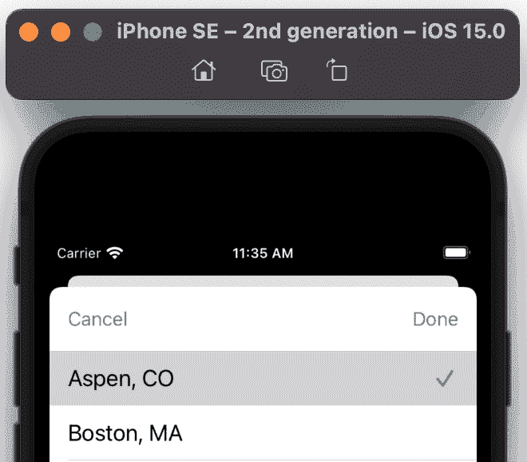

图 17.7：iOS 模拟器显示已选择地点的地点屏幕

选定的城市名称和州将替换集合视图部分标题内的 **请选择一个地点** 文本：

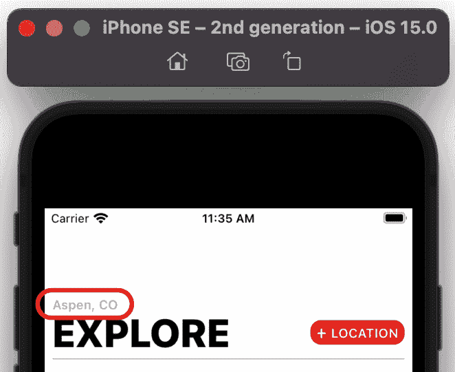

图 17.8：iOS 模拟器显示带有副标题标签的探索屏幕

虽然这可行，但在选择地点时你需要修复两个问题。第一个问题是你可以选择多个地点：

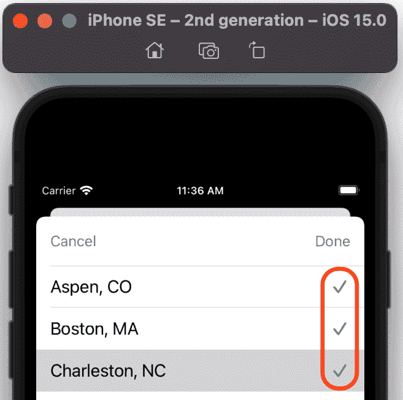

图 17.9：iOS 模拟器显示已选择多个地点的地点屏幕

你希望用户只能选择一个地点，如果选择了另一个地点，则之前选择的地点应该取消选中。

第二个问题是，如果你在 **地点** 屏幕中点击 **完成** 并再次在 **探索** 屏幕中点击 **地点** 按钮，用户选择的地点旁边的勾选标记会消失：

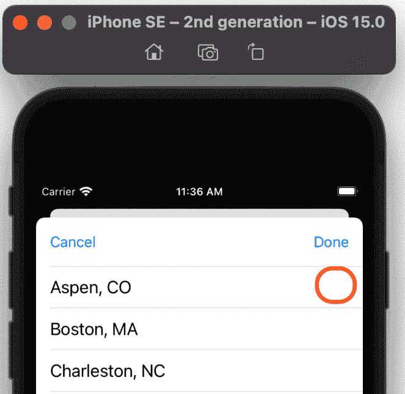

图 17.10：iOS 模拟器显示缺少勾选标记的地点屏幕

当你再次回到 **地点** 屏幕时，最后选择的地点应该有一个勾选标记。

让我们在下一节修改 `LocationDataManager` 类，以确保一次只能选择一个地点。

## 在地点屏幕中仅选择一个地点

目前，你可以在 **地点** 屏幕中选择多个地点。你应该只能选择一个地点，如果选择了另一个地点，则之前选择的地点应该取消选中。按照以下步骤操作：

1.  点击 `LocationItem` 文件。通过修改 `LocationItem` 结构使其符合 `Equatable` 协议：

    ```swift
    struct LocationItem: LocationItem instances are equal.
    ```

1.  点击 `LocationViewController` 文件。在 `viewDidLoad()` 方法之后，添加一个方法，只为包含所选城市的行设置勾选标记：

    ```swift
    private func setCheckmark(for cell: UITableViewCell, 
    location: LocationItem) {
       if selectedCity == location {
          cell.accessoryType = .checkmark {
       } else {
          cell.accessoryType = .none
       }
    }
    ```

    `setCheckmark(for:location:)` 方法接受 `cell`，一个表格视图单元格，和 `location`，一个 `LocationItem` 实例，作为参数。如果 `location` 和 `selectedCity` 相等，则设置该行的勾选标记。否则，不设置勾选标记。

1.  在`tableView(_:cellForRowAt:)`方法中，修改如下代码，在设置单元格的`textLabel`属性文本的行之后调用`setCheckmark(for:location:)`：

    ```swift
    func tableView(_ tableView: UITableView, cellForRowAt 
    indexPath: IndexPath) -> UITableViewCell {
       let cell = tableView.dequeueReusableCell(
       withIdentifier: "locationCell", for: indexPath)
       let location = manager.locationItem(at 
       indexPath.row)
       cell.textLabel?.text = location.cityAndState 
       setCheckmark(for:at:) will be called when each row in the table view is rendered, and the checkmark will only be set on the row containing the selected location.
    ```

1.  在`tableView(_:didSelectRowAt:)`方法中，修改`if`语句中的代码，在选择了位置后重新加载表格视图（从而渲染其中的所有行）：

    ```swift
    if let cell = tableView.cellForRow(at: indexPath) {
       cell.accessoryType = .checkmark
       selectedCity = manager.locationItem(at:
       indexPath.row)
       tableView.reloadData()
    }
    ```

构建并运行您的项目。现在您应该只能设置一个位置，如果您选择另一个位置，之前选择的位置将被取消选中。

在下一节中，您将修复第二个问题，以便一旦选择了一个位置，当您返回到`RestaurantListViewController`实例时，它将保持选中状态，这样最终可以显示用户选择的菜系在特定位置的餐厅列表。

小贴士

这是一章很长的内容，所以您可能希望在这里休息一下。

# 将位置和菜系信息传递给 RestaurantListViewController 实例

目前，您可以在`RestaurantListViewController`实例中设置位置，然后它会显示所选位置的提供所选菜系的餐厅。如果您在**Locations**屏幕中之前选择了一个位置，您还将使旁边的选择标记重新出现。按照以下步骤操作：

1.  您将为连接到`Main`故事板文件的每个切换添加标识符，并点击**Explore View Controller Scene**。选择**Explore View Controller Scene**和**Location View Controller Scene**之间的切换：![Figure 17.11: Editor area showing segue between Explore and Location screens selected

    ![img/Figure_17.11_B17469.jpg]

    图 17.11：编辑区域显示 Explore 和 Location 屏幕之间的切换选择

1.  点击属性检查器按钮。在`locationList`下：![Figure 17.12: Attributes inspector with Identifier set to locationList

    ![img/Figure_17.12_B17469.jpg]

    图 17.12：属性检查器中设置标识符为 locationList

1.  选择`restaurantList`之间的切换：![Figure 17.13: Attributes inspector identifier setting for the segue between

    Explore 和 Restaurant List 屏幕

    ![img/Figure_17.13_B17469.jpg]

    图 17.13：设置 Explore 和 Restaurant List 屏幕之间切换的属性检查器标识符

    一旦您知道哪个切换正在发生，您可以为每个切换指定要执行的方法。您将创建两个方法，`showLocationList(segue:)`和`showRestaurantList(segue:)`，您将使用`prepare(for:sender:)`方法根据哪个切换正在发生来执行所需的方法。

1.  在项目导航器中点击`ExploreViewController`文件。在`private`扩展中，在`unwindLocationCancel()`方法之前声明并定义`showLocationList(segue:)`方法，以便如果之前设置了用户选择的城市，则将其传递回`LocationViewController`实例：

    ```swift
    func showLocationList(segue: UIStoryboardSegue) {
       guard let navController = segue.destination as? 
       UINavigationController, let viewController = 
       navController.topViewController as? 
       LocationViewController else {
          return
       }
       viewController.selectedCity = selectedCity
    }
    ```

    在`Main`故事板文件之前，`showLocationList(segue:)`方法会被调用，你嵌入的`viewControllers`属性包含一个视图控制器数组，并且数组中的最后一个视图控制器的视图在屏幕上是可见的。你可以使用导航控制器的`topViewController`属性来访问数组中的最后一个视图控制器。

    `guard`语句检查 segue 目标是否是`UINavigationController`实例，以及`topViewController`是否是`LocationViewController`实例。如果是，则检查`ExploreViewController`实例的`selectedCity`属性是否包含值。如果包含，则将该值分配给`LocationViewController`实例的`selectedCity`属性。记住，`LocationViewController`实例的`setCheckmark(for:at:)`方法将为表格视图中的每一行调用，并在包含选定城市的行上设置勾选标记。

这将修复`RestaurantListViewController`实例的第二个问题。按照以下步骤操作：

1.  在项目导航器中点击`RestaurantListViewController`文件。在`RestaurantListViewController`类中`@IBOutlet`声明之前添加以下属性：

    ```swift
    selectedRestaurant will be set if you pick a restaurant in the selectedCity stores the city you picked in the selectedCuisine stores the cuisine you picked in the Explore screen.
    ```

1.  在`viewDidLoad()`方法之后添加以下代码，以便在`RestaurantListViewController`实例的视图出现在屏幕上时，将选定的城市和菜系打印到调试区域：

    ```swift
    override func viewDidAppear(_ animated: Bool) {
       super.viewDidAppear(animated)
       print("selected city \(selectedCity as Any)")
       print("selected cuisine \(selectedCuisine as Any)")
    }
    ```

    `viewDidAppear()`方法会在每次视图控制器视图出现在屏幕上时被调用，而`viewDidLoad()`方法则只会在视图控制器最初加载其视图时被调用一次。在这里使用`viewDidAppear()`是因为`RestaurantListViewController`实例每次其视图出现在屏幕上时都会显示不同的餐厅列表，这取决于用户的选择。目前，代码只是将选定的位置和菜系打印到调试区域，因此你可以看到这些值正在正确传递。

    重要信息

    要了解更多关于视图控制器生命周期的信息，请参阅此链接：[`developer.apple.com/documentation/uikit/uiviewcontroller`](https://developer.apple.com/documentation/uikit/uiviewcontroller)。

1.  在项目导航器中点击`ExploreViewController`文件。在`showLocationList(segue:)`方法之后声明并定义`showRestaurantList(segue:)`方法，以设置`RestaurantListViewController`实例的`selectedCuisine`和`selectedCity`属性：

    ```swift
    func showRestaurantList(segue: UIStoryboardSegue) {
       if let viewController = segue.destination as? 
       RestaurantListViewController, let city = 
       selectedCity, let index = 
       collectionView.indexPathsForSelectedItems?.first?
       .row {
          viewController.selectedCuisine = 
          manager.exploreItem(at: index).name
          viewController.selectedCity = city
       }
    }
    ```

    在 `if-let` 语句检查目标视图控制器是否为 `RestaurantListViewController` 实例之前，你将调用此方法，如果它是，则将 `city` 设置为 `ExploreViewController` 实例的 `selectedCity` 值，并获取用户点击的集合视图单元格的索引。如果该语句成功，则将 `RestaurantListViewController` 实例的 `selectedCuisine` 属性设置为 `items` 数组中该索引处的 `ExploreItem` 实例的 `name`。在下一行，`RestaurantListViewController` 实例的 `selectedCity` 属性将被分配 `city` 中存储的值。

为了使此方法正常工作，必须在过渡到 **餐厅详情** 屏幕之前先设置 `ExploreViewController` 实例的 `selectedCity` 属性。你将在选择菜系之前提醒用户设置城市。按照以下步骤操作：

1.  在项目导航器中点击 `ExploreViewController` 文件。在 `unwindLocationCancel()` 之前添加以下方法以显示警报：

    ```swift
    func showLocationRequiredAlert() {
       let alertController = UIAlertController(title: 
       "Location Needed", message: "Please select a 
       location.", preferredStyle: .alert)
       let okAction = UIAlertAction(title: "OK", style: 
       .default, handler: nil)
       alertController.addAction(okAction)
       present(alertController, animated: true, 
       completion: nil)
    }
    ```

    `showLocationRequiredAlert()` 方法创建一个标题设置为 `"Location Needed"` 和消息的 `UIAlertController` 实例。然后向 `UIAlertController` 实例添加一个带有 OK 按钮的 `UIAlertAction` 实例。最后，将警报呈现给用户，并点击 OK 按钮以关闭它。

1.  在 `viewDidLoad()` 之后添加以下代码以显示此警报，如果尚未选择位置：

    ```swift
    override func shouldPerformSegue(withIdentifier 
    identifier: String, sender: Any?) -> Bool {
       if identifier == Segue.restaurantList.rawValue, 
       selectedCity == nil {
          showLocationRequiredAlert()
          return false
       }
       return true
    }
    ```

    `shouldPerformSegue(withIdentifier:sender:)` 方法用于检查 `restaurantList` 是否已设置以及 `selectedCity` 是否已设置；如果没有，则调用 `showLocationRequiredAlert()` 方法，并且 `shouldPerformSegue(withIdentifier:sender:)` 返回 `false`。否则，`shouldPerformSegue(withIdentifier:sender:)` 返回 `true`，并且出现 **餐厅列表** 屏幕。

现在你已经创建了 `showLocationList(segue:)` 和 `showRestaurantList(segue:)` 方法，你将在 `viewDidLoad()` 之后和 `shouldPerformSegue(withIdentifier:)` 之前添加代码以实现 `prepare(for:sender:)` 方法。这个方法根据将要执行的 segue 调用 `showLocationList(segue:)` 或 `showRestaurantList(segue:)`：

```swift
override func prepare(for segue: UIStoryboardSegue, sender: Any?) {
   switch segue.identifier! {
   case Segue.locationList.rawValue:
     showLocationList(segue: segue)
   case Segue.restaurantList.rawValue:
     showRestaurantList(segue: segue)
   default:
      print("Segue not added")
   }
}
```

当 `locationList`，因此 `showLocationList(segue:)` 方法在过渡到 `restaurantList` 之前执行，所以 `showRestaurantListing(segue:)` 方法在过渡到 `RestaurantListViewController` 实例中的 `selectedType` 和 `selectedCity` 属性之前执行，这将打印到调试区域。

构建并运行你的项目。如果你尝试选择一种菜系，你会看到这个警报，指出你需要选择一个位置：

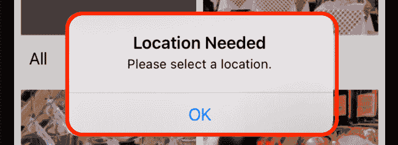

图 17.14：iOS 模拟器显示警报

如果你选择了一个位置，点击 **完成**，然后再次点击 **位置** 按钮，之前选择的位置应该仍然被选中：

![图 17.15：iOS 模拟器显示带有勾选标记的位置屏幕

![img/Figure_17.15_B17469.jpg]

图 17.15：iOS 模拟器显示带有勾选标记的位置屏幕

如果你选择了一个菜系，你会看到**餐厅列表**屏幕：

![图 17.16：iOS 模拟器显示餐厅列表屏幕

![img/Figure_17.16_B17469.jpg]

图 17.16：iOS 模拟器显示餐厅列表屏幕

你选择的位置和菜系将出现在调试区域：

![图 17.17：显示所选位置和菜系的调试区域

![img/Figure_17.17_B17469.jpg]

图 17.17：显示所选位置和菜系的调试区域

现在，`RestaurantListViewController`实例有了位置，你可以从`RestaurantDataManager`实例获取该位置的餐厅数据。在项目导航器中点击`RestaurantListViewController`文件，并更新`viewDidAppear()`如下。这将打印出所选位置和菜系提供的餐厅列表：

```swift
override func viewDidAppear(_ animated: Bool) {
   super.viewDidAppear(animated)
guard let city = selectedCity?.city, let cuisine = 
selectedCuisine else { 
return 
   }
   let manager = RestaurantDataManager()
   manager.fetch(location: city, selectedCuisine: cuisine) {
      restaurantItems in if !restaurantItems.isEmpty {
         for restaurantItem in restaurantItems {
            if let restaurantName = restaurantItem.name {
               print(restaurantName)
            }
         }
      } else {
         print("No data")
      }
   }
}
```

`guard`语句检查`city`和`cuisine`是否已成功分配了值，如果没有则返回。接下来，创建一个`RestaurantDataManager`实例并将其分配给`manager`。`fetch(location:selectedCuisine:completion:)`方法返回一个包含所选`city`和`cuisine`的`RestaurantItem`实例的数组，`for`循环将餐厅名称打印到调试区域。如果没有符合标准的餐厅，调试区域将打印`No data`。构建并运行你的项目，选择一个城市，点击一个菜系，并在调试区域中注意结果。

你也可以在报告导航器中看到结果。点击报告导航器按钮并选择如所示的第一项：

![图 17.18：显示餐厅名称列表的报告导航器

![img/Figure_17.18_B17469.jpg]

图 17.18：显示餐厅名称列表的报告导航器

你将在编辑器区域看到餐厅列表或`No data`。

因此，到目前为止，`RestaurantListViewController`实例已成功获取显示餐厅列表所需的数据。现在你有了这些数据，你需要配置集合视图以向用户显示它。为此，你需要创建集合视图单元格的视图控制器，并配置`RestaurantListViewController`实例以填充它们。你将在下一节中这样做。

## 为餐厅列表屏幕上的单元格创建视图控制器

目前为这个目的使用`RestaurantCell`类。按照以下步骤操作：

1.  右键点击`Restaurants`文件夹并选择`查看`。

1.  右键点击`View`文件夹并选择**新建文件**。

1.  **iOS**应该已经选中。选择**Cocoa Touch Class**然后点击**下一步**。

1.  按照以下方式配置文件：

    `RestaurantCell`

    `UICollectionViewCell`

    `Swift`

    点击**下一步**。

1.  在项目导航器中点击`RestaurantCell`文件。它包含`RestaurantCell`类的实现：

    ```swift
    import UIKit
    class RestaurantCell: UICollectionViewCell {
    }
    ```

现在让我们在`RestaurantCell`类中创建用于收集视图单元格的出口。你将在下一节中完成这个操作。

## 连接 RestaurantCell 类的出口

现在你已经创建了`RestaurantCell`类，你需要在其中创建出口并将它们链接到收集视图单元格内的 UI 元素，以便`RestaurantCell`实例管理收集视图单元格显示的内容。按照以下步骤操作：

1.  点击`Main`故事板文件。在`RestaurantCell`中点击`restaurantCell`。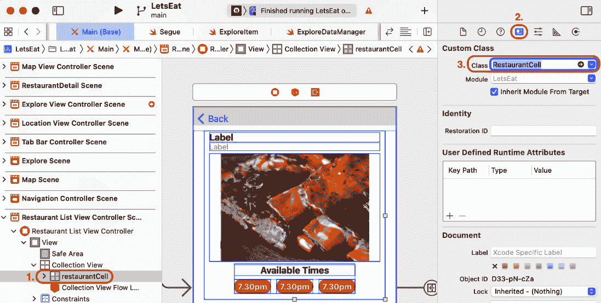

    图 17.19：restaurantCell 的标识检查器类设置

1.  在点击调整编辑器选项按钮时在辅助编辑器中显示的`RestaurantCell.swift`文件中：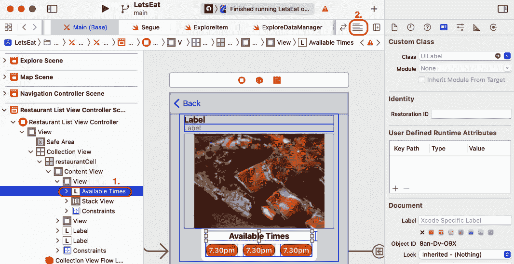

    图 17.20：文档大纲中选中 Available Times 标签

1.  点击调整编辑器选项按钮并从菜单中选择**助手**。

1.  辅助编辑器出现。顶部的路径栏应显示`RestaurantCell`文件：

    图 17.21：辅助编辑器显示 RestaurantCell.swift

1.  在出现的框中，在**名称**字段中输入`titleLabel`并点击**连接**：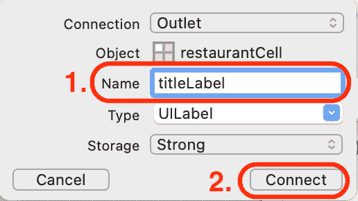

    图 17.22：显示标签名称设置为 titleLabel 的对话框

1.  从你刚刚创建的副标题`titleLabel`属性处*Ctrl + 拖动*。在出现的框中，在**名称**字段中输入`cuisineLabel`并点击**连接**：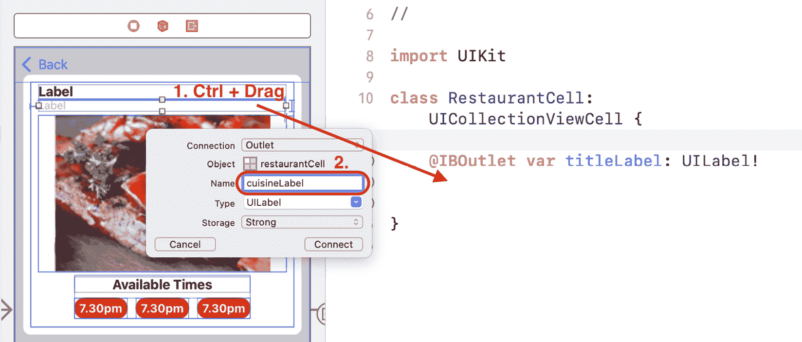

    图 17.23：显示标签名称设置为 cuisineLabel 的对话框

1.  从`american`图像视图处*Ctrl + 拖动*到其他你创建的属性之后。在出现的框中，在**名称**字段中输入`restaurantImageView`并点击**连接**：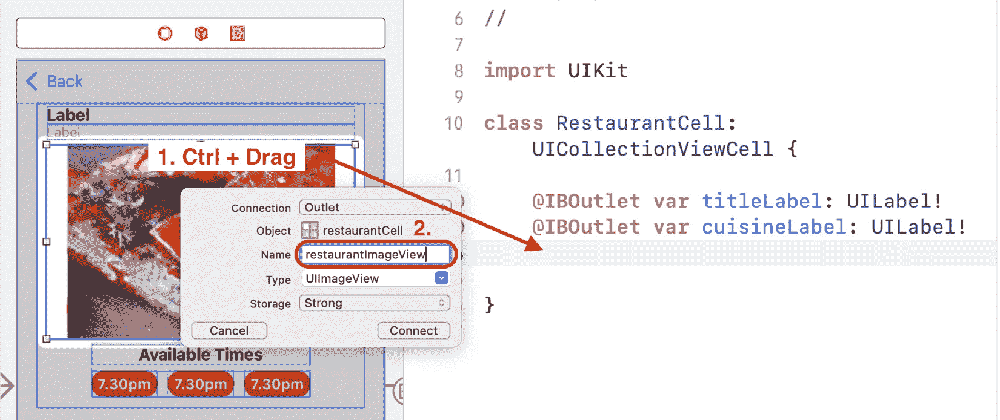

    图 17.24：显示图像视图名称设置为 restaurantImageView 的对话框

1.  点击**x**按钮关闭辅助编辑器。

`RestaurantCell`类的出口现在已连接到收集视图单元格中的 UI 元素。稍后你将配置`RestaurantListViewController`实例以填充这个收集视图，但在你这样做之前，有一个需要考虑的可能性。用户对位置和菜系的选项可能不会返回任何结果，因此你需要实现一个屏幕来通知用户没有数据可以显示。你将在下一节中完成这个操作。

## 显示自定义 UIView 以指示没有可用数据

用户在 `UIView` 子类和相应的 **XIB** 文件中做出的位置和餐饮选择。XIB 代表 **Xcode 接口构建器**，在实现故事板之前，XIB 文件被用来创建用户界面。现在，让我们按照以下步骤创建这两个文件：

1.  右键点击 `Misc` 文件夹并选择 `No Data`。

1.  右键点击 `No Data` 文件夹并选择 **新建文件**。

1.  **iOS** 应已选中。选择 **Cocoa Touch 类** 然后点击 **下一步**。

1.  按照以下方式配置文件：

    `NoDataView`

    `UIView`

    `Swift`

    点击 **下一步**。

1.  点击 `NoDataView` 文件出现在项目导航器中。

1.  右键点击 `No Data` 文件夹并创建一个新文件。

1.  **iOS** 应已选中。选择 **视图** 然后点击 **下一步**。

1.  将此文件命名为 `NoDataView`。点击 `NoDataView` XIB 文件出现在项目导航器中。

1.  在项目导航器中点击 `NoDataView` 文件并声明和定义 `NoDataView` 类如下：

    ```swift
    class NoDataView: UIView {
       var view: UIView!
       @IBOutlet var titleLabel: UILabel!
       @IBOutlet var descLabel: UILabel!
       override init(frame: CGRect) { 
          super.init(frame: frame) 
          setupView()
       }
       required init?(coder: NSCoder) { 
          super.init(coder: coder)
          setupView()
       }
       func loadViewFromNib() -> UIView {
          let nib = UINib(nibName: "NoDataView", bundle: 
          Bundle.main)
          let view = nib.instantiate(withOwner: self, 
          options: nil) [0] as! UIView 
          return view
       }
       func setupView() {
          view = loadViewFromNib()
          view.frame = bounds
          view.autoresizingMask = [.flexibleWidth, 
          .flexibleHeight]
          addSubview(view)
       }
       func set(title: String, desc: String) {
          titleLabel.text = title
          descLabel.text = desc
       }
    }
    ```

此类是 `UIView` 类的子类，它将管理 `NoDataView` XIB 文件中的视图。让我们分解一下：

```swift
var view: UIView!
@IBOutlet var titleLabel: UILabel!
@IBOutlet var descLabel: UILabel!
```

`view` 将在初始化期间分配来自 `NoDataView` XIB 文件的视图。

`titleLabel` 和 `descLabel` 将被分配给两个将在下一节构建用户界面时放置在 `NoDataView` XIB 文件中的 `UILabel` 实例。

```swift
override init(frame: CGRect) { 
   super.init(frame:frame) 
   setupView()
}
required init?(coder: NSCoder) { 
   super.init(coder: coder)
   setupView()
}
```

`NoDataView` 类是 `UIView` 的子类。一个 `UIView` 对象有两个 `init` 方法：第一个处理视图的编程创建，第二个处理从设备上存储的应用程序包中加载 XIB 文件。在这里，两种方法都将调用 `setupView()`。

```swift
func loadViewFromNib() -> UIView {
   let nib = UINib(nibName: "NoDataView", bundle: 
   Bundle.main)
   let view = nib.instantiate(withOwner: self, 
   options: nil) [0] as! UIView
   return view
}
```

此方法查找并加载 `NoDataView` XIB 文件从应用程序包中，并返回存储在其内部的 `UIView` 实例。

```swift
func setupView() {
   view = loadViewFromNib()
   view.frame = bounds
   view.autoresizingMask = [.flexibleWidth, .flexibleHeight]
   addSubview(view)
}
```

此方法调用 `loadViewFromNib()`，配置视图使其与设备屏幕大小相同，使视图的宽度和高度灵活以适应大小和方向变化，并将其添加到设备视图层次结构中以便在屏幕上可见。

```swift
func set(title: String, desc: String) {
   titleLabel.text = title
   descLabel.text = desc
}
```

此方法设置 `titleLabel` 和 `descLabel` 属性的文本。

现在让我们设置 `NoDataView` XIB 文件。你可能需要参考 *第十二章**，修改和配置单元格*，它更详细地介绍了使用大小检查器和自动布局约束菜单。按照以下步骤操作：

1.  在项目导航器中点击 `NoDataView` XIB 文件。

1.  选择 `NoDataView` 并按 *Enter* 键。

1.  点击库按钮以显示库。在过滤器字段中输入 `label`。一个 **标签** 对象出现在结果中。

1.  将两个 **标签** 对象拖入 **视图**，一个标签对象在另一个标签对象上方。

1.  选择顶部标签以表示标题。在属性检查器中更新以下值：

    在 `Default (Label Color)` 下的文本框中输入 `TITLE GOES HERE`。

    `Center`

    `System Bold 26.0`

1.  在选择相同的标签的情况下，在大小检查器中更新以下值：

    `335`

    `36`

1.  选择底部标签。这将代表描述。在属性检查器中更新以下值：

    在`默认（标签颜色）`下的文本字段中输入`Description goes here`。

    `Center`

    `System Thin 17.0`

1.  在大小检查器中更新以下值：

    `335`

    `21`

1.  通过单击第一个标签并按住**Shift**键同时选择第二个标签来选择两个标签。

1.  在两个标签仍然被选择的情况下，点击**编辑**菜单并选择**嵌入** | **堆叠视图**。

1.  选择`Vertical`

    `Center`

    `8`

1.  使用 `10`

    `10`

    点击**添加 2 个约束**按钮。

1.  在选择**Stack View**的情况下，点击对齐按钮。设置以下值：

    **水平容器内**（勾选）

    **垂直容器内**（勾选）

    点击**添加 2 个约束**按钮。

1.  在文档大纲中选择**文件所有者**。

1.  打开连接检查器，将`titleLabel`连接到显示`TITLE GOES HERE`的标签。

1.  将`descLabel`连接到另一个标签。

当你完成时，你应该看到以下内容：


Figure 17.25: 显示 NoDataView XIB 文件内容的编辑区域

你已经完成了`NoDataView.xib`的配置。现在，让我们将其全部组合起来，以便在没有任何餐厅提供所选菜系的位置时显示`NoDataView`。你将在下一节中完成此操作。

## 在餐厅列表屏幕上显示餐厅列表

你现在拥有了在**餐厅列表**屏幕上根据所选位置和菜系显示餐厅列表所需的一切。所以，现在是时候将其全部组合起来。按照以下步骤操作：

1.  在项目导航器中点击`RestaurantListViewController`文件。在`selectedRestaurant`属性之前添加以下内容以创建`RestaurantDataManager`实例并将其分配给`manager`属性：

    ```swift
    private let manager = RestaurantDataManager()
    var selectedRestaurant: RestaurantItem?
    ```

1.  在`private`扩展内部添加以下方法以填充`manager`的`items`数组，并设置`selectedCity`和`selectedCuisine`属性的背景视图；如果它们已设置，将`selectedCity`赋值给`city`，将`selectedCuisine`赋值给`cuisine`。否则，退出该方法。

    ```swift
    manager.fetch(location: city, selectedCuisine: cuisine)
    ```

    调用`RestaurantDataManager`实例的`fetch(location:selectedCuisine:completion:)`方法，该方法将适当的`RestaurantItem`实例加载到其`restaurantItems`数组中。

    ```swift
    { restaurantItems in
       if !restaurantItems.isEmpty {
          collectionView.backgroundView = nil
       } else {
          let view = NoDataView(frame: CGRect(x: 0, y: 0, 
          width: collectionView.frame.width, height: 
          collectionView.frame.height))
          view.set(title: "Restaurants", desc: 
          "No restaurants found.") 
          collectionView.backgroundView = view
       }
    ```

    如果`RestaurantDataManager`实例的`restaurantItems`数组不为空，则将`collectionView`实例的`backgroundView`设置为`nil`。否则，创建`NoDataView`实例，设置其标题和描述，并将其设置为`collectionView`实例的`backgroundView`属性。

    ```swift
    collectionView.reloadData()
    ```

    告诉`collectionView`刷新其视图。

1.  按如下方式更新`collectionView(_:cellForItemAt:)`以设置`RestaurantCell`实例的属性：

    ```swift
    func collectionView(_ collectionView: 
    UICollectionView, cellForItemAt indexPath: IndexPath) 
    -> UICollectionViewCell {
       RestaurantItem instance from the restaurantItems array of the RestaurantDataManager instance corresponding to the RestaurantCell instance's position.

    ```

    cell.titleLabel.text = restaurantItem.name

    ```swift

    This sets the text of the `RestaurantCell` instance's `titleLabel` to the value of the `RestaurantItem` instance's `name`.

    ```

    if let cuisine = restaurantItem.subtitle {

    cell.cuisineLabel.text = cuisine

    }

    ```swift

    This sets the text of the `RestaurantCell` instance's `cuisineLabel` to the value of the `RestaurantItem` instance's `subtitle`.

    ```

    if let imageURL = restaurantItem.imageURL {

    if let url = URL(string: imageURL) {

    let data = try? Data(contentsOf: url)

    if let imageData = data {

    DispatchQueue.main.async {

    cell.restaurantImageView.image =

    UIImage(data: imageData)

    }

    }

    }

    }

    ```swift

    This downloads the picture of the restaurant from the URL specified in the `RestaurantItem` instance's `imageURL` and assigns it to the `image` property of the `RestaurantCell` instance's `imgRestaurant` property.

    ```

    返回 cell

    }

    ```swift

    Returns the collection view cell.Important InformationYou will notice that scrolling is jerky, and if there is no internet connection, the **Restaurant List** screen will be blank. This is because downloading images from the internet takes time, and is interrupting the rendering of the collection view. These issues will be fixed in *Chapter 24**, Swift Concurrency*.
    ```

1.  按如下更新`collectionView(_:numberOfItemsInSection:)`以从`manager`获取要显示的集合视图数量：

    ```swift
    func collectionView(_ collectionView: UICollectionView, numberOfItemsInSection section: Int) -> Int {
       manager.numberOfRestaurantItems()
    }
    ```

1.  按如下更新`viewDidAppear()`以在集合视图出现在屏幕上时调用`createData()`：

    ```swift
    override func viewDidAppear(animated: Bool) {
       super.viewDidAppear(animated)
       createData()
    }
    ```

构建并运行你的应用。设置一个地点并点击一个菜系。如果有符合所选标准的餐厅，你将在`NoDataView`实例中看到它们被显示。

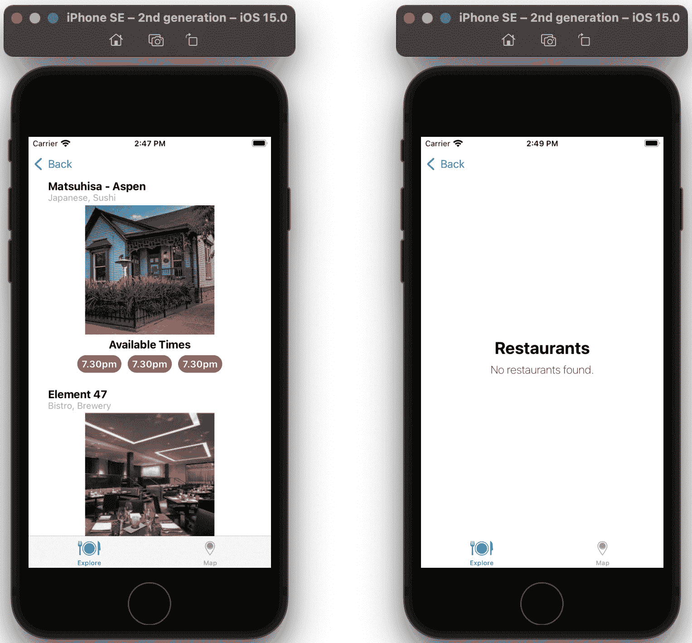

图 17.26：iOS 模拟器显示餐厅列表屏幕

在你完成`RestaurantListViewController`类之前，还有一件事。如果所选城市在**餐厅列表**屏幕上显示，那就很好了。让我们添加代码在**餐厅列表**屏幕的导航栏顶部显示它，使用大标题。按照以下步骤操作：

1.  在`RestaurantListViewController`文件中，在`createData()`之后在`private`扩展中添加以下方法，以在导航栏中显示所选城市：

    ```swift
    func setupTitle() {
       navigationController?.setNavigationBarHidden(
       false, animated: false)
       title = selectedCity?.cityAndState.uppercased()
       navigationController?.navigationBar.
       prefersLargeTitles = true
    }
    ```

    每个`UIViewController`实例都有一个`title`属性，如果导航栏可见，`title`也会可见。此方法显示导航栏并将`RestaurantListViewController`实例的`title`设置为包含城市和州名称的全大写字符串。

1.  在`viewDidLoad()`方法中在`createData()`之后调用`setupTitle()`：

    ```swift
    override func viewDidLoad(_ animated: Bool){
       super.viewDidLoad(animated)
       createData()
       setupTitle() method when the Restaurant List screen appears.
    ```

构建并运行你的应用。选择一个地点和菜系。你应该在**餐厅列表**屏幕的顶部看到城市和州的全大写字母：

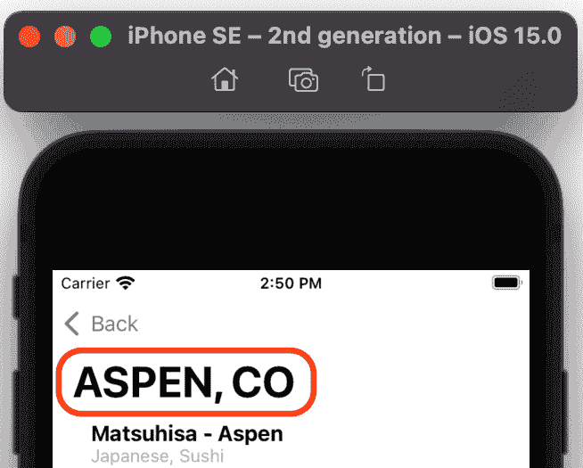

图 17.27：iOS 模拟器显示带有标题的餐厅列表屏幕

你已经完成了**餐厅列表**屏幕的实现，你终于到达了本章的结尾。做得好！

# 摘要

你在本章中取得了许多成就。你首先学习了 JSON 格式，并创建了`RestaurantDataManager`类，这是一个可以从 JSON 文件加载数据的数据管理类。你配置了`MapViewController`类，使其从`RestaurantDataManager`实例获取数据，以在`LocationViewController`类中显示餐厅列表，并在用户选择位置后将其传递给`ExploreViewController`实例。当选择一种菜系时，`ExploreViewController`类将选择的位置和菜系传递给`RestaurantListViewController`实例。最后，你配置了`RestaurantListViewController`类，使其从`RestaurantDataManager`实例获取餐厅列表，并在`NoDataView`类和视图中显示它们，如果特定位置没有提供所选菜系的餐厅，则会显示该视图。

现在，你能够从 JSON 文件中加载数据并读取数据，并在你的应用中传递这些数据，以便在集合视图和地图视图中显示。你还学习了如何使用`UITableViewController`代理方法来处理与表格视图的用户交互。这在你创建自己的应用时将非常有用。

在下一章中，你将实现**餐厅详情**屏幕，该屏幕通过包含静态单元格的表格视图显示特定餐厅的详细信息。
