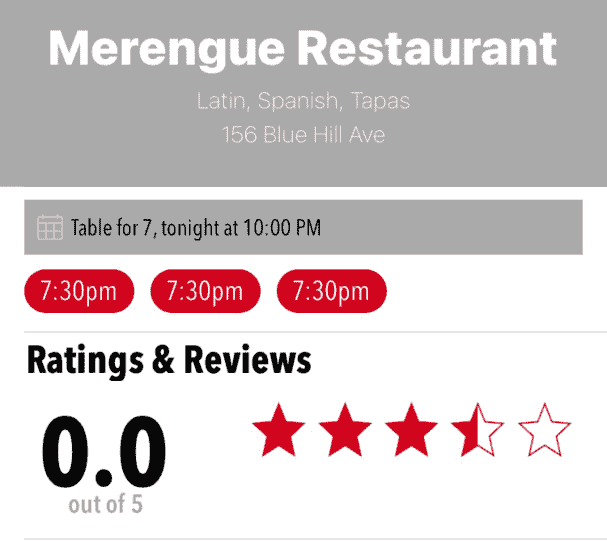
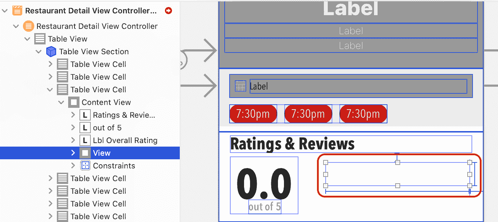
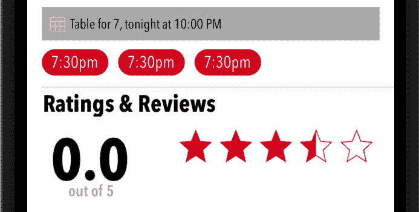
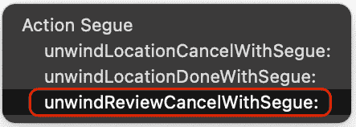
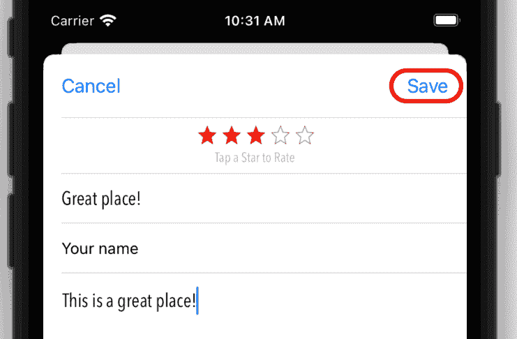
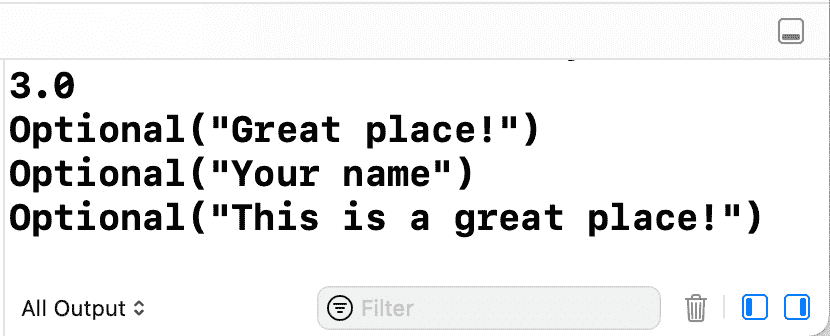

# *第十九章*：开始使用自定义 UIControls

到目前为止，您的应用程序在其所有屏幕中都有数据，但 **餐厅详情** 屏幕是不完整的。您无法为餐厅设置星级评分，也无法添加照片或评论。

到目前为止，您一直在使用苹果的标准 UI 元素。在本章中，您将创建一个自定义的 `UIControl` 类的子类，用于以星级形式显示餐厅评分。您将修改这个子类，以便用户可以通过点击来为餐厅设置评分。之后，您将实现一个允许用户提交餐厅评论的评论表单。

到本章结束时，您将学会如何创建自定义的 `UIControl` 类，处理触摸事件，并为您的应用程序实现评论表单。

本章将涵盖以下主题：

+   创建自定义 `UIControl` 子类

+   在您的自定义 `UIControl` 子类中显示星级

+   添加触摸事件支持

+   实现取消按钮的撤销方法

+   创建 `ReviewFormViewController` 类

# 技术要求

您将继续在上一章中修改的 `LetsEat` 项目上工作。

本章完成的 Xcode 项目位于本书代码包的 `Chapter19` 文件夹中，可以在此处下载：

[`github.com/PacktPublishing/iOS-15-Programming-for-Beginners-Sixth-Edition`](https://github.com/PacktPublishing/iOS-15-Programming-for-Beginners-Sixth-Edition)

查看以下视频，了解代码的实际应用：

[`bit.ly/3cRFcXa`](https://bit.ly/3cRFcXa)

让我们从学习如何创建一个将在屏幕上显示星级评分的自定义 `UIControl` 子类开始。

# 创建自定义 UIControl 子类

到目前为止，您只使用了苹果预定义的 UI 元素，例如标签和按钮。您只需点击库按钮，搜索您想要的元素，并将其拖入故事板即可。然而，在某些情况下，苹果提供的对象可能不合适或不存在。在这种情况下，您将需要自己构建。让我们回顾一下在应用程序浏览中看到的 **餐厅详情** 屏幕：



图 19.1：显示星级评级的餐厅详情屏幕

您可以看到一组五个星级位于 `RestaurantDetail` 故事板文件和 `ReviewForm` 故事板文件上方，其中应该放置星级的空白视图对象。您将创建一个名为 `RatingsView` 的类，这是一个 `UIControl` 类的自定义子类，您将在两个场景中使用它。`UIControl` 类是 `UIView` 类的子类，它被用作 `RatingsView` 类的超类，因为 `RatingsView` 实例必须在用户点击时做出响应。

重要信息

您可以在 [`developer.apple.com/documentation/uikit/uicontrol`](https://developer.apple.com/documentation/uikit/uicontrol) 上了解更多关于 `UIControl` 的信息。

`RatingsView` 实例将显示评分，用户还可以选择半星星。让我们首先创建 `UIControl` 类的子类。按照以下步骤操作：

1.  右键点击 `Review Form` 文件夹并选择 **New File**。

1.  **iOS** 应该已经选中。选择 **Cocoa Touch Class** 然后点击 **Next**。

1.  按照以下配置文件：

    `RatingsView`

    `UIControl`

    `Swift`

    点击 **Next**。

1.  点击 `RatingsView` 文件将出现在项目导航器中。

现在您需要设置 `RatingsView` 旁边视图对象的身份。按照以下步骤操作：

1.  在项目导航器中展开 `RestaurantDetail` 文件夹。点击 `RestaurantDetail` 故事板文件，并选择与 **0.0** **标签** 并排的 **View** 对象，如图所示：

    图 19.2：编辑区域显示与 0.0 标签并排的视图对象

1.  点击“身份检查器”按钮。在 `RatingsView` 下：


图 19.3：将类设置为 RatingsView 的身份检查器

现在让我们修改 `RatingsView` 类以使其显示星星。你将在下一节中使用 `Assets.xcassets` 文件内的图形资源来完成此操作。

## 在自定义 UIControl 子类中显示星星

到目前为止，你已经在项目中创建了一个名为 `RatingsView` 的新 `UIControl` 子类。你还将 `Restaurant` `Detail` 屏幕旁边的视图对象的类分配给了 `RatingsView` 类。在本章的剩余部分，`RatingsView` 类的一个实例将被称为评分视图（与 `UIButton` 类的实例被称为按钮的方式相同）。在本节中，你将向 `RatingsView` 类添加一些代码，以便评分视图显示星星。按照以下步骤操作：

1.  在项目导航器中点击 `RatingsView` 文件并删除所有注释代码。

1.  在 `RatingsView` 类声明之后输入以下内容以声明类的属性：

    ```swift
    private let filledStarImage = UIImage(named: 
    "filled-star")
    private let halfStarImage = UIImage(named: 
    "half-star")
    private let emptyStarImage = UIImage(named: 
    "empty-star")
    private var totalStars = 5
    var rating = 0.0
    ```

    前三个属性 `filledStarImage`、`halfStarImage` 和 `emptyStarImage` 被分配了存储在 `Assets.xcassets` 文件中的星星图像。

    `totalStars` 属性决定了要绘制的星星总数。

    `rating` 属性用于存储餐厅评分。绘制的星星类型将由 `rating` 的值决定。例如，如果 `rating` 是 `3.5`，评分视图将显示三个实心星星，一个半实心星星和一个空星星。

接下来，让我们创建一个将在屏幕上绘制评分视图的方法。所有 `UIView` 子类都有一个 `draw(_:)` 方法，它负责在屏幕上绘制它们的视图。你将覆盖 `RatingsView` 类的父类实现此方法。按照以下步骤操作：

1.  在属性声明之后在类声明中添加以下代码：

    ```swift
    override func draw(_ rect: CGRect) {
       let context = UIGraphicsGetCurrentContext()
       context!.setFillColor(UIColor.systemBackground.
       cgColor)
       context!.fill(rect)
       let ratingsViewWidth = rect.size.width
       let availableWidthForStar = ratingsViewWidth /
       Double(totalStars)
       let starSidelength = (availableWidthForStar <= 
       rect.size.height) ? availableWidthForStar : 
       rect.size.height
       for index in 0..<totalStars {
          let starOriginX = (availableWidthForStar * 
          Double(index)) + ((availableWidthForStar - 
          starSidelength) / 2)
          let starOriginY = ((rect.size.height - 
          starSidelength) / 2)
          let frame = CGRect(x: starOriginX, 
          y: starOriginY, width: starSidelength,
          height: starSidelength)
          var starToDraw: UIImage!
          if (Double(index + 1) <= self.rating) {
             starToDraw = filledStarImage
          } else if (Double(index + 1) <= 
          self.rating.rounded()) {
             starToDraw = halfStarImage
          } else {
             starToDraw = emptyStarImage
          }
          starToDraw.draw(in: frame)
       }
    }
    ```

    让我们分解一下：

    ```swift
    let context = UIGraphicsGetCurrentContext()
    ```

    创建一个`UIGraphicsGetCurrentContext`的实例并将其分配给`context`。你可以将其视为一个画板，你将在上面组合 UI 元素。

    ```swift
    context!.setFillColor(UIColor.systemBackground.
    cgColor)
    ```

    将`context`的填充颜色设置为默认系统背景颜色。

    ```swift
    context!.fill(rect)
    ```

    使用填充颜色填充由`rect`指定的矩形区域。

    ```swift
    let ratingsViewWidth = rect.size.width
    let availableWidthForStar = ratingsViewWidth / 
    Double(totalStars)
    let starSidelength = (availableWidthForStar <= 
    rect.size.height) ? availableWidthForStar : 
    rect.size.height
    ```

    这些语句确定每颗星星的大小。第一条语句获取评分视图的宽度并将其分配给`ratingsViewWidth`。下一条语句通过将评分视图的宽度除以需要绘制的星星数量来获取每个星星可用的宽度。这个值被分配给`availableWidthForStar`。对于第三条语句，想象每颗星星都被一个矩形包围。这条语句计算这个矩形的每一边应该有多长才能适应评分视图。如果`availableWidthForStar`小于或等于评分视图的高度，`starSideLength`被设置为`availableWidthForStar`；否则，它被设置为与评分视图的高度相同。

    重要信息

    第三条语句使用了**三元运算符**。更多信息可以在以下链接中找到：[`docs.swift.org/swift-book/LanguageGuide/BasicOperators.html`](https://docs.swift.org/swift-book/LanguageGuide/BasicOperators.html)。

例如，假设评分视图的宽度为 200 点，高度为 50 点。`availableWidthForStar`将是 200/5 = 40。由于 40 <= 50 评估为`true`，`starSideLength`将被设置为`40`。

```swift
for index in 0..<totalStars {
```

由于`totalStars`设置为`5`，这个`for`循环将重复五次。

```swift
let starOriginX = (availableWidthForStar * 
Double(index)) +  ((availableWidthForStar – 
starSidelength) / 2
let starOriginY = ((rect.size.height - starSidelength)
/ 2)
let frame = CGRect(x: starOriginX, y: starOriginY, 
width: starSidelength, height: starSidelength)
```

这些语句计算了在评分视图中绘制每个星星的矩形的位置和大小。然后将其分配给`frame`。原点值是从评分视图的左上角偏移的，宽度和高度设置为`starSidelength`。

例如，对于第一颗星星，`starOriginX`是(40*0.0) + (40-40)/2 = `0`。`starOriginY`是(50 – 40)/2 = `5`。因此，`frame`将是一个`CGRect`，其中`x`是`0`，`y`是`5`，`width`是`40`，`height`是`40`。

```swift
var starToDraw: UIImage!
if (Double(index + 1) <= self.rating) {
   starToDraw = filledStarImage
} else if (Double(index + 1) <= self.rating.rounded())
{ 
   starToDraw = halfStarImage
} else {
   starToDraw = emptyStarImage
}
```

根据评分视图的`rating`属性的值，这些语句确定要绘制的星星是填充的、半填充的还是空的。

例如，假设`rating`是`3.5`。

第一颗星星的索引为`0`。这意味着`Double`(0 + 1) <= 3.5 将等于 1.0 <= 3.5，这评估为`true`。这意味着绘制的第一颗星星将是一个填充的星星。第二颗和第三颗星星也是如此。

第四颗星星的索引为`3`。这意味着`Double`(3 + 1) <= 3.5 将等于 4.0 <= 3.5，这评估为`false`。`else`子句评估`Double`(3 + 1) <= 4.0，这评估为`true`，所以绘制的第四颗星星将是一个半填充的星星。

第五颗星星的索引为`4`。这意味着`Double`(4 + 1) <= 3.5 将等于 5.0 <= 3.5，这评估为`false`。`else`子句评估`Double`(4 + 1) <= 4.0，这也评估为`false`，所以绘制的第五颗星星将是一个空的星星。

```swift
starToDraw.draw(in: frame)
```

这个语句在指定的`frame`中绘制星星。

这就是`RatingsView`类所需的全部代码。现在，让我们向`RestaurantDetailViewController`类添加一个出口，以便它可以管理评分视图显示的内容。按照以下步骤操作：

1.  在项目导航器中点击`RestaurantDetailViewController`文件。

1.  在`overallRatingLabel`出口之后输入以下代码：

    ```swift
    @IBOutlet var ratingsView: RatingsView!
    ```

    这在`RestaurantDetailViewController`类中创建了一个用于评分视图的出口。你现在有一个名为`ratingsView`的`RatingsView`类型的出口，稍后你将在故事板中将它连接到评分视图。

1.  向`ratingsView`实例的`rating`属性分配`3.5`的方法。在`initialize()`方法之后，在你的`private`扩展中输入以下内容：

    ```swift
    func createRating() {
       ratingsView.rating = 3.5
    }
    ```

1.  修改`initalize()`方法以调用`createRating()`方法：

    ```swift
    func initialize() { 
       setupLabels() 
       createMap() 
       createRating()
    }
    ```

1.  打开`RestaurantDetail`故事板文件，选择`ratingsView`出口到评分视图：


图 19.4：连接检查器显示 ratingsView 出口

构建并运行你的项目，并转到任何餐厅的**餐厅详情**屏幕。评分视图应该显示三颗半星：



图 19.5：iOS 模拟器显示显示 3.5 颗星的评分视图

你已经为**餐厅详情**屏幕创建并实现了评分视图。它看起来很棒，但到目前为止，评分视图在被点击时没有响应。你将在下一节中使其对触摸事件做出响应，以便用户可以选择评分。

# 添加对触摸事件的支持

目前，`RestaurantDetailViewController`类有一个出口`ratingsView`连接到**餐厅详情**屏幕中的评分视图。它显示三颗半星的评分，但你无法更改评分。你需要支持触摸事件，使评分视图能够对点击做出响应。

重要信息

你可以在[`developer.apple.com/documentation/uikit/touches_presses_and_gestures/handling_touches_in_your_view`](https://developer.apple.com/documentation/uikit/touches_presses_and_gestures/handling_touches_in_your_view)了解更多关于处理触摸事件的信息。

要支持触摸事件，你需要修改`RatingsView`类以跟踪用户在屏幕上的触摸，并使用它们来确定评分。按照以下步骤操作：

1.  在项目导航器中点击`RatingsView`文件，并在`draw(_:)`方法之后添加以下属性：

    ```swift
    override var canBecomeFirstResponder: Bool {
       true
    }
    ```

    `canBecomeFirstResponder` 是一个 `UIControl` 属性，它确定一个对象是否可以成为第一个响应者。评分视图需要成为第一个响应者以响应用户的触摸事件。此方法默认返回 `false`，因为并非所有用户界面元素都需要响应用户的触摸。您重写此方法，使其返回 `true`，以便评分视图可以成为第一个响应者。

1.  要跟踪用户在屏幕上的触摸，请在您刚刚添加的 `canBecomeFirstResponder` 属性之后添加以下代码：

    ```swift
    override func beginTracking(_ touch: UITouch, with 
    event: UIEvent?) -> Bool {
       guard self.isEnabled else { 
          return false
       } 
       super.beginTracking(touch, with: event)
       handle(with: touch)
       return true
    }
    ```

    让我们分解一下：

    ```swift
    override func beginTracking(_ touch: UITouch, with event: UIEvent?) -> Bool {
    ```

    这是 `UIControl` 类中声明的方法之一。当用户的触摸在 `UIControl` 实例的范围内时被调用。屏幕上触摸的位置、大小、移动和力量都存储在一个 `UITouch` 实例中。如果您想跟踪用户的触摸，则需要此方法返回 `true`。您重写此方法，以便在用户触摸评分视图时定义自定义行为。

    ```swift
    guard self.isEnabled else { 
       return false
    }
    ```

    在这个 `guard` 语句中检查 `isEnabled` 属性，以查看评分视图是否启用。如果评分视图未启用，则不会跟踪用户的触摸。

    ```swift
    super.beginTracking(touch, with: event)
    ```

    调用此方法的超类实现。这将处理父类所需的任何初始化。

    ```swift
    handle(with: touch) 
    ```

    您将传递 `UITouch` 实例到这个方法，它将为每个触摸执行。您将在下一步声明和定义此方法。

    ```swift
    return true
    ```

    当评分视图启用时跟踪用户的触摸。

1.  您将看到一个错误，因为您还没有实现 `handle(with:)`，所以请在文件中的所有其他代码之后为 `RatingsView` 创建一个 `private` 扩展，并在其中输入以下代码：

    ```swift
    private extension RatingsView {
       func handle(with touch: UITouch) {
          let starRectWidth = self.bounds.size.width / 
          Double(totalStars)
          let location = touch.location(in: self)
          var value = location.x / starRectWidth
          if (value + 0.5) < value.rounded(.up) {
             value = floor(value) + 0.5
          } else {
             value = value.rounded(.up)
          }
          updateRating(with: value)
       }
    }
    ```

    `handle(with:)` 将根据用户触摸的位置计算评分值。它接受一个 `UITouch` 实例作为参数。首先，`starRectWidth` 被分配为评分视图的 `width`，除以 `5`。接下来，将 `UITouch` 实例在评分视图内的位置分配给 `location`。然后，将 `value` 分配给 `location` 的 `x` 位置除以 `starRectWidth`。这意味着 `value` 将包含介于 0 和 5 之间的值范围。接下来，`if` 语句计算与触摸位置相对应的评分，并调用 `updateRating(with:)`，将 `value` 传递给它。您将在下一步实现 `updateRating(with:)`。

    为了理解 `if` 语句的工作原理，假设评分视图的 `width` 是 `200`。`starRectWidth` 将设置为 200/5 = `40`。假设用户在位置 `x` = `130`，`y` = `17` 处触摸屏幕，这对应于第三颗星和第四颗星之间的一个点。`value` 将被分配为 130/40 = `3.25`。所以，`if` 语句将评估 `(3.25 + 0.5 < 3.25.rounded(.up)`，这变成 (3.75 < 4.0)，返回 `true`，因此 `value` 将被设置为 `floor(3.25)` + 0.5，这变成 3.0 + 0.5，即 `3.5`。所以，`updateRating(with:)` 将传递一个值为 `3.5`。

1.  你会看到一个错误，因为你还没有实现`updateRating(with:)`，所以请在`handle(with:)`方法之后的`private`扩展中输入以下代码：

    ```swift
    func updateRating(with newValue: Double) {
       if (self.rating != newValue && newValue >= 0 && 
       newValue <= Double(totalStars)) { 
          self.rating = newValue 
       }
    }
    ```

    `updateRating(with:)`检查`value`是否不等于当前评分且在 0 到 5 之间。如果是，则将`value`分配给`rating`。

    在前面的示例基础上，由于`3.5`位于 0 和 5 之间，如果它不等于当前`rating`的值，它将被分配给`rating`。

1.  评分视图在评分改变后需要重新绘制，以显示星星的正确状态。将`rating`属性声明修改如下：

    ```swift
    var rating = 0.0 {
       didSet {
          setNeedsDisplay()
       }
    }
    ```

    在这里，你已定义了`rating`属性的值。每次`rating`发生变化时，都会调用`setNeedsDisplay()`并重新绘制评分视图。由于屏幕只有在评分发生变化时才会重新绘制，因此可以带来一点性能上的好处。

你已经添加了所有必要的代码，使评分视图能够响应触摸。现在，你需要更新`RestaurantDetailViewController`类来设置评分视图的`isEnabled`属性。在项目导航器中点击`RestaurantDetailViewController`文件，并修改`createRating()`方法，如下所示：

```swift
func createRating() { 
   ratingsView.rating = 3.5 
   ratingsView.isEnabled = true
}
```

将`isEnabled`属性设置为`true`允许评分视图成为第一响应者并开始跟踪触摸，这将触发`handle(with:)`根据触摸位置计算评分，进而调用`updateRating(with:)`来更新评分视图。

构建并运行你的项目。现在点击评分视图会根据点击的位置改变评分，如下所示：

![Figure 19.6：iOS 模拟器显示评分视图的触摸位置

![img/Figure_19.06_B17469.jpg]

图 19.6：iOS 模拟器显示评分视图的触摸位置

评分将变为一个半星。

最终，你将通过汇总用户在**审查表**屏幕上提交的所有评分来计算总体评分。如果你点击**添加评论**按钮，**审查表**屏幕会显示，但你无法将其关闭或设置评分。在下一节中，你将配置**取消**按钮，以便在点击时关闭**审查表**屏幕。

# 实现取消按钮的 unwind 方法

让我们看看**审查表**屏幕。**添加评论**按钮和**审查表**屏幕之间的转场已经为你准备好了。构建并运行你的项目，转到**餐厅详情**屏幕，并点击**添加评论**按钮：

![Figure 19.7：iOS 模拟器显示添加评论按钮

![img/Figure_19.07_B17469.jpg]

图 19.7：iOS 模拟器显示添加评论按钮

**审查表**屏幕被显示（注意顶部表格视图单元格中有一个空白区域，那里应该是一个评分视图，你将在稍后添加）：

![Figure 19.8：iOS 模拟器显示审查表屏幕

![img/Figure_19.08_B17469.jpg]

图 19.8：iOS 模拟器显示的“审查表”屏幕

一旦**审查表单**屏幕出现在屏幕上，您就不能关闭它，因为**保存**和**取消**按钮的动作尚未配置。就像您对**位置**屏幕所做的那样，您需要实现一个 unwind 方法来关闭**审查表单**屏幕。按照以下步骤操作：

1.  在项目导航器中点击`RestaurantDetailViewController`文件。

1.  在`private`扩展中，在`createRating()`方法之前，按照以下方式实现 unwind 方法：

    ```swift
    @IBAction func unwindReviewCancel(segue:
    UIStoryboardSegue) {
    }
    ```

    当**审查表单**屏幕过渡到**餐厅详情**屏幕时，将调用此方法。

1.  打开`ReviewForm`故事板文件，并按*Ctrl + Drag*从**取消**按钮拖动到场景工具栏中的退出图标，如图所示：

    图 19.9：显示设置取消按钮动作的表视图控制器场景

1.  在弹出菜单中选择`unwindReviewCancelWithSegue`：



图 19.10：弹出菜单，其中选择了 unwindReviewCancelWithSegue:

构建并运行您的项目。现在，您可以通过点击**取消**按钮来关闭**审查表单**屏幕。

接下来，让我们看看**保存**按钮。您将为**审查表单**屏幕创建一个视图控制器，以便在点击**保存**按钮时处理**审查表单**屏幕字段内的数据。您将在下一节中这样做。

# 创建 ReviewFormViewController 类

为了处理用户输入，您将创建`ReviewFormViewController`类，使其成为**审查表单**屏幕的视图控制器。目前，您将配置此类以从**审查表单**屏幕的字段中获取所有值并在调试区域打印它们。您将在稍后的*第二十一章**，理解核心数据*中学习如何存储评论。按照以下步骤操作：

1.  右键点击`ReviewForm`文件夹并选择**新建文件**。

1.  **iOS**应该已经选中。选择**Cocoa Touch Class**然后点击**下一步**。

1.  按照以下方式配置文件：

    `ReviewFormViewController`

    `UITableViewController`

    `Swift`

    点击**下一步**。

1.  点击`ReviewFormViewController`文件将在项目导航器中显示。

1.  删除`viewDidLoad()`方法之后以及所有注释掉的代码。在类声明之后添加以下输出。它们对应于**审查表单**屏幕内的字段：

    ```swift
    @IBOutlet var ratingsView: RatingsView!
    @IBOutlet var titleTextField: UITextField!
    @IBOutlet var nameTextField: UITextField!
    @IBOutlet var reviewTextView: UITextView!
    ```

1.  您还需要配置`viewDidLoad()`方法的动作：

    ```swift
    @IBAction func onSaveTapped(_ sender: Any) { 
       print(ratingsView.rating) 
       print(titleTextField.text as Any) 
       print(nameTextField.text as Any) 
       print(reviewTextView.text as Any) 
       dismiss(animated: true, completion: nil)
    }
    ```

    此方法将**审查表单**屏幕的字段内容打印到调试区域并关闭它。

现在，让我们按照以下方式连接`ReviewForm`故事板文件中的输出：

1.  在项目导航器中点击`ReviewForm`故事板文件并点击`ReviewFormViewController`：

    图 19.11：身份检查器，类设置为 ReviewFormViewController

    注意，名称 **Table View Controller Scene** 将更改为 **Review Form View Controller Scene**。

1.  点击 `RatingsView`。视图的名称将更改为 **Ratings View**：

    图 19.12：身份检查器，类设置为 RatingsView

1.  接下来，您将连接输出口。在文档大纲中点击 **审查表单视图控制器** 图标，然后点击连接检查器按钮：

    图 19.13：连接检查器按钮

1.  将 `ratingsView` 输出口连接到 **Ratings View**：

    图 19.14：连接检查器显示 ratingsView 输出口

1.  将 `titleTextField` 输出口连接到第一个 **文本字段**：

    图 19.15：连接检查器显示 titleTextField 输出口

1.  将 `nameTextField` 输出口连接到第二个 **文本字段**：

    图 19.16：连接检查器显示 nameTextField 输出口

1.  将 `reviewTextView` 输出口连接到 **文本视图**：

    图 19.17：连接检查器显示 reviewTextView 输出口

1.  最后，将 `onSaveTapped:` 动作连接到 **保存** 按钮：


图 19.18：连接检查器显示设置 Save 按钮动作

构建并运行您的应用。转到 **审查表单** 屏幕，设置一个评分，向字段添加一些示例文本，然后点击 **保存** 按钮：



图 19.19：iOS 模拟器显示审查表单屏幕

您将看到您输入的数据出现在调试区域：



图 19.20：调试区域显示审查表单屏幕文本字段的内容

恭喜！**审查表单**屏幕现在能够接受用户输入。您将在 *第二十一章**，理解核心数据* 中学习如何保存和展示评论数据。

# 摘要

在本章中，您从头开始创建了一个新的自定义 `UIControl` 子类 `RatingsView` 并将其添加到 `ReviewFormViewController` 类中，这是一个用于 **审查表单** 屏幕的视图控制器，并配置了 **取消** 和 **保存** 按钮动作，以便用户可以关闭审查表单屏幕或提交评论。

你现在已经很好地掌握了如何创建自定义的 `UIControl` 类，如何使它们响应用户交互，以及如何实现一个可以接受用户输入的审查表单。这在你编写自己的应用程序时将非常有用。

在下一章中，你将学习如何处理来自相机或照片库的照片，以及如何应用照片滤镜到你所拥有的照片上。
