# *第二十章*：开始使用相机和照片库

在上一章中，你创建了 `RatingsView` 类并将其添加到 **餐厅详情** 和 **评论表单** 屏幕中。你还通过 **评论表单** 屏幕启用了用户提交评论的功能，尽管目前提交的评论只是打印到调试区域。

在本章中，你将完成包含你想要使用的滤镜的 `.plist` 文件的实现，然后创建一个用于存储滤镜数据的滤镜对象类，并创建一个数据管理类来读取 `.plist` 文件并填充一个滤镜对象数组。接下来，你将创建一个包含应用滤镜到图像的方法的协议。之后，你将创建 `UIImagePickerDelegate` 协议的视图控制器，这允许你从相机或照片库中获取照片，并实现将选定的滤镜应用到照片上的方法。请注意，照片将不会被保存。你将在下一章学习如何保存评论和照片。

到本章结束时，你将学会如何将照片导入自己的应用，以及如何对它们应用滤镜。

本章将涵盖以下主题：

+   理解滤镜

+   为 **照片滤镜** 屏幕创建模型对象

+   实现 `ImageFiltering` 协议

+   为 **照片滤镜** 屏幕创建类

+   实现图像选择器代理协议

+   获取使用相机或照片库的权限

# 技术要求

你将继续在上一章中修改的 `LetsEat` 项目上工作。

本章的资源文件和完成的 Xcode 项目位于本书代码包的 `Chapter20` 文件夹中，可以在此处下载：

[`github.com/PacktPublishing/iOS-15-Programming-for-Beginners-Sixth-Edition`](https://github.com/PacktPublishing/iOS-15-Programming-for-Beginners-Sixth-Edition)

查看以下视频，看看代码的实际效果：

[`bit.ly/3oZZ93P`](https://bit.ly/3oZZ93P)

让我们从学习照片滤镜以及如何将它们应用到图像开始吧。

# 理解滤镜

iOS 提供了一系列内置的滤镜，你可以使用这些滤镜来增强照片。这些滤镜通过 **Core Image** 库提供。Core Image 是一种图像处理和分析技术，它为静态和视频图像提供高性能处理。Core Image 中有超过 170 个滤镜可供使用，这让你能够将各种酷炫效果应用到你的照片上。

重要信息

你可以在 [`developer.apple.com/documentation/coreimage`](https://developer.apple.com/documentation/coreimage) 上了解更多关于 Core Image 的信息。

对于这个应用，你将只使用 10 个滤镜。这些滤镜的详细信息在 `.plist` 文件中提供。按照以下步骤将此文件导入到你的应用中：

1.  如果您还没有这样做，请在此链接下载并解压本书的代码包：[`github.com/PacktPublishing/iOS-15-Programming-for-Beginners-Sixth-Edition`](https://github.com/PacktPublishing/iOS-15-Programming-for-Beginners-Sixth-Edition)。您将在 `Chapter20` 文件夹中的 `resources` 文件夹内找到 `FilterData.plist`。

1.  在项目导航器中，在 `PhotoFilter` 文件夹内创建一个新的组，并将其命名为 `Model`。

1.  将 `FilterData.plist` 拖动到 `Model` 文件夹。确保勾选 **如果需要则复制项目** 并点击 **完成**。

1.  在项目导航器中点击 `FilterData.plist` 以查看其内容：

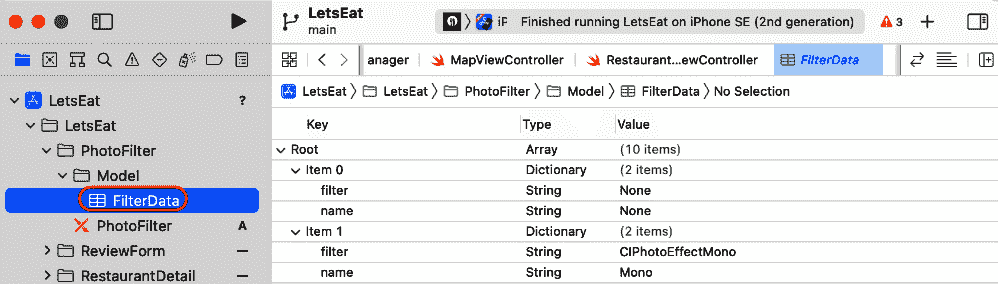

图 20.1：显示 FilterData.plist 内容的编辑区域

如您所见，`FilterData.plist` 是一个字典数组。每个字典包含过滤器的名称和描述标签。在下一节中，您将了解如何使用 `FilterData.plist` 中的信息在您的应用中。

# 为照片滤镜屏幕创建模型对象

要将 `FilterData.plist` 中的信息获取到您的应用中，您将创建一个结构，`FilterItem`，它可以存储有关过滤器的详细信息，以及一个数据管理类，`FilterManager`，它将加载 `FilterData.plist` 并创建 `FilterItem` 实例的数组。这与将菜系和位置信息加载到您的应用中的方法类似。让我们首先创建 `FilterItem` 结构。按照以下步骤操作：

1.  在 `PhotoFilter` 文件夹中的 `Model` 文件夹上右键单击，并选择 **新建文件**。

1.  **iOS** 应已选中。选择 **Swift 文件** 并点击 **下一步**。

1.  将此文件命名为 `FilterItem`。点击后，`FilterItem` 文件将出现在项目导航器中。

1.  在 `FilterItem` 文件中，在 `import` 语句之后输入以下代码以声明和定义 `FilterItem` 结构：

    ```swift
    struct FilterItem {
       let filter: String?
       let name: String?
       init(dict: [String: String]) {
          self.filter = dict["filter"] 
          self.name = dict["name"]
       }
    }
    ```

    此结构有两个属性和一个初始化器。`filter` 属性将存储过滤器名称，而 `name` 属性将存储简短的过滤器描述。初始化器接受一个字典作为参数，在创建此类的实例时设置 `name` 和 `filter` 属性。

现在您已经创建了 `FilterItem` 类，您将创建数据管理类 `FilterDataManager`。按照以下步骤操作：

1.  在 `PhotoFilter` 文件夹中的 `Model` 文件夹上右键单击，并选择 **新建文件**。

1.  **iOS** 应已选中。选择 **Swift 文件** 并点击 **下一步**。

1.  将此文件命名为 `FilterDataManager`。点击后，`FilterDataManager` 文件将出现在项目导航器中。

1.  在 `FilterDataManager` 文件中，在 `import` 语句之后输入以下代码以声明和定义 `FilterDataManager` 类：

    ```swift
    class FilterDataManager: DataManager {
       func fetch() -> [FilterItem] {
          var filterItems: [FilterItem] = []
          for data in loadPlist(file: "FilterData") {
             filterItems.append(FilterItem(dict: 
             data as! [String: String]))
          }
          return filterItems
       }
    }
    ```

    `FilterDataManager` 类采用了你在 *第十六章**，使用 MapKit 入门* 中早期创建的 `DataManager` 协议。调用 `fetch()` 方法从 `FilterData.plist` 加载数据，创建 `FilterItem` 实例的数组，并返回它。

在下一节中，你将创建一个协议，其中包含一个将过滤器应用于图像的方法。

# 创建 ImageFiltering 协议

你需要一个将过滤器应用于图像的方法。你将创建一个协议 `ImageFiltering`，它实现了一个方法 `apply(filter:to:)` 来完成这个任务。任何采用此协议的类都将有权访问此方法，该方法将指定的过滤器应用于图像。按照以下步骤操作：

1.  右键点击 `PhotoFilter` 文件夹并选择 **新建文件**。

1.  **iOS** 应已选中。选择 **Swift 文件** 并点击 **下一步**。

1.  将此文件命名为 `ImageFiltering`。点击 `ImageFiltering` 文件将在项目导航器中显示。

1.  修改此文件中的代码以声明和定义 `ImageFiltering` 协议：

    ```swift
    import UIKit framework provides the required infrastructure for your iOS app. You import UIKit instead of Foundation because support for the UIImage class is not available in Foundation.

    ```

    导入 CoreImage

    ```swift

    Core Image is an image processing and analysis technology that provides high-performance processing for still and video images. You import `CoreImage` as it is required to access the built-in photo filters.

    ```

    protocol ImageFiltering {

    func apply(filter: String, originalImage:

    UIImage) -> UIImage

    }

    ```swift

    Here, you declare a protocol named `ImageFiltering`. This protocol specifies a method, `apply(filter:originalImage:)`, that takes a filter name and an image as parameters.

    ```

    扩展 ImageFiltering {

    func apply(filter: String, originalImage:

    UIImage) -> UIImage {

    ```swift

    This extension of the `ImageFiltering` protocol contains the implementation of the `apply(filter:originalImage:)` method. This means that any class that adopts the `ImageFiltering` protocol will be able to execute this method.

    ```

    let initialCIImage = CIImage(image:

    originalImage, options: nil)

    ```swift

    This statement converts the original image to a `CIImage` instance so that you can apply filters to it, and assigns it to `initialCIImage`.

    ```

    let originalOrientation =

    originalImage.imageOrientation

    ```swift

    This statement stores the original image orientation in `originalOrientation`.

    ```

    guard let ciFilter = CIFilter(name: filter)

    else {

    print("filter not found")

    return originalImage

    }

    ```swift

    This `guard` statement gets the filter with the same name as `filter` and assigns it to `ciFilter`, and returns the original image if the filter is not found.

    ```

    ciFilter.setValue(initialCIImage, forKey:

    kCIInputImageKey)

    let context = CIContext()

    let filteredCIImage =

    (ciFilter.outputImage)!

    ```swift

    These statements apply the selected filter to `initialCIImage` and store the result in `filteredCIImage`.

    ```

    let filteredCGImage =

    context.createCGImage(filteredCIImage, from:

    filteredCIImage.extent)

    return UIImage(cgImage: filteredCGImage!,

    scale: 1.0, orientation:

    originalOrientation)

    ```swift

    These statements convert the `CIImage` instance stored in `filteredCIImage` back into a `UIImage` instance and returns it.
    ```

这完成了 `ImageFiltering` 协议和 `apply(filter:originalImage:)` 方法的实现。此时，你拥有以下内容：

+   `FilterData.plist`，其中包含应用内的照片滤镜数据。

+   `FilterItem`，一个可以存储过滤器和过滤器描述的类。

+   `FilterDataManager`，一个数据管理类，从 `FilterData.plist` 加载数据并生成 `FilterItem` 实例的数组。

+   `ImageFiltering`，一个包含方法 `apply(filter:originalImage:)` 的协议，该方法将过滤器应用于图像。

在下一节中，你将创建 Photo Filter 屏幕中 UI 元素的类，该屏幕允许你管理此屏幕及其内部的集合视图。

# 为 Photo Filter 屏幕创建类

到目前为止，你已经将 `FilterData.plist` 导入到你的应用中，创建了 `FilterItem` 和 `FilterDataManager` 类，并创建了 `ImageFiltering` 协议。在本节中，你将设置 Photo Filter 屏幕的类，该屏幕允许你管理此屏幕及其内部的集合视图。

记住你已经在*第十六章*“MapKit 入门”中添加了`PhotoFilter`故事板文件到你的项目中。它包含一个场景，该场景由一个将包含用户选择的图片的大图像视图和一个将显示过滤器预览的集合视图组成。以下截图显示了完成实现后的样子：

![Figure 20.2: iOS Simulator showing the completed Photo Filter screen]

![img/Figure_20.02_B17469.jpg]

图 20.2：iOS 模拟器显示完成的 Photo Filter 屏幕

此屏幕的工作方式如下。当你点击**餐厅详情**屏幕中的**添加照片**按钮并选择照片时，**Photo Filter**屏幕将出现，显示所选照片，其下方有一个滚动列表的过滤器。滚动列表中的每个过滤器都在集合视图单元格中显示。点击滚动列表中的过滤器将应用所选过滤器到照片上。

在下一节中，你将创建并配置一个类来管理集合视图单元格。每个单元格将显示应用过滤器后照片的缩略图预览。

## 为集合视图单元格创建一个类

在项目导航器中的`PhotoFilter`故事板文件，你会看到集合视图已经在**视图控制器场景**中存在，但无法设置集合视图单元格的内容。你现在将创建一个类来管理它们。按照以下步骤操作：

1.  右键点击`PhotoFilter`文件夹并选择**新建文件**。

1.  **iOS**应该已经选中。选择**Cocoa Touch 类**并点击**下一步**。

1.  按以下方式配置文件：

    `FilterCell`

    `UICollectionViewCell`

    `Swift`

    点击**下一步**。

1.  点击`FilterCell`文件将在项目导航器中显示。

1.  将以下代码添加到该文件中，以声明和定义`FilterCell`类：

    ```swift
    import UIKit
    class FilterCell: UICollectionViewCell {
    FilterCell class has two properties: a label, nameLabel, and an image view, thumbnailImageView. The label will display the filter name, while the image view will display a thumbnail preview of the filter.This class also contains two methods, `awakeFromNib()` and  `set(filterItem:imageForThumbnail:)`. The `awakeFromNib()` method is called after the `FilterCell` instance has been loaded, and the two statements inside it round the corners of the image view. The `set(filterItem:imageForThumbnail:)` method takes `UIImage` and `FilterItem` instances as parameters, assigns the `name` property of the `FilterItem` instance to `nameLabel`, applies the filter specified by the `filter` property to the `UIImage` instance, and assigns the image with the filter applied to `thumbnailImageView`. Important InformationFor more details about `awakeFromNib()`, see this link: [`developer.apple.com/documentation/objectivec/nsobject/1402907-awakefromnib`](https://developer.apple.com/documentation/objectivec/nsobject/1402907-awakefromnib).
    ```

1.  在项目导航器中点击`PhotoFilter`故事板文件。

1.  在文档大纲中，选择`FilterCell`：![Figure 20.3: Identity inspector with Class set to FilterCell]

    ![img/Figure_20.03_B17469.jpg]

    ![Figure 20.3: Identity inspector with Class set to FilterCell]

1.  点击属性检查器按钮。设置`filterCell`：![Figure 20.4: Attributes inspector with Identifier set to filterCell]

    ![img/Figure_20.04_B17469.jpg]

    ![Figure 20.4: Attributes inspector with Identifier set to filterCell]

1.  点击连接检查器按钮。将`nameLabel`和`thumbnailImageView`出口连接到相应的 UI 元素，如图所示：

![Figure 20.5: Connections inspector showing thumbnailImageView and nameLabel outlets]

![img/Figure_20.05_B17469.jpg]

![Figure 20.5: Connections inspector showing thumbnailImageView and nameLabel outlets]

现在你已经完成了集合视图单元格的设置。在下一节中，你将创建**Photo Filter**屏幕的视图控制器。这将允许你选择一张照片并选择要应用的照片的过滤器。

## 创建照片滤镜屏幕的视图控制器

到目前为止，你已经创建了`FilterCell`类来管理**照片滤镜**屏幕中的集合视图单元格。现在你将创建一个视图控制器来管理这个屏幕的内容。按照以下步骤操作：

1.  右键点击`PhotoFilter`文件夹，选择**新建文件**。

1.  **iOS**应该已经选中。选择**Cocoa Touch Class**并点击**下一步**。

1.  配置文件，如下所示：

    `PhotoFilterViewController`

    `UIViewController`

    `Swift`

    点击“下一步”。

1.  点击`PhotoFilterViewController`文件将在项目导航器中显示。删除`viewDidLoad()`方法之后的所有样板代码。

1.  将以下代码添加到文件中，以声明和定义`PhotoFilterViewController`类及其属性：

    ```swift
    import UIKit
    AVFoundation framework. This framework contains methods for capturing, processing, synthesizing, controlling, importing, and exporting audiovisual media on Apple platforms.

    ```

    class PhotoFilterViewController: UIViewController {

    ```swift

    This statement declares the `PhotoFilterViewController` class, a subclass of the `UIViewController` class.

    ```

    @IBOutlet var mainImageView: UIImageView!

    ```swift

    This is an outlet for the image view that will display the user-selected photo with the filter applied. 

    ```

    @IBOutlet var collectionView: UICollectionView!

    ```swift

    This is an outlet for the collection view that will display thumbnail previews of each filter.

    ```

    private let manager = FilterDataManager()

    ```swift

    This statement assigns an instance of the `FilterDataManager` class to the  `manager` property.

    ```

    `selectedRestaurantID:Int?`

    ```swift

    Each restaurant has a unique numeric identifier. This property is used to store that identifier. You'll see how it's used when storing photos using `FilterItem` instances provided by `manager`.

    ```

    override func viewDidLoad()

    super.viewDidLoad()

    initialize()

    }

    ```swift

    This method calls an `initialize()` method when the `PhotoFilterViewController` instance loads its view. Note that this will generate an error, since `initialize()` hasn't been implemented yet.
    ```

1.  如同之前一样，你将使用扩展来组织你的代码。在关闭花括号之后添加以下包含`initialize()`方法的`private`扩展：

    ```swift
    // MARK: - Private Extension
    private extension PhotoFilterViewController {
       func initialize() { 
          setupCollectionView() 
          checkSource()
       }
    }
    ```

    此扩展包含`initialize()`方法的实现，它调用两个其他方法。`setupCollectionView()`设置用于显示滤镜列表的集合视图。`checkSource()`检查用户对摄像头使用的授权状态。请注意，由于它们尚未实现，这些将生成错误。你将在下一步实现这些方法。

1.  在`initialize()`方法之后的`private`扩展中实现`setupCollectionView()`和`checkSource()`方法：

    ```swift
    func setupCollectionView() {
       let layout = UICollectionViewFlowLayout() 
       layout.scrollDirection = .horizontal 
       layout.sectionInset = UIEdgeInsets(top: 7, 
       left: 7, bottom: 7, right: 7) 
       layout.minimumInteritemSpacing = 0 
       layout.minimumLineSpacing = 7
       collectionView.collectionViewLayout = layout 
       collectionView.dataSource = self 
       collectionView.delegate = self
    }
    func checkSource() {
       let cameraMediaType = AVMediaType.video 
       let cameraAuthorizationStatus = 
       AVCaptureDevice.authorizationStatus(for: 
       cameraMediaType)
       switch cameraAuthorizationStatus { 
       case .notDetermined: 
          AVCaptureDevice.requestAccess(for: 
          cameraMediaType) { granted in 
             if granted {
                DispatchQueue.main.async {
                   self.showCameraUserInterface()
                }
             }
          }
       case .authorized: 
          self.showCameraUserInterface() 
       default: 
          break
       }
    }
    ```

    让我们分解一下：

    ```swift
    setupCollectionView() 
    ```

    设置用于显示滤镜缩略图预览的集合视图。在这里，你创建了一个`UICollectionViewFlowLayout`实例，设置滚动方向、部分内边距、项目间距和行间距属性，并将其分配给集合视图。之后，你将`PhotoFilterViewController`类设置为该集合视图的委托和数据源。请注意，你正在通过编程设置`delegate`和`dataSource`，而不是使用故事板；两种方法都是可接受的。不要担心错误，它们出现是因为你尚未为该类采用`UICollectionViewDataSource`和`UICollectionViewDelegate`协议。你将在稍后修复这个问题。

    ```swift
    checkSource() 
    ```

    检查用户对摄像头使用的授权状态。可能的情形如下：

    `.notDetermined`表示用户尚未被询问是否访问摄像头。

    `.authorized`表示用户之前已经授予了摄像头访问权限。

    `.restricted`表示由于设备上设置的限制，用户无法获得访问权限。

    `.denied`表示用户之前已经拒绝了对该应用访问摄像头的权限。

    如果状态是`.notDetermined`，则应用程序将请求用户权限，如果授予权限，则调用`showCameraUserInterface()`方法。如果状态是`.authorized`，则调用`showCameraUserInterface()`方法。请注意，这将生成错误，因为`showCameraUserInterface()`尚未实现。如果状态是`.restricted`或`.denied`，则属于`default:`情况，方法退出。

1.  需要一些额外的辅助方法。在`checkSource()`方法之后，将以下代码添加到`private`扩展中来实现它们：

    ```swift
    func showApplyFilterInterface() {
       filters = manager.fetch()
       if let mainImage = self.mainImage { 
          mainImageView.image = mainImage 
          collectionView.reloadData()
       }
    }
    @IBAction func onPhotoTapped(_ sender: Any) {
       checkSource()
    }
    ```

    让我们分解一下：

    ```swift
    showApplyFilterInterface() 
    ```

    此方法将在用户从相机或相册中选择照片后调用。它调用`FilterManager`实例的`fetch()`方法，该方法加载`FilterData.plist`并将其内容放入`FilterItem`实例的数组中。然后，此数组被分配给`PhotoFilterViewController`实例的`filters`属性，该属性将用于稍后填充集合视图中的过滤器缩略图预览。接下来的语句将`PhotoFilterViewController`实例的`mainImage`属性分配给`mainImageView`，这是集合视图上方的图像视图的出口，如果已设置`mainImage`。最后的语句告诉集合视图重新绘制自己。

    ```swift
    onPhotoTapped() 
    ```

    此方法调用您之前实现的`checkSource()`方法，如果已授予授权，则调用`showCameraUserInterface()`方法。您将此分配给`NSCameraUsageDescription`和`NSMicrophoneUsageDescription`键中的相机按钮在`Info.plist`中。要了解更多关于请求使用相机权限的信息，请访问[`developer.apple.com/documentation/avfoundation/cameras_and_media_capture/requesting_authorization_for_media_capture_on_ios`](https://developer.apple.com/documentation/avfoundation/cameras_and_media_capture/requesting_authorization_for_media_capture_on_ios)。

1.  您将采用`UICollectionViewDataSource`协议并实现所需的方法，以便集合视图显示过滤器的缩略图预览。在`private`扩展之后添加一个新扩展，并按以下方式实现它们：

    ```swift
    extension PhotoFilterViewController: 
    UICollectionViewDataSource {
       func collectionView(_ collectionView: 
       UICollectionView, numberOfItemsInSection 
       section: Int) -> Int {
          filters.count
       }
       func collectionView(_ collectionView: 
       UICollectionView, cellForItemAt indexPath: 
       IndexPath) -> UICollectionViewCell {
          let cell = collectionView
          .dequeueReusableCell
          (withReuseIdentifier: "filterCell", 
          for: indexPath) as! FilterCell
          let filterItem = filters[indexPath.row]
          if let thumbnail = thumbnail {
             cell.set(filterItem: filterItem, 
             imageForThumbnail: thumbnail)
          }
          return cell
       }
    }
    collectionView(_:numberOfItemsInSection:) 
    ```

    确定集合视图应显示的项目数量，这与`PhotoFilterViewController`实例的`filters`数组中的`FilterItems`数量相同。

    ```swift
    collectionView(_:cellForItemAt:) 
    ```

    确定每个单元格中要放置的内容。在这里，您获取与集合视图中单元格位置对应的`FilterItem`实例，并将其与`PhotoFilterViewController`实例的`thumbnail`属性一起传递给`set(filterItem:imageForThumbnail:)`方法，该方法设置集合视图单元格的图像和标签。

1.  您之前使用`UICollectionViewFlowLayout`实例设置了集合视图。现在，您将为集合视图单元格设置大小。在包含数据源方法的扩展之后添加以下扩展：

    ```swift
    extension PhotoFilterViewController: 
    UICollectionViewDelegateFlowLayout {
       func collectionView(_ collectionView: 
       UICollectionView, layout 
       collectionViewLayout: 
       UICollectionViewLayout, sizeForItemAt 
       indexPath: IndexPath) -> CGSize {
          let collectionViewHeight = 
          collectionView.frame.size.height 
          let topInset = 14.0
          let cellHeight = collectionViewHeight - 
          topInset
          return CGSize(width: 150, height: 
          cellHeight)
       }
    }
    ```

    `collectionView(_:layout:sizeForItemAt:)` 返回每个相册视图单元格应具有的大小。首先，将相册的高度分配给 `collectionViewHeight`。然后，将 `topInset` 的值设置为 `14.0` 点。通过从 `collectionViewHeight` 中减去 `topInset` 来计算相册视图单元格的高度。这导致相册视图单元格的顶部与相册视图的顶部之间有 14 点的间隙。最后，返回一个宽度设置为 `150` 点，高度设置为 `cellHeight` 的 `CGSize` 实例，作为相册视图单元格的大小。以前，您使用大小检查器来完成此操作；现在，您以编程方式完成。

现在您将在这个类中连接的输出口和动作与 `PhotoFilter` 故事板文件中的 UI 元素连接。`collectionView` 是显示过滤器列表的相册的输出口。`mainImageView` 是位于其上方的图像视图，显示用户选择的图像。`onPhotoTapped()` 是用于导航栏中的相机按钮。您还将配置 **取消** 按钮以关闭 **相册过滤器** 屏幕。按照以下步骤操作：

1.  在项目导航器中单击 `PhotoFilter` 故事板文件。选择 `PhotoFilterViewController`：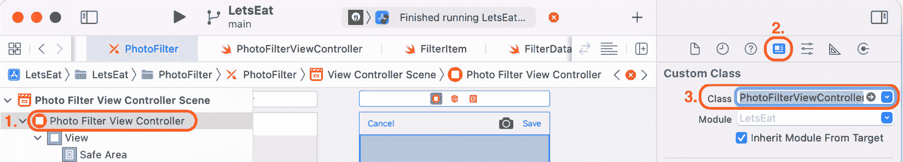

    图 20.6：身份检查器，类设置为 PhotoFilterViewController

1.  选择连接检查器。从 `collectionView` 输出口拖动到文档大纲中的 **集合视图**：

    图 20.7：显示 collectionView 输出口的连接检查器

1.  从 `mainImageView` 输出口拖动到文档大纲中的 **图像视图**：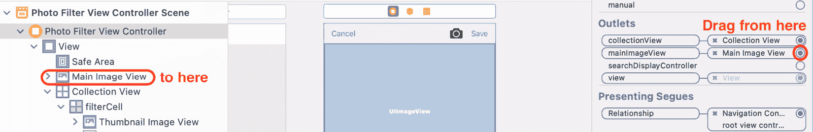

    图 20.8：显示 mainImageView 输出口的连接检查器

1.  从 `onPhotoTapped:` 动作拖动到相机按钮：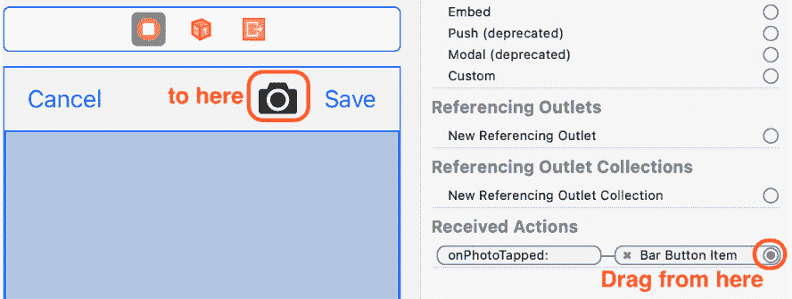

    图 20.9：显示 onPhotoTapped: 动作的连接检查器

1.  **取消** 按钮用于退出此屏幕，如果用户不想进行选择。您将 **取消** 按钮连接到上一章中实现的 unwind 方法，这将关闭此屏幕并将用户返回到 **餐厅详情** 屏幕。*Ctrl + 拖动* 从 **取消** 按钮到场景工具栏中的退出图标：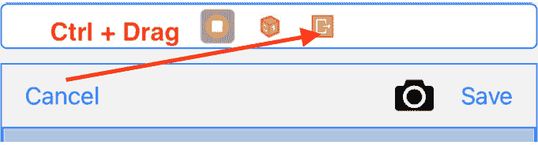

    图 20.10：显示取消按钮动作设置的相册过滤器视图控制器场景

1.  在弹出菜单中选择 `unwindReviewCancelWithSegue:`：

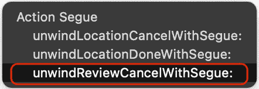

图 20.11：选择 unwindReviewCancelWithSegue 的弹出菜单

`PhotoFilterViewController` 类的所有输出口和操作都已连接。

接下来，你将实现以下方法：

+   `showCameraUserInterface()`，这是一个方法，它将在图像选择器界面中显示设备相机的视图或相册。

+   当你在图像选择器界面中选择图片或点击 `UIImagePickerController` 时，将调用两个 `UIImagePickerControllerDelegate` 协议方法，有关这些方法的信息，请访问 [`developer.apple.com/documentation/uikit/uiimagepickercontroller`](https://developer.apple.com/documentation/uikit/uiimagepickercontroller)。

    重要信息

    要了解更多关于 `UIImagePickerControllerDelegate` 的信息，请访问 [`developer.apple.com/documentation/uikit/uiimagepickercontrollerdelegate`](https://developer.apple.com/documentation/uikit/uiimagepickercontrollerdelegate)。

要实现 `showCameraUserInterface()` 和 `UIImagePickerControllerDelegate` 方法，请在项目导航器中点击 `PhotoFilterViewController` 文件，并在 `UICollectionViewDelegateFlowLayout` 扩展之后添加以下扩展：

```swift
extension PhotoFilterViewController: UIImagePickerControllerDelegate, 
UINavigationControllerDelegate {
   func showCameraUserInterface() {
      let imagePicker = UIImagePickerController()
      imagePicker.delegate = self
   #if targetEnvironment(simulator)
      imagePicker.sourceType = 
      UIImagePickerController.SourceType.photoLibrary
   #else
      imagePicker.sourceType = 
      UIImagePickerController.SourceType.camera
      imagePicker.showsCameraControls = true
   #endif
      imagePicker.mediaTypes = ["public.image"]
      imagePicker.allowsEditing = true 
      self.present(imagePicker, animated: true, 
      completion: nil)
   }
   func imagePickerControllerDidCancel(_ picker: 
   UIImagePickerController) {
      picker.dismiss(animated: true, completion: nil)
   }
   func imagePickerController(_ picker: 
   UIImagePickerController, 
   didFinishPickingMediaWithInfo info:
   [UIImagePickerController.InfoKey : Any]) {
      if let selectedImage = 
      info[UIImagePickerController.InfoKey
      .editedImage] as? UIImage {
         self.thumbnail = 
         selectedImage.preparingThumbnail(of: 
         CGSize(width: 100, height: 100))
         let mainImageViewSize = 
         mainImageView.frame.size
         self.mainImage = 
         selectedImage.preparingThumbnail(of: 
         mainImageViewSize)
      }
      picker.dismiss(animated: true){ 
         self.showApplyFilterInterface()
      }
   }
}
```

首先，让我们谈谈 `showCameraUserInterface()`。当点击相机按钮时，此方法被触发，在屏幕上显示图像选择器。这个图像选择器是标准的 iOS 图像选择器，当你想要使用图像时会出现，例如，将图像添加到 Facebook 帖子或推文中。

让我们分解一下：

```swift
let imagePicker = UIImagePickerController()
```

创建 `UIImagePickerController` 类的实例并将其分配给 `imagePicker`。

```swift
imagePicker.delegate = self
```

将 `imagePicker` 实例的 `delegate` 属性设置为 `PhotoFilterViewController` 实例。

```swift
#if targetEnvironment(simulator)
   imagePicker.sourceType = 
   UIImagePickerController.SourceType.photoLibrary
#else
   imagePicker.sourceType = 
   UIImagePickerController.SourceType.camera
   imagePicker.showsCameraControls = true
#endif
```

这段代码块被称为条件编译块。它以 `#if` 编译指令开始，以 `#endif` 编译指令结束。如果你在模拟器上运行，只有设置 `imagePicker` 实例的 `sourceType` 属性为相册的语句会被编译。如果你在实际设备上运行，设置 `imagePicker` 实例的 `sourceType` 属性为相机并显示相机控制的语句会被编译。

重要信息

你可以在以下链接中了解更多关于条件编译块的信息：[`docs.swift.org/swift-book/ReferenceManual/Statements.html#ID538`](https://docs.swift.org/swift-book/ReferenceManual/Statements.html#ID538)。

```swift
imagePicker.mediaTypes = ["public.image"]
```

将相机界面设置为捕获静态图像。

```swift
imagePicker.allowsEditing = true 
```

表示用户允许编辑所选图像。

```swift
self.present(imagePicker, animated: true, completion: nil)
```

在屏幕上呈现 `imagePicker`。

当图像选择器出现在屏幕上时，你可以选择一张照片或取消。如果你取消，将触发 `imagePickerControllerDidCancel(_:)` 并关闭图像选择器。

如果你选择了一张照片，`imagePickerController(_:didFinishPickingMediaWithInfo:)` 将被触发，并将返回并分配给 `selectedImage` 的照片。接下来，将使用 `selectedImage` 实例的 `preparingThumbnail(of:)` 方法创建一个宽度和高度为 `100` 点的小图像。然后，将此分配给 `thumbnail` 属性。之后，将使用 `preparingThumbnail(of:)` 方法从 `selectedImage` 创建与 `mainImageView` 相同大小的图像。这将分配给 `mainImage` 属性，并且图像选择器将被关闭。

重要信息

你可以在此链接中了解更多关于 `preparingThumbnail(of:)` 方法的知识：[`developer.apple.com/documentation/uikit/uiimage/3750835-preparingthumbnail`](https://developer.apple.com/documentation/uikit/uiimage/3750835-preparingthumbnail)。

接下来，你需要实现 `filterMainImage(filterItem:)` 方法，这是一个用于将过滤器应用于 `mainImageView` 中图像的方法。在 `UIImagePickerControllerDelegate` 扩展之后添加包含此方法的扩展：

```swift
extension PhotoFilterViewController: ImageFiltering {
   func filterMainImage(filterItem: FilterItem) {
      if let mainImage = mainImage, let filter = 
      filterItem.filter {
         if filter != "None" {
            mainImageView.image = 
            self.apply(filter: filter, 
            originalImage: mainImage)
         } else {
            mainImageView.image = mainImage
         }
      }
   }
}
```

这使得 `PhotoFilterViewController` 类采用 `ImageFiltering` 协议。请记住，任何采用此协议的类都会获得 `apply(filter:originalImage:)` 方法。`filterMainImage(filterItem:)` 方法使用此方法将选定的过滤器应用于存储在 `PhotoFilterViewController` 实例的 `mainImage` 属性中的照片，并将结果分配给 `mainImageView` 输出口，以便在屏幕上可见。如果你选择了 `None` 过滤器，则 `mainImage` 将分配给 `mainImageView` 输出口。

你仍然需要知道用户选择了哪个过滤器，因此你将使 `PhotoFilterViewController` 类采用 `UICollectionViewDelegate` 协议并实现识别在集合视图中被点击的单元格的方法。在 `ImageFiltering` 扩展之后添加包含此方法的以下扩展：

```swift
extension PhotoFilterViewController: 
UICollectionViewDelegate {
   func collectionView(_ collectionView: 
   UICollectionView, didSelectItemAt 
   indexPath: IndexPath) { 
      let filterItem = self.filters[indexPath.row] 
      filterMainImage(filterItem: filterItem)
   }
}
```

当用户在集合视图中点击单元格时，会调用 `collectionView(_:didSelectItemAt:)` 方法。然后，被点击的单元格对应的 `FilterItem` 将传递给 `filterMainImage(filterItem:)`。

`PhotoFilterViewController` 类的实现现在已经完成，但请记住，你必须请求使用相机或访问照片库的权限。你将修改项目中的 `Info.plist` 文件，以便当你的应用程序尝试访问相机或照片库时向用户显示消息。

# 获取使用相机或照片库的权限

如前所述，苹果规定，如果你的应用程序希望访问相机或照片库，则必须通知用户。如果你不这样做，你的应用程序将被拒绝，并且不允许在 App Store 上发布。

你将修改项目中的 `Info.plist` 文件，以便当你的应用程序尝试访问相机或照片库时显示消息。按照以下步骤操作：

1.  在项目导航器中点击`Info.plist`文件以显示键列表。将鼠标指针移至任何现有键上，并点击**+**按钮：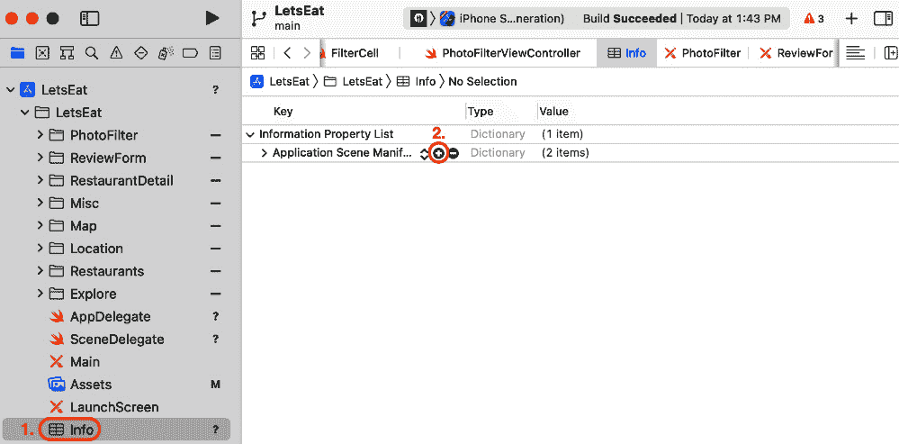

    图 20.12：编辑区域显示 Info.plist 的内容

1.  应该会出现一个字段，允许你输入一个额外的键：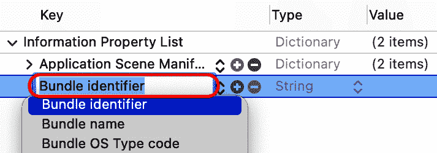

    图 20.13：编辑区域显示用于输入键的字段

1.  输入以下键：

    ```swift
    NSPhotoLibraryUsageDescription
    NSCameraUsageDescription
    ```

1.  对于每个键的值，输入一个字符串，向用户解释你为什么希望使用相机或照片库：

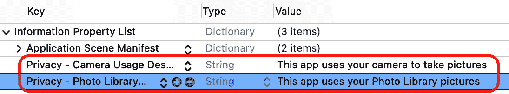

图 20.14：添加了额外键的 Info.plist

构建并运行项目。转到**餐厅详情**页面，点击**添加照片**按钮。你应该会看到以下提示：

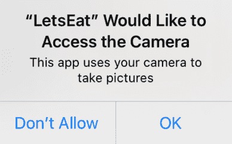

图 20.15：iOS 模拟器显示相机访问提示

点击**确定**。图片选择器将出现：

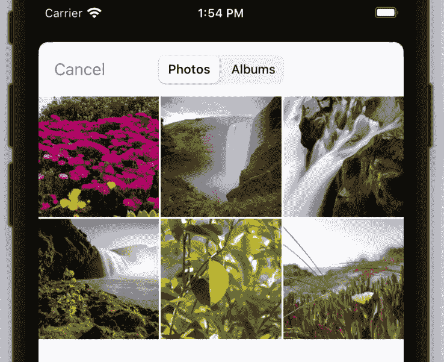

图 20.16：iOS 模拟器显示图片选择器

选择一张照片，**照片滤镜**屏幕将显示照片和一系列应用了不同滤镜的缩略图。点击一个滤镜将应用其效果到照片上：

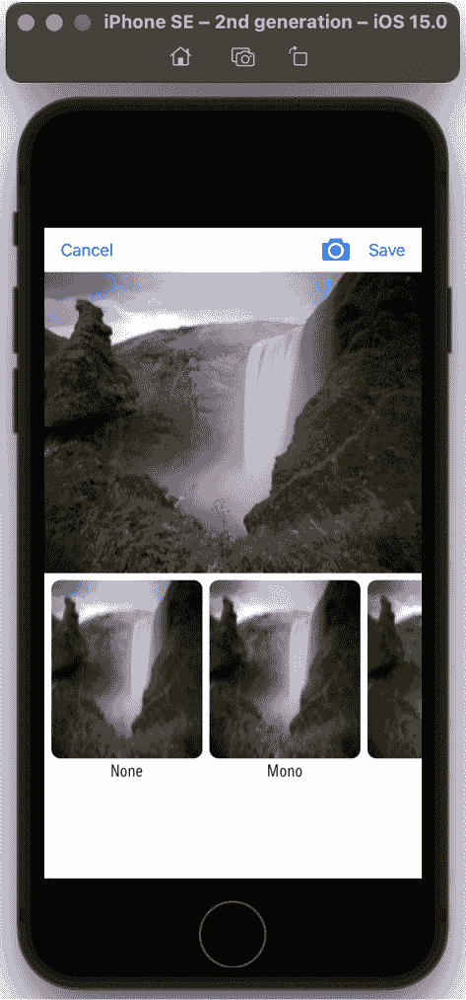

图 20.17：iOS 模拟器显示照片滤镜屏幕

你已经修改了项目中的`info.plist`文件，现在你的应用程序在使用相机或照片库之前会请求权限。你可以使用**取消**按钮关闭**照片滤镜**屏幕并返回到**餐厅详情**屏幕。不过，你目前还不能使用**保存**按钮，你将在下一章实现其功能。

# 摘要

在本章中，你完成了`FilterData.plist`的实现，这是一个包含你想要使用的滤镜的`.plist`文件，创建了`FilterItem`类来存储滤镜数据，并创建了`FilterManager`数据管理类来读取`.plist`文件并填充`FilterItem`实例的数组。然后，你创建了一个协议`ImageFiltering`，其中包含一个应用于图像的方法。接着，你创建了`FilterCell`和`PhotoFilterViewController`类来管理集合视图单元格，并且`PhotoFilterViewController`类采用了`UIImagePickerDelegate`协议，并添加了方法，以便你可以在应用程序中使用来自相机或照片库的照片。最后，你在`PhotoFilterViewController`中添加了代码，以将选定的滤镜应用到图片上。

现在，你可以编写自己的应用程序，从相机或照片库导入照片，并对其应用滤镜。

注意，选中的图片无法保存。你将在下一章学习如何使用 Core Data 保存评论和图片，这样在退出并重新启动应用后它们会再次出现。
