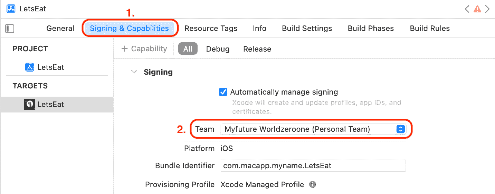

# *第二十二章*: 开始使用 Mac Catalyst

苹果的 Mac Catalyst 功能允许您创建 iPad 应用的 Mac 版本。这使您能够共享两个平台相同的项目和源代码，从而更容易维护。在 WWDC2021 期间，苹果宣布了对 Mac Catalyst 的更新，允许您为 Mac 添加更多功能，例如使用*Command + P*进行键盘导航和打印。本章将重点介绍如何使您现有的 iPhone 应用在 iPad 上运行，以便您可以创建其 Mac 版本。通过这样做，您将能够接触到超过 1 亿活跃的 Mac 用户群体。

在本章中，您将修改您的应用，使其在 iPad 和 Mac 上运行。首先，您将修复应用中的某些用户界面问题。接下来，您将学习如何使您的应用用户界面在 iPad 上工作，利用 iPad 更大的屏幕尺寸。然后，您将使用您的应用 iPad 版本来创建 Mac 版本。

到本章结束时，您将能够使您现有的 iOS 应用在所有 iOS 设备上运行良好，并且还能够从您的 iPad 应用中创建 Mac 应用。

以下内容将涵盖：

+   修复用户界面问题

+   在所有 iOS 设备上运行您的应用

+   在 Mac 上运行您的应用

# 技术要求

您将继续在上一章中修改的`LetsEat`项目中工作。

本章的完成版 Xcode 项目位于本书代码包的`Chapter22`文件夹中，可在此处下载：

[`github.com/PacktPublishing/iOS-15-Programming-for-Beginners-Sixth-Edition`](https://github.com/PacktPublishing/iOS-15-Programming-for-Beginners-Sixth-Edition)

查看以下视频以查看代码的实际运行情况：

[`bit.ly/3IbY41R`](https://bit.ly/3IbY41R)

让我们从对用户界面进行一些修改开始，使其看起来更好。

# 修复用户界面问题

您会发现的一件事是 iOS 应用永远不会真正完成。您总会找到改进和精炼应用的方法。构建并运行您的应用，并将其与应用导游中显示的设计（在*第九章*，*设置用户界面*）进行比较。您将注意到，在仔细检查后，与应用导游中显示的屏幕相比，您的应用屏幕有细微的差异，需要进行更改。让我们从您的应用的**探索**屏幕开始：


图 22.1：iOS 模拟器显示探索屏幕

对**探索**屏幕所需的更改如下。参考数字以查看需要更改的部分：

+   导航栏（**1**）在应用导游中不存在，需要将其删除。

+   收集视图单元格（**2**）有尖锐的边缘。您将为单元格实现圆角，以匹配应用导游中显示的单元格。

+   标签栏按钮是蓝色（**3**）。您将更改标签栏按钮颜色为红色，以匹配应用导游。

现在我们来看看你的应用程序的 **位置** 屏幕：


图 22.2：iOS 模拟器显示位置屏幕

应用程序导览中显示的 **位置** 屏幕顶部的较大标题缺失，你必须添加它。

如你所见，只需要进行四个小的修改，这些修改很容易实现。你将从修改 **Explore** 屏幕开始。按照以下步骤操作：

1.  在项目导航器中 `Explore` 文件夹内的 `ExploreViewController` 文件中。

1.  在 `viewDidLoad()` 方法之后添加一个 `viewWillAppear()` 方法，并在该方法内部添加代码以隐藏导航控制器中的导航栏：

    ```swift
    override func viewWillAppear(_ animated: Bool) { 
       super.viewWillAppear(animated)
       navigationController?.setNavigationBarHidden(true, 
       animated: false)
    }
    ```

    注意，如果你将此代码添加到 `viewDidLoad()` 中，导航栏仅在 **Explore** 屏幕首次出现时隐藏，并在从 **位置** 屏幕或 **餐厅列表** 屏幕切换回 **Explore** 屏幕时重新出现。

1.  要在项目导航器中 `Explore` 文件夹内的 `View` 文件夹中的 `ExploreCell` 文件（在 `Explore` 文件夹内）上圆角化集合视图单元格，并在出口声明之后添加以下方法：

    ```swift
    override func awakeFromNib() {
       super.awakeFromNib() 
       exploreImageView.layer.cornerRadius = 9 
       exploreImageView.layer.masksToBounds = true
    } 
    ```

1.  要更改标签栏按钮的颜色，在项目导航器中点击 `AppDelegate` 文件，并在最后一个花括号之后添加一个包含以下方法的 `private` 扩展：

    ```swift
    private extension AppDelegate {
       func initialize() {
          setupDefaultColors()
       }
       func setupDefaultColors() { 
          UITabBar.appearance().tintColor = .systemRed
          UITabBarItem.appearance().
          setTitleTextAttributes(
          [NSAttributedString.Key.foregroundColor: 
          UIColor.systemRed], for: 
          UIControl.State.selected)
          UINavigationBar.appearance().tintColor = 
          .systemRed 
       }
    }
    ```

    `AppDelegate` 文件包含了 `AppDelegate` 类的声明和定义。这个类处理应用程序事件，例如，当应用程序启动、发送到后台、终止等情况。你可以在启动时在这里添加代码来配置你的应用程序。

    如你之前所做的那样，你将使用一个 `initialize()` 方法来调用所有其他设置方法。在这种情况下，`initialize()` 方法调用了 `setupDefaultColors()` 方法。

    `setupDefaultColors()` 方法将更改标签栏和导航栏中项的色调颜色为红色。它使用了 `appearance()` 方法，该方法为已创建或将要创建的每个标签和导航栏设置全局属性。

    重要信息

    关于 `appearance()` 方法的更多信息可以在这里找到：[`developer.apple.com/documentation/uikit/uiappearance`](https://developer.apple.com/documentation/uikit/uiappearance)。

1.  你必须在应用程序启动时调用 `initialize()` 方法，因此修改 `application(_:didFinishLaunchingWithOptions:)` 方法如下：

    ```swift
    func application(_ application: UIApplication, didFinishLaunchingWithOptions launchOptions:[UIApplication.LaunchOptionsKey: Any]?) -> Bool {
       initialize()
       return true
    }
    ```

1.  在项目导航器中点击 `Main` 故事板文件。在 **Explore 视图控制器场景** 下，点击 **Explore Image View**。选择属性检查器，在 **视图** 下，将 **内容模式** 改为 **填充宽高**：

    图 22.3：主故事板文件显示设置为填充宽高的 Explore Image View

    这允许图像占据整个图像视图框架，并显示你在*步骤 3*中编码的圆角。

    构建并运行你的应用。**探索**屏幕应该看起来像这样：

    

    图 22.4：iOS 模拟器显示更新后的探索屏幕

    你会发现导航栏消失了，每个单元格的角落都变得圆润，当选择**探索**和**地图**按钮图标和标题时，现在会变成红色。

1.  接下来，你将更新`LocationViewController`类。在项目导航器中，点击`Location`文件夹内的`LocationViewController`文件，并修改`initialize()`方法，为`title`属性设置一个可以在导航栏中显示的标题。此代码将标题设置为`Select a location`，并在屏幕顶部用大号字体显示。

    构建并运行你的应用，然后点击**位置**按钮。**位置**屏幕应该看起来像这样：


图 22.5：iOS 模拟器显示更新后的位置屏幕

你会在屏幕顶部看到用大号字体写的**选择位置**，而**取消**和**完成**按钮现在也是红色的。

太好了！你已经完成了 iPhone 上应用的界面清理工作。前面提到的四个问题已经得到解决，你的应用屏幕现在看起来与应用导览中显示的屏幕完全一样。正如你所见，即使是微小的变化也能让你的应用更具视觉吸引力。

到目前为止，你一直在 iPhone 模拟器中运行你的应用。在下一节中，你将在 iPad 模拟器中运行你的应用，以查看需要哪些更改。然后你将修改你的应用，以便用户界面可以利用 iPad 更大的屏幕。

# 使你的应用在所有 iOS 设备上运行

在你能够从现有的 iOS 应用创建 Mac 应用之前，你需要修改用户界面以适应 iPad。为了查看你需要进行哪些更改，你将在 iPad 模拟器上构建并运行你的应用。按照以下步骤操作：

1.  如果模拟器正在运行，请关闭它。在**方案**菜单中的模拟器列表中选择**iPad Pro (9.7 英寸**)，并运行你的应用：

    图 22.6：选择 iPad Pro (9.7 英寸)的方案菜单

1.  iPad 模拟器将启动并如以下截图所示：


图 22.7：iPad 模拟器显示探索屏幕

如你所见，**探索**屏幕上的集合视图自动占据整个屏幕宽度，集合视图单元格的大小与 iPhone 上的大小相同。尽管你可以为 iPhone 和 iPad 使用完全相同的用户界面，但如果你能根据每个设备进行定制会更好。

要做到这一点，您需要添加一些代码，以便您的应用程序可以识别其正在运行的设备类型。接下来，您将更新应用程序的用户界面以适应 iPad 的大屏幕，并使应用程序根据设备类型自动切换用户界面。

让我们看看如何在下一节中使您的应用程序检测其正在运行的设备类型。

## 识别设备类型

您需要向您的应用程序添加一些代码，以便它知道正在运行的设备。按照以下步骤操作：

1.  右键单击`Misc`文件夹并选择**新建文件**。

1.  **iOS**应该已经选中。选择**Swift 文件**然后点击**下一步**。

1.  将此文件命名为`Device`。点击`Device`文件出现在项目导航器中。

1.  按照所示修改文件以创建一个`Device`枚举：

    ```swift
    import UIKit
    enum Device {
       static var isPhone: Bool {
    UIDevice.current.userInterfaceIdiom == 
          .phone
       }
       static var isPad: Bool {
    UIDevice.current.userInterfaceIdiom == 
          .pad
       }
    }
    ```

这里，使用枚举而不是类或结构体，因为您无法意外地创建其实例。`UIDevice`类表示应用程序正在运行的设备。`UIDevice.current.userInterfaceIdiom`返回`.phone`如果应用程序正在 iPhone 上运行，如果应用程序正在 iPad 上运行，则返回`.pad`。因此，当应用程序在 iPhone 上运行时，`isPhone`返回`true`，当应用程序在 iPad 上运行时，`isPad`返回`true`。

除了设备类型之外，您还必须考虑设备方向。例如，横向模式的 iPhone 比纵向模式的 iPhone 更宽，尽管它们是同一部 iPhone。让我们在下一节中学习如何使用**尺寸类别**来处理设备方向。

## 理解尺寸类别

虽然您现在可以识别应用程序正在运行的设备类型，但您还必须考虑设备方向对用户界面的影响。由于屏幕尺寸种类繁多，无论是纵向还是横向，这可能会很具挑战性。为了使这更容易，您将使用尺寸类别而不是设备的物理分辨率。

重要信息

关于尺寸类别的更多信息，请参阅此链接：[`developer.apple.com/design/human-interface-guidelines/ios/visual-design/adaptivity-and-layout/`](https://developer.apple.com/design/human-interface-guidelines/ios/visual-design/adaptivity-and-layout/)。

尺寸类别是自动分配给视图的特性。定义了两个类别来描述视图的高度和宽度；常规（扩展空间）和紧凑（受限空间）。让我们看看不同设备上全屏视图的尺寸类别：


图 22.8：不同 iOS 设备的尺寸类别

当您设计用户界面时，不仅要考虑设备类型，还要考虑尺寸类别。在下一节中，您将学习如何根据设备和尺寸类别设置集合视图单元格的大小。

## 更新探索屏幕

对于 **探索** 屏幕，假设你决定在 iPad 上显示三列，对于紧凑型宽度尺寸类显示两列，对于常规宽度尺寸类显示三列。你将添加方法来根据设备和方向设置集合视图单元格的大小。按照以下步骤操作：

1.  在项目导航器中点击 `ExploreViewController` 文件，并修改 `private` 扩展内的 `initialize()` 方法，如下所示：

    ```swift
    func initialize() { 
       manager.fetch() 
       setupCollectionView() is not declared or defined yet. You'll do that next.
    ```

1.  `setupCollectionView()` 方法将在 `initialize()` 方法中使用，以向集合视图添加 `UICollectionViewFlowLayout` 实例：

    ```swift
    func setupCollectionView() {
       let flow = UICollectionViewFlowLayout()
       flow.sectionInset = UIEdgeInsets(top: 7, left: 7, 
       bottom: 7, right: 7)
       flow.minimumInteritemSpacing = 0
       flow.minimumLineSpacing = 7
       collectionView.collectionViewLayout = flow
    }
    ```

    此方法创建了一个 `UICollectionViewFlowLayout` 类的实例，将集合视图的所有边缘内边距设置为 `7` 点，将最小项目间距设置为 `0` 点，将最小行间距设置为 `7` 点，并将其分配给集合视图。记住，你最初使用大小检查器为集合视图设置了这些值，如*第十章**，构建用户界面*。

1.  在闭合花括号之后添加一个扩展，包含将设置集合视图单元格大小和集合视图部分标题的方法：

    ```swift
    extension ExploreViewController: UICollectionViewDelegateFlowLayout {
       func collectionView(_ collectionView: 
       UICollectionView, layout collectionViewLayout: 
       UICollectionViewLayout, sizeForItemAt indexPath: 
       IndexPath) -> CGSize {
          var columns: CGFloat = 2 
          if Device.isPad ||
          (traitCollection.horizontalSizeClass !=  
          .compact) {
             columns = 3
          } 
          let viewWidth = collectionView.frame.size.width
          let inset = 7.0 
          let contentWidth = viewWidth - inset * 
          (columns + 1)
          let cellWidth = contentWidth / columns
          let cellHeight = cellWidth
          return CGSize(width: cellWidth, height: 
          cellHeight)
       }
       func collectionView(_ collectionView: 
       UICollectionView, layout collectionViewLayout: 
       UICollectionViewLayout, 
       referenceSizeForHeaderInSection section: Int) -> 
       CGSize {
          return CGSize(width: collectionView.frame.width,
          height: 100)
       }
    }
    ```

    这些方法在 `UICollectionViewDelegateFlowLayout` 协议中声明，并定义了集合视图中的项目大小和间距。它们将覆盖大小检查器中的设置。让我们来分解它们：

    ```swift
    func collectionView(_ collectionView: UICollectionView, layout collectionViewLayout: UICollectionViewLayout, sizeForItemAt indexPath: IndexPath) -> CGSize {
    ```

    此方法返回一个 `CGSize` 实例，集合视图单元格的大小应设置为。

    ```swift
    var columns: CGFloat = 2
    ```

    `columns` 变量决定了屏幕上显示的列数，并且最初被设置为 `2`。

    ```swift
    if Device.isPad || (traitCollection.horizontalSizeClass != .compact) {
    ```

    检查应用是否正在 iPad 上运行或 `horizontalSizeClass` 属性不是 `.compact`。

    ```swift
    columns = 3
    ```

    如果应用正在 iPad 上运行或水平尺寸类不是 `.compact`，则将 `columns` 设置为 `3`。

    ```swift
    let viewWidth = collectionView.frame.size.width
    ```

    获取屏幕宽度并将其分配给 `viewWidth`。

    ```swift
    let inset = 7.0
    let contentWidth = viewWidth - inset * (columns + 1)
    ```

    减去边缘内边距所占用的空间，以便确定单元格大小。

    ```swift
    let cellWidth = contentWidth / columns 
    ```

    通过将 `contentWidth` 除以 `columns` 来获取单元格的宽度，并将其分配给 `cellWidth`。

    ```swift
    let cellHeight = cellWidth
    ```

    将单元格的高度设置为与单元格的宽度相同。

    ```swift
    return CGSize(width: cellWidth, height: cellHeight)
    }
    ```

    返回单元格大小。

假设你正在 iPhone 13 Pro Max 上以竖屏模式运行。`columns` 被设置为 `2`。`viewWidth` 被分配为 iPhone 屏幕的宽度，即 `414` 点。`contentWidth` 被设置为 `414 - (7 x 3) = `393`。`cellWidth` 被设置为 `contentWidth` / `columns` = `196.5`，而 `cellHeight` 被设置为 `cellWidth`，因此返回的 `CGSize` 将是 `(196.5, 196.5)`，使得一行可以容纳两个单元格。

当将相同的 iPhone 旋转到横屏模式时，`columns` 设置为 `3`。`viewWidth` 将被分配为 iPhone 屏幕的高度，即 `896` 点。`contentWidth` 被设置为 `896 - (7 x 4) = `868`。`cellWidth` 被设置为 `contentWidth` / `columns` = `289.3`，而 `cellHeight` 被设置为 `cellWidth`，因此返回的 `CGSize` 将是 `(289.3, 289.3)`，使得三行可以容纳三个单元格。

```swift
func collectionView(_ collectionView: UICollectionView, layout collectionViewLayout: UICollectionViewLayout, referenceSizeForHeaderInSection section: Int) -> CGSize { 
```

此方法返回集合视图部分标题应设置的大小。

```swift
return CGSize(width: collectionView.frame.width, height: 100)
```

集合视图部分标题的宽度将取决于设备方向，但高度始终为`100`。

在 iPad 模拟器上构建并运行你的应用。你应该看到显示三列：


图 22.9：iPad 模拟器显示更新后的探索屏幕

在 iPhone 13 Pro Max 模拟器上构建并运行你的应用，你应该看到显示两列：


图 22.10：iPhone 13 Pro Max 模拟器显示横幅模式下的更新后的探索屏幕

在模拟器菜单中选择**设备** | **向左旋转**，你会看到显示三列：


图 22.11：iPhone 13 Pro Max 模拟器显示横幅模式下的更新后的探索屏幕

在模拟器菜单中选择**设备** | **向右旋转**以返回垂直方向。

你已经在下一节中完成了对`RestaurantListViewController`类的修改。

## 更新餐厅列表屏幕

你已经修改了**探索**屏幕以自动适应应用运行的设备。现在你将为**餐厅列表**屏幕做同样的操作。如果你在 iPad 模拟器上构建并运行，这是**餐厅列表**屏幕的样子：


图 22.12：iPad 模拟器显示餐厅列表屏幕

如你所见，只有两列，它们之间有一个很大的空白区域。假设你希望在 iPad 上显示三列，一个列用于紧凑型宽度尺寸类，两个列用于常规宽度尺寸类。按照以下步骤操作：

1.  在项目导航器中点击`Restaurants`文件夹内的`RestaurantListViewController`文件。在扩展中的所有其他代码之前，在`private`扩展中创建一个`initialize()`方法：

    ```swift
    func initialize() { 
       createData() 
       setupTitle() 
       setupCollectionView()
    }
    ```

    `createData()`和`setupTitle()`方法都在`viewDidAppear()`中被调用，但稍后你会修改`viewDidAppear()`以调用`initialize()`。你会看到一个错误，因为`setupCollectionView()`方法尚未声明或定义。

1.  在`initialize()`方法之后，在`private`扩展中声明并定义`setupCollectionView()`方法：

    ```swift
    func setupCollectionView() {
       let flow = UICollectionViewFlowLayout()
       flow.sectionInset = UIEdgeInsets(top: 7, left: 7, 
       bottom: 7, right: 7)
       flow.minimumInteritemSpacing = 0
       flow.minimumLineSpacing = 7
       collectionView.collectionViewLayout = flow
    }
    ```

    就像之前一样，`setupCollectionView()`创建了一个`UICollectionViewFlowLayout`类的实例，配置它，并将其分配给集合视图。

1.  在闭合花括号之后添加一个包含`UICollectionViewDelegateFlowLayout`方法的扩展：

    ```swift
    extension RestaurantListViewController: 
    UICollectionViewDelegateFlowLayout {
       func collectionView(_ collectionView: 
       UICollectionView, layout collectionViewLayout: 
       UICollectionViewLayout, sizeForItemAt indexPath: 
       IndexPath) -> CGSize {
          var columns: CGFloat = 0 
          if Device.isPad { 
             columns = 3
          } else {
             columns = 
             traitCollection.horizontalSizeClass 
             == .compact ? 1 : 2 
          }
          let viewWidth = collectionView.frame.size.width 
          let inset = 7.0
          let contentWidth = viewWidth - inset * 
          (columns + 1)
          let cellWidth = contentWidth / columns
          let cellHeight = 312.0
          return CGSize(width: cellWidth, height: 
          cellHeight)
       }
    }
    ```

    这里实现的`collectionView(_:layout:sizeForItemAt:)`方法几乎与`ExploreViewController`类中的实现完全相同，但`cellHeight`被设置为`312`点，而不是设置为`cellWidth`。请注意，如果你没有在 iPad 上运行你的应用，`columns`将设置为`1`用于紧凑宽度尺寸类，并设置为`2`用于常规宽度尺寸类。

1.  通过移除对`createData()`和`setupTitle()`方法的调用，并添加对`initialize()`方法的调用来更新`viewDidAppear()`：

    ```swift
    override func viewDidAppear(_ animated: Bool) {
       super.viewDidAppear(animated)
       initialize()
    }
    ```

    在 iPad 模拟器上构建和运行你的应用，然后转到**餐厅列表**屏幕，如图所示：


图 22.13：iPad 模拟器显示更新后的餐厅列表屏幕

现在有三个列，宽白间隙消失了。现在在 iPhone 13 Pro Max 模拟器上构建和运行你的应用。**餐厅列表**屏幕应显示单列：


图 22.14：iPhone 13 Pro Max 模拟器显示横幅模式的更新后的餐厅列表屏幕

在模拟器菜单中选择**设备** | **向左旋转**，你应该看到两列：


图 22.15：iPhone 13 Pro Max 模拟器显示横幅模式的更新后的餐厅列表屏幕

在模拟器菜单中选择**设备** | **向右旋转**，然后退出模拟器。

**探索**屏幕和**餐厅列表**屏幕已更新，现在你的应用在 iPad 上看起来很好。现在它是一个完美的候选者，可以制作成 Mac 应用。让我们看看如何在下一节中从现有的 iPad 应用构建 Mac 应用。

# 更新应用以在 macOS 上运行

你已经修改了你的应用屏幕，使其在所有 iOS 设备上都能良好运行。现在你将学习如何让你的应用在 Mac 上运行。

苹果在 WWDC2021 期间更新了 Mac Catalyst，这使得从现有的 iPad 应用构建具有 Mac 特定优化的 Mac 应用成为可能。正如你将看到的，这两个应用将共享相同的项目和源代码。

重要信息

观看以下链接中的视频，了解苹果在 WWDC2021 期间宣布的 Mac Catalyst 的最新更新：[`developer.apple.com/videos/play/wwdc2021/10052/`](https://developer.apple.com/videos/play/wwdc2021/10052/)。

关于 Mac Catalyst 的更多信息可在[`developer.apple.com/mac-catalyst/`](https://developer.apple.com/mac-catalyst/)找到。

在开始之前，请注意，这仅在您拥有免费或付费的 Apple 开发者账户时才有效。如果您使用从 GitHub 下载的`Chapter24`文件夹中的项目文件[`github.com/PacktPublishing/iOS-15-Programming-for-Beginners-Sixth-Edition`](https://github.com/PacktPublishing/iOS-15-Programming-for-Beginners-Sixth-Edition)，您必须为您的应用设置开发团队，以便它能在您的 Mac 上运行。按照以下步骤操作：

1.  在项目导航器中选择您的项目：

    图 22.16：项目导航器显示选中的 LetsEat 项目

1.  在**通用**选项卡中，勾选**Mac**复选框：

    图 22.17：显示在通用面板中勾选的 Mac 复选框

1.  在**启用 Mac 支持？**对话框中，点击**启用**：

    图 22.18：启用 Mac 支持？对话框

1.  注意现在**Mac**复选框已被勾选：

    图 22.19：显示已勾选 Mac 复选框的编辑区域

    您的应用将重新编译以在您的 Mac 上运行。注意**显示“专为 iPad 设计”运行目标**复选框。如果您拥有 Apple Silicon Mac，您可以选择此目标以在您的 Mac 上本地运行未修改的 iPad 应用。

1.  您的 Mac 已被设置为运行目标。构建并运行您的应用。

1.  如果您的项目构建失败，请点击问题导航器按钮并检查错误信息：

    图 22.20：问题导航器显示错误信息

    如果您看到这里显示的错误，这是因为您需要一个免费或付费的开发者账户才能在真实硬件上运行您的应用。

1.  检查您的开发者账户是否已添加到 Xcode 的**Xcode** | **首选项** | **账户**中。

    小贴士

    在*第一章，熟悉 Xcode*中介绍了如何将您的开发者账户添加到 Xcode 中。

1.  点击**签名与能力**选项卡。在**团队**下拉菜单中选择您的付费或免费开发者账户：

    图 22.21：显示在签名与能力选项卡中团队下拉菜单的编辑区域

1.  再次构建和运行，您应该能看到您的应用在您的 Mac 上运行：


图 22.22：LetsEat Mac 应用

您的应用现在已在您的 Mac 上运行！太棒了！

如果您仍然看到错误，请尝试将**Bundle Identifier**的值更改为一个唯一的值，并首先在您的 iOS 设备上运行您的应用。

你还需要做一些额外的工作来使其成为一个真正优秀的 Mac 应用程序，但这超出了本书的范围。苹果公司有一个非常棒的教程，介绍了如何做到这一点，链接如下：[`developer.apple.com/tutorials/mac-catalyst`](https://developer.apple.com/tutorials/mac-catalyst)。

# 摘要

在本章中，你学习了如何将现有的 iOS 应用程序构建成一个 Mac 应用程序。

你从优化应用程序在 iPhone 上的用户界面开始。接下来，你添加了一些代码，使你的应用程序能够检测它正在运行的设备，并修改了应用程序的屏幕，使其能够在所有 iOS 设备上运行。最后，你使用 Mac Catalyst 从你的 iPad 应用程序构建了一个 Mac 应用程序。你的应用程序现在在 iPhone、iPad 和 Mac 上都运行得很好。

现在，你能够让你的现有 iPhone 应用程序在 iPad 上运行良好，并且也可以从你的 iPad 应用程序中创建 Mac 应用程序。正如你所看到的，一旦你有一个 iPhone 应用程序，你就可以相对轻松地让它同时在 iPad 和 Mac 上运行。

在下一章中，你将学习一种全新的构建应用程序的方法，使用 **SwiftUI**，这是一种为任何苹果平台编写应用程序的现代方式。
