# *第二十三章*：SwiftUI 入门

在前面的章节中，您使用故事板为 *Let's Eat* 应用程序创建了 **用户界面**（**UI**）。这个过程涉及将表示视图的对象拖动到故事板中，在视图控制器文件中创建输出，并将两者连接起来。

本章将重点介绍 **SwiftUI**，这是一种简单且创新的方法，可以在所有 Apple 平台上创建应用程序。SwiftUI 使用声明性的 Swift 语法来指定用户界面，而不是使用故事板，并与新的 Xcode 设计工具协同工作，以保持代码和设计的同步。动态类型、深色模式、本地化和无障碍功能都自动支持。

在本章中，您将使用 SwiftUI 构建一个简化版的 *Let's Eat* 应用程序。此应用程序将仅包含您一直在工作的 `LetsEat` 项目。您将创建一个新的 SwiftUI Xcode 项目。

您将首先添加并配置 SwiftUI 视图，通过添加和配置一个用于 **餐厅详情** 屏幕的地图视图，将 `UIKit` 和 SwiftUI 视图一起创建。最后，您将创建 **餐厅详情** 屏幕。

到本章结束时，您将学习如何构建一个 SwiftUI 应用程序，该应用程序可以读取模型对象，以列表形式展示它们，并允许导航到包含地图视图的第二屏幕。然后您可以为您的项目实现此功能。

以下内容将涵盖：

+   创建 SwiftUI Xcode 项目

+   创建 **餐厅列表** 屏幕

+   添加模型对象和配置导航

+   使用 UIKit 和 SwiftUI 视图一起

+   创建餐厅详情屏幕

# 技术要求

您将为本章创建一个新的 SwiftUI Xcode 项目。

本章节的资源文件和完成的 Xcode 项目位于本书代码包的 `Chapter23` 文件夹中，您可以在此处下载：

[`github.com/PacktPublishing/iOS-15-Programming-for-Beginners-Sixth-Edition`](https://github.com/PacktPublishing/iOS-15-Programming-for-Beginners-Sixth-Edition)

查看以下视频，以查看代码的实际运行效果：

[`bit.ly/3DnHuIN`](https://bit.ly/3DnHuIN)

让我们从下一节开始创建一个新的 SwiftUI Xcode 项目，用于您的 SwiftUI 应用程序。

# 创建 SwiftUI Xcode 项目

创建 SwiftUI Xcode 项目的方式与常规 Xcode 项目相同，但您需要配置它以使用 SwiftUI 而不是故事板。正如您将看到的，用户界面完全由代码生成，您在修改代码时可以立即看到用户界面的变化。

重要信息

您可以在 [`developer.apple.com/videos/play/wwdc2020/10119`](https://developer.apple.com/videos/play/wwdc2020/10119) 上观看 Apple 在 WWDC 2020 上的 SwiftUI 演示视频。

您可以在 [`developer.apple.com/videos/play/wwdc2021/10018/`](https://developer.apple.com/videos/play/wwdc2021/10018/) 上观看 WWDC 2021 中 SwiftUI 新功能的视频。

您可以在网上找到 Apple 官方的 SwiftUI 文档，网址为[`developer.apple.com/xcode/swiftui/`](https://developer.apple.com/xcode/swiftui/)。

让我们从创建一个新的 SwiftUI Xcode 项目开始。按照以下步骤操作：

1.  创建一个新的 Xcode 项目。

1.  点击**iOS**。选择**App**模板，然后点击**下一步**：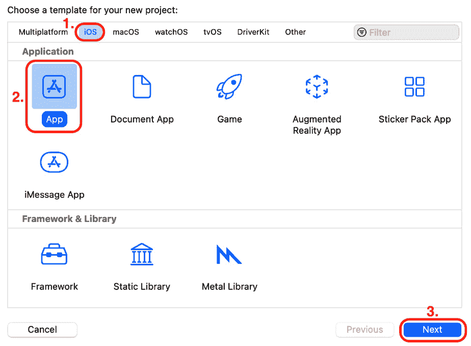

    图 23.1：选择 iOS App 模板的项目模板屏幕

1.  The `LetsEatSwiftUI`

1.  **界面：** **SwiftUI**

    其他设置应该已经设置好了。确保所有复选框都没有勾选。完成后点击**下一步**。

1.  选择保存`LetsEatSwiftUI`项目的位置并点击**创建**。

1.  您的项目将显示在屏幕上，项目导航器中选中了`ContentView`文件。您将在编辑器区域的左侧看到此文件的内容，以及包含预览的画布在右侧：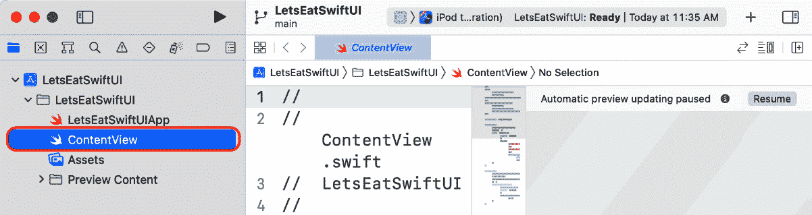

    图 23.3：显示 LetsEatSwiftUI 项目的 Xcode

1.  `ContentView`文件包含将生成您应用初始视图的代码。点击方案菜单并选择**iPhone SE（第二代**）以便使用**iPhone SE（第二代**）的屏幕预览视图：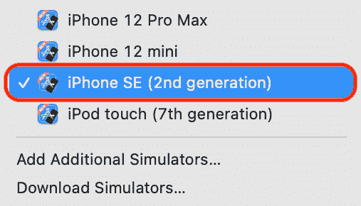

    图 23.4：选择 iPhone SE（第二代）的方案菜单

1.  在画布中点击**简历**按钮以生成预览：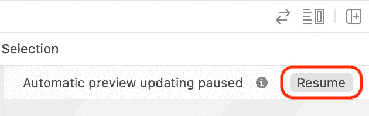

    图 23.5：显示简历按钮的画布

1.  确认您的应用预览显示在画布中：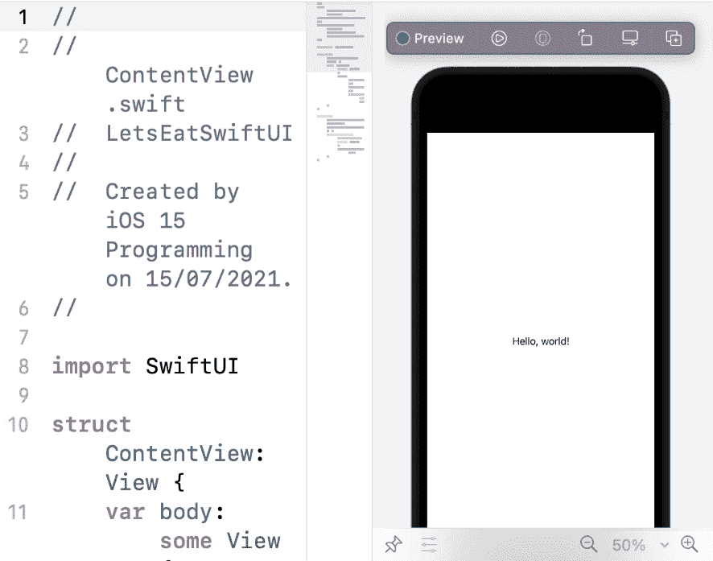

    图 23.6：显示应用预览的画布

    如果画布不可见，从**调整编辑器选项**菜单中选择**画布**以显示它。如果您使用的是 MacBook，您可以在触摸板上使用捏合手势来调整模拟图像的大小。

1.  如果您需要更多的工作空间，点击导航器和编辑器按钮以隐藏导航器和编辑器区域，并将编辑器区域中的边框拖动以调整画布大小：

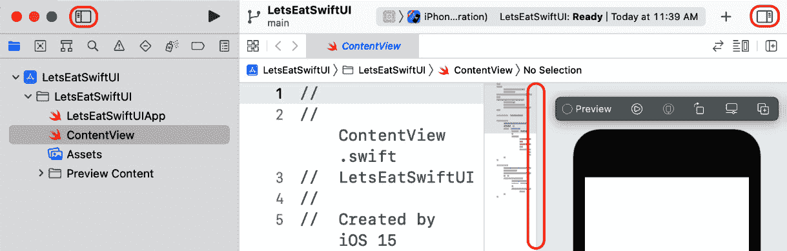

图 23.7：显示导航按钮、编辑按钮和边框的 Xcode 界面

现在，让我们看看`ContentView`文件。此文件包含两个结构，`ContentView`和`ContentView_Previews`。`ContentView`结构描述了视图的内容和布局，并符合`View`协议。`ContentView_Previews`结构声明了`ContentView`结构的预览。预览在画布中显示。

要查看此操作的实际效果，将`Hello, World!`文本更改为`Lets Eat`，如图所示：

```swift
struct ContentView: View {
   var body: some View { 
      Text("Lets Eat").padding()
   }
}
```

画布中的预览会更新以反映您的更改：


图 23.8：画布显示带有文本视图的应用预览

您已成功创建了您的第一个 SwiftUI 项目！现在让我们创建“餐厅列表”屏幕，从一个将显示特定餐厅数据的视图开始。

# 创建餐厅列表屏幕

当使用故事板时，您使用属性检查器修改视图的属性。在 SwiftUI 中，您可以修改代码或画布中的预览。如您所见，更改`ContentView`文件中的代码将立即更新预览，而修改预览将更新代码。

让我们自定义`ContentView`结构以显示特定餐厅的数据。按照以下步骤操作：

1.  点击库按钮。在过滤器字段中输入`tex`，然后拖动一个`Let's Eat`文本：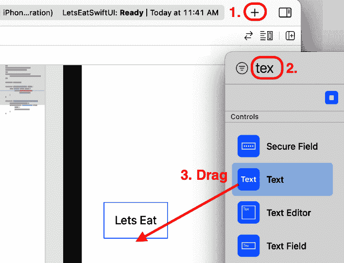

    图 23.9：库中要拖动的文本对象

1.  Xcode 已自动为这个文本视图向`ContentView`文件中添加了代码。确认您的代码看起来像这样：

    ```swift
    struct ContentView: View {
       var body: some View { 
          "Lets Eat" string, and both text views are enclosed in a VStack view. A VStack view contains subviews that are arranged vertically, and it is similar to a vertically oriented stack view.
    ```

1.  您将使用波士顿的 Tap Trailhouse 餐厅作为示例数据。修改`VStack`视图中的文本视图，以显示 Tap Trailhouse 餐厅提供的名称和菜系：

    ```swift
    struct ContentView: View {
       var body: some View { 
          VStack {
             Text("The Tap Trailhouse").padding()
             Text("Brewery, Burgers, American")
          }
       }
    }
    ```

1.  确认更改已反映在预览中：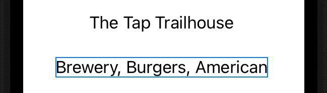

    图 23.10：应用预览显示 Tap Trailhouse 的名称和菜系

1.  您将使用 SwiftUI 图像视图来显示餐厅的照片。按照所示修改您的代码以将图像视图添加到您的`VStack`视图中：

    ```swift
    struct ContentView: View {
       var body: some View { 
          VStack {
             Text("The Tap Trailhouse").padding()
             Text("Brewery, Burgers, American")
             systemName. This parameter allows you to choose one of the images in Apple's SF Symbols library. You'll replace this SF Symbols image with a photo later.Important InformationYou can learn more about the SF Symbols library here: [`developer.apple.com/sf-symbols/`](https://developer.apple.com/sf-symbols/).
    ```

1.  确认您的画布现在显示两个文本视图和一个图像视图，如下所示：

    图 23.11：应用预览显示两个文本视图和一个图像视图

1.  要更改文本的外观，您使用**修饰符**而不是属性检查器。这些是改变对象外观或行为的方法。按照所示更新您的代码以设置文本视图的样式和颜色：

    ```swift
    struct ContentView: View {
       var body: some View { 
          VStack {
             Text("The Tap Trailhouse")
                .font(.headline)
             Text("Brewery, Burgers, American")
                .font(.subheadline)
                .foregroundColor(.secondary)
             Image(systemName: "photo")
          }
       }
    }
    ```

    注意预览中文本的变化。

1.  为了确保您的视图保持在屏幕中间，您将在`HStack`视图中嵌入它，并在两侧添加`Spacer`对象。`HStack`视图包含水平排列的子视图，它类似于水平方向的堆叠视图。`Spacer`对象是一个在`HStack`视图中水平扩展的灵活空间。在您的`VStack`视图中*Command + 点击*并从弹出菜单中选择**嵌入到 HStack 中**：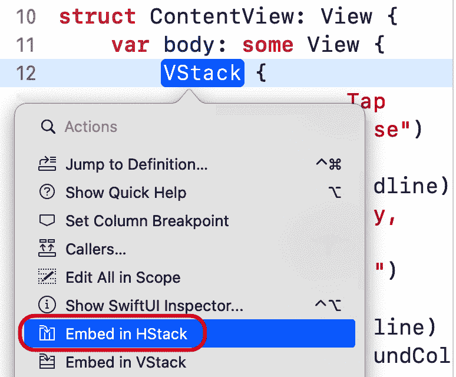

    图 23.12：编辑区域显示已选择嵌入到 HStack 的弹出菜单

1.  确认您的代码看起来像这样：

    ```swift
    struct ContentView: View {
       var body: some View {
          HStack {
             VStack {
                Text("The Tap Trailhouse")
                   .font(.headline)
                Text("Brewery, Burgers, American")
                   .font(.subheadline)
                   .foregroundColor(.secondary)
                Image(systemName: "photo")
             }
          }
       }
    }
    ```

1.  按照所示在`HStack`视图中添加两个`Spacer`对象以在屏幕上水平居中视图：

    ```swift
    HStack {
       Spacer()
       VStack {
          Text("The Tap Trailhouse")
             .font(.headline)
          Text("Brewery, Burgers, American")
             .font(.subheadline)
             .foregroundColor(.secondary)
          Image(systemName: "photo")
       }
       Spacer()
    }
    ```

你的视图现在已完成。你将在下一节中将此视图用作 **Restaurant List** 屏幕中的单元格。

# 添加模型对象和配置导航

现在你有一个可以用来显示餐厅详细信息的视图。你将使用此视图作为 SwiftUI 列表中的单元格，这是一个容器，用于以单列形式呈现数据。你还将配置模型对象以填充此列表。按照以下步骤操作：

1.  在 `HStack` 视图上按 **Command + click** 并选择 **Embed in List** 以在画布中显示包含五个单元格的列表：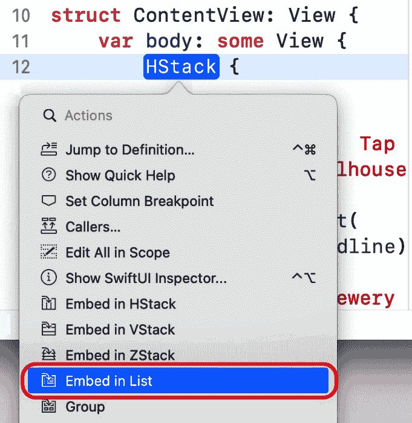

    图 23.13：显示已选择“嵌入列表”的弹出菜单的编辑区域

1.  确保你的代码看起来像这样：

    ```swift
    struct ContentView: View {
       var body: some View {
          HStack view is no longer needed. Note that no delegates and data sources are required to display data in the list.
    ```

1.  打开你从 [`github.com/PacktPublishing/iOS-15-Programming-for-Beginners-Sixth-Edition`](https://github.com/PacktPublishing/iOS-15-Programming-for-Beginners-Sixth-Edition) 下载的代码包中的 `Chapter23` 文件夹中的 `resources` 文件夹。将 `RestaurantItem.swift` 文件拖到项目导航器中，并在提示时点击 **Finish** 以将其添加到你的项目中。

1.  在项目导航器中点击 `RestaurantItem` 文件，你应该在其中看到以下代码：

    ```swift
    import Foundation
    import MapKit
    struct RestaurantItem: Identifiable {
       var id = UUID()
       var name: String
       var address: String
       var city: String
       var cuisines: [String] = []
       var lat: CLLocationDegrees
       var long: CLLocationDegrees
       var imageURLString: String
       var title: String {
          return name
       }
       var subtitle: String {
          if cuisines.isEmpty { return "" }
          else if cuisines.count == 1 { return 
          cuisines.first! }
          else { return cuisines.joined(
          separator: ", ")}
       }
    }
    let testData = [
    RestaurantItem(name: "The Tap Trailhouse", address: "17 Union St", city: "Boston", cuisines: ["Brewery","Burgers","American"], lat: 42.360847, long: -71.056819, imageURLString: "https://resizer.otstatic.com/v2/profiles/legacy/145237.jpg"),
    RestaurantItem(name: "o ya", address: "9 East Street", city: "Boston", cuisines: ["Japanese","Sushi","Int'l"], lat: 42.351353, long: -71.056941, imageURLString: "https://resizer.otstatic.com/v2/profiles/legacy/28066"),
    RestaurantItem(name: "Skipjack's Boston", address: "199 Clarendon St.", city: "Boston", cuisines: ["American", "Burgers","Brewery"], lat: 42.349887, long: -71.07484, imageURLString: "https://resizer.otstatic.com/v2/profiles/legacy/11656"),
    RestaurantItem(name: "The Elephant Walk", address: "900 Beacon Street", city: "Boston", cuisines: ["Panasian", "Vietnamese","Int'l"], lat: 42.346541, long: -71.105827, imageURLString: "https://resizer.otstatic.com/v2/profiles/legacy/1635"),
    RestaurantItem(name: "Metropolis Cafe", address: "584 Tremont Street", city: "Boston", cuisines: ["Mediterranean", "Int'l","Tapas"], lat: 42.3432, long: -71.0727, imageURLString: "https://resizer.otstatic.com/v2/profiles/legacy/2829")
    ]
    ```

    `RestaurantItem` 文件包含一个结构 `RestaurantItem` 和一个数组 `testData`。

    `RestaurantItem` 结构与你在 `LetsEat` 项目中使用的 `RestaurantItem` 类类似。要在列表中使用此结构，你必须使其符合 `Identifiable` 协议。此协议指定列表项必须有一个 `id` 属性，可以识别特定项。每个 `RestaurantItem` 实例在创建时都会分配一个 `UUID` 实例，以确保每个 `id` 都是唯一的。

    重要信息

    你可以在此链接中了解更多关于 `Identifiable` 协议的信息：[`developer.apple.com/documentation/swift/identifiable`](https://developer.apple.com/documentation/swift/identifiable)。

    `testData` 是一个包含五个 `RestaurantItem` 实例的数组，代表波士顿地区的五家餐厅。它执行与本书早期章节中使用的 JSON 文件相同的功能。

1.  在项目导航器中点击 `ContentView` 文件。在 `ContentView` 结构的开头大括号后添加一个 `restaurantItems` 属性来保存列表的数据。

    ```swift
    struct ContentView: View {
       var restaurantItems: [RestaurantItem] = []
       var body: some View {
    ```

1.  按照所示修改你的代码，用测试数据填充你的列表，并在每个单元格中显示餐厅的数据：

    ```swift
    struct ContentView: View {
       var restaurantItems: [RestaurantItem] = []
       var body: some View {
          List(ContentView structure stores an array of RestaurantItem instances in the restaurantItems property. This array is passed to the list. For every item in the restaurantItems array, a view is created and assigned with data from the item's properties. The image for each restaurant is downloaded from the URL stored in the item's imageURLString property, and displayed using the new AsyncImage view introduced in iOS 15\. Since there are five items in the array, five views appear in the canvas. Important InformationYou can learn more about the `AsyncImage` view at this link:[`developer.apple.com/documentation/swiftui/asyncimage`](https://developer.apple.com/documentation/swiftui/asyncimage)The `ContentView_Previews` structure passes in the `testData` array (stored in the `RestaurantItem` file) to the `ContentView` structure, which is then used to populate the view.
    ```

1.  当你对代码进行重大更改时，画布的自动更新会暂停。如果需要，点击 **Resume** 按钮以继续。请注意，单元格大小已更改以适应餐厅图片的大小。

接下来，你将实现导航，以便当单元格被点击时，会显示一个第二屏幕，显示特定餐厅的详细信息。按照以下步骤操作：

1.  按照所示修改你的代码，将你的列表包裹在之前在应用中使用的 `UINavigation` 类中。

1.  添加一个修改器以设置列表的 `title` 属性，在屏幕顶部显示 `Boston, MA`：

    ```swift
          .mask(RoundedRectangle(cornerRadius: 9))
       }
       Spacer()
    }.navigationTitle("Boston, MA")    
    ```

1.  将单元格包裹在 `destination` 属性中，该属性指定了单元格被点击时呈现的视图。目前指定的视图是一个显示餐厅名称的文本视图。

    使用 `.fixedSize()` 修改器确保文本不会被截断。

1.  注意画布中的列表已自动显示展开箭头：

    图 23.14：应用预览显示展开箭头

1.  要在应用中查看它是否按预期工作，请点击画布中的 **实时预览** 按钮：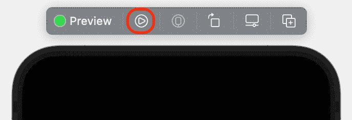

    图 23.15：画布显示实时预览按钮

1.  点击预览中的任何单元格以显示包含被点击餐厅名称的文本：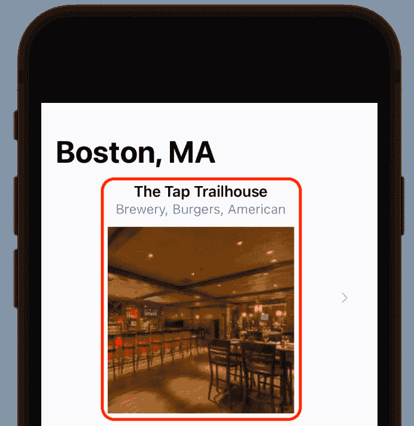

    图 23.16：应用预览显示已选择的单元格

    这是一种确保你的列表按预期工作的好方法。

1.  视图代码开始看起来杂乱，因此你将单元格提取到其自己的单独视图中。*Command + click* `NavigationLink` 视图并选择 **提取子视图**：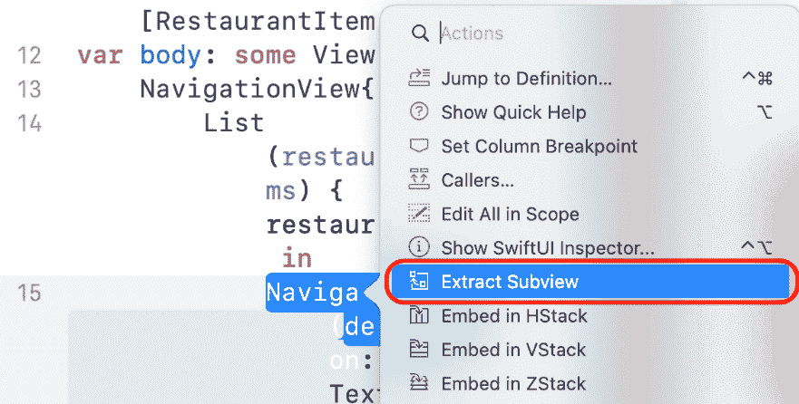

    图 23.17：编辑区域显示已选择“提取子视图”的弹出菜单

1.  所有单元格的视图代码都已移动到名为 `ExtractedView` 的单独视图中：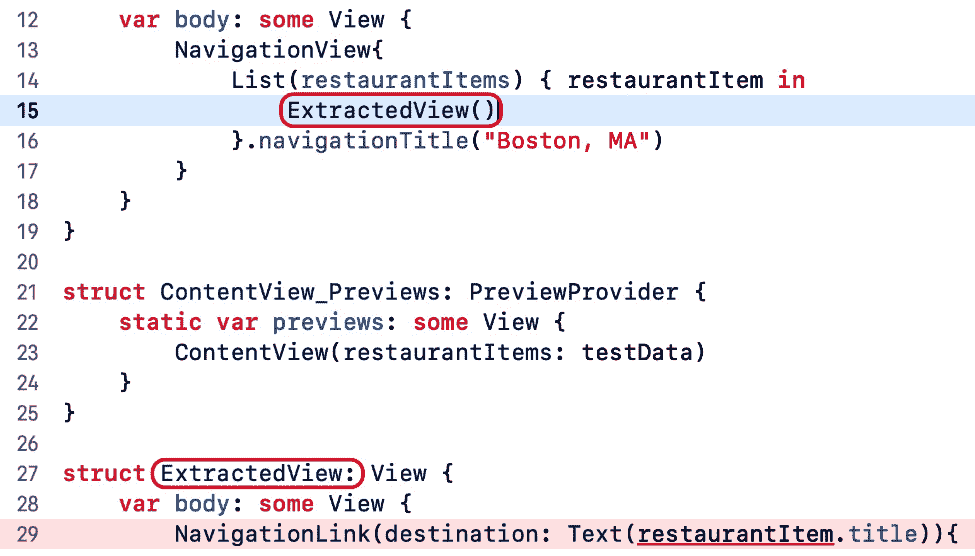

    图 23.18：编辑区域显示突出显示的提取视图名称

1.  更改方法调用和提取视图的名称为 `RestaurantCell`。你的代码应该看起来像这样：

    ```swift
       var body: some View {
          NavigationView { 
             List(restaurantItems) { restaurantItem in
                RestaurantCell()
             }.navigationTitle("Boston, MA")
          }
       }
    }
    struct ContentView_Previews: PreviewProvider {
       static var previews: some View {
          ContentView(restaurantItems: testData)
       }
    }
    struct RestaurantCell: View {
       var body: some View {
          NavigationLink(destination:
    ```

    不要担心错误，你将在下一步中修复它。

1.  向 `RestaurantCell` 视图中添加一个属性以保存 `RestaurantItem` 实例：

    ```swift
    struct RestaurantCell: View {
       var restaurantItem: RestaurantItem
    ```

1.  向 `ContentView` 结构中添加代码以将 `RestaurantItem` 实例传递给 `RestaurantCell` 视图，如下所示：

    ```swift
    struct ContentView: View {
       var restaurantItems: [RestaurantItem] = []
       var body: some View {
          NavigationView {
             List(restaurantItems) { restaurantItem in 
                RestaurantCell(restaurantItem: 
                restaurantItem)
             }.navigationTitle("Boston, MA"
          }
       }
    }
    ```

1.  确认预览仍然按预期工作。

你已经完成了 `UIKit` 和 SwiftUI 视图的实现，以创建一个你将在 **餐厅详情** 屏幕中使用的地图视图。

# 使用 UIKit 和 SwiftUI 视图一起

到目前为止，你已经创建了 **餐厅列表** 屏幕并且点击此屏幕中的每个单元格都会在第二个屏幕上显示餐厅的名称。你将修改你的应用，以便在点击 **餐厅列表** 屏幕中的单元格时显示 **餐厅详情** 屏幕但在此之前，你将创建一个显示地图的 SwiftUI 视图。

当使用故事板时，你所需要做的就是从库中拖动一个地图视图到故事板中的视图。SwiftUI 没有内置的地图视图，但你可以使用与故事板中相同的地图视图来渲染地图。实际上，你可以通过将它们包裹在一个符合 `UIViewRepresentable` 协议的 SwiftUI 视图中来使用任何视图子类。现在让我们创建一个可以显示地图视图的自定义视图。按照以下步骤操作：

1.  选择 **文件** | **新建** | **文件** 以打开模板选择器。

1.  **iOS** 应该已经选中。在 **用户界面** 部分，点击 **SwiftUI 视图** 并点击 **下一步**：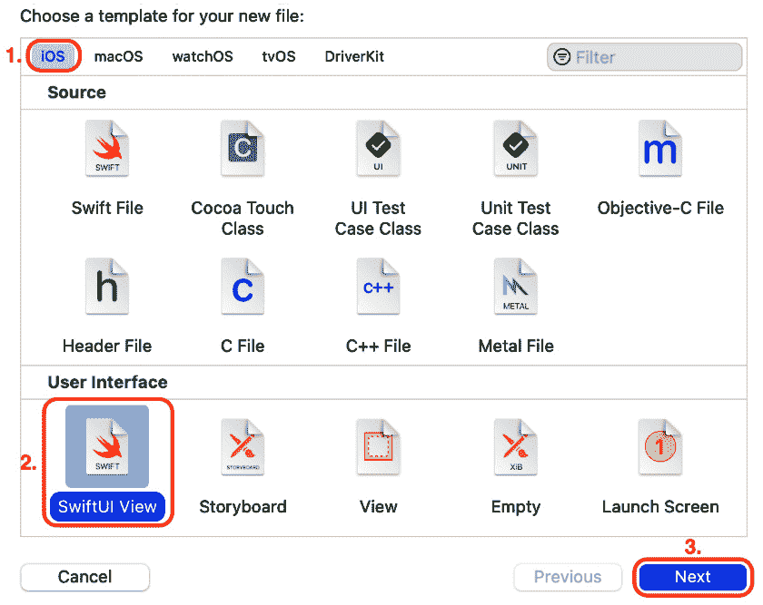

    图 23.19：选择 SwiftUI 视图的文件模板屏幕

1.  将新文件命名为 `MapView` 并点击，`MapView` 文件将出现在项目导航器中。

1.  在 `MapView` 文件中，导入 `MapKit`，并使 `MapView` 结构符合如上所示的 `UIViewRepresentable` 协议。不用担心出现的错误，你将在接下来的几个步骤中修复它：

    ```swift
    import SwiftUI
    UIViewRepresentable protocol is a wrapper that allows you to use any UIKit view in your SwiftUI view hierarchy.Important InformationTo learn more about the `UIViewRepresentable` protocol, visit this link: [`developer.apple.com/documentation/swiftui/uiviewrepresentable`](https://developer.apple.com/documentation/swiftui/uiviewrepresentable).
    ```

1.  你需要两个方法来符合 `UIViewRepresentable` 协议：一个 `makeUIView(context:)` 方法用于创建一个 `MKMapView`，一个 `updateUIView(_:context:)` 方法用于配置它并响应任何更改。按照如下所示修改你的代码，用创建并返回一个空的 `MKMapView` 实例的 `makeUIView(context:)` 方法替换 `body` 属性：

    ```swift
    struct MapView: UIViewRepresentable {
    func makeUIView(context: Context) -> MKMapView { 
          MKMapView(frame: .zero)
       }
    }
    ```

1.  按照如下所示修改你的代码，在 `makeUIView(context:)` 方法之后添加一个 `updateUIView(_:context:)` 方法。这会将地图视图的区域设置为以 The Tap Trailhouse 的位置为中心：

    ```swift
    func updateUIView(_ uiView: MKMapView, context: 
    Context) {
       let coordinate = CLLocationCoordinate2D
       (latitude: 42.360847, longitude: -71.056819)
       let span = MKCoordinateSpan(latitudeDelta: 
       0.001, longitudeDelta: 0.001)
       let region = MKCoordinateRegion(center: 
       coordinate, span: span)
       uiView.setRegion(region, animated: true)
    }
    ```

    注意，这是你在 *Let's Eat* 应用中为 **地图** 屏幕创建区域时使用的方法。

1.  错误现在消失了，画布中出现了一个空白地图视图。这是因为预览处于静态模式，并且只渲染 SwiftUI 视图。你需要打开实时预览来查看地图。点击 **实时预览** 按钮，你应该会在片刻后看到以 The Tap Trailhouse 的位置为中心的波士顿地图：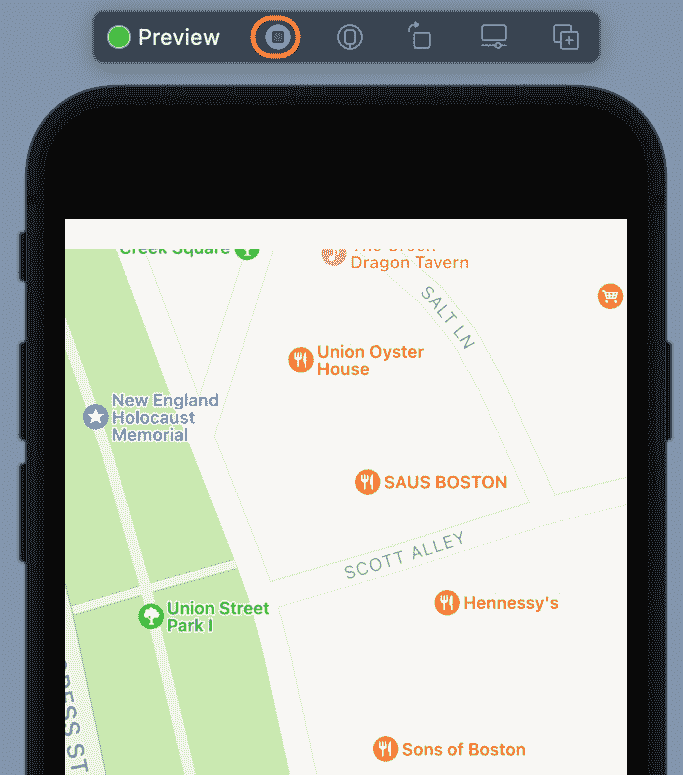

    图 23.20：显示地图的应用预览

    如果不起作用，请检查您的网络连接，并点击预览上方的 **重试** 或 **继续** 按钮。

1.  纬度和经度值目前是硬编码的。在 `MapView` 结构声明之后声明两个属性来保存纬度和经度值，如下所示：

    ```swift
    struct MapView: UIViewRepresentable {
       var lat: CLLocationDegrees
       var long: CLLocationDegrees
    ```

1.  修改 `updateUI(_:context:)` 方法，使用这些属性而不是硬编码的值：

    ```swift
    func updateUIView(_ view: MKMapView, context: Context) {
       let coordinate = CLLocationCoordinate2D( 
       latitude: lat, longitude: long)
    ```

1.  更新 `MapView_Previews` 结构，传入示例纬度和经度值，如下所示。这将生成你在预览中看到的相同地图：

    ```swift
    struct MapView_Previews: PreviewProvider {
       static var previews: some View {
          MapView(lat: 42.360847, long: -71.056819)
       }
    }
    ```

1.  在画布中检查地图是否仍然显示（你可能需要点击 **继续**）。

你已经创建了一个显示餐厅位置的 SwiftUI 地图视图。现在，让我们看看如何在下一节中制作完整的**餐厅详情**屏幕。

# 完成**餐厅详情**屏幕

现在，你有一个显示地图的 SwiftUI 地图视图。接下来，你将创建一个新的 SwiftUI 视图来表示**餐厅详情**屏幕，并将地图视图添加到其中。按照以下步骤操作：

1.  选择**文件** | **新建** | **文件**以打开模板选择器。

1.  **iOS**应该已经选中。在**用户界面**部分，点击**SwiftUI 视图**并点击**下一步**。

1.  将新文件命名为`RestaurantDetail`并点击，使`RestaurantDetail`文件出现在项目导航器中。

1.  声明并定义`RestaurantDetail`和`RestaurantDetail_Previews`结构，如下所示：

    ```swift
    import SwiftUI
    struct RestaurantDetail: View {  
       RestaurantDetail structure contains a Vstack view enclosing a map view and a second Vstack view. The map view displays a map showing the restaurant's location. The second Vstack view encloses four text views. These display the restaurant's name, cuisines, address, and city. A Spacer object pushes the first Vstack view to the top of the screen. A RestaurantItem instance is assigned to the selectedRestaurant property, and data from this instance is used to populate the RestaurantDetail structure's views.To create the preview in the canvas, the `RestaurantDetail_Previews` structure passes in the first `RestaurantItem` instance in the `testData` array. Note that the `RestaurantDetail` instance is enclosed in a `NavigationView` instance to make the navigation bar appear in the preview.
    ```

1.  预览显示在餐厅文本视图上方的地图视图，但不会渲染地图。与之前一样，点击**实时预览**按钮。

1.  画布现在显示带有渲染地图的**餐厅详情**屏幕：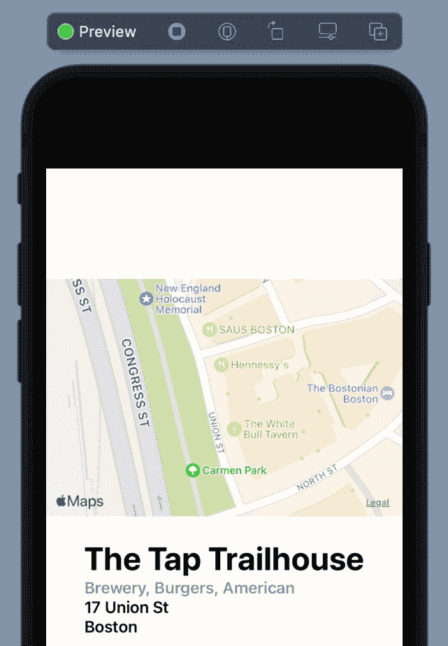

    图 23.21：应用预览显示餐厅详情屏幕

    你已经使用 SwiftUI 完成了**餐厅详情**屏幕的实现。现在，你将修改**餐厅列表**屏幕中的列表，以便在单元格被轻触时显示**餐厅详情**屏幕。

1.  在项目导航器中点击`ContentView`文件，并修改`RestaurantCell`结构的代码，以便在单元格被轻触时使用`RestaurantDetail`结构作为目标：

    ```swift
    var body: some View {
        NavigationLink(destination: 
        RestaurantDetail(selectedRestaurant: 
        restaurantItem )){
            Spacer()
    ```

1.  点击画布中的**实时预览**按钮。在**餐厅列表**屏幕中轻触一行。你会看到该餐厅的**餐厅详情**屏幕出现：

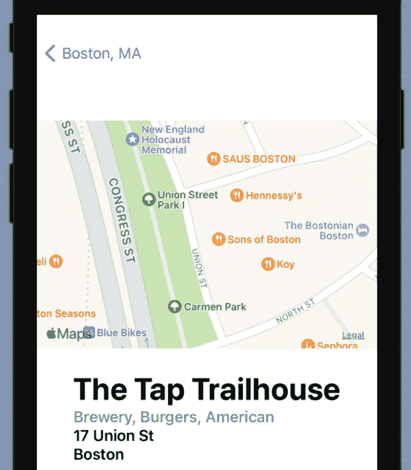

图 23.22：应用预览显示餐厅详情屏幕

如你所见，应用预览在画布中运行良好。如果你想在模拟器中运行，你需要在`ContentView`结构中做一个小改动。在项目导航器中点击`ContentView`文件，并将`testdata`数组分配给`restaurantItems`属性，如下所示：

```swift
struct ContentView: View {
   var restaurantItems: [RestaurantItem] = testData
   var body: some View {
```

构建并运行你的应用，它将在模拟器中显示：

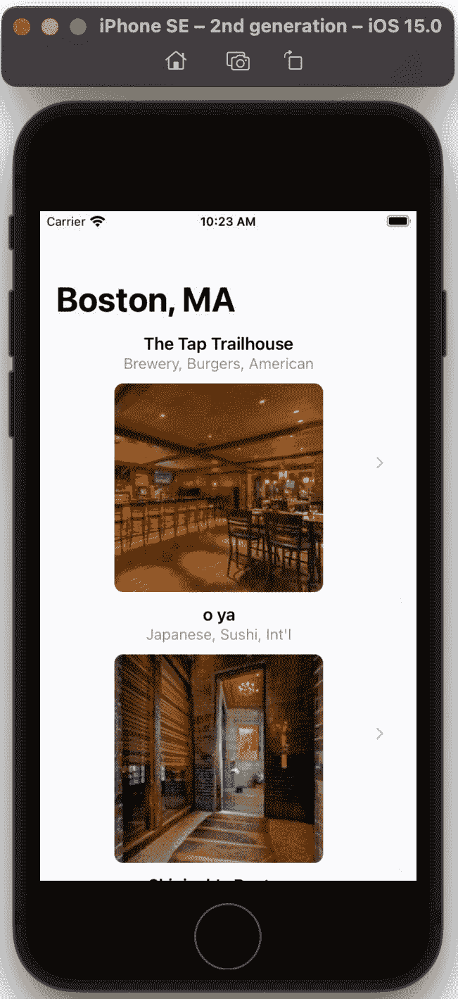

图 23.23：iOS 模拟器显示餐厅列表屏幕

你已经完成了构建一个简单的 SwiftUI 应用！太棒了！

# 摘要

在本简要的 SwiftUI 介绍中，你看到了如何使用 SwiftUI 构建简化版的 *Let's Eat* 应用。

你首先通过添加和配置 SwiftUI 视图来创建 `UIKit` 和 SwiftUI 视图，通过添加和配置用于**餐厅详情**屏幕的地图视图来实现这一点。最后，你创建了**餐厅详情**屏幕，并将你之前创建的地图视图添加到其中。

现在，你已经知道了如何使用 SwiftUI 创建一个读取模型对象、在列表中展示它们并允许导航到包含地图视图的第二屏幕的应用程序。你可以在自己的项目中实现这一点。

在下一章中，你将学习关于**Swift 并发**的内容，这是在 Swift 中处理异步操作的新方法。
