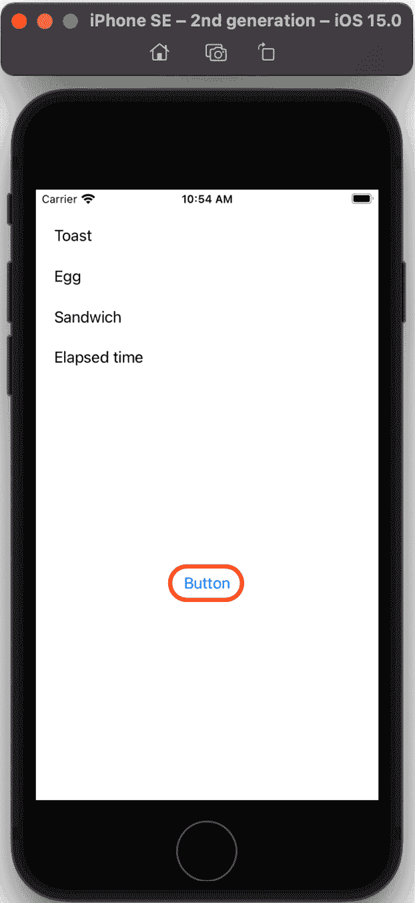
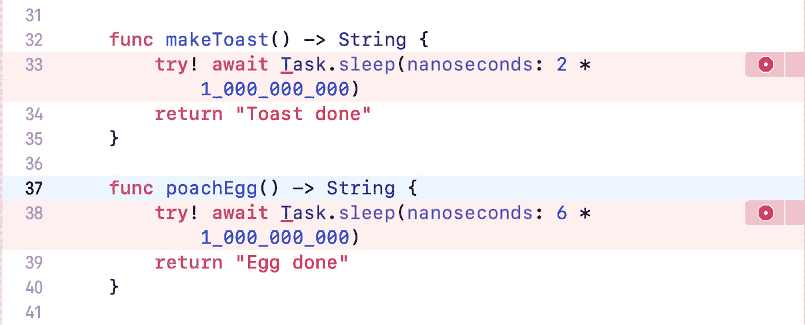
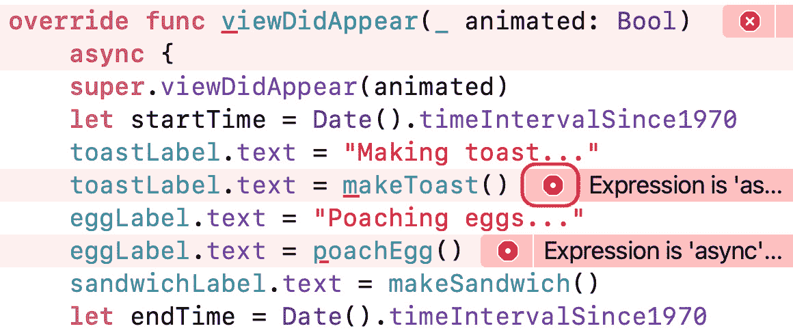
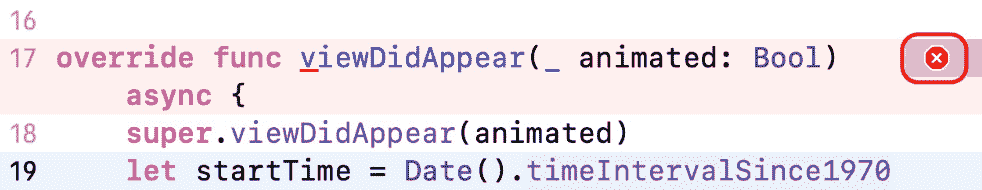
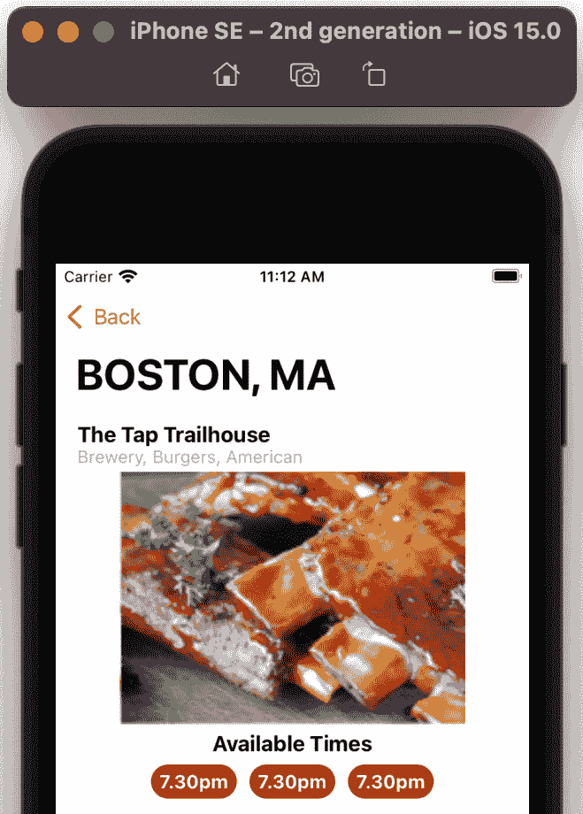

# *第二十四章*：Swift 并发入门

苹果公司在 WWDC2021 上推出了 **Swift 并发**，为 Swift 5.5 添加了对结构化异步和并行编程的支持。这使得您可以编写更易读、更易于理解的并发代码。

在本章中，您将学习 Swift 并发的基本概念。接下来，您将检查一个没有并发的应用，并探讨其问题。然后，您将在您的 *Let's Eat* 应用中使用 `RestaurantListViewController` 类来使用 `async`/`await` 加载餐厅图片。

到本章结束时，您将了解 Swift 并发的工作原理以及如何更新自己的应用以使用它。

本节将涵盖以下主题：

+   理解 Swift 并发

+   检查没有并发的应用

+   使用 `async`/`await` 更新应用

+   使用 `async-let` 提高效率

+   将 `RestaurantListViewController` 更新为使用 async/await

# 技术要求

您将使用一个示例应用，*BreakfastMaker*，来帮助您理解 Swift 并发的概念。在本章的后面部分，您将继续在您在 *第二十二章**，Mac Catalyst 入门* 中修改的 `LetsEat` 项目中工作。

本章的完成版 Xcode 项目位于本书代码包的 `Chapter24` 文件夹中，您可以在此处下载：

[`github.com/PacktPublishing/iOS-15-Programming-for-Beginners-Sixth-Edition`](https://github.com/PacktPublishing/iOS-15-Programming-for-Beginners-Sixth-Edition)

观看以下视频，看看代码的实际效果：

[`bit.ly/3d4YWH5`](https://bit.ly/3d4YWH5)

让我们从下一节学习 Swift 并发开始。

# 理解 Swift 并发

在 Swift 5.5 中，苹果添加了对以结构化方式编写异步和并行代码的支持。

异步代码允许您的应用挂起和恢复代码。这允许您的应用在执行如从互联网下载数据等操作的同时更新用户界面。

并行代码允许您的应用同时运行多个代码片段。

重要信息

您可以在 [`developer.apple.com/news/?id=2o3euotz`](https://developer.apple.com/news/?id=2o3euotz) 找到 WWDC2021 期间苹果所有 Swift 并发视频的链接。

您可以在 [`docs.swift.org/swift-book/LanguageGuide/Concurrency.html`](https://docs.swift.org/swift-book/LanguageGuide/Concurrency.html) 阅读苹果的 Swift 并发文档。

为了让您了解 Swift 并发的工作原理，想象一下您正在为早餐制作一个水煮蛋三明治。以下是制作的一种方法：

1.  将两片面包放入烤面包机中。

1.  等待两分钟，直到面包烤熟。

1.  在一个装有水的碗中放入一个鸡蛋，并将碗放入微波炉中。

1.  等待六分钟，直到鸡蛋煮熟。

1.  制作您的三明治。

总共需要八分钟。现在考虑这个事件序列。你只是盯着烤面包机和微波炉吗？你可能会在面包在烤面包机和鸡蛋在微波炉中时使用手机。换句话说，你可以在面包和鸡蛋准备的过程中做其他事情。因此，事件序列更准确地描述如下：

1.  将两片面包放入烤面包机中。

1.  用手机使用两分钟，直到面包烤好。

1.  在一个装有水的碗中放一个鸡蛋，然后将碗放入微波炉中。

1.  用手机使用六分钟，直到鸡蛋煮熟。

1.  制作你的三明治。

在这里，你可以看到你与烤面包机和微波炉的交互可以被挂起，然后恢复，这意味着这些操作是异步的。操作仍然需要八分钟，但你可以在那段时间内做其他事情。

另一个需要考虑的因素是，你不需要等待面包烤完才能把鸡蛋放入微波炉。这意味着你可以修改步骤序列如下：

1.  将两片面包放入烤面包机中。

1.  当面包正在烤的时候，把一个鸡蛋放在一个装有水的碗中，然后把碗放入微波炉中。

1.  用手机使用六分钟，直到鸡蛋煮熟。

1.  制作你的三明治。

烤面包和煮鸡蛋现在是并行进行的，这为你节省了两分钟。太好了！但是请注意，你还有更多的事情要跟踪。

现在你已经理解了异步和并行操作的概念，让我们在下一节研究没有并发功能的应用程序所遇到的问题。

# 检查没有并发功能的程序

你已经看到了异步和并行操作如何帮助你更快地准备早餐，并允许你在操作过程中使用手机。现在让我们看看一个模拟准备早餐过程的示例应用程序。最初，这个应用程序没有实现并发，所以你可以看到这如何影响应用程序。按照以下步骤操作：

1.  如果还没有这样做，请在此链接下载本书的代码包中的`Chapter24`文件夹：[`github.com/PacktPublishing/iOS-15-Programming-for-Beginners-Sixth-Edition`](https://github.com/PacktPublishing/iOS-15-Programming-for-Beginners-Sixth-Edition)。

1.  在`Chapter24`文件夹中打开`resources`文件夹，你会看到两个文件夹，`BreakfastMaker-start`和`BreakfastMaker-complete`。第一个文件夹包含你将在本章中修改的应用程序，第二个文件夹包含完成的应用程序。

1.  打开`BreakfastMaker-start`文件夹，然后打开`BreakfastMaker` Xcode 项目。在项目导航器中点击`Main`故事板文件。你应该会看到四个标签和一个按钮在**视图控制器场景**中，如图所示：![图 24.1：显示视图控制器场景的主故事板文件

    ![img/Figure_24.01_B17469.jpg]

    图 24.1：显示视图控制器场景的主故事板文件

    应用将显示一个屏幕，显示烤面包、鸡蛋和三明治的状态，以及准备三明治所需的时间。应用还将显示一个按钮，你可以使用它来测试用户界面的响应性。

1.  在项目导航器中点击`ViewController`文件。你应该在编辑器区域看到以下代码：

    ```swift
    import UIKit
    class ViewController: UIViewController {
       @IBOutlet var toastLabel: UILabel!
       @IBOutlet var eggLabel: UILabel!
       @IBOutlet var sandwichLabel: UILabel!
       @IBOutlet var elapsedTimeLabel: UILabel!
       override func viewDidAppear(_ animated: Bool) {
          super.viewDidAppear(animated)
          let startTime = Date().timeIntervalSince1970
          toastLabel.text = "Making toast..."
          toastLabel.text = makeToast()
          eggLabel.text = "Poaching egg..."
          eggLabel.text = poachEgg()
          sandwichLabel.text = makeSandwich()
          let endTime = Date().timeIntervalSince1970
          elapsedTimeLabel.text = "Elapsed time is 
          \(((endTime - startTime) * 100).rounded() 
          / 100) seconds"
       }
       func makeToast() -> String {
          sleep(2)
          return "Toast done"
       }
       func poachEgg() -> String {
          sleep(6)
          return "Egg done"
       }
       func makeSandwich() -> String {
          return "Sandwich done"
       }
       @IBAction func testButton(_ sender: UIButton) {
          print("Button tapped")
       }
    }
    ```

    如你所见，这段代码模拟了之前章节中描述的做早餐的过程。让我们来分解一下：

    ```swift
    @IBOutlet var toastLabel: UILabel!
    @IBOutlet var eggLabel: UILabel!
    @IBOutlet var sandwichLabel: UILabel!
    @IBOutlet var elapsedTimeLabel: UILabel!
    ```

    这些输出连接到`Main`故事板文件中的四个标签。当你运行应用时，这些标签将显示烤面包、鸡蛋和三明治的状态，以及显示完成整个过程所需的时间。

    ```swift
    override  func viewDidAppear(_ animated: Bool) {
    ```

    当视图控制器视图出现在屏幕上时，会调用此方法。

    ```swift
    let startTime = Date().timeIntervalSince1970
    ```

    这将`startTime`设置为当前时间，以便应用可以稍后计算制作三明治所需的时间。

    ```swift
    toastLabel.text = "Making toast..."
    ```

    这使得`toastLabel`显示文本`Making toast...`。

    ```swift
    toastLabel.text = makeToast()
    ```

    这调用`makeToast()`方法，该方法等待两秒来模拟烤面包所需的时间，然后返回文本`Toast done`，将通过`toastLabel`显示。

    ```swift
    eggLabel.text = "Poaching egg..."
    ```

    这使得`eggLabel`显示文本`Poaching egg...`。

    ```swift
    eggLabel.text = poachEgg()
    ```

    这调用`poachEgg()`方法，该方法等待六秒来模拟煮鸡蛋所需的时间，然后返回文本`Egg done`，将通过`eggLabel`显示。

    ```swift
    sandwichLabel.text = makeSandwich()
    ```

    这调用`makeSandwich()`方法，该方法返回文本`Sandwich done`，将通过`sandwichLabel`显示。

    ```swift
    let endTime = Date().timeIntervalSince1970
    ```

    这将`endTime`设置为当前时间。

    ```swift
    elapsedTimeLabel.text = "Elapsed time is 
    \(((endTime - startTime) * 100).rounded() 
    / 100) seconds"
    ```

    这计算了经过的时间（大约八秒），将通过`elapsedTimeLabel`显示。

    ```swift
    @IBAction func testButton(_ sender: UIButton) {
       print("Button tapped")
    }
    ```

    每次屏幕上的按钮被点击时，都会在调试区域显示`Button tapped`。

构建并运行应用，并在用户界面出现时立即点击按钮：



图 24.2：iOS 模拟器运行 BreakfastMaker 应用，显示要点击的按钮

你应该注意以下问题：

+   初始点击没有效果，你只能在大约八秒后在调试区域看到`Button tapped`。

+   `Making toast...`和`Poaching egg...`永远不会显示，而`Toast done`和`Egg done`只在大约八秒后出现。

发生这种情况的原因是因为你的应用代码在`makeToast()`和`poachEgg()`方法运行时没有更新用户界面。你的应用确实注册了按钮点击，但在`makeToast()`和`poachEgg()`完成执行后才能处理它们并更新标签。这些问题不会给你的应用提供良好的用户体验。

你现在已经体验了没有实现并发性的应用所呈现的问题。在下一节中，你将使用`async`/`await`修改应用，使其能够在`makeToast()`和`poachEgg()`方法运行时更新用户界面。

# 使用 async/await 更新应用

如您之前所见，当`makeToast()`和`poachEgg()`方法正在运行时，应用会无响应。为了解决这个问题，您将在应用中使用`async`/`await`。

在方法声明中写入`async`关键字表示该方法异步。这看起来是这样的：

```swift
func methodName() async -> returnType {
```

在方法调用之前写入`await`关键字标记了一个可能暂停执行的点，从而允许其他操作运行。这看起来是这样的：

```swift
await methodName()
```

重要信息

您可以观看 Apple 的 WWDC2021 视频，讨论 async/await：[`developer.apple.com/videos/play/wwdc2021/10132/`](https://developer.apple.com/videos/play/wwdc2021/10132/)。

您将修改您的应用以使用`async`/`await`。这将使它能够挂起`makeToast()`和`poachEgg()`方法以处理按钮点击并更新用户界面，然后之后继续执行这两个方法。按照以下步骤操作：

1.  按照所示修改`makeToast()`和`poachEgg()`方法，使它们的代码体异步：

    ```swift
    func makeToast() -> String {
       Task represents a unit of asynchronous work. Task has a static method, sleep(nanoseconds:), which pauses execution for a specified duration, measured in nanoseconds. Multiplying by 1,000,000,000 converts the duration to seconds. The await keyword indicates this code can be suspended to allow other code to run.
    ```

1.  `makeToast()`和`poachEgg()`方法都会出现错误。点击任一错误图标以显示错误信息：

    图 24.3：带有错误图标的错误

    错误显示是因为您在不支持并发的方法中调用异步方法。您需要将`async`关键字添加到方法声明中，以指示它是异步的。

1.  对于每个方法，点击方法声明中的`async`关键字。

1.  确认您完成后的代码看起来像这样：

    ```swift
    func makeToast() async -> String {
       try! await Task.sleep(nanoseconds: 2 * 1_000_000_000)
       return "Toast done"
    }
    func poachEgg() async -> String {
       try! await Task.sleep(nanoseconds: 6 * 1_000_000_000)
       return "Egg done"
    }
    ```

1.  `makeToast()`和`poachEgg()`方法中的错误应该已经消失，但在`viewDidAppear()`方法中会出现新的错误。点击一个错误图标以查看错误信息，该信息将与您之前看到的相同。这是因为您在不支持并发的方法中调用异步方法。

1.  点击**修复**按钮，将出现更多错误。

1.  现在忽略方法声明中的那个，点击`makeToast()`方法调用旁边的错误图标以查看错误信息：

    图 24.4：带有 makeToast()错误图标的错误

    此错误信息显示是因为您在调用异步函数时没有使用`await`。

1.  在方法调用之前点击`await`关键字。

1.  对于`poachEgg()`方法调用旁边的错误，重复*步骤 7*和*步骤 8*。`await`关键字也将插入到`poachEgg()`方法调用中。

1.  点击`viewDidLoad()`方法声明中的错误图标以查看错误信息：

    图 24.5：带有错误图标的错误

    这个错误显示出来是因为你不能使用`async`关键字使`viewDidAppear()`方法异步，因为这个功能在父类中不存在。

1.  为了解决这个问题，你将移除`async`关键字，并将`super.viewDidAppear()`之后的全部代码放在一个`Task`块中，这将允许它在同步方法中异步执行。按照以下方式修改你的代码：

    ```swift
    override  func viewDidAppear(_ animated: Bool) {
       super.viewDidAppear(animated)
       Task {
          let startTime = Date().timeIntervalSince1970
          toastLabel.text = "Making toast..."
          toastLabel.text = await makeToast() 
          eggLabel.text = "Poaching egg..."
          eggLabel.text = await poachEgg() 
          sandwichLabel.text = makeSandwich()
          let endTime = Date().timeIntervalSince1970
          elapsedTimeLabel.text = "Elapsed time is 
          \(((endTime - startTime) * 100).rounded() 
          / 100) seconds"
       }
    }
    ```

构建并运行应用，并在看到用户界面后立即点击按钮。注意，`Button tapped`现在立即出现在调试区域，并且标签按预期更新。这是因为应用现在能够挂起`makeToast()`和`poachEgg()`方法以响应用户点击并更新用户界面，然后稍后恢复它们。太棒了！

然而，如果你查看经过的时间，你会发现应用准备早餐的时间比之前稍微长一点：

![Figure 24.6: iOS 模拟器运行 BreakfastMaker 应用，显示经过的时间

![img/Figure_24.06_B17469.jpg]

![Figure 24.6: iOS 模拟器运行 BreakfastMaker 应用，显示经过的时间

这部分是由于挂起和恢复方法所需的开销，但还有一个因素在起作用。尽管`makeToast()`和`poachEgg()`方法现在是异步的，但`poachEgg()`方法只有在`makeToast()`方法执行完毕后才开始执行。在下一节中，你将看到如何使用`async-let`来并行运行`makeToast()`和`poachEgg()`方法。

# 使用 async-let 提高效率

即使你的应用现在对按钮点击做出响应，并且能够在`makeToast()`和`poachEgg()`方法运行时更新用户界面，这两个方法仍然会顺序执行。这里的解决方案是使用`async-let`。在定义常量时在`let`语句前写上`async`，然后在访问常量时写上`await`，这允许异步方法的并行执行：

```swift
async let temporaryConstant1 = methodName1()
async let temporaryConstant2 = methodName2()
await variable1 = temporaryConstant1
await variable2 = temporaryConstant1
```

在这里，`methodName1()`和`methodName2()`将并行运行。

你将修改你的应用以使用`async-let`来使`makeToast()`和`poachEgg()`方法并行运行。在`ViewController`文件中，按照以下方式修改`Task`块中的代码：

```swift
Task {
   let startTime = Date().timeIntervalSince1970
   toastLabel.text = "Making toast..."
   async let tempToast = makeToast()
   eggLabel.text = "Poaching egg..."
   async let tempEgg = poachEgg()
   await toastLabel.text = tempToast
   await eggLabel.text = tempEgg
   sandwichLabel.text = makeSandwich()
   let endTime = Date().timeIntervalSince1970
   elapsedTimeLabel.text = "Elapsed time is 
   \(((endTime - startTime) * 100).rounded() 
   / 100) seconds"
}
```

构建并运行应用。你会看到经过的时间现在比之前短：

![Figure 24.7: iOS 模拟器运行 BreakfastMaker 应用，显示经过的时间

![img/Figure_24.07_B17469.jpg]

Figure 24.7: iOS 模拟器运行 BreakfastMaker 应用，显示经过的时间

这是因为使用`async-let`允许`makeToast()`和`poachEgg()`方法并行运行，并且`poachEgg()`方法不再等待`makeToast()`方法完成后再开始执行。酷！

重要信息

关于 Swift 并发还有很多东西可以学习，比如结构化并发和 actors，但这些内容超出了本章的范围。你可以在 [`developer.apple.com/wwdc21/10134`](https://developer.apple.com/wwdc21/10134) 上了解更多关于结构化并发的信息，以及在 [`developer.apple.com/wwdc21/10133`](https://developer.apple.com/wwdc21/10133) 上了解更多关于 actors 的信息。

在下一节中，你将更新 *Let's Eat* 应用中的 `RestaurantListViewController` 类，以便在获取餐厅图像时使用 `async`/`await`。

# 将 RestaurantListViewController 更新为使用 async/await

当你运行你的 *Let's Eat* 应用时，你可能会注意到当 **餐厅列表** 屏幕显示餐厅列表时会有延迟。这是因为用于下载餐厅图像的代码不是异步的，当餐厅图像正在下载时，应用无法执行其他工作。

下载餐厅图像数据并将其转换为图像的代码位于 `RestaurantListViewController` 类定义中的 `collectionView(_:cellForItemAt:)` 方法内。你将修改此代码，使其异步执行。

打开你在 *第二十二章**，使用 Mac Catalyst 入门* 中修改的 `LetsEat` 项目，在项目导航器中打开 `RestaurantListViewController` 文件（位于 `Restaurants` 文件夹内）。按照以下方式更新 `collectionView(_:cellForItemAt:)` 方法：

```swift
   if let imageURL = restaurantItem.imageURL {
      Task {
         guard let url = URL(string: imageURL)
         else {
            return
         }
let (imageData, response) = try await 
         URLSession.shared.data(from: url)
guard let httpResponse = response as? 
HTTPURLResponse, httpResponse.statusCode 
         == 200 else {
            return
         }
guard let cellImage = UIImage(data: 
         imageData) else {
            return
         }
         cell.restaurantImageView.image = cellImage
         }
      }
   return cell
}
```

让我们分解一下：

```swift
Task {
```

这创建了一个异步工作的单元。

```swift
guard let url = URL(string: imageURL)
else {
   return
}
```

这个 `guard` 语句从 `RestaurantItem` 实例的 `imageURL` 属性创建一个 URL，并将其分配给 `url`，如果不能这样做则返回。

```swift
let (imageData, response) = try await 
URLSession.shared.data(from: url)
```

这异步从存储在 `url` 中的 URL 下载数据，并将其分配给 `imageData`。服务器的响应分配给 `response`。

```swift
guard let httpResponse = response as? HTTPURLResponse,
httpResponse.statusCode == 200 else {
   return
}
```

这个 `guard` 语句检查服务器响应代码是否为 `200`（这意味着下载成功），如果不是则返回。

```swift
guard let cellImage = UIImage(data: imageData) else {
   return
}
```

这个 `guard` 语句从存储在 `imageData` 中的数据创建一个 `UIImage` 实例，并将其分配给 `cellImage`，如果不能这样做则返回。

```swift
cell.restaurantImageView.image = cellImage
```

这将 `cellImage` 中存储的 `UIImage` 分配给 `restaurantCell` 实例的 `restaurantImageView` 属性，它将在 `restaurantImageView` 属性中显示。

```swift
return cell
```

这返回 `restaurantCell` 实例。

构建并运行你的应用。你会发现 **餐厅列表** 屏幕比以前更响应，滚动也更平滑：

![图 24.8：iOS 模拟器显示带有下载图像的餐厅列表屏幕]

](img/Figure_24.08_B17469.jpg)

图 24.8：iOS 模拟器显示带有下载图像的餐厅列表屏幕

如果你禁用你的互联网连接，**餐厅列表** 屏幕仍然可以工作，但它将显示默认的占位符图像：

![图 24.9：iOS 模拟器显示带有默认图像的餐厅列表屏幕]



图 24.9：iOS 模拟器显示带有默认图片的餐厅列表屏幕

重要信息

你可以在 [`developer.apple.com/wwdc21/10095`](https://developer.apple.com/wwdc21/10095) 找到更多关于如何使用 `URLSession` 与 async/await 的信息。

你已经在你的应用 `RestaurantListViewController` 类中成功实现了异步代码。太棒了！关于 Swift 并发还有很多东西要学习，比如结构化并发和 actors，但这些超出了本章的范围。

# 摘要

在本章中，你学习了 Swift 并发以及如何在 *BreakfastMaker* 和 *Let's Eat* 应用中实现它。

你首先学习了 Swift 并发的基本概念。接下来，你检查了一个没有并发的应用并探讨了它的问题。之后，你通过使用 `async`/`await` 在应用中实现了并发。然后，你通过使用 `async-let` 使你的应用更加高效。最后，你更新了 *Let's Eat* 应用中的 `RestaurantListViewController` 类，以使用 `async`/`await` 来加载餐厅图片。

你现在已经理解了 Swift 并发的基础知识，并且将能够在你自己的应用中使用 `async`/`await` 和 `async-let`。

在下一章中，你将学习关于 **SharePlay** 的内容，这是一种为你的应用用户共享群体体验的绝佳方式。
