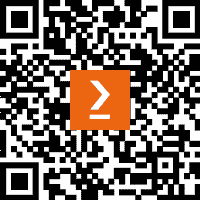

# 前言

欢迎来到 *iOS 18 编程入门*。这本书是 *iOS 编程入门* 系列的第九版，已经完全更新以适应 iOS 18、macOS 15.0 Sequioa 和 Xcode 16。

在这本书中，你将构建一个名为 *JRNL* 的日记应用。你将从探索 Xcode 开始，这是苹果的编程环境，也被称为其 **集成开发环境**（**IDE**）。接下来，你将学习 Swift 的基础知识，Swift 是用于 iOS 应用的编程语言，并了解它是如何用于完成常见的编程任务的。

在你熟练掌握 Swift 的基础知识后，你将开始创建 *JRNL* 应用的用户界面。在这个过程中，你将使用故事板，并通过 segues 连接应用场景。

在完成用户界面后，你将添加代码来实现应用的功能。首先，你将学习如何使用表格视图显示数据。接下来，你将学习如何向应用中添加数据，以及如何在视图控制器之间传递数据。之后，你将学习如何确定设备位置并在地图上显示注释。然后，你将学习如何使用 JSON 文件持久化应用数据，创建自定义视图，并从相机或照片库添加照片。最后，你将通过实现集合视图来替代表格视图，使你的应用能够在具有更大屏幕的设备上运行，例如 iPad 或 Mac。

你现在拥有了一个完整的应用，但如何添加最新的 iOS 18 功能呢？你将从学习 SwiftData 开始，它允许你使用常规 Swift 代码描述数据模型并操作模型实例。接下来，你将学习如何使用 SwiftUI 开发应用，这是一种为所有苹果平台开发应用的全新方法。之后，你将学习如何使用 Swift Testing 测试你的代码，以及如何将苹果智能功能引入你的应用。

最后，你将学习如何使用内部和外部测试人员测试你的应用，并将其发布到 App Store。

# 本书面向对象

本书针对那些具有最少编码经验、新接触 Swift 和 iOS 应用开发领域的人士。建议具备基本的编程概念理解。

# 本书涵盖内容

*第一章*，*探索 Xcode*，带你游览 Xcode，并讨论了你在本书中将使用的所有不同部分。

*第二章*，*简单值和类型*，讨论了 Swift 语言如何实现值和类型。

*第三章*，*条件语句和可选类型*，展示了如何实现 `if` 和 `switch` 语句，以及如何实现可能或可能没有值的变量。

*第四章*，*范围运算符和循环*，展示了如何在 Swift 中处理范围以及循环的不同实现方式。

*第五章*，*集合类型*，涵盖了常见的集合类型，包括数组、字典和集合。

*第六章*，*函数和闭包*，涵盖了如何使用函数和闭包将指令分组在一起。

*第七章*，*类、结构和枚举*，讨论了在 Swift 中表示包含状态和行为复杂对象的方法。

*第八章*，*协议、扩展和错误处理*，讨论了创建复杂数据类型可以采用的协议，扩展现有类型的特性，以及如何在代码中处理错误。

*第九章*，*Swift 并发*，介绍了并行和异步编程的概念，并展示了您如何在应用中实现它们。

*第十章*，*设置用户界面*，涉及创建*JRNL*应用并设置用户将看到的初始屏幕。

*第十一章*，*构建用户界面*，涵盖了为*JRNL*应用设置主屏幕。

*第十二章*，*完成用户界面设置*，涵盖了为*JRNL*应用设置剩余的屏幕。

*第十三章*，*修改应用屏幕*，是关于在故事板中配置应用的每个屏幕。

*第十四章*，*开始使用 MVC 和表格视图*，涵盖了与表格视图一起工作以及如何使用它来显示项目列表。

*第十五章*，*将数据添加到表格视图中*，涉及使用数组作为数据源将数据合并到表格视图中。

*第十六章*，*在视图控制器之间传递数据*，教您如何将使用视图控制器输入的数据添加到数组中，以及如何将数据从数组传递到另一个视图控制器。

*第十七章*，*开始使用 Core Location 和 MapKit*，涉及使用 Core Location 和 MapKit 确定您的设备位置并在地图上添加注释。

*第十八章*，*开始使用 JSON 文件*，涉及学习如何使用 JSON 文件存储和检索用户数据。

*第十九章*，*开始使用自定义视图*，教您如何创建和使用一个显示星级评分的自定义视图。

*第二十章*，*开始使用相机和照片库*，讨论了如何将相机或照片库中的照片添加到您的应用中。

*第二十一章*，*开始使用搜索*，教您如何为主屏幕实现搜索栏。

*第二十二章*，*开始使用集合视图*，展示了如何实现集合视图以替代表格视图，以适应具有更大屏幕的设备，如 Mac 或 iPad。

*第二十三章*，*开始使用 SwiftData*，涉及实现 Apple 的新 SwiftData 框架以在您的应用中持久化数据。

*第二十四章*，*开始使用 SwiftUI*，介绍了使用 Apple 的新 SwiftUI 技术构建应用。

*第二十五章*，*开始使用 Swift 测试*，教您如何使用 Swift 测试来测试您的代码。

*第二十六章*，*开始使用 Apple 智能功能*，展示了如何将 Apple 智能功能添加到您的应用中。

*第二十七章*，*测试并将您的应用提交到 App Store*，涉及如何测试并将您的应用提交到 App Store。

# 为了充分利用这本书

本书已完全修订以适应 iOS 18、macOS 15.0 Sequioa、Xcode 16 和 Swift 6。本书的 *第四部分* 还涵盖了 Apple 在 2024 年 WWDC 上推出的最新技术，包括 SwiftData、SwiftUI、Swift 测试和 Apple 智能技术。

要完成本书中的所有练习，您将需要：

+   运行 macOS 14.0 Sonoma、macOS 15.0 Sequioa 或更高版本的 Mac 计算机

+   Xcode 16.0 或更高版本

要检查您的 Mac 是否支持 macOS 15.0 Sequioa，请查看此链接：[`www.apple.com/my/macos/macos-sequoia-preview/`](https://www.apple.com/my/macos/macos-sequoia-preview/)。如果您的 Mac 支持，您可以通过 **系统偏好设置** 中的 **软件更新** 来更新 macOS。

要获取 Xcode 的最新版本，您可以从 Apple App Store 下载。大多数练习可以在没有 Apple 开发者账户的情况下完成，并使用 iOS 模拟器。如果您希望在实际的 iOS 设备上测试您正在开发的 App，您将需要一个免费或付费的 Apple 开发者账户。

以下章节需要付费的 Apple 开发者账户：*第二十七章*，*测试并将您的 App 提交到 App Store*。如何获取付费 Apple 开发者账户的说明已包含在内。

# 下载示例代码文件

您可以从 GitHub 下载本书的示例代码文件 [`github.com/PacktPublishing/iOS-18-Programming-for-Beginners-Ninth-Edition`](https://github.com/PacktPublishing/iOS-18-Programming-for-Beginners-Ninth-Edition)。如果代码有更新，它将在 GitHub 仓库中更新。

我们还提供其他来自我们丰富的图书和视频目录的代码包，可在 [`github.com/PacktPublishing/`](https://github.com/PacktPublishing/) 获取。查看它们！

# 代码实战

访问以下链接查看代码运行的视频：

[`www.youtube.com/playlist?list=PLeLcvrwLe185EJSoURfHhSHfbPFkiZl6m`](https://www.youtube.com/playlist?list=PLeLcvrwLe185EJSoURfHhSHfbPFkiZl6m)

# 下载彩色图像

我们还提供了一份包含本书中使用的截图/图表彩色图像的 PDF 文件。您可以从这里下载：[`packt.link/gbp/9781836204893`](https://packt.link/gbp/9781836204893)。

# 使用的约定

本书使用了多种文本约定。

`CodeInText`：表示文本中的代码词汇、数据库表名、文件夹名、文件名、文件扩展名、路径名、虚拟 URL、用户输入和 Twitter 账号。以下是一个示例：“所以，这是一个非常简单的函数，名为 `serviceCharge()`。”

代码块设置为以下格式：

```swift
class ClassName {
   property1
   property2
   property3
   method1() {
      code
   }
   method2() {
      code
   }
} 
```

当我们希望您注意代码块中的特定部分时，相关的行或项目将以粗体显示：

```swift
let cat = Animal()
**cat.****name****=****"****Cat"**
**cat.****sound****=****"Mew"**
**cat.****numberOfLegs****=****4**
**cat.****breathesOxygen****=****true**
print(cat.name) 
```

**粗体**：表示新术语、重要词汇或屏幕上看到的词汇。例如，菜单或对话框中的词汇在文本中显示如下。以下是一个示例：“启动 **Xcode** 并点击 **创建一个新的 Xcode 项目**：”

**重要提示**

显示如下。

**提示**

显示如下。

# 联系我们

我们始终欢迎读者的反馈。

**一般反馈**: 如果你对这本书的任何方面有疑问，请在邮件主题中提及书名，并通过客户关怀@packtpub.com 给我们发邮件。

**勘误**: 尽管我们已经尽一切努力确保内容的准确性，但错误仍然可能发生。如果你在这本书中发现了错误，我们将不胜感激，如果你能向我们报告这一点。请访问[www.packtpub.com/support/errata](http://www.packtpub.com/support/errata)，选择你的书籍，点击勘误提交表单链接，并输入详细信息。

**盗版**: 如果你在互联网上以任何形式遇到我们作品的非法副本，如果你能提供位置地址或网站名称，我们将不胜感激。请通过版权@packt.com 与我们联系，并提供材料的链接。

**如果你有兴趣成为作者**: 如果你有一个你擅长的主题，并且你对撰写或为书籍做出贡献感兴趣，请访问[authors.packtpub.com](http://authors.packtpub.com)。

# 留下评论！

感谢您从 Packt Publishing 购买这本书——我们希望您喜欢它！您的反馈对我们来说是无价的，它帮助我们改进和成长。一旦您阅读完毕，请花一点时间在亚马逊上留下评论；这只需一分钟，但对像您这样的读者来说意义重大。


[`packt.link/r/1836204892`](https://packt.link/r/1836204892)

扫描下面的二维码或访问链接以获得你选择的免费电子书。


[`packt.link/NzOWQ`](https://packt.link/NzOWQ)

# 下载这本书的免费 PDF 副本

感谢您购买这本书！

你喜欢在路上阅读，但无法携带你的印刷书籍到处走？

你的电子书购买是否与你的选择设备不兼容？

别担心，现在每购买一本 Packt 书籍，你都可以免费获得该书的 DRM 免费 PDF 版本。

在任何地方、任何设备上阅读。直接从你喜欢的技术书籍中搜索、复制和粘贴代码到你的应用程序中。

优惠不会就此停止，你还可以获得独家折扣、时事通讯和每日免费内容的邮箱访问权限。

按照以下简单步骤获取这些好处：

1.  扫描下面的二维码或访问以下链接：



[`packt.link/free-ebook/9781836204893`](https://packt.link/free-ebook/9781836204893)

1.  提交你的购买证明。

1.  就这些！我们将直接将你的免费 PDF 和其他好处发送到你的邮箱。
