# 1

# 探索 Xcode

欢迎来到 *iOS 18 编程入门*。我希望你会发现这是一本关于在 App Store 上创建和发布 iOS 18 应用的有用介绍。

在本章中，你将在你的 Mac 上下载并安装 **Xcode**。然后，你将探索 Xcode 用户界面。之后，你将创建你的第一个 **iOS 应用** 并在 **模拟器** 中运行它。最后，你将在 **iOS 设备** 上运行你的应用。

到本章结束时，你将了解如何创建 iOS 应用，如何在模拟器中运行它，以及如何在 iOS 设备上运行它。

本章将涵盖以下主题：

+   从 App Store 下载并安装 Xcode

+   探索 Xcode 用户界面

+   在模拟器中运行你的应用

+   在 iOS 设备上运行你的应用

# 技术要求

要完成本章的练习，你需要以下内容：

+   运行 macOS 14 Sonoma 或 macOS 15 Sequoia 的 Apple Mac 计算机（Apple Silicon 或 Intel）

+   Apple 账户（如果你没有，你将在本章中创建一个）

+   可选，运行 iOS 18 的 iOS 设备

本章的 Xcode 项目位于本书代码包的 `Chapter01` 文件夹中，可以在此处下载：

[`github.com/PacktPublishing/iOS-18-Programming-for-Beginners-Ninth-Edition`](https://github.com/PacktPublishing/iOS-18-Programming-for-Beginners-Ninth-Edition%0D)

查看以下视频，看看代码的实际运行情况：

[`youtu.be/g3mNosIoR8E`](https://youtu.be/g3mNosIoR8E%0D)

在下一节中，你将开始从 App Store 下载 Xcode，这是苹果为开发 iOS 应用而提供的 **集成开发环境**（**IDE**）。

下载的总大小非常大（Xcode 为 2.98 GB，iOS 18 模拟器为 8.36 GB），因此下载可能需要一些时间。在下载之前，请确保你有足够的磁盘空间。

# 从 App Store 下载并安装 Xcode

Xcode 是苹果为开发 macOS、iOS、iPadOS、watchOS、tvOS 和 visionOS 应用而提供的 IDE。在编写你的第一个应用之前，你需要在你的 Mac 上下载并安装 Xcode。按照以下步骤操作：

1.  在你的 Mac 上，从 **Apple** 菜单中选择 **App Store**。

1.  在右上角的搜索框中，输入 `Xcode` 并按 *回车* 键。

1.  你会在搜索结果中看到 **Xcode**。点击 **获取** 然后点击 **安装**。

1.  如果你有一个 Apple 账户，请在文本框中输入它，并在提示时输入你的密码。如果没有，点击 **创建 Apple 账户** 按钮，按照逐步说明创建一个：

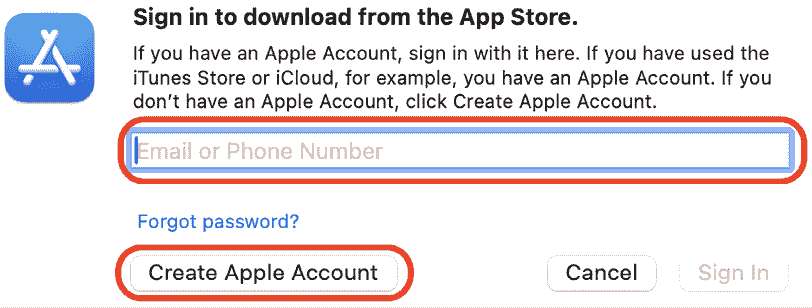

图 1.1：创建 Apple 账户对话框

你可以通过此链接了解如何使用此链接创建 Apple 账户的更多信息：https://support.apple.com/en-us/108647#appstore。

1.  一旦 Xcode 安装完成，启动它。你会看到一个许可协议屏幕。点击 **同意**：

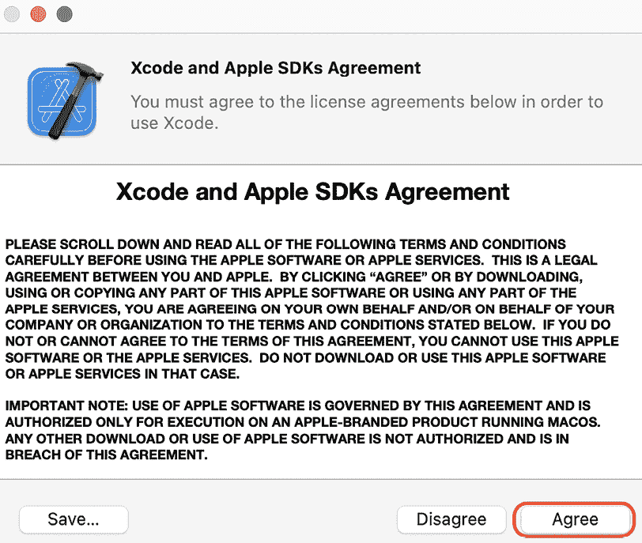

图 1.2：许可协议屏幕

1.  你将被提示输入你的 Mac 的管理员 **用户名** 和 **密码**。一旦完成，点击 **确定**：

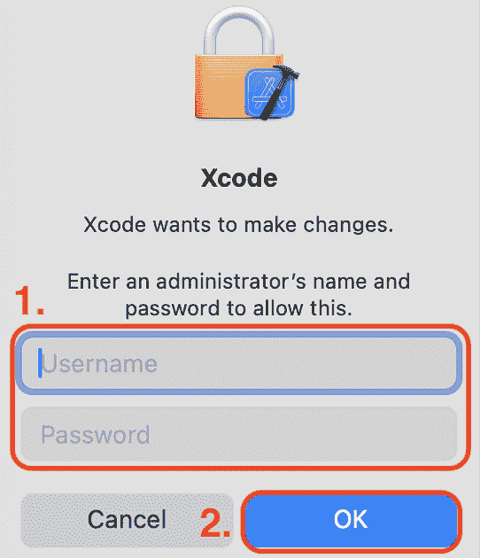

图 1.3：提示输入管理员用户名和密码

1.  您将看到一个显示可用的开发平台的屏幕。现在您只需要 macOS 和 iOS。勾选 **iOS 18.0**，取消勾选所有其他选项，并点击 **下载并安装**：

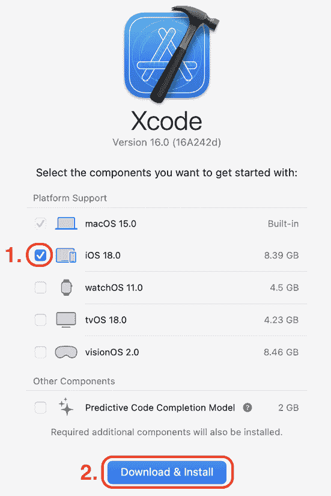

图 1.4：开发平台屏幕

1.  Xcode 将提示您重新启动以使用更新的框架。点击 **重新启动 Xcode**：

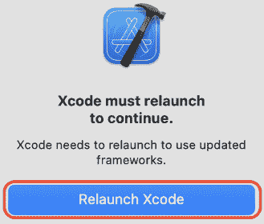

图 1.5：重新启动 Xcode 提示

1.  您将看到一个 **Xcode 新功能** 屏幕。点击 **继续**：

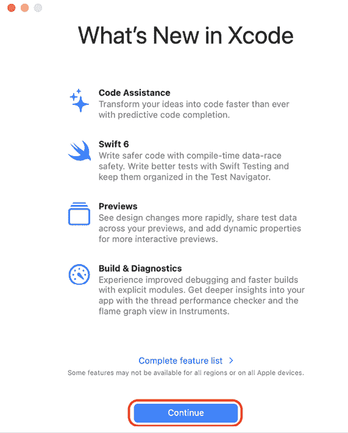

图 1.6：Xcode 新功能屏幕

1.  您将看到 **欢迎使用 Xcode** 屏幕。在左侧面板中点击 **创建新项目...**：

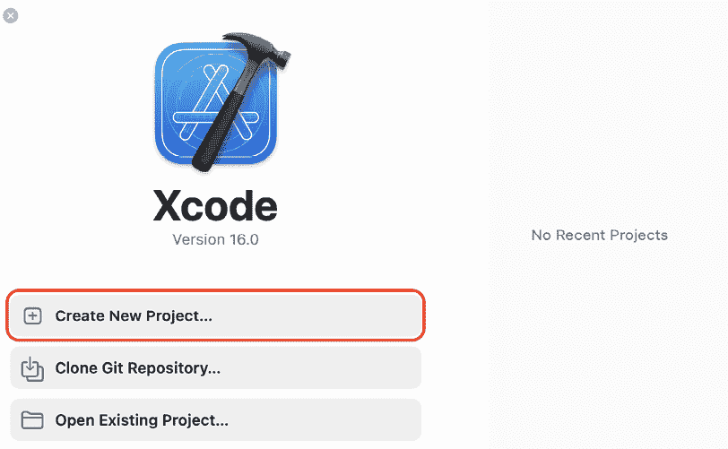

图 1.7：欢迎使用 Xcode 屏幕

1.  Xcode 将自动开始下载 **iOS 18.0 模拟器**。请注意，在此过程完成之前，您将无法在模拟器上运行任何应用程序：

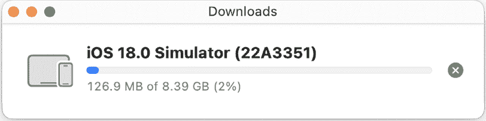

图 1.8：模拟器下载进度条

1.  您将看到以下新项目屏幕。在 **为您的项目选择模板** 部分，选择 **iOS**。然后选择 **应用程序** 并点击 **下一步**：

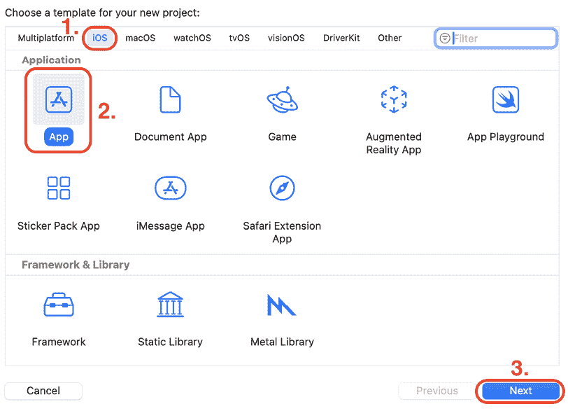

图 1.9：新项目屏幕

1.  您将看到 **为您的项目选择选项** 屏幕：

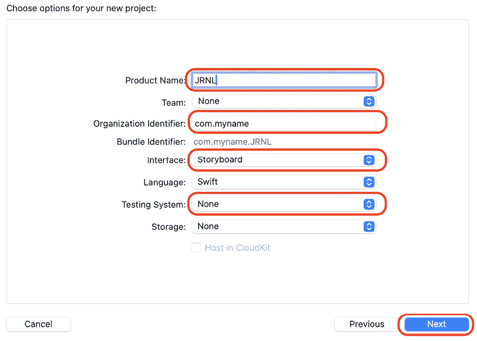

图 1.10：为您的项目选择选项屏幕

按以下选项进行配置：

+   **产品名称**：您的应用程序的名称。在文本框中输入 `JRNL`。

+   **组织标识符**：用于在 App Store 上为您的应用程序创建一个唯一的标识符。现在输入 `com.myname`。这被称为反向域名命名格式，是 iOS 开发者常用的格式。

+   **界面**：创建应用程序用户界面的方法。将其设置为 **Storyboard**。

+   **测试系统**：您将使用的测试系统。您将在 *第二十五章*，*Swift 测试入门* 中了解它。现在将其设置为 **无**。

将其他设置保留为默认值。完成后点击 **下一步**。

1.  您将看到一个 **保存** 对话框。选择一个位置来保存您的项目，例如 **桌面** 或 **文档** 文件夹，然后点击 **创建**：

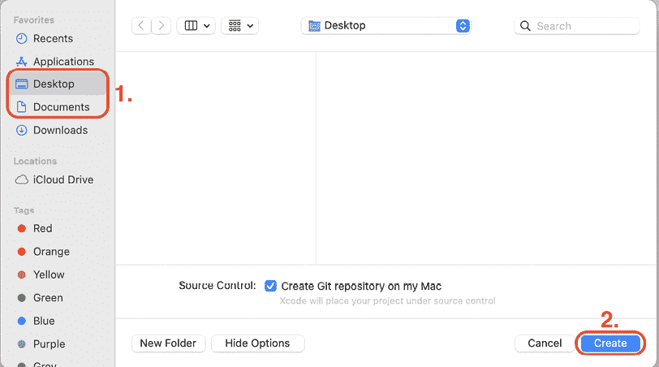

图 1.11：保存对话框

1.  您将看到一个显示 **Git 仓库创建失败** 的对话框。点击 **修复**。

    您看到此对话框的原因是因为在 **保存** 对话框中勾选了 **源代码控制** 复选框。Apple 建议开启 **源代码控制**。**源代码控制** 不在本书的范围之内，但如果您想了解更多关于版本控制和 Git 的信息，请参阅此链接：[`git-scm.com/video/what-is-version-control`](https://git-scm.com/video/what-is-version-control)。

1.  您将看到以下 **源代码控制** 屏幕：

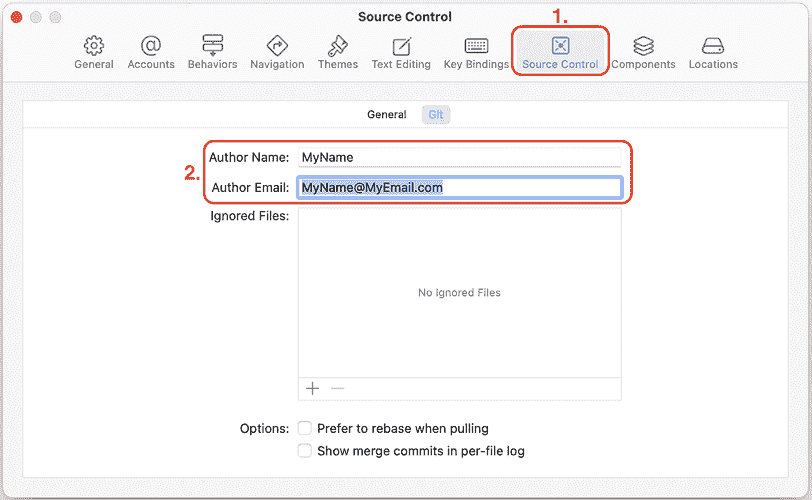

图 1.12：源代码控制首选项屏幕

输入以下信息：

+   **作者姓名**：您的名字

+   **作者电子邮件**：您的电子邮件地址

完成后，通过点击左上角的关闭按钮关闭 **源代码控制** 屏幕。Xcode 主窗口将出现。

太棒了！您现在已经成功下载并安装了 Xcode，并创建了您的第一个项目。在下一节中，您将了解 Xcode 用户界面。

# 探索 Xcode 用户界面

您已经成功创建了您的第一个 Xcode 项目！如您所见，Xcode 用户界面被分为几个不同的部分，如下所示：

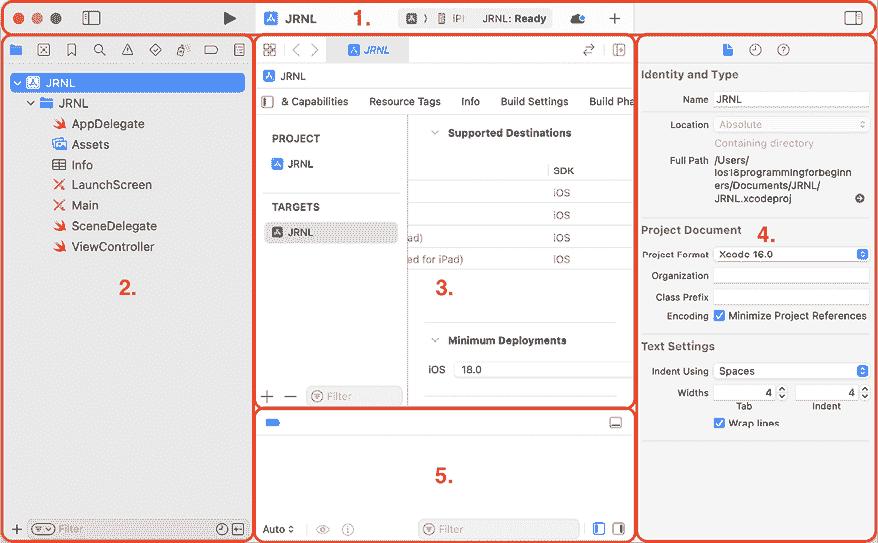

图 1.13：Xcode 用户界面

让我们更详细地看看每一部分。以下描述对应于前面截图中的数字：

+   **工具栏（1）**：用于构建和运行您的应用程序，并查看运行任务的进度。

+   **导航器区域（2）**：提供快速访问项目各个部分。默认显示 **项目导航器**。

+   **编辑区域（3）**：允许您编辑源代码、用户界面和其他资源。

+   **检查器区域（4）**：允许您查看和编辑 **导航器区域** 或 **编辑区域** 中选定项的信息。

+   **调试区域（5）** – 包含 **调试栏**、**变量视图** 和 **控制台**。通过按 *Shift* + *Command* + *Y* 切换 **调试区域**。

接下来，让我们更仔细地检查工具栏。工具栏的左侧如下所示：

图 1.14：Xcode 工具栏（左侧）

让我们更详细地看看每一部分。以下描述对应于前面截图中的数字：

+   **导航器按钮（1）** – 用于显示和隐藏导航器区域。

+   **停止按钮（2）** – 仅在应用程序运行时出现在运行按钮旁边。停止当前运行的应用程序。

+   **运行按钮（3）** – 用于构建和运行您的应用程序。

+   **方案菜单（4）** – 显示构建您的项目 **(JRNL**) 的特定方案以及运行您的应用程序的目标设备（**iPhone SE（第 3 代**）。方案和目标不同。方案指定构建和运行项目设置。目标指定应用程序的安装位置，并存在于模拟器和物理设备上。

+   **活动视图（5）** – 显示运行任务的进度。

工具栏的右侧如下所示：

图 1.15：Xcode 工具栏（右侧）

让我们更详细地看看每一部分。以下描述对应于前面截图中的数字：

+   **Xcode Cloud 按钮（1）** – 允许您登录到 Xcode Cloud，这是一个集成到 Xcode 中的持续集成和交付服务。

+   **图书馆按钮（2）** – 显示用户界面元素、代码片段和其他资源。

+   **检查器按钮（3）** – 用于显示和隐藏检查器区域。

不要被所有不同的部分吓到，因为你在接下来的章节中会详细了解它们。现在，你已经熟悉了 Xcode 界面，你将在模拟器中运行你刚刚创建的应用，它将显示 iOS 设备的表示。

# 在模拟器中运行你的应用

模拟器是在安装 Xcode 后下载和安装的。它提供了一个模拟的 iOS 设备，这样你就可以看到你的应用看起来如何以及它的行为，而无需物理 iOS 设备。它可以模拟 iPad 和 iPhone 的所有屏幕尺寸和分辨率，这样你就可以轻松地在多个设备上测试你的应用。

要在模拟器中运行你的应用，请按照以下步骤操作：

1.  点击目标弹出菜单以查看模拟设备的列表。从该菜单中选择**iPhone SE（第 3 代）**：

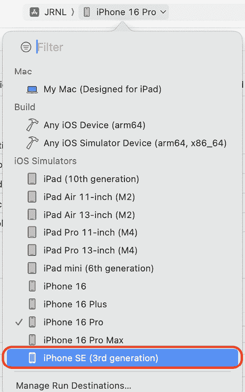

图 1.16：Xcode 目标弹出菜单，已选择 iPhone SE（第 3 代）

在你自己的项目中，你应该选择你需要的任何模拟器。话虽如此，如果你想与本书中的截图完全匹配，请使用**iPhone SE（第 3 代）**模拟器。这个模拟器还有一个主页按钮，因此更容易回到主页。

1.  点击运行按钮来在当前选定的模拟器上安装和运行你的应用。你也可以使用*Command* + *R*键盘快捷键。

1.  模拟器将启动并显示 iPhone SE（第 3 代）的表示。你的应用显示一个空白屏幕，因为你还没有向项目中添加任何内容：

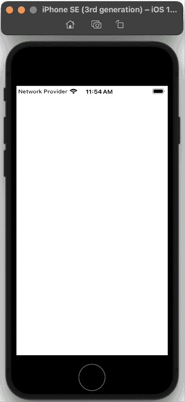

图 1.17：模拟器显示你的应用

1.  切换回 Xcode，点击停止按钮（或按*Command* + *.*)来停止当前运行的项目。

你刚刚在模拟器中创建并运行了你的第一个 iOS 应用！做得好！

目标菜单有一个显示连接到你的 Mac 的物理设备的部分，以及一个**构建**部分。你可能想知道它们有什么用。让我们在下一节中看看。

## 理解构建部分

在上一节中，你学习了如何在目标菜单中选择模拟设备来运行你的应用。除了模拟设备的列表外，此菜单还有一个显示连接到你的 Mac 的物理设备的部分，以及一个**构建**部分。

这些功能允许你在实际的 Mac 或 iOS 设备上运行应用，并为提交到 App Store 做准备。

点击工具栏中的目标菜单以查看菜单顶部的物理设备和**构建**部分：

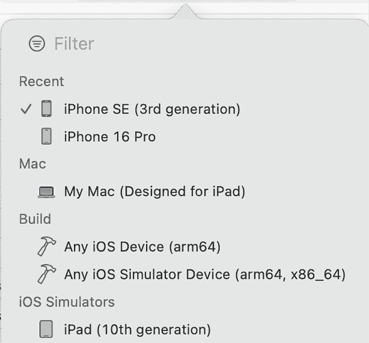

图 1.18：Xcode 目标菜单显示设备和构建部分

如果你有一台 Apple Silicon Mac，物理设备部分将显示文本说明 **我的 Mac（专为 iPad 设计）**，因为 Apple Silicon Mac 可以运行 iOS 应用。否则，将显示 **无设备**。如果你插入了一个 iOS 设备，它将出现在此部分，并且你可以运行你为测试而开发的 app。在真实设备上运行你的 app 是推荐的，因为模拟器无法准确反映真实 iOS 设备的性能特征，并且没有真实设备所具有的硬件功能。

**构建**部分有两个菜单项，**任何 iOS 设备(arm64**) 和 **任何 iOS 模拟器设备 (arm64, x86_64**)。这些用于在提交到 App Store 之前存档你的 app。你将在 *第二十七章*，*测试并将你的 app 提交到 App Store* 中学习如何这样做。

现在我们来看看如何在真实的 iOS 设备上构建和运行你的 app。尽管这本书中的大多数说明不需要你拥有 iOS 设备，但如果你没有，你可以跳过下一节，直接进入 *第二章*，*简单值和类型*。

# 在 iOS 设备上运行你的 app

虽然你将能够使用模拟器完成这本书中的大多数练习，但建议在真实设备上构建和测试你的 app，因为模拟器无法模拟某些硬件组件和软件 API。

要全面了解模拟器和实际设备之间的所有差异，请参阅此链接：https://help.apple.com/simulator/mac/current/#/devb0244142d。

除了你的设备外，你还需要一个 Apple 账户（用于自动创建免费的 Apple 开发者账户）或付费的 Apple 开发者账户，才能在你的设备上构建和运行你的 app。你可以使用你从 App Store 下载 Xcode 时使用的同一个 Apple 账户。要在 iOS 设备上运行你的 app，请按照以下步骤操作：

1.  使用随你的 iOS 设备一起提供的电缆将你的设备连接到你的 Mac，并确保 iOS 设备已解锁。

1.  你的 Mac 将显示一个 **允许配件连接** 提示。点击 **允许**。

1.  你的 iOS 设备将显示一个 **信任此计算机** 提示。轻触 **信任** 并在提示时输入你的设备密码。你的 iOS 设备现在已连接到你的 Mac，并将在 Xcode 的目标菜单中显示。

1.  在 Xcode 菜单栏中选择 **窗口 | 设备和模拟器**。你将看到一个显示消息的窗口，说明 **开发者模式已禁用**：

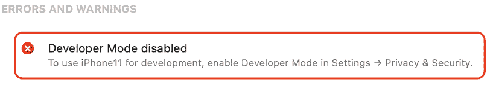

图 1.19：Xcode 设备和模拟器窗口显示开发者模式已禁用

Apple 在 2022 年的全球开发者大会（WWDC 2022）期间引入了开发者模式，这是在运行 iOS 16 或更高版本的设备上安装、运行和调试你的 app 所必需的。

要观看关于开发者模式的 WWDC 2022 视频，请点击此链接：[`developer.apple.com/videos/play/wwdc2022/110344/`](https://developer.apple.com/videos/play/wwdc2022/110344/)。

1.  要在您的 iOS 设备上启用开发者模式，请转到 **设置** | **隐私与安全**，向下滚动到 **开发者模式** 项，并点击它：

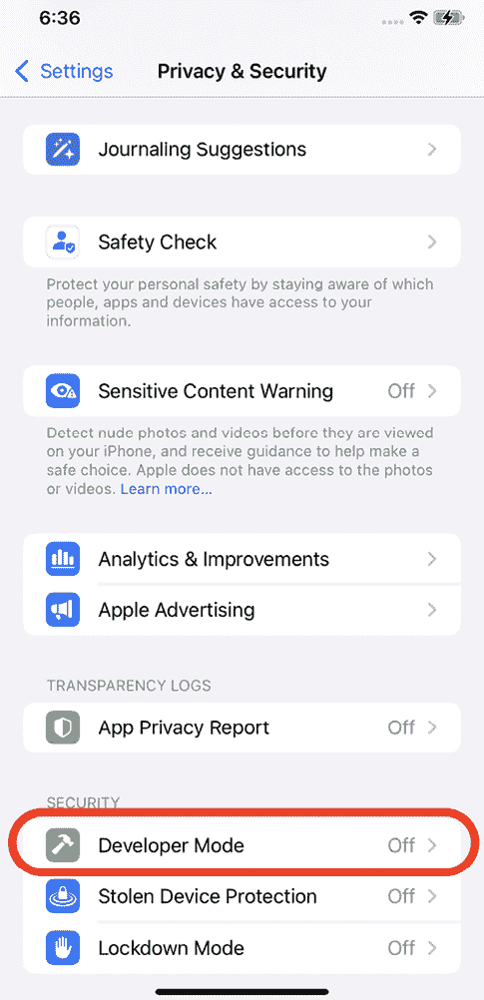

图 1.20：隐私与安全屏幕显示开发者模式

1.  打开 **开发者模式** 开关：

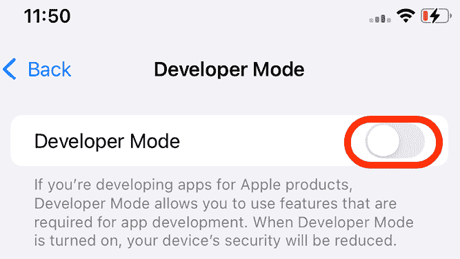

图 1.21：开发者模式开关

1.  将会弹出一个警告，提醒您开发者模式会降低您的 iOS 设备的安全性。点击警告的 **重启** 按钮。

1.  在您的 iOS 设备重新启动并解锁后，通过点击 **启用** 并输入您的 iOS 设备密码来确认您想要启用 **开发者模式**。

1.  设备和模拟器窗口将显示 **准备 iPhone** 信息。等待几分钟，然后确认设备和模拟器窗口不再显示 **开发者模式已禁用** 文本：

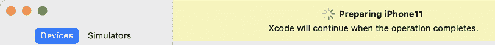

图 1.22：Xcode 设备和模拟器窗口显示准备 iPhone 信息

您的 iOS 设备现在已准备好安装和运行来自 Xcode 的应用程序。

1.  在 Xcode 中，从目标菜单中选择您的 iOS 设备。

1.  通过点击运行按钮（或使用 *Command* + *R*）来运行项目。您将在 Xcode 的 **签名与能力** 面板中遇到以下错误：**“JRNL”的签名需要一个开发团队**：

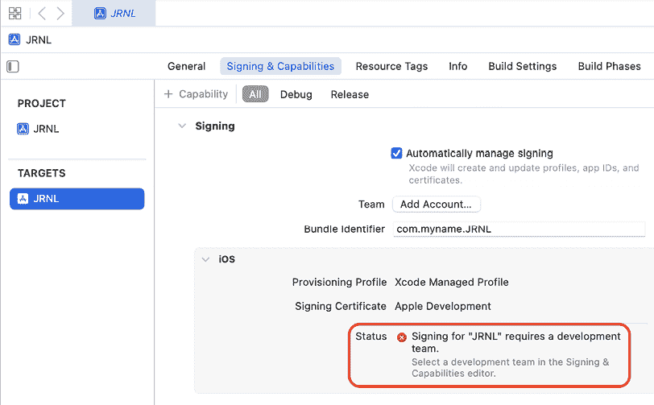

图 1.23：Xcode 签名与能力面板

这是因为要在 iOS 设备上运行应用程序需要数字证书，您需要将免费或付费的 Apple 开发者账户添加到 Xcode，以便生成数字证书。

使用 Apple 账户创建免费的开发者账户将允许您在 iOS 设备上测试您的应用程序，但它仅有效期为 7 天。此外，您还需要付费的 Apple 开发者账户才能在 App Store 上分发应用程序。您将在第二十七章 *测试和提交您的应用程序到 App Store* 中了解更多信息。

证书确保只有您授权的应用程序才能在您的设备上运行。这有助于防止恶意软件。您也可以通过此链接了解更多信息：https://help.apple.com/xcode/mac/current/#/dev60b6fbbc7。

1.  点击 **添加账户...** 按钮：

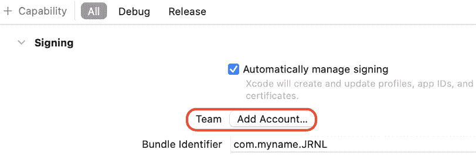

图 1.24：Xcode 签名与能力面板，已选择 **添加账户…** 按钮

1.  Xcode **设置** 窗口出现，并选中了 **账户** 选项卡。输入您的 Apple 账户并点击 **下一步**：

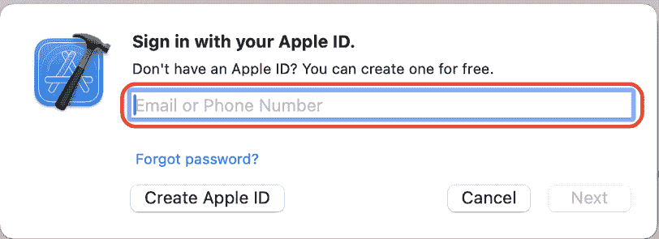

图 1.25：创建 Apple 账户对话框

注意，如果您愿意，可以使用 **创建 Apple ID** 按钮创建不同的 Apple 账户。

您也可以通过在 Xcode 菜单中选择 **设置** 来访问 Xcode 设置。

1.  当提示时输入您的密码。几分钟后，**账户** 选项卡将显示您的账户设置：

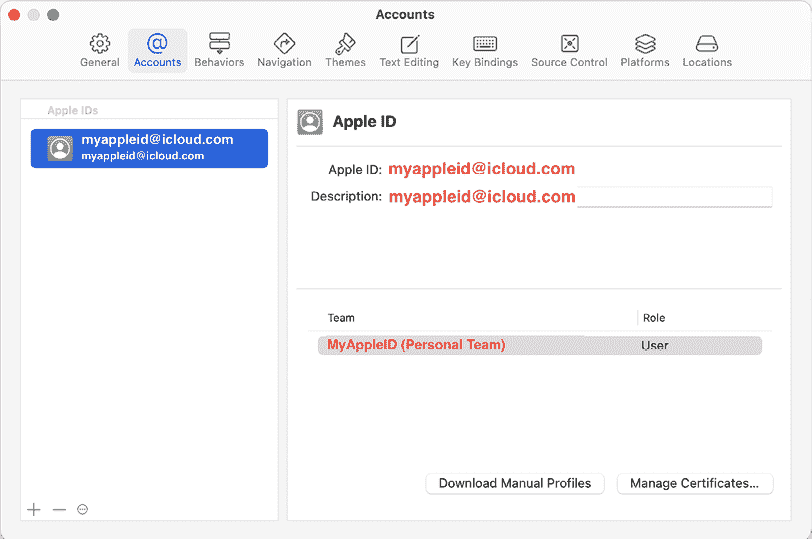

图 1.26：Xcode 预设中的账户选项卡

1.  完成后，通过点击左上角的红色关闭按钮关闭 **设置** 窗口。

1.  在 Xcode 的编辑区域中，点击**签名与功能**。确保**自动管理签名**被勾选，并且从**团队**下拉菜单中选择**个人团队**：

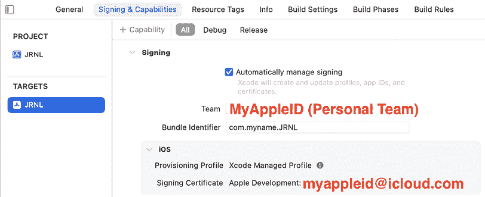

图 1.27：Xcode 签名与功能面板，已设置账户

1.  如果您在此屏幕上仍然看到错误，请尝试通过在其中输入一些随机字符来更改您的**包标识符**，例如，`com.myname6712.JRNL`。

1.  构建并运行您的应用程序。如果您被提示输入密码，请输入您的 Mac 登录密码并点击**始终允许**。

1.  您的应用程序将安装在您的 iOS 设备上。然而，它将无法启动，您将看到以下信息：

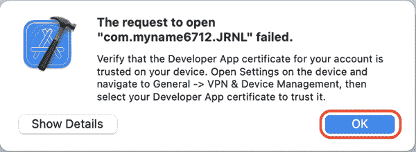

图 1.28：无法启动“JRNL”对话框

1.  这意味着您需要信任已安装到您设备上的证书。您将在下一节中学习如何做到这一点。

## 在您的 iOS 设备上信任开发者应用程序证书

**开发者应用程序证书**是一个特殊文件，它将与应用程序一起安装到您的 iOS 设备上。在您的应用程序可以运行之前，您需要信任它。按照以下步骤操作：

1.  在您的 iOS 设备上，点击**设置** | **通用** | **VPN 与设备管理**：

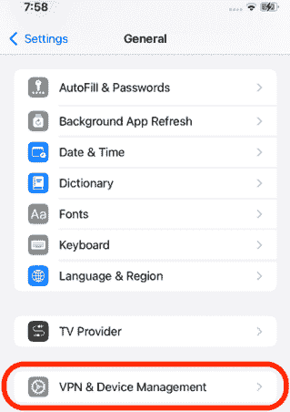

图 1.29：设置中的 VPN 与设备管理设置

1.  点击您的 Apple 账户：

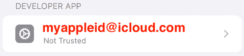

图 1.30：设备管理设置中的您的 Apple 账户

1.  点击**信任**：

图 1.31：信任按钮

1.  点击**允许**：

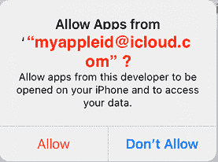

图 1.32：允许对话框

您应该看到以下文本，这表明应用程序现在已被信任：

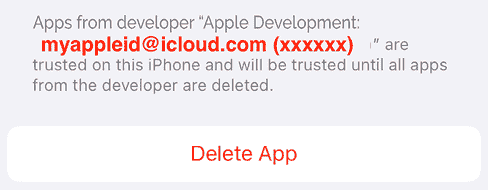

图 1.33：设备管理部分，带有已信任证书

1.  在 Xcode 中点击运行按钮以构建和再次运行。您将看到您的应用程序在 iOS 设备上启动并运行。

恭喜！您已成功在真实 iOS 设备上运行了您的应用程序！

# 摘要

在本章中，您学习了如何在 Mac 上下载和安装 Xcode。然后，您熟悉了 Xcode 用户界面的不同部分。之后，您创建了您的第一个 iOS 应用程序，选择了一个模拟 iOS 设备，并在模拟器中构建和运行了应用程序。最后，您学习了如何通过 USB 将 iOS 设备连接到 Xcode，以便您可以在其上运行应用程序。

在下一章中，我们将开始使用 Swift Playgrounds 探索 Swift 语言，并学习简单的值和类型如何在 Swift 中实现。

# 加入我们的 Discord！

与其他用户、专家和作者本人一起阅读这本书。提出问题，为其他读者提供解决方案，通过 Ask Me Anything 会议与作者聊天，等等。扫描二维码或访问链接加入社区。

[`packt.link/ios-Swift`](https://packt.link/ios-Swift%0D)

