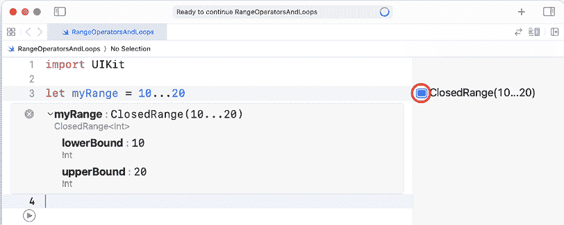

# 范围运算符和循环

在上一章中，你学习了条件语句，它允许你根据不同的条件执行不同的操作，以及可选类型，它使你能够创建可能或可能没有值的变量。

在本章中，你将了解**范围运算符**和**循环**。范围运算符允许你通过指定范围的起始和结束值来表示一系列值。你将了解不同类型的范围运算符。循环允许你重复执行一条指令或一系列指令。你可以重复一个序列固定次数或直到满足某个条件。你将了解用于完成此操作的不同类型的循环。

到本章结束时，你将学会如何使用范围以及创建和使用不同类型的循环（`for-in`、`while`和`repeat-while`）。

本章将涵盖以下主题：

+   探索范围运算符

+   探索循环

# 技术要求

本章的 Xcode 游乐场位于本书代码包的`Chapter04`文件夹中，可以从以下链接下载：

[`github.com/PacktPublishing/iOS-18-Programming-for-Beginners-Ninth-Edition`](https://github.com/PacktPublishing/iOS-18-Programming-for-Beginners-Ninth-Edition).

查看以下视频，以查看代码的实际运行情况：

[`youtu.be/swoigirsG_s`](https://youtu.be/swoigirsG_s%0D)

如果你希望从头开始，创建一个新的游乐场并将其命名为`RangeOperatorsAndLoops`。

你可以边走边输入并运行本章中的所有代码。让我们从使用范围运算符指定数字范围开始。

# 探索范围运算符

假设你需要编写一个为百货公司编写程序，该程序可以自动向 18 至 30 岁的顾客发送折扣券。如果需要为每个年龄设置`if`或`switch`语句，将会非常繁琐。在这种情况下使用范围运算符会方便得多。

范围运算符允许你表示一系列值。假设你想要表示一个从`firstNumber`开始到`lastNumber`结束的数字序列。你不需要指定每个值；你只需以这种方式指定范围：

```swift
firstNumber...lastNumber 
```

更多关于范围运算符的信息，请访问[`docs.swift.org/swift-book/documentation/the-swift-programming-language/basicoperators`](https://docs.swift.org/swift-book/documentation/the-swift-programming-language/basicoperators)。

让我们在游乐场中尝试一下。按照以下步骤操作：

1.  将以下代码添加到你的游乐场中并运行它：

    ```swift
    let myRange = 10...20 
    ```

这将为`myRange`常量分配一个从`10`开始到`20`结束的数字序列，包括这两个数字，这被称为**闭区间运算符**。`myRange`的起始和结束值将在结果区域显示。

1.  显示在结果区域的结果可能会被截断。点击结果右侧的方块图标。它将在编辑器区域中内联显示：



图 4.1：显示内联结果的编辑器区域

你现在可以在代码行下面的框中看到完整的结果。如果你愿意，可以拖动框的右边缘使其变大。

记住，你可以拖动结果和编辑器区域之间的边界来增加结果区域的大小。

1.  如果你不想在范围内包含序列的最后一个数字，将`...`替换为`..<`。在下一行输入并运行以下语句：

    ```swift
    let myRange2 = 10..<20 
    ```

这将在`myRange2`常量中存储从`10`开始到`19`结束的序列，并被称为**半开区间范围运算符**。

还有一种范围运算符类型，即**单侧范围运算符**，你将在下一章中了解它。

现在你已经知道了如何创建和使用范围，你将在下一节学习循环、不同类型的循环以及如何在程序中使用它们。

# 探索循环

在编程中，你经常需要重复执行相同的事情。例如，每个月，公司都需要为每位员工生成工资条。如果公司有 10,000 名员工，编写 10,000 条指令来创建工资条将是不高效的。重复一条指令 10,000 次会更好，循环就是为此而用的。

有三种循环类型：`for-in`循环、`while`循环和`repeat-while`循环。`for-in`循环将重复已知次数，而`while`和`repeat-while`循环将在循环条件为`true`时重复。

关于循环的更多信息，请访问[`docs.swift.org/swift-book/documentation/the-swift-programming-language/controlflow`](https://docs.swift.org/swift-book/documentation/the-swift-programming-language/controlflow)。

让我们逐一查看每种类型，从`for-in`循环开始，当你知道循环应该重复多少次时使用。

## `for-in`循环

`for-in`循环遍历序列中的每个值，并将一组语句（称为**循环体**）在每次执行时执行。每个值依次分配给一个临时变量，并且可以在循环体内使用这个临时变量。它看起来是这样的：

```swift
for item in sequence {
   code
} 
```

循环重复的次数由序列中的项目数量决定。让我们先创建一个`for-in`循环来显示`myRange`中的所有数字。按照以下步骤操作：

1.  将以下代码添加到你的游乐场中并运行它：

    ```swift
    for number in myRange {
       print(number)
    } 
    ```

你应该看到序列中的每个数字都在调试区域中显示。请注意，由于`myRange`包括范围中的最后一个数字，循环内的语句执行了 11 次。

1.  让我们尝试相同的程序，但这次使用`myRange2`。按照以下方式修改代码并运行：

    ```swift
    for number in **myRange2** {
       print(number)
    } 
    ```

循环内的语句执行了 10 次，并且在调试区域中打印的最后一个值是**19**。

1.  你甚至可以直接在`in`关键字后面使用范围运算符。输入并运行以下代码：

    ```swift
    for number in 0...5 {
       print(number)
    } 
    ```

从 0 到 5 的每个数字都在调试区域中显示。

1.  如果你想序列反向，请使用 `reversed()` 函数。按照以下方式修改代码并运行：

    ```swift
    for number in **(****0****...****5****).reversed()** {
       print(number)
    } 
    ```

每个从 5 到 0 的数字都会显示在调试区域中。

干得好！让我们在下一节中检查 `while` 循环，当循环序列应该在条件为 `true` 时重复时使用。

## 当前的循环

`while` 循环包含一个条件和一组在花括号中的语句，称为循环体。首先检查条件；如果为 `true`，则执行循环体，并且循环会重复，直到条件为 `false`。以下是一个 `while` 循环的示例：

```swift
while condition == true {
   code
} 
```

添加并运行以下代码以创建一个变量，将其增加 5，并且只要变量的值小于 50 就继续这样做：

```swift
var x = 0
while x < 50 {
   x += 5
   print("x is \(x)")
} 
```

让我们逐步分析代码。最初，`x` 被设置为 `0`。检查 `x < 50` 条件并返回 `true`，因此执行循环体。`x` 的值增加 `5`，并在调试区域中打印出 **x 是 5**。循环重复，再次检查 `x < 50`。由于 `x` 现在是 `5`，并且 `5 < 50` 仍然返回 `true`，因此再次执行循环体。这会一直重复，直到 `x` 的值为 `50`，此时 `x < 50` 返回 `false`，循环停止。

如果 `while` 循环的条件一开始就是 `false`，则循环体将永远不会执行。尝试将 `x` 的值更改为 `100` 来查看这一点。

在下一节中，你将学习 `repeat-while` 循环。这些循环首先执行循环体内的语句，然后再检查循环条件。

## `repeat-while` 循环

与 `while` 循环一样，`repeat-while` 循环也包含一个条件和循环体，但循环体在检查条件之前先执行。如果条件为 `true`，则循环会重复，直到条件返回 `false`。以下是一个 `repeat-while` 循环的示例：

```swift
repeat {
   code
} while condition == true 
```

添加并运行以下代码以创建一个变量，将其增加 5，并且只要变量的值小于 50 就继续这样做：

```swift
var y = 0
repeat {
   y += 5
   print("y is \(y)")
} while y < 50 
```

让我们逐步分析代码。最初，`y` 被设置为 `0`。执行循环体。`y` 的值增加 `5`，因此现在 `y` 包含 `5`，并在调试区域中打印出 **y 是 5**。检查 `y < 50` 条件，由于它返回 `true`，因此循环会重复。`y` 的值增加 `5`，因此现在 `y` 包含 `10`，并在调试区域中打印出 **y 是 10**。循环会重复，直到 `y` 包含 `50`，此时 `y < 50` 返回 `false`，循环停止。

即使初始条件为 `false`，循环体也会至少执行一次。尝试将 `y` 的值更改为 `100` 来查看这一点。

你现在已经知道如何创建和使用不同的循环类型。太棒了！

# 摘要

在本章中，你学习了闭包和半开区间运算符，这些运算符允许你指定一组数字的范围，而不是逐个指定每个单独的数字。

你还学习了三种不同的循环类型：`for-in` 循环、`while` 循环和 `repeat-while` 循环。`for-in` 循环允许你重复执行一组语句固定次数，而 `while` 和 `repeat-while` 循环允许在条件为真时重复执行一组语句。做得很好！

在下一章中，你将学习集合类型，这些类型允许你通过索引、键值对以及无结构的 数据集合来存储数据。

# 加入我们的 Discord 社群！

与其他用户、专家以及作者本人一起阅读这本书。提问、为其他读者提供解决方案、通过“问我任何问题”的环节与作者聊天，以及更多。扫描二维码或访问链接加入社区。

[`packt.link/ios-Swift`](https://packt.link/ios-Swift%0D)


