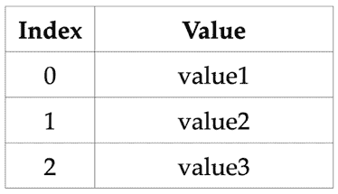
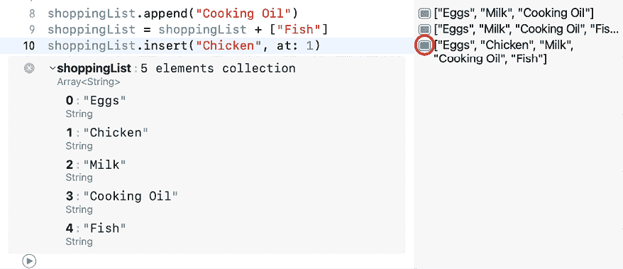
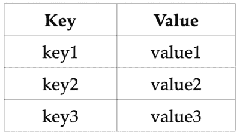
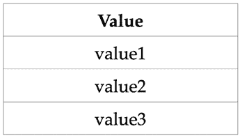

# 第五章：集合类型

到目前为止，你已经学到了很多！你现在可以创建一个存储数据在常量或变量中并对其执行操作的程序，并且你可以使用条件语句和循环来控制流程。但到目前为止，你主要存储的是单个值。

在本章中，你将学习存储值集合的方法。Swift 有三种集合类型：`数组`，它存储一个有序的值列表；`字典`，它存储一个无序的键值对列表；以及 `集合`，它存储一个无序的值列表。

到本章结束时，你将学会如何创建数组、字典和集合，以及如何对它们进行操作。

本章将涵盖以下主题：

+   探索数组

+   探索字典

+   探索集合

# 技术要求

本章的 Xcode 操场位于本书代码包的 `Chapter05` 文件夹中，可以在此处下载：

[`github.com/PacktPublishing/iOS-18-Programming-for-Beginners-Eighth-Edition`](https://github.com/PacktPublishing/iOS-18-Programming-for-Beginners-Eighth-Edition%0D)

查看以下视频以查看代码的实际操作：

[`youtu.be/W13l9tOMFx8`](https://youtu.be/W13l9tOMFx8%0D)

如果你希望从头开始，创建一个新的操场并将其命名为 `CollectionTypes`。你可以逐行输入并运行本章中的所有代码。

要了解更多关于数组、字典和集合的信息，请访问 [`docs.swift.org/swift-book/documentation/the-swift-programming-language/collectiontypes`](https://docs.swift.org/swift-book/documentation/the-swift-programming-language/collectiontypes)。

你将要学习的第一个集合类型是数组，它允许你按有序列表存储信息。

# 探索数组

假设你想要存储以下内容：

+   便利店购买物品清单

+   每月必须做的家务

数组将非常适合这个。数组按有序列表存储值。它看起来是这样的：



图 5.1：数组表示

值必须是同一类型。你可以通过使用数组索引来访问数组中的任何值，索引从 0 开始。

如果你使用 `let` 关键字创建一个数组，那么在创建后其内容不能被更改。如果你想创建后更改数组的内容，请使用 `var` 关键字。

让我们看看如何使用数组。你将在下一节中通过给数组赋值来创建它。

## 创建数组

在前面的章节中，你通过声明并为其分配一个初始值来创建一个常量或变量。你可以用同样的方式创建一个数组。

想象一下你的配偶要求你从便利店购买一些物品。让我们使用数组来实现购物清单。将以下代码添加到你的操场中并运行它：

```swift
var shoppingList = ["Eggs", "Milk"] 
```

此指令创建了一个名为 `shoppingList` 的数组变量。分配的值 `["Eggs", "Milk"]` 是一个 **数组字面量**。它表示一个包含两个 `String` 类型元素的数组，其中 `"Eggs"` 在索引 `0`，`"Milk"` 在索引 `1`。

在这里使用 `var` 关键字意味着可以修改数组的元素。由于 Swift 使用类型推断，这个数组的元素类型将是 `String`。

假设您需要检查在商店需要购买多少个项目。在下一节中，您将学习如何确定数组中的元素数量。

## 检查数组中的元素数量

要找出数组中有多少个元素，请使用 `count`。输入并运行以下代码：

```swift
shoppingList.count 
```

由于 `shoppingList` 数组包含两个元素，结果区域显示 **2**。

您可以使用 `isEmpty` 来检查数组是否为空。输入并运行以下代码：

```swift
shoppingList.isEmpty 
```

由于 `shoppingList` 数组包含两个元素，结果区域显示 **false**。

您也可以通过使用 `shoppingList.count == 0` 来检查数组是否为空，但使用 `shoppingList.isEmpty` 提供更好的性能。

假设您的配偶打电话让您在商店时买油、鱼和鸡肉。在下一节中，您将看到如何向数组的末尾添加元素，以及在指定的数组索引处添加元素。

## 向数组添加新元素

您可以使用 `append(_:)` 方法向数组的末尾添加新元素。输入并运行以下代码：

```swift
shoppingList.append("Cooking Oil") 
```

`"Cooking Oil"` 已添加到 `shoppingList` 数组的末尾，该数组现在包含三个元素 – `"Eggs"`、`"Milk"` 和 `"Cooking Oil"`，并且在结果区域显示为 **[`"Eggs"`, `"Milk"`, `"Cooking Oil"`]**。

您还可以使用 `+` 运算符将数组添加到另一个数组中，以下代码示例：

```swift
shoppingList = shoppingList + ["Fish"] 
```

您可以使用 `insert(_:at:)` 方法在指定索引处添加新项目。输入并运行以下代码：

```swift
shoppingList.insert("Chicken", at: 1) 
```

这将在索引 `1` 处插入 `"Chicken"`，因此现在 `shoppingList` 数组包含 `"Eggs"`、`"Chicken"`、`"Milk"`、`"Cooking Oil"` 和 `"Fish"`。注意，`"Chicken"` 是数组的第二个元素，因为第一个元素位于索引 `0`。您可以通过点击快速查看图标来看到这一点：



图 5.2：在游乐场中显示的数组内容

假设您已经购买了购物清单上的第一个项目，现在您需要知道下一个项目是什么。在下一节中，您将学习如何使用数组索引访问特定数组元素。

## 访问数组元素

您可以通过指定数组索引来访问特定元素。输入并运行以下代码：

```swift
shoppingList[2] 
```

这将返回存储在索引 `2` 的数组元素，并且在结果区域显示 **“Milk”**。

假设您的配偶打电话让您买豆浆而不是牛奶。由于这个数组是使用 `var` 关键字声明的，您可以修改其中存储的值。您将在下一节中学习如何操作。

## 将新值分配给指定索引

你可以通过指定索引并为其分配新值来替换现有的数组元素。输入并运行以下代码：

```swift
shoppingList[2] = "Soy Milk"
shoppingList 
```

这将替换存储在索引`2`处的值`"Milk"`为`"Soy Milk"`。现在`shoppingList`数组包含`"Eggs"`、`"Chicken"`、`"Soy Milk"`、`"Cooking Oil"`和`"Fish"`，如结果区域所示。

注意，使用的索引必须是有效的。例如，你不能使用索引`5`，因为这里唯一的有效索引是`0`、`1`、`2`、`3`和`4`。这样做会导致程序崩溃。

想象一下，你的配偶打电话告诉你冰箱里有鸡肉和鱼，所以你不再需要它们。在下一节中，你将看到两种从数组中移除元素的方法。

## 从数组中移除元素

你可以通过使用`remove(at:)`从数组中移除一个元素。输入并运行以下代码：

```swift
let oldArrayValue = shoppingList.remove(at: 1)
oldArrayValue
shoppingList 
```

这将从`shoppingList`数组中移除索引`1`处的项目`"Chicken"`，因此现在它包含`"Eggs"`、`"Soy Milk"`、`"Cooking Oil"`和`"Fish"`。被移除的项目存储在`removedValue`中。你可以在结果区域中看到这一点。

你也可以选择不保留被移除的值。输入并运行以下代码：

```swift
shoppingList.remove(at:  3)
shoppingList 
```

这将从`shoppingList`数组中移除索引`3`处的项目`"Fish"`，因此现在它包含`"Eggs"`、`"Soy Milk"`和`"Cooking Oil"`。

如果你正在从数组中移除最后一个项目，你可以使用`removeLast()`代替，并且可以选择将移除的值也分配给一个常量或变量。

想象一下，你已经获得了列表中的每一项，并且你想再次遍历你的列表以确保。你需要依次访问每个数组元素并对每个元素执行操作。你将在下一节中看到如何做到这一点。

## 遍历数组

记得你在上一章中学到的`for-in`循环吗？你可以使用它来遍历数组中的每个元素。输入并运行以下代码：

```swift
for shoppingListItem in shoppingList {
   print(shoppingListItem)
} 
```

这将打印出数组中的每个元素到调试区域。

你也可以使用**单侧范围运算符**。这些是只有起始值的范围运算符，例如`1...`。输入并运行以下代码：

```swift
for shoppingListItem in shoppingList[1...] {
   print(shoppingListItem)
} 
```

这将在从索引`1`开始的数组元素打印到调试区域。

你现在知道如何使用数组创建有序列表，例如购物清单，以及如何执行数组操作，如访问、添加和移除元素。在下一节中，我们将看看如何使用字典存储无序列表的键值对。

# 探索字典

假设你正在编写一个*联系人*应用。你需要存储一个包含姓名和相应联系号码的列表。字典非常适合这个用途，因为它允许你将电话号码与联系人姓名关联起来。

字典以无序列表的形式存储键值对。它看起来是这样的：



图 5.3：字典的表示

所有键必须是同一类型且必须是唯一的。所有值必须是同一类型，但不必必须是唯一的。键和值不必是同一类型的。你使用键来获取相应的值。

如果你使用 `let` 关键字创建字典，一旦创建，其内容就不能更改。如果你想创建后更改内容，请使用 `var` 关键字。

让我们看看如何与字典一起工作。你将在下一节中通过为它分配一个值来创建一个字典。

## 创建字典

假设你正在创建一个 *联系人* 应用。对于这个应用，你将使用字典来存储你的联系人。就像数组一样，你可以通过声明并为其分配一个初始值来创建一个新的字典。将以下代码添加到你的沙盒中并运行它：

```swift
var contactList = ["Shah" : "+60123456789", "Aamir" : "+0223456789"] 
```

此指令创建了一个名为 `contactList` 的字典变量。分配的值，`["Shah" : "+60123456789", "Aamir" : "+0223456789"]`，是一个 **字典字面量**。它代表一个包含两个元素的字典。每个元素都是一个键值对，其中联系人名称作为键，联系人电话号码作为值。请注意，由于联系人名称是键字段，它应该是唯一的。

由于 `contactList` 字典是一个变量，你可以在创建后更改字典的内容。由于类型推断，键和值都是 `String` 类型。

假设你的应用必须显示联系人的总数。在下一节中，你将学习如何确定字典中的元素数量。

## 检查字典中的元素数量

要找出字典中有多少个元素，请使用 `count`。输入并运行以下代码：

```swift
contactList.count 
```

由于 `contactList` 字典中有两个元素，结果区域中显示 **2**。

你可以使用 `isEmpty` 来检查字典是否为空。输入并运行以下代码：

```swift
contactList.isEmpty 
```

由于 `contactList` 字典有两个元素，结果区域中显示 **false**。

也可以通过使用 `contactlist.count == 0` 来检查字典是否为空，但使用 `contactList.isEmpty` 提供了更好的性能。

假设你刚刚结束了一个会议，并想在应用中添加一个新的联系人。由于这个字典是使用 `var` 关键字声明的，你可以向其中添加键值对。你将在下一节中学习如何操作。 

## 向字典中添加新元素

要向字典中添加新元素，提供一个键并为它分配一个值。输入并运行以下代码：

```swift
contactList["Meena"] = "+0229876543"
contactList 
```

这将在 `contactList` 字典中添加一个新的键值对，键为 `"Meena"`，值为 `"+0229876543"`。现在它包含 `"Shah" : "+60126789345"`，`"Aamir" : "+0223456789"` 和 `"Meena" : "+0229876543"`。您可以在结果区域中看到这一点。

假设你想拨打你的一个联系人的电话，并需要该联系人的电话号码。在下一节中，你将看到如何通过指定键来访问字典元素以获取所需值。

## 访问字典元素

你可以指定一个字典键来访问其对应值。输入并运行以下代码：

```swift
contactList["Shah"] 
```

这将返回键 `"Shah"` 的值，并在结果区域显示 **+60123456789**。

假设你的某个联系人换了一个新电话，因此你必须更新该联系人的电话号码。你可以修改字典中存储的键值对。你将在下一节中学习如何操作。

## 给现有的键分配新值

你可以给现有的键分配一个新值。输入并运行以下代码：

```swift
contactList["Shah"] = "+60126789345"
contactList 
```

这将给键 `"Shah"` 分配一个新值。现在 `contactList` 字典包含 `"Shah" : "+60126789345"`，`"Aamir" : "+0223456789"` 和 `"Meena" : "+0229876543"`。你可以在结果区域看到这一点。

假设你必须从你的应用程序中删除一个联系人。让我们看看下一节中如何从字典中移除元素。

## 从字典中移除元素

要从字典中移除一个元素，将 `nil` 分配给现有的键。输入并运行以下代码：

```swift
contactList["Aamir"] = nil
contactList 
```

这将从 `contactList` 字典中移除键为 `"Aamir"` 的元素，现在它包含 `"Shah" : "+60126789345"` 和 `"Meena" : "+0229876543"`。你可以在结果区域看到这一点。

如果你想要保留你正在移除的值，请使用 `removeValue(for:Key)` 代替。输入并运行以下代码：

```swift
var oldDictValue = contactList.removeValue(forKey: "Meena")
oldDictValue
contactList 
```

这将从 `contactList` 字典中移除键为 `"Meena"` 的元素，并将其值分配给 `oldDictValue`。现在 `oldDictValue` 包含 `"+0229876543"`，而 `contactList` 字典包含 `"Shah" : "+60126789345"`。

你也可以选择只移除值，而无需将其分配给常量或变量，如下所示：

```swift
contactList.removeValue(forKey: "Meena") 
```

假设你想要给每个联系人打电话，祝他们新年快乐。你必须依次访问每个字典元素并对其执行操作。你将在下一节中看到如何操作。

## 遍历字典

就像数组一样，你可以使用 `for-in` 循环遍历字典中的每个元素。输入并运行以下代码：

```swift
for (name, contactNumber) in contactList {
   print("\(name) : \(contactNumber)")
} 
```

这将打印字典中的每个元素到调试区域。由于字典是无序的，当你再次运行此代码时，你可能会得到不同的结果顺序。

现在你已经知道如何使用字典创建一个无序的键值对列表，例如联系人列表，以及如何执行字典操作。在下一节中，我们将看看如何在一个集合中存储无序的值列表。

# 探索集合

假设你正在编写一个 *Movies* 应用程序，并想存储电影类型列表。你可以使用集合来完成这个任务。

集合以无序列表的形式存储值。它看起来是这样的：



图 5.4：集合的表示

所有值都是同一类型。

如果你使用 `let` 关键字创建一个集合，其内容在创建后不能被更改。如果你想创建后更改内容，请使用 `var` 关键字。

让我们看看如何处理集合。你将在下一节中通过给它赋值来创建一个集合。

## 创建集合

想象一下，你正在创建一个 *电影* 应用，并且你希望在你的应用中存储电影类型。该应用将存储你喜欢的电影类型，并且它可以检查你想要观看的电影是否在其中。与数组相比，集合是无序的并且只包含唯一值，而数组是有序的，按索引排列，可以包含重复值。由于你不需要按顺序存储电影类型，并且每个类型都是唯一的，因此你将使用集合来完成这个目的。

正如你所看到的，对于数组和字典，你可以通过声明它并分配一个新的值来创建一个集合。将以下代码添加到你的游乐场中并运行它：

```swift
var movieGenres: Set = ["Horror", "Action", "Romantic Comedy" ] 
```

这个指令创建了一个名为 `movieGenres` 的集合变量。请注意，分配给它的 **集合字面量** `["Horror", "Action", "Romantic Comedy"]` 与数组字面量的格式相同，因此你使用类型注解将 `movieGenres` 的类型设置为 `Set`。否则，Swift 的类型推断将创建一个数组变量而不是集合变量。

在这里使用 `var` 关键字意味着集合的内容可以被修改。由于类型推断，这个集合的元素类型将是 `String`。

想象一下，你需要显示你应用中电影类型的总数。让我们看看如何在下一节中找到集合中元素的数量。

## 检查集合中的元素数量

要找出集合中有多少个元素，请使用 `count`。输入并运行以下代码：

```swift
movieGenres.count 
```

由于 `movieGenres` 集合包含三个元素，结果区域显示 **3**。

你可以使用 `isEmpty` 来检查一个集合是否为空。输入并运行以下代码：

```swift
movieGenres.isEmpty 
```

由于 `movieGenres` 包含三个元素，结果区域显示 **false**。

你也可以通过使用 `movieGenres.count == 0` 来检查集合是否为空，但使用 `movieGenres.isEmpty` 提供更好的性能。

想象一下，你的应用的用户可以添加更多类型。由于这个集合是使用 `var` 关键字声明的，你可以向其中添加元素。你将在下一节中学习如何操作。

## 向集合中添加新元素

你可以通过使用 `insert(_:)` 来向集合中添加新元素。输入并运行以下代码：

```swift
movieGenres.insert("War")
movieGenres 
```

这将一个新的项目 `"War"` 添加到 `movieGenres` 集合中，现在它包含 `"Horror"`、`"Romantic Comedy"`、`"War"` 和 `"Action"`。当你点击快速查看图标时，这一点是可见的。

想象一下，一个用户想知道你的应用中是否提供某种类型的电影。在下一节中，你将学习如何检查一个元素是否在集合中。

## 检查集合是否包含一个元素

要检查集合是否包含一个元素，请使用 `contains(_:)`。输入并运行以下代码：

```swift
movieGenres.contains("War") 
```

由于 `"War"` 是 `movieGenres` 集合中的一个元素，结果区域显示 **true**。

假设一个用户想要从他们的音乐类型列表中移除一个类型。让我们在下一节中看看如何从集合中移除不再需要的项。

## 从集合中移除项

要从集合中移除项，请使用 `remove(_:)`。你正在移除的值可以被丢弃、赋值给变量或常量。如果该值不存在于集合中，则返回 `nil`。输入并运行以下代码：

```swift
var oldSetValue = movieGenres.remove("Action")
oldSetValue
movieGenres 
```

`"动作"` 从 `movieGenres` 集合中移除并赋值给 `oldSetValue`，现在 `movieGenres` 集合包含 `"恐怖"`、"浪漫喜剧" 和 `"战争"`。

要从集合中移除所有元素，请使用 `removeAll()`。

假设你希望显示你应用中所有音乐类型作为你应用用户的推荐。你可以遍历并操作每个集合元素。让我们在下一节中看看如何做到这一点。

## 遍历集合

与数组和大纲类似，你可以使用 `for-in` 循环遍历集合中的每个元素。输入并运行以下代码：

```swift
for genre in movieGenres {
   print(genre)
} 
```

你应该在调试区域看到每个集合元素。由于集合是无序的，当你再次运行此代码时，你可能会得到不同的结果顺序。

假设你想让你的应用对你喜欢的音乐类型和另一个人喜欢的音乐类型执行操作。在下一节中，你将了解在 Swift 中可以使用集合执行的各种操作。

## 执行集合操作

执行集合操作，如 **并集**、**交集**、**减集** 和 **对称差集** 非常简单。输入并运行以下代码：

```swift
let movieGenres2: Set = ["Science Fiction", "War", "Fantasy"]
movieGenres.union(movieGenres2)
movieGenres.intersection(movieGenres2)
movieGenres.subtracting(movieGenres2)
movieGenres.symmetricDifference(movieGenres2) 
```

在这里，你正在对两个集合 `movieGenres` 和 `movieGenres2` 执行集合操作。让我们看看每个集合操作的结果：

+   `union(_:)` 返回一个新集合，包含两个集合中的所有值，因此当你点击快速查看图标时，会显示 **“恐怖”，“浪漫喜剧”，“战争”，“科幻”** 和 **“奇幻”**。

+   `intersection(_:)` 返回一个新集合，其中只包含两个集合共有的值，因此当你点击快速查看图标时，会显示 **“战争”**。

+   `subtracting(_:)` 返回一个新集合，不包含指定集合中的值，因此当你点击快速查看图标时，会显示 **“恐怖”** 和 **“浪漫喜剧”**。

+   `symmetricDifference(_:)` 返回一个新集合，不包含两个集合共有的值，因此当你点击快速查看图标时，会显示 **“恐怖”，“浪漫喜剧”，“科幻”** 和 **“奇幻”**。

假设你想让你的应用比较你喜欢的音乐类型和另一个人喜欢的音乐类型。在下一节中，你将学习如何检查一个集合是否等于另一个集合，是否是另一个集合的子集，或者与另一个集合没有任何共同点。

## 理解集合成员资格和相等性

检查一个集合是否等于另一个集合的 **子集**、**超集** 或 **不相交** 非常简单。输入并运行以下代码：

```swift
let movieGenresSubset: Set = ["Horror", "Romantic Comedy"]
let movieGenresSuperset: Set = ["Horror", "Romantic Comedy", "War", "Science Fiction", "Fantasy"]
let movieGenresDisjoint: Set = ["Bollywood"]
movieGenres == movieGenres2
movieGenresSubset.isSubset(of: movieGenres)
movieGenresSuperset.isSuperset(of: movieGenres)
movieGenresDisjoint.isDisjoint(with: movieGenres) 
```

让我们看看这段代码是如何工作的：

+   `==` 操作符检查一个集合的所有成员是否与另一个集合的成员相同。由于 `movieGenres` 集合的所有成员并不都与 `movieGenres2` 集合的成员相同，结果区域将显示 **false**。

+   `isSubset(of:)` 检查一个集合是否是另一个集合的子集。由于 `movieGenresSubset` 集合的所有成员都在 `movieGenres` 集合中，结果区域将显示 **true**。

+   `isSuperset(of:)` 检查一个集合是否是另一个集合的超集。由于 `movieGenres` 集合的所有成员都在 `movieGenresSuperset` 集合中，结果区域将显示 **true**。

+   `isDisjoint(with:)` 检查一个集合是否与另一个集合没有共同的值。由于 `movieGenresDisjoint` 集合与 `movieGenres` 集合没有共同的成员，结果区域将显示 **true**。

你现在知道如何使用集合来创建一个无序的值列表，例如电影类型的列表，以及如何执行集合操作。这标志着关于集合类型的章节结束。做得好！

# 摘要

在本章中，你学习了 Swift 中的集合类型。首先，你学习了有关数组的内容。这些允许你使用有序的值列表来表示如购物清单这样的项目，并对它执行操作。

接下来，你学习了有关字典的内容。这些允许你使用无序的键值对列表来表示如联系人列表这样的项目，并对它执行操作。

最后，你学习了有关集合的知识。这些允许你使用无序的值列表来表示如电影类型列表这样的项目，并对它执行操作。你还学习了为什么在这种情况下使用集合而不是数组可能更合适。

在下一章中，你将学习如何使用函数将一组指令组合在一起。当你想在程序中多次执行一组指令时，这非常有用。

# 加入我们的 Discord 社区！

与其他用户、专家以及作者本人一起阅读这本书。提问、为其他读者提供解决方案、通过“问我任何问题”的环节与作者聊天，以及更多。扫描二维码或访问链接加入社区。

[`packt.link/ios-Swift`](https://packt.link/ios-Swift%0D)


