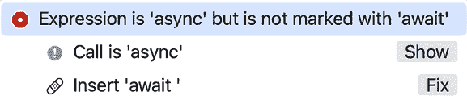

# 第九章：Swift 并发

在 WWDC21 上，Apple 引入了 **Swift 并发**，它为 Swift 5.5 添加了对结构化异步和并行编程的支持。它允许您编写更易读、更易于理解的并发代码。在 WWDC24 上，Apple 引入了 **Swift 6**，它通过在编译时诊断 **数据竞争** 来简化并发编程。

目前，不建议为大型现有项目启用严格并发，因为它可能会生成多个错误和警告。然而，鉴于这是 Apple 的未来方向，您将在本章和本书的 *第三部分* 中为项目启用它，以便您可以学习和获得相关经验。

在本章中，您将学习 Swift 并发的基本概念。接下来，您将检查一个没有并发的应用程序，并探讨其问题。然后，您将使用 `async/await` 在应用程序中实现并发。最后，您将通过使用 `async-let` 使您的应用程序更加高效。

到本章结束时，您将了解 Swift 并发的工作原理以及如何更新您自己的应用程序以使用它。

以下内容将涵盖：

+   理解 Swift 并发

+   检查没有并发功能的 app

+   使用 `async/await` 更新应用程序

+   使用 `async-let` 提高效率

# 技术要求

我们将使用一个示例应用程序，*BreakfastMaker*，来理解 Swift 并发的概念。

本章完成的 Xcode 项目位于本书代码包的 `Chapter09` 文件夹中，您可以通过以下链接下载：

[`github.com/PacktPublishing/iOS-18-Programming-for-Beginners-Ninth-Edition`](https://github.com/PacktPublishing/iOS-18-Programming-for-Beginners-Ninth-Edition)

查看以下视频以查看代码的实际运行情况：

[`youtu.be/uEckcWHFeiE`](https://youtu.be/uEckcWHFeiE%0D)

让我们从学习下一节中的 Swift 并发开始。

# 理解 Swift 并发

在 Swift 5.5 中，Apple 添加了对以结构化方式编写 **异步** 和 **并行** 代码的支持。

异步代码允许您的应用程序暂停和恢复代码。并行代码允许您的应用程序同时运行多个代码片段。这使得您的应用程序能够在执行如从互联网下载数据等操作的同时更新用户界面。

您可以在 WWDC21 期间找到所有 Apple 的 Swift 并发视频链接，请访问 [`developer.apple.com/news/?id=2o3euotz`](https://developer.apple.com/news/?id=2o3euotz)。

您可以在 [`developer.apple.com/news/?id=2o3euotz`](https://developer.apple.com/news/?id=2o3euotz) 阅读 Apple 的 Swift 并发文档。

在 WWDC24 上，Apple 发布了 Swift 6。使用 Swift 6 语言模式，编译器现在可以保证并发程序没有数据竞争。这意味着你的应用程序的一部分代码不能再访问另一部分代码正在修改的同一内存区域。然而，当你创建一个新的 Xcode 项目时，它默认使用 Swift 5 语言模式，你必须打开 Swift 6 语言模式才能启用此功能。

要查看 Apple 的 WWDC24 视频关于将你的应用程序迁移到 Swift 6，请点击此链接：[`developer.apple.com/videos/play/wwdc2024/10169/`](https://developer.apple.com/videos/play/wwdc2024/10169/%0D)

要查看 Apple 关于将你的应用程序迁移到 Swift 6 的文档，请点击此链接：[`www.swift.org/migration/documentation/migrationguide/`](https://www.swift.org/migration/documentation/migrationguide/)

为了让你了解 Swift 并发的工作方式，想象一下你正在为早餐做水煮蛋和烤面包。这里有一种做法：

1.  将两片面包放入烤面包机中。

1.  等待两分钟，直到面包烤熟。

1.  在平底锅中放入两个鸡蛋，并盖上锅盖。

1.  等待七分钟，直到鸡蛋煮熟。

1.  上菜并享用早餐。

总共需要九分钟。现在，思考一下这个事件序列。你只是盯着烤面包机和平底锅发呆吗？你可能会在面包在烤面包机中，鸡蛋在平底锅中时使用手机。换句话说，你可以在准备烤面包和鸡蛋的同时做其他事情。因此，事件序列更准确地描述如下：

1.  将两片面包放入烤面包机中。

1.  用你的手机计时两分钟，直到面包烤熟。

1.  在一个装有沸水的大平底锅里放两个鸡蛋，并盖上锅盖。

1.  用你的手机计时七分钟，直到鸡蛋煮熟。

1.  上菜并享用早餐。

在这里，你可以看到你与烤面包机和平底锅的交互可以被暂停，然后恢复，这意味着这些操作是异步的。操作仍然需要九分钟，但你在这段时间里可以做其他事情。

还有一个需要考虑的因素。你不需要等到面包烤熟后再把鸡蛋放入平底锅。这意味着你可以修改步骤的顺序如下：

1.  将两片面包放入烤面包机中。

1.  当面包正在烤制时，将两个鸡蛋放入一个装有沸水的大平底锅中，并盖上锅盖。

1.  用你的手机计时七分钟。在这段时间里，面包会烤熟，鸡蛋会煮熟。

1.  上菜并享用早餐。

烤面包和煮鸡蛋现在是并行进行的，这可以为你节省两分钟。太棒了！然而，请注意，你还有更多的事情需要关注。

现在你已经理解了异步和并行操作的概念，让我们在下一节研究没有并发的应用程序存在的问题。

# 检查没有并发的应用程序

你已经看到了异步和并行操作如何帮助你更快地准备早餐，并允许你在做这件事的同时使用手机。现在，让我们看看一个模拟准备早餐过程的示例应用。最初，这个应用没有实现并发，这样你可以看到它对应用的影响。按照以下步骤操作：

1.  如果你还没有这样做，请在此链接下载本书的代码包中的`Chapter09`文件夹：[`github.com/PacktPublishing/iOS-18-Programming-for-Beginners-Eighth-Edition`](https://github.com/PacktPublishing/iOS-18-Programming-for-Beginners-Eighth-Edition)。

1.  打开`Chapter09`文件夹，你会看到两个文件夹，`BreakfastMaker-start`和`BreakfastMaker-complete`。第一个文件夹包含你将在本章中修改的应用，第二个文件夹包含完成的应用。

1.  打开`BreakfastMaker-start`文件夹，然后打开`BreakfastMaker` Xcode 项目。在项目导航器中点击**Main**故事板文件。你应该在**视图控制器场景**中看到四个标签和一个按钮，如图所示：


图 9.1：主故事板文件显示视图控制器场景

应用将显示一个屏幕，显示吐司和鸡蛋的状态，以及上菜和上桌所需的时间。应用还将显示一个按钮，你可以使用它来测试用户界面的响应性。

如果你对其中一些概念不熟悉，不要担心。你将在下一章，即*第十章*，*设置用户界面*中学习如何使用故事板为你的应用构建用户界面。

1.  在项目导航器中点击**ViewController**文件。你应该在编辑器区域看到以下代码：

    ```swift
    import UIKit
    class ViewController: UIViewController {
       @IBOutlet var toastLabel: UILabel!
       @IBOutlet var eggLabel: UILabel!
       @IBOutlet var plateAndServeLabel: UILabel!
       @IBOutlet var elapsedTimeLabel: UILabel!
       override func viewDidAppear(_ animated: Bool) {
          super.viewDidAppear(animated)
          let startTime = Date().timeIntervalSince1970
          toastLabel.text = "Making toast..."
          toastLabel.text = makeToast()
          eggLabel.text = "Boiling eggs..."
          eggLabel.text = boilEggs()
          plateAndServeLabel.text = plateAndServe()
          let endTime = Date().timeIntervalSince1970
          elapsedTimeLabel.text = "Elapsed time is
          \(((endTime - startTime) * 100).rounded()
          / 100) seconds"
       }
       func makeToast() -> String {
          sleep(2)
          return "Toast done"
       }
       func boilEggs() -> String {
          sleep(7)
          return "Eggs done"
       }
       func plateAndServe() -> String {
          return "Plating and serving done"
       }
       @IBAction func testButton(_ sender: UIButton) {
          print("Button tapped")
       }
    } 
    ```

如你所见，这段代码模拟了之前章节中描述的制作早餐的过程。让我们来分解它：

```swift
@IBOutlet var toastLabel: UILabel!
@IBOutlet var eggLabel: UILabel!
@IBOutlet var plateAndServeLabel: UILabel!
@IBOutlet var elapsedTimeLabel: UILabel! 
```

这些输出连接到`Main`故事板文件中的四个标签。当你运行应用时，这些标签将显示吐司和鸡蛋的状态，上菜和上桌，以及完成过程所需的时间。

```swift
override  func viewDidAppear(_ animated: Bool) { 
```

这个方法在视图控制器的视图出现在屏幕上时被调用。

```swift
let startTime = Date().timeIntervalSince1970 
```

这个语句将 startTime 设置为当前时间，这样应用就可以稍后计算制作餐点所需的时间。

```swift
toastLabel.text = "Making toast..." 
```

这个语句使得 toastLabel 显示文本“制作吐司....”

```swift
toastLabel.text = makeToast() 
```

这个语句调用了 makeToast()方法，该方法等待两秒钟来模拟制作吐司所需的时间，然后返回文本“吐司完成”，该文本将由 toastLabel 显示。

```swift
eggLabel.text = "Boiling eggs..." 
```

这个语句使得 eggLabel 显示文本“正在煮鸡蛋....”

```swift
eggLabel.text = boilEggs() 
```

这个语句调用了 boilEggs()方法，该方法等待七秒钟来模拟煮两个鸡蛋所需的时间，然后返回文本“鸡蛋完成”，该文本将由 eggLabel 显示。

```swift
plateAndServeLabel.text = plateAndServe() 
```

这个语句调用了 plateAndServe()方法，该方法返回文本“上菜和上桌完成”，该文本将由`plateAndServeLabel`显示。

```swift
let endTime = Date().timeIntervalSince1970 
```

此语句将`endTime`设置为当前时间。

```swift
elapsedTimeLabel.text = "Elapsed time is
\(((endTime - startTime) * 100).rounded()
/ 100) seconds" 
```

该语句计算经过的时间（大约八秒），这将通过`elapsedTimeLabel`显示。

```swift
@IBAction func testButton(_ sender: UIButton) {
   print("Button tapped")
} 
```

此方法每次屏幕上的按钮被点击时，在调试区域显示**按钮点击**。

构建并运行应用，并在用户界面出现时立即点击按钮：


图 9.2：iOS 模拟器运行 BreakfastMaker 应用，显示要点击的按钮

您应该注意到以下问题：

+   初始时点击按钮没有效果，您只能在约九秒后在调试区域看到**按钮点击**。

+   **制作吐司...** 和 **煮鸡蛋...** 从不显示，而**吐司完成**和**鸡蛋完成**仅在约九秒后出现。

这种情况发生的原因是，当`makeToast()`和`boilEggs()`方法运行时，您的应用代码没有更新用户界面。您的应用确实注册了按钮点击，但在`makeToast()`和`boilEggs()`完成执行后，才能够处理这些点击并更新标签。这些问题不会为您的应用提供良好的用户体验。

您现在已经体验了没有实现并发的应用所呈现的问题。在下一节中，您将使用`async/await`修改应用，使其可以在`makeToast()`和`boilEggs()`方法运行时更新用户界面。

# 使用 async/await 更新应用

如您之前所见，当`makeToast()`和`poachEgg()`方法运行时，应用无响应。为了解决这个问题，您将在应用中使用 async/await。

在方法声明中写入`async`关键字表示该方法是非同步的。这看起来是这样的：

```swift
func methodName() async -> returnType { 
```

在方法调用前写入`await`关键字标记了一个可能挂起执行的点，从而允许其他操作运行。这看起来是这样的：

```swift
await methodName() 
```

您可以观看 Apple 的 WWDC21 视频，讨论 async/await，链接为[`developer.apple.com/videos/play/wwdc2021/10132/`](https://developer.apple.com/videos/play/wwdc2021/10132/)。

您将修改您的应用以使用 async/await。这将使其能够挂起`makeToast()`和`poachEgg()`方法以处理按钮点击，更新用户界面，然后之后继续执行这两个方法。您还将通过开启 Swift 6 语言模式来为您的应用启用严格的并发检查。请按照以下步骤操作：

1.  在项目导航器中，点击顶部的**BreakfastMaker**图标，然后点击**BreakfastMaker**目标。在**构建设置**选项卡中，将**Swift 语言版本**更改为**Swift 6**：


图 9.3：BreakfastMaker 项目，Swift 语言版本设置为 Swift 6

这使得对您的应用进行严格的并发检查成为可能。

1.  在项目导航器中点击**ViewController**文件。修改`makeToast()`和`boilEggs()`方法，如下所示，以使它们体内的代码异步：

    ```swift
    func makeToast() -> String {
       **try?****await****Task****.sleep(for: .seconds(2))**
       return "Toast done"
    }
    func boilEggs() -> String {
       **try?****await****Task****.sleep(for: .seconds(7))**
       return "Eggs done"
    } 
    ```

`Task`代表异步工作的一个单元。它有一个静态方法`sleep(for:)`，该方法可以暂停执行指定的时间长度，以秒为单位。由于这个方法是一个抛出异常的方法，你将使用`try?`关键字来调用它，而不需要实现`do-catch`块。`await`关键字表示此代码可以被挂起，以允许其他代码运行。

使用`try?`将导致任何错误被抑制或忽略。在这种情况下这是可以接受的，因为睡眠 2 秒或 7 秒不太可能产生错误。在其他情况下，这可能不可接受，在这些情况下，`do-catch`块是一个更好的解决方案。你可能需要重新阅读*第八章*，*协议、扩展和错误处理*，以获取有关如何实现`do-catch`块的信息。

1.  `makeToast()`和`boilEggs()`都会出现错误。点击任一错误图标以显示错误信息：


图 9.4：点击错误图标时的错误信息

错误显示出来是因为你在不支持并发的方法中调用异步方法。你需要将`async`关键字添加到方法声明中，以表明它是异步的。

1.  对于每个方法，点击**修复**按钮以将`async`关键字添加到方法声明中。

1.  确认你完成后的代码如下所示：

    ```swift
    func makeToast() **async** -> String {
       try? await Task.sleep(for: .seconds(2))
       return "Toast done"
    }
    func boilEggs() **async** -> String {
       try? await Task.sleep(for: .seconds(2))
       return "Eggs done"
    } 
    ```

1.  `makeToast()`和`poachEgg()`方法中的错误应该已经消失，但在`viewDidAppear()`方法中会出现新的错误。点击其中一个错误图标以查看错误信息，该信息将与你在*步骤 2*中看到的相同。这是因为你在不支持并发的方法中调用异步方法。

1.  点击**修复**按钮，将出现更多错误。

1.  目前忽略方法声明中的错误，并点击`makeToast()`方法调用旁边的错误以查看错误信息：



图 9.5：点击错误图标时的错误信息

这个错误信息显示出来是因为你在调用异步函数时没有使用`await`。

1.  点击**修复**按钮以在方法调用之前插入`await`关键字。

1.  对于`boilEggs()`方法调用旁边的错误，重复*步骤 7*和*步骤 8*。`await`关键字也将被插入到`boilEggs()`方法调用中。

1.  点击`viewDidAppear()`方法声明中的错误图标以查看错误信息：


图 9.6：错误图标被突出显示的错误

这个错误显示出来是因为你不能使用`async`关键字使`viewDidAppear()`方法异步，因为这个功能在超类中不存在。

1.  要解决这个问题，你需要移除`async`关键字，并将`super.viewDidAppear()`之后的全部代码放在一个`Task`块中，这将允许它在同步方法中异步执行。按照以下方式修改你的代码：

    ```swift
    override  func viewDidAppear(_ animated: Bool) {
       super.viewDidAppear(animated)
       **Task** **{**
          let startTime = Date().timeIntervalSince1970
          toastLabel.text = "Making toast..."
          toastLabel.text = await makeToast()
          eggLabel.text = "Boiling eggs..."
          eggLabel.text = await boilEggs()
          plateAndServeLabel.text = plateAndServe()
          let endTime = Date().timeIntervalSince1970
          elapsedTimeLabel.text = "Elapsed time is
          \(((endTime - startTime) * 100).rounded()
          / 100) seconds"
       **}**
    } 
    ```

构建并运行应用，一旦看到用户界面就立即点击按钮。注意，**按钮已点击**现在会立即显示在调试区域，标签也会相应更新。这是因为应用现在能够挂起`makeToast()`和`boilEggs()`方法以响应用户点击，更新用户界面，并在稍后恢复方法执行。太棒了！

然而，如果你查看经过的时间，你会发现应用准备早餐的时间比之前稍微长了一些：


图 9.7：iOS 模拟器运行 BreakfastMaker 应用，显示经过的时间

这部分原因是异步/等待挂起和恢复方法所需的额外处理，但还有一个因素在起作用。尽管`makeToast()`和`boilEggs()`方法现在是异步的，但`boilEggs()`方法只有在`makeToast()`方法执行完毕后才开始执行。在下一节中，你将看到如何使用`async-let`来并行运行`makeToast()`和`boilEggs()`方法。

# 使用 async-let 提高效率

尽管你的应用现在对按钮点击有响应，并且可以在`makeToast()`和`boilEggs()`方法运行时更新用户界面，但这两个方法仍然按顺序执行。这里的解决方案是使用`async-let`。

在定义常量时在`let`语句前写上`async`，然后在访问常量时写上`await`，允许异步方法的并行执行，如下所示：

```swift
async let temporaryConstant1 = methodName1()
async let temporaryConstant2 = methodName2()
await variable1 = temporaryConstant1
await variable2 = temporaryConstant1 
```

在这个例子中，`methodName1()`和`methodName2()`将并行运行。

你将修改你的应用以使用`async-let`来使`makeToast()`和`poachEgg()`方法并行运行。在`ViewController`文件中，按照以下方式修改`Task`块中的代码：

```swift
Task {
   let startTime = Date().timeIntervalSince1970
   toastLabel.text = "Making toast..."
**async****let** **tempToast** **=****makeToast****()**
   eggLabel.text = "Boiling eggs..."
**async****let** **tempEggs** **=****boilEggs****()**
**await****toastLabel****.****text****=** **tempToast**
**await****eggLabel****.****text****=** **tempEggs**
   plateAndServeLabel.text = plateAndServe()
   let endTime = Date().timeIntervalSince1970
   elapsedTimeLabel.text = "Elapsed time is
   \(((endTime - startTime) * 100).rounded()
   / 100) seconds"
} 
```

构建并运行应用。你会发现经过的时间现在比之前短：


图 9.8：iOS 模拟器运行 BreakfastMaker 应用，显示经过的时间

这是因为使用`async-let`允许`makeToast()`和`poachEgg()`方法并行运行，并且`poachEgg()`方法不再等待`makeToast()`方法完成后再开始执行。酷！

关于 Swift 并发还有很多东西要学习，比如结构化并发和 actors，但这超出了本章的范围。你可以在[`developer.apple.com/videos/play/wwdc2021/10134/`](https://developer.apple.com/videos/play/wwdc2021/10134/)了解更多关于结构化并发的信息，你可以在[`developer.apple.com/videos/play/wwdc2021/10133/`](https://developer.apple.com/videos/play/wwdc2021/10133/)了解更多关于 actors 的信息。

你已经在你的应用中成功实现了异步代码。太棒了！关于 Swift 并发还有很多东西要学习，比如结构化并发和 actors，但这超出了本章的范围。

给自己鼓掌吧；你已经完成了这本书的第一部分！

# 摘要

在本章中，您了解了 Swift 并发及其在*BreakfastMaker*应用程序中的实现方法。

您从学习 Swift 并发的基本概念开始。然后，您检查了一个没有并发的应用程序，并探讨了它的问题。之后，您开启了严格的并发检查，并在应用程序中实现了并发，使用了`async`/`await`。最后，您通过使用`async let`使您的应用程序更加高效。

您现在已经了解了 Swift 并发的基础知识，并将能够在自己的应用程序中使用`async`/`await`和`async-let`。

在下一章中，您将通过创建它的屏幕，使用故事板来编写您的第一个 iOS 应用程序，这允许您在不输入大量代码的情况下快速原型化应用程序。

# 留下您的评价！

感谢您从 Packt Publishing 购买此书——我们希望您喜欢它！您的反馈对我们来说无价，它帮助我们改进和成长。一旦您阅读完毕，请花一点时间在亚马逊上留下评价；这只需一分钟，但对像您这样的读者来说意义重大。扫描下面的二维码或访问链接，以获得您选择的免费电子书。

[`packt.link/NzOWQ`](https://packt.link/NzOWQ%0D)


