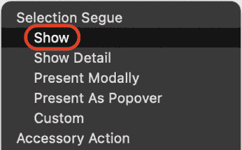

# 完成用户界面

在上一章中，你配置了期刊列表屏幕以显示表格视图中的 10 个空表格视图单元格，向导航栏中添加了一个条形按钮项以模态方式呈现表示添加新期刊条目屏幕的视图，并添加了**取消**和**保存**按钮。

在本章中，你将添加*第十章*中应用程序之旅中显示的剩余屏幕。你将添加期刊条目详情屏幕，当在期刊列表屏幕中轻按表格视图单元格时将显示此屏幕。你将配置此屏幕以显示具有固定数量表格视图单元格的表格视图。你还将使地图屏幕显示地图。

到本章结束时，你将学会如何将具有固定单元格数的表格视图添加到故事板场景中，如何实现当在期刊列表屏幕中轻按单元格时显示屏幕的 segue，以及如何将地图视图添加到场景中。你的应用程序的基本用户界面将完整，你将能够在模拟器中遍历所有屏幕。所有屏幕都不会显示数据，但你将在本书的**第三部分**中完成它们的实现。

本章将涵盖以下主题：

+   实现期刊条目详情屏幕

+   将地图视图添加到地图屏幕

# 技术要求

你将继续在上一章中创建的`JRNL`项目中工作。

本章的完成 Xcode 项目位于本书代码包的`Chapter12`文件夹中，可以在此处下载：

[`github.com/PacktPublishing/iOS-18-Programming-for-Beginners-Ninth-Edition`](https://github.com/PacktPublishing/iOS-18-Programming-for-Beginners-Ninth-Edition%0D)

查看以下视频以查看代码的实际效果：

[`youtu.be/TFaELYrzyxY`](https://youtu.be/TFaELYrzyxY%0D)

首先，你将向故事板添加一个新的表格视图控制器场景来表示期刊条目详情屏幕。当在期刊列表屏幕中轻按单元格时，将显示此屏幕。你将在下一节中这样做。

# 实现期刊条目详情屏幕

如*第十章*中应用程序之旅所示，在*设置用户界面*时，当你轻按期刊列表屏幕中的期刊条目时，将出现包含该期刊条目详细信息的期刊条目详情屏幕。在本节中，你将在故事板中添加一个新的表格视图控制器场景来表示期刊条目详情屏幕。请按照以下步骤操作：

1.  在项目导航器中单击**主**故事板文件，然后单击**库**按钮。

1.  在过滤器字段中输入`table`，并将**表格视图控制器**对象拖动到故事板中**地图**场景旁边：

图 12.1：显示表格视图控制器对象的库

这将代表期刊条目详情屏幕。

1.  验证是否已添加**表格视图控制器**场景：

图 12.2：编辑区域显示地图场景旁边的表格视图控制器场景

注意，它已经包含了一个表格视图，因此您不需要在场景中添加表格视图，就像您在上一章中所做的那样。

1.  要在期刊列表屏幕中的表格视图单元格被点击时显示期刊条目详情屏幕，请从**期刊场景**下的**文档大纲**中的**journalCell**（在**journalCell**中）拖动到**表格视图控制器**场景，以在它们之间添加导航：

图 12.3：显示期刊单元的文档大纲

1.  在弹出菜单中，在**选择导航**下选择**显示**：

图 12.4：弹出菜单中已选择显示

这样，当期刊列表屏幕中的单元格被点击时，期刊条目详情屏幕将从右侧滑入。

1.  验证两个场景之间是否出现了导航：

图 12.5：编辑区域显示期刊场景和表格视图控制器场景之间的导航

您可以在故事板中重新排列场景，以便更容易看到导航。

1.  期刊条目详情屏幕将始终显示固定数量的单元格。在文档大纲中，点击**表格视图控制器场景**下的**表格视图**：

图 12.6：在文档大纲中选中表格视图

1.  点击属性检查器按钮，将**内容**设置为**静态单元格**，以便使期刊条目详情屏幕显示固定数量的单元格。

图 12.7：内容设置为静态单元格的属性检查器

1.  构建并运行您的应用程序。在期刊列表屏幕中点击一个单元格以显示期刊条目详情屏幕：

图 12.8：模拟器显示期刊条目详情屏幕

1.  点击**< 期刊**按钮返回到期刊列表屏幕。

您已成功实现了期刊条目详情屏幕！太棒了！

如果您的应用程序需要在列表中显示项目的详细信息，可以使用此方法。例如，这是您 iPhone 上的**联系人**应用程序和**设置**应用程序的示例。

在下一节中，您将使地图屏幕显示地图。

# 实现地图屏幕

当您启动应用程序时，将显示期刊列表屏幕。在标签栏中轻触地图按钮将使地图屏幕出现，但它为空。要使地图屏幕显示地图，您需要在地图屏幕的视图控制器场景中添加一个地图视图。按照以下步骤操作：

1.  在编辑区域中选择地图屏幕的视图控制器场景，这将展开文档大纲中的相应**地图场景**：

图 12.9：编辑区域显示地图场景的视图控制器场景

1.  要使此场景显示地图，请点击库按钮，并在过滤器字段中输入`map`。一个**地图工具包视图**对象作为结果之一出现。将其拖动到视图控制器场景中的视图中：

图 12.10：选中地图工具包视图对象的库

1.  要使地图视图填充整个屏幕，请确认它已被选中，然后点击添加新约束按钮：

图 12.11：已选择地图视图的视图控制器场景

1.  在所有**最近邻居间距**字段中输入`0`，并确保选择了浅红色支撑（它们将变为鲜红色）。点击**添加 4 个约束**按钮：

图 12.12：自动布局添加新约束弹出对话框

1.  确认地图视图填充了整个屏幕：

图 12.13：地图视图填充屏幕的视图控制器场景

1.  构建并运行你的应用。点击**地图**按钮。你应该看到与这里显示的类似地图：

图 12.14：模拟器显示地图屏幕

1.  确认所有为`JRNL`应用所需的屏幕已在**主**故事板文件中创建：

图 12.15：编辑区域显示 Main.storyboard 中的所有场景

1.  确认当你在模拟器中运行你的应用时，所有屏幕都显示得如预期。

太棒了！你现在已经完成了应用的基本用户界面！

# 摘要

在本章中，你完成了应用的基本结构。你为表示日记条目详情屏幕添加了一个新的表格视图控制器场景，为该屏幕配置了一个静态单元格的表格视图，并实现了当在日记列表屏幕中点击单元格时将显示此屏幕的转场。你还为地图屏幕的视图控制器场景添加了地图视图，当点击**地图**按钮时，它现在会显示地图。

你已成功实现了应用所需的全部屏幕，当你运行模拟器中的应用时，你将能够测试应用流程。你也应该更加熟练地使用 Interface Builder。熟悉从库中使用和定位对象对于你构建自己的应用的用户界面将至关重要。

在下一章中，你将修改日记列表屏幕、添加新日记条目屏幕和日记条目详情屏幕上的单元格，以便它们与在应用游览中显示的设计相匹配。

# 加入我们的 Discord！

与其他用户、专家以及作者本人一起阅读这本书。提出问题，为其他读者提供解决方案，通过 Ask Me Anything 会话与作者聊天，等等。扫描二维码或访问链接加入社区。

[`packt.link/ios-Swift`](https://packt.link/ios-Swift%0D)

