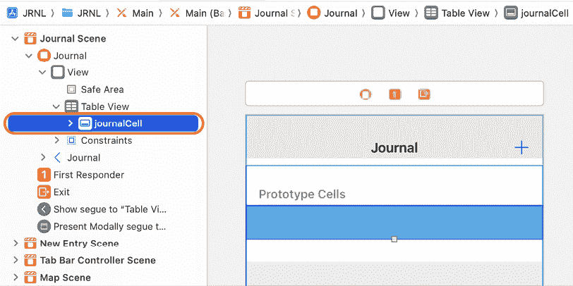
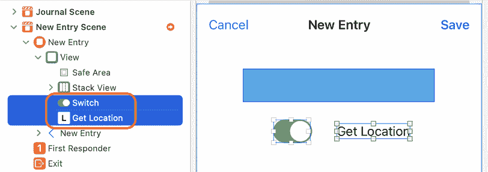
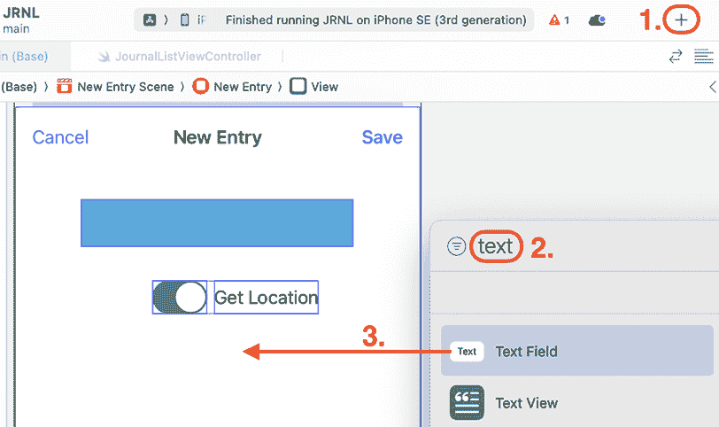
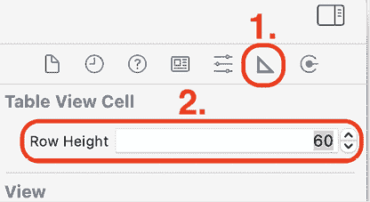

# 13

# 修改应用程序屏幕

在*第十一章*，*构建你的用户界面*中，你添加了一些应用程序所需屏幕，以匹配应用程序浏览中显示的内容。在*第十二章*，*完成你的用户界面*中，你添加了应用程序所需的其他屏幕。现在，当你运行模拟器中的应用程序时，你将能够导航到应用程序的所有屏幕，但屏幕仍然缺少数据输入和数据显示所需的用户界面元素。

在本章中，你将向期刊列表、添加新期刊条目和期刊条目详情屏幕添加和配置缺失的用户界面元素，以匹配应用程序浏览中的设计。

对于期刊列表屏幕，你需要通过向其中添加一个图像视图和两个标签来修改`journalCell`表格视图单元格，以便它可以显示期刊条目的照片、日期和标题。对于添加新期刊条目屏幕，你需要通过添加自定义视图、开关、文本字段、文本视图和图像视图来修改它，以便你可以输入新期刊条目的详细信息。你还需要配置图像视图以显示默认图像。对于期刊条目详情屏幕，你需要在其中添加文本视图、标签和图像视图，并配置图像视图以显示默认图像，以便屏幕可以显示现有期刊条目的详细信息。在所有用户界面元素就位后，你的应用程序将准备好进行代码实现，这些代码将在本书的*第三部分*中实现。

到本章结束时，你将更加熟练地添加和定位用户界面元素，并将获得更多使用约束来确定它们相对位置的经验。这将有助于确保与不同屏幕尺寸和方向的兼容性，使你能够轻松地原型化应用程序的外观和流程。

本章将涵盖以下主题：

+   修改期刊列表屏幕

+   修改添加新期刊条目屏幕

+   修改期刊条目详情屏幕

# 技术要求

你将继续在上一章中修改的`JRNL`项目中工作。

本章完成的 Xcode 项目位于本书代码包的`Chapter13`文件夹中，可以通过以下链接下载：

[`github.com/PacktPublishing/iOS-17-Programming-for-Beginners-Eighth-Edition`](https://github.com/PacktPublishing/iOS-17-Programming-for-Beginners-Eighth-Edition%0D)

查看以下视频以查看代码的实际效果：

[`youtu.be/tgo2dT1LZeM`](https://youtu.be/tgo2dT1LZeM%0D)

让我们从修改期刊列表屏幕上的`journalCell`表格视图单元格开始。在下一节中，你将添加一些用户界面元素，使其与应用程序浏览中显示的表格视图单元格相匹配。

# 修改期刊列表屏幕

让我们看看应用程序浏览中期刊列表屏幕的样子：

图 13.1：完成的 JRNL 应用程序的期刊列表屏幕

如您所见，日记列表屏幕上的表视图单元格有一个照片、一个日期和一个日记条目标题。在 *第十一章*，*构建您的用户界面* 中，您为 `journalCell` 表视图单元格设置了青色背景，并配置了表视图以显示 10 个单元格的列。现在您将移除背景颜色，并将用户界面元素添加到 `journalCell` 表视图单元格中，以匹配应用导览中的设计。您将从下一节开始向其中添加图像视图。

## 添加到 journalCell 的图像视图

图像视图是 `UIImageView` 类的一个实例。它可以在您的应用中显示单个图像或一系列动画图像。要将图像视图添加到 `journalCell` 表视图单元格中，请按照以下步骤操作：

1.  为了在将用户界面元素添加到故事板时更容易看到它们，从 **编辑器** 菜单中选择 **画布** | **边界矩形**：

图 13.2：选择 Canvas | Bounds Rectangles 的编辑器菜单

这将应用一个薄薄的蓝色轮廓到故事板中的用户界面元素。

1.  在项目导航器中点击 **主故事板文件**。在第一个 **日记场景** 下，在文档大纲中选择 **journalCell**：

图 13.3：显示 journalCell 的文档大纲

1.  在添加图像视图之前，您需要移除之前设置的背景颜色。在属性检查器中，在 **视图** 下，将 **背景** 设置为 **默认**：

图 13.4：journalCell 的属性检查器设置

1.  要将图像视图添加到表视图单元格中，点击 **库** 按钮。在过滤器字段中输入 `imag`。一个 **图像视图** 对象将出现在结果中。将其拖动到原型单元格中：

图 13.5：添加了图像视图的原型单元格

1.  为了确保新添加的图像视图的约束可以正确设置，请验证它是否是 **journalCell** 表视图单元格的 **内容视图** 的子视图，并且已被选中：

图 13.6：选择 Image View 对象的文档大纲

1.  点击 **添加新约束** 按钮，并输入以下值以设置新添加的图像视图的约束：

    +   顶部：`0`

    +   左侧：`0`

    +   底部：`0`

    +   宽度：`90`

    +   高度：`90`

完成后，点击 **添加 5 个约束** 按钮。

图 13.7：添加新约束对话框

这将图像视图的顶部、左侧和底部边缘绑定到 `journalCell` 表视图单元格的相应边缘，并将其宽度和高度设置为 `90` 点。它还隐式地将表视图单元格的高度设置为 `90` 点。

1.  在属性检查器中，在 **图像视图** 下，将 **图像** 设置为 `face.smiling`：

图 13.8：将 Image 设置为 face.smiling 的图像视图

您已成功将图像视图添加到表视图单元格中，设置了其默认图像，并应用了约束以确定其相对于封装视图的位置。太酷了！

在下一节中，您将添加用于显示日记条目日期和标题的用户界面元素。

## 向 journalCell 添加标签

您将使用标签在 `journalCell` 表视图单元格中显示日期和日记条目标题。标签是 `UILabel` 类的实例。它可以在您的应用中显示一行或多行文本。

要向 `journalCell` 表视图单元格添加标签，请按照以下步骤操作：

1.  首先，您将添加一个标签来显示日期。点击库按钮，并将一个 **标签** 对象拖动到您刚刚添加的图像视图和原型单元格右侧之间的空间：

图 13.9: 选择标签对象的库

注意，**标签** 出现在文档大纲中，并且是 **journalCell** 表视图单元格的 **内容视图** 的子视图。

1.  在属性检查器中，在 **标签** 下，使用 **字体** 菜单将 **字体** 设置为 **标题 1**：

图 13.10: 标签属性检查器

1.  点击 **添加新约束** 按钮，并输入以下值以设置标签的约束：

    +   顶部: `0`

    +   左侧: `8`

    +   右侧: `0`

**约束到边距** 应已选中，这会将标准边距 `8` 点设置为标签顶部和右侧以及表格视图单元格顶部和右侧之间的空间。完成时，点击 **添加 3 个约束** 按钮。

1.  验证标签的位置是否如图下截图所示，以及新添加的约束是否在文档大纲中：

图 13.11: 应用了约束的标签

标签顶部边缘与 `journalCell` 内容视图顶部边缘之间的空间设置为 `0 + 8` 点。标签左侧边缘与图像视图右侧边缘之间的空间为 `8` 点。标签右侧边缘与 `journalCell` 内容视图右侧边缘之间的空间为 `0 + 8` 点。标签底部边缘的位置由您之前设置的文本样式自动设置。

接下来，您将添加一个标签来显示日记条目标题。按照以下步骤操作：

1.  点击库按钮，并将一个 **标签** 对象拖动到您刚刚添加的标签和原型单元格底部的空间之间：

图 13.12: 选择标签对象的库

注意，**标签** 出现在文档大纲中，并且是 **journalCell** 表视图单元格的 **内容视图** 的子视图。

1.  在属性检查器中，在 **标签** 下，使用 **字体** 菜单将 **字体** 设置为 **正文**，并将 **线条** 设置为 `2`：

图 13.13: 标签属性检查器

将 **线条** 设置为 `2` 将使标签在应用运行时显示最多两行文本。

1.  点击 **添加新约束** 按钮，并输入以下值以设置标签的约束：

    +   顶部: `0`

    +   左侧: `8`

    +   右侧: `0`

**约束到边距**应该已经勾选，这会将标准边距`8`点设置为标签右侧和表格视图单元格右侧之间的空间。完成时，点击**添加 3 个约束**按钮。

1.  确认标签的位置如图下截图所示，并且新添加的约束在文档轮廓中：

图 13.14：应用约束的标签

标签顶部边缘和之前添加的标签底部边缘之间的空间设置为`0`点。标签左侧边缘和图像视图右侧边缘之间的空间是`8`点。标签右侧边缘和`journalCell`内容视图右侧边缘之间的空间是`0 + 8`点。标签底部边缘的位置由你之前设置的文本样式和行数自动设置。

你可以在文档轮廓中点击一个约束，并在大小检查器中修改它。

1.  构建并运行你的应用：

图 13.15：模拟器显示的完成后的 journalCell 表格视图单元格

你已成功添加并配置了标签以显示`journalCell`表格视图单元格的日期和日记条目标题，并且已添加所有必要的约束。正如你所见，日记列表屏幕现在具有在应用浏览中显示数据所需的所有用户界面元素。太棒了！

在下一节中，你将在“添加新日记条目”屏幕中添加包含用户界面元素的堆叠视图。

# 修改“添加新日记条目”屏幕

让我们看看在应用浏览中“添加新日记条目”屏幕看起来是什么样子：

图 13.16：完成后的日记应用“添加新日记条目”屏幕

苹果提供了一整套用户界面元素库，你可以在自己的应用中使用。这有助于使所有 iOS 应用具有一致的外观和感觉。正如你所见，添加新日记条目屏幕具有以下元素：

+   一个显示星级评分的自定义视图

+   一个开关，允许你获取当前位置

+   一个用于日记条目标题的文本字段

+   一个用于日记条目主体的文本视图

+   一个用于用手机相机拍照的图片视图

现在，你将修改屏幕以匹配应用浏览中的设计，从下一节开始，通过添加一个允许用户设置星级评分的自定义视图。

## 将自定义视图添加到新条目场景

正如你在应用浏览中所见，添加新日记条目屏幕有一个显示星级评分的自定义视图。这个自定义视图是水平堆叠视图的子类。你将在本章中添加水平堆叠视图，并在*第十九章*，*开始使用自定义视图*中完成自定义视图的实现。

栈视图是`UIStackView`类的一个实例。它允许你轻松地在一列或一行中排列一组视图。要将栈视图添加到“添加新日志条目”屏幕，请按照以下步骤操作：

1.  在**主**故事板文件中，点击文档大纲中的**新条目场景**：

图 13.17：编辑区域显示新条目场景

1.  要向场景添加水平栈视图，请点击库按钮。在过滤器字段中输入`hori`。一个**水平栈视图**对象将出现在结果中。将其拖动到**新条目**场景的视图中：

图 13.18：选择水平栈视图对象的库

注意，你刚刚添加的栈视图出现在文档大纲中，并且是**新条目场景**视图的子视图。

1.  点击属性检查器。在**栈视图**下，如果尚未设置，将**间距**设置为`8`，在**视图**下，将**背景**设置为**系统青色**：

图 13.19：属性检查器显示间距和背景设置

**间距**值决定了栈视图中元素之间的间距。

1.  点击**大小检查器**。在**视图**下，将**宽度**设置为`252`，将**高度**设置为`44`：

图 13.20：大小检查器显示栈视图的大小

显示星级评分的自定义视图将包含五个按钮。每个按钮的高度为`44`点，宽度为`44`点，按钮之间的间距为`8`点。自定义视图的总宽度将是`5 x 44 + 4 x 8`，总宽度为`252`点。

1.  点击**添加新约束**按钮，并输入以下值以设置栈视图的约束：

    +   宽度：`252`

    +   高度：`44`

完成后，点击**添加 2 个约束**按钮。

在大小检查器中设置 UI 元素的尺寸，使你稍后添加约束更容易，因为预期的值已经设置在**添加新约束**对话框中。

1.  你会看到栈视图被红色勾勒出来。点击文档大纲中的小红粉箭头。

图 13.21：文档大纲中的箭头

1.  你将在文档大纲中看到两个**缺少约束**错误：

图 13.22：显示缺少约束错误的错误信息

由于缺少约束错误，栈视图被红色勾勒出来。这意味着栈视图相对于其封装视图的位置目前是不明确的。你将在稍后将其嵌入另一个栈视图时修复这个问题。

1.  点击**< 结构**按钮返回。

你已成功将水平栈视图添加到**新条目**场景。在下一节中，你将向其中添加一个 UI 元素，允许你获取当前位置。

## 向新条目场景添加开关

如应用程序导游所示，在创建新日记条目时，您可以通过切换开关来获取您的当前位置。开关是`UISwitch`类的实例。它显示一个提供二元选择的控件，例如开/关。您还将添加一个标签来描述开关的功能，并将这两个对象放入水平堆叠视图中。

按照以下步骤操作：

1.  要将开关添加到**新条目**场景，单击库按钮。在过滤器字段中输入`swi`。结果中会出现一个**开关**对象。将其拖动到水平堆叠视图下的**新条目**场景视图：

图 13.23：选择开关对象的库

注意，您刚刚添加的开关出现在文档大纲中，并且是**新条目场景**视图的子视图。

1.  要在开关旁边添加标签，从库中拖动一个**标签**对象并将其放置在开关旁边：

图 13.24：选择标签对象的库

注意，您刚刚添加的标签出现在文档大纲中，并且也是**新条目**场景视图的子视图。

将出现蓝色线条以帮助您将标签放置在开关的正确距离处。

1.  双击标签并更改标签文本为“获取位置”：

图 13.25：标签文本更改为“获取位置”

1.  您将把标签和开关都嵌入到水平堆叠视图中。在文档大纲中，按住*Shift*键，单击**开关**，然后单击**获取位置**以选择开关和标签：

图 13.26：显示已选择标签和开关的文档大纲

1.  从**编辑器**菜单中选择**嵌入**|**堆叠视图**。

图 13.27：选择“嵌入”|“堆叠视图”的编辑器菜单

开关和标签现在都嵌入在堆叠视图中。

1.  单击属性检查器按钮，在**堆叠视图**下将**间距**设置为`8`：

图 13.28：设置间距为 8 的属性检查器

您已成功将包含开关和标签的水平堆叠视图添加到**新条目**场景。在下一节中，您将向其中添加 UI 元素，以便用户可以输入日记标题和正文。

## 将文本字段和文本视图添加到新条目场景

如应用程序导游所示，用户将使用此屏幕输入日记条目的标题和正文文本。要输入文本，您可以使用文本字段或文本视图。文本字段是`UITextField`类的实例。它显示一个可编辑的文本区域，通常限制为单行。您将使用文本字段输入日记条目的标题。文本视图是`UITextView`类的实例。它也显示一个可编辑的文本区域，但通常显示多行。您将使用文本视图输入日记条目的正文。

要将文本字段和文本视图添加到**新条目**场景，请按照以下步骤操作：

1.  要将文本字段添加到场景中，点击库按钮。在过滤器字段中输入`text`。一个**文本字段**对象将出现在结果中。将其拖动到包含开关和标签的水平堆叠视图下的**新条目**场景视图：

图 13.29：选择文本字段对象的库

注意您刚刚添加的文本字段出现在文档大纲中，并且是**新条目**场景视图的子视图。

1.  在属性检查器中，在**文本字段**下，将**占位符**设置为`Journal Title`：

图 13.30：将占位符设置为期刊标题的属性检查器

1.  要将文本视图添加到场景中，点击库按钮。在过滤器字段中输入`text`。一个**文本视图**对象将出现在结果中。将其拖动到您刚刚添加的文本字段下的**新条目**场景视图：

图 13.31：选择文本字段对象的库

验证您刚刚添加的文本视图是否出现在文档大纲中，并且是**新条目场景**视图的子视图。如果您愿意，也可以更改默认文本。

1.  您将使用约束将文本视图的高度设置为默认值 128 点。选择文本视图后，点击添加新约束按钮并勾选**高度**约束。然后，点击**添加 1 个约束**按钮。文本视图现在将看起来像以下截图：

图 13.32：应用了约束的文本视图

注意文本视图周围的红色轮廓，因为它相对于封装视图的位置不明确。现在不用担心，因为您稍后会修复它。

您已成功将文本字段和文本视图添加到新条目场景。在下一节中，您将添加一个 UI 元素，允许用户在其中拍照并显示。

## 向新条目场景添加图像视图

如应用导览所示，用户可以使用设备相机为日记条目拍照。选定的照片将使用图像视图在添加新日记条目屏幕上显示。在*第十一章*，*构建您的用户界面*中，您已将图像视图添加到`journalCell`表格视图单元格。现在，您将向新条目场景添加图像视图。按照以下步骤操作：

1.  要将图像视图添加到场景中，点击库按钮。在过滤器字段中输入`imag`。一个**图像视图**对象将出现在结果中。将其拖动到文本视图下的**新条目**场景视图：

图 13.33：选择图像视图对象的库

注意您刚刚添加的图像视图出现在文档大纲中，并且是**新条目场景**视图的子视图。

1.  点击大小检查器按钮。在**视图**下，将**宽度**和**高度**都设置为`200`。

1.  点击属性检查器按钮。在**图像视图**下，将**图像**设置为`face.smiling`。

1.  你将使用约束来设置图像视图的宽度和高度。点击 **添加新约束** 按钮，勾选 **宽度** 和 **高度** 约束（它们的值应已设置为 `200`）。之后，点击 **添加 2 个约束** 按钮。图像视图现在将看起来像以下截图：

图 13.34：应用约束的图像视图

注意图像视图周围的红色轮廓，因为它相对于包含视图的位置是不明确的。现在不用担心，因为稍后你会修复它。

新条目场景的所有用户界面元素都已添加。在下一节中，你将把它们全部嵌入到垂直堆叠视图中以解决定位问题。

## 在堆叠视图中嵌入用户界面元素

**新条目** 场现在拥有了所有必需的用户界面元素，但元素相对于包含视图的位置是不明确的。你将把所有元素嵌入到垂直堆叠视图中，并使用约束来解决定位问题。按照以下步骤操作：

1.  在文档大纲中，选择你之前添加的所有用户界面元素，如图所示：

图 13.35：显示所选元素的文档大纲

1.  从 **编辑器** 菜单中选择 **嵌入** | **堆叠视图**。

1.  在文档大纲中选择 **堆叠视图**。在属性检查器中，在 **堆叠视图** 下，将 **对齐** 设置为 **居中**，并将 **间距** 设置为 `8`。

1.  选择堆叠视图后，点击添加新约束按钮。输入以下值以设置堆叠视图的约束：

    +   顶部：`20`

    +   左侧：`20`

    +   右侧：`20`

**约束到边距** 应已勾选，这设置了标准的 `8` 点边距。完成后，点击 **添加 3 个约束** 按钮。堆叠视图现在将看起来像以下截图：

图 13.36：应用约束后的堆叠视图

注意所有红色线条都已消失。堆叠视图与包含视图顶部、右侧和左侧边缘之间的空间已设置为 `20 + 8` 点。堆叠视图底部边缘的位置将自动由它包含的所有元素的高度推导出来。

1.  你会看到文本字段没有扩展到堆叠视图的全宽。为了修复这个问题，在文档大纲中选择 **日记标题**，然后点击添加新约束按钮。将右侧约束设置为 `8`，然后点击 **添加 1 个约束** 按钮。文本字段将扩展到几乎堆叠视图的全宽：

图 13.37：应用约束后的堆叠视图中的文本字段

1.  注意文本视图也没有扩展到堆叠视图的全宽。在文档大纲中选择 **文本视图**，然后点击添加新约束按钮。将右侧约束设置为 `8`，然后点击 **添加 1 个约束** 按钮。文本视图将扩展到几乎堆叠视图的全宽：

图 13.38：应用约束的堆叠视图中的文本视图

所有定位问题现在都已解决。

1.  构建并运行您的应用，然后轻触 **+** 按钮以显示添加新日记条目屏幕：

图 13.39：模拟器显示添加新日记条目屏幕

您已将所有必需的用户界面元素和约束添加到添加新日记条目屏幕。干得好！在下一节中，您将配置静态表格视图并向日记条目详情屏幕添加用户界面元素。

# 修改日记条目详情屏幕

让我们看看日记条目详情屏幕在应用导览中的样子：

图 13.40：完成后的日记应用日记条目详情屏幕

向上滚动可显示**日记条目详情**屏幕的剩余部分：

图 13.41：日记条目详情屏幕的其余部分

如您所见，**日记条目详情**屏幕具有以下元素：

+   显示日期的标签

+   显示星级评分的自定义视图

+   日记条目标题的标签

+   日记条目正文的标签

+   一个用于您用手机相机拍摄的照片的图像视图

+   显示地图位置的图像视图

此外，您还需要滚动以查看整个屏幕。您现在将修改它以匹配应用导览中的设计，首先在下一节中设置表格视图单元格的数量和大小。

## 配置静态表格视图单元格的数量和大小

在 *第十二章*，*完成您的用户界面* 中，您已将表格视图控制器场景添加到 `Main` 故事板文件，并配置它使用固定数量的单元格。这将代表日记条目详情屏幕。现在，您将设置单元格的数量和大小以匹配应用导览中的布局。按照以下步骤操作：

1.  在 **Main** 故事板文件中，在文档大纲中单击 **Table View Controller Scene**，然后单击 **Navigation Item**：

图 13.42：选择 Table View Controller Scene 的文档大纲

1.  单击属性检查器按钮，在 **Navigation Item** 下，将 **Title** 设置为 `Entry Detail`。

1.  在文档大纲中选择 **Table View Section**：

图 13.43：选择 Table View Section 的文档大纲

1.  在 **Table View Section** 下的属性检查器中，将 **Rows** 设置为 `7`。

图 13.44：属性检查器显示 7 行

1.  在文档大纲中的 **Table View Section** 下单击第二个 **Table View Cell**：

图 13.45：显示第二个 Table View Cell 的文档大纲

1.  单击大小检查器按钮。在 **Table View Cell** 下，将 **Row Height** 设置为 `60`：

图 13.46：大小检查器显示行高设置为 60

1.  在文档大纲中点击**表格视图部分**下的第四个**表格视图单元格**。在大小检查器中，在**表格视图单元格**下，将**行高**设置为`150`。

1.  在文档大纲中点击**表格视图部分**下的第五个**表格视图单元格**。在大小检查器中，在**表格视图单元格**下，将**行高**设置为`316`。

1.  重复之前的步骤，对第六个**表格视图单元格**进行操作。

你已经设置了单元格的数量和大小以匹配应用导览中显示的布局。在下一节中，你将为每个单元格添加用户界面元素。

## 向静态表格视图单元格添加用户界面元素

在上一节中，你使用了一个堆叠视图来帮助你管理添加新日志条目屏幕中的多个用户界面元素。这里，你将使用带有静态表格视图单元格的表格视图。使用静态表格视图的优势在于内置了视图滚动，因此它可以容纳比设备屏幕更高的视图。按照以下步骤操作：

1.  在文档大纲中点击第一个**表格视图单元格**，并从库中将一个**标签**对象拖入其中。在属性检查器中，在**标签**下，使用**字体**菜单将**样式**设置为`Semibold`并将**对齐方式**设置为右对齐。

1.  点击**添加新约束**按钮，并将标签的顶部、左侧和右侧约束设置为`0`。确保勾选了**约束到边距**，然后点击**添加 3 个约束**按钮。标签现在将看起来像以下截图：

图 13.47：应用了约束的标签

1.  在文档大纲中点击第二个**表格视图单元格**，并从库中将一个**水平堆叠视图**对象拖入其中。在属性检查器中，在**堆叠视图**下，将**间距**设置为`8`。在**视图**下，将**背景**设置为`系统青色颜色`。

1.  点击大小检查器。在**视图**下，将**宽度**设置为`252`和**高度**设置为`44`。

1.  点击**添加新约束**按钮，并设置**宽度**和**高度**约束（它们的值应该已经存在）。点击**添加 2 个约束**按钮。

1.  点击**对齐**按钮，勾选**容器内水平对齐**和**容器内垂直对齐**。点击**添加 2 个约束**按钮。

图 13.48：对齐按钮和对话框

1.  堆叠视图现在将看起来像以下截图：

图 13.49：应用了约束的堆叠视图

1.  点击第三个**表格视图单元格**，并从库中将一个**标签**对象拖入其中。在属性检查器中，在**标签**下，将**样式**设置为`Semibold`并将**对齐方式**设置为左对齐。

1.  点击**添加新约束**按钮，并将**标签**的顶部、左侧和右侧约束设置为`0`。确保勾选了**约束到边距**，然后点击**添加 3 个约束**按钮。标签现在将看起来像以下截图：

图 13.50：应用了约束的标签

1.  点击第四个**表格视图单元格**，从库中将一个**文本视图**对象拖入其中。在属性检查器中，在**文本视图**下取消选中**可编辑**和**可选择**。如果您愿意，也可以更改默认文本。

1.  点击“添加新约束”按钮，并将顶部、左侧、右侧和底部约束设置为`0`。确保勾选**约束到边距**，并点击“添加 4 个约束”按钮。文本视图现在将看起来像以下截图：

图 13.51：应用约束的文本视图

1.  点击第五个**表格视图单元格**，从库中将一个**图像视图**对象拖入其中。在属性检查器中，在**图像视图**下将**图像**设置为`face.smiling`。

1.  在大小检查器中，在**视图**下将**宽度**和**高度**设置为`300`。

1.  点击“添加新约束”按钮，并设置**宽度**和**高度**约束（它们的值应该已经存在）。点击“添加 2 个约束”按钮。

1.  点击对齐按钮，勾选**在容器中水平对齐**和**在容器中垂直对齐**。点击“添加 2 个约束”按钮。图像视图现在将看起来像以下截图：

图 13.52：应用约束的图像视图对象

1.  点击第六个**表格视图单元格**，从库中将一个**图像视图**对象拖入其中。在属性检查器中，在**图像视图**下将**图像**设置为`map`。

1.  对此图像视图重复*步骤 13*到*15*。现在它将看起来像以下截图：

图 13.53：应用约束的图像视图对象

1.  所有必需的用户界面元素都已添加到**条目详情**场景中。构建并运行您的应用，并在“日记列表”屏幕上点击一行以导航到“日记条目详情”屏幕：

图 13.54：模拟器显示“日记条目详情”屏幕

1.  滚动查看“日记条目详情”屏幕的剩余部分。

图 13.55：模拟器显示“日记条目详情”屏幕的剩余部分

太棒了！您已经修改了应用的所有屏幕，并准备好在本书的下一部分中添加它们的功能。

# 摘要

在本章中，您修改了“日记列表”、“添加新日记条目”和“日记条目详情”屏幕，以匹配应用导览中显示的设计。对于“日记列表”屏幕，您通过添加图像视图和两个标签来修改`journalCell`表格视图单元格。您通过添加自定义视图、开关、文本字段、文本视图和图像视图来修改“添加新日记条目”屏幕，并配置图像视图以显示默认图像。对于“日记条目详情”屏幕，您添加了文本视图、标签和图像视图，并配置图像视图以显示默认图像。

您现在在如何使用 Interface Builder 添加和配置多个用户界面元素、使用大小检查器设置它们的大小和位置以及使用添加新约束和对齐按钮应用必要的约束方面有了更多的经验。这将有助于确保与不同屏幕尺寸和方向的兼容性。您还应该能够轻松地原型化您应用的界面和流程。

您现在已经完成了故事板和设计设置。您可以浏览应用中的每一个屏幕，看看它们的样子，尽管这些屏幕中没有任何实际数据。如果这个应用就像一座正在建造的房子，那么您就像是已经建好了所有的墙壁和地板，房子现在可以开始内部装修了。干得好！

这本书的**第二部分**到此结束。在下一部分，你将开始输入使你的应用工作的所有必需代码。在下一章，你将开始学习更多关于**模型-视图-控制器**设计模式的知识。你还将了解表格视图是如何工作的，这对于理解“期刊列表”屏幕的工作方式至关重要。

# 留下您的评价！

感谢您从 Packt Publishing 购买这本书——我们希望您喜欢它！您的反馈对我们来说是无价的，它帮助我们改进和成长。一旦您阅读完毕，请花一点时间在亚马逊上留下评价；这只需要一分钟，但对于像您这样的读者来说意义重大。扫描下面的二维码或访问链接，以获得您选择的免费电子书。

[`packt.link/NzOWQ`](https://packt.link/NzOWQ%0D)

