# 第十五章：将数据放入表格视图中

在上一章中，你学习了**模型-视图-控制器**（**MVC**）设计模式和表格视图。你还回顾了期刊列表屏幕中的表格视图。此时，期刊列表屏幕显示的单元格不包含任何数据。如图 10 章“设置用户界面”中的应用游览所示，它应该显示期刊条目的列表。

在本章中，你将实现期刊列表屏幕的模型对象，使其显示期刊条目的列表。你将从了解你将使用的模型对象开始。然后，你将创建一个 Swift 类，可以存储期刊条目实例。之后，你将创建一个静态方法，可以返回样本期刊条目实例。然后，这个数组将用作期刊列表屏幕上表格视图的数据源。

到本章结束时，你将学会如何创建模型对象，如何创建样本数据，以及如何配置视图控制器以填充表格视图。

本章将涵盖以下主题：

+   理解模型对象

+   创建一个表示期刊条目的类

+   创建样本数据

+   在集合视图中显示数据

# 技术要求

你将继续在*第十三章“修改应用屏幕”*中修改的`JRNL`项目上工作。本章的资源文件和完成的 Xcode 项目位于本书代码包的`Chapter15`文件夹中，可以在此处下载：

[`github.com/PacktPublishing/iOS-18-Programming-for-Beginners-Ninth-Edition`](https://github.com/PacktPublishing/iOS-18-Programming-for-Beginners-Ninth-Edition%0D)

查看以下视频，以查看代码的实际运行情况：

[`youtu.be/TmQOr3Qy954`](https://youtu.be/TmQOr3Qy954%0D)

让我们从下一节中需要存储期刊条目数据的模型对象开始分析。

# 理解模型对象

如你在第十四章“开始使用 MVC 和表格视图”中所学，iOS 应用的一个常见设计模式是模型-视图-控制器（Model-View-Controller），或简称 MVC。为了回顾，MVC 将应用分为三个不同的部分：

+   **模型**：这处理数据存储、表示和数据处理任务。

+   **视图**：这是用户可以与之交互的屏幕上的任何内容。

+   **控制器**：这管理模型和视图之间信息流的流动。

让我们回顾一下你在应用游览中看到的期刊列表屏幕的设计，它看起来像这样：

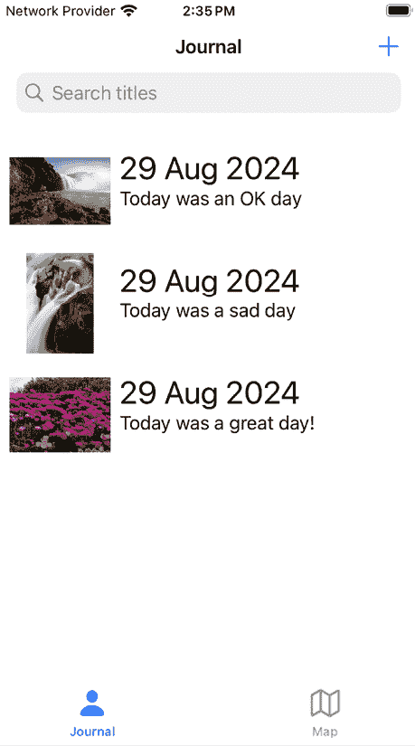

图 15.1：模拟器显示应用游览中的期刊列表屏幕

构建并运行你的应用，期刊列表屏幕将看起来像这样：

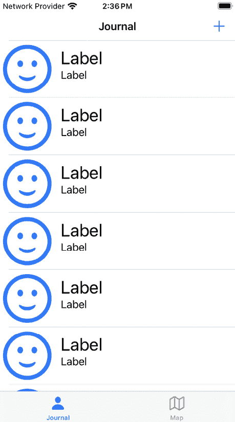

图 15.2：模拟器显示你的应用中的期刊列表屏幕

如您所见，所有单元格当前都显示占位符。根据 MVC 设计模式，您已部分完成所需视图（表格视图）和控制器（`JournalListViewController`类）的实现。您需要创建一个自定义的`UITableViewCell`实例来管理表格视图单元格将显示的内容，并且您需要添加模型对象，这些对象将提供日记条目数据。

每个日记条目将存储以下内容：

+   条目创建的日期

+   一个评分值

+   标题文本

+   正文文本

+   一个可选的照片

+   一个可选的地理位置

在*第十四章*，*使用 MVC 和表格视图入门*中，您使用了一个`String`数组的数组来表示日记条目。然而，`String`数组只能存储字符串，并且您必须能够存储除`String`之外的数据类型。为了解决这个问题，您将创建一个名为`JournalEntry`的类来存储日记条目所需的所有数据。接下来，您将创建一个静态方法，该方法返回存储在`JournalEntry`实例中的示例数据。之后，您将创建一个自定义的`UITableView`类来管理表格视图单元格显示的数据。最后，您将修改`JournalListViewController`类，使其能够为表格视图提供显示数据。

# 创建一个表示日记条目的类

要创建一个可以在您的应用中表示日记条目的模型对象，您需要在项目中添加一个新文件，`JournalEntry.swift`，并声明一个具有日记条目所需属性的`JournalEntry`类。在这样做之前，您需要配置项目以使用 Swift 6 并将主项目文件夹更改为组。请按照以下步骤操作：

1.  在项目导航器中，单击**JRNL**图标。单击**JRNL**目标并单击**构建设置**。向下滚动到**Swift 编译器 - 语言**并将**Swift 语言版本**设置为**Swift 6**：


图 15.3：编辑区域显示已设置 Swift 6 的构建设置

1.  在**JRNL**图标下的蓝色**JRNL**项目文件夹上右键单击并选择**转换为组**：

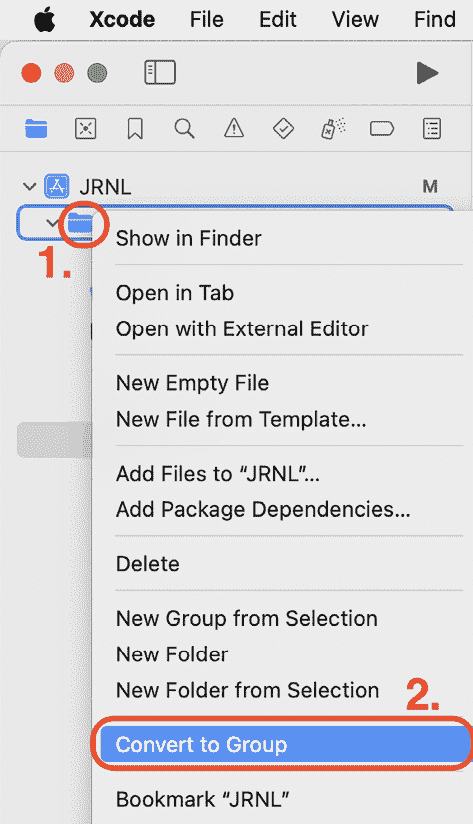

图 15.4：已选择“转换为组”的弹出菜单

文件夹颜色将从蓝色变为深灰色。将文件夹转换为组将允许您重新排列其中的文件顺序。

要了解更多关于 Xcode 中文件夹和组之间差异的信息，请访问：[`developer.apple.com/documentation/xcode/managing-files-and-folders-in-your-xcode-project`](https://developer.apple.com/documentation/xcode/managing-files-and-folders-in-your-xcode-project)。

1.  在组中重新排序文件，直到它们看起来像下面的截图：

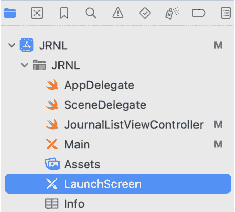

图 15.5：项目导航器显示重新排序的文件

1.  在项目导航器中右键单击**JournalListViewController**文件，然后选择**从选择新建组**：

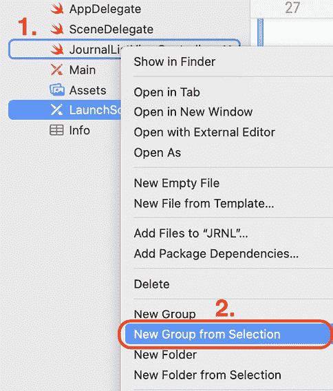

图 15.6：已选择“从选择新建组”的弹出菜单

这将创建一个包含`JournalListViewController`文件的新组。

1.  将组名的占位文本替换为`Journal List Screen`并按*回车*：

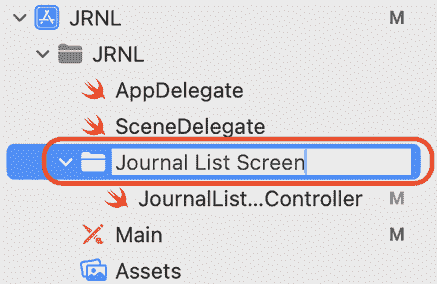

图 15.7：项目导航器显示日记列表屏幕组

1.  现在将为用于日记列表屏幕的模型和视图对象创建组。右键单击**日记列表屏幕**组并选择**新建组**：

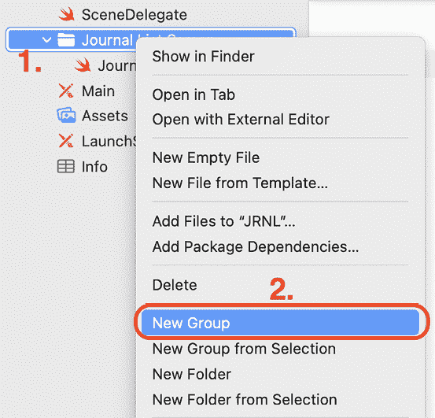

图 15.8：弹出菜单，选中“新建组”

1.  将占位文本替换为`Model`并按*回车*：

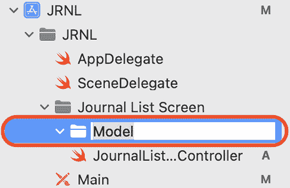

图 15.9：项目导航器显示模型组

1.  通过重复*步骤 3*并替换占位文本为`View`来创建另一个文件夹。项目导航器应该看起来像以下截图：

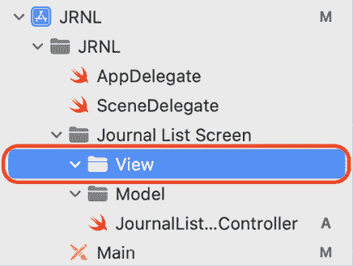

图 15.10：项目导航器显示视图和模型组

1.  您现在将创建一个包含`JournalEntry`类实现的文件。右键单击**模型**文件夹并选择**从模板新建文件...**：

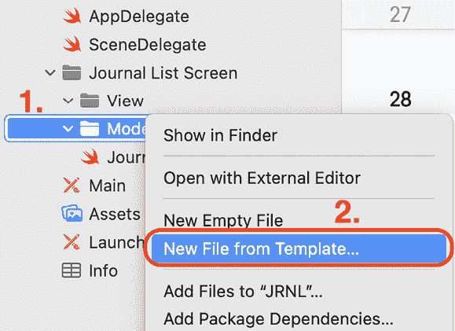

图 15.11：弹出菜单，选中“从模板新建文件…”

1.  **iOS**应该已经选中。选择**Swift 文件**并点击**下一步**：


图 15.12：选择新文件的模板：选中 Swift 文件

1.  将文件命名为`JournalEntry`然后点击**创建**。文件将出现在项目导航器中，其内容将出现在**编辑器**区域：

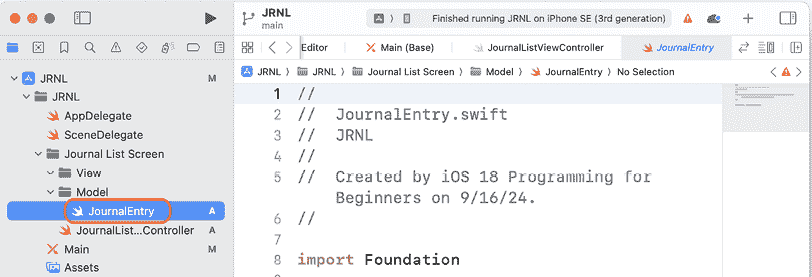

图 15.13：编辑区域显示 JournalEntry 文件的内容

此文件中只有一行是`import`语句。

`import`语句允许您将其他代码库导入到项目中，从而让您能够使用它们中的类、属性和方法。Foundation 是苹果的核心框架之一，您可以在这里了解更多信息：[`developer.apple.com/documentation/foundation`](https://developer.apple.com/documentation/foundation)。

1.  修改`import`语句以导入`UIKit`：

    ```swift
    import **UIKit** 
    ```

    `UIKit`提供了 iOS 应用所需的基础设施。您可以在这里了解更多信息：[`developer.apple.com/documentation/uikit`](https://developer.apple.com/documentation/uikit)。

1.  在`import`语句后添加以下代码以声明一个名为`JournalEntry`的类：

    ```swift
    class JournalEntry {
    } 
    ```

1.  在`JournalEntry`类的开头花括号后添加以下代码以添加此类的所需属性：

    ```swift
    class JournalEntry {
    **// MARK: - Properties**
    **let****date****:** **Date**
    **let****rating****:** **Int**
    **let****title****:** **String**
    **let****body****:** **String**
    **let****photo****:** **UIImage****?**
    **let****latitude****:** **Double****?**
    **let****longitude****:** **Double****?**
    } 
    ```

让我们分解一下：

+   `date`属性的类型是`Date`，将存储日记条目创建的日期。

+   `rating`属性的类型是`Int`，将存储日记条目的星级数量。

+   `title`属性的类型是`String`，将存储日记条目的标题文本。

+   `body`属性的类型是`String`，将存储日记条目的正文文本。

+   `photo`属性的类型是`UIImage?`，将存储照片。这是一个可选属性，因为并非所有日记条目都需要照片。

+   `lat` 和 `long` 属性的类型为 `Double?`，并将存储日记条目创建的位置。这些是可选属性，因为并非所有日记条目都需要位置信息。

将出现错误，因为你的类没有初始化器。

1.  在 `longitude` 属性之后添加以下代码以实现初始化器：

    ```swift
    // MARK: - Initialization
    init?(rating: Int, title: String, body: String, photo: UIImage? = nil, latitude: Double? = nil, longitude: Double? = nil) {
      if title.isEmpty || body.isEmpty || rating < 0 ||   rating > 5 {
        return nil
      }
      self.date = Date()
      self.rating = rating
      self.title = title
      self.body = body
      self.photo = photo
      self.latitude = latitude
      self.longitude = longitude
    } 
    ```

    类在 *第七章*，*类、结构和枚举* 中有所介绍。

让我们分解一下：

```swift
init?(rating: Int, title: String, body: String, photo: UIImage? = nil, latitude: Double? = nil, longitude: Double? = nil) { 
```

`JournalEntry` 类的初始化器有 `Int` 类型的值、两个 `String` 类型的值、一个可选的 `UIImage` 类型的值和两个可选的 `Double` 类型的值作为参数。所有可选值的默认值都是 `nil`。`init` 关键字后面的问号表示这是一个 **可失败初始化器**；如果某些条件不满足，它将不会创建 `JournalEntry` 实例。

```swift
if title.isEmpty || body.isEmpty || rating < 0 || rating > 5 {
  return nil
} 
```

如果以下任一条件返回 `true`，初始化器将无法创建 `JournalEntry` 实例：`title` 为空，`body` 为空，`rating` 小于 `0`，以及 `rating` 大于 `5`。

```swift
self.date = Date() 
```

当创建 `JournalEntry` 实例时，将当前日期分配给 `date` 属性。

```swift
self.rating = rating
self.Title = entryTitle
self.Body = entryBody
self.photo = photo
self.latitude = latitude
self.longitude = longitude 
```

这将把参数值赋给 `JournalEntry` 实例的相应属性。注意使用 `self` 来区分具有相同名称的属性和参数。

1.  `MARK: -` 语句使代码导航变得容易。点击工具栏下可见的路径的最后一部分，你将看到 **属性** 和 **初始化** 两个部分在菜单中显示。这使得你可以轻松地进入这些部分：

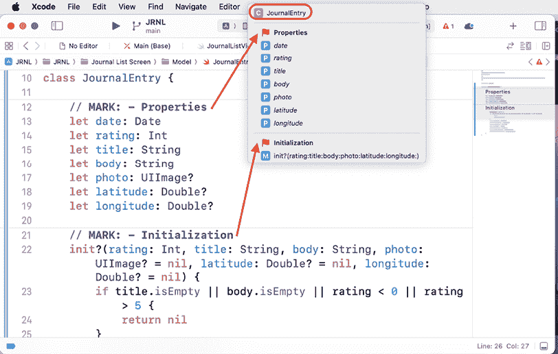

图 15.14：显示属性和初始化部分的菜单

到目前为止，你有一个名为 `JournalEntry` 的类，它可以存储单个日记条目的所有详细信息。在下一节中，你将创建一个返回示例 `JournalEntry` 实例的静态方法。

# 创建示例数据

如你在 *第十四章*，*MVC 和表格视图入门* 中所见，你可以使用数组作为表格视图的数据源。现在，你将创建一个包含静态方法的扩展，该方法将返回包含三个示例日记条目的数组。

在项目导航器中点击 `JournalEntry` 文件，并在文件中所有其他代码之后输入以下内容：

```swift
// MARK: - Sample data
extension JournalEntry {
  static func createSampleJournalEntryData() -> [JournalEntry] {
    let photo1 = UIImage(systemName: "sun.max")
    let photo2 = UIImage(systemName: "cloud")
    let photo3 = UIImage(systemName: "cloud.sun")
    guard let journalEntry1 =  JournalEntry(rating: 5,     title: "Good", body: "Today is a good day",     photo: photo1) else {
      fatalError("Unable to instantiate journalEntry1")
    }
    guard let journalEntry2 = JournalEntry(rating: 0,     title: "Bad", body: "Today is a bad day", 
    photo: photo2) else {
      fatalError("Unable to instantiate journalEntry2")
    }
    guard let journalEntry3 = JournalEntry(rating: 3,     title: "Ok", body: "Today is an Ok day",     photo: photo3) else {
      fatalError("Unable to instantiate journalEntry3")
    }
    return [journalEntry1, journalEntry2, journalEntry3]
  }
} 
```

此扩展包含一个 `createSampleJournalEntryData()` 方法，该方法使用来自 Apple 的 `SFSymbols` 库的符号创建三个 `UIImage` 实例，创建三个 `JournalEntry` 实例，将它们添加到数组中，并返回该数组。`static` 关键字表示这是一个 `JournalEntry` 类的方法，而不是 `JournalEntry` 实例方法。

要了解更多关于类型和实例方法的信息，请参阅此链接：[`docs.swift.org/swift-book/documentation/the-swift-programming-language/methods/`](https://docs.swift.org/swift-book/documentation/the-swift-programming-language/methods/)

你现在已经完成了`JournalEntry`类的实现。你还添加了一个静态方法，该方法将生成三个示例日记条目。在下一节中，你将修改`JournalListViewController`类，以便使用此方法返回的数组来填充表格视图。

# 在表格视图中显示数据

在*第十四章*，*开始使用 MVC 和表格视图*中，你使用了表格视图单元格配置来设置表格视图单元格要显示的数据。在这里你将无法做到这一点，因为你正在使用你在*第十三章*，*修改应用屏幕*中实现的自定义表格视图单元格。

到目前为止，在本章中，你已经实现了一个返回包含三个`JournalEntry`实例的数组的静态方法。现在，你将修改`JournalListViewController`类，使其使用该数组作为“日记列表”屏幕上表格视图的数据源。为此，你需要执行以下操作：

+   创建一个自定义`UITableViewCell`实例，并将其分配为`journalCell`表格视图单元格的标识。

+   修改`JournalListViewController`类，从`createSampleJourneyEntryData`静态方法获取示例数据，并将其分配给`journalEntries`数组。

+   修改`JournalListViewController`类中的数据源方法，使用`journalEntries`数组中的数据来填充表格视图单元格。

你将在下一节中开始创建一个自定义`UITableViewCell`实例。

## 创建自定义`UITableViewCell`子类

目前，在“日记列表”屏幕上的表格视图显示了 10 个不包含任何数据的表格视图单元格。你需要一种方法来设置表格视图单元格中图像视图和标签的值，因此你将创建一个新的`UITableViewCell`子类`JournalEntryTableViewCell`来达到这个目的。你将把这个类作为“日记列表”屏幕上表格视图单元格的标识。按照以下步骤操作：

1.  在项目导航器中，右键单击**视图**文件夹，然后选择**从模板新建文件...**。

1.  **iOS**应该已经选中。选择**Cocoa Touch 类**，然后点击**下一步**：

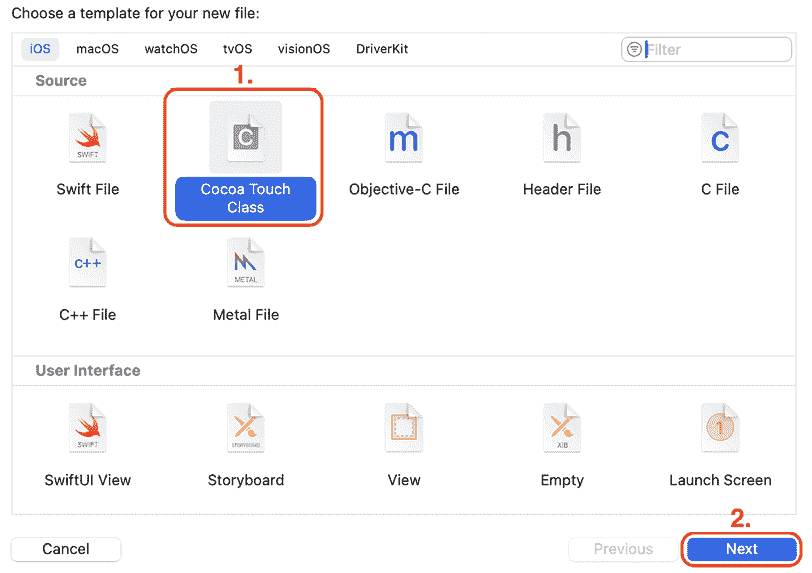

图 15.15：为你的新文件选择一个模板

使用**Cocoa Touch 类**模板将允许你设置你将要创建的类的超类，并自动插入为你创建的类插入样板代码。

1.  **选择你的新文件选项**屏幕将出现：

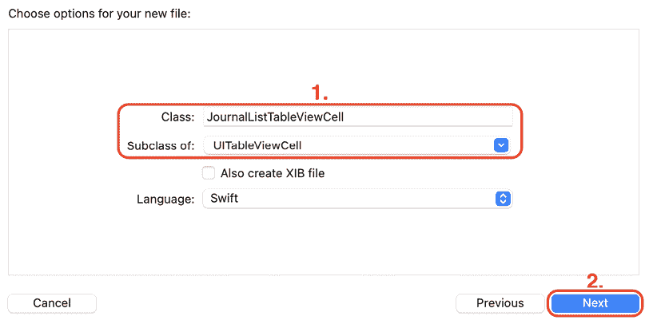

图 15.16：选择你的新文件选项屏幕

按照以下方式配置类：

+   **类**：`JournalListTableViewCell`

+   **子类**：`UITableViewCell`

+   **也创建 XIB**：未勾选

+   **语言**：`Swift`

完成后点击**下一步**。

1.  点击**创建**，一个新的文件`JournalListTableViewCell`将被添加到项目中的**视图**组。在里面你会看到以下代码：

    ```swift
    import UIKit
    class JournalListTableViewCell: UITableViewCell {
      override func awakeFromNib() {
        super.awakeFromNib()
        // Initialization code
      }
      override func setSelected(_ selected: Bool,   animated: Bool) {
        super.setSelected(selected, animated: animated)
        // Configure the view for the selected state
      }
    } 
    ```

1.  从如下所示的`JournalListTableViewCell`类声明中删除所有代码：

    ```swift
    class JournalListTableViewCell: UITableViewCell {
    } 
    ```

1.  要创建与`journalCell`表格视图单元格的子视图对应的三个属性，请在`JournalEntry`类声明的大括号之间输入以下代码：

    ```swift
    // MARK: - Properties 
    @IBOutlet var photoImageView: UIImageView!
    @IBOutlet var dateLabel: UILabel!
    @IBOutlet var titleLabel: UILabel! 
    ```

1.  `JournalListTableViewCell`类的实现已完成。现在您将此类分配为`journalCell`表格视图单元格的标识。在项目导航器中单击**Main**故事板文件，然后在文档大纲中单击**Journal Scene**下的**journalCell**：

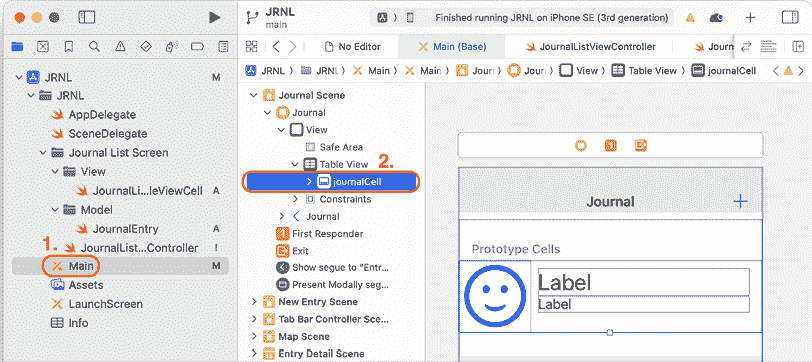

图 15.17：文档大纲显示已选择的 journalCell

1.  单击身份检查器按钮。在**自定义类**部分，将**类**设置为`JournalListTableViewCell`。这会将`JournalListTableViewCell`实例设置为`journalCell`的自定义表格视图子类。完成此操作后按*Return*键：

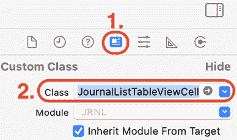

图 15.18：身份检查器显示 journalCell 的类设置

您刚刚声明并定义了`JournalListTableViewCell`类，并将其分配为`journalCell`表格视图单元格的自定义表格视图子类。在下一节中，您将连接此类到`journalCell`表格视图单元格中的图像视图和标签，以便您可以控制它们显示的内容。

## 连接 journalCell 中的出口

要管理在“期刊列表”屏幕中表格视图单元格显示的内容，您将使用连接检查器将`journalCell`表格视图单元格中的图像视图和标签连接到`JournalListTableViewCell`类的出口。按照以下步骤操作：

1.  在文档大纲中选择**journalCell**后，单击连接检查器以显示其出口。

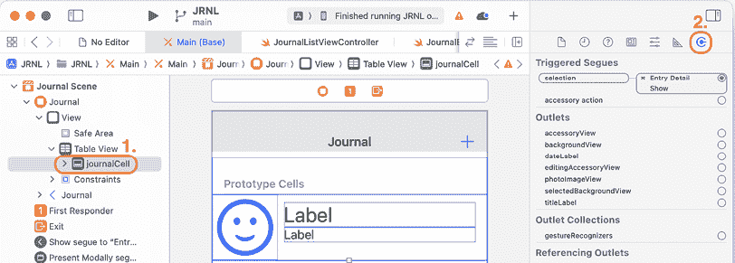

图 15.19：连接检查器显示 journalCell 的出口

1.  从**photoImageView**出口拖动到表格视图单元格中的图像视图：

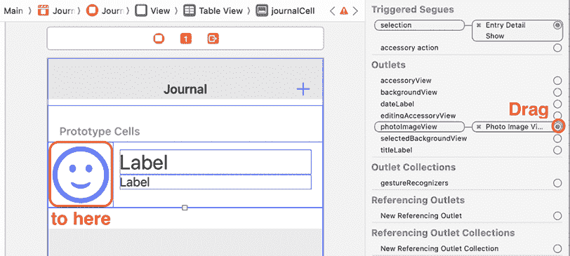

图 15.20：连接检查器显示 photoImageView 出口

1.  从**dateLabel**出口拖动到表格视图单元格的顶部标签。

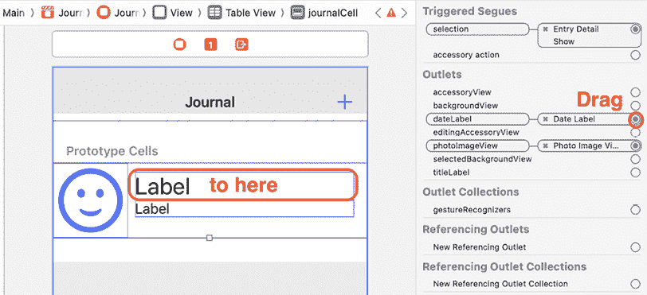

图 15.21：连接检查器显示 dateLabel 出口

1.  从**titleLabel**出口拖动到底部标签在表格视图单元格：

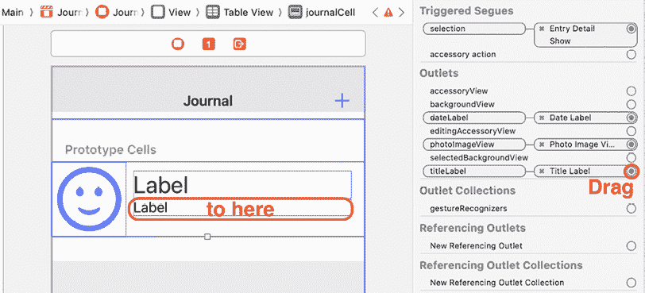

图 15.22：连接检查器显示 titleLabel 出口

记住，如果您出错，可以单击**x**断开连接，然后再次从出口拖动到 UI 元素。

`Main`故事板文件中的`journalCell`表格视图单元格现在已设置了一个自定义表格视图子类，`JournalListTableViewCell`。表格视图单元格的图像视图和标签的出口也已创建并分配。现在您将能够设置`photoImageView`、`dateLabel`和`titleLabel`出口，以便在应用运行时在每个单元格中显示照片、日期和标题。

在下一节中，你将更新`JournalListViewController`类中的表格视图数据源方法，以提供表格视图中要显示的表格视图单元格数量，以及为每个单元格提供日记条目的照片、日期和标题。

## 更新`JournalListViewController`中的数据源方法

`JournalListViewController`类中的数据源方法目前设置为显示 10 个表格视图单元格，每个单元格包含一个显示笑脸的图像视图和两个标签。你将更新它们以从`SampleJournalEntryData`实例中获取要显示的单元格数量以及每个单元格中的数据。按照以下步骤操作：

1.  在项目导航器中点击**JournalListViewController**文件。

1.  将`JournalListViewController`类中的代码重新排列，以便`tableView`出口和`viewDidLoad()`方法位于表格视图委托方法之前：

    ```swift
    class JournalListViewController: UIViewController, UITableViewDataSource, UITableViewDelegate { 
    **@IBOutlet****var****tableView****:** **UITableView****!**
    **override****func****viewDidLoad****() {**
    **super****.****viewDidLoad****()**
     **}**
      func tableView(_ tableView: UITableView,   
      numberOfRowsInSection section: Int) -> Int { 
    ```

1.  在属性声明之前添加一个`MARK`语句，如下所示：

    ```swift
    **// MARK: - Properties**
    @IBOutlet var tableView: UITableView! 
    ```

1.  在`viewDidLoad()`方法之前添加一个`MARK`语句，如下所示：

    ```swift
    **// MARK: - View controller lifecycle**
    @override func viewDidLoad() { 
    ```

1.  在表格视图数据源方法之前添加一个`MARK`语句，如下所示：

    ```swift
    **// MARK: - UITableViewDataSource**
    func tableView(_ tableView: UITableView, numberOfRowsInSection section: 
    ```

1.  在`UnwindNewEntryCancel(segue:)`之前添加一个`MARK`语句，如下所示：

    ```swift
    **// MARK: - Methods**
    @IBAction func unwindNewEntryCancel(segue: UIStoryboardSegue) { 
    ```

1.  确认`JournalListViewController`中的代码如下所示：

    ```swift
    class JournalListViewController: UIViewController, UITableViewDataSource, UITableViewDelegate {
      // MARK: - Properties
      @IBOutlet var tableView: UITableView!
      // MARK: - View controller lifecycle
      override func viewDidLoad() {
        super.viewDidLoad()
      }
      // MARK: - UITableViewDataSource
      func tableView(_ tableView: UITableView, 
      numberOfRowsInSection section: Int) -> Int {
        10
      }
      func tableView(_ tableView: UITableView, cellForRowAt 
      indexPath: IndexPath) -> UITableViewCell {
        tableView.dequeueReusableCell(withIdentifier: 
        "journalCell", for: indexPath)
      }
      // MARK: - Methods
      @IBAction func unwindNewEntryCancel(segue: 
      UIStoryboardSegue) {
      }
    } 
    ```

1.  在`tableView`出口声明之后输入以下代码以创建一个`journalEntries`属性，该属性将包含`JournalEntry`实例的数组：

    ```swift
    @IBOutlet var tableView: UITableView!
    **private****var****journalEntries****: [****JournalEntry****]** **=** **[]** 
    ```

`private`关键字限制了`journalEntries`数组在`JournalListViewController`类中的使用。

你可以在以下链接中了解更多关于 Swift 中的访问控制的信息：[`docs.swift.org/swift-book/documentation/the-swift-programming-language/accesscontrol/`](https://docs.swift.org/swift-book/documentation/the-swift-programming-language/accesscontrol/)。

1.  按照以下示例修改`viewDidLoad()`方法，以便在应用启动时填充`journalEntries`数组：

    ```swift
    override func viewDidLoad() {
      super.viewDidLoad()
     **journalEntries =****JournalEntry****.****createSampleJournalEntryData****()**

    } 
    ```

`createSampleJournalEntryData()`方法将创建三个`JournalEntry`实例并将它们分配给`journalEntries`数组。

1.  按照以下示例更新`tableView(_:numberOfRowsInSection:)`方法。这将使表格视图为`journalEntries`数组中的每个元素显示一个`journalCell`：

    ```swift
    func tableView(_ tableView: UITableView, numberOfRowsInSection section: Int) -> Int {
      **journalEntries.****count**
    } 
    ```

1.  按照以下示例更新`tableView(_:cellForRowAt:)`方法，使用来自`journalEntries`数组中相应元素的数据来设置每个单元格的图像视图和标签：

    ```swift
    func tableView(_ tableView: UITableView, cellForRowAt indexPath: IndexPath) -> UITableViewCell {
      let journalCell =  tableView.dequeueReusableCell(withIdentifier:  "journalCell", for: indexPath) as!  JournalListTableViewCell
      let journalEntry = journalEntries[indexPath.row]
      journalCell.photoImageView.image = journalEntry.photo
      journalCell.dateLabel.text = journalEntry.date.formatted(
        .dateTime.month().day().year()
      )
      journalCell.titleLabel.text = journalEntry.title
      return journalCell
    } 
    ```

让我们分解一下：

```swift
let journalCell = tableView.dequeueReusableCell(withIdentifier: "journalCell", for: indexPath) as! JournalListTableViewCell 
```

此语句指定从队列中检索的单元格被转换为`JournalListTableViewCell`实例。

你可以在以下链接中了解更多关于`as!`运算符的信息：[`developer.apple.com/swift/blog/?id=23`](https://developer.apple.com/swift/blog/?id=23)。

```swift
let journalEntry = journalEntries[indexPath.row] 
```

此语句获取与表格视图中当前单元格对应的`JournalEntry`实例。换句话说，表格视图中的第一个单元格对应于`journalEntries`数组中的第一个`JournalEntry`实例，第二个表格视图单元格对应于第二个`JournalEntry`实例，依此类推。

```swift
journalCell.photoImageView.image = journalEntry.photo 
```

此语句从`JournalEntry`实例获取照片，并将其分配给`journalCell`实例的`photoImageView`属性。

```swift
journalCell.dateLabel.text = journalEntry.date.formatted(
  .dateTime.month().day().year()
) 
```

此语句从`JournalEntry`实例获取日期，将其格式化为字符串，并将其分配给`journalCell`实例的`dateLabel`属性。

```swift
journalCell.titleLabel.text = journalEntry.title 
```

此语句从`JournalEntry`实例中获取存储在`title`中的字符串，并将其分配给`journalCell`实例的`titleLabel`属性的文本。

```swift
return journalCell 
```

此语句返回用于在表格视图中显示的已填充的`journalCell`实例。

1.  构建并运行应用程序。您将在“期刊列表”屏幕的表格视图中看到为`journalEntries`数组中的每个`JournalEntry`实例显示的文本和图像：

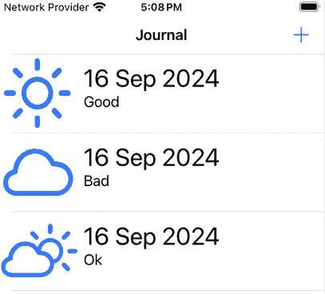

图 15.23：模拟器显示“期刊列表”屏幕

点击行会显示“期刊条目详情”屏幕，但此屏幕尚未显示所选期刊条目的任何数据。您将在下一章中解决这个问题。

恭喜！到目前为止，“期刊列表”屏幕已显示`journalEntries`数组中的文本和图像。但您还不能从`journalEntries`数组中添加或删除期刊条目。您将在下一章中学习如何做到这一点。

# 摘要

在本章中，您实现了用于“期刊列表”屏幕的模型对象，以便显示期刊条目列表。您了解了将要使用的模型对象，创建了一个可以用于存储期刊条目实例的 Swift 类，并创建了一个返回示例期刊条目的静态方法。然后，您为表格视图创建了一个自定义的`UITableViewCell`实例，并使用返回示例期刊条目的方法填充了一个数组。然后，此数组被用作“期刊列表”屏幕表格视图的数据源。

您现在知道如何创建模型对象，如何创建示例数据，以及如何配置视图控制器以使用该示例数据填充表格视图。如果您希望创建使用表格视图的自己的应用程序，这将很有用。

在下一章中，您将学习如何在“期刊列表”屏幕中添加和删除期刊条目。您还将学习如何在视图控制器之间传递数据。

# 加入我们的 Discord！

与其他用户、专家以及作者本人一起阅读此书。提出问题，为其他读者提供解决方案，通过“问我任何问题”会议与作者聊天，等等。扫描二维码或访问链接加入社区。

[`packt.link/ios-Swift`](https://packt.link/ios-Swift%0D)

(https://packt.link/ios-Swift%0D)
