# 传递视图控制器之间的数据

在上一章中，您已配置了`JournalListViewController`类，即“日记列表”屏幕的视图控制器，以在表格视图中显示包含示例数据的结构中的日记条目。

在本章中，您将学习如何从一个视图控制器传递数据到另一个视图控制器。您将从实现“添加新日记条目”屏幕的视图控制器开始，然后添加代码以从“添加新日记条目”屏幕传递数据到“日记列表”屏幕。接下来，您将学习如何在“日记列表”屏幕上删除日记条目。之后，您将了解**文本字段**和**文本视图代理**方法，最后，您将从“日记列表”屏幕传递数据到“日记条目详情”屏幕。

到本章结束时，您将学习如何在视图控制器之间传递数据以及如何使用文本字段和文本视图代理方法。这将使您能够轻松地在自己的应用程序中在视图控制器之间传递数据。

本章将涵盖以下主题：

+   从“添加新日记条目”屏幕传递数据到“日记列表”屏幕

+   从表格视图中删除行

+   探索文本字段和文本视图代理方法

+   从“日记列表”屏幕传递数据到“日记条目详情”屏幕

# 技术要求

您将继续在上一章中修改的 `JRNL` 项目上进行工作。

本章的游乐场和完成的 Xcode 项目位于本书代码包的 `Chapter16` 文件夹中，您可以通过以下链接下载：

[`github.com/PacktPublishing/iOS-18-Programming-for-Beginners-Ninth-Edition`](https://github.com/PacktPublishing/iOS-18-Programming-for-Beginners-Ninth-Edition%0D)

查看以下视频以查看代码的实际效果：

[`youtu.be/92O7NgVoT2Q`](https://youtu.be/92O7NgVoT2Q%0D)

让我们从学习如何在下一节中在“添加新日记条目”屏幕和“日记列表”屏幕之间传递数据开始。

# 从“添加新日记条目”屏幕传递数据到“日记列表”屏幕

如第十章“设置用户界面”的应用程序导游中所示，**“添加新日记条目”屏幕**允许用户输入数据以创建新的日记条目。为此，用户将点击“日记列表”屏幕右上角的**+**按钮以显示“添加新日记条目”屏幕。然后，用户将输入新日记条目的详细信息。点击**保存**按钮将关闭“添加新日记条目”屏幕，并在“日记列表”屏幕上的表格视图中添加一个包含表格视图单元格的新行。该表格视图单元格将显示新添加的日记条目的照片、日期和标题。

为了实现这一功能，你需要为管理“添加新日志条目”屏幕的视图控制器实现`prepare(for:sender:)`方法。此方法在你从一个视图控制器切换到另一个视图控制器时被触发。使用此方法，你将使用用户输入的信息创建一个新的日志条目，并将其分配给一个变量。你将在`JournalListViewController`类中实现一个 unwind 方法，这样你就可以在“日志列表”屏幕上访问这个变量。然后，你将从这个变量中获取的新日志条目添加到`journalEntries`数组中，然后重新绘制表格视图。

要了解更多关于`prepare(for:sender:)`方法的信息，请参阅：[`developer.apple.com/documentation/uikit/uiviewcontroller/1621490-prepare`](https://developer.apple.com/documentation/uikit/uiviewcontroller/1621490-prepare)。

在下一节中，你将创建一个新的视图控制器实例来管理“添加新日志条目”屏幕。

## 创建 AddJournalEntryViewController 类

目前，“添加新日志条目”屏幕还没有视图控制器。你将在项目中添加一个新文件，并实现`AddJournalEntryViewController`类，将其分配给**新建条目场景**，并连接出口。按照以下步骤操作：

1.  从上一章打开你的`JRNL`项目。在项目导航器中，通过右键单击**JRNL**组并选择**新建组**来创建一个新组。

1.  将此组命名为“新建日志条目屏幕”并将其移动到**日志列表屏幕**组下方。

1.  右键单击**新建日志条目屏幕**组，并选择**从模板新建文件...**。

1.  **iOS**应该已经选中。选择**Cocoa Touch Class**并点击**下一步**。

1.  使用以下详细信息配置类：

    +   **类**：`AddJournalEntryViewController`

    +   **子类为**：`UIViewController`

    +   **也创建 XIB**：未勾选

    +   **语言**：**Swift**

完成后点击**下一步**。

1.  点击**创建**，`AddJournalEntryViewController`文件将出现在项目导航器中。

`AddJournalEntryViewController`文件现在已经创建，其中包含`AddJournalEntryViewController`类的声明。你将设置此类为在点击日志列表屏幕上的**+**按钮时呈现的视图控制器场景的自定义类。按照以下步骤操作：

1.  在项目导航器中点击**主**故事板文件，然后在文档大纲中点击**新建条目场景**：

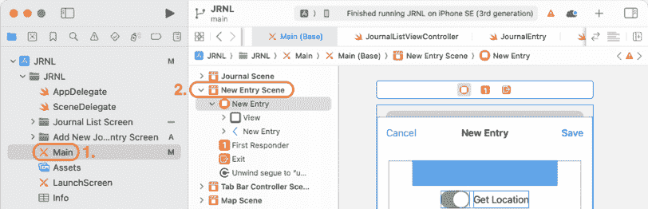

图 16.1：显示新建条目场景的编辑区域

1.  点击身份检查器按钮，在**自定义类**下，将**类**设置为`AddJournalEntryViewController`：

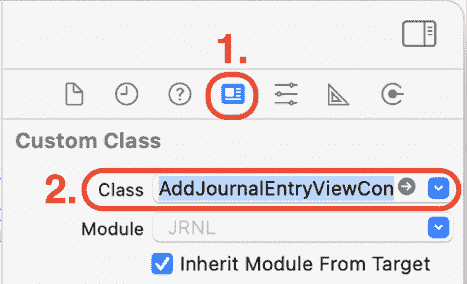

图 16.2：新建条目场景的身份检查器设置

太好了！在下一节中，让我们将**新条目**场景中的用户界面元素连接到`AddJournalEntryViewController`类中的出口。通过这样做，`AddJournalEntryViewController`实例将能够访问用户在添加新日志条目屏幕上输入的数据。

## 将 UI 元素连接到 AddJournalEntryViewController 类

目前，添加新日志条目屏幕的`AddJournalEntryViewController`实例无法与其中的 UI 元素通信。你将在`AddJournalEntryViewController`类中添加出口，并将**新条目**场景中的相应 UI 元素分配给每个出口。按照以下步骤操作：

1.  在项目导航器中，点击**AddJournalEntryViewController**文件，在`AddJournalEntryViewController`类的大括号开头上添加以下属性：

    ```swift
    // MARK: - Properties
    @IBOutlet var titleTextField: UITextField!
    @IBOutlet var bodyTextView: UITextView!
    @IBOutlet var photoImageView: UIImageView! 
    ```

1.  点击**Main**故事板文件，然后在文档大纲中点击**新条目场景**：

1.  点击连接检查器以显示**新条目场景**的所有出口。从**titleTextField**出口拖动到**新条目场景**中的文本框：

![img/B31371_16_03.png]

图 16.3：连接检查器显示 titleTextField 出口

1.  从**bodyTextView**出口拖动到**新条目场景**中的文本视图：

![img/B31371_16_04.png]

图 16.4：连接检查器显示 bodyTextView 出口

1.  从**photoImageView**出口拖动到**新条目场景**中的图像视图：

![img/B31371_16_05.png]

图 16.5：连接检查器显示 photoImageView 出口

记住，如果你犯了错误，你可以点击**x**来断开连接，然后再次从出口拖动到 UI 元素。

到此为止，你已经将**新条目**场景中的 UI 元素连接到了`AddJournalEntryViewController`类中的出口。在下一节中，你将实现代码，当用户点击**保存**按钮时创建一个`JournalEntry`实例。

## 从用户输入创建 JournalEntry 实例

你已经实现了`AddJournalEntryViewController`类，并将此类中的出口连接到了**新条目**场景中的文本框、文本视图和图像视图。当用户在文本框和文本视图中输入数据时，你可以使用这些信息来创建一个新的日志条目。

当视图控制器即将过渡到另一个视图控制器时，视图控制器的`prepare(for:sender:)`方法会被调用。你将实现这个方法来创建一个新的`JournalEntry`实例，然后可以将它传递给 Journal List 屏幕的视图控制器。按照以下步骤操作：

1.  在项目导航器中，点击**AddJournalEntryViewController**文件，在出口声明后添加一个`newJournalEntry`属性到`AddJournalEntryViewController`类中：

    ```swift
    //MARK: - Properties
    @IBOutlet var titleTextField: UITextField!
    @IBOutlet var bodyTextView: UITextView!
    @IBOutlet var photoImageView: UIImageView!
    **var****newJournalEntry****:** **JournalEntry****?** 
    ```

使用用户输入的数据创建的`JournalEntry`实例将被分配给这个属性。

1.  在此类中取消注释`prepare(for:sender:)`方法。它应该看起来像以下这样：

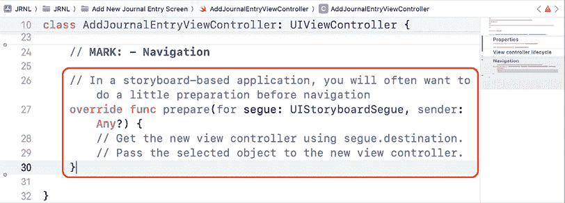

图 16.6：显示`prepare(for:sender:)`方法的编辑区域

1.  在此方法的花括号之间添加以下代码：

    ```swift
    let title = titleTextField.text ?? ""
    let body = bodyTextView.text ?? ""
    let photo = photoImageView.image
    let rating = 3
    newJournalEntry = JournalEntry(rating: rating, title: title, body: body, photo: photo) 
    ```

这将分别将文本字段和文本视图中的字符串以及图像视图中的图像分配给`title`、`body`和`photo`。由于在应用演示中显示的自定义评分控件尚未实现，因此将占位符值分配给`rating`。然后使用这些常量创建一个新的`JournalEntry`实例，并将其分配给`newJournalEntry`属性。

你现在已添加了代码，在添加新期刊条目屏幕过渡到期刊列表屏幕之前创建`JournalEntry`实例。在下一节中，你将修改`JournalListViewController`类以获取新的`JournalEntry`实例并将其添加到`journalEntries`数组中。

## 更新表格视图以显示新的期刊条目

在“期刊列表”屏幕上，期刊条目以表格视图的形式显示。表格视图从包含在`sampleJournalEntryData`结构中的`journalEntries`数组获取数据。你将在`JournalListViewController`类中添加代码以获取分配给`newJournalEntry`属性的`JournalEntry`实例。之后，你将此实例插入到`journalEntries`数组中。按照以下步骤操作：

1.  在项目导航器中，点击**JournalListViewController**文件，并在闭合花括号之前添加以下代码：

    ```swift
    @IBAction func unwindNewEntrySave(segue: UIStoryboardSegue) {
      if let sourceViewController = segue.source as?
      AddJournalEntryViewController, let newJournalEntry =
      sourceViewController.newJournalEntry {
        journalEntries.insert(newJournalEntry, at: 0)
        tableView.reloadData()
      }
    } 
    ```

此方法检查源视图控制器是否是`AddJournalEntryViewController`类的实例，如果是，则从`newJournalEntry`属性获取`JournalEntry`实例。然后，将此实例作为`journalEntries`数组中的第一个条目插入。之后，`tableView.reloadData()`语句将重新绘制表格视图。

1.  点击**Main**故事板文件，并在文档大纲中展开**新条目场景**。*Ctrl* + *拖动*文档大纲中的**保存**按钮到场景退出，并从弹出菜单中选择**unwindNewEntrySaveWithSegue:**。

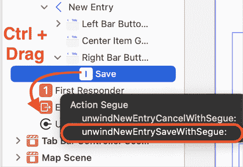

图 16.7：弹出菜单显示已选择 unwindNewEntrySaveWithSegue:

当你运行你的项目时，点击**保存**按钮将从添加新条目屏幕过渡到期刊列表屏幕，并执行`unwindNewEntrySave(segue:)`方法。

1.  构建并运行你的项目，然后点击**+**按钮。在文本字段和文本视图中输入一些示例文本。点击**保存**。

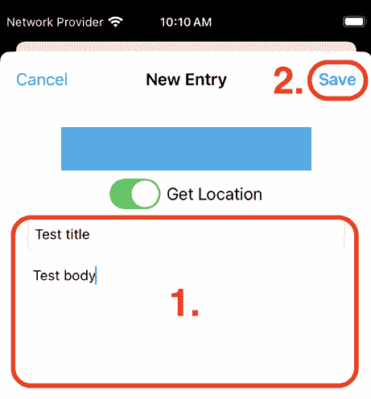

图 16.8：突出显示保存按钮的模拟器

1.  当“期刊列表”屏幕再次出现时，新的期刊条目将出现在表格视图中。

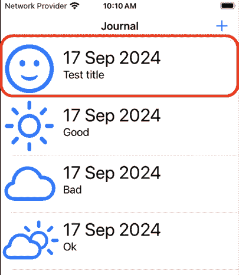

图 16.9：突出显示新表格视图单元格的模拟器

太棒了！你已经成功实现了“添加新日记条目”屏幕的视图控制器，现在可以添加新的日记条目，它们将出现在日记列表屏幕上。在下一节中，你将实现代码，这将允许你从日记列表屏幕上的表格视图中删除日记条目。

# 从表格视图中删除行

如你在*第十四章*中学习的，*MVC 和表格视图入门*，表格视图行删除由`tableView(_:commit:forRowAt:)`方法处理，这是在`UITableViewDataSource`协议中声明的方法之一。

你将在`JournalListViewController`类中实现此方法。按照以下步骤操作：

1.  在项目导航器中，点击**JournalListViewController**文件，并在`JournalListViewController`类中现有表格视图数据源方法之后添加以下代码：

    ```swift
    func tableView(_ tableView: UITableView, commit editingStyle: UITableViewCell.EditingStyle, forRowAt indexPath: IndexPath) {
      if editingStyle == .delete {
        journalEntries.remove(at: indexPath.row)
        tableView.reloadData()
      }
    } 
    ```

这将允许你向左滑动以显示**删除**按钮，当你点击**删除**按钮时，相应的`JournalEntry`实例将从`journalEntries`数组中移除，并且表格视图将被重新绘制。

1.  构建并运行你的项目。在任意一行上向左滑动以显示**删除**按钮：

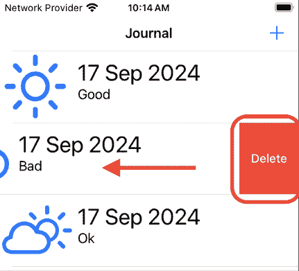

图 16.10：模拟器显示在日记列表屏幕上的删除按钮

1.  点击**删除**按钮，行将从表格视图中移除：

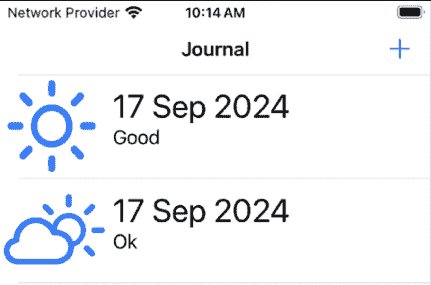

图 16.11：模拟器显示重新绘制的表格视图

有了这个，你已经成功实现了一种从表格视图中删除行的方法！太棒了！在下一节中，你将学习更多关于文本字段和文本视图代理方法，这在你在“添加新日记条目”屏幕中输入数据时将非常有用。

# 探索文本字段和文本视图代理方法

目前，在“添加新日记条目”屏幕上存在一些问题。第一个问题是，一旦软件键盘出现在屏幕上，就无法将其关闭。第二个问题是，即使文本字段和文本视图为空，也可以点击**保存**按钮。

为了使与文本字段一起工作更容易，Apple 实现了`UITextFieldDelegate`，这是一个声明了一组可选方法来管理文本字段对象中文本的编辑和验证的协议。Apple 还实现了`UITextViewDelegate`，这是一个声明了用于接收文本视图对象编辑相关消息的方法的协议。

你可以在此链接中了解更多关于`UITextFieldDelegate`协议的信息：[`developer.apple.com/documentation/uikit/uitextfielddelegate`](https://developer.apple.com/documentation/uikit/uitextfielddelegate)。

你可以在此链接中了解更多关于`UITextViewDelegate`协议的信息：[`developer.apple.com/documentation/uikit/uitextviewdelegate`](https://developer.apple.com/documentation/uikit/uitextviewdelegate)。

你将实现`UITextFieldDelegate`和`UITextViewDelegate`协议中的方法到`AddJournalEntryViewController`类，以便用户在数据输入完成后可以关闭软件键盘。按照以下步骤操作：

1.  在项目导航器中，点击**AddJournalEntryViewController**文件。在`AddJournalEntryViewController`类声明的闭合花括号之后添加一个扩展，使其符合`UITextFieldDelegate`和`UITextViewDelegate`协议：

    ```swift
    extension AddJournalEntryViewController: UITextFieldDelegate, UITextViewDelegate {
    } 
    ```

1.  按照以下方式修改`viewDidLoad()`方法，将`AddJournalEntryViewController`实例设置为文本字段和文本视图的代理：

    ```swift
    override func viewDidLoad() {
      super.viewDidLoad()
    **titleTextField****.****delegate****=****self**
    **bodyTextView****.****delegate****=****self**
    } 
    ```

这意味着文本字段和文本视图代理方法的实现位于`AddJournalEntryViewController`类中。

1.  在扩展的开启花括号之后添加以下代码，以便在你在文本字段中完成文本输入后点击*回车*键时关闭软件键盘：

    ```swift
    extension AddJournalEntryViewController: UITextFieldDelegate, UITextViewDelegate {
    **// MARK: - UITextFieldDelegate**
    **func****textFieldShouldReturn****(****_****textField****:** **UITextField****) ->****Bool** **{** 
     **textField.****resignFirstResponder****()**
    **return****true**
     **}**
    } 
    ```

1.  在`textFieldShouldReturn(_:)`方法之后添加以下代码，以便在你在文本视图中完成文本输入后点击*回车*键时关闭软件键盘：

    ```swift
    //MARK: - UITextViewDelegate
    func textView(_ textView: UITextView, shouldChangeTextIn range: NSRange, replacementText text: String) -> Bool {
      if (text == "\n") {
        textView.resignFirstResponder()   
      }
      return true
    } 
    ```

当你在屏幕上点击文本字段或文本视图时，它会获得第一响应者状态，并且软件键盘从屏幕底部弹出。你在键盘上输入的任何内容都会发送到具有第一响应者状态的对象。在实现上述方法后，在文本字段或文本视图中点击软件键盘上的*回车*键将告诉它放弃第一响应者状态，这将自动使键盘消失。

1.  构建并运行你的应用，然后点击文本字段。如果软件键盘没有出现，从模拟器的**I/O**菜单中选择**键盘** | **切换软件键盘**：

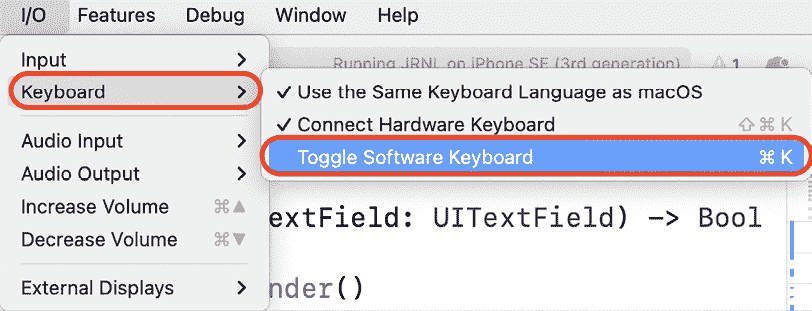

图 16.12：模拟器 I/O 菜单，已选择键盘 | 切换软件键盘

1.  使用软件键盘在文本字段或文本视图中输入一些文本：

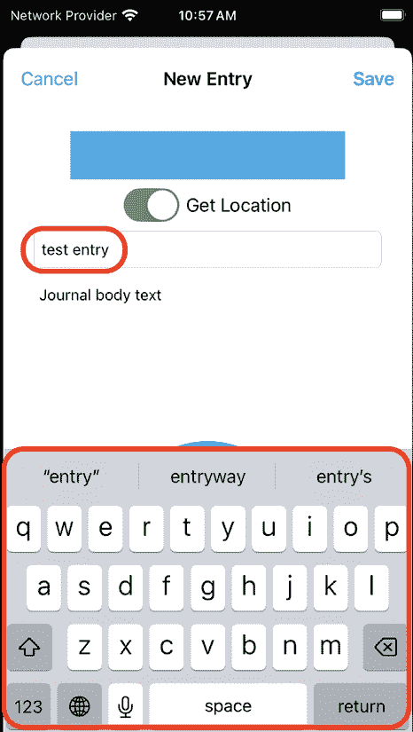

图 16.13：模拟器显示软件键盘

1.  在文本字段或文本视图中输入一些文本后，在软件键盘上点击*回车*键，它应该会自动消失。

第一个问题已经解决，用户现在可以关闭软件键盘了。太好了！现在你将修改你的应用，以便用户只有在文本字段和文本视图中输入了文本后才能点击**保存**。按照以下步骤操作：

1.  要启用或禁用**保存**按钮，你需要能够设置其状态。在输出声明之后输入以下内容以创建**保存**按钮的输出：

    ```swift
    @IBOutlet var titleTextField: UITextField!
    @IBOutlet var bodyTextView: UITextView!
    @IBOutlet var photoImageView: UIImageView!
    **@IBOutlet****var****saveButton****:** **UIBarButtonItem****!**
    var newJournalEntry: JournalEntry? 
    ```

1.  在项目导航器中，点击**Main**故事板文件，然后在文档大纲中点击**New Entry Scene**：

1.  点击连接检查器按钮，从**saveButton**输出拖动到**New Entry**场景中的**保存**按钮：

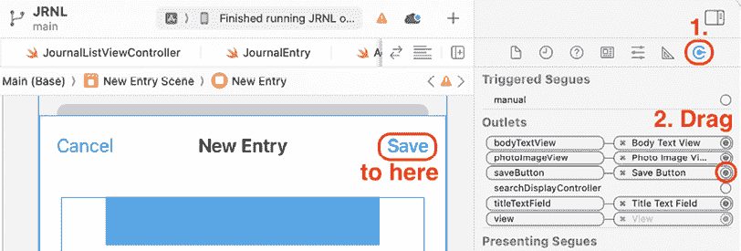

图 16.14：连接检查器显示保存按钮输出

1.  在项目导航器中，点击 **AddJournalEntryViewController** 文件。在 `textFieldShouldReturn(_:)` 方法之后添加显示的 `UITextFieldDelegate` 方法：

    ```swift
    func textFieldShouldReturn(_ textField: UITextField) -> Bool {
      textField.resignFirstResponder()
      return true
    }
    **func****textFieldDidBeginEditing****(****_****textField****:** **UITextField****) {**
    **saveButton****.****isEnabled****=****false**
    **}** 
    ```

此方法在用户开始在文本框中编辑文本时禁用 **保存** 按钮。

1.  在 `textView(_:shouldChangeTextIn range:replacementText:)` 方法之后添加显示的 `UITextViewDelegate` 方法：

    ```swift
    func textView(_ textView: UITextView, shouldChangeTextIn range: NSRange, replacementText text: String) -> Bool {
      if(text == "\n") {
        textView.resignFirstResponder()
      }
      return true
    }
    **func****textViewDidBeginEditing****(****_****textView****:** **UITextView****) {**
    **saveButton****.****isEnabled****=****false**
    **}** 
    ```

此方法在用户开始在文本视图中编辑文本时禁用 **保存** 按钮。

1.  在文本框或文本视图中存在文本之前，添加一个方法来启用 **保存** 按钮：

    ```swift
    // MARK: - Private methods
    private func updateSaveButtonState() {
      let textFieldText = titleTextField.text ?? ""
      let textViewText = bodyTextView.text ?? ""
      saveButton.isEnabled = !textFieldText.isEmpty && 
      !textViewText.isEmpty
    } 
    ```

`private` 关键字表示此方法仅在此类内部可访问。

1.  在 `textFieldDidBeginEditing(_:)` 方法之后添加显示的 `UITextFieldDelegate` 方法：

    ```swift
    func textFieldDidBeginEditing(_ textField: UITextField) {
      saveButton.isEnabled = false
    }
    **func****textFieldDidEndEditing****(****_****textField****:** **UITextField****) {**
    **updateSaveButtonState****()**
    **}** 
    ```

此方法在文本框放弃第一响应者状态后调用 `updateSaveButtonState()`。

1.  在 `textViewDidBeginEditing(_:)` 方法之后添加显示的 `UITextViewDelegate` 方法：

    ```swift
    func textViewDidBeginEditing(_ textView: UITextView) {
      saveButton.isEnabled = false
    }
    **func****textViewDidEndEditing****(****_****textView****:** **UITextView****) {**
    **updateSaveButtonState****()**
    **}**
    **func** **textViewDidChange****(****_** **textView:** **UITextView****) {**
    **updateSaveButtonState****()**
    **}** 
    ```

这些方法在文本视图放弃第一响应者状态以及文本视图内容发生变化后调用 `updateSaveButtonState()`。

1.  在 `viewDidLoad()` 方法中，当添加新日记条目屏幕首次出现时，调用 `updateSaveButtonState()` 方法来禁用 **保存** 按钮：

    ```swift
    override func viewDidLoad() {
      super.viewDidLoad()
      titleTextField.delegate = self
      bodyTextView.delegate = self
      **updateSaveButtonState****()**
    } 
    ```

1.  构建并运行您的项目，然后点击 **+** 按钮进入添加条目屏幕。**保存** 按钮将被禁用：

![img/B31371_16_15.png]

图 16.15：显示禁用保存按钮的模拟器

1.  在文本框中输入一些文本并按 *回车* 键。由于文本视图中已经有占位文本，**保存** 按钮将被启用。

添加新日记条目屏幕的两个问题都已解决。太棒了！在下一节中，您将学习如何在点击表格视图行时如何从日记列表屏幕传递数据到日记条目详情屏幕。

# 从日记列表屏幕传递数据到日记条目详情屏幕

如 *第十章* 中应用程序导游中所示，*设置用户界面*，日记条目详情屏幕允许用户在点击日记列表屏幕上的表格视图单元格时查看日记条目的详细信息。为此，您将创建一个视图控制器子类来管理日记条目详情屏幕。接下来，您将为 `JournalListViewController` 类实现 `prepare(for:sender:)` 方法以获取被点击行的 `JournalEntry` 实例。然后，您将此实例传递给管理日记条目详情屏幕的视图控制器实例。

在下一节中，您将首先创建一个新的视图控制器实例来管理日记条目详情屏幕。

## 创建 JournalEntryDetailViewController 类

目前，日记条目详情屏幕没有视图控制器。您将向项目中添加一个新文件并实现 `JournalEntryDetailViewController` 类，将其分配为 **条目详情** **场景** 的身份，并连接出口。按照以下步骤操作：

1.  在项目导航器中，通过右键点击**JRNL**组并选择**新建组**来创建一个新组。将此组命名为**Journal Entry Detail Screen**，并将其移动到**Add New Journal Entry Screen**组下方。

1.  右键点击**Journal Entry Detail Screen**组，并选择**从模板新建文件...**。

1.  **iOS**应该已经选中。选择**Cocoa Touch Class**并点击**下一步**。

1.  使用以下详细信息配置类：

    +   **类**：`JournalEntryDetailViewController`

    +   **子类**：`UITableViewController`

    +   **也创建 XIB**：未勾选

    +   **语言**：`Swift`

点击**下一步**。

1.  点击**创建**，`JournalEntryDetailViewController`文件将出现在项目导航器中。

有了这些，`JournalEntryDetailViewController`文件已经创建，其中包含`JournalEntryDetailViewController`类的声明。现在你将设置在 Journal List 屏幕上点击表格视图单元格时呈现的视图控制器场景的标识。按照以下步骤操作：

1.  在项目导航器中点击**Main**故事板文件，并在文档大纲中选择**Entry Detail Scene**。

1.  点击标识检查器按钮，在**自定义类**下将**类**设置为`JournalEntryDetailViewController`：

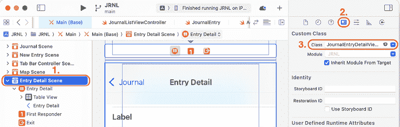

图 16.16：Entry Detail Scene 的标识检查器设置

太棒了！在下一节中，你将连接**Entry Detail Scene**中的用户界面元素到`JournalEntryDetailViewController`类的出口。通过这样做，`JournalEntryDetailViewController`实例将能够显示期刊条目的详细信息。

## 将 UI 元素连接到 JournalEntryDetailViewController 类

目前，Journal Entry Detail 屏幕的`JournalEntryDetailViewController`实例无法与其中的 UI 元素进行通信。你将在`JournalEntryDetailViewController`类中创建出口，并将**Entry Detail Scene**中的相应 UI 元素分配给每个出口。按照以下步骤操作：

1.  在项目导航器中，点击**JournalEntryDetailViewController**文件，并删除大括号之间的所有代码，除了`viewDidLoad()`方法。

1.  在`JournalEntryDetailViewController`类中开括号之后添加以下属性：

    ```swift
    // MARK: - Properties
    @IBOutlet var dateLabel: UILabel!
    @IBOutlet var titleLabel: UILabel!
    @IBOutlet var bodyTextView: UITextView!
    @IBOutlet var photoImageView: UIImageView! 
    ```

1.  点击**Main**故事板文件，并在文档大纲中选择**Entry Detail Scene**。

1.  点击连接检查器按钮，从**dateLabel**出口拖动到**Entry Detail Scene**中的第一个标签：

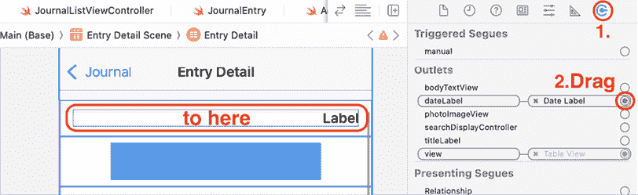

图 16.17：连接检查器显示 dateLabel 出口

1.  从**titleLabel**出口拖动到**Entry Detail Scene**中的第二个标签：

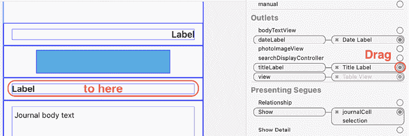

图 16.18：连接检查器显示 titleLabel 出口

1.  从**bodyTextView**出口拖动到**Entry Detail Scene**中的文本视图：

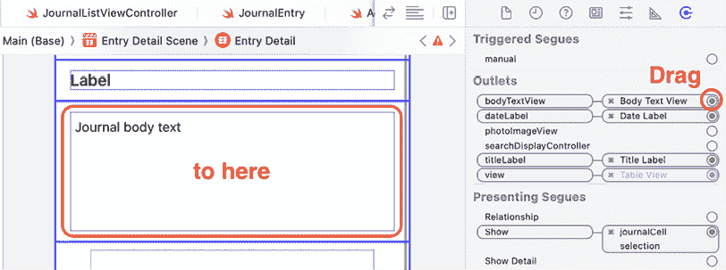

图 16.19：连接检查器显示 bodyTextView 出口

1.  从**photoImageView**出口拖动到**“条目详情场景”**中的图像视图：

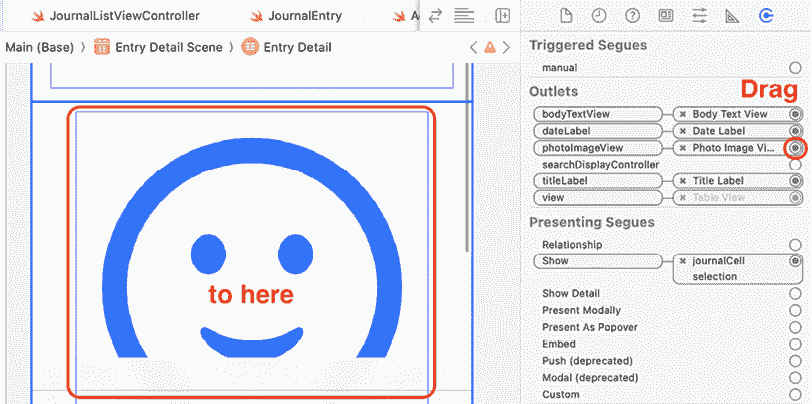

图 16.20：连接检查器显示 photoImageView 出口

记住，如果您犯了一个错误，您可以点击**x**来断开连接，然后再次从出口拖动到 UI 元素。

您现在已成功将**“条目详情”**场景中的 UI 元素连接到`JournalEntryDetailViewController`类中的出口。在下一节中，您将实现代码，当用户在**日记列表**屏幕上点击表格视图单元格时，显示`JournalEntry`实例的详细信息。

## 显示日记条目的详细信息

到目前为止，您已实现了`JournalEntryDetailViewController`类，并将此类中的出口连接到**“条目详情”**场景中的标签、文本视图和图像视图。当用户在**日记列表**屏幕上点击表格视图单元格时，您将从数据源获取相应的`JournalEntry`实例，并将其传递给`JournalEntryDetailViewController`实例以在**日记条目详情**屏幕上显示。为此，您将在`JournalListViewController`类中实现`prepare(for:sender:)`方法。按照以下步骤操作：

1.  在项目导航器中，点击**Main**故事板文件，然后点击连接**“日记场景”**和**“条目详情场景”**的过渡。点击属性检查器按钮，在**Storyboard Segue**下设置**Identifier**为`entryDetail`：

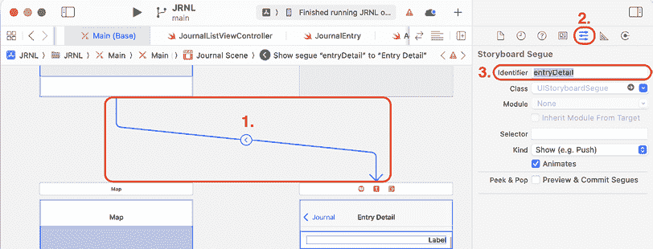

图 16.21：属性检查器显示 Identifier 设置为 entryDetail

您将稍后使用此标识符来识别从**“日记”**场景到**“条目详情”**场景的过渡。

1.  在项目导航器中点击**JournalEntryDetailViewController**文件，并在出口声明之后添加以下属性到`JournalEntryDetailViewController`类中：

    ```swift
    //MARK: - Properties
    @IBOutlet var dateLabel: UILabel!
    @IBOutlet var titleLabel: UILabel!
    @IBOutlet var bodyTextView: UITextView!
    @IBOutlet var photoImageView: UIImageView!
    **var****selectedJournalEntry****:** **JournalEntry****?** 
    ```

您传递给`JournalEntryDetailViewController`实例的`JournalEntry`实例将被分配给`selectedJournalEntry`属性。

1.  在项目导航器中点击**JournalListViewController**文件，并在表格视图委托方法之后实现`JournalListViewController`类中的`prepare(for:sender:)`方法，如下所示：

    ```swift
    // MARK: - Navigation
    override func prepare(for segue: UIStoryboardSegue, sender: Any?) {
      super.prepare(for: segue, sender: sender)
      guard segue.identifier == "entryDetail" else {
        return
      }
      guard let journalEntryDetailViewController = 
      segue.destination as? 
      JournalEntryDetailViewController, 
      let selectedJournalEntryCell = sender as?
      JournalListTableViewCell, 
      let indexPath = tableView.indexPath(for:
      selectedJournalEntryCell) else {
        fatalError("Could not get indexPath")
      }
      let selectedJournalEntry = journalEntries[indexPath.row]
      journalEntryDetailViewController.selectedJournalEntry =
      selectedJournalEntry
    } 
    ```

让我们分解一下：

```swift
guard segue.identifier == "entryDetail" else {
  return
} 
```

此代码检查是否使用了正确的过渡，如果没有，则方法退出。

```swift
guard let journalEntryDetailViewController = segue.destination as? JournalEntryDetailViewController, 
let selectedJournalEntryCell = sender as? JournalListTableViewCell, 
let indexPath = tableView.indexPath(for: selectedJournalEntryCell) else {
  fatalError("Could not get indexpath")
} 
```

此代码检查目标视图控制器是否为`JournalEntryDetailViewController`的实例，获取用户点击的表格视图单元格，并获取该单元格的索引路径。

```swift
let selectedJournalEntry = journalEntries[indexPath.row] 
```

此语句从`journalEntries`数组中获取相应的`JournalEntry`实例。

```swift
journalEntryDetailViewController.selectedJournalEntry = selectedJournalEntry 
```

此语句将`JournalEntry`实例分配给目标视图控制器的`selectedJournalEntry`属性。

你现在已经添加了代码，当从日记列表屏幕切换到日记条目详情屏幕时，会将用户点击的表格视图单元格对应的日记条目传递给`JournalEntryDetailViewController`实例。在下一节中，你将修改`JournalEntryDetailViewController`类以显示日记条目的详细信息。

## 显示选定的日记条目的详细信息

当切换到日记条目详情屏幕时，用户点击的表格视图单元格对应的`JournalEntry`实例将被分配给`JournalEntryDetailViewController`实例的`selectedJournalEntry`属性。你需要在`JournalEntryDetailViewController`类中添加代码以访问此属性并显示日记条目的详细信息。请按照以下步骤操作：

1.  在项目导航器中，点击**JournalEntryDetailViewController**文件，并修改`JournalEntryDetailViewController`类的`viewDidLoad()`方法，如图所示以显示日记条目的详细信息：

    ```swift
    override func viewDidLoad() {
      super.viewDidLoad()
    **dateLabel****.****text****=****selectedJournalEntry****?****.****date****.****formatted****(**
     **.****dateTime****.****day****().****month****(.****wide****).****year****()**
     **)**
    **titleLabel****.****text****=****selectedJournalEntry****?****.****title**
    **bodyTextView****.****text****=****selectedJournalEntry****?****.****body**
    **photoImageView****.****image****=****selectedJournalEntry****?****.****photo**
    } 
    ```

如你所见，之前传递给此视图控制器的`JournalEntry`实例的属性被用来填充用户界面元素。请注意，`date`属性需要在分配给`dateLabel text`属性之前格式化为字符串。

1.  构建并运行你的项目，并点击一个表格视图单元格。与该表格视图单元格对应的日记条目的详细信息将在日记条目详情屏幕上显示：

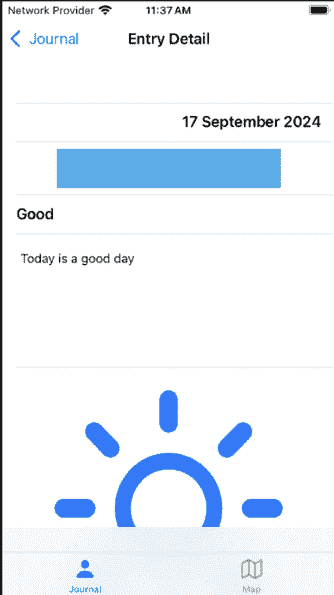

图 16.22：模拟器显示日记条目详情屏幕

恭喜！你已经成功实现了日记条目详情屏幕的视图控制器。现在，当用户在日记列表屏幕上点击表格视图单元格时，你将能够在其中显示日记条目的详细信息。

# 摘要

在本章中，你学习了如何从一个视图控制器传递数据到另一个视图控制器。你实现了添加新日记条目屏幕的视图控制器，然后你添加了代码从添加新日记条目屏幕传递数据到日记列表屏幕。接下来，你学习了如何在日记列表屏幕上删除日记条目。之后，你学习了文本字段和文本视图代理方法，最后你学习了如何从日记列表屏幕传递数据到日记条目详情屏幕。

你现在知道如何在不同视图控制器之间传递数据，以及如何使用文本字段和文本视图代理方法。这将使你能够轻松地在自己的应用程序中在不同视图控制器之间传递数据。酷！

在下一章中，你将在地图屏幕中添加一个视图控制器，并配置它使用地图标记显示日记条目位置。你还将配置地图标记，以便在标记呼出菜单中的按钮被点击时显示日记条目详情屏幕。

# 加入我们的 Discord！

与其他用户、专家以及作者本人一起阅读这本书。提出问题，为其他读者提供解决方案，通过“问我任何问题”的环节与作者聊天，以及更多。扫描二维码或访问链接加入社区。

[`packt.link/ios-Swift`](https://packt.link/ios-Swift%0D)


