# 17

# 开始使用 Core Location 和 MapKit

在上一章中，你学习了如何从“添加新日志条目”屏幕传递数据到日志列表屏幕，以及从日志列表屏幕传递数据到日志条目详情屏幕。你还学习了`UITextFieldDelegate`和`UITextViewDelegate`方法。

在本章中，你将学习如何使用苹果的**Core Location**框架获取设备位置，以及如何使用苹果的**MapKit**框架设置地图区域、显示地图标注和创建地图快照。如果你计划构建使用地图的应用程序，例如*Apple Maps*或*Waze*，这将非常有用。

首先，你将修改“添加新日志条目”屏幕，以便用户可以将他们的当前位置添加到新的日志条目中。接下来，你将创建一个`MapViewController`类（地图屏幕的视图控制器）并配置它以显示以你的位置为中心的地图区域。然后，你将更新`JournalEntry`类以符合**MKAnnotation**协议，这允许你将日志条目作为地图标注添加到地图中。之后，你将修改`MapViewController`类以在之前设置的地图区域内显示每个日志条目的标记。你将配置标记以显示呼出视图，并在呼出视图中配置按钮，以便在点击时显示日志条目详情屏幕。最后，你将修改`JournalEntryViewController`类，在日志条目详情屏幕中显示显示日志条目制作位置的地图快照。

到本章结束时，你将学会如何使用 Core Location 获取设备位置，以及如何使用 MapKit 指定地图区域、将地图标注视图添加到地图中，以及创建地图快照。

本章将涵盖以下主题：

+   使用 Core Location 框架获取设备位置

+   将`JournalEntry`类更新为符合`MKAnnotation`协议

+   在地图屏幕上显示标注视图

+   在日志条目详情屏幕上显示地图快照

# 技术要求

你将继续在上一章中修改的`JRNL`项目上工作。

本章的资源文件和完成的 Xcode 项目位于本书代码包的`Chapter17`文件夹中，可以在此处下载：

[`github.com/PacktPublishing/iOS-18-Programming-for-Beginners-Ninth-Edition`](https://github.com/PacktPublishing/iOS-18-Programming-for-Beginners-Ninth-Edition%0D)

查看以下视频以查看代码的实际效果：

[`youtu.be/6WE5Ed6jIWk`](https://youtu.be/6WE5Ed6jIWk%0D)

在下一节中，你将学习如何使用 Core Location 框架获取设备位置。

# 使用 Core Location 框架获取设备位置

每个 iPhone 都有多种确定其位置的方式，包括 Wi-Fi、GPS、蓝牙、磁力计、气压计和蜂窝硬件。Apple 创建了 Core Location 框架，以使用 iOS 设备上所有可用的组件来收集位置数据。

要了解更多关于 Core Location 的信息，请参阅[`developer.apple.com/documentation/corelocation`](https://developer.apple.com/documentation/corelocation)。

要配置您的应用程序使用 Core Location，您需要创建一个`CLLocationManager`实例，该实例用于配置、启动和停止位置服务。接下来，您将创建一个`CLLocationUpdate`实例，这是一个包含由 Core Location 框架提供的位置信息的结构。调用`CLLocationUpdate`类型的`liveUpdates`方法告诉 Core Location 开始提供包含用户位置、授权状态和位置可用性的位置更新。

要了解更多关于`CLLocationManager`类的信息，请参阅[`developer.apple.com/documentation/corelocation/configuring_your_app_to_use_location_services`](https://developer.apple.com/documentation/corelocation/configuring_your_app_to_use_location_services)。

您可以在此处观看 Apple 的 WWDC 2023 视频，了解简化的位置更新：[`developer.apple.com/videos/play/wwdc2023/10180/`](https://developer.apple.com/videos/play/wwdc2023/10180/)。

由于位置信息被视为敏感用户数据，您还需要获得授权才能使用位置服务。您还可以检查由`CLLocationUpdate`类型的`liveUpdates`方法提供的位置更新授权状态。

要了解更多关于请求使用位置服务的授权信息，请参阅[`developer.apple.com/documentation/corelocation/requesting_authorization_to_use_location_services`](https://developer.apple.com/documentation/corelocation/requesting_authorization_to_use_location_services)。

您可以在此处观看 Apple 的 WWDC 2024 视频，了解**位置授权的新功能**：[`developer.apple.com/videos/play/wwdc2024/10212/`](https://developer.apple.com/videos/play/wwdc2024/10212/)。

在下一节中，您将修改`AddJournalEntryViewController`类，以便用户在创建新的日记条目时可以分配位置。

## 修改`AddJournalEntryViewController`类

目前，添加新日记条目屏幕有一个**获取位置**开关，但目前它还没有任何作用。您将为这个开关在`AddJournalEntryViewController`类中添加一个输出端口，并在开关打开时将其修改为将位置添加到`JournalEntry`实例。请按照以下步骤操作：

1.  在项目导航器中，点击`AddJournalEntryViewController`文件。在此文件中，在`import UIKit`语句之后添加一个`import`语句以导入 Core Location 框架：

    ```swift
    import UIKit
    **import** **CoreLocation** 
    ```

1.  在文件中的所有其他代码之后添加一个`AddJournalEntryViewController`类的扩展：

    ```swift
    extension AddJournalEntryViewController {
      // MARK: - CoreLocation
    } 
    ```

你将在稍后在这个扩展中实现请求使用用户私人数据并确定用户位置的代码。

1.  在`AddJournalEntryViewController`类中，在其他所有输出端口之后，添加用于获取位置开关及其旁边的标签的输出端口：

    ```swift
    @IBOutlet var photoImageView: UIImageView!
    @IBOutlet var saveButton: UIBarButtonItem!
    **@IBOutlet****var****getLocationSwitch****:** **UISwitch****!**
    **@IBOutlet****var****getLocationSwitchLabel****:** **UILabel****!**
    var newJournalEntry: JournalEntry? 
    ```

1.  在所有其他属性声明之后，添加用于存储`CLLocationManager`类实例、一个将管理位置更新的异步任务以及当前设备位置的属性：

    ```swift
    var newJournalEntry: JournalEntry?
    **private let****locationManager****=****CLLocationManager****()**
    **private var** **locationTask****=****Task****<****Void****,** **Error****>?**
    **private var****currentLocation****:** **CLLocation****?** 
    ```

所有这些属性都是`private`的，因为它们将仅在此类中使用。

1.  在`AddJournalEntryViewController`扩展中，在闭合花括号之前实现一个用于确定用户位置的方法：

    ```swift
    private func fetchUserLocation() {
      locationManager.requestWhenInUseAuthorization()
      self.locationTask = Task {
        for try await update in 
        CLLocationUpdate.liveUpdates() {
          if let location = update.location  {
            updateCurrentLocation(location)
          } else if update.authorizationDenied {
            failedToGetLocation(message: "Check Location 
            Services settings for JRNL in Settings > Privacy 
            & Security.")
          } else if update.locationUnavailable {
            failedToGetLocation(message: "Location    
            Unavailable")
          }
        }
      }
    } 
    ```

让我们分解一下：

```swift
locationManager.requestWhenInUseAuthorization() 
```

此语句请求用户允许使用他们的位置信息。

```swift
self.locationTask = Task { 
```

此语句将一个将不断获取位置更新的异步任务分配给`locationTask`属性。

```swift
for try await update in 
CLLocationUpdate.liveUpdates() { 
```

此语句获取`CLLocation.liveUpdates()`提供的更新，并将每个更新分配给一个`update`实例。

```swift
if let location = update.location  {
  updateCurrentLocation(location)
} 
```

此语句从`update`实例获取用户位置并调用`updateCurrentLocation`方法。

```swift
else if update.authorizationDenied {
failedToGetLocation(message: "Check Location 
Services settings for JRNL in Settings > Privacy & Security."))} 
```

如果用户没有授权使用他们的私人数据，此语句将调用`failedToGetLocation(message:)`方法。

```swift
else if update.locationUnavailable {
failedToGetLocation(message: "Location    
Unavailable")
} 
```

如果用户的位置信息不可用，此语句将调用`failedToGetLocation(message:)`方法。

你将看到错误消息，因为`fetchUserLocation()`调用的方法尚未实现。

1.  在`AddJournalEntryViewController`扩展的闭合花括号之前，实现由`fetchUserLocation(`)类调用的`updateCurrentLocation(_:)`方法：

    ```swift
    private func updateCurrentLocation(_ location: CLLocation) {
      let interval = location.timestamp.timeIntervalSinceNow
      if abs(interval) < 30 {
        self.locationTask?.cancel()
        getLocationSwitchLabel.text = "Done"
        let lat = location.coordinate.latitude
        let long = location.coordinate.longitude
        currentLocation = CLLocation(latitude: lat, 
        longitude: long)
      }
    } 
    ```

此方法首先获取`location`的时间戳。此位置可能是一个旧的、缓存的地址，而不是实际的位置，因此时间戳与当前日期和时间进行比较。如果持续时间小于 30 秒，这表明用户的位置是当前的。在这种情况下，取消分配给`locationTask`的异步任务，将获取位置开关标签的文本设置为`完成`，并将`currentLocation`属性设置为这个位置。

1.  在`AddJournalEntryViewController`扩展的闭合花括号之前，实现由`fetchUserLocation(`)类调用的`failedToGetLocation(message:)`方法：

    ```swift
    private func failedToGetLocation(message: String) {
      self.locationTask?.cancel()
      getLocationSwitch.setOn(false, animated: true)
      getLocationSwitchLabel.text = "Get location"
      let alertController = UIAlertController(title: 
      "Failed to get location", message: message, 
      preferredStyle: .alert)
      let okAction = UIAlertAction(title: "OK", style: 
      .default)
      alertController.addAction(okAction)
      present(alertController, animated: true)
    } 
    ```

此方法将取消分配给`locationTask`的异步任务，将获取位置开关和标签的值重置为其初始值，并显示一个配置了适当错误消息的警告。

1.  在`AddJournalEntryViewController`类中，在闭合花括号之前实现一个动作，当获取位置开关的值改变时执行：

    ```swift
    // MARK: - Actions
    @IBAction func locationSwitchValueChanged(_ sender: UISwitch) {
      if getLocationSwitch.isOn {
        getLocationSwitchLabel.text = "Getting location..."
        fetchUserLocation()
      } else {
        currentLocation = nil
        getLocationSwitchLabel.text = "Get location"
        self.locationTask?.cancel()
      }
    } 
    ```

如果获取位置开关处于开启状态，开关标签文本设置为`获取位置...`，并调用`fetchUserLocation()`方法。如果开关处于关闭状态，`currentLocation`将被设置为`nil`，开关标签文本重置为`获取位置`，并且分配给`locationTask`的异步任务被取消。

1.  修改`prepare(for:sender:)`方法以向`JournalEntry`实例添加位置信息：

    ```swift
    override func prepare(for segue: UIStoryboardSegue, sender: Any?) {
      let title = titleTextField.text ?? ""
      let body = bodyTextView.text ?? ""
      let photo = photoImageView.image
      let rating = 3
    **let** **lat** **=****currentLocation****?****.****coordinate****.****latitude**
    **let** **long** **=****currentLocation****?****.****coordinate****.****longitude**
      newJournalEntry = JournalEntry(rating: rating, title: 
      title, body: body, photo: photo**,** **latitude****: lat,** 
    **longitude****: long**)
    } 
    ```

1.  修改`updateSaveButtonState()`方法，以便在获取位置开关开启后仅当找到位置时启用**保存**按钮：

    ```swift
    private func updateSaveButtonState() {
      let textFieldText = titleTextField.text ?? ""
      let textViewText = bodyTextView.text ?? ""
    **let** **textIsValid** **=****!****textFieldText.****isEmpty****&&**
    **!****textViewText.****isEmpty**
    **if****getLocationSwitch****.****isOn** **{**
    **saveButton****.****isEnabled****=** **textIsValid** 
    **&&****currentLocation****!=****nil**
     **}** **else** **{**
    **saveButton****.****isEnabled****=** **textIsValid**
     **}**
    } 
    ```

1.  在`updateCurrentLocation(_:)`中调用`updateSaveButtonState()`，以便在找到位置后更新**保存**按钮的状态：

    ```swift
     currentLocation = CLLocation(latitude: lat,    
          Longitude: long
          **updateSaveButtonState****()**
      }
    } 
    ```

1.  在项目导航器中点击`Main`故事板文件。在文档大纲中点击**新条目场景**。

1.  大多数日记条目可能不需要位置，因此您将获取位置开关的默认值设置为**关闭**。点击获取位置开关并点击属性检查器按钮。在**开关**下，将**状态**设置为**关闭**：

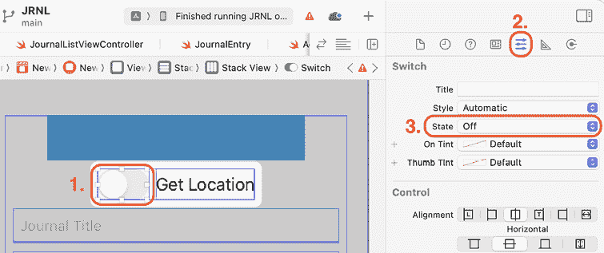

图 17.1：属性检查器显示将获取位置开关状态设置为关闭

1.  在文档大纲中点击**新条目场景**，然后点击连接检查器按钮。将**getLocationSwitch**出口连接到**新条目场景**中的获取位置开关：


图 17.2：连接检查器显示 getLocatioSwitch 出口

1.  将**getLocationSwitchLabel**出口连接到**新条目场景**中获取位置开关旁边的标签：


图 17.3：连接检查器显示 getLocatioSwitchLabel 出口

1.  将**locationSwitchValueChanged**动作连接到获取位置开关，并从弹出菜单中选择**值已更改**：

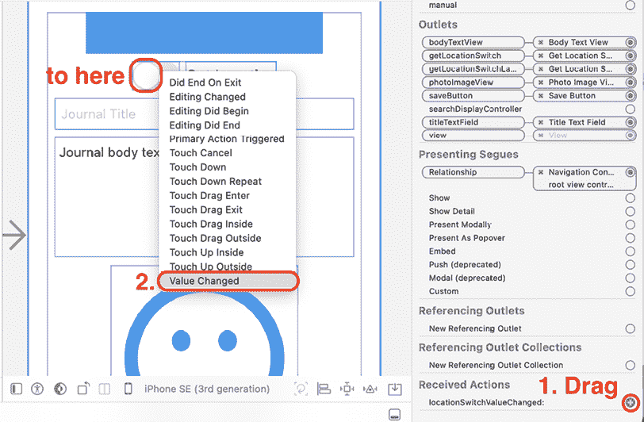

图 17.4：属性检查器显示 getLocatioSwitchValueChanged 出口

您已完成对`AddJournalEntryViewController`类的修改。在下一节中，您将学习如何配置应用程序以访问用户数据。

## 修改 Info.plist 文件

由于您的应用程序使用用户数据，您需要请求用户允许使用它。为此，您需要在应用程序的`Info.plist`文件中添加一个新的设置。按照以下步骤操作：

1.  在项目导航器中点击`Info.plist`文件。如果将指针移至**信息属性列表**行，您将看到一个小的**+**按钮。点击它以创建一个新行：


图 17.5：编辑区域显示 Info.plist 的内容

1.  在新行中，将**键**设置为**Privacy - Location When In Use Usage Description**，并将**值**设置为`此应用程序使用您的位置来记录日记条目`。完成操作后，您的`Info.plist`文件应如下所示：


图 17.6：添加新行后的 Info.plist

1.  启动模拟器并从模拟器的**功能**菜单中选择**位置** | **苹果**来模拟一个位置：

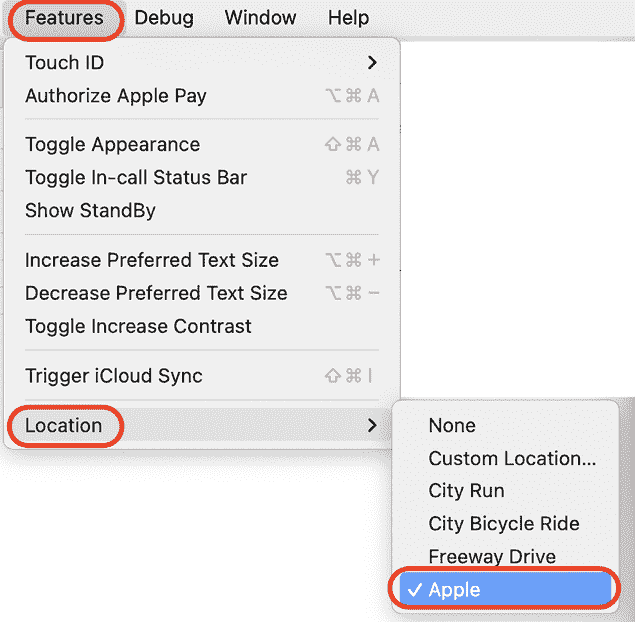

图 17.7：从模拟器的功能菜单中选择位置 | 苹果

1.  构建并运行你的应用，点击**+**按钮以显示新建日记条目屏幕。当提示时，点击**允许在应用使用时**按钮：

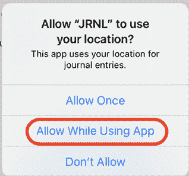

图 17.8：显示允许在应用使用时高亮的警告

注意，这个警告将在本章第一次启动你的应用时出现，你选择的设置将在后续启动中默认使用。

1.  输入日记条目的标题和正文，并将获取位置开关设置为开启：

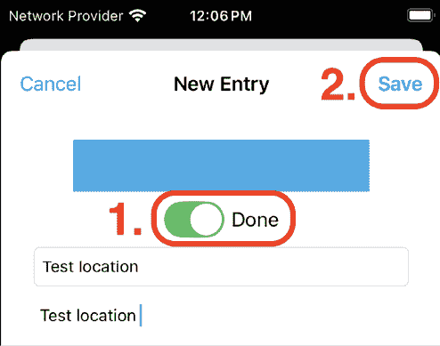

图 17.9：显示获取位置开关的新建日记条目屏幕

一旦确定了位置，获取位置开关旁边的标签将显示**完成**，并且**保存**按钮将变为活动状态。

1.  点击**保存**。你将被返回到日记列表屏幕。

到目前为止，获取位置开关及其旁边的标签已经连接到`AddJournalEntryViewController`类中的输出，获取设备位置的函数已经分配给获取位置开关，并且已经添加了将你的位置添加到新的`JournalEntry`实例所需的所有代码。太棒了！

在下一节中，你将创建一个地图屏幕的视图控制器，并配置它以显示当前设备的位置。

## 创建 MapViewController 类

在**第十二章**，*完成用户界面*中，你已经在地图屏幕中添加了一个地图视图。地图视图是`MKMapView`类的一个实例。你可以在苹果地图应用中看到它的样子。

要了解更多关于`MKMapView`的信息，请参阅[`developer.apple.com/documentation/mapkit/mkmapview`](https://developer.apple.com/documentation/mapkit/mkmapview)。

当你构建并运行你的应用时，你将在屏幕上看到一个地图。你可以通过设置地图视图的`region`属性来指定屏幕上可见的地图部分。

要了解更多关于区域及其创建方法的信息，请参阅[`developer.apple.com/documentation/mapkit/mkmapview/1452709-region`](https://developer.apple.com/documentation/mapkit/mkmapview/1452709-region)。

你将创建一个新的类，`MapViewController`，作为地图屏幕的视图控制器，并使用 Core Location 来确定将要显示的地图区域的中心点。按照以下步骤操作：

1.  通过在**JRNL**组上右键单击并选择**新建组**，在你的项目中创建一个新的组。将此组命名为`Map Screen`，并将其移动到**日记条目详情屏幕**组下方。

1.  右键单击**地图屏幕**组并选择**从模板新建文件...**。

1.  **iOS**应该已经选中。选择**Cocoa Touch 类**并点击**下一步**。

1.  使用以下详细信息配置该类：

    +   **类**：`MapViewController`

    +   **子类**：`UIViewController`

    +   **也创建 XIB**：未勾选

    +   **语言**：**Swift**

完成后点击**下一步**。

1.  点击**创建**。`MapViewController`文件出现在项目导航器中，其内容出现在编辑器区域：

1.  在现有的`import`语句之后添加代码以导入`Core Location`和`MapKit`框架：

    ```swift
    import UIKit
    **import** **CoreLocation**
    **import** **MapKit** 
    ```

1.  在文件中的所有其他代码之后为`MapViewController`类添加一个新的扩展：

    ```swift
    extension MapViewController {
    // MARK: - CoreLocation
    } 
    ```

你将在本扩展中实现代码以请求使用用户的私人数据并确定用户的位置：

1.  在`MapViewController`类中，在开括号之后添加一个用于地图视图的输出：

    ```swift
    // MARK: - Properties
    @IBOutlet var mapView: MKMapView! 
    ```

1.  在`mapView`属性之后添加属性以保存`CLLocationManager`实例和异步任务：

    ```swift
    @IBOutlet var mapView: MKMapView!
    **private let****locationManager****=****CLLocationManager****()**
    **private var** **locationTask****=****Task****<****Void****,** **Error****>?** 
    ```

1.  在`MapViewController`扩展中闭括号之前实现一个确定用户位置的方法：

    ```swift
    private func fetchUserLocation() {
      locationManager.requestWhenInUseAuthorization()
      self.navigationItem.title = "Getting location..."
      self.locationTask = Task {
        for try await update in CLLocationUpdate.liveUpdates() {
          if let location = update.location  {
            updateMapWithLocation(location)
          } else if update.authorizationDenied {
            failedToGetLocation(message: "Check Location Services
            settings for JRNL in Settings > Privacy & Security.")
          } else if update.locationUnavailable {
            failedToGetLocation(message: "Location Unavailable")
          }
        }
      }
    } 
    ```

此方法与你在`AddJournalEntryViewController`扩展中实现的`fetchUserLocation()`方法类似。首先，它将请求使用私人用户数据的权限并将地图屏幕的标题设置为`Getting location...`。接下来，将一个异步任务分配给`locationTask`，以连续确定用户的位置。如果找到用户的位置，地图将更新以显示用户的位置。否则，将显示一个带有适当错误消息的警报：

注意，由于`fetchUserLocation()`调用的方法尚未实现，你将看到错误消息：

1.  在闭括号之前在`MapViewController`扩展中实现缺失的方法：

    ```swift
    private func updateMapWithLocation(_ location: CLLocation) {
      let interval = location.timestamp.timeIntervalSinceNow
      if abs(interval) < 30 {
        self.locationTask?.cancel()
        let lat = location.coordinate.latitude
        let long = location.coordinate.longitude
        navigationItem.title = "Map"
        mapView.region = MKCoordinateRegion(center: 
        CLLocationCoordinate2D(latitude: lat, 
        longitude: long), span: MKCoordinateSpan(
        latitudeDelta: 0.01, longitudeDelta: 0.01))
      }
    }
    private func failedToGetLocation(message: String) {
      self.locationTask?.cancel()
      navigationItem.title = "Location not found"
      let alertController = UIAlertController(title: 
      "Failed to get location", message: message, 
      preferredStyle: .alert)
      let okAction = UIAlertAction(title: "OK", 
      style: .default)
      alertController.addAction(okAction)
      present(alertController, animated: true)
    } 
    ```

这些方法与你在`AddJournalEntryViewController`扩展中之前实现的`updateCurrentLocation(location:)`和`failedToGetLocation(message:)`方法类似：

`updateMapWithLocation(location:)`方法将设置地图屏幕的标题为`Map`，创建一个以用户位置为中心的地图区域，并将其分配给`mapView`属性：

如果拒绝使用用户数据或位置不可用，`failedToGetLocation(message:)`方法将设置地图屏幕的标题为`Location not found`并显示适当的错误消息：

1.  修改`MapViewController`类的`viewDidLoad()`方法，如所示调用`fetchUserLocation()`：

    ```swift
    override func viewDidLoad() {
      super.viewDidLoad()
    **fetchUserLocation****()**
    } 
    ```

1.  在项目导航器中点击`Main`故事板文件，然后点击文档大纲中的第一个**Map Scene**。点击身份检查器按钮，在**自定义类**下将**类**设置为`MapViewController`：


图 17.10：地图场景的身份检查器设置

1.  点击连接检查器以显示**Map Scene**的所有输出。从**mapView**输出拖动到**Map Scene**中的地图视图：

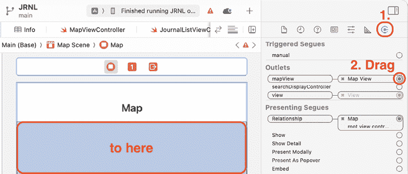

图 17.11：连接检查器显示 mapView 输出

记住，如果你犯了错误，你可以点击**x**来断开连接，然后再次从输出拖动到 UI 元素：

1.  构建并运行你的应用，并确保从模拟器的**功能** | **位置**菜单中选择了**Apple**。点击**地图**标签按钮以显示一个以你选择的地点为中心的地图区域，在这个例子中，是苹果公司园区：

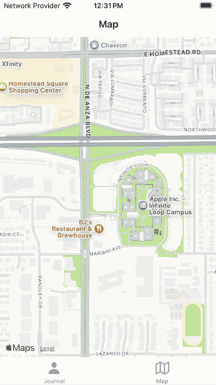

图 17.12：模拟器显示以你的位置为中心的地图

你可以通过选择**功能** | **位置** | **自定义位置**并在其中输入所需位置的经纬度来在模拟器中模拟任何位置。

由于`viewDidLoad()`在`MapViewController`实例加载视图时只调用一次，因此如果用户的位置在最初设置后发生变化，地图将不会更新。此外，如果你在实际的 iOS 设备上运行应用，你会发现确定位置需要很长时间。你将在下一章中解决这两个问题。

你已经成功为地图屏幕创建了一个新的视图控制器，并配置它显示以你的设备位置为中心的地图区域。太棒了！在下一节中，你将了解`MKAnnotation`协议，以及如何使一个类符合它。

# 将 JournalEntry 类更新为符合 MKAnnotation 协议

当你在 iPhone 上的*地图*应用中操作时，你可以点击并按住地图来放置一个标记：

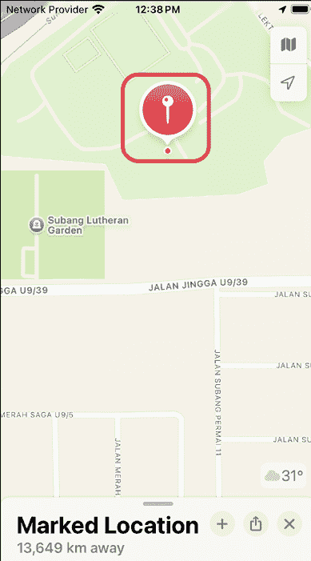

图 17.13：地图应用显示放置的标记

要在你的应用中为地图视图添加标记，你需要一个符合`MKAnnotation`协议的类。此协议允许你将此类的一个实例与特定位置关联。

要了解更多关于`MKAnnotation`协议的信息，请参阅[`developer.apple.com/documentation/mapkit/mkannotation`](https://developer.apple.com/documentation/mapkit/mkannotation)。

任何类都可以通过实现包含位置的`coordinate`属性来采用`MKAnnotation`协议。可选的`MKAnnotation`协议属性包括`title`，它包含注释的标题，以及`subtitle`，它包含注释的副标题。

当符合`MKAnnotation`协议的类的实例位于屏幕上可见的地图区域时，地图视图会要求其代理（通常是视图控制器）提供一个相应的`MKAnnotationView`类的实例。此实例在地图上显示为一个标记。

要了解更多关于`MKAnnotationView`的信息，请参阅[`developer.apple.com/documentation/mapkit/mkannotationview`](https://developer.apple.com/documentation/mapkit/mkannotationview)。

如果用户滚动地图并且`MKAnnotationView`实例离开屏幕，它将被放入重用队列并在稍后回收，就像表格视图单元格和集合视图单元格被回收一样。

要在地图屏幕上表示日志条目位置，你需要修改 `JournalEntry` 类以使其符合 `MKAnnotation` 协议。这个类将有一个 `coordinate` 属性来存储日志条目的位置，一个 `title` 属性来存储日志条目日期，以及一个 `subtitle` 属性来存储日志条目标题。你将使用 `JournalEntry` 实例的 `latitude` 和 `longitude` 属性来计算分配给 `coordinate` 属性的值。按照以下步骤操作：

1.  在项目导航器中，点击 `JournalEntry` 文件（位于 **Journal List Screen** | **Model** 组内）。在 `import UIKit` 语句之后输入以下内容以导入 `MapKit` 框架：

    ```swift
    import UIKit
    **import** **MapKit** 
    ```

这允许你在代码中使用 `MKAnnotation` 协议。

1.  `MKAnnotation` 协议有一个可选的 `title` 属性，你将在稍后使用。你将把 `JournalEntry` 类中的 `title` 属性名称改为 `entryTitle`，这样你就不需要两个具有相同名称的属性。右键单击 `title` 属性，从弹出菜单中选择 **重构 | 重命名**。

1.  将新名称设置为 `entryTitle`，如图所示，然后点击 **重命名**：

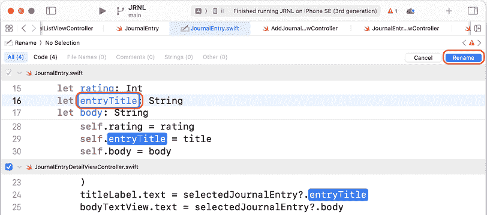

图 17.14：将标题属性重命名为 entryTitle

1.  将 `JournalEntry` 类声明修改如下，使其成为 `NSObject` 类的子类并采用 `MKAnnotation` 协议：

    ```swift
    class JournalEntry**:** **NSObject****,** **MKAnnotation**{ 
    ```

1.  你会看到一个错误，因为你还没有实现 `coordinate` 属性，这是符合 `MKAnnotation` 协议所必需的。在初始化器之后输入以下内容：

    ```swift
    // MARK: - MKAnnotation
    var coordinate: CLLocationCoordinate2D {
      guard let lat = latitude, let long = longitude else {
        return CLLocationCoordinate2D()
      }
      return CLLocationCoordinate2D(latitude: lat,   longitude: long)
    } 
    ```

`coordinate` 属性是 `CLLocationCoordinate2D` 类型，它包含一个地理位置。`coordinate` 属性的值不是直接分配的；`guard` 语句从 `latitude` 和 `longitude` 属性获取纬度和经度值，然后使用这些值来创建 `coordinate` 属性的值。这样的属性被称为 **计算属性**。

1.  要实现可选的 `title` 属性，在 `coordinate` 属性之后输入以下内容：

    ```swift
    var title: String? {
      date.formatted(
        .dateTime.day().month().year()
      )
    } 
    ```

这是一个计算属性，返回格式化为字符串的日志条目日期。

1.  要实现可选的 `subtitle` 属性，在 `title` 属性之后输入以下内容：

    ```swift
    var subtitle: String? {
      entryTitle
    } 
    ```

这是一个计算属性，返回日志条目标题。

到目前为止，你已经修改了 `JournalEntry` 类以符合 `MKAnnotation` 协议。在下一节中，你将修改 `MapViewController` 类，向地图视图中添加一个 `JournalEntry` 实例数组，并且地图视图显示区域内的任何实例都将出现在地图屏幕上的一个标记上。

# 在地图屏幕上显示注释视图

当前地图屏幕显示以您的设备位置为中心的地图区域。现在地图区域已设置，您可以根据其 `coordinate` 属性确定哪些 `JournalEntry` 实例位于此区域。请记住，`JournalEntry` 类符合 `MKAnnotation`。作为地图视图的视图控制器，`MapViewController` 类负责为该区域内的任何 `MKAnnotation` 实例提供 `MKAnnotationView` 实例。您现在将修改 `MapViewController` 类，从 `SampleJournalEntryData` 结构中获取 `JournalEntry` 实例的数组并将其添加到地图视图中。按照以下步骤操作：

1.  在项目导航器中，点击 **JournalEntry** 文件。在 `createSampleJournalEntryData()` 方法中，修改创建 `journalEntry2` 实例的语句，如下所示：

    ```swift
    guard let journalEntry2 = JournalEntry(rating: 0, title: "Bad", body: "Today is a bad day", photo: photo2**,** **latitude****:** **37.3318****,** **longitude****:** **-****122.0312**) else {
      fatalError("Unable to instantiate journalEntry2")
    } 
    ```

此实例现在具有 `latitude` 和 `longitude` 属性的值，这些值将用于设置其 `coordinate` 属性。使用的值是靠近苹果公司校园的位置，您将在运行应用时在模拟器中设置。

您可以使用任何您想要的地点，但您需要确保该地点靠近地图的中心点，否则，针将不会显示。

1.  在项目导航器中，点击 **MapViewController** 文件。在文件中的所有其他代码之后添加一个扩展，使 `MapViewController` 类符合 `MKMapViewDelegate` 协议：

    ```swift
    extension MapViewController: MKMapViewDelegate {
    } 
    ```

1.  在 `locationTask` 属性声明之后，添加以下代码以创建一个私有属性 `annotations`，该属性将包含 `JournalItem` 实例的数组：

    ```swift
    private var locationTask: Task<Void, Error>?
    **private var****annotations****:****[****JournalEntry****] = []** 
    ```

    目前日记列表和地图屏幕之间没有连接。这意味着您使用添加新日记条目屏幕添加的任何日记条目都不会出现在地图屏幕上。您将在下一章创建一个共享实例，该实例将由两个视图控制器使用。

1.  在 `viewDidLoad()` 方法中，在闭合花括号之前，将地图视图的 `delegate` 属性设置为 `MapViewController` 实例：

    ```swift
     fetchUserLocation()
      **mapView****.****delegate****=****self**
    } 
    ```

1.  在下一行，通过调用 `sampleJournalEntryData` 结构的 `createSampleJournalEntryData()` 方法来填充 `journalEntries` 数组：

    ```swift
     mapView.delegate = self
      **annotations** **=** **JournalEntry****.****createSampleJournalEntryData****()**
    } 
    ```

1.  在下一行，添加以下语句以将所有示例日记条目（符合 `MKAnnotation` 协议）添加到地图视图中：

    ```swift
     annotations = JournalEntry.**createSampleJournalEntryData**()
      **mapView****.****addAnnotations****(****annotations****)**
    } 
    ```

地图视图的代理（在本例中为 `MapViewController` 类）现在将自动为地图屏幕上显示的地图区域内的每个 `JournalItem` 实例提供一个 `MKAnnotationView` 实例。

1.  构建并运行您的应用，并使用模拟器的 **Features** | **Location** 菜单验证位置是否已设置为 **Apple**。您应该在地图屏幕上看到一个单独的针（`MKAnnotationView` 实例）：

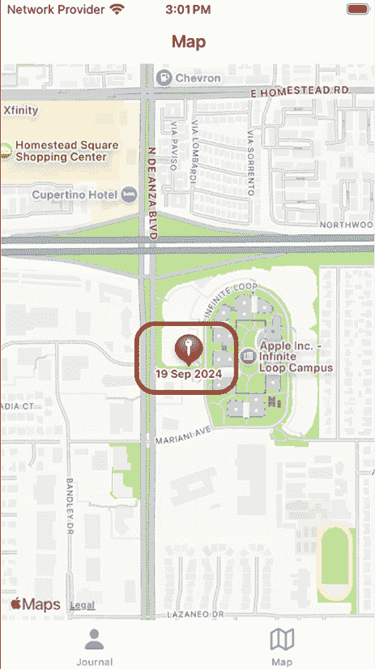

图 17.15：iOS 模拟器显示标准 MKAnnotationView 实例

地图屏幕现在可以显示图钉，但点击图钉只会使其变大。你将在下一节中添加代码，使图钉显示带有按钮的呼出窗口。

由于`viewDidLoad()`方法仅在`MapViewController`实例加载其视图时调用一次，因此在此之后添加到`journalEntries`数组中的任何带有位置的日记条目都不会作为注释添加到地图上。你将在下一章中解决这个问题。

## 配置图钉以显示呼出窗口

目前，地图屏幕显示标准的`MKAnnotationView`实例，看起来像图钉。点击图钉只会使其变大。`MKAnnotationView`实例可以被配置为在点击时显示呼出气泡。为了实现这一点，你需要实现`mapView(_:viewFor:)`方法，这是一个可选的`MKMapViewDelegate`协议方法。按照以下步骤操作：

1.  在项目导航器中点击**MapViewController**文件。在`MKMapViewDelegate`扩展中，在开括号之后添加以下方法：

    ```swift
    // MARK: - MKMapViewDelegate
    func mapView(_ mapView: MKMapView, viewFor annotation: any MKAnnotation) -> MKAnnotationView? {
      let identifier = "mapAnnotation"
      guard annotation is JournalEntry else {
        return nil
      }
      if let annotationView =
      mapView.dequeueReusableAnnotationView(withIdentifier:
      identifier) {
        annotationView.annotation = annotation
        return annotationView
      } else {
        let annotationView =
        MKMarkerAnnotationView(annotation:annotation,
        reuseIdentifier:identifier)
        annotationView.canShowCallout = true
        let calloutButton = UIButton(type: .detailDisclosure)
        annotationView.rightCalloutAccessoryView =     calloutButton
        return annotationView
      }
    } 
    ```

让我们分解一下：

```swift
func mapView(_ mapView: MKMapView, viewFor annotation: any MKAnnotation) -> MKAnnotationView? 
```

这是`MKMapViewDelegate`协议中指定的方法之一。当`MKAnnotation`实例位于地图区域内时，它会触发，并返回一个`MKAnnotationView`实例，用户将在屏幕上看到它。

```swift
let identifier = "mapAnnotation" 
```

将一个常量`identifier`赋值为`"MapAnnotation"`字符串。这将作为`MKAnnotationView`实例的重用标识符。

```swift
guard annotation is JournalEntry else {
  return nil
} 
```

这个`guard`语句检查注解是否是`JournalEntry`实例，如果不是，则返回`nil`。

```swift
if let annotationView =
mapView.dequeueReusableAnnotationView(withIdentifier:
identifier) {
  annotationView.annotation = annotation
  return annotationView 
```

这个`if`语句检查是否存在一个最初可见但现在不在屏幕上的现有`MKAnnotationView`实例。如果存在，它可以被重用，并分配给`annotationView`常量。然后，`JournalItem`实例被分配给`annotationView`的`annotation`属性，并返回`annotationView`。

```swift
} else {
    let annotationView =
    MKMarkerAnnotationView(annotation:annotation,
    reuseIdentifier:identifier) 
```

如果没有可以重用的现有`MKAnnotationView`实例，将执行`else`子句。使用之前指定的重用标识符（`MapAnnotation`）创建一个新的`MKAnnotationView`实例。

```swift
annotationView.canShowCallout = true
let calloutButton = UIButton(type: .detailDisclosure)
annotationView.rightCalloutAccessoryView = calloutButton 
```

`MKAnnotationView`实例被配置了呼出窗口。当你点击地图上的图钉时，会出现一个呼出气泡，显示标题（日记条目日期）、副标题（日记条目标题）和一个按钮。你将在稍后编程按钮以显示日记条目详情屏幕。

```swift
return annotationView 
```

返回自定义的`MKAnnotationView`实例。

要了解更多关于`mapView(_:viewFor:)`方法的信息，请参阅[`developer.apple.com/documentation/mapkit/mkmapviewdelegate/1452045-mapview`](https://developer.apple.com/documentation/mapkit/mkmapviewdelegate/1452045-mapview)。

1.  构建并运行你的应用，并在模拟器的**功能** | **位置**菜单中将位置设置为**Apple**。你应该在地图屏幕上看到一个单独的图钉。点击图钉以显示一个呼出窗口：

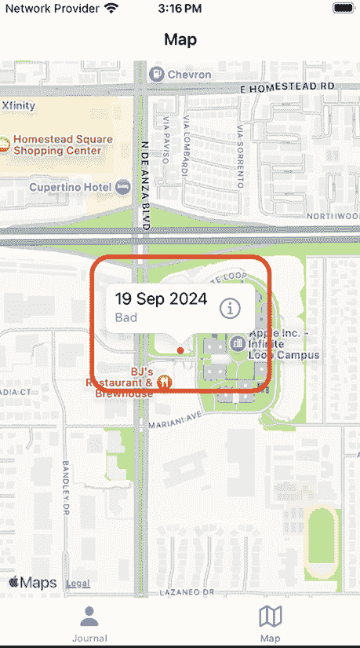

图 17.16：iOS 模拟器显示在点击图钉时出现的呼出窗口

您已成功创建了一个自定义的 `MKAnnotationView`，当点击时会显示一个呼出窗口，但点击呼出气泡中的按钮目前还没有任何反应。您将在下一节中配置按钮以显示日记条目详情屏幕。

## 从地图屏幕转到日记条目详情屏幕

到目前为止，地图屏幕现在显示了一个 `MKAnnotationView` 实例，点击它会显示一个显示日记条目详情的呼出气泡。尽管呼出气泡中的按钮目前还不能工作。

要从呼出按钮显示日记条目详情屏幕，您将在地图屏幕和日记条目详情屏幕之间添加一个转换，并实现可选的 `MKMapViewDelegate` 协议方法 `mapView(_:annotationView:calloutAccessoryControlTapped:)`，以便在点击呼出按钮时执行该转换。按照以下步骤操作：

1.  在项目导航器中点击 **Main** 故事板文件。在文档大纲中找到 **Map Scene** 下的 **Map** 图标。*Ctrl* + *拖动* 从 **Map** 图标到 **Entry Detail** **Scene** 并从弹出菜单中选择 **Show** 以在 **Map** **Scene** 和 **Entry Detail** **Scene** 之间添加一个转换：

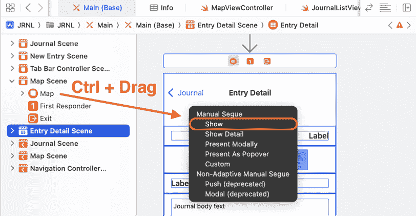

图 17.17：转换弹出菜单

1.  您将为这个转换设置一个标识符，以便 `mapView(_:annotationView:calloutAccessoryControlTapped:)` 方法知道要执行哪个转换。选择连接到 **Map** **Scene** 和 **Entry Detail** **Scene** 的转换：

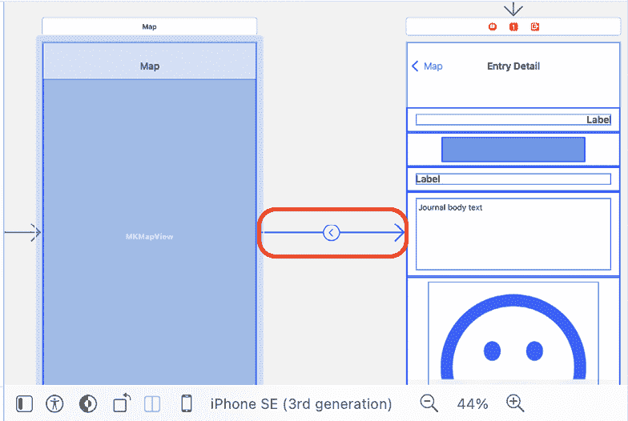

图 17.18：地图场景和条目详情场景之间的转换

1.  在属性检查器中，在 **Storyboard Segue** 下，将 **Identifier** 设置为 `showMapDetail`：


图 17.19：showDetail 转换的属性检查器设置

1.  在项目导航器中点击 **MapViewController** 文件。在 `MapViewController` 类中，在所有其他属性声明之后添加一个属性以存储日记条目：

    ```swift
    private var annotations: [JournalEntry] = []
    **private var****selectedAnnotation****:** **JournalEntry****?** 
    ```

此属性将存储被点击的 `MKAnnotationView` 实例的 `JournalEntry` 实例。

1.  在 `mapView(_:viewFor:)` 方法之后添加 `mapView(_:annotationView:calloutAccessoryControlTapped:)` 方法：

    ```swift
    func mapView(_ mapView: MKMapView, annotationView view: MKAnnotationView, calloutAccessoryControlTapped control: UIControl) {
      guard let annotation = mapView.selectedAnnotations.first 
      else {
        return
      }
      selectedAnnotation = annotation as? JournalEntry
      self.performSegue(withIdentifier: "showMapDetail", 
      sender: self)
    } 
    ```

当用户点击呼出气泡按钮时，会触发此方法。将分配给呼出视图的注释将赋值给 `selectedAnnotation` 属性，并且带有 `showMapDetail` 标识符的转换将被执行，这将显示日记条目详情屏幕。

要了解更多关于 `mapView(_:annotationView:calloutAccessoryControlTapped:)` 方法的知识，请参阅 [`developer.apple.com/documentation/mapkit/mkmapviewdelegate/1616211-mapview`](https://developer.apple.com/documentation/mapkit/mkmapviewdelegate/1616211-mapview)。

1.  构建并运行您的应用程序，并使用模拟器的 **Features** | **Location** 菜单将位置设置为 **Apple**。您应该在地图屏幕上看到一个单独的图钉。点击图钉以显示呼出窗口，并点击呼出窗口内的按钮。

1.  日志条目详情屏幕出现，但它不包含任何关于日志条目的详细信息：

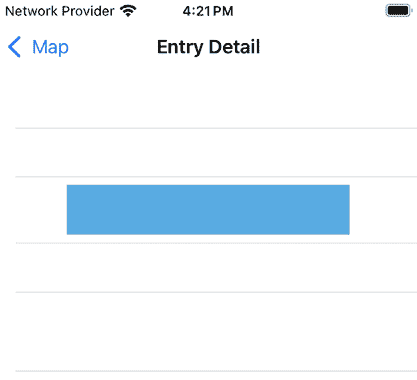

图 17.20：iOS 模拟器显示一个空白的日志条目详情屏幕

1.  为了使日志条目详情屏幕显示日志条目的详细信息，你将使用`prepare(for:sender:)`方法将选定的日志条目传递到日志条目详情屏幕的视图控制器。在`MapViewController`类中，取消注释并修改`prepare(for:sender:)`方法，如下所示：

    ```swift
    // MARK: - Navigation
    override func prepare(for segue: UIStoryboardSegue, sender: Any?) {
      super.prepare(for: segue, sender: sender)
      guard segue.identifier == "showMapDetail" else {
        fatalError("Unexpected segue identifier")
      }
      guard let entryDetailViewController = segue.destination   as? JournalEntryDetailViewController else {
        fatalError("Unexpected view controller")
      }
      entryDetailViewController.selectedJournalEntry =   selectedAnnotation
    } 
    ```

如你之前所学的，`prepare`(for:sender:)方法是在视图控制器切换到另一个视图控制器之前由视图控制器执行的。在这种情况下，此方法是在地图屏幕切换到日志条目详情屏幕之前被调用的。如果转场标识符是`showMapDetail`，并且转场目标是`JournalEntryDetailViewController`实例，则`selectedAnnotation`将被分配给`JournalEntryDetailViewController`实例的`selectedJournalEntry`属性。

1.  构建并运行你的应用，并使用模拟器的**功能** | **位置**菜单验证位置是否已设置为**Apple**。你应该在地图屏幕上看到一个单个图钉。点击图钉以显示呼叫框，并在呼叫框内点击按钮。日志条目详情屏幕出现，并显示你在地图屏幕上点击的日志条目的详细信息。


图 17.21：模拟器显示日志条目详情屏幕

你已经将日志条目详情屏幕连接到地图屏幕，并且已成功从地图屏幕上选定的日志条目传递数据到日志条目详情屏幕。太棒了！在下一节中，你将配置日志条目详情屏幕以显示日志条目位置的地图快照。

# 在日志条目详情屏幕上显示地图快照

当前地图屏幕显示一个代表日志条目的单个图钉。当你点击地图屏幕上的图钉并点击呼叫按钮时，日志条目的详细信息将在日志条目详情屏幕上显示，但当前日志条目详情屏幕上的第二个图像视图显示的是一个占位符地图图像。你可以使用`MKMapSnapshotter`类捕获地图区域并将其转换为图像。

有关`MKMapSnapshotter`类的更多信息，请参阅[`developer.apple.com/documentation/mapkit/mkmapsnapshotter`](https://developer.apple.com/documentation/mapkit/mkmapsnapshotter)。

为了配置快照中捕获的地图的区域和外观，使用`MKMapSnapshotter.Options`对象。

有关`MKMapSnapshotter.Options`对象的更多信息，请参阅[`developer.apple.com/documentation/mapkit/mkmapsnapshotter/options`](https://developer.apple.com/documentation/mapkit/mkmapsnapshotter/options)。

您将在**条目详情场景**中的第二个图像视图中连接到`JournalEntryDetailViewController`类中的一个出口，并用显示日记条目位置的地图快照替换占位符图像。按照以下步骤操作：

1.  在项目导航器中，点击`JournalEntryDetailViewController`文件。在`import UIKit`语句之后输入以下内容以导入`MapKit`框架：

    ```swift
    import UIKit
    **import** **MapKit** 
    ```

1.  在`JournalEntryDetailViewController`类中的所有其他出口之后添加以下出口：

    ```swift
    @IBOutlet var bodyTextView: UITextView!
    @IBOutlet var photoImageView: UIImageView!
    **@IBOutlet****var****mapImageView****:** **UIImageView****!**
    var selectedJournalEntry: JournalEntry? 
    ```

1.  在闭合花括号之前添加一个生成地图快照的方法：

    ```swift
    // MARK: - Private methods
    private func getMapSnapshot() {
      guard let lat = selectedJournalEntry?.latitude, let 
      long = selectedJournalEntry?.longitude else {
        self.mapImageView.image = nil
        return
      }
      let options = MKMapSnapshotter.Options()
      options.region = MKCoordinateRegion(center:
      CLLocationCoordinate2D(latitude: lat, longitude: long),
      span: MKCoordinateSpan(latitudeDelta: 0.01,
      longitudeDelta: 0.01))
      options.size = CGSize(width: 300, height: 300)
      options.preferredConfiguration =   MKStandardMapConfiguration()
      let snapshotter = MKMapSnapshotter(options: options)
      snapshotter.start { snapshot, error in
        if let snapshot {
          self.mapImageView.image = snapshot.image
        } else if let error {
          print("snapshot error:  
          \(error.localizedDescription)")
        }
      }
    } 
    ```

此方法检查`journalEntry`的`latitude`和`longitude`属性是否有值。如果有，则创建、配置并分配一个`MKMapSnapShotter.Options`对象给一个`MKMapSnapshotter`对象。然后使用`MKMapSnapshotter`对象生成地图快照，该快照将被分配给`mapImageView`属性的`image`属性。

1.  在`viewDidLoad()`方法中调用`getMapSnapshot()`方法，在闭合花括号之前：

    ```swift
     photoImageView.image = journalEntry?.photo
      **getMapSnapshot****()**
    } 
    ```

1.  在项目导航器中，点击**主**故事板文件，并在文档大纲中点击**条目详情** **场景**。点击连接检查器按钮，将**mapImageView**出口连接到**条目详情** **场景**中的第二个图像视图：

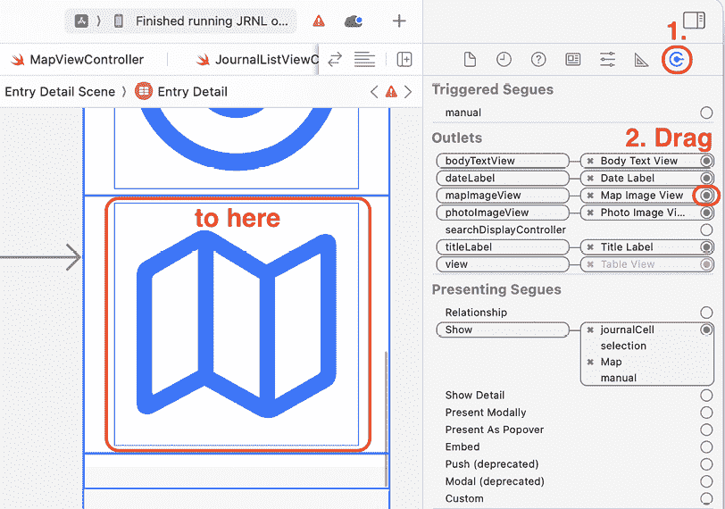

图 17.22：连接检查器显示地图 ImageView 出口

在文档大纲中的图像视图中拖动可能更容易。

1.  构建并运行您的应用程序，并使用模拟器的**功能** | **位置**菜单验证位置是否已设置为**苹果**。您应该在地图屏幕上看到一个单独的图钉。点击图钉以显示呼出窗口，并点击呼出窗口内的按钮。日记条目详情屏幕出现，并显示您在地图屏幕上点击的日记条目的详细信息。向下滚动，您将在第二个图像视图中看到地图快照：

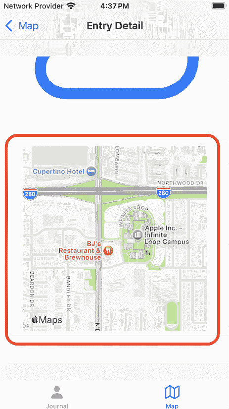

图 17.23：模拟器显示带有地图快照的日记条目详情屏幕

现在日记条目详情屏幕可以显示显示日记条目位置的地图快照。酷！

# 摘要

在本章中，您修改了添加新日记条目屏幕，以便用户可以将他们的当前位置添加到新的日记条目中。然后，您创建了一个`MapViewController`类，并配置它显示以您的位置为中心的自定义地图区域。然后，您更新了`JournalEntry`类以符合`MKAnnotation`协议。之后，您修改了`MapViewController`类以在地图区域内显示每个日记条目的图钉。您配置了图钉以显示呼出窗口，并在呼出窗口中配置了按钮，以便在点击时显示日记条目详情屏幕。最后，您修改了`JournalEntryViewController`类以在日记条目详情屏幕上显示日记条目的地图快照。

你现在知道了如何使用苹果的 Core Location 框架获取设备位置，如何使用苹果的 MapKit 框架创建自定义地图区域并显示地图标注，以及如何创建地图快照，这对于你计划构建使用地图的应用程序，如*苹果地图*或*Waze*，将非常有用。

在下一章中，你将学习如何创建共享数据实例，以及如何从 JSON 文件中加载数据和保存数据。

# 加入我们的 Discord！

与其他用户、专家以及作者本人一起阅读这本书。提出问题，为其他读者提供解决方案，通过 Ask Me Anything（问我任何问题）环节与作者聊天，等等。扫描二维码或访问链接加入社区。

[`packt.link/ios-Swift`](https://packt.link/ios-Swift%0D)


