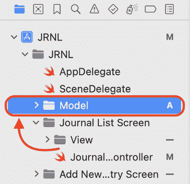
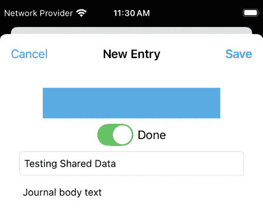
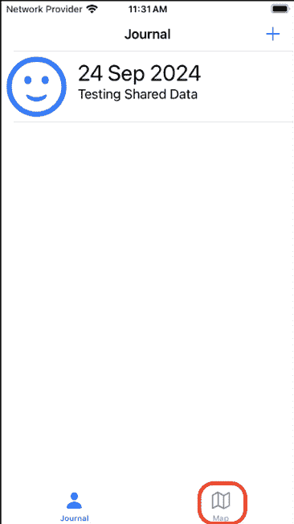
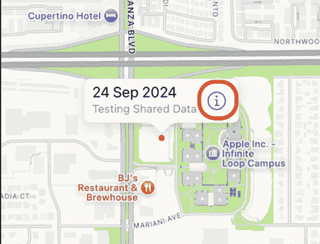
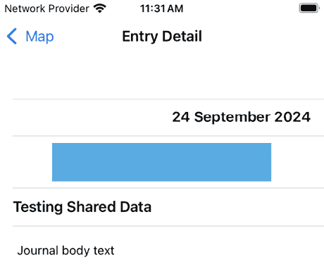
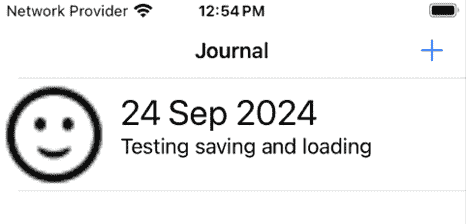

# 开始使用 JSON 文件

在上一章中，你修改了添加日志条目屏幕，以便用户可以将他们的当前位置添加到新的日志条目中，并配置地图屏幕以显示以你的当前位置为中心的区域以及代表日志条目位置的标记。然而，由于 `MapViewController` 实例无法访问 `JournalListViewcontroller` 实例中的 `journalEntries` 数组，新添加的日志条目不会在地图屏幕上作为标记出现。此外，当你退出应用程序时，所有新添加的日志条目都会丢失。

在本章中，你将创建一个 **单例**，`SharedData`，它将为日志列表和地图屏幕提供日志条目数据。此类还将用于在应用程序启动时从你的设备上的文件中加载日志条目数据，并在你添加或删除日志条目时将日志条目数据保存到你的设备上的文件中。

你将从创建 `SharedData` 类并配置你的应用程序使用它开始。接下来，你将修改 `JournalEntry` 类以兼容 **JSON** 格式，这样你就可以将日志条目保存到 JSON 文件中，并从 JSON 文件中加载日志条目。之后，你将添加方法在添加或删除日志条目时保存日志条目数据，以及在应用程序启动时加载日志条目数据。

到本章结束时，你将了解如何创建一个类来存储、加载和从 JSON 文件中保存数据，以便在你的应用程序中使用。

本章将涵盖以下主题：

+   创建一个单例

+   修改 `JournalEntry` 类以兼容 JSON

+   加载和保存 JSON 数据

# 技术要求

你将继续在上一章中修改的 `JRNL` 项目上工作。

本书代码包中的 `Chapter18` 文件夹包含本章的资源文件和完成的 Xcode 项目，可以在此处下载：

[`github.com/PacktPublishing/iOS-18-Programming-for-Beginners-Ninth-Edition`](https://github.com/PacktPublishing/iOS-18-Programming-for-Beginners-Ninth-Edition%0D)

查看以下视频，了解代码的实际应用：

[`youtu.be/lJ4zuzzyjYE`](https://youtu.be/lJ4zuzzyjYE%0D)

让我们从创建一个新的单例来存储你的应用程序使用的数据开始。

# 创建一个单例

目前，当你向你的应用程序中添加新的日志条目时，它们将出现在日志列表屏幕上，但当你切换到地图屏幕时，新添加的日志条目并不存在。这是因为 `MapViewController` 实例无法访问 `JournalListViewcontroller` 实例中的 `journalEntries` 数组。为了解决这个问题，你将创建一个新的单例来存储你的应用程序数据。单例只创建一次，然后在你的应用程序中引用。这意味着 `JournalListViewController` 类和 `MapViewController` 类将从单一来源获取数据。

关于单例的更多信息，请参阅[`developer.apple.com/documentation/swift/managing-a-shared-resource-using-a-singleton`](https://developer.apple.com/documentation/swift/managing-a-shared-resource-using-a-singleton)。

你将创建一个名为 `SharedData` 的单例，并配置 `JournalListViewController` 和 `MapViewController` 类以使用它。按照以下步骤操作：

1.  在项目导航器中，将位于 **Journal List Screen** 组内的 **Model** 组移动到 **SceneDelegate** 文件下方的新位置：



图 18.1：模型组移动到新位置

这反映了模型对象不再仅由 Journal List 屏幕使用，而是被整个应用程序使用。

1.  右键点击 **Model** 组，并选择 **从模板新建文件...**。

1.  **iOS** 应已选中。选择 **Swift 文件** 并点击 **下一步**。

1.  将文件命名为 `SharedData`，然后点击 **创建**。它将出现在项目导航器中，其内容将出现在编辑器区域。

1.  将此文件的内容替换为以下代码以声明和定义 `SharedData` 类：

    ```swift
    import **UIKit**
    class SharedData {  
      // MARK: - Properties
      @MainActor static let shared = SharedData()
      private var journalEntries: [JournalEntry] = []
      // MARK: - Initializers
      private init() {
      }
      // MARK: - Access methods
      func numberOfJournalEntries() -> Int {
        journalEntries.count
      }
      func journalEntry(at index: Int) -> JournalEntry {
        journalEntries[index]
      }
      func allJournalEntries() -> [JournalEntry] {
        journalEntries
      }
      func addJournalEntry(_ newJournalEntry: JournalEntry) {
        journalEntries.insert(newJournalEntry, at: 0)
      }
      func removeJournalEntry(at index: Int) {
        journalEntries.remove(at: index)
      }
    } 
    ```

让我们分解一下：

```swift
@MainActor static let shared = SharedData() 
```

此语句创建此类的单个实例，这意味着你的应用程序中 `SharedData` 的唯一实例存储在 `shared` 属性中。此属性标记为 `@MainActor` 以确保它只能从主队列访问。

更多信息，请观看 Apple 的 WWDC 2022 视频标题为 *使用 Swift Concurrency 消除数据竞争*，在此处：[`developer.apple.com/videos/play/wwdc2022/110351/`](https://developer.apple.com/videos/play/wwdc2022/110351/)。

```swift
private var journalEntries: [JournalEntry] = [] 
```

此语句创建一个名为 `journalEntries` 的空数组，该数组将用于存储 `JournalEntry` 实例。私有关键字意味着 `journalEntries` 数组只能由 `SharedData` 类中的方法修改。这是为了确保应用程序的任何其他部分都不能更改 `journalEntries` 数组。

```swift
private init() {
} 
```

`init()` 方法体为空。这防止了意外创建 `SharedData()` 实例。

```swift
func numberOfJournalEntries() -> Int {
  journalEntries.count
} 
```

此方法返回 `journalEntries` 数组中的项目数量。

```swift
func journalEntry(at index: Int) -> JournalEntry {
  journalEntries[index]
} 
```

此方法返回位于 `journalEntries` 数组指定索引处的 `JournalEntry` 实例。

```swift
func allJournalEntries() -> [JournalEntry] {
  journalEntries
} 
```

此方法返回 `JournalEntries` 数组的副本。

```swift
func addJournalEntry(_ newJournalEntry: JournalEntry) {
  journalEntries.insert(newJournalEntry, at: 0)
} 
```

此方法将传入的 `JournalEntry` 实例插入到 `JournalEntries` 数组的索引 `0` 处。

```swift
func removeJournalEntry(at index: Int) {
  journalEntries.remove(at: index)
} 
```

此方法从 `JournalEntries` 数组中移除指定索引处的 `JournalEntry` 实例。

现在您已创建了 `SharedData` 类，您将修改应用程序以使用它。按照以下步骤操作：

1.  在项目导航器中，点击 **JournalListViewController** 文件。从 `JournalListViewController` 类中移除 `journalEntries` 属性：

    ```swift
    //MARK: - Properties
    @IBOutlet var tableView: UITableView!
    **private var****journalEntries****: [****JournalEntry****] = []** **// remove** 
    ```

1.  在 `viewDidLoad()` 方法中，移除创建样本数据并将其追加到 `journalEntries` 数组的语句：

    ```swift
    override func viewDidLoad() {
      super.viewDidLoad()
      **journalEntries** **=****JournalEntry****.****createSampleJournalEntryData****()** **// remove**

    } 
    ```

1.  修改 `tableView(_:numberOfRowsInSection:)` 方法以从 `SharedData` 获取表格视图的行数：

    ```swift
    func tableView(_ tableView: UITableView, numberOfRowsInSection section: Int) -> Int {
      **SharedData****.****shared****.****numberOfJournalEntries****()**
    } 
    ```

1.  修改 `tableView(_:cellForRowAt:)` 方法以从 `SharedData` 获取所需的 `JournalEntry` 实例：

    ```swift
    let journalCell = tableView.dequeueReusableCell(withIdentifier: "journalCell", for: indexPath) as! JournalListTableViewCell
    **let** **journalEntry** **=****SharedData****.****shared****.****journalEntry****(****at****: indexPath.****row****)**
    journalCell.photoImageView.image = journalEntry.photo 
    ```

1.  修改 `tableView(_:commit:forRowAt:)` 方法以从 `SharedData` 中移除选中的 `JournalEntry` 实例：

    ```swift
    if editingStyle == .delete {
      **SharedData****.****shared****.****journalEntry****(****at****: indexPath.****row****)**
      tableView.reloadData()
    } 
    ```

1.  修改 `prepare(for:sender:)` 方法以使用 `SharedData` 获取选中的 `JournalEntry` 实例：

    ```swift
    let selectedJournalEntry = **SharedData****.****shared****.****journalEntry****(****at****: indexPath.****row****)**
    journalEntryDetailViewController.selectedJournalEntry = selectedJournalEntry 
    ```

1.  修改 `unwindNewEntrySave(segue:)` 方法以向 `SharedData` 添加新的 `JournalEntry` 实例：

    ```swift
    if let sourceViewController = segue.source as? AddJournalEntryViewController, let newJournalEntry = sourceViewController.newJournalEntry {
    **SharedData****.****shared****.****addjournalEntry****(newJournalEntry)**
      tableView.reloadData()
    } 
    ```

你已经对 `JournalListViewController` 类做了所有必要的修改。现在你将修改 `MapViewController` 类以使用 `SharedData`。正如前一章所述，当在实际设备上运行你的应用时，确定设备位置需要很长时间，如果用户的位置发生变化，地图屏幕上的地图将不会更新。你将解决这两个问题。按照以下步骤操作：

1.  在项目导航器中，点击 **MapViewController** 文件。从 `MapViewController` 类中移除 `annotations` 属性：

    ```swift
    //MARK: - Properties
    @IBOutlet var mapView: MKMapView!
    let locationManager = CLLocationManager()
    private var locationTask: Task<Void, Error>?
    **private var****annotations****:** **[****JournalEntry****]****= []** **// remove**
    var selectedJournalEntry: JournalEntry? 
    ```

1.  通过删除高亮语句来修改 `viewDidLoad()` 方法：

    ```swift
    override func viewDidLoad() {
      super.viewDidLoad()
    **fetchUserLocation****()** **// remove**
      mapView.delegate = self
    **annotations** **=** **JournalEntry****.**
    **createSampleJournalEntryData****()** **// remove**
    **mapView****.****addAnnotations****(****annotations****)** **// remove**
    } 
    ```

1.  为了减少确定用户位置所需的时间，向 `fetchUserLocation()` 中添加一个语句，如图所示，将位置管理器实例的精度设置为 `kCLLocationAccuracyKilometer`：

    ```swift
    locationManager.requestWhenInUseAuthorization()
    **locationManager****.****desiredAccuracy****=****kCLLocationAccuracyKilometer**
    self.navigationItem.title = "Getting location..." 
    ```

此属性的默认值为 `kCLLocationAccuracyBest`，它需要相对较长的时间来确定。这种权衡是可以接受的，因为 *JRNL* 应用在显示地图上的注释时不需要最高级别的精度。

1.  为了在地图屏幕出现时更新用户的位置，首先在 `viewDidLoad()` 方法之后实现以下方法：

    ```swift
    override func viewIsAppearing(_ animated: Bool) {
      super.viewIsAppearing(animated)
      fetchUserLocation()
    } 
    ```

`viewIsAppearing()` 视图控制器生命周期方法是在 WWDC 2023 上引入的。你可以通过此链接了解更多关于此方法的信息：[`developer.apple.com/documentation/uikit/uiviewcontroller/4195485-viewisappearing`](https://developer.apple.com/documentation/uikit/uiviewcontroller/4195485-viewisappearing)。

1.  在 `updateMapWithLocation(_:)` 方法中添加以下语句，如图所示，以便在确定用户位置并设置地图区域后，地图视图从 `SharedData` 获取所有注释：

    ```swift
     mapView.region = MKCoordinateRegion(center: 
        CLLocationCoordinate2D(latitude: lat, longitude: long),
        span: MKCoordinateSpan(latitudeDelta: 0.01,
        longitudeDelta: 0.01))
    **mapView****.****addAnnotations****(****SharedData****.****shared** **.****allJournalEntries****())**

      }
    } 
    ```

通过这个修改，如果你在期刊列表屏幕上，点击 **Map** 标签栏按钮将更新用户的位置，在地图屏幕上重新绘制地图，并重新加载地图注释。

你已经对 `MapViewController` 类做了所有必要的修改。现在让我们测试你的应用。按照以下步骤操作：

1.  启动模拟器，并在模拟器的 **Features** 菜单中选择 **Location** | **Apple** 来模拟位置。构建并运行你的应用。

点击 **+** 按钮添加一个新的期刊条目。确保 **Get Location** 开关处于开启状态：



图 18.2：模拟器显示添加新期刊条目屏幕

1.  点击 **Map** 标签按钮进入地图屏幕：



图 18.3：模拟器显示地图标签按钮

1.  注意您之前添加的日记条目在地图屏幕上作为图钉可见。点击图钉，然后点击呼叫按钮：



图 18.4：模拟器显示图钉呼叫按钮

日记条目详情显示在日记条目详情屏幕上：



图 18.5：模拟器显示日记条目详情屏幕

您已成功创建了一个单例并配置了您的应用使用它，但一旦应用退出，数据就会丢失。稍后，您将编写代码将日记条目保存到您的设备存储。但在您能够这样做之前，您将修改 `JournalEntry` 类，以便其中的数据可以以 JSON 格式存储。您将在下一节中这样做。

# 将 `JournalEntry` 类修改为与 JSON 兼容

目前，当您退出应用时，所有应用数据都会丢失。您需要实现一种保存应用数据的方法。iOS 提供了许多存储应用数据的方式。其中之一是将数据转换为 **JavaScript 对象表示法**（**JSON**）格式，然后将其作为文件写入您的设备存储。JSON 是一种在文件中结构化数据的方式，可以很容易地被人和计算机读取。

为了帮助您理解 JSON 格式，请查看下面的示例：

```swift
[
  {
    "dateString": "May 17, 2023"
    "rating": 5
    "entryTitle": "Good"
    "entryBody": "Today is a good day"
    "photoData": "<photo data for the sun.max image>"
    "latitude":
    "longitude":
  },
  {
    "dateString": "May 17, 2023"
    "rating": 0
    "entryTitle": "Bad"
    "entryBody": "Today is a bad day"
    "photoData": "<photo data for the cloud image>"
    "latitude": 37.331354
    "longitude": -122.031791
  },
  {
    "dateString": "May 17, 2023"
    "rating": 3
    "entryTitle": "Good"
    "entryBody": "Today is a good day"
    "photoData": "<photo data for the cloud.sun>"
    "latitude":
    "longitude":
  }
] 
```

此示例是 JSON 格式中 `journalEntries` 数组的表示。如您所见，它以一个开方括号开始，每个内部项目都由包含日记条目信息的键值对组成，这些键值对被花括号包围并用逗号分隔。

在文件的最后，您可以看到一个闭方括号。方括号表示数组，花括号表示字典。字典中的键对应于 `JournalEntry` 实例中的属性，而值对应于分配给这些属性的值。

要了解更多关于在 Swift 类型中使用 JSON 的信息，请参阅 [`developer.apple.com/documentation/foundation/archives_and_serialization/using_json_with_custom_types`](https://developer.apple.com/documentation/foundation/archives_and_serialization/using_json_with_custom_types)。

要了解更多关于解析 JSON 文件的信息，请观看这里可用的视频：[`devstreaming-cdn.apple.com/videos/wwdc/2017/212vz78e2gzl2/212/212_hd_whats_new_in_foundation.mp4`](https://devstreaming-cdn.apple.com/videos/wwdc/2017/212vz78e2gzl2/212/212_hd_whats_new_in_foundation.mp4)。

在将自定义 Swift 类型转换为 JSON 或从 JSON 转换之前，它需要遵守 `Codable` 协议。

要了解更多关于 `Codable` 的信息，请参阅 [`developer.apple.com/documentation/swift/codable`](https://developer.apple.com/documentation/swift/codable)。

JSON 支持日期、字符串、数字、布尔值和 `null` 值，但不支持图像。为了遵循 `Codable` 协议，你需要修改 `JournalEntry` 类以使用 JSON 支持的类型，并修改应用的其他部分以与更新的 `JournalEntry` 实例一起工作。按照以下步骤操作：

1.  在项目导航器中，点击 **JournalEntry** 文件。按照以下方式修改 `JournalEntry` 类声明以采用 `Codable` 协议：

    ```swift
    class JournalEntry: NSObject, MKAnnotation**,** **Codable** { 
    ```

1.  将会显示一个错误，因为 `UIImage` 类型不遵循 `Codable` 协议。按照以下方式修改 `photo` 属性，使 `JournalEntry` 遵循 `Codable` 协议：

    ```swift
    let date: Date
    let rating: Int
    let entryTitle: String
    let body: String
    let **photoData****:** **Data****?**
    let latitude: Double?
    let longitude: Double? 
    ```

错误将会消失，但在初始化器中会出现另一个错误。

1.  按照以下方式修改初始化器：

    ```swift
    self.date = Date()
    self.rating = rating
    self.entryTitle = title
    self.body = body
    self.photoData = **photo?.jpegData(compressionQuality:** **1.0****)** 
    ```

这将 `photo` 参数中的值转换为 `Data` 实例，并将其分配给 `photoData`。

要了解更多关于 `Data` 类型的信息，请参阅 [`developer.apple.com/documentation/foundation/data`](https://developer.apple.com/documentation/foundation/data)。

初始化器中的所有错误都已消失，但如果你现在构建你的应用，你会看到其他错误出现。让我们现在修复它们。按照以下步骤操作：

1.  在项目导航器中，点击 **JournalListViewController** 文件。按照以下方式修改 `JournalListViewController` 类中的 `tableView(_:cellForRowAt:)` 方法：

    ```swift
    let journalEntry = SharedData.shared.getJournalEntry(index: indexPath.row)
    **if****let** **photoData** **=** **journalEntry.****photoData** **{**
     **journalCell.****photoImageView****.****image****=****UIImage****(****data****: photoData)**
    **}**
    journalCell.dateLabel.text = journalEntry.date.formatted(
      .dateTime.month().day().year()
    )
    journalCell.titleLabel.text = journalEntry.entryTitle
    return journalCell 
    ```

更新后的代码将存储在 `photoData` 中的数据转换回 `UIImage`，并将其分配给 `journalCell` 中的图像视图。

1.  在项目导航器中，点击 **JournalEntryDetailViewController** 文件。按照以下方式修改 `viewDidLoad()` 方法：

    ```swift
    override func viewDidLoad() {
      super.viewDidLoad()
      dateLabel.text = selectedJournalEntry?.date.formatted(
        .dateTime.day().month(.wide).year()
      )
      titleLabel.text = selectedJournalEntry?.entryTitle
      bodyTextView.text = selectedJournalEntry?.entryBody
    **if****let** **photoData** **=****selectedJournalEntry****?****.****photoData** **{**
    **photoImageView****.****image****=****UIImage****(****data****: photoData)**
     **}**
      getMapSnapshot()
    } 
    ```

更新后的代码将存储在 `photoData` 中的数据转换为 `UIImage` 实例，并将其分配给 `photoImageView` 的 `image` 属性。在这个阶段，你的应用中应该不再有错误。

1.  构建并运行你的应用。验证模拟位置是否已设置，并添加一个新的日志条目。你的应用应该像之前一样工作。

注意，图像现在是黑色而不是蓝色。这是由于图像转换过程造成的，当你使用相机或照片库中的图像时，这不会引起注意。你将在 *第二十章*，*开始使用相机和照片库* 中学习如何做到这一点。

你已经成功修改了 `JournalEntry` 类以遵循 `Codable` 协议，并且已经解决了应用中的所有错误。在下一节中，你将实现保存和加载数据，这样在退出应用时数据就不会丢失。

# 加载和保存 JSON 数据

现在你已经修改了 `JournalEntry` 类以遵循 `Codable` 协议，你就可以开始实现从 JSON 文件加载数据和保存数据了。

为了让你更容易地处理 JSON 文件，Apple 提供了 `JSONDecoder` 和 `JSONEncoder` 类。

`JSONDecoder` 实例从 JSON 对象解码数据类型实例，你将在从设备存储加载文件时使用它。

要了解更多关于 `JSONDecoder` 的信息，请参阅 [`developer.apple.com/documentation/foundation/jsondecoder`](https://developer.apple.com/documentation/foundation/jsondecoder)。

`JSONEncoder` 实例将数据类型实例编码为 JSON 对象，您将在将文件保存到设备存储时使用它。

要了解更多关于 `JSONEncoder` 的信息，请参阅 [`developer.apple.com/documentation/foundation/jsonencoder`](https://developer.apple.com/documentation/foundation/jsonencoder)。

现在，您将在 `SharedData` 类中实现从文件加载数据和将数据保存到文件的方法。按照以下步骤操作：

1.  在项目导航器中，点击 **SharedData** 文件。在 `SharedData` 类中，在闭合花括号之前实现一个获取您可以在设备存储上加载或保存文件的位置的方法：

    ```swift
    // MARK: - Persistence
    func documentDirectory() -> URL {
      FileManager.default.urls(for: .documentDirectory,   in: .userDomainMask).first!
    } 
    ```

这与在您的 Mac 上获取家目录中 Documents 目录的路径类似。

要了解更多关于访问 iOS 文件系统的信息，请参阅 [`developer.apple.com/documentation/foundation/filemanager`](https://developer.apple.com/documentation/foundation/filemanager)。

1.  在 `documentDirectory()` 方法之后实现一个从设备存储上的文件加载日记条目的方法：

    ```swift
    func loadJournalEntriesData() {
      let pathDirectory = documentDirectory()
      let fileURL = pathDirectory.  appendingPathComponent("journalEntriesData.json")
      do {
        let data = try Data(contentsOf: fileURL)
        let entries = try JSONDecoder().decode(    [JournalEntry].self, from: data)
        journalEntries = entries
      } catch {
        print("Failed to read JSON data: 
        \(error.localizedDescription)")
      }
    } 
    ```

此方法使用 `documentDirectory()` 方法获取可以从中加载文件的位置。然后它指定一个文件名，`journalEntriesData.json`，数据将被保存并附加到路径上。然后它尝试加载该文件。如果成功，它尝试将数据解码为 `JournalEntry` 实例的数组并将其分配给 `journalEntries` 数组。

1.  在 `loadJournalEntriesData()` 方法之后实现一个将日记条目保存到设备存储上的文件的方法：

    ```swift
    func saveJournalEntriesData() {
      let pathDirectory = documentDirectory()
      do {
        try? FileManager().createDirectory(at: pathDirectory,    withIntermediateDirectories: true)
        let filePath =   pathDirectory.appendingPathComponent(    "journalEntriesData.json")
        let json = try JSONEncoder().encode(journalEntries)
        try json.write(to: filePath)
      } catch {
        print("Failed to write JSON data: 
        \(error.localizedDescription)")
      }
    } 
    ```

此方法使用 `documentDirectory()` 方法获取可以保存文件的位置。然后它指定一个要保存数据的文件名并将其附加到路径上。然后它尝试使用 `JSONEncoder` 实例将 `journalEntries` 数组编码为 JSON 格式，并将其写入之前指定的文件。

您已经在您的应用中实现了加载数据和保存日记条目的方法。现在，您将修改 `JournalListViewController` 类，在适当的时候调用这些方法。按照以下步骤操作：

1.  在项目导航器中，点击 **JournalListViewController** 文件。在 `JournalListViewController` 类中，修改 `viewDidLoad()` 以调用 `loadJournalEntriesData()` 方法：

    ```swift
    override func viewDidLoad() {
      super.viewDidLoad()
      **SharedData****.****shared****.****loadJournalEntriesData****()**
    } 
    ```

这将在应用启动时加载任何已保存的日记条目。

1.  修改 `tableView(_:commit:forRowAt:)` 方法，在从表格视图中删除一行后调用 `saveJournalEntriesData()` 方法：

    ```swift
    if editingStyle == .delete {
      SharedData.shared.removeJournalEntry(at: indexPath.row)
      **SharedData****.****shared****.****saveJournalEntriesData****()**
      tableView.reloadData()
    } 
    ```

1.  修改 `unwindNewEntrySave(segue:)` 方法，在添加新的日记条目后调用 `saveJournalEntriesData()` 方法：

    ```swift
    if let sourceViewController = segue.source as? AddJournalEntryViewController, let newJournalEntry = sourceViewController.newJournalEntry {
      SharedData.shared.addJournalEntry(newJournalEntry)
      **SharedData****.****shared****.****saveJournalEntriesData****()**
      tableView.reloadData()
    } 
    ```

1.  构建并运行您的应用。验证已设置模拟位置，并添加一个新的日记条目。您的应用应该像之前一样工作。

1.  停止你的应用程序并重新运行它。你之前添加的日记条目应该仍然存在：



图 18.6：模拟器显示应用程序中的持久化应用程序数据

如果你正在模拟器中运行你的应用程序，你可以在`saveJournalEntriesData()`方法中使用`print(filePath)`语句将文件路径打印到调试区域。这将告诉你`journalEntriesData.json`文件在您的 Mac 上保存的位置。

你已经成功实现了使用 JSON 文件为你的应用程序保存和加载！做得好！

# 摘要

在本章中，你创建了一个单例`SharedData`，并配置了你的应用程序使用它。接下来，你修改了`JournalEntry`类以兼容 JSON 格式，这样你就可以将日记条目保存到 JSON 文件中，并从 JSON 文件中加载日记条目。之后，你添加了在添加或删除日记条目时保存日记条目数据的方法，以及在应用程序启动时加载日记条目数据的方法。

你现在知道如何创建一个类来存储、加载和保存数据，以便在您的应用程序中使用 JSON 文件。

在下一章中，你将实现一个自定义用户界面元素，允许你为日记条目设置星级评分。

# 加入我们的 Discord！

与其他用户、专家和作者本人一起阅读这本书。提出问题，为其他读者提供解决方案，通过“问我任何问题”的环节与作者聊天，等等。扫描二维码或访问链接加入社区。

[`packt.link/ios-Swift`](https://packt.link/ios-Swift%0D)


