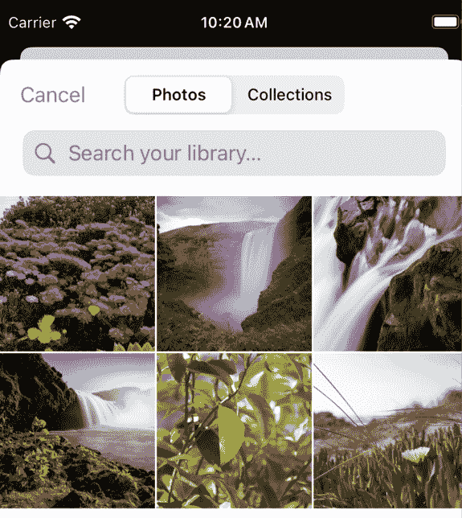
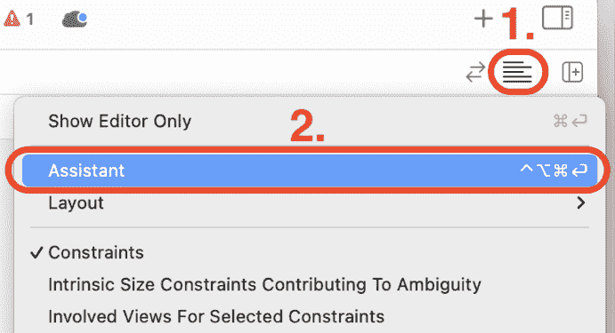
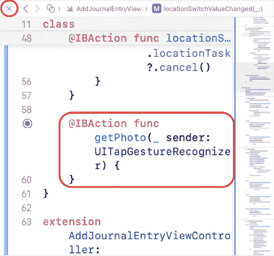
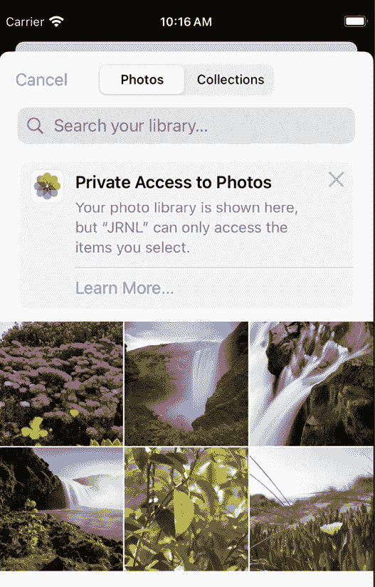
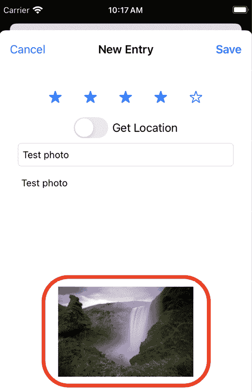

# 20

# 开始使用相机和相册

在上一章中，你创建了`RatingView`类并将其添加到了“添加新日记条目”和“日记条目详情”屏幕中。

在本章中，你将通过添加用户从**相机**或**相册**获取照片的方式，来完成“添加新日记条目”屏幕的实现。你将首先在“新条目场景”中的图像视图上添加一个**轻触手势识别器**，并将其配置为显示一个**图像选择器控制器**实例。然后，你将实现`UIImagePickerControllerDelegate`协议中的方法，这允许你从相机或相册获取照片，并在将其保存到日记条目实例之前将其缩小。你还将修改`Info.plist`文件，以便你可以访问相机或相册。

到本章结束时，你将学会如何在你的应用中访问相机或相册。

本章将涵盖以下主题：

+   创建一个新的`UIImagePickerController`实例

+   实现`UIImagePickerControllerDelegate`方法

+   获取使用相机或相册的权限

# 技术要求

你将继续在上一章中修改的`JRNL`项目中工作。

本章的资源文件和完成的 Xcode 项目位于本书代码包的`Chapter20`文件夹中，可以在此处下载：

[`github.com/PacktPublishing/iOS-18-Programming-for-Beginners-Ninth-Edition`](https://github.com/PacktPublishing/iOS-18-Programming-for-Beginners-Ninth-Edition%0D)

观看以下视频，以查看代码的实际效果：

[`youtu.be/MvOOKyBcVak`](https://youtu.be/MvOOKyBcVak%0D)

让我们先修改“添加新日记条目”屏幕，以显示一个图像选择器控制器，这允许你使用设备相机或从用户的相册中选择照片。

# 创建一个新的 UIImagePickerController 实例

为了让用户更容易使用相机或相册，Apple 实现了`UIImagePickerController`类。这个类管理了系统接口，用于拍照和从用户的相册中选择项目。这个类的实例被称为图像选择器控制器，它可以在屏幕上显示图像选择器。

如果你曾经向社交媒体帖子中添加过照片，你将看到图像选择器的样子。它通常显示来自你的相机的视图或来自你的相册的照片网格，然后你可以选择一张照片添加到你的帖子中：



图 20.1：模拟器显示图像选择器

要了解更多关于`UIImagePickerController`类的信息，请参阅[`developer.apple.com/documentation/uikit/uiimagepickercontroller`](https://developer.apple.com/documentation/uikit/uiimagepickercontroller)。

在“添加新日志条目”屏幕上显示图片选择器，你需要在“新条目场景”中的图片视图上添加一个轻点手势识别器实例，并且当图片视图被轻点时，你需要添加一个创建并显示图片选择器控制器的方法。按照以下步骤操作：

1.  你应该在助理编辑器中看到`AddJournalEntryViewController`文件的全部内容。*Ctrl* + *拖动*文档大纲中的**轻点手势识别器**到`locationSwitchValueChanged(_:)`方法和闭合花括号之间的空间：

1.  

这条语句将图片选择器控制器的`delegate`属性设置为`AddJournalEntryViewController`实例。


1.  如果需要更多工作空间，请点击导航器和检查器按钮。点击调整编辑器选项按钮，并从弹出菜单中选择**助理**：

图 20.4：调整编辑器选项菜单，选择助理


1.  在项目导航器中，点击**主**故事板文件。在文档大纲中点击**新条目场景**。




1.  这条语句创建了一个`UIImagePickerController`类的实例，并将其分配给`imagePickerController`。

点击**新条目**场景中的图片视图。点击属性检查器按钮，在**视图**下勾选**用户交互启用**复选框：

让我们分解这个过程：

1.  在弹出对话框中，将**名称**设置为`getPhoto`，将**类型**设置为`UITapGestureRecognizer`。点击**连接**：


你已成功将轻点手势识别器添加到**新条目**场景中的图片视图，并将其链接到`AddJournalEntryViewController`类中的`getPhoto()`方法。现在你将修改`getPhoto()`方法以创建并显示一个`UIImagePickerController`实例。

1.  图 20.3：选择轻点手势识别器对象的库

在项目导航器中，点击`AddJournalEntryViewController`文件。在文件中所有其他代码之后添加一个新扩展，使`AddJournalEntryViewController`类声明符合`UIImagePickerControllerDelegate`和`UINavigationControllerDelegate`协议：

图 20.7：助理编辑器显示 getPhoto(_:)方法


图 20.2：属性检查器显示用户交互启用复选框

1.  按照以下步骤操作：

    ```swift
    extension AddJournalEntryViewController: UIImagePickerControllerDelegate, UINavigationControllerDelegate {
    } 
    ```

1.  按照以下方式修改`getPhoto()`方法：

    ```swift
    @IBAction func getPhoto(_ sender: UITapGestureRecognizer) {
    **let****imagePickerController****=****UIImagePickerController****()**
    **imagePickerController.****delegate****=****self**
    **#if****targetEnvironment(simulator)**
    **imagePickerController.****sourceType****=****.****photoLibrary**
    **#else**
     **imagePickerController.****sourceType** **= .****camera**
     **imagePickerController.****showsCameraControls** **=** **true**
    **#endif**
    **present****(imagePickerController,** **animated****:** **true****)**
    } 
    ```

    点击库按钮以显示库。在过滤器字段中输入`tap`。一个**轻点手势识别器**对象将作为结果之一出现。将其拖到图片视图：

    ```swift
    let imagePickerController = UIImagePickerController() 
    ```

    验证`getPhoto(_:)`方法是否已在`AddJournalEntryViewController`类中创建。点击**x**关闭助理编辑器窗口：

    ```swift
    imagePickerController.delegate = self 
    ```

    

    ```swift
    #if targetEnvironment(simulator)
    imagePickerController.sourceType = .photoLibrary
    #else
    imagePickerController.sourceType = .camera
    imagePickerController.showsCameraControls = true
    #endif 
    ```

    这段代码块被称为条件编译块。它从`#if`编译指令开始，以`#endif`编译指令结束。如果你在模拟器中运行，只有设置图像选择控制器`sourceType`属性为相册库的语句会被编译。

    如果你在一个实际设备上运行，设置图像选择控制器`sourceType`属性为相机并显示相机控制的语句会被编译。这意味着当在模拟器中运行时，图像选择控制器将使用相册库；当在实际设备上运行时，将使用相机。

    你可以在此链接中了解更多关于条件编译块的信息：https://docs.swift.org/swift-book/documentation/the-swift-programming-language/statements/#Conditional-Compilation-Block。

    ```swift
    present(imagePickerController, animated: true) 
    ```

    这条语句在屏幕上显示图像选择控制器。

你已经实现了在图像视图被点击时显示图像选择控制器的所有必需代码。在下一节中，你将实现当用户选择图像或取消时会被调用的`UIImagePickerControllerDelegate`方法。

# 实现 UIImagePickerControllerDelegate 方法

`UIImagePickerControllerDelegate`协议有一组方法，你必须在你委托对象中实现这些方法以与图像选择控制器界面交互。

要了解更多关于`UIImagePickerControllerDelegate`协议的信息，请参阅[`developer.apple.com/documentation/uikit/uiimagepickercontrollerdelegate`](https://developer.apple.com/documentation/uikit/uiimagepickercontrollerdelegate)。

当图像选择控制器出现在屏幕上时，用户可以选择选择照片或取消。如果用户取消，将触发`imagePickerControllerDidCancel(_:)`方法；如果用户选择照片，将触发`imagePickerController(_:didFinishPickingMediaWithInfo:)`方法。

现在，你将在`AddJournalEntryViewController`类中实现这些方法。在项目导航器中，点击**AddJournalEntryViewController**文件。在`UIImagePickerControllerDelegate`扩展中输入以下代码：

```swift
// MARK: - UIImagePickerControllerDelegate
func imagePickerControllerDidCancel(_ picker: UIImagePickerController) {
  dismiss(animated: true)
}
func imagePickerController(_ picker: UIImagePickerController, didFinishPickingMediaWithInfo info: [UIImagePickerController.InfoKey : Any]) {
  guard let selectedImage =
  info[UIImagePickerController.InfoKey.originalImage]
  as? UIImage else {
    fatalError("Expected a dictionary containing an image,
    but was provided the following: \(info)")
  }
  let smallerImage = selectedImage.preparingThumbnail(
  of: CGSize(width: 300, height: 300))
  photoImageView.image = smallerImage
  dismiss(animated: true)
} 
```

当用户取消时，将触发`imagePickerControllerDidCancel(_:)`方法。图像选择控制器将被关闭，用户将返回到添加新日志条目屏幕。

当用户选择照片时，将触发`imagePickerController(_:didFinishPickingMediaWithInfo:)`方法。然后，这张照片将被分配给`selectedImage`。接下来，将使用`selectedImage`实例的`preparingThumbnail(of:)`方法创建一个宽度为 300 点、高度为 300 点的较小图像，其大小与日志条目详情屏幕上的图像视图大小相同。然后，这个图像将被分配给`photoImageView`属性，图像选择控制器将被关闭。

您可以在此链接中了解更多关于`preparingThumbnail(of:)`方法的信息：[`developer.apple.com/documentation/uikit/uiimage/3750835-preparingthumbnail`](https://developer.apple.com/documentation/uikit/uiimage/3750835-preparingthumbnail)。

所有必需的`UIImagePickerController`代理方法都已实现。在下一节中，您将修改`Info.plist`文件，以便您的应用请求使用相机或照片库的权限。

# 获取使用相机或照片库的权限

苹果规定，如果您的应用希望访问相机或照片库，必须通知用户。如果您不这样做，您的应用将被拒绝，并且不允许在 App Store 上发布。

您将修改项目中的`Info.plist`文件，以便在应用尝试访问相机或照片库时显示消息。请按照以下步骤操作：

1.  在项目导航器中点击**Info**文件。将指针移至**信息属性列表**行，并点击**+**按钮以创建新行。

1.  在新行中，将**键**设置为**隐私 - 照片库使用描述**，并将**值**设置为`此应用在创建日志条目时使用您的照片库中的照片`。

1.  使用**+**按钮添加第二行。这次，将**键**设置为**隐私 - 相机使用描述**，并将**值**设置为`此应用在创建日志条目时使用您的相机`。完成操作后，您的`Info.plist`文件应如下所示：


图 20.8：添加额外键的 Info.plist

1.  构建并运行您的应用。转到添加新日志条目屏幕，并点击图像视图。将出现图像选择器：



图 20.9：模拟器显示图像选择器

如果您在实际的 iOS 设备上运行应用，将出现一个对话框请求使用相机的权限。点击**确定**以继续。

1.  选择一张照片，它将出现在添加新日志条目屏幕上的图像视图中。为日志条目输入示例详细信息，然后点击**保存**：



图 20.10：模拟器显示在添加新日志条目屏幕上的照片

1.  您将返回到日志列表屏幕。点击新添加的日志条目。您将在日志条目详情屏幕上看到照片：


图 20.11：模拟器显示在日志条目详情屏幕上的照片

您现在可以在添加新日志条目屏幕上添加照片，并在日志条目详情屏幕上显示它们。太棒了！

# 摘要

在本章中，你通过添加用户从相机或相册获取照片的方法，完成了添加新日记条目屏幕的实现。首先，你向新条目场景中的图像视图添加了一个轻点手势识别器，并将其配置为显示图像选择器控制器。然后，你实现了`UIImagePickerDelegate`协议，这允许你从相机或相册获取照片，并在将其保存到日记条目实例之前将其照片缩小。你还修改了`Info.plist`文件，以便你可以访问相机和相册。

现在，你能够编写自己的应用程序，从你的相机或相册导入照片。

在下一章中，你将实现用户在日记列表屏幕上搜索日记条目的方法。

# 加入我们的 Discord 社区！

与其他用户、专家以及作者本人一起阅读这本书。提出问题，为其他读者提供解决方案，通过“问我任何问题”的环节与作者聊天，以及更多。扫描二维码或访问链接加入社区。

[`packt.link/ios-Swift`](https://packt.link/ios-Swift%0D)


