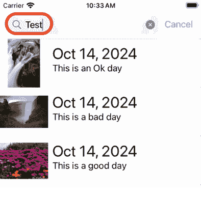
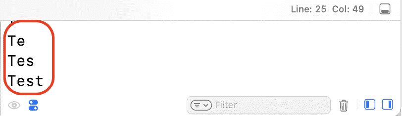
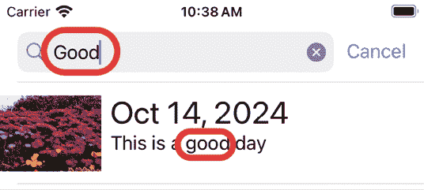
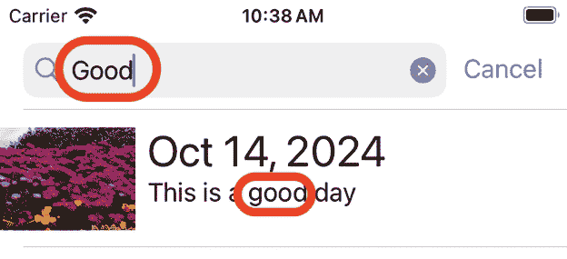
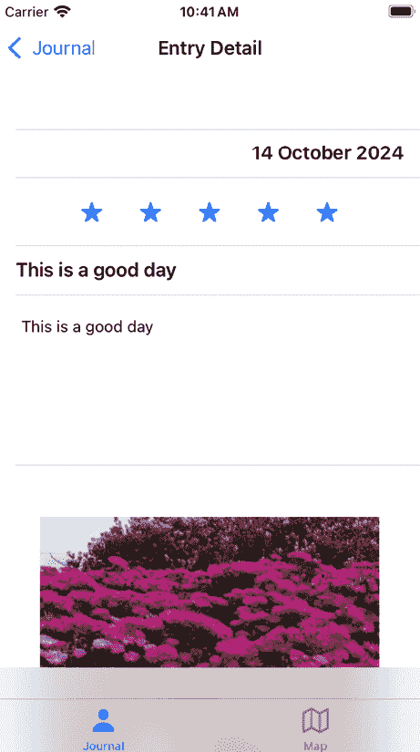
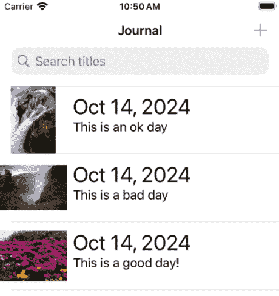
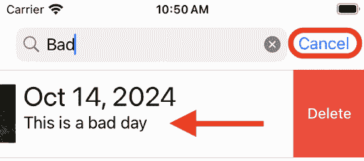
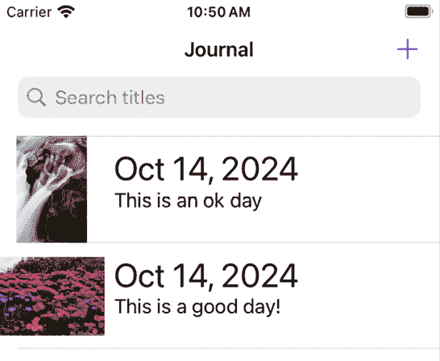

# 开始使用搜索

在上一章中，你为用户添加了一种从相机或照片库获取照片的方法，可以将照片添加到新的期刊条目中。

在本章中，你将为期刊列表屏幕实现一个 **搜索栏**。你将从修改 `JournalListViewController` 类，使其符合 `UISearchResultsUpdating` 协议并在期刊列表屏幕上显示搜索栏开始。接下来，你将修改数据源方法，以便在用户输入搜索词时显示正确的期刊条目。然后，你将修改 `prepare(for:sender:)` 方法，以确保在期刊条目详情屏幕上显示正确的期刊条目详情。最后，你将修改用于删除期刊条目的方法。

到本章结束时，你将学会如何为你的应用实现搜索栏。以一个例子来说，如果你正在创建一个联系人应用，你可以使用搜索栏来搜索特定的联系人。

本章将涵盖以下主题：

+   在期刊列表屏幕上实现搜索栏

+   修改表格视图数据源方法

+   修改 `prepare(for:sender:)` 方法

+   修改删除期刊条目的方法

# 技术要求

你将继续在上一章中修改的 `JRNL` 项目上工作。

本章的资源文件和完成的 Xcode 项目位于本书代码包的 `Chapter21` 文件夹中，可以通过以下链接下载：

[`github.com/PacktPublishing/iOS-18-Programming-for-Beginners-Ninth-Edition`](https://github.com/PacktPublishing/iOS-18-Programming-for-Beginners-Ninth-Edition%0D)

观看以下视频，查看代码的实际效果：

[`youtu.be/hPwG2gfv448`](https://youtu.be/hPwG2gfv448%0D)

让我们从修改 `JournalListViewController` 类开始，使其符合 `UISearchResultsUpdating` 协议，并在期刊列表屏幕上显示搜索栏。

# 实现期刊列表屏幕的搜索栏

目前，你在期刊列表屏幕上只有几个条目。但随着你使用该应用的时长增加，条目会越来越多，找到特定的条目将会变得困难。为了使查找期刊条目更加方便，你将在期刊列表屏幕的导航栏中实现一个搜索栏。你将使用 Apple 的 `UISearchController` 类来完成这项工作。这个类包含一个 `UISearchBar` 类，你可以将其安装到你的用户界面中。为了执行搜索，你需要采用 `UISearchResultsUpdating` 协议并实现该协议所需的 `updateSearchResults(for:)` 方法。

要了解更多关于 `UISearchController` 类的信息，请参阅 [`developer.apple.com/documentation/uikit/uisearchcontroller`](https://developer.apple.com/documentation/uikit/uisearchcontroller)。

现在，你将在`JournalListViewController`类中添加`UISearchController`类的实例，采用`UISearchResultsUpdating`协议，并实现`updateSearchResults(for:)`方法。按照以下步骤操作：

1.  在项目导航器中，单击**JournalListViewController**文件。在此文件的所有其他代码之后添加一个新扩展，使`JournalListViewController`类符合`UISearchResultsUpdating`协议：

    ```swift
    extension JournalListViewController: UISearchResultsUpdating {
    } 
    ```

1.  你会看到一个错误，因为尚未实现符合`UISearchResultsUpdating`协议所需的方法。将以下代码添加到新添加的扩展中来实现它：

    ```swift
    // MARK: - Search
    func updateSearchResults(for searchController: UISearchController) {
      guard let searchBarText = searchController.searchBar.text
      else { return }
      print(searchBarText)
    } 
    ```

你输入到搜索栏中的任何文本都将打印到调试区域。

1.  在`JournalListViewController`类中`tableView`属性之后声明以下属性：

    ```swift
    @IBOutlet var tableView: UITableView!
    **private let****search****=****UISearchController****(****searchResultsController****:** **nil****)**
    **private var****filteredTableData****: [****JournalEntry****]** **=** **[]** 
    ```

`search`属性将存储`UISearchController`类的实例。

`filteredTableData`属性将存储一个与用户输入的搜索文本匹配的`JournalEntry`实例数组。

1.  修改`JournalListViewController`类中的`viewDidLoad()`方法，如下所示：

    ```swift
    override func viewDidLoad() {
      super.viewDidLoad()
      SharedData.shared.loadJournalEntriesData()
    **search****.****searchResultsUpdater****=****self**
    **search****.****obscuresBackgroundDuringPresentation****=****false**
    **search****.****searchBar****.****placeholder****=****"Search titles"**
    **navigationItem****.****searchController****=****search**
    } 
    ```

让我们分解一下：

```swift
search.searchResultsUpdater = self 
```

此语句将`JournalListViewController`实例设置为负责更新搜索结果的对象。

```swift
search.obscuresBackgroundDuringPresentation = false 
```

当用户与搜索栏交互时，此语句会遮挡包含搜索内容的视图控制器。由于你在期刊列表屏幕上使用表格视图来显示搜索结果，因此此值设置为`false`，否则你将遮挡搜索结果。

```swift
search.searchBar.placeholder = "Search titles" 
```

此语句设置了搜索栏的占位文本。

```swift
navigationItem.searchController = search 
```

此语句将搜索栏添加到屏幕上的导航栏。

1.  构建并运行你的应用，你将在期刊列表屏幕上看到一个搜索栏。在搜索栏中输入一些文本：



图 21.1：模拟器显示期刊列表屏幕上的搜索栏

1.  注意，你输入到搜索栏中的文本将显示在调试区域：



图 21.2：调试区域显示搜索文本

你已经在期刊列表屏幕上添加了一个搜索栏。太好了！在下一节中，你将修改`JournalListViewController`文件，以显示与搜索栏中输入的搜索文本匹配的期刊条目。

# 修改表格视图数据源方法

如你在*第十四章*中学习的，*MVC 和表格视图入门*，你可以使用`UITableViewDataSource`方法来确定要显示多少表格视图行，以及每行要放置什么内容。

在上一节中，你添加了一个新的属性`filteredTableData`，用于存储与搜索文本匹配的`JournalEntry`实例数组。你将修改`updateSearchResults(for:)`方法，用与搜索文本匹配的`JournalEntry`实例填充`filteredTableData`，并修改`UITableViewDataSource`方法，在搜索栏活动时在期刊列表屏幕上显示`filteredTableData`的内容。按照以下步骤操作：

1.  在项目导航器中，点击**JournalListViewController**文件。修改`UISearchResultsUpdating`扩展中的`updateSearchResults(for:)`方法，如图所示：

    ```swift
    //MARK: - Search
    func updateSearchResults(for searchController: UISearchController) {
      guard let searchBarText = searchController.searchBar.text
      else {
        return
      }
     **filteredTableData =** **SharedData****.****shared****.****allJournalEntries****()** **.****filter** **{ entry in** **entry.****entryTitle****.****lowercased****().****contains****(searchBarText** **.****lowercased****())**

     **}**
    **tableView****.****reloadData****()**
    } 
    ```

此方法获取`journalEntries`数组的副本，然后将匹配搜索文本的`JournalEntry`实例添加到`filteredTableData`数组中。完成后，表格视图将被重新加载。

1.  修改`tableView(_:numberOfRowsInSection:)`方法，当搜索栏处于使用状态时，从`filteredTableData`数组中获取`JournalEntry`实例的数量：

    ```swift
    //MARK: - UITableViewDataSource
    func tableView(_ tableView: UITableView, numberOfRowsInSection section: Int) -> Int {
    **if****search****.****isActive** **{**
    **return** **filteredTableData.****count**
     **}** **else** **{**
    **return****SharedData****.****shared****.****numberOfJournalEntries****()**
     **}**
    } 
    ```

1.  修改`tableView(_:cellForRowAt:)`方法，当搜索栏处于使用状态时，从`filteredTableData`数组中获取指定行的`JournalEntry`实例：

    ```swift
    func tableView(_ tableView: UITableView, cellForRowAt indexPath: IndexPath) -> UITableViewCell {
      let journalCell =   tableView.dequeueReusableCell(withIdentifier:   "journalCell", for: indexPath) as!  JournalListTableViewCell
    **let** **journalEntry:** **JournalEntry**
    **if****search****.****isActive** **{**
     **journalEntry** **=** **filteredTableData[indexPath.****row****]**
     **}** **else** **{** 
     **journalEntry** **=****SharedData****.****shared****.****journalEntry****(****at****: indexPath.****row****)**

     **}**
      if let photoData = journalEntry.photoData {
        journalCell.photoImageView.image =     UIImage(data: photoData)
      }
      journalCell.dateLabel.text = journalEntry.date.formatted(
      .datetime.month().day().year()
    )
      journalCell.titleLabel.text = journalEntry.entryTitle
      return journalCell
    } 
    ```

1.  构建并运行你的应用，并在搜索栏中输入与你的日志条目标题匹配的文本。将显示与搜索文本匹配的日志条目：



图 21.3：模拟器显示与搜索文本匹配的日志条目

你现在可以显示与搜索文本匹配的日志条目，但当你点击它们时，日志条目详情屏幕可能或可能不会显示被点击日志条目的详细信息。你将在下一节中修复此问题。

# 修改`prepare(for:sender:)`方法

当你在搜索栏中输入文本时，与搜索文本匹配的日志条目将出现在日志列表屏幕的表格视图中。但如果你点击其中一个，日志条目详情屏幕可能或可能不会显示被点击日志条目的详细信息。这是因为`prepare(for:sender:)`方法将引用`SharedData.shared`实例中的`journalEntries`数组，而不是`filteredTableData`数组。要修复此问题，请按照以下步骤操作：

1.  修改`JournalListViewController`类中的`prepare(for:sender:)`方法，如图所示，当搜索栏处于活动状态时，将`filteredTableData`数组中适当的`JournalEntry`实例分配给目标视图控制器的`journalEntry`属性：

    ```swift
    //MARK: - Navigation
    override func prepare(for segue: UIStoryboardSegue, sender: Any?) {
      super.prepare(for: segue, sender: sender)
      guard segue.identifier == "entryDetail" else {
        return
      }
      guard let journalEntryDetailViewController = 
      segue.destination as?
      JournalEntryDetailViewController, 
      let selectedJournalEntryCell = sender as?
      JournalListTableViewCell,   let indexPath = tableView.indexPath(for:
      selectedJournalEntryCell)
      else {
        fatalError("Could not get indexpath")
      }
    **let** **selectedJournalEntry:** **JournalEntry**
    **if****search****.****isActive** **{**
     **selectedJournalEntry** **=** **filteredTableData[indexPath.****row****]**
     **}** **else** **{**
     **selectedJournalEntry** **=**
    **SharedData****.****shared****.****journalEntry****(****at****: indexPath.****row****)**
     **}**
      journalEntryDetailViewController.selectedJournalEntry = 
      selectedJournalEntry
    } 
    ```

1.  构建并运行你的应用，并在搜索栏中输入与你的日志条目标题匹配的文本。将显示与搜索文本匹配的日志条目：



图 21.4：模拟器显示与搜索文本匹配的日志条目

1.  点击其中一个日志条目，现在在日志条目详情屏幕上显示的详细信息与被点击的日志条目相匹配：



图 21.5：模拟器显示在日志条目详情屏幕上被点击日志条目的详细信息

你的应用现在可以在日志条目详情屏幕中正确显示被点击日志条目的详细信息。酷！在下一节中，你将修改`JournalListViewController`类中用于删除日志条目的方法。

# 修改删除日志条目的方法

到目前为止，用于从`SharedData`实例中的`journalEntries`数组中删除`JournalEntry`实例的方法使用表格视图行来识别要删除的`JournalEntry`实例的索引。然而，当搜索栏处于活动状态时，表格视图行可能不会匹配要删除的`JournalEntry`实例的索引。你将为`JournalEntry`类添加一个属性以存储一个将识别`JournalEntry`实例的值，并修改`SharedData`和`JournalListViewController`类中的方法以使用此属性来确定要删除的`JournalEntry`实例。按照以下步骤操作：

1.  在项目导航器中，点击**JournalEntry**文件。向`JournalEntry`类中添加一个新的属性以存储所谓的**UUID**字符串：

    ```swift
    class JournalEntry: NSObject, MKAnnotation, Codable {
      // MARK: - Properties
    **var****key****=****UUID****().****uuidString**
      let date: Date
      let rating: Int 
    ```

当创建一个新的`JournalEntry`实例时，`key`属性被分配一个由`UUID`类生成的字符串，该字符串保证是唯一的。

要了解更多关于`UUID`类的信息，请参阅[`developer.apple.com/documentation/foundation/uuid`](https://developer.apple.com/documentation/foundation/uuid)。

1.  在项目导航器中点击**SharedData**文件。在`removeJournalEntry(at:)`方法之后添加一个方法到`SharedData`类中，用于删除与传入的`JournalEntry`实例的`UUID`字符串匹配的`JournalEntry`实例：

    ```swift
    func removeSelectedJournalEntry(_ selectedJournalEntry: JournalEntry) {
      journalEntries.removeAll {
        $0.key == selectedJournalEntry.key
      }
    } 
    ```

1.  在项目导航器中点击**JournalListViewController**文件。按照如下所示修改`JournalListViewController`类中的`tableView(_:commit:forRowAt:)`方法：

    ```swift
    //MARK: - TableViewDelegate
    func tableView(_ tableView: UITableView, commit editingStyle: UITableViewCell.EditingStyle, forRowAt indexPath: IndexPath) {
      if editingStyle == .delete {
    **if****search****.****isActive** **{**
    **let** **selectedJournalEntry** **=****filteredTableData****[** **indexPath.****row****]**

    **filteredTableData****.****remove****(****at****: indexPath.****row****)**
    **SharedData****.****shared****.****removeSelectedJournalEntry****(**
     **selectedJournalEntry)**
     **}** **else** **{**
          SharedData.shared.removeJournalEntry(at:       indexPath.row)
        **}**
        SharedData.shared.saveJournalEntriesData()
        tableView.reloadData()
      }
    } 
    ```

此方法现在会检查搜索栏是否处于活动状态。如果是，则将对应于被点击行的`filteredTableData`数组中的`JournalEntry`实例分配给`selectedJournalEntry`。然后，从这个`filteredTableData`数组中删除此实例，并将其作为参数传递给`removeSelectedJournalEntry(_:)`方法。具有与传递给`removeSelectedJournalEntry(_:)`方法相同的`UUID`字符串的`journalEntry`实例将从`SharedData`实例中的`journalEntries`数组中删除。

1.  构建并运行你的应用。由于你对`JournalEntry`类进行了修改，之前保存在 JSON 文件中的已保存日记条目将无法加载，因此你需要创建新的示例日记条目：



图 21.6：模拟器显示日记列表屏幕上的日记条目

1.  在搜索栏中输入一些与日记条目标题匹配的文本。与搜索文本匹配的日记条目将被显示。在行上向左滑动并点击**取消**以退出搜索：



图 21.7：模拟器显示即将被删除的行

当搜索栏处于活动状态时，在表格视图行上向左滑动将删除它从表格视图中，并从`SharedData`实例中的`journalEntries`数组中删除相应的日记条目。

1.  验证已删除的期刊条目不再出现在期刊列表屏幕上：



图 21.8：模拟器显示期刊列表屏幕上剩余的期刊条目

你已成功修改了删除期刊条目的方法，现在在期刊列表屏幕上实现搜索栏的工作已经完成。太棒了！

# 摘要

在本章中，你为期刊列表屏幕实现了搜索栏。首先，你修改了`JournalListViewController`类以符合`UISearchResultsUpdating`协议并在期刊列表屏幕上显示搜索栏。接下来，你修改了数据源方法，以便在用户输入搜索词时显示正确的期刊条目。然后，你修改了`prepare(for:sender:)`方法以确保在期刊条目详情屏幕上显示正确的期刊条目详情。最后，你修改了用于删除期刊条目的方法。

你现在已经学会了如何在你的应用中实现搜索栏，并且你也完成了*JRNL*应用。做得太棒了！

在下一章中，你将学习如何让你的应用为 iPad 和 Mac 做准备。

# 加入我们的 Discord 频道！

与其他用户、专家以及作者本人一起阅读这本书。提问、为其他读者提供解决方案、通过“问我任何问题”的环节与作者聊天，以及更多。扫描二维码或访问链接加入社区。

[`packt.link/ios-Swift`](https://packt.link/ios-Swift%0D)


