# 开始使用集合视图

在上一章中，你为 Journal List 屏幕实现了搜索栏，现在你的应用已经完成。然而，你的应用是为 iPhone 的屏幕设计的，如果你要在 iPad 或 Mac 上运行它，你会看到它没有充分利用更大的屏幕尺寸。

在本章中，你将用 **集合视图** 替换 Journal List 屏幕上的表格视图，这将更好地利用在 iPad 或 Mac 上运行应用时额外的屏幕空间。你还将使用大小类在设备旋转时动态修改列数和集合视图单元格大小。

首先，在 `Main` 故事板文件中，你将用集合视图替换 Journal List 屏幕上的表格视图，并配置集合视图单元格以显示表格视图单元格曾经显示的相同信息。接下来，你将重构 `JournalListViewController` 和 `JournalListTableViewCell` 类以与添加的集合视图和集合视图单元格一起工作。然后，你将添加代码以动态更改集合视图单元格大小以适应应用正在运行的显示。最后，你将在不同设备上测试你的应用。

到本章结束时，你将了解集合视图、如何使用集合视图代理和数据源协议，以及如何根据大小类动态修改应用界面。

本章将涵盖以下主题：

+   理解集合视图

+   将 Journal List 屏幕修改为使用集合视图

+   使用大小类动态修改集合视图单元格大小

+   在不同设备上测试你的应用

# 技术要求

你将继续在上一章中修改的 `JRNL` 项目上工作。

本章的资源文件和完成的 Xcode 项目位于本书代码包的 `Chapter22` 文件夹中，可以在此处下载：

[`github.com/PacktPublishing/iOS-18-Programming-for-Beginners-Ninth-Edition`](https://github.com/PacktPublishing/iOS-18-Programming-for-Beginners-Ninth-Edition%0D)

查看以下视频以查看代码的实际运行情况：

[`youtu.be/yIJpBHzAHCU`](https://youtu.be/yIJpBHzAHCU%0D)

让我们从下一节学习集合视图开始。

# 理解集合视图

集合视图是 `UICollectionView` 类的一个实例。它管理一个有序的元素集合，并使用可定制的布局来展示这些元素。

要了解更多关于集合视图的信息，请访问 [`developer.apple.com/documentation/uikit/uicollectionview`](https://developer.apple.com/documentation/uikit/uicollectionview)。

集合视图显示的数据通常由视图控制器提供。为集合视图提供数据的视图控制器必须采用`UICollectionViewDataSource`协议。此协议声明了一系列方法，告诉集合视图显示多少个单元格以及每个单元格显示什么内容。

要了解更多关于`UICollectionViewDataSource`协议的信息，请访问[`developer.apple.com/documentation/uikit/uicollectionviewdatasource`](https://developer.apple.com/documentation/uikit/uicollectionviewdatasource)。

为了提供用户交互，集合视图的视图控制器还必须采用`UICollectionViewDelegate`协议，该协议声明了一系列在用户与集合视图交互时触发的方法。

要了解更多关于`UICollectionViewDelegate`协议的信息，请访问[`developer.apple.com/documentation/uikit/uicollectionviewdelegate`](https://developer.apple.com/documentation/uikit/uicollectionviewdelegate)。

集合视图的布局方式由一个`UICollectionViewLayout`对象指定。这决定了集合视图边界内的单元格位置、辅助视图和装饰视图。

你将使用`UICollectionViewFlowLayout`类，它是`UICollectionViewLayout`类的子类，为你的应用提供支持。集合视图中的单元格从一行或一列流向下一行或一列，每行包含尽可能多的单元格。

要了解更多关于`UICollectionViewFlowLayout`类的信息，请访问[`developer.apple.com/documentation/uikit/uicollectionviewflowlayout`](https://developer.apple.com/documentation/uikit/uicollectionviewflowlayout)。

流布局通过与集合视图的代理对象协同工作来确定每个部分和网格中项目、头部和脚部的大小。该代理对象必须遵守`UICollectionViewDelegateFlowLayout`协议。这允许你动态调整布局信息。

要了解更多关于`UICollectionViewFlowLayoutDelegate`协议的信息，请访问[`developer.apple.com/documentation/uikit/uicollectionviewdelegateflowlayout`](https://developer.apple.com/documentation/uikit/uicollectionviewdelegateflowlayout)。

现在你已经对集合视图有了基本的了解，你将在下一节中通过将表格视图替换为集合视图来修改“期刊列表”屏幕。

# 修改“期刊列表”屏幕以使用集合视图

目前，“JRNL”应用中的“期刊列表”屏幕使用的是表格视图。表格视图通过单列排列的行来展示表格视图单元格。这在 iPhone 上效果很好，但如果你在 iPad 上运行该应用，你会看到“期刊列表”屏幕上有大量的空白屏幕空间，如下面的图所示：

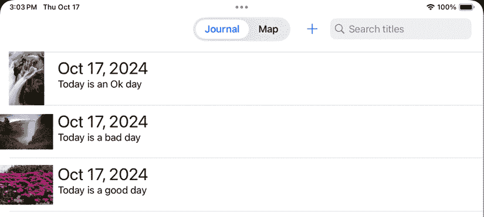

图 22.1：模拟器显示的“期刊列表”屏幕，其中包含一个 iPad 上的表格视图

为了解决这个问题，您将用集合视图替换表格视图，这将允许您更有效地使用可用的屏幕空间，如图所示：

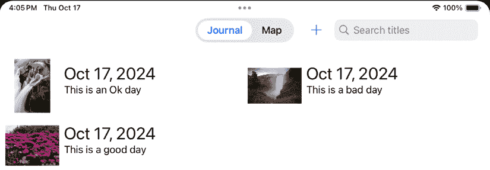

图 22.2：模拟器显示包含 iPad 上集合视图的期刊列表屏幕

要在期刊列表屏幕上实现集合视图，您需要执行以下操作：

1.  在`Main`故事板文件中，将**期刊场景**中的表格视图替换为集合视图。

1.  向集合视图单元格添加 UI 元素。

1.  修改`JournalListTableViewCell`类以管理集合视图单元格的内容。

1.  修改`JournalListViewController`类以管理集合视图显示的内容。

1.  添加方法以根据设备屏幕尺寸和方向动态更改集合视图单元格的大小。

在下一节中，您将开始修改`Main`故事板文件中的**期刊场景**，使用集合视图而不是表格视图。

## 替换表格视图为集合视图

目前，`Main`故事板文件中的**期刊场景**包含一个表格视图。您将用集合视图替换它。按照以下步骤操作：

1.  打开上一章中修改的`JRNL`项目，并从目标菜单中选择**iPad（第 10 代）**：

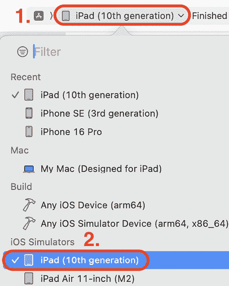

图 22.3：显示已选择 iPad（第 10 代）的目标菜单

1.  构建并运行您的应用，并注意它在 iPad 屏幕上的显示：

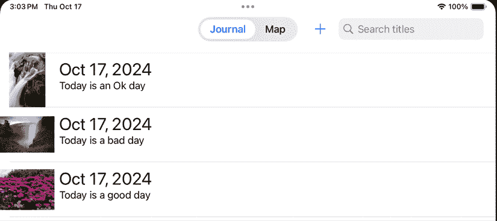

图 22.4：模拟器显示 iPad 屏幕

虽然应用按预期工作，但请注意，在期刊列表屏幕的右侧浪费了很多空间。

1.  点击停止按钮。在项目导航器中点击**主**故事板文件。在文档大纲中，点击**期刊场景**下的表格视图。按*删除*键将其删除：

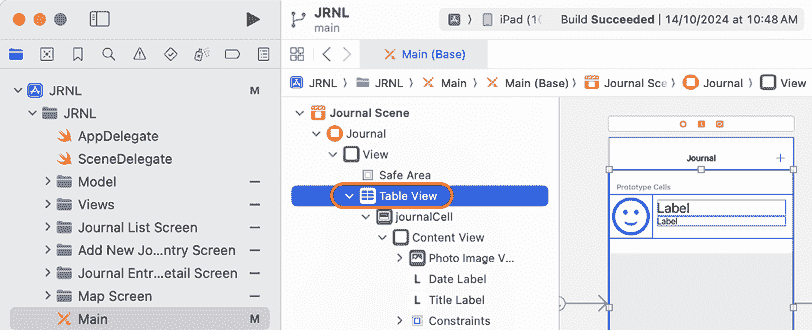

图 22.5：编辑区域显示文档大纲中选中的表格视图

1.  点击库按钮以显示库。在过滤器字段中输入`collec`。一个**集合视图**对象将作为结果之一出现。将其拖到**期刊场景**视图的中间：

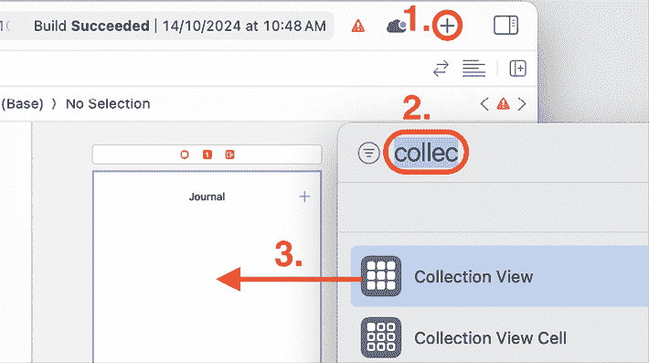

图 22.6：库中选中的集合视图对象

1.  确保集合视图被选中，然后点击自动布局添加新约束按钮：

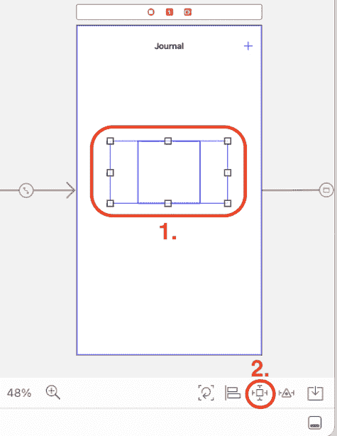

图 22.7：已选择集合视图的期刊场景

1.  在顶部、左侧、右侧和底部边缘约束字段中输入`0`，并点击所有浅红色支柱。确保所有支柱都已变为亮红色，并且**约束到边距**未选中。然后，点击**添加 4 个约束**按钮：

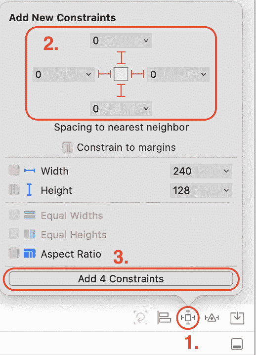

图 22.8：自动布局 – 添加新约束弹出对话框

这将设置集合视图边缘与包围视图边缘之间的空间为 0，将集合视图的边缘绑定到包围视图的边缘。

1.  验证集合视图的四个边现在都已绑定到屏幕的边缘，如图所示：

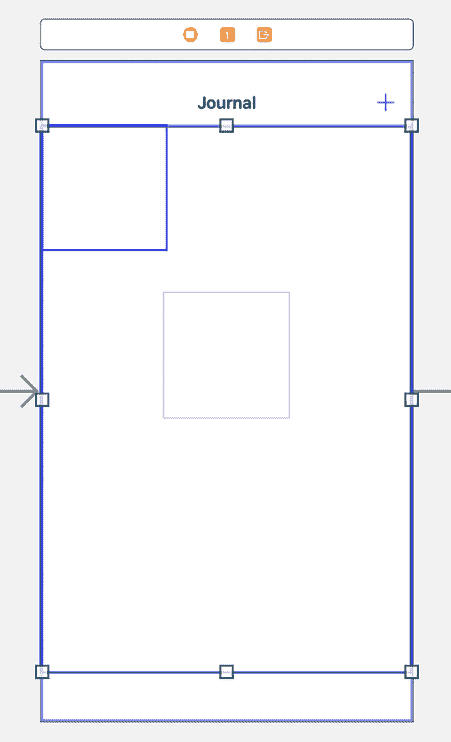

图 22.9：填充整个屏幕的集合视图的日志场景

1.  在集合视图仍然被选中时，点击大小检查器按钮。在**集合视图**下，将**估算大小**设置为**无**。

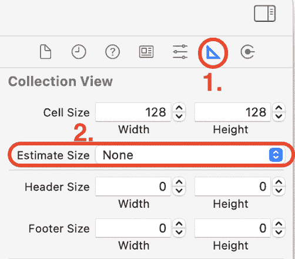

图 22.10：大小检查器，高亮显示估算大小

你将在稍后添加代码以动态确定集合视图的大小。

1.  你需要重新建立日志列表屏幕和日志条目详情屏幕之间的转换。*Ctrl* + *拖动*文档大纲中的**集合视图单元格**到**条目详情场景**，并从弹出菜单中选择**显示**。

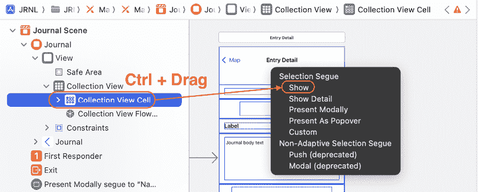

图 22.11：显示拖动目的地的编辑区域

1.  点击新添加的故事板转换，并点击属性检查器按钮。在**故事板转换**下，将**标识符**设置为`entryDetail`。

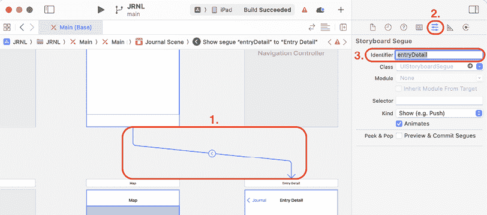

图 22.12：属性检查器，标识符设置为 entryDetail

你已经向日志场景添加了一个集合视图，并使用自动布局约束使其填充整个屏幕，但当前原型集合视图单元格是空的。你将在下一节向集合视图单元格添加 UI 元素。

## 向集合视图单元格添加 UI 元素

你已经将**日志场景**内的表格视图替换为集合视图，但集合视图内的原型集合视图单元格是空的。你需要向原型集合视图单元格添加一个图像视图和两个标签，并设置它们的约束，使其与之前使用的表格视图单元格相匹配。按照以下步骤操作：

1.  在文档大纲中选择**日志场景**的**集合视图单元格**。将集合视图单元格的右边缘向右拖动，直到它达到屏幕的右侧：

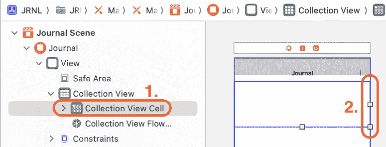

图 22.13：显示集合视图单元格的编辑区域

1.  点击大小检查器按钮，在**集合视图单元格**下，将**高度**设置为`90`。

1.  要向表格视图单元格添加图像视图，点击库按钮。在过滤器字段中输入`imag`。一个**图像视图**对象将出现在结果中。将其拖动到原型单元格中：

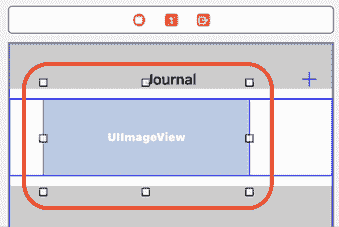

图 22.14：添加了图像视图的原型单元格

1.  在选择图像视图后，点击添加新约束按钮并输入以下值以设置新添加的图像视图的约束：

    +   顶部：`0`

    +   左侧：`0`

    +   底部：`0`

    +   宽度：`90`

**约束到边距**不应被勾选。完成设置后，点击**添加 4 个约束**按钮：

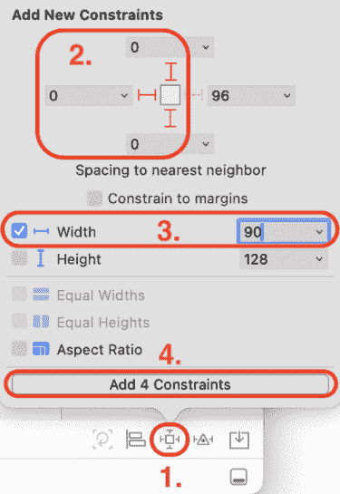

图 22.15：图像视图的约束

1.  点击属性检查器按钮。在**图像视图**下，将**图像**设置为`face.smiling`：

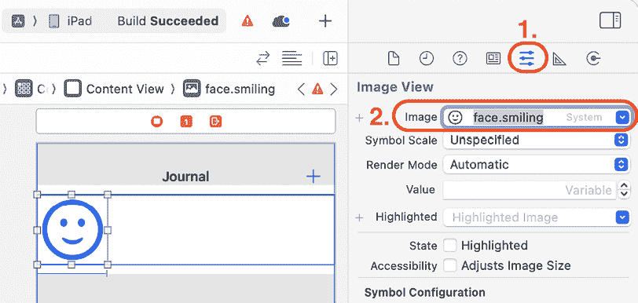

图 22.16：图像视图，图像设置为 face.smiling

1.  接下来，你将为显示日记条目日期添加一个标签。点击图书馆按钮。在过滤器字段中输入`label`。一个**标签**对象将在结果中显示。将其拖动到刚刚添加的图像视图和单元格右侧的空间之间：

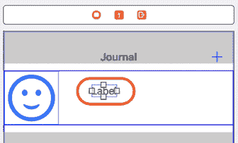

图 22.17：添加标签的原型单元格

1.  在属性检查器中，在**标签**下，使用**字体**菜单将**字体**设置为**标题 1**：

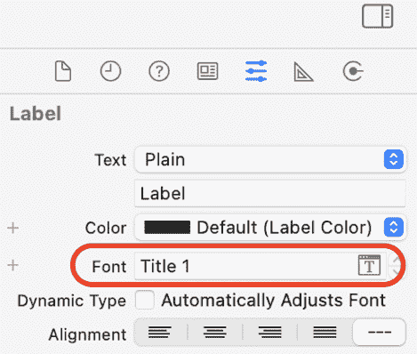

图 22.18：标签的属性检查器

1.  点击**添加新约束**按钮并输入以下值以设置标签的约束：

    +   顶部：`0`

    +   左侧：`8`

    +   右侧：`0`

**约束到边距**应该被勾选，这设置了标准的 8 点边距。完成时，点击**添加 3 个约束**按钮。

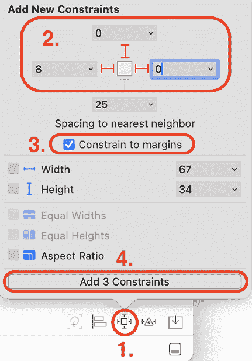

图 22.19：标签的约束条件

1.  最后，你将为显示日记条目标题添加一个标签。点击图书馆按钮。在过滤器字段中输入`label`。一个**标签**对象将在结果中显示。将其拖动到刚刚添加的标签和单元格底部之间的空间：

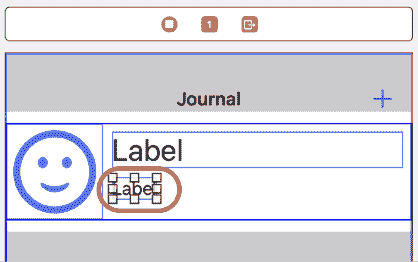

图 22.20：添加第二个标签的原型单元格

1.  在属性检查器中，在**标签**下，使用**字体**菜单将**字体**设置为**正文**，并将**行数**设置为`2`：

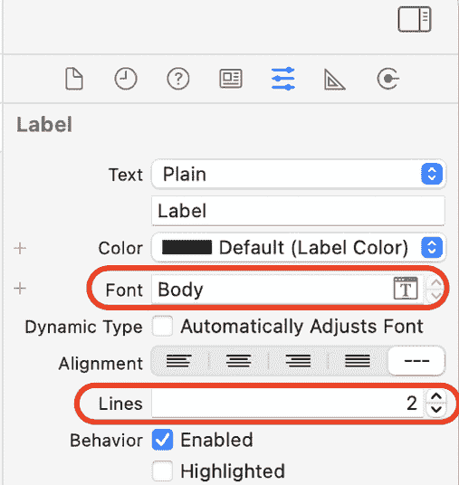

图 22.21：标签的属性检查器

1.  点击**添加新约束**按钮并输入以下值以设置标签的约束：

    +   顶部：`0`

    +   左侧：`8`

    +   右侧：`0`

**约束到边距**应该被勾选，这设置了标准的 8 点边距。完成时，点击**添加 3 个约束**按钮。

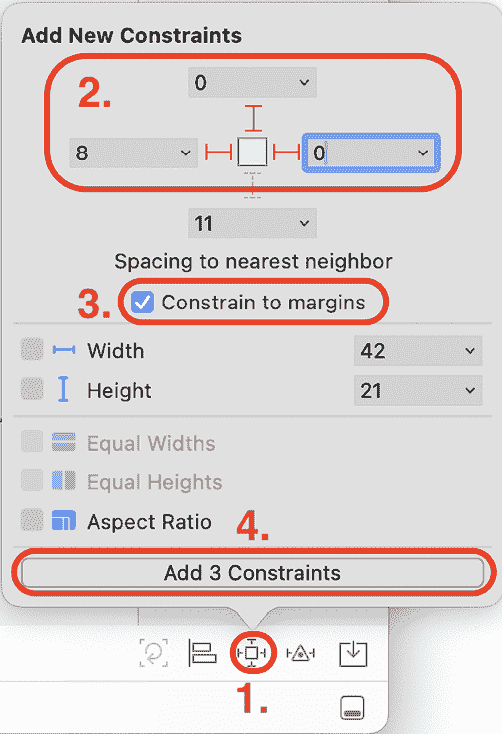

图 22.22：第二个标签的约束条件

现在原型集合视图单元格已包含一个图像视图和两个标签，并且已添加所有必要的约束。太棒了！在下一节中，你将修改`JournalListTableViewCell`类以管理集合视图单元格的内容。

## 修改`JournalListTableViewCell`类

最初，`JournalListTableViewCell`类用于在“日记列表”屏幕中管理表格视图实例的表格视图单元格。由于你已经用集合视图替换了表格视图，因此需要重新建立`JournalListTableViewCell`类与集合视图单元格中添加的 UI 元素之间的所有连接。按照以下步骤操作：

1.  首先，你将更改`JournalListTableViewCell`类的名称，以更准确地描述其新角色。在项目导航器中点击`JournalListTableViewCell`文件。在文件中的类名上右键单击，并从弹出菜单中选择**重构** | **重命名…**：

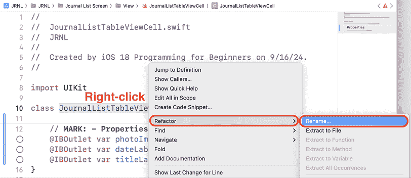

图 22.23：弹出菜单，选择 Refactor | Rename…

1.  将名称更改为`JournalListCollectionViewCell`并点击**重命名**：

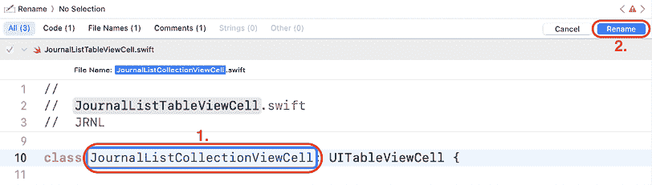

图 22.24：显示新名称的编辑区域

1.  你将修改类声明，因为这个类现在用于管理集合视图单元格。将超类更改为`UICollectionViewCell`：

    ```swift
    class JournalListCollectionViewCell: **UICollectionViewCell** { 
    ```

1.  现在，将这个类分配为集合视图单元格的标识符。在项目导航器中点击**Main**故事板文件，然后在文档大纲中点击**Journal Scene**下的**Collection View Cell**：

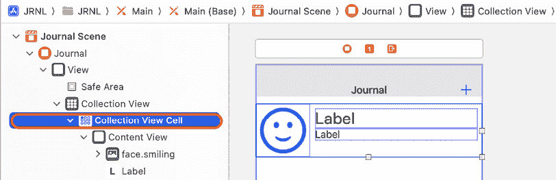

图 22.25：编辑区域显示在期刊场景中的集合视图单元格

1.  点击标识符检查器按钮。在**自定义类**部分下，将**类**设置为`JournalListCollectionViewCell`。这设置了一个`JournalListCollectionViewCell`实例作为集合视图单元格的自定义集合视图子类。完成后按*Return*键：

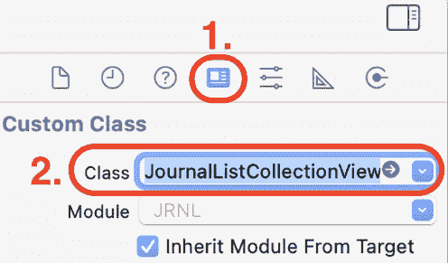

图 22.26：标识符检查器显示类设置为 JournalListCollectionViewCell

1.  点击属性检查器按钮。在**集合可重用视图**下，将**标识符**设置为`journalCell`：

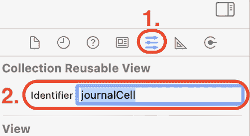

图 22.27：属性检查器显示标识符设置为 journalCell

注意，文档大纲中集合视图单元格的名称已更改为**journalCell**。

1.  在文档大纲中选中**journalCell**，点击连接检查器按钮以显示**journalCell**的出口。

1.  从**photoImageView**出口拖动到表格视图单元格中的图像视图。

1.  从**dateLabel**出口拖动到表格视图单元格顶部的标签。

1.  从**titleLabel**出口拖动到底部标签在表格视图单元格中。

1.  完成后，验证连接看起来像以下截图：

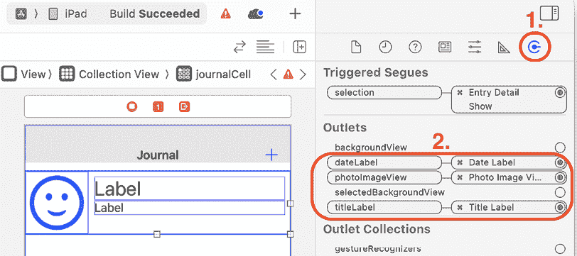

图 22.28：连接检查器显示 journalCell 的连接

记住，如果你犯了错误，你可以点击**x**来断开连接，然后再次从出口拖动到 UI 元素。

`Main`故事板文件中的`journalCell`集合视图单元格已使用`JournalCollectionTableViewCell`类设置。集合视图单元格的图像视图和标签的出口也已分配。在下一节中，你将更新`JournalListViewController`类以使用集合视图而不是表格视图。

## 修改 JournalListViewController 类

目前，`JournalListViewController`类有一个`UITableView`对象的出口，并实现了数据源和代理方法来管理表格视图。你将修改这个类以使用集合视图。按照以下步骤操作：

1.  首先，你将修改类声明以使用`UICollectionView`实例。在项目导航器中点击**JournalListViewController**文件。按照以下方式修改类声明：

    ```swift
    class JournalListViewController: UIViewController, 
    **UICollectionViewDataSource****,** **UICollectionViewDelegate****,** **UICollectionViewDelegateFlowLayout** { 
    ```

在这里，您已将数据源和代理协议更改为集合视图的等效协议，并添加了对新协议 `UICollectionViewDelegateFlowLayout` 的遵守。此协议用于确定集合视图中集合视图单元格的布局。您将看到一个错误，因为集合视图数据源方法尚未实现。不要担心这个错误，因为您将在本节稍后的步骤中修复它。

1.  要更改 `tableview` 输出的名称，右键单击它，并从弹出菜单中选择 **重构** | **重命名…**：

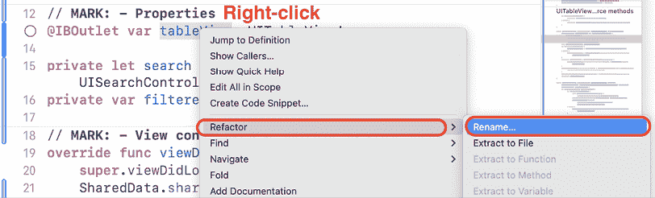

图 22.29：选择“重构 | 重命名…”的弹出菜单

1.  将名称更改为 `collectionView` 并点击 **重命名**：

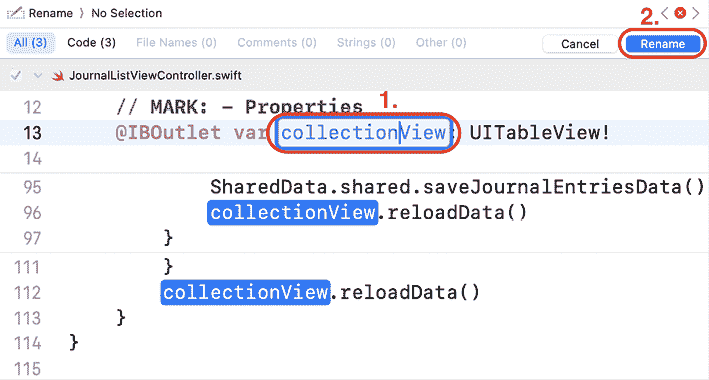

图 22.30：编辑区域显示新名称

1.  由于视图控制器将管理一个集合视图，将输出类型从 `UITableView` 更改为 `UICollectionView`：

    ```swift
    @IBOutlet var collectionView: **UICollectionView**! 
    ```

1.  要建立 UI 元素与您的代码之间的连接，请在项目导航器中点击 **Main** 故事板文件，并在文档大纲中点击第一个 **Journal 场景**。

1.  点击连接检查器按钮，从 **collectionView** 输出拖动到文档大纲中的 **集合视图**：

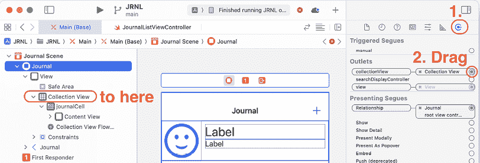

图 22.31：连接检查器显示 JournalListViewController 的连接

1.  在文档大纲中点击 **Collection View**。从 **dataSource** 和 **delegate** 输出拖动到文档大纲中的视图控制器（显示为 **Journal**）。

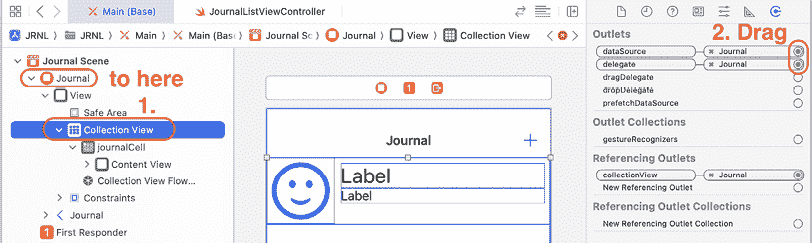

图 22.32：连接检查器显示 collectionView 的连接

1.  现在您将修复 `JournalListViewController` 类中的错误。在项目导航器中点击 **JournalListViewController** 文件，并将您的代码中的表格视图数据源方法替换为以下集合视图数据源方法：

    ```swift
    // MARK: - UICollectionViewDataSource
    func collectionView(_ collectionView: UICollectionView, numberOfItemsInSection section: Int) -> Int {
      if search.isActive {
        return filteredTableData.count
      } else {
        return SharedData.shared.numberOfJournalEntries()
      }
    }
    func collectionView(_ collectionView: UICollectionView, cellForItemAt indexPath: IndexPath) -> UICollectionViewCell {
      let journalCell = collectionView.dequeueReusableCell(  withReuseIdentifier: "journalCell", for: indexPath) as!   JournalListCollectionViewCell
      let journalEntry: JournalEntry
      if search.isActive {
        journalEntry = filteredTableData[indexPath.row]
      } else {
        journalEntry = SharedData.shared.journalEntry(at:     indexPath.row)
      }
      if let photoData = journalEntry.photoData {
        journalCell.photoImageView.image = UIImage(data:    photoData)
      }
      journalCell.dateLabel.text = journalEntry.date.formatted(
       .dateTime.month().day().year()
      )
      journalCell.titleLabel.text = journalEntry.entryTitle
      return journalCell
    } 
    ```

如您所见，它们与您之前使用的表格视图数据源方法非常相似。

1.  由于您现在正在使用集合视图，`tableView(_:commit:forRowAt:)` 方法不能再用于删除单元格。将 `tableView(_:commit:forRowAt:)` 方法替换为以下方法：

    ```swift
    // MARK: - UICollectionView delete method
    func collectionView(_ collectionView: UICollectionView, contextMenuConfigurationForItemsAt indexPaths: [IndexPath], point: CGPoint) -> UIContextMenuConfiguration? {
      guard let indexPath = indexPaths.first else {
        return nil
      }
      let config = UIContextMenuConfiguration(
      previewProvider: nil)
      { (elements) -> UIMenu? in
        let delete = UIAction(title: "Delete") { (action) in
          if self.search.isActive {
            let selectedJournalEntry = self.filteredTableData[        indexPath.item]
            self.filteredTableData.remove(at: indexPath.item)
            SharedData.shared.removeSelectedJournalEntry(        selectedJournalEntry)
          } else {
            SharedData.shared.removeJournalEntry(at:        indexPath.item)
          }
          SharedData.shared.saveJournalEntriesData()
          collectionView.reloadData()
        }
        return UIMenu(children: [delete])
      }
      return config
    } 
    ```

代替向左滑动以删除，此方法实现了一个上下文菜单，其中包含一个选项 **删除**，当您在集合视图单元格上轻按并保持时出现。

1.  您还会在 `prepare(for:sender:)` 方法中看到一个错误。按照以下方式修改 `prepare(for:sender:)` 方法中的 `guard` 语句：

    ```swift
    guard let journalEntryDetailViewController = segue.destination as? JournalEntryDetailViewController, let selectedJournalEntryCell = sender as? JournalListCollectionViewCell, let indexPath = **collectionView**.indexPath(for: selectedJournalEntryCell) else {
      fatalError("Could not get indexpath")
    } 
    ```

`JournalListViewController` 中的所有错误都已解决。太棒了！在下一节中，您将添加代码以根据设备屏幕尺寸和方向更改集合视图单元格的大小。

# 使用大小类动态修改集合视图单元格大小

正如你之前看到的，在“期刊列表”屏幕上的表格视图使用单列排列的行来呈现表格视图单元格。这在 iPhone 上工作得很好，但正如你所看到的，如果在 iPad 上运行应用，这会导致大量的空间浪费。尽管你可以为 iPhone 和 iPad 使用相同的 UI，但如果你能根据每个设备进行定制会更好。

为了做到这一点，你将添加一些代码，使你的应用能够识别其正在运行的屏幕大小，并且你将动态修改集合视图中的集合视图单元格的大小以适应。你可以使用大小类别来识别当前屏幕大小；你将在下一节中了解它们。

## 理解大小类别

为了确定你的应用正在运行的屏幕大小，你必须考虑设备方向对你的 UI 的影响。由于屏幕尺寸在纵向和横向都有很大的差异，这可能会很有挑战性。为了使这更容易，你将使用大小类别而不是设备的物理分辨率。

关于大小类别的更多信息，请参阅此链接：[`developer.apple.com/design/human-interface-guidelines/layout`](https://developer.apple.com/design/human-interface-guidelines/layout)。

大小类别是操作系统自动分配给视图的特性。定义了两个类别，描述了视图的高度和宽度：常规（扩展空间）和紧凑（约束空间）。让我们看看不同设备上全屏视图的大小类别：

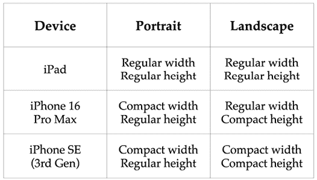

图 22.33：不同 iOS 设备的大小类别

对于*JRNL*应用，你将在“期刊列表”屏幕中配置集合视图，如果大小类别是紧凑的，则使用单列的集合视图单元格，如果大小类别是常规的，则使用两列。

你将为你的应用添加代码以确定当前的大小类别。一旦你知道了大小类别，你就能设置要使用的列数和集合视图中的集合视图单元格的大小。你将在下一节中学习如何做到这一点。

## 修改 JournalListViewController 类

你已经使`JournalListViewController`类采用了`UICollectionViewDelegateFlowLayout`协议。现在你将创建并设置集合视图的布局，使用`UICollectionViewFlowLayout`实例，并实现动态设置集合视图单元格大小的方法。

按照以下步骤操作：

1.  在项目导航器中点击**JournalListViewController**文件。在`JournalListViewController`类中，在闭合花括号之前添加以下方法到类定义中：

    ```swift
    func setupCollectionView() {
      let flowLayout = UICollectionViewFlowLayout()
      flowLayout.sectionInset = UIEdgeInsets(top: 10, left: 10,
      bottom: 10, right: 10)
      flowLayout.minimumInteritemSpacing = 0
      flowLayout.minimumLineSpacing = 10
      collectionView.collectionViewLayout = flowLayout
    } 
    ```

此方法创建了一个`UICollectionViewFlowLayout`类的实例，将集合视图的所有边缘内边距设置为 10 点，将最小项间距设置为 0 点，将最小行间距设置为 10 点，并将其分配给集合视图。分区内边距反映了分区外边缘的间距。最小项间距是在同一行中的项之间使用的最小间距。最小行间距是在网格中项的行之间使用的最小间距。

1.  在`setupCollectionView()`方法之后添加以下`UICollectionViewDelegateFlowLayout`方法：

    ```swift
    // MARK: - UICollectionViewDelegateFlowLayout
    func collectionView(_ collectionView: UICollectionView, layout collectionViewLayout: UICollectionViewLayout, sizeForItemAt indexPath: IndexPath) -> CGSize {
      let numberOfColumns: CGFloat
      if (traitCollection.horizontalSizeClass == .compact) {
        numberOfColumns = 1
      } else {
        numberOfColumns = 2
      }
      let viewWidth = collectionView.frame.width
      let inset = 10.0
      let contentWidth = viewWidth - inset * (
      numberOfColumns + 1)
      let cellWidth = contentWidth / numberOfColumns
      let cellHeight = 90.0
      return CGSize(width: cellWidth, height: cellHeight)
    } 
    ```

此方法确定要显示的列数，并设置集合视图单元格的高度和宽度。

让我们分解一下：

```swift
func collectionView(_ collectionView: UICollectionView, layout collectionViewLayout: UICollectionViewLayout, sizeForItemAt indexPath: IndexPath) -> CGSize { 
```

此方法返回一个`CGSize`实例，应将其设置为集合视图单元格的大小。

```swift
let numberOfColumns: CGFloat
if (traitCollection.horizontalSizeClass == .compact) {
  numberOfColumns = 1
} else {
  numberOfColumns = 2
} 
```

此代码设置要显示的列数。

```swift
let viewWidth = collectionView.frame.width 
```

此语句获取屏幕宽度并将其分配给`viewWidth`。

```swift
let inset = 10.0
let contentWidth = viewWidth - inset * (
numberOfColumns + 1) 
```

此代码减去边缘内边距所占用的空间，以便确定单元格大小。

```swift
let cellWidth = contentWidth / numberOfColumns 
```

此语句通过将`contentWidth`除以列数来计算单元格宽度，并将其分配给`cellWidth`。

```swift
let cellHeight = 90.0 
```

此语句将`90`分配给`cellHeight`，这将用于设置单元格高度。

```swift
return CGSize(width: cellWidth, height: cellHeight)
} 
```

此语句返回包含单元格大小的`CGSize`实例。

假设您正在以竖屏模式在 iPhone 16 Pro Max 上运行。水平尺寸类将是`.compact`，因此`numberOfColumns`设置为`1`。`viewWidth`将被分配给 iPhone 屏幕的宽度，即`414`点。`contentWidth`设置为`414 - (10 x 2) = 394`。`cellWidth`设置为`contentWidth / numberOfColumns = 394`，`cellHeight`设置为`90`，因此返回的`CGSize`实例将是`(394, 90)`，使得一行可以容纳一个单元格。

当将相同的 iPhone 旋转到横屏模式时，水平尺寸类将是`.regular`，因此`numberOfColumns`设置为`2`。`viewWidth`将被分配给 iPhone 屏幕的高度，即`896`点。`contentWidth`设置为`896 - (10 x 3) = 866`。`cellWidth`设置为`contentWidth / numberOfColumns = 433`，`cellHeight`设置为`90`，因此返回的`CGSize`实例将是`(433, 90)`，使得两行可以容纳两个单元格。

1.  修改`viewDidLoad()`方法以调用`setupCollectionView()`方法：

    ```swift
    override func viewDidLoad() {
      super.viewDidLoad()
      SharedData.shared.loadJournalEntriesData()
      **setupCollectionView****()**
      search.searchResultsUpdater = self
      search.obscuresBackgroundDuringPresentation = false
      search.searchBar.placeholder = "Search titles"
      navigationItem.searchController = search
    } 
    ```

1.  在`viewDidLoad()`方法之后添加以下方法，以便在设备旋转时重新计算列数和集合视图单元格的大小：

    ```swift
    override func viewWillLayoutSubviews() {
      super.viewWillLayoutSubviews()
      collectionView.collectionViewLayout.invalidateLayout()
    } 
    ```

您已经实现了所有根据尺寸类更改集合视图单元格大小的代码。太棒了！在下一节中，您将在不同的模拟设备和您的 Mac 上测试您的应用。

# 在不同设备上测试您的应用

现在您已经实现了所有动态设置集合视图单元格大小的代码，您将在不同的模拟设备和您的 Mac 上测试您的应用。按照以下步骤操作：

1.  模拟器应仍然设置为 iPad。构建并运行您的应用程序。它将显示两列，如下所示：

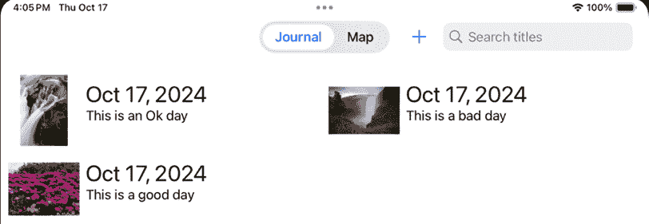

图 22.34：模拟器显示双列的 iPad 屏幕

1.  从**设备**菜单中选择**向左旋转**，您仍然会看到两列，但单元格已扩展以填充屏幕：

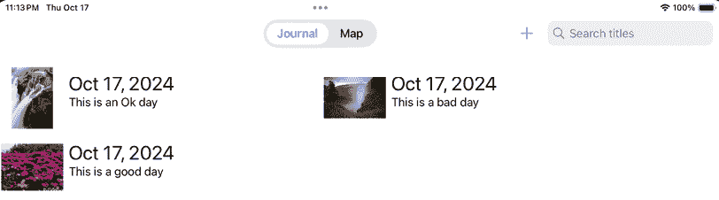

图 22.35：模拟器显示左旋转的 iPad 屏幕，带有两列

1.  停止您的应用程序，并在目标菜单中选择**iPhone SE (第 3 代)**。再次在模拟器上运行您的应用程序，它将显示单列，如下所示：

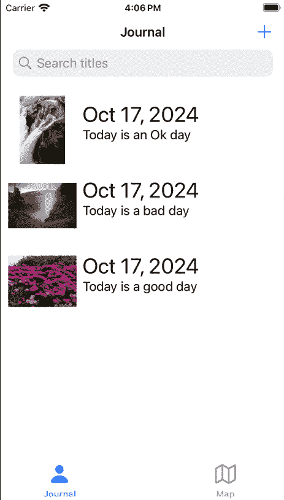

图 22.36：模拟器显示单列的 iPhone 屏幕

模拟器在启动 iPhone 实例时不会自动关闭 iPad 实例。为了获得更好的性能，请手动关闭 iPad 实例。

1.  从**设备**菜单中选择**向左旋转**，您仍然会看到单列，但单元格大小已扩展以填充屏幕：

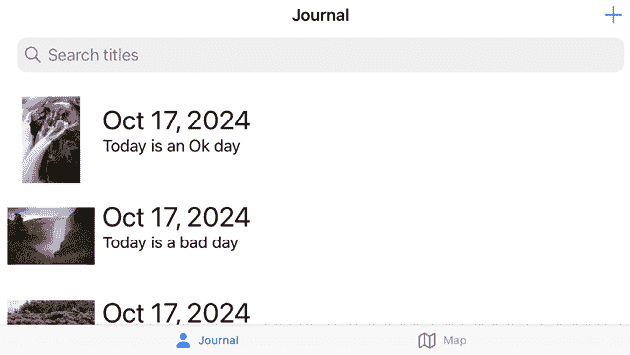

图 22.37：模拟器显示旋转后的 iPhone 屏幕，带有单列

1.  停止您的应用程序，并在目标菜单中选择**iPhone 16 Pro Max**。再次在模拟器上运行您的应用程序，它将显示单列，如下所示：

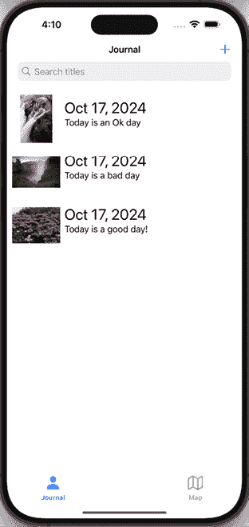

图 22.38：模拟器显示单列的 iPhone 屏幕

1.  从**设备**菜单中选择**向左旋转**，您将看到两列：

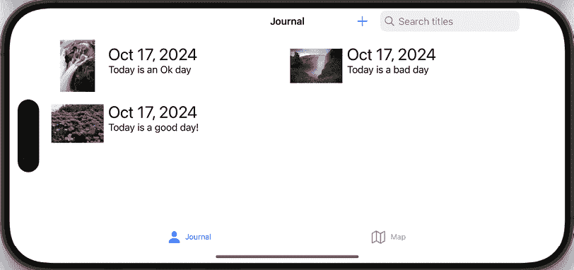

图 22.39：模拟器显示旋转后的 iPhone 屏幕，带有两列

1.  停止您的应用程序，并在目标菜单中选择**MyMac (专为 iPad 设计)**。运行您的应用程序，它应该显示两列：

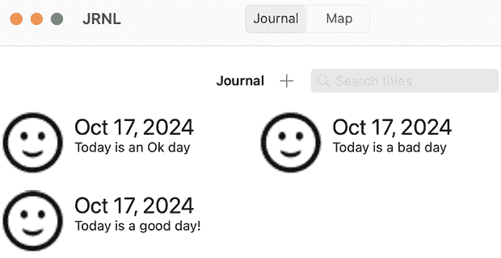

图 22.40：具有两列的 Mac 应用程序

您需要一个免费或付费的 Apple 开发者账户才能在您的 Mac 上运行您的应用程序。

在撰写本文时，当应用程序在 Mac 上运行时点击相机按钮会导致应用程序崩溃。为了解决这个问题，从菜单栏中选择**产品 | 方案 | 编辑方案...**，从侧边栏中选择**运行**，点击**诊断**选项卡，并取消选中**Metal API 验证**复选框。

您已将您的应用程序修改为使用集合视图代替表格视图，并且已启用它在不同设备上运行时动态修改集合视图单元格大小。做得好！

# 摘要

在本章中，您将 Journal List 屏幕上的表格视图替换为集合视图，这使得在您在 iPad 或 Mac 上运行应用程序时更好地利用额外的屏幕空间。您还使用大小类使您的应用程序在设备旋转时动态修改列数和集合视图单元格大小。

首先，在`Main`故事板文件中，您将期刊列表屏幕上的表格视图替换为集合视图，并配置集合视图单元格以显示表格视图单元格曾经显示的相同信息。接下来，您修改了`JournalListTableViewController`和`JournalListTableViewCell`类，以便与集合视图和集合视图单元格一起工作。然后，您添加了代码以动态更改集合视图单元格的大小，以适应您的应用程序正在运行的显示。最后，您在模拟器和您的 Mac 上创建并测试了您的应用程序。

您现在应该能够在您的应用程序中使用集合视图，并了解如何根据尺寸类别动态修改您应用程序的界面。

这本书的第三部分到此结束。在下一部分，您将了解苹果在 WWDC 2024 期间推出的新酷炫功能，从 SwiftUI 开始。

# 留下评论！

感谢您从 Packt Publishing 购买此书——我们希望您喜欢它！您的反馈对我们来说无价，它帮助我们改进和成长。一旦您阅读完毕，请花一点时间在亚马逊上留下评论；这只需一分钟，但对像您这样的读者来说意义重大。扫描下面的二维码或访问链接，以获取您选择的免费电子书。

[`packt.link/NzOWQ`](https://packt.link/NzOWQ%0D)


