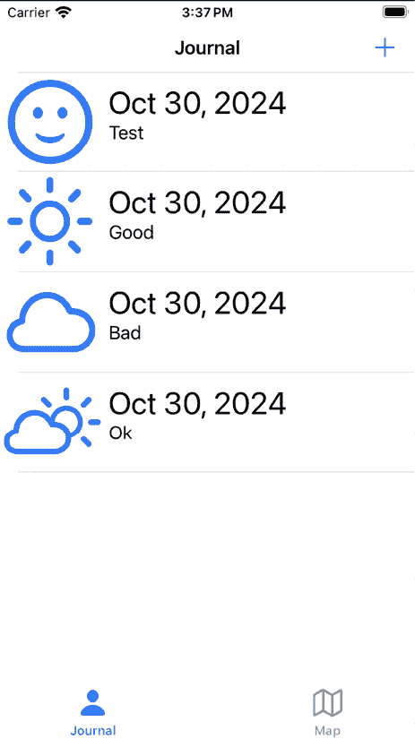
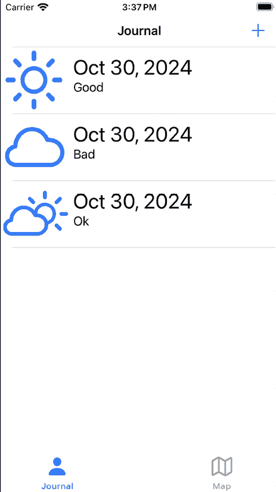
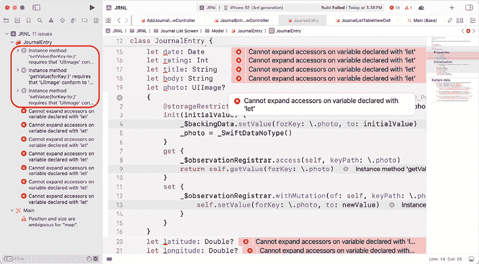
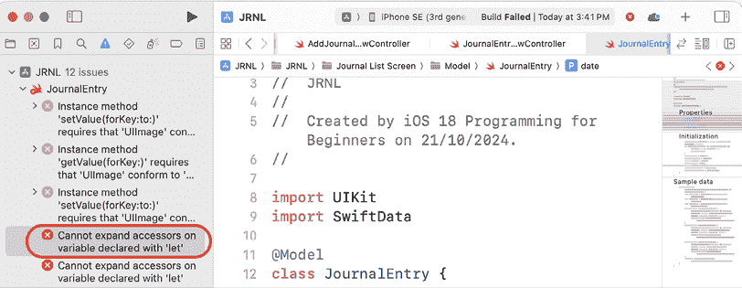
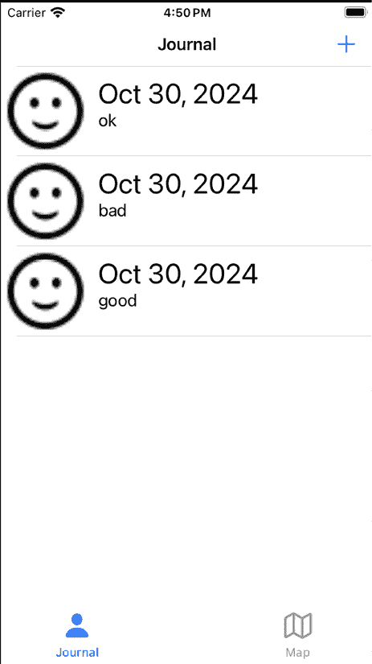
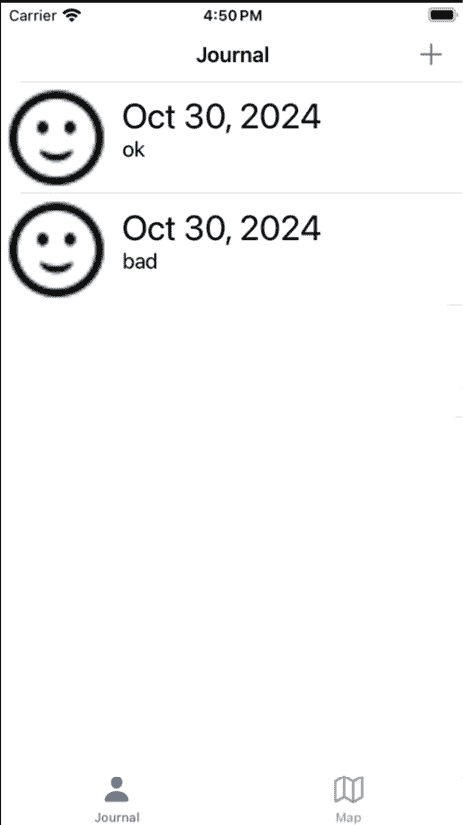

# SwiftData 入门

在 2023 年苹果公司的**全球开发者大会**（**WWDC**）上，他们介绍了全新的框架**SwiftData**，用于保存应用程序数据。之前，开发者必须使用编辑器来创建数据模型，但 SwiftData 允许开发者使用常规 Swift 代码描述数据模型并操作模型实例。自动提供的关系管理、撤销/重做支持、iCloud 同步等功能。在 2024 年，苹果公司添加了新的 API，使开发者能够构建自定义数据存储、处理事务历史记录、模型索引和复合唯一约束等。

在本章中，你将修改在*第十六章*，“在视图控制器之间传递数据”中完成的*JRNL*应用程序，以使用 SwiftData 保存日记条目。这意味着当你向应用程序添加新的日记条目时，它们将在应用程序下次启动时再次出现。

首先，你将了解 SwiftData 及其组件。接下来，你将修改`JournalEntry`类以使其与 SwiftData 兼容，并修改`JournalListViewController`类以与修改后的`JournalEntry`类协同工作。之后，你将通过添加代码来实现 SwiftData，这些代码将允许你读取、写入和删除日记条目；最后，你将修改`JournalViewController`类以读取、保存和删除存储的日记条目。

到本章结束时，你将学会如何使用 SwiftData 保存应用程序数据，并将能够在自己的应用程序中实现它。

本章将涵盖以下主题：

+   介绍 SwiftData

+   修改`JournalEntry`类

+   实现 SwiftData 组件

+   修改`JournalListViewController`类

# 技术要求

你将继续在*第十六章*，“在视图控制器之间传递数据”中修改的`JRNL`项目上工作。

本书代码包中的资源文件和完成后的 Xcode 项目位于`Chapter23`文件夹中，可以在此处下载：

[`github.com/PacktPublishing/iOS-18-Programming-for-Beginners-Ninth-Edition`](https://github.com/PacktPublishing/iOS-18-Programming-for-Beginners-Ninth-Edition%0D)

查看以下视频，了解代码的实际应用：

[`youtu.be/VFYb8Yohh6g`](https://youtu.be/VFYb8Yohh6g%0D)

让我们从了解 SwiftData 开始。

# 介绍 SwiftData

SwiftData 是苹果公司全新的框架，用于将应用程序数据保存到您的设备上。它自动提供关系管理、撤销/重做支持、iCloud 同步等功能。您可以使用常规 Swift 类型来建模数据，然后 SwiftData 将根据您指定的模型构建自定义模式，并将字段映射到设备存储。您可以使用由编译器进行类型检查的表达式查询和筛选数据，从而减少错误或打字错误。

您可以在 [`developer.apple.com/documentation/swiftdata`](https://developer.apple.com/documentation/swiftdata) 上了解更多关于 SwiftData 的信息。

在 WWDC 2024 上，Apple 为 SwiftData 添加了新的 API。这些 API 允许您使用宏来建模索引和复合唯一约束，使用您自己的文档格式构建自定义数据存储，跟踪事务历史记录，以及更多。

您可以在 [`developer.apple.com/videos/play/wwdc2024/10137/`](https://developer.apple.com/videos/play/wwdc2024/10137/) 上了解更多关于 SwiftData 中的新功能。

实现应用程序的 SwiftData 需要几个步骤。首先，使用 `@Model` 宏将现有类转换为模型。支持基本类型，如 `Bool`、`Int` 和 `String`，以及复杂值类型，如结构和枚举。接下来，根据需要使用注释如 `@Attribute(.unique)` 来确保属性的值是唯一的，以及 `@Attribute(.externalStorage)` 来将属性的值作为二进制数据存储在模型存储旁边。然后，指定要持久化的模型并创建一个 `ModelContainer` 实例，该实例管理应用程序的模式和模型存储配置。

之后，使用 `ModelContext` 实例在应用程序运行时检索、插入和删除模型实例，并将任何更改保存到设备存储。最后，为了从设备存储中检索特定实例，使用包含搜索谓词和排序顺序的 `FetchDescriptor` 实例。

您可以在 [`developer.apple.com/documentation/swiftdata/preserving-your-apps-model-data-across-launches`](https://developer.apple.com/documentation/swiftdata/preserving-your-apps-model-data-across-launches) 上了解更多关于在应用程序启动之间保留应用程序模型数据的信息。

在您为 *JRNL* 应用程序实现 SwiftData 之前，这里有一个示例来帮助您可视化您需要执行的操作以保存日记条目。

想象一下您正在使用 Microsoft Word 保存日记条目。您首先创建一个新的 Word 文档模板，其中包含日记条目的相关字段。然后，您根据模板创建新的 Word 文档并填写数据。您进行必要的更改，比如更改日记条目的文本或更改照片。当您对文档满意时，您将其保存到计算机的硬盘上。下次您想查看日记条目时，您在硬盘上搜索相关文档，双击它以在 Word 中打开，以便再次查看。

现在您已经了解了需要执行的操作，让我们回顾一下实现应用程序的 SwiftData 所需的步骤。

首先，您将现有的 `JournalEntry` 类转换为模型，这就像是一个 Microsoft Word 模板。您通过使用 `@Model` 宏注释 `JournalEntry` 类来实现这一点。`JournalEntry` 类的属性就像 Microsoft Word 模板中的字段，如果需要，您将使用 `@Attribute` 宏自定义属性。

接下来，您将创建一个`ModelContainer`实例，它将用于在您的设备存储上存储`JournalEntry`模型实例，并创建一个`ModelContext`实例，它将用于在内存中存储`JournalEntry`模型实例。这就像从 Microsoft Word 模板创建的 Microsoft Word 文件可以存储在您的计算机硬盘上或在编辑时保留在内存中一样。

之后，您将添加代码，以便在创建新的期刊条目时，创建一个`JournalEntry`模型实例并将其添加到`ModelContext`实例中，然后它将与`ModelContainer`实例协调以将其保存到设备存储。这就像在完成 Word 文档后将其保存到硬盘上一样。

您可以通过观看以下视频了解更多关于如何使用 SwiftData 构建应用程序的信息：[`developer.apple.com/videos/play/wwdc2023/10154/`](https://developer.apple.com/videos/play/wwdc2023/10154/).

现在您已经基本了解了 SwiftData 的工作原理，您将在下一节中使用`JournalEntry`类创建`JournalEntry`模型。

# 修改`JournalEntry`类

目前，当您使用添加新期刊条目屏幕创建新的期刊条目并点击**保存**按钮时，条目将出现在期刊列表屏幕上：



图 23.1：模拟器显示添加到期刊列表屏幕的新条目

如果您退出并重新启动您的应用程序，新添加的条目将消失：



图 23.2：模拟器显示在应用程序重新启动后新条目消失

这是因为`journalEntries`数组的内容仅在内存中保留，当应用程序关闭时并未保存到设备存储。为了解决这个问题，您将为您的应用程序实现 SwiftData。实现 SwiftData 的第一步是从现有的`JournalEntry`类创建模型对象，根据需要修改此和其他类。

按照以下步骤操作：

1.  在项目导航器中，点击**JournalEntry**文件（位于**期刊列表场景** | **模型**组）。导入`SwiftData`框架，并使用`@Model`宏注释`JournalEntry`类，如下所示：

    ```swift
    import UIKit
    **import** **SwiftData**
    **@Model**
    class JournalEntry {
        //MARK: - Properties
        let date: Date 
    ```

1.  从 Xcode 的**产品**菜单中选择**构建**。您将在导航器区域看到错误消息出现。点击前三个错误消息中的任何一个以展开宏并显示错误：



图 23.3：编辑区域显示错误

这些错误出现是因为 SwiftData 目前不支持`UIImage`类。为了修复这个问题，您需要修改`JournalEntry`类，使用`Data`实例代替`UIImage`实例。

1.  将`JournalEntry`类中的`photo`属性替换为`photoData`属性，类型为`Data?`，如下所示：

    ```swift
    let body: String
    **@Attribute****(.****externalStorage****)** **let****photoData****:** **Data****?**
    let latitude: Double? 
    ```

`@Attribute(.externalStorage)`注释将照片数据存储在模型数据相邻的二进制文件中，这使得它更高效。

1.  接下来，您将解决其他错误消息，这些错误消息说**Cannot expand accessors on variable declared with ‘let’**：



图 23.4：显示错误的导航器区域

1.  为了解决这个问题，将`JournalEntry`类属性的`let`关键字全部替换为`var`，如下所示：

    ```swift
    // MARK: - Properties
    **var** date: Date
    **var** rating: Int
    **var** title: String
    **var** body: String
    @Attribute(.externalStorage) **var** photoData: Data?
    **var** latitude: Double?
    **var** longitude: Double? 
    ```

1.  `JournalEntry`类的初始化器中会有一个错误。为了修复它，按照以下方式修改初始化器中的代码：

    ```swift
    self.body = body
    **self****.****photoData****=** **ph********oto****?****.jpegData(compressionQuality:** **1.0****)**
    self.latitude = latitude**** 
    ```

****此语句将使用 JPEG 编码将`UIImage`实例转换为`Data`实例，这可以存储在`photoData`属性中。

1.  如果现在构建项目，将出现更多错误。在项目导航器中单击**JournalEntryDetailViewController**文件。按照以下方式修改`viewDidLoad()`方法：

    ```swift
    titleLabel.text = selectedJournalEntry?.title
    bodyTextView.text = selectedJournalEntry?.body
    **if****let** **photoData** **=****selectedJournalEntry****?****.****photoData** **{**
    **photoImageView****.****image****=****UIImage****(****data****:** **photoData****)**
    **}** 
    ```

此代码检查`JournalEntry`实例的`photoData`属性是否有值。如果有，它将转换为`UIImage`实例并分配给`photoImageView`实例的`image`属性。

1.  在项目导航器中单击**JournalListViewController**文件。按照以下方式修改`tableView(_:cellForRowAt:)`方法：

    ```swift
    let journalEntry = journalEntries[indexPath.row]
    **if****let** **photoData** **=** **journalEntry.****photoData** **{**
    **Task** **{**
     **journalCell.****photoImageView.****image****=****UIImage****(****data****: ****    photoData)**

     **}**
    **}**
    journalCell.dateLabel.text = journalEntry.date.formatted(
      .dateTime.month().day().year()
    ) 
    ```

此代码检查`JournalEntry`实例的`photoData`属性是否有值。如果有，它将转换为`UIImage`实例并分配给`journalCell.photoImageView.image`。由于此过程在表格视图的每一行都会重复，并且将 JPEG 数据解码为`UIImage`实例可能很慢，因此使用`Task`块使此过程异步。

所有错误现在应该都已解决。您可能需要退出并重新打开项目，才能使所有错误消失。

如果现在构建并运行您的项目，您将得到一个错误，因为 SwiftData 的`ModelContainer`实例尚未创建。您将在下一节中学习如何创建它。

# 实现 SwiftData 组件

现在您已经使用`JournalEntry`类创建了一个`JournalEntry`模型，您将创建一个包含`ModelContainer`对象和`ModelContext`实例的单例类。然后您将为存储在`ModelContext`中的`JournalEntry`模型实例添加方法。

单词**singleton**意味着在您的应用程序中只有一个此类实例。

按照以下步骤操作：

1.  在项目导航器中右键单击`JRNL`文件夹，并从弹出菜单中选择**New File from Template...**。

1.  **iOS**应该已经选中。选择**Swift File**然后点击**Next**。

1.  将此文件命名为`SharedData`。点击**Create**。`SharedData`文件出现在项目导航器中。将文件移动到`SceneDelegate`文件下。

1.  在`import`语句之后添加以下代码：

    ```swift
    import SwiftData 
    ```

这允许您使用 SwiftData 框架。

1.  在`import`语句之后添加以下代码以声明和定义`SharedData`类：

    ```swift
    class SharedData {
      // MARK: - Properties
      @MainActor static let shared = SharedData()
      let container: ModelContainer
      let context: ModelContext

      // MARK: - Initialization
      private init() {
        do {
          container = try ModelContainer(for:       JournalEntry.self)
          context = ModelContext(container)   
        } catch {
          fatalError("Could not create SwiftData model 
          container or context")
        }
      } 
    } 
    ```

此类创建了一个单例实例，该实例将在你的整个应用程序中可用，并将其分配给 `shared` 静态变量。它还创建并初始化 `ModelContainer` 和 `ModelContext` 实例，并将它们分别分配给 `container` 和 `context` 属性。

接下来，你将添加用于加载、添加和删除 `JournalEntry` 模型实例的方法。按照以下步骤操作：

1.  在初始化器之后添加以下代码以实现 `loadJournalEntries()` 方法：

    ```swift
    func loadJournalEntries() -> [JournalEntry] {
      let descriptor = FetchDescriptor<JournalEntry>(sortBy:  
      [SortDescriptor<JournalEntry>(\.date, order: .reverse)])
      do {
        let journalEntries = try context.fetch(descriptor)
        return journalEntries
      } catch {
        return []
      }
    } 
    ```

让我们分解一下：

```swift
func loadJournalEntries() -> [JournalEntry] { 
```

此方法返回一个 `JournalEntry` 实例数组。

```swift
let descriptor = FetchDescriptor<JournalEntry>(sortBy:  
[SortDescriptor<JournalEntry>(\.date, order: .reverse)]) 
```

该语句创建了一个 `FetchDescriptor` 实例，指定从 `ModelContext` 实例中检索并按日期排序（从新到旧）存储的所有 `JournalEntry` 模型实例。

```swift
do {
  let journalEntries = try context.fetch(descriptor)
  return journalEntries
} catch {
  return []
  }
} 
```

这段代码从 `ModelContext` 实例中获取由 `FetchDescriptor` 实例指定的所有 `JournalEntry` 模型实例，并将它们分配给 `journalEntries`，这是一个类型为 `[JournalEntry]` 的常量，然后返回。如果操作失败，将返回一个空数组。

1.  通过在最后的括号之前添加以下代码来实现 `saveJournalEntry(_:)` 方法：

    ```swift
    func saveJournalEntry(_ journalEntry: JournalEntry) {
      context.insert(journalEntry)
      try? context.save()
    } 
    ```

此方法将传递给它的 `journalEntry` 实例作为 `JournalEntry` 模型实例插入到 `ModelContext` 实例中。

1.  通过在最后的括号之前添加以下代码来实现 `deleteJournalEntry(_:)` 方法：

    ```swift
    func deleteJournalEntry(_ journalEntry: JournalEntry) {
      context.delete(journalEntry)
      try? context.save()
    } 
    ```

此方法将从 `ModelContext` 实例中删除相应的 `JournalEntry` 模型实例。

你已经创建了一个 `SharedData` 类，该类创建了一个 `ModelContainer` 实例，并实现了从 `ModelContext` 对象中检索、添加和删除 `JournalEntry` 模型实例的方法。你可以构建你的应用程序以测试错误，但你还不能运行它。

到目前为止，你已经在你的应用程序中实现了所有必需的 SwiftData 组件。在下一节中，你将配置 `JournalListViewController` 类，以便在应用程序运行时从 `ModelContainer` 实例中检索所有存储的日记条目，在你添加新的日记条目时将新的 `JournalEntry` 模型实例添加到 `ModelContext` 实例中，以及在你删除日记条目时从 `ModelContext` 实例中删除 `JournalEntry` 模型实例。

# 修改 `JournalListViewController` 类

在之前，当你从你的应用程序中添加或删除日记条目时，当你停止并再次运行应用程序时所做的更改将会消失，因为 `JournalListViewController` 类中的代码没有将应用程序数据保存到你的设备上的方法。在本节中，你将向 `JournalListViewController` 类中添加代码以使用 SwiftData 保存应用程序数据。

当你运行应用程序时，你将更新 `viewDidLoad()` 方法以从设备存储中检索所有日记条目，更新 `unwindNewEntrySave(segue:)` 方法以将新的日记条目添加到 `ModelContext` 实例中，并更新 `tableView(_:commit:forRowAt:)` 方法以从 `ModelContext` 实例中删除指定的日记条目。按照以下步骤操作：

1.  在项目导航器中点击`JournalListViewController`文件，并在闭合花括号之前添加一个方法以从设备存储中检索所有日记条目：

    ```swift
    func fetchJournalEntries() {
      journalEntries =
      SharedData.shared.loadJournalEntries()
      tableView.reloadData()
    } 
    ```

此方法调用`SharedData`单例中的`loadJournalEntries()`方法，该方法返回一个`JournalEntry`实例数组。然后此数组被分配给`journalEntries`数组，表格视图被重新加载。

1.  按照以下方式修改`viewDidLoad()`方法以调用`fetchJournalEntries()`方法：

    ```swift
    override func viewDidLoad() {
      super.viewDidLoad()
      **fetchJournalEntries****()**
    } 
    ```

由于您添加到应用中的日记条目现在将持久化，因此您不再需要调用用于创建应用示例数据的方法。

1.  修改`unwindNewEntrySave(segue:)`方法，以便将新的日记条目添加到设备存储并更新表格视图：

    ```swift
    @IBAction func unwindNewEntrySave(segue: UIStoryboardSegue) {
      if let sourceViewController = segue.source as?
      AddJournalEntryViewController, let newJournalEntry =
      sourceViewController.newJournalEntry {
    **SharedData****.****shared****.****saveJournalEntry****(newJournalEntry)**
    **fetchJournalEntries****()**
      }
    } 
    ```

新的`JournalEntry`实例被传递到`SharedData`单例中的`saveJournalEntry`方法，在那里它作为`JournalEntry`模型实例插入到`ModelContext`实例中。然后`fetchJournalEntries()`方法更新`journalEntries`数组并重新加载表格视图。

1.  修改`tableView(_:commit:forRowAt:)`方法，以便从设备存储中删除指定的日记条目并更新表格视图：

    ```swift
    func tableView(_ tableView: UITableView, commit editingStyle: UITableViewCell.EditingStyle, forRowAt indexPath: IndexPath) {
      if editingStyle == .delete {
        **SharedData****.****shared****.****deleteJournalEntry****(****journalEntries****[indexPath.****row****])**

        **fetchJournalEntries****()**
      }
    } 
    ```

要删除的`JournalEntry`实例被传递到`SharedData`单例中的`deleteJournalEntry`方法，在那里相应的`JournalEntry`模型实例从`ModelContext`实例中删除。然后`fetchJournalEntries()`方法更新`journalEntries`数组并重新加载表格视图。

1.  您已为`JournalListViewController`类完成所有必要的更改。构建并运行您的应用，您应该在日记列表屏幕上看到一个空白的表格视图。使用“添加新日记条目”屏幕添加几个日记条目，它们将出现在日记列表屏幕上。停止并再次运行您的应用。您添加的日记条目仍然会保留：



图 23.5：模拟器显示在您的应用重新启动后，新条目仍然存在

1.  滑动一行以删除日记条目。停止并再次运行您的应用。您删除的日记条目仍然会消失。



图 23.6：模拟器显示在您的应用重新启动后，已删除的条目不会重新出现

您已成功在您的应用中实现了 SwiftData，现在当您的应用重新启动时，添加到您的应用中的日记条目仍然会保留。恭喜您！

# 摘要

在本章中，你修改了你在 *第十六章*，*在视图控制器之间传递数据* 中完成的 *JRNL* 应用程序，使其使用 SwiftData 将日记条目保存到设备存储中，这样你下次启动应用程序时所做的任何更改都会保留。首先，你了解了 SwiftData 及其不同的组件。接下来，你修改了 `JournalEntry` 类以使其与 SwiftData 一起工作，并修改了你的 `JournalListViewController` 类以与修改后的 `JournalEntry` 类一起工作。之后，你添加了代码，允许你从 SwiftData 模型容器中检索、添加和删除日记条目，最后，你修改了 `JournalViewController` 类，使其能够读取、保存和删除存储的日记条目。

你现在对 SwiftData 的工作原理有了基本的了解，你将能够编写自己的应用程序，使用 SwiftData 来保存应用程序数据。做得好！

在下一章中，你将了解 **SwiftUI** 的最新发展。

# 加入我们的 Discord 社区！

与其他用户、专家和作者本人一起阅读这本书。提出问题，为其他读者提供解决方案，通过 Ask Me Anything 会话与作者聊天，等等。扫描二维码或访问链接加入社区。

[`packt.link/ios-Swift`](https://packt.link/ios-Swift%0D)


