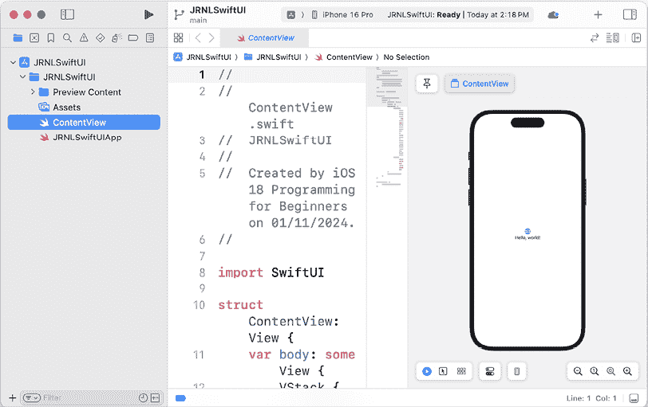

# SwiftUI 入门

在前面的章节中，你使用故事板创建了 *JRNL* 应用的 **用户界面**（**UI**）。这个过程涉及将代表视图的对象拖动到故事板中，在视图控制器文件中创建输出，并将两者连接起来。

本章将重点介绍 **SwiftUI**，这是一种简单且创新的方法，可以在所有 Apple 平台上创建应用。SwiftUI 使用声明式 Swift 语法来指定用户界面，并与新的 Xcode 设计工具协同工作，以保持代码和设计的同步。动态类型、暗黑模式、本地化和无障碍功能都自动支持。

尽管本书侧重于 UIKit，但了解 SwiftUI 对你来说是有益的，因为一些 iOS 功能，如小部件，只能使用 SwiftUI 实现。此外，SwiftUI 似乎将成为所有 Apple 平台应用开发的未来之路，但到目前为止，它还没有与 UIKit 具有相同的功能性。

在本章中，你将使用 SwiftUI 构建一个简化版的 *JRNL* 应用。此应用将仅包含期刊列表和期刊条目详情屏幕。由于使用 SwiftUI 编写应用与您之前所做的方式非常不同，你将不会修改迄今为止一直在工作的 *JRNL* 项目。相反，你将创建一个新的 SwiftUI Xcode 项目。

你将首先添加并配置 SwiftUI 视图以创建期刊列表屏幕。接下来，你将在你的应用中添加模型对象，并配置期刊列表和期刊条目详情屏幕之间的导航。之后，你将学习如何使用 MapKit 为期刊条目详情屏幕构建地图视图。最后，你将创建期刊条目详情屏幕。

到本章结束时，你将学会如何构建一个 SwiftUI 应用，该应用可以读取模型对象，以列表形式展示它们，并允许导航到包含地图视图的第二屏幕。然后你可以在自己的项目中实现此功能。

将涵盖以下主题：

+   创建 SwiftUI Xcode 项目

+   创建期刊列表屏幕

+   添加模型对象和配置导航

+   在 SwiftUI 中使用 MapKit

+   创建期刊条目详情屏幕

# 技术要求

你将为本章创建一个新的 SwiftUI Xcode 项目。

本章的资源文件和完成的 Xcode 项目位于本书代码包的 `Chapter24` 文件夹中，可以在此处下载：

[`github.com/PacktPublishing/iOS-18-Programming-for-Beginners-Ninth-Edition`](https://github.com/PacktPublishing/iOS-18-Programming-for-Beginners-Ninth-Edition%0D)

观看以下视频以查看代码的实际运行情况：

[`youtu.be/VIbBcmHmf8k`](https://youtu.be/VIbBcmHmf8k%0D)

让我们从下一节开始创建一个新的 SwiftUI Xcode 项目，用于你的 SwiftUI 应用。

# 创建 SwiftUI Xcode 项目

创建一个 SwiftUI Xcode 项目的方式与创建一个常规 Xcode 项目的方式相同，但您需要配置它以使用 SwiftUI 而不是故事板来创建用户界面。正如您将看到的，用户界面完全由代码生成，您在修改代码时将能够立即看到用户界面的变化。

您可以在 WWDC20 期间观看苹果 SwiftUI 演示的视频，网址为[`developer.apple.com/videos/play/wwdc2020/10119`](https://developer.apple.com/videos/play/wwdc2020/10119)。

您可以在 WWDC24 期间观看 SwiftUI 新功能的视频，网址为[`developer.apple.com/videos/play/wwdc2024/10144/`](https://developer.apple.com/videos/play/wwdc2024/10144/)。

您可以在网上找到苹果官方的 SwiftUI 文档，网址为[`developer.apple.com/xcode/swiftui/`](https://developer.apple.com/xcode/swiftui/)。

让我们首先创建一个新的 SwiftUI Xcode 项目。按照以下步骤操作：

1.  启动 Xcode 并创建一个新的 Xcode 项目。

1.  点击**iOS**。选择**App**模板，然后点击**下一步**。

1.  **选择您新项目选项**屏幕出现：


图 24.1：项目选项屏幕

按照以下方式配置此屏幕：

+   **产品名称**：`JRNLSwiftUI`

+   **界面**：`SwiftUI`

其他设置应该已经设置好了。完成后点击**下一步**。

1.  选择保存`JRNLSwiftUI`项目的位置，然后点击**创建**。

1.  您的项目将显示在屏幕上，`ContentView`文件在项目导航器中被选中。您将在编辑器区域的左侧看到此文件的内容，以及包含预览的画布在右侧：



图 24.2：Xcode 显示 JRNLSwiftUI 项目

1.  如果您在画布上看到一个**预览暂停**框，请点击圆形箭头以显示预览：


图 24.3：带有圆形箭头的预览暂停框

1.  `ContentView`文件包含声明和定义应用初始视图的代码。如果您需要更多的工作空间，点击导航器按钮隐藏导航器，并将编辑器区域中的边框拖动以调整画布大小：


图 24.4：Xcode 界面显示导航器按钮和编辑器区域中的边框

您已成功创建您的第一个 SwiftUI Xcode 项目！太棒了！现在您将看到如何更改编辑器区域中的代码将更新画布上的预览。

让我们来看看`ContentView`文件。这个文件包含一个`ContentView`结构和`#Preview`宏。`ContentView`结构描述了视图的内容和布局，并遵循`View`协议。`#Preview`宏生成声明`ContentView`结构预览的源代码，该预览在画布上显示。

要查看宏生成的代码，右键单击宏，并在弹出菜单中选择**展开宏**。

要查看实际操作，将`Hello, World!`文本更改为如图所示的`JRNL`：

```swift
struct ContentView: View {
  var body: some View {
    VStack {
      Image(systemName: "globe")
        .imageScale(.large)
        .foregroundStyle(.tint)
      Text("**JRNL**")
    }
    .padding()
  }
} 
```

画布中的预览将更新以反映您的更改：


图 24.5：显示带有更新后的文本视图的应用预览的画布

在下一节中，您将创建期刊列表屏幕，从显示特定期刊条目数据的视图开始。

# 创建期刊列表屏幕

当使用故事板时，您使用属性检查器修改视图的属性。在 SwiftUI 中，您可以修改代码或画布中的预览。如您所见，更改`ContentView`文件中的代码将立即更新预览，而修改预览将更新代码。

让我们自定义`ContentView`结构以显示特定餐厅的数据。按照以下步骤操作：

1.  点击图书馆按钮。在过滤器字段中输入`tex`，然后将**文本**视图拖到编辑区域，并将其放置在包含“JRNL”字符串的文本视图下方：


图 24.6：带有可拖动文本对象的图书馆

1.  Xcode 已自动将代码添加到`ContentView`文件中，用于此文本视图。请确认您的代码看起来像这样：

    ```swift
    struct ContentView: View {
      var body: some View {
        VStack {
          Image(systemName: "globe")
            .imageScale(.large)
            .foregroundStyle(.tint)
          Text("JRNL")
          **Text****(****"Placeholder"****)**
        }
        .padding()
      }
    } 
    ```

如您所见，在包含`"JRNL"`字符串的文本视图之后添加了一个第二个文本视图，并且两个文本视图和一个图像视图都被包含在一个`VStack`视图中。`VStack`视图包含垂直排列的子视图，它类似于故事板中的垂直堆叠视图。请注意，图像视图有一个`systemName`属性。此属性可以设置为苹果公司**SF Symbols**库中的其中一个图像。

您可以在此处了解更多关于 SF Symbols 库的信息：[`developer.apple.com/sf-symbols/`](https://developer.apple.com/sf-symbols/)。

1.  右键单击`VStack`视图，从弹出菜单中选择**嵌入到 HStack**。


图 24.7：弹出菜单显示嵌入到 HStack 中

1.  请确认您的代码看起来像这样：

    ```swift
    struct ContentView: View {
      var body: some View {
        **HStack** **{**
          VStack {
            Image(systemName: "globe")
              .imageScale(.large)
              .foregroundStyle(.tint)
            Text("JRNL")
            Text("Placeholder")
          }
          .padding()
        **}**
      }
    } 
    ```

如您所见，`VStack`视图现在被包含在一个`HStack`视图中。`HStack`视图包含水平排列的子视图，它类似于故事板中的水平堆叠视图。

1.  修改如下代码以显示示例期刊条目并重新定位图像视图到两个文本视图的左侧：

    ```swift
    struct ContentView: View {
      var body: some View {
        HStack {
    **Image****(****systemName****:** **"face.smiling"****)**
     **.****imageScale****(.****large****)**
     **.****foregroundStyle****(.****tint****)**
          VStack {
            Text(**"18 Aug 2024"**)
            Text(**"****Today is a good day"**)
          }
          .padding()
        }
      }
    } 
    ```

1.  验证更改是否反映在预览中：


图 24.8：显示更新后的文本视图的应用预览

1.  要更改用户界面元素的外观，您使用**修饰符**而不是属性检查器。这些是改变对象外观或行为的方法。请注意，图像视图已经具有修饰符。按照如下所示更新您的代码以设置文本视图的样式和颜色，并设置图像视图的大小：

    ```swift
    struct ContentView: View {
      var body: some View {
        HStack {
          Image(systemName: "face.smiling")
           ** .****resizable****()**
     **.****frame****(****width****:** **90****,** **height****:** **90****)**
          VStack {
            Text("18 Aug 2023")
     **.****font****(.****title****)**
     **.****fontWeight****(.****bold****)**
     **.****frame****(****maxWidth****: .****infinity****,** **alignment****: .****leading****)**
            Text("Today is a good day")
     **.****font****(.****title2****)**
     **.****foregroundStyle****(.****secondary****)**
     **.****frame****(****maxWidth****: .****infinity****,** **alignment****: .****leading****)**
          }**.****padding****()**
        }**.****padding****()**
      }
    } 
    ```

1.  验证更改是否反映在预览中：


图 24.9：显示示例期刊条目的应用预览

您的视图现在已完成。您将在下一节中将此视图用作期刊列表屏幕上的单元格。

# 添加模型对象和配置导航

现在，您有一个可以用来在期刊列表屏幕上表示期刊条目的视图。您将使用此视图作为 SwiftUI 列表中的一个单元格，这是一个以单列形式展示数据的容器。您还将配置模型对象以填充此列表。按照以下步骤操作：

1.  右键点击`HStack`视图，从弹出菜单中选择**嵌入到 VStack 中**。这样，当您将视图嵌入到列表中时，所有视图都会保持在一起。

1.  右键点击外部的`VStack`视图，并选择**嵌入到列表中**以在画布中显示包含五个单元格的列表。同时移除填充修饰符。

1.  确认您的代码现在看起来像这样：

    ```swift
    struct ContentView: View {
      var body: some View {
        **List****(****0****..<****5****) { item** **in**
    **VStack** **{**
            HStack {
              Image(systemName: "face.smiling")
                .resizable()
                .frame(width: 90, height: 90)
              VStack {
                Text("18 Aug 2024")
                  .font(.title)
                  .fontWeight(.bold)
                  .frame(maxWidth: .infinity, 
                  alignment: .leading)
                Text("Today is a good day")
                  .font(.title2)
                  .foregroundStyle(.secondary)
                  .frame(maxWidth: .infinity, 
                  alignment: .leading)
              }
            }
       **   }**
     **}**
      }
    } 
    ```

如您在画布中所见，您在上一节中创建的视图现在被配置为显示五个项目的列表所包围。请注意，在列表中显示数据不需要任何代表者和数据源。

1.  打开您从[`github.com/PacktPublishing/iOS-18-Programming-for-Beginners-Ninth-Edition`](https://github.com/PacktPublishing/iOS-18-Programming-for-Beginners-Ninth-Edition)下载的代码包中的`Chapter24`文件夹内的`resources`文件夹。将`JournalEntry`文件拖到项目导航器中，并在提示时点击**完成**将其添加到您的项目中。

1.  在项目导航器中点击`JournalEntry`文件，您应该在其中看到以下代码：

    ```swift
    import UIKit
    struct JournalEntry: Identifiable, Hashable {
      // MARK: - Properties
      let id = UUID()
      let date = Date()
      let rating: Int
      let entryTitle: String
      let entryBody: String
      let photo: UIImage?
      let latitude: Double?
      let longitude: Double?
    }
    //MARK: - Sample data
    let testData = [
      JournalEntry(rating: 5, entryTitle: "Today is a good 
      day", entryBody: "I got top marks in my exam today!
      Great!", photo: UIImage(systemName: "sun.max"),
      latitude: 37.3346, longitude: -122.0090),
      JournalEntry(rating: 0, entryTitle: "Today is a bad 
      day", entryBody: "I wasn't feeling very well today.",  photo: UIImage(systemName: "cloud"), latitude: nil,  longitude: nil),
      JournalEntry(rating: 3, entryTitle: "Today is an OK 
      day", entryBody: "Just having a nice lazy day at home",  photo: UIImage(systemName: "cloud.sun"), latitude: nil,  longitude: nil)
    ] 
    ```

`JournalItem`文件包含一个结构`JournalItem`和一个数组`testData`。

`JournalItem`结构类似于您在`JRNL`项目中使用的`JournalItem`类。要在列表中使用此结构，您必须使其符合`Identifiable`协议。此协议指定列表项必须有一个可以识别特定项的`id`属性。在创建每个`JournalEntry`实例时，都会分配一个`UUID`实例，以确保每个`id`属性中存储的值是唯一的。

注意，此结构也符合`Hashable`协议。这将在您点击单元格时用于确定要显示的数据。

`testData`是一个包含三个`JournalItem`实例的数组，您将使用它来填充期刊列表屏幕。

您可以在以下链接中了解更多关于`Identifiable`协议的信息：[`developer.apple.com/documentation/swift/identifiable`](https://developer.apple.com/documentation/swift/identifiable)。

您可以在以下链接中了解更多关于`Hashable`协议的信息：[`developer.apple.com/documentation/swift/hashable`](https://developer.apple.com/documentation/swift/hashable)。

1.  在项目导航器中点击`ContentView`文件。在`ContentView`结构的开括号之后添加一个`journalEntries`属性，并将其分配给`testData`数组：

    ```swift
    struct ContentView: View {
      **var****journalEntries****=****testData**
      var body: some View { 
    ```

1.  按照以下所示修改您的代码，以在每个视图中显示期刊条目的照片、日期和标题：

    ```swift
    struct ContentView: View {
      var journalEntries = testData
      var body: some View {
        List(**journalEntries****journalEntry**) {  in
          VStack {
            HStack {
              Image(**uiImage****: journalEntry.photo** **??****UIImage****(**
                **systemName****:** **"face.smiling"****)****!**)
                .resizable()
                .frame(width: 90, height: 90)
              VStack {
                Text(**journalEntry.date.****formatted****(** **.****dateTime****.****day****().****month****().****year****())**
    )
                  .font(.title)
                  .fontWeight(.bold)
                  .frame(maxWidth: .infinity,               alignment: .leading)
                Text(**journalEntry.****entryTitle**)
                  .font(.title2)
                  .foregroundStyle(.secondary)
                  .frame(maxWidth: .infinity,               alignment: .leading)
              }
            }
          }
        }
      }
    } 
    ```

让我们看看这段代码是如何工作的。

`ContentView`结构在`journalEntries`属性中存储了一个`JournalEntry`实例数组。这个数组被传递到列表中。对于`journalEntries`数组中的每个项目，都会创建一个视图并将其分配给项目的属性数据。

每个日记条目的图像都是从存储在`journalEntry.photo`中的`UIImage`实例转换而来，如果`photo`属性为`nil`，则提供默认值。日期使用`formatted()`方法转换为文本字符串。

由于数组中有三个项目，画布中会出现三个`VStack`视图。

当你对代码进行重大更改时，画布的自动更新会暂停。如果需要继续，请点击**预览暂停**框中的圆形箭头。

接下来，您将实现导航，以便当单元格被点击时，将显示一个第二屏幕，该屏幕将显示特定日记条目的详细信息。按照以下步骤操作：

1.  右键点击`List`视图，从弹出菜单中选择**嵌入...**，并用`NavigationStack`替换占位文本。

1.  确认您的代码现在看起来像这样：

    ```swift
    struct ContentView: View {
      var journalEntries = testData
      var body: some View {
        **NavigationStack** **{**
          List(journalEntries) { journalEntry in 
    ```

在前面的代码中，导航堆栈工作类似于之前在您的应用中使用的`UINavigationController`类实例。

1.  在此处所示的位置添加一个`navigationTitle()`修饰符，将列表视图的`title`属性设置为在屏幕顶部显示`Journal List`：

    ```swift
     alignment: .leading
                }
              }
            }
          }**.****navigationTitle****(****"Journal List"****)**
        }
      }
    } 
    ```

1.  如此嵌入单元格到导航链接视图中，并在`.navigationTitle()`修饰符之后添加`.navigationDestination(for:destination:)`修饰符，以便在点击`VStack`视图时在新屏幕中显示日记条目的标题：

    ```swift
    List(journalEntries) { journalEntry in
      **NavigationLink****(****value****: journalEntry) {**
        VStack {
          HStack {
            Image(uiImage: journalEntry.photo ?? UIImage(
              systemName: "face.smiling")!)
              .resizable()
              .frame(width: 90, height: 90)
            VStack {
              Text(journalEntry.date.formatted(          .dateTime.day().month().year()))
                .font(.title)
                .fontWeight(.bold)
                .frame(maxWidth: .infinity,             alignment: .leading)
              Text(journalEntry.entryTitle)
                .font(.title2)
                .foregroundStyle(.secondary)
                .frame(maxWidth: .infinity,             alignment: .leading)
            }
          }
        }
      }.navigationTitle("Journal List")
     **.****navigationDestination****(****for****:**
    **JournalEntry****.****self****) {**
     **journalEntry** **in**
    **Text****(journalEntry.****entryTitle****)**
     **}**
    } 
    ```

1.  注意，画布中的列表已自动显示展开箭头：


图 24.10：显示展开箭头的应用预览

要确保在应用中按预期工作，请确保画布中的实时预览按钮被选中：


图 24.11：显示实时预览按钮的画布

点击预览中的任何单元格，将显示包含被点击日记条目标题的文本：


图 24.12：显示被点击日记条目标题的应用预览

这是一种确保您的列表按预期工作的好方法。

1.  视图代码开始显得杂乱，因此您将`VStack`视图提取到其自己的单独视图中。右键点击`NavigationLink`视图，从弹出菜单中选择**提取子视图**。

1.  确认所有`VStack`视图的视图代码都已移动到名为`ExtractedView`的单独视图中。您的代码现在将看起来像这样：

    ```swift
    struct ContentView: View {
      var journalEntries = testData
      var body: some View {
        NavigationStack {
          List(journalEntries) { journalEntry in
            **ExtractedView****()**
          }.navigationTitle("Journal List")
             .navigationDestination(for:
               JournalEntry.self) {
                   journalEntry in
                      Text(journalEntry.entryTitle)
                }
        }
      }
    }
    #Preview {
        ContentView()
    }
    **struct****ExtractedView****:** **View** **{**
    **var** **body:** **some****View** **{**
    **NavigationLink****(****value****: journalEntry) {** 
    ```

1.  右键点击`ExtractedView`视图，从弹出菜单中选择**重构** | **重命名**。

1.  将提取视图的名称更改为`JournalCell`，完成后点击**重命名**。


图 24.13：从 ExtractedView 重命名为 JournalCell

1.  确认您的代码现在看起来像这样：

    ```swift
    struct ContentView: View {
      var journalEntries = testData
      var body: some View {
        NavigationStack {
          List(journalEntries) { journalEntry in
            **JournalCell****(**)
          }.navigationTitle("Journal List")
             .navigationDestination(for:
               JournalEntry.self) {
                   journalEntry in
                      Text(journalEntry.entryTitle)
                }
        }
      }
    }
    #Preview {
        ContentView()
    }
    struct **JournalCell**: View {
      var body: some View {
        NavigationLink(value: journalEntry) { 
    ```

不要担心错误；您将在接下来的两个步骤中修复它。

1.  为 `JournalCell` 视图添加一个属性以保存 `JournalEntry` 实例：

    ```swift
    struct JournalCell: View {
      **var****journalEntry****:** **JournalEntry** 
    ```

1.  按照以下方式在 `ContentView` 结构中添加代码，将 `JournalEntry` 实例传递到 `JournalCell` 视图中：

    ```swift
    struct ContentView: View {
      var journalEntries: = testData
      var body: some View {
        NavigationStack {
          List(journalEntries) { journalEntry in
            JournalCell(**journalEntry****: journalEntry**)
          }.navigationTitle("Journal List")
              .navigationDestination(for: JournalEntry.self) {
                  journalEntry in
                  Text(journalEntry.entryTitle)
               }
        }
      }
    } 
    ```

1.  验证预览是否仍然按预期工作。

到此为止，你已经完成了 Journal List 屏幕的实现。酷！在下一节中，你将了解如何使用 **MapKit for SwiftUI** 创建一个将在 Journal Entry Detail 屏幕中使用的地图视图。

# 使用 MapKit for SwiftUI

在 WWDC23 期间，Apple 引入了针对 SwiftUI 的 MapKit 扩展支持，这使得将地图集成到你的应用程序中比以往任何时候都更容易。使用 SwiftUI，你可以轻松地向地图添加注释和覆盖层，控制相机等等。

要观看 WWDC23 中 Apple 的 Meet MapKit for SwiftUI 视频，请参阅此链接：[`developer.apple.com/videos/play/wwdc2023/10043/`](https://developer.apple.com/videos/play/wwdc2023/10043/)。

到目前为止，你已经创建了 Journal List 屏幕并且点击该屏幕上的每个单元格都会在第二个屏幕上显示日记条目的标题。你将修改你的应用程序以在点击 Journal List 屏幕上的单元格时显示 Journal Entry Detail 屏幕但在此之前，你将创建一个 SwiftUI 视图来显示地图。

按照以下步骤操作：

1.  选择 **文件** | **新建** | **从模板新建...** 以打开模板选择器。

1.  **iOS** 应已选中。在 **用户界面** 部分中，点击 **SwiftUI 视图** 并点击 **下一步**。

1.  将新文件命名为 `MapView` 并点击 **创建**。`MapView` 文件将出现在项目导航器中。

1.  在 `MapView` 文件中，导入 `MapKit` 并将 `Text` 视图替换为 `Map` 视图：

    ```swift
    import SwiftUI
    **import** **MapKit**
    struct MapView: View {
      var body: some View {
        **Map****()**
      }
    } 
    ```

1.  验证画布中是否显示地图：


图 24.14：显示地图的画布

1.  在 `MapView` 结构中添加一个类型为 `JournalEntry` 的 `journalEntry` 属性：

    ```swift
    struct MapView: View {
        **var****journalEntry****:** **JournalEntry**
        var body: some View {
            Map()
        }
    } 
    ```

1.  按照以下方式修改 `#Preview` 宏，将 `testData` 数组中的一个日记条目分配给 `journalEntry` 属性：

    ```swift
    #Preview {
        MapView(**journalEntry****:** **testData****[****0****]**)
    } 
    ```

1.  按照以下方式将 `Marker` 实例添加到 `Map` 视图中：

    ```swift
    Map() {
      **Marker****(****journalEntry****.****entryTitle****,** **coordinate****:****CLLocationCoordinate2D****(****latitude****:**

    **journalEntry****.****latitude****??****0.0****,** **longitude****:****journalEntry****.****longitude****??****0.0****))**

    } 
    ```

`Marker` 实例的 `title` 和 `coordinate` 属性的值是从 `journalEntry` 实例的 `entryTitle`、`latitude` 和 `longitude` 属性中获得的，并且 `Marker` 实例的 `coordinate` 属性将确定要显示的地图区域的中心点。

1.  当前地图已完全缩进。要设置缩放级别，请将以下代码添加到 **Map** 视图中：

    ```swift
    Map(**bounds****:** **MapCameraBounds****(****minimumDistance****:** **4500****)**) {
      Marker(journalEntry.entryTitle, coordinate:  CLLocationCoordinate2D(latitude:
      journalEntry.latitude ?? 0.0, longitude:  journalEntry.longitude ?? 0.0))
    } 
    ```

1.  验证地图当前是否显示 Apple Park 的地图：


图 24.15：显示 Apple Park 地图的画布

你已经创建了一个显示日记条目位置的 SwiftUI 地图视图。现在，让我们看看如何在下一节中制作完整的 Journal Entry Detail 屏幕。

# 完成 Journal Entry Detail 屏幕的实现

现在，你有一个显示地图的 SwiftUI 地图视图。现在，你将创建一个新的 SwiftUI 视图来表示 Journal Entry Detail 屏幕并将地图视图添加到其中。按照以下步骤操作：

1.  选择**文件** | **新建** | **从模板新建文件...**以打开模板选择器。

1.  **iOS**应该已经选中。在**用户界面**部分，点击**SwiftUI 视图**并点击**下一步**。

1.  将新文件命名为`JournalEntryDetail`并点击**创建**。`JournalEntryDetail`文件将出现在项目导航器中。

1.  在此文件中声明并定义`JournalEntryDetail`结构，如下所示：

    ```swift
    import SwiftUI
    struct JournalEntryDetail: View {
      var selectedJournalEntry: JournalEntry
      var body: some View {
        ScrollView {
          VStack(spacing: 30) {
            Text(selectedJournalEntry.date.formatted(        .dateTime.day().month().year()))
              .font(.title)
              .fontWeight(.bold)
              .frame(maxWidth: .infinity, alignment: .trailing)
            Text(selectedJournalEntry.entryTitle)
              .font(.title)
              .fontWeight(.bold)
              .frame(maxWidth: .infinity, alignment: .leading)
            Text(selectedJournalEntry.entryBody)
              .font(.title2)
              .frame(maxWidth: .infinity, alignment: .leading)
            Image(uiImage: selectedJournalEntry.photo ??
            UIImage(systemName: "face.smiling")!)
              .resizable()
              .frame(width: 300, height: 300)
            if (selectedJournalEntry.longitude != nil &&
              selectedJournalEntry.latitude != nil) {
                MapView(journalEntry: selectedJournalEntry)
                  .frame(width: 300, height: 300)
            }
          }.padding()
            .navigationTitle("Entry Detail")
        }
      }
    }
    #Preview {
      NavigationView {
        JournalEntryDetail(selectedJournalEntry: testData[0])
      }
    } 
    ```

`JournalEntryDetail`结构包含一个类型为`JournalEntry`的`selectedJournalEntry`属性和一个包含`Vstack`视图的`ScrollView`视图。`VStack`视图包含显示所选日记条目的日期、标题和正文的`Text`视图，显示所选日记条目照片的`Image`视图，以及显示所选日记条目位置的地图的`MapView`视图，前提是所选日记条目的`longitude`和`latitude`属性不是`nil`。

要在画布中创建预览，将`testData`数组中的第一个`JournalEntry`实例分配给`selectedJournalEntry`属性。请注意，`JournalEntryDetail`实例被包含在一个`NavigationView`实例中，以便在预览中显示导航栏。

1.  验证画布现在是否显示了一个可滚动的日记条目详情屏幕，并渲染了地图：


图 24.16：应用预览显示日记条目详情屏幕

现在你已经使用 SwiftUI 完成了日记条目详情屏幕的实现，你将修改日记列表屏幕上的列表，以便在单元格被点击时显示日记条目详情屏幕。

按照以下步骤操作：

1.  在项目导航器中点击`ContentView`文件，并修改`navigationDestination(for:destination:)`修饰符，以便在单元格被点击时使用`JournalEntryDetail`结构作为目标：

    ```swift
    .navigationDestination(for: JournalEntry.self) {
      journalEntry in
    **JournalEntryDetail****(selectedJournalEntry: journalEntry)**
    } 
    ```

1.  画布中的实时预览按钮应该已经选中。在日记列表屏幕上点击一个单元格。你将看到该餐厅的日记条目详情屏幕：


图 24.17：应用预览显示日记条目详情屏幕

1.  构建并运行你的应用以在模拟器中测试它：


图 24.18：模拟器显示日记列表屏幕

你已经使用 SwiftUI 构建了一个简单的*JRNL*应用版本！太棒了！

# 摘要

在本简要介绍 SwiftUI 中，你看到了如何使用 SwiftUI 构建*JRNL*应用的简化版本。

你首先添加并配置 SwiftUI 视图以创建日记列表屏幕。然后，你将模型对象添加到你的应用中，并配置了日记列表和日记条目详情屏幕之间的导航。之后，你使用 MapKit 为日记条目详情屏幕构建了一个地图视图。最后，你创建了日记条目详情屏幕，并将之前创建的地图视图添加到其中。

你现在知道了如何使用 SwiftUI 创建一个读取模型对象、在列表中展示它们并允许导航到包含地图视图的第二屏幕的应用程序。你现在可以在自己的项目中实现这一点。

如果你想了解更多关于 SwiftUI 的信息，可以参考苹果的 Develop in Swift 教程：

[`developer.apple.com/tutorials/develop-in-swift`](https://developer.apple.com/tutorials/develop-in-swift%0D)

Packt Publishing 也有一本关于 SwiftUI 的书。你可以在这里了解更多信息：

[`www.amazon.com/SwiftUI-Cookbook-building-beautiful-interactive/dp/1805121731`](https://www.amazon.com/SwiftUI-Cookbook-building-beautiful-interactive/dp/1805121731)

在下一章中，你将学习关于 **Swift 测试** 的内容，它让你能够轻松地测试你的 Swift 代码。

# 加入我们的 Discord 社区！

与其他用户、专家和作者本人一起阅读这本书。提出问题，为其他读者提供解决方案，通过 Ask Me Anything 会话与作者聊天，等等。扫描二维码或访问链接加入社区。

[`packt.link/ios-Swift`](https://packt.link/ios-Swift%0D)


