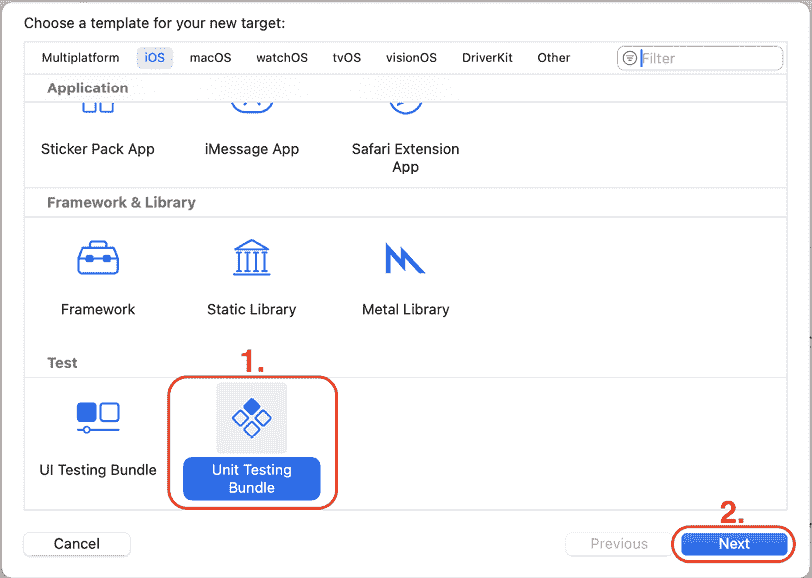
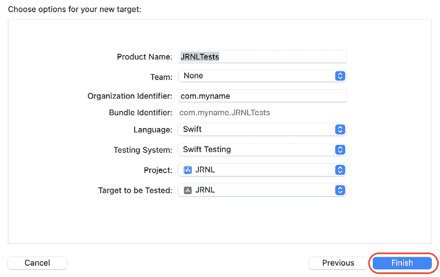
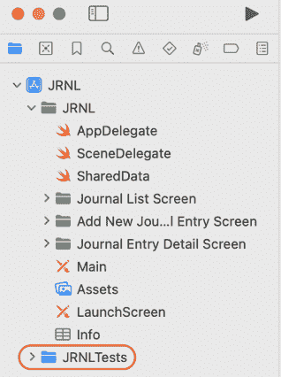
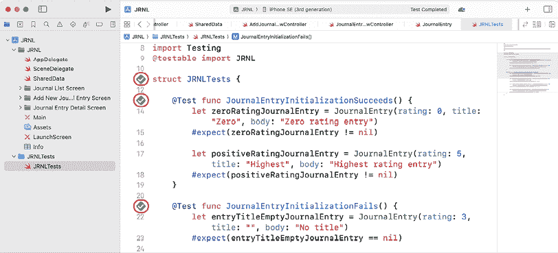

# 25

# Swift 测试入门

苹果在 WWDC24 上推出了 **Swift 测试**。这是一个新的框架，它使您能够使用表达性和直观的 API 简单地测试您的 Swift 代码。

在本章中，您将为 `JournalEntry` 类创建和运行测试，以确保它按预期工作。

您将首先为您的应用添加一个新的 **单元测试** 目标。接下来，您将为 `JournalEntry` 类编写一些测试，最后，您将在 `JournalEntry` 类上运行这些测试，以确保它按预期工作。

到本章结束时，您将学会如何为您的应用中的类编写测试，以确保它们按预期工作。这对于涉及许多人员的大型项目非常有用，在这些项目中，您无法查看项目中所有类的源代码。

以下内容将涵盖：

+   介绍 Swift 测试

+   将单元测试目标添加到您的应用中

+   为 `JournalEntry` 类编写测试

+   测试 `JournalEntry` 类

# 技术要求

您将继续在 *Chapter 23* 中修改的 `JRNL` 项目上工作，*SwiftData 入门*。

本章完成的 Xcode 项目位于本书代码包的 `Chapter25` 文件夹中，您可以通过以下链接下载：

[`github.com/PacktPublishing/iOS-18-Programming-for-Beginners-Ninth-Edition`](https://github.com/PacktPublishing/iOS-18-Programming-for-Beginners-Ninth-Edition%0D)

查看以下视频以查看代码的实际运行情况：

[`youtu.be/se9ae9wrYC8`](https://youtu.be/se9ae9wrYC8%0D)

让我们先了解 Swift 测试及其工作原理。

# 介绍 Swift 测试

如果您是涉及许多开发者的大型项目的首席开发者，您详细审查每个人的源代码可能并不实用，在某些情况下，您甚至无法查看源代码。相反，您将发布关于一个类应该做什么的规范，然后开发者的工作是为您编写这个类。

例如，让我们看看 *JRNL* 应用中 `JournalEntry` 类的初始化代码：

```swift
init?(rating: Int, title: String, body: String, photo: UIImage? = nil, latitude: Double? = nil, longitude: Double? = nil) {
  if title.isEmpty || body.isEmpty || rating < 0 ||    rating > 5 {
    return nil
  }
  self.date = Date()
  self.rating = rating
  self.title = title
  self.body = body
  self.photoData = photo?.jpegData(compressionQuality: 1.0)
  self.latitude = latitude
  self.longitude = longitude
} 
```

如您所见，只有当 `entryTitle` 和 `entryBody` 不为空且 `rating` 在 0 到 5（包括 0 和 5）之间时，您才能创建有效的 `JournalEntry` 实例。如果这些要求不满足，初始化器将返回 `nil`。

假设您无法查看 `JournalEntry` 类的源代码。您如何知道这个类按预期工作？这就是 Swift 测试发挥作用的地方。

Swift 测试使用宏构建了一个清晰且表达性强的 API，这使得编写测试以确定您的代码是否正常工作变得容易。它适用于 Swift 支持的所有主要平台，并且是开源的。

您可以在此处观看有关 Swift 测试的更多信息：[`developer.apple.com/videos/play/wwdc2024/10179/`](https://developer.apple.com/videos/play/wwdc2024/10179/).

在下一节中，您将了解如何将单元测试目标添加到您的项目中。

# 将单元测试目标添加到您的应用中

为了能够测试 `JournalEntry` 类，您将向您的应用添加一个单元测试目标。您将能够在这里编写应用中所有类的所有测试。按照以下步骤操作：

1.  在 Xcode 中，选择 **文件** | **新建** | **目标** 以打开模板选择器。

1.  **iOS** 应已选中。在 **测试** 部分，单击 **单元测试包** 并单击 **下一步**：



图 25.1：模板选择器窗口

1.  在 **选择新目标选项** 窗口中，保留所有选项的默认值并单击 **完成**：



图 25.2：选项窗口

1.  确认在项目导航器中可见 **JRNLTests** 文件夹：



图 25.3：项目导航器显示 JRNLTests 文件夹

您已成功将单元测试目标添加到您的应用中！在下一节中，您将编写一些测试以确保 `JournalEntry` 类按预期工作。

# 为 JournalEntry 类编写测试

正如您所看到的，`JournalEntry` 类的初始化器只有在 `title` 和 `body` 不为空且 `rating` 在 0 到 5（包含）之间时才会返回 `JournalEntry` 实例。如果这些条件不满足，初始化器将返回 `nil`。为了测试这一点，您将编写测试以确认在满足上述条件时创建了有效的 `JournalEntry` 实例，并且在不满足条件时返回 `nil`。按照以下步骤操作：

1.  在项目导航器中单击 **JRNLTests** 文件夹内的 **JRNLTests** 文件。

1.  按照以下方式修改此文件的内容：

    ```swift
    import Testing
    **@testable****import** **JRNL**

    struct JRNLTests {

     **@Test****func****JournalEntryInitializationSucceeds****()** {
        let zeroRatingJournalEntry = JournalEntry(rating: 0,    title: "Zero", body: "Zero rating entry")
        #expect(zeroRatingJournalEntry != nil)

        let positiveRatingJournalEntry = JournalEntry(    rating: 5, title: "Highest", body:     "Highest rating entry")
        #expect(positiveRatingJournalEntry != nil)
      }

      @Test func JournalEntryInitializationFails() {
        let entryTitleEmptyJournalEntry = JournalEntry(    rating: 3, title: "", body: "No title")
        #expect(entryTitleEmptyJournalEntry == nil)

        let entryBodyEmptyJournalEntry = JournalEntry(    rating: 3, title: "No body", body: "")
        #expect(entryBodyEmptyJournalEntry == nil)

        let negativeRatingJournalEntry = JournalEntry(    rating: -1, title: "Negative", body:     "Negative rating entry")
        #expect(negativeRatingJournalEntry == nil)

        let invalidRatingJournalEntry = JournalEntry(    rating: 6, title: "Invalid", body: 
        "Invalid rating entry")
        #expect(invalidRatingJournalEntry == nil)
      }
    } 
    ```

让我们分解一下：

```swift
import Testing 
```

这导入了 Swift 测试框架。

```swift
@testable import JRNL 
```

这使得 `JRNL` 项目中的所有代码都可用于测试。

```swift
 @Test func JournalEntryInitializationSucceeds() {
    let zeroRatingJournalEntry = JournalEntry(rating: 0,    title: "Zero", body: "Zero rating entry")
    #expect(zeroRatingJournalEntry != nil)

    let positiveRatingJournalEntry = JournalEntry(    rating: 5, title: "Highest", body:     "Highest rating entry")
    #expect(positiveRatingJournalEntry != nil)
  } 
```

此函数用于确认当 `entryTitle` 有值、`entryBody` 有值且 `rating` 在 0 到 5（包含）之间时，创建了有效的 `JournalEntry` 类实例。`#expect` 宏检查 `zeroRatingJournalEntry` 和 `positiveRatingJournalEntry` 都不是 `nil`，因此确认已创建了有效的 `JournalEntry` 实例。

```swift
 @Test func JournalEntryInitializationFails() {
    let entryTitleEmptyJournalEntry = JournalEntry(    rating: 3, title: "", body: "No title")
    #expect(entryTitleEmptyJournalEntry == nil)

    let entryBodyEmptyJournalEntry = JournalEntry(    rating: 3, title: "No body", body: "")
    #expect(entryBodyEmptyJournalEntry == nil)

    let negativeRatingJournalEntry = JournalEntry(    rating: -1, title: "Negative", body:     "Negative rating entry")
    #expect(negativeRatingJournalEntry == nil)

    let invalidRatingJournalEntry = JournalEntry(
    rating: 6, title: "Invalid", body:
    "Invalid rating entry")
    #expect(invalidRatingJournalEntry == nil)
  } 
```

此函数用于确认当 `entryTitle` 为空、`entryBody` 为空且 `rating` 不在 0 到 5（包含）之间时，将返回 `nil`。`#expect` 宏将确定 `entryTitleEmptyJournalEntry`、`entryBodyEmptyJournalEntry`、`negativeRatingJournalEntry` 和 `invalidRatingJournalEntry` 是否都是 `nil`，因此确认没有创建 `JournalEntry` 实例。

由于这是 Swift 测试的简要介绍，单个函数中会检查多个条件，但为了清晰起见，专业程序员通常使用一个函数执行一个测试。

您已完成了 `JournalEntry` 类所有测试的编写。在下一节中，您将运行测试以确认 `JournalEntry` 类按预期工作。

# 测试 JournalEntry 类

由于你在上一节中已经完成了 JournalEntry 类的所有测试编写，你现在将运行测试以查看 JournalEntry 类是否按预期工作。请按照以下步骤操作：

1.  在 Xcode 中，从**产品**菜单中选择**测试**。

1.  Xcode 将自动运行所有测试。完成后，你将看到以下结果：



图 25.4：显示小部件预览的画布

带勾号的绿色方块表明所有测试都已成功完成，JournalEntry 类按预期工作。做得好！

# 摘要

在本章中，你测试了 JournalEntry 类，以确定它是否按预期工作。

首先，你为你的应用添加了一个新的**单元测试**目标。接下来，你为 JournalEntry 类编写了一些测试，最后，你运行了 JournalEntry 类的测试，以确保它按预期工作。

你现在已经学会了如何为你的应用中的类编写测试，以确保它们按预期工作。这对于涉及许多人的大型项目非常有用，在这些项目中，你无法查看项目中所有类的源代码，并且还能确保在应用中任何地方所做的更改都不会破坏现有功能。

在下一章中，你将了解**Apple Intelligence**，这是苹果在 WWDC24 期间推出的 AI 技术的实现。

# 加入我们的 Discord！

与其他用户、专家和作者本人一起阅读这本书。提出问题，为其他读者提供解决方案，通过 Ask Me Anything（问我任何问题）会议与作者聊天，等等。扫描二维码或访问链接加入社区。

[(https://packt.link/ios-Swift)]

[(https://packt.link/ios-Swift%0D)]
