# 26

# 开始使用苹果智能

在 2024 年苹果全球开发者大会上，苹果推出了**苹果智能**，这是一个将强大的生成模型置于苹果设备中的个人智能系统，使您的应用能够实现新的 AI 驱动功能。这些功能包括**写作工具**、**图像游乐场**、**Genmoji**和**带有应用意图的 Siri**。然而，在撰写本文时，只有写作工具可用。

在本章中，您将使用您在*第二十二章*，*开始使用集合视图*中完成的*JRNL*应用来探索苹果智能功能。

首先，您将了解苹果智能及其功能。接下来，您将看到预测代码补全如何帮助您编写应用。最后，您将了解写作工具，并了解它在您的应用中的工作方式。

到本章结束时，您将学会如何在 Xcode 和您的应用中使用苹果智能功能。

本章将涵盖以下主题：

+   介绍苹果智能

+   在 Xcode 中使用预测代码补全

+   在您的应用中实现写作工具

# 技术要求

您将继续在*第二十二章*，*开始使用集合视图*中修改的`JRNL`项目中工作。

本章的资源文件和完成的 Xcode 项目位于本书代码包的`Chapter26`文件夹中，可在此处下载：

[`github.com/PacktPublishing/iOS-18-Programming-for-Beginners-Ninth-Edition`](https://github.com/PacktPublishing/iOS-18-Programming-for-Beginners-Ninth-Edition%0D)

查看以下视频，了解代码的实际应用：

[`youtu.be/vraSf4dPHfc`](https://youtu.be/vraSf4dPHfc%0D)

让我们从下一节开始学习苹果智能。

# 介绍苹果智能

苹果智能是一个由设备端和服务器端处理组成的人工智能平台，它将启用令人难以置信的新功能，帮助用户沟通、工作和表达自己。这些功能包括：

+   预测代码补全，帮助您使用 Xcode 编写代码。

+   写作工具，帮助用户校对、重写和总结文本。

+   图像游乐场，允许用户创建有趣和富有创意的图像。

+   Genmoji，允许用户创建适合任何场合的 emoji。

+   带有应用意图的 Siri，允许开发者赋予 Siri 在您的应用中执行操作的能力。

苹果智能将免费提供给所有苹果用户，并将于 2024 年秋季推出。在撰写本文时，只有预测代码补全和写作工具可用。

要了解苹果智能功能可以做什么，请观看这个视频：[`www.youtube.com/watch?v=Q_EYoV1kZWk`](https://www.youtube.com/watch?v=Q_EYoV1kZWk).

您可以通过此链接查看有关苹果智能的苹果开发者文档：[`developer.apple.com/apple-intelligence/`](https://developer.apple.com/apple-intelligence/).

在下一节中，你将学习苹果智能如何帮助你为你的应用程序编写代码。

# 在 Xcode 中使用预测代码补全

正如你所知，当你输入代码时，Xcode 将通过在弹出菜单中显示建议来帮助你。代码补全将此提升到另一个层次，通过设备上的 AI 编码模型提供更全面的代码建议。此模型专门针对 Swift 和 Apple SDK 进行训练，并将能够根据周围的代码上下文（如函数名称和注释）推断出你试图做什么。

要看到这个动作，你将在项目中添加一个新文件并创建一些示例结构和函数。按照以下步骤操作：

1.  打开代码包中`Chapter22`文件夹中的完成 Xcode 项目，该代码包可以从[`github.com/PacktPublishing/iOS-18-Programming-for-Beginners-Ninth-Edition`](https://github.com/PacktPublishing/iOS-18-Programming-for-Beginners-Ninth-Edition)下载。

1.  在**Xcode**菜单中点击**设置**，然后点击**文本编辑**选项卡。点击**编辑**选项卡并勾选**预测代码完成**复选框：

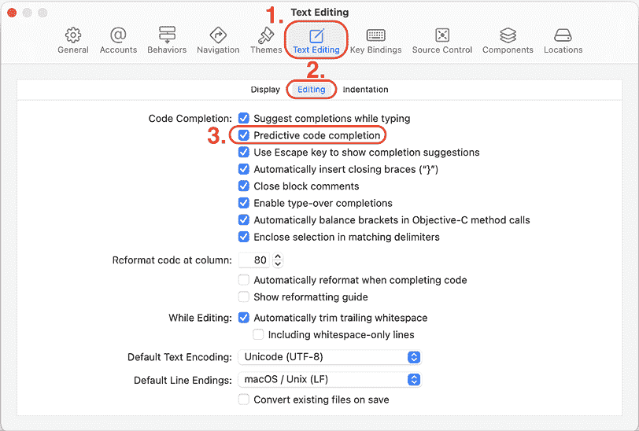

图 26.1：显示预测代码完成复选框的设置窗口

1.  将会出现一个**下载预测代码完成模型？**的警告。点击**下载**按钮下载并安装语言模型，并等待其完成：

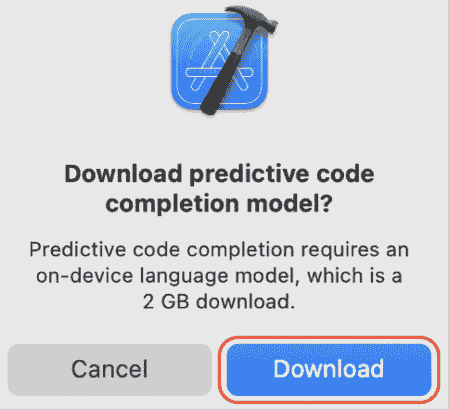

图 26.2：下载预测代码完成模型？的警告

1.  在**设置**窗口中点击**组件**选项卡，并验证**预测代码完成模型**是否存在：

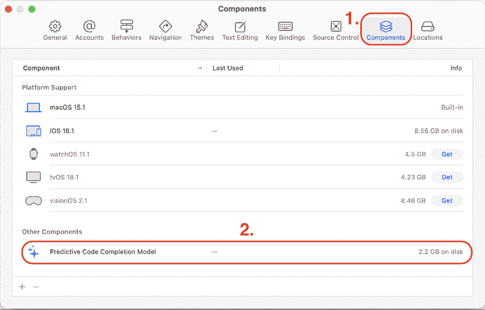

图 26.3：显示组件选项卡的设置窗口

1.  在项目导航器中右键单击**JRNL**文件夹，然后选择**从模板新建文件...**。从模板选择器中选择**Swift 文件**并命名文件为`Employee`。它将出现在项目导航器中。

1.  在`import`语句之后输入以下注释和代码：

    ```swift
    // This file contains the definition of the Employee structure, a method that will generate sample data, an EmployeeDatabase structure containing an array of Employee instances and methods to add, delete and find employees in an array.
    struct Employee 
    ```

1.  Xcode 将显示预测代码建议。按*Tab*键接受它：

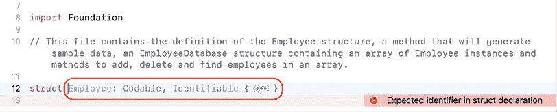

图 26.4：显示预测代码建议的编辑区域

1.  Xcode 将显示`Employee`结构可能属性的列表。按*Tab*键接受它：

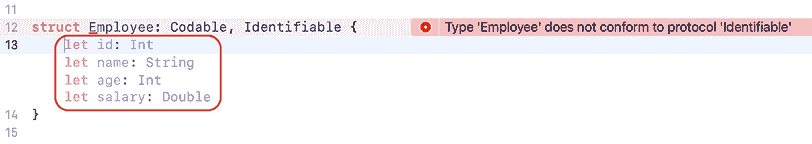

图 26.5：显示预测代码建议的编辑区域

注意，Xcode 已自动为你创建了`Employee`结构。真酷！

1.  在`Employee`结构定义之后输入`ex`并按*Tab*键接受预测代码建议。

1.  确认 Xcode 已自动创建一个生成示例数据的方法：

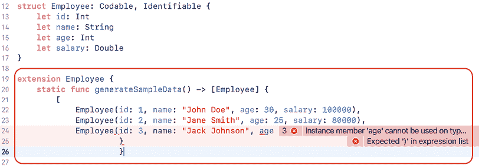

图 26.6：显示语法错误的编辑区域

注意，可能存在一些需要修复的语法错误。随着苹果公司随着时间的推移更新语言模型，这可能会得到改善。

修复语法错误后，你的代码应该看起来类似于以下这样：

```swift
struct Employee: Codable, Identifiable {
  let id: Int
  let name: String
  let age: Int
  let salary: Double
}

extension Employee {
  static func generateSampleData() -> [Employee] {
    [
      Employee(id: 1, name: "John Doe", age: 25, 
      salary: 100000),
      Employee(id: 2, name: "Jane Smith", age: 28, 
      salary: 120000),
      Employee(id: 3, name: "Jimmy Johnson", age: 30, 
      salary: 150000),
    ]
  }
} 
```

1.  在扩展后输入`struct Emp`，并继续按*Tab*键接受建议，直到没有更多建议出现。生成的代码将类似于以下内容：

    ```swift
    struct EmployeeDatabase: Codable {
      var employees: [Employee]
    } 
    ```

1.  在`employees`属性声明后输入`func`，并继续按*Tab*键接受建议，直到没有更多建议出现。生成的代码将类似于以下内容：

    ```swift
    mutating func add(_ employee: Employee) {
      employees.append(employee)
    } 
    ```

1.  在`add(_:)`方法的定义后输入两次*Return*键，等待代码建议出现。继续按*Tab*键接受建议，直到没有更多建议出现。生成的代码将类似于以下内容：

    ```swift
    func find(by id: Int) -> Employee? {
      employees.first(where: { $0.id == id })
    } 
    ```

1.  重复*步骤 14*，并继续按*Tab*键接受建议，直到没有更多建议出现。生成的代码将类似于以下内容：

    ```swift
    mutating func delete(by id: Int) {
      employees.removeAll(where: { $0.id == id })
    } 
    ```

1.  确认生成的代码与这里显示的代码类似：

    ```swift
    // This file contains the definition of the Employee structure, a method that will generate sample data, an EmployeeDatabase structure containing an array of Employee instances and methods to add, delete and find employees in an array.

    struct Employee: Codable, Identifiable {
      let id: Int
      let name: String
      let age: Int
      let salary: Double
    }

    extension Employee {
      static func generateSampleData() -> [Employee] {
         [
           Employee(id: 1, name: "John Doe", age: 25, 
           salary: 100000),
           Employee(id: 2, name: "Jane Smith", age: 28, 
           salary: 120000),
           Employee(id: 3, name: "Jimmy Johnson", age: 30, 
           salary: 150000),
        ]
      }
    }

    struct EmployeeDatabase: Codable {
      var employees: [Employee]

      mutating func add(_ employee: Employee) {
        employees.append(employee)
      }

      func find(by id: Int) -> Employee? {
        employees.first(where: { $0.id == id })
      }

      mutating func delete(by id: Int) {
        employees.removeAll(where: { $0.id == id })
      }
    } 
    ```

在预测代码补全的帮助下，您已成功创建了注释中描述的类和方法，所需输入的代码非常少！太棒了！

然而，请注意，生成的代码并不完美，您可能需要根据需要修复错误和其他问题。

在下一节中，您将学习如何将写作工具实现到您的应用中，以校对、重写和总结文本。

# 在您的应用中实现写作工具

写作工具是 Apple 智能的一项系统级功能，可以帮助您校对、重写和总结文本。只要您的应用在支持的环境中运行，并且您在应用中使用`UITextView`、`NSTextView`或`WKWebView`，写作工具就会自动出现。苹果公司还引入了文本视图代理方法和属性，以便在写作工具使用时，您的应用可以采取适当的操作。

要查看 Apple 的 WWDC24 关于写作工具的视频，请参阅：[`developer.apple.com/videos/play/wwdc2024/10168/`](https://developer.apple.com/videos/play/wwdc2024/10168/)。

要查看写作工具的实际应用，您需要在 Mac 上运行*JRNL*应用，并使用写作工具修改“添加新日志条目”屏幕中的文本。您还将探索苹果公司引入的新文本视图代理方法和属性。按照以下步骤操作：

1.  在您的 Mac 上打开**系统设置**，在侧边栏中选择**Apple 智能与 Siri**，并开启**Apple 智能**：

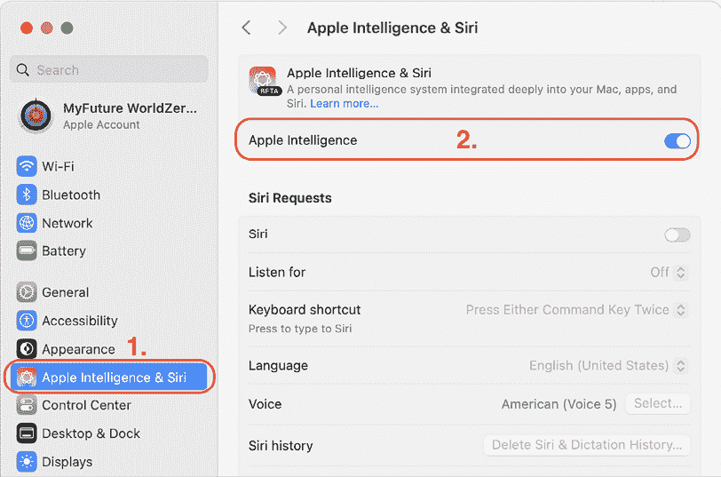

图 26.7：开启 Apple 智能的系统设置窗口

1.  在 Xcode 中打开`JRNL`项目，并在工具栏中的目标菜单中选择**我的 Mac（适用于 iPad）**：

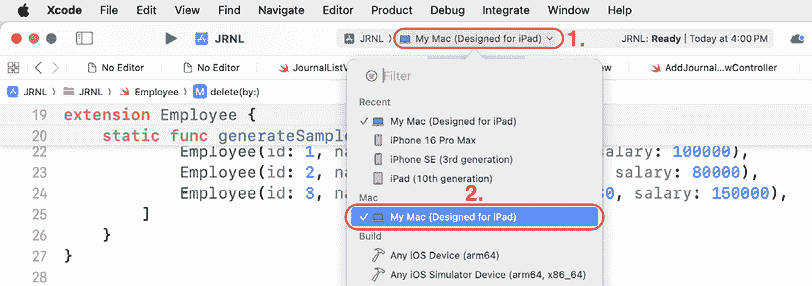

图 26.8：选择“我的 Mac”（适用于 iPad）的目标菜单

1.  点击项目导航器顶部的**JRNL**图标，点击**JRNL**目标，然后点击**签名与功能**选项卡。将**团队**设置为免费或付费的 Apple 开发者账户，并根据需要修改**捆绑标识符**，直到配置文件中没有更多错误：

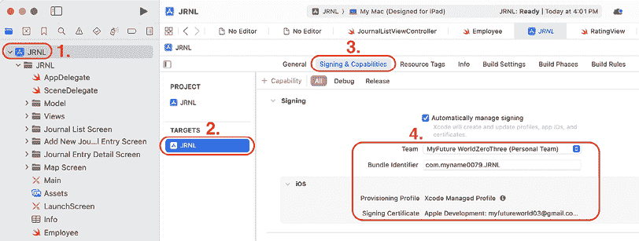

图 26.9：签名和功能屏幕

在设备上运行您的应用程序的详细信息请参阅*第一章*，*探索 Xcode*。

1.  在您的 Mac 上构建并运行应用程序，然后点击**+**按钮以显示添加新日志条目屏幕：

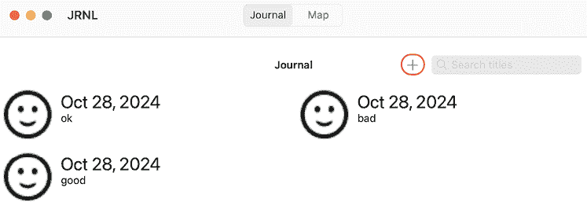

图 26.10：带有高亮显示+按钮的日志屏幕

1.  在文本视图中输入几段文本。选择所有文本，右键单击，并选择**写作工具 | 校对**：

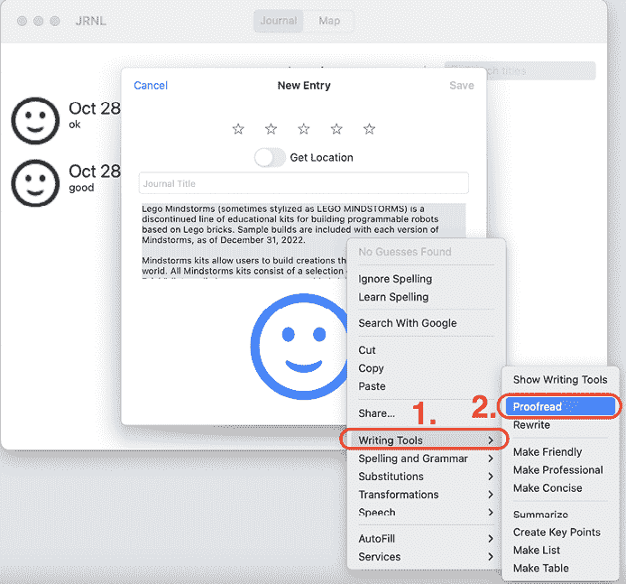

图 26.11：显示已选择校对的弹出菜单的文本视图

1.  点击左右箭头按钮以浏览更改，并在您完成审查后点击**完成**：

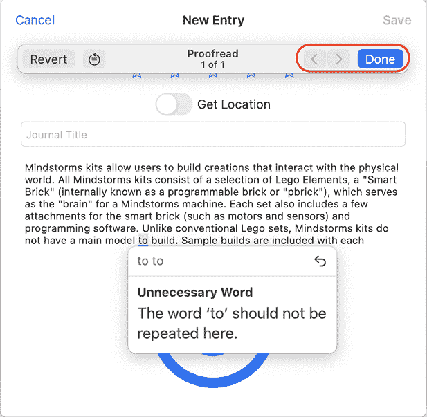

图 26.12：在文本视图中审查写作工具更改

1.  尝试其他写作工具功能，并观察它们的作用：

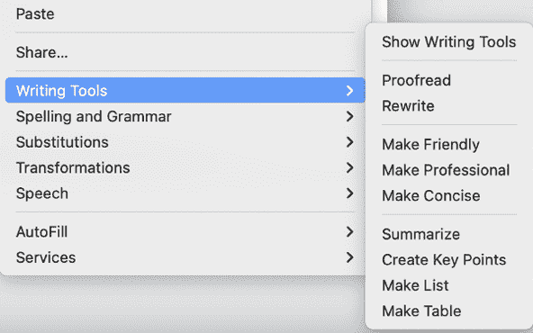

图 26.13：显示可用功能的写作工具子菜单

1.  您可能希望在写作工具激活时禁用文本视图的编辑。在项目导航器中点击**AddJournalViewController**文件。在文件中的所有其他代码之后添加以下扩展：

    ```swift
    extension AddJournalEntryViewController {
      // MARK: - Writing Tools Delegate methods
      func textViewWritingToolsWillBegin(_ textView: 
      UITextView) {
        textView.isEditable = false
      }
      func textviewWritingToolsDidEnd(_ textView: 
      UITextView) {
        textView.isEditable = true
      }
    } 
    ```

此代码在写作工具激活时禁用了文本视图的编辑。

1.  在某些情况下，您可能希望完全禁用写作工具。在`AddJournalEntryViewController`类的`viewDidLoad()`方法中，在所有其他代码之后添加此行：

    ```swift
    bodyTextView.writingToolsBehavior = .none 
    ```

此代码禁用了写作工具，并且写作工具菜单项将不再显示。

您已成功探索了如何在您的应用程序中使用写作工具。太棒了！

# 摘要

在本章中，您修改了*JRNL*应用程序，该应用程序是在*第二十二章*，*开始使用集合视图*中完成的，以与 Apple Intelligence 一起工作。

首先，您了解了 Apple Intelligence 及其功能。接下来，您在预测代码补全的帮助下创建了一个新的结构和相关函数。最后，您学习了写作工具及其在您的应用程序中的工作方式。

您现在已经学会了如何在 Xcode 和您的应用程序中使用 Apple Intelligence 功能。太棒了！

在下一章中，您将学习如何测试并将您的应用程序提交到 App Store。

# 加入我们的 Discord 社区！

与其他用户、专家和作者本人一起阅读此书。提出问题，为其他读者提供解决方案，通过 Ask Me Anything 会议与作者聊天，等等。扫描二维码或访问链接以加入社区。

[`packt.link/ios-Swift`](https://packt.link/ios-Swift%0D)


