# 第一章：iOS5 的新功能

欢迎来到苹果公司移动操作系统的最新版本 iOS 5 的激动人心的世界，它包含了许多新的功能和改进，改变了事物的处理方式。2010 年发布的 iPhone 4，让全世界为之疯狂。世界各地的开发者都在拥抱新功能，例如在他们的应用程序中集成 AirPlay 功能，利用视网膜显示屏在他们的应用程序和游戏中提供清晰的高清图形，以及加速度计和陀螺仪。

当苹果公司在 2011 年 6 月举办年度全球开发者大会时，他们介绍了 200 多个新功能，以及一个更新的 SDK，该 SDK 具有超过 1,500 个新的开发 API。这为许多新的应用程序以及我们目前做事的方式提供了很多新的想法。一些令人兴奋的新功能亮点包括使用新的**通知中心**来支持处理通知消息的方式，通过使用新的**iMessage**消息应用程序大大改进了消息传递，最后，通过使用新的**新闻摊**应用程序来组织和购买所有报纸和杂志订阅。

在本章中，您将深入了解最新 iOS 5 版本中集成的某些令人惊叹的新功能和改进。我们还将探讨如何下载和安装 Xcode 开发者工具和**软件开发包**（**SDK**）。

在本章中，我们将：

+   了解 iOS 5 带来的新功能

+   下载并安装 Xcode 开发工具

+   使用 Newsstand 框架的功能创建一个简单的应用程序

+   使用`MessageUI`框架创建一个简单的发送电子邮件的应用程序

+   删除 Xcode 开发工具

我们面前有一个令人兴奋的旅程，让我们开始吧。

# iOS 5 的新功能有哪些

自从 2007 年 6 月苹果公司发布 iOS 操作系统以来，他们在每个操作系统的发布版本中集成了许多新功能和改进。在 iOS 4 中，我们看到了超过 1,500 个新的 API，以及一些高质量的提升和改进。

在 iOS 5 中，苹果公司引入了 200 多个新功能和改进，以及 1,500 个新的 API 和 SDK 更新，包括与 Core Image、Twitter 集成和新闻摊套件相关的新功能。

不言而喻，Xcode 4 开发环境也进行了一些改进，以便您的应用程序可以使用支持**自动引用计数**（**ARC**）的新 LLVM 编译器 3.0 进行编译。因此，您很少需要保留或释放对象，因为 ARC 为您做了大部分工作。在某些情况下，您仍然需要使用保留/释放。Storyboard 支持也已集成到 Interface Builder 中，这使得您可以为每个视图设计多视图工作流程。

最后，调试 OpenGL ES 项目要容易得多，因为它们已经集成到 Xcode 调试界面中。

在接下来的章节中，我们将详细探讨 iOS 5 带来的新功能。

## 提醒事项

作为此次发布的一部分，有一个整洁的新功能叫做**提醒应用**。将提醒想象成待办事项列表是一个不错的选择。提醒事项可以证明是救命稻草，因为它们为您提供了组织日常任务的灵活性，并且具备添加截止日期和位置的能力。

当您设置提醒以使用位置时，您可以指定在特定日期或位置提醒，也可以选择在到达或离开该位置时提醒。它们利用您的手机 GPS，类似于您的汽车导航系统的工作方式，并设计为在您接近指定区域时立即提醒您。让我们举一个例子，比如说，您想买一台新的打印机和一些额外的墨水，您可以将提醒设置成在您驶入当地商店或停车场时自动发送警报。

最后，关于提醒事项还有一点要提：自从这些功能集成到 iOS 5 以来，它们已经被设计得能够很好地与其他应用程序协同工作。例如，Apple iCal、Microsoft Outlook 和 iCloud。这样做是为了确保您所做的任何更改都将自动更新到您所有的设备和日历上。

以下截图显示了一个待办事项列表中添加的项目列表，然后展示了您如何配置和指定何时提醒。您可以选择在到达或离开特定位置时提醒。最后一个截图显示了在指定时间到达时的提醒弹出窗口。可以通过选择突出显示的矩形中的**+**加号来向列表中添加更多项目。

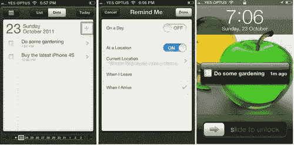

## 通知中心

通知在 iPhone 用户的日常生活中扮演着重要的角色。通知以弹出窗口的形式出现，通知您新邮件已到达、新的短信文本消息、来自社交网络网站的好友请求、当您的手机余额低于一定金额时的通知等等。有了通知中心应用程序，您不必担心寻找那封电子邮件、短信文本消息或好友请求。它已经足够简单，让您能够在一个方便的位置跟踪所有这些通知形式。

您可以通过将手指放在屏幕顶部任意位置并向下滑动来访问通知中心。在此视图中，您可以选择查看当前的天气预报、股票份额、即将到来的预约的日历条目等等。随着新通知的到来，它们将被添加并出现在列表顶部，以便更容易访问，而不会打断您正在做的事情。

您还可以通过 iOS 设备的**锁定屏幕**对通知进行操作；它们在表格视图中分类显示，这样您可以通过简单地滑动面板解锁并进入相关应用程序来快速处理它们。例如，如果您收到一条消息，这将打开**iMessage**应用程序。如您所见，通知中心为您提供了更好地跟踪您生活活动的方式。

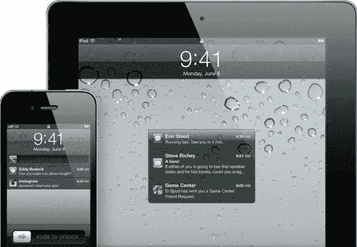

## 新闻亭

**新闻亭**是一个中心位置，iOS 用户可以在这里访问他们订阅的杂志和报纸。与 iBooks 不同，在 iBooks 中，图书出版商提供`.epub`文件或类似的文档，新闻亭的出版商将不得不创建一个 iOS 应用程序（或修改他们现有的应用程序）。想象一下，它就像 iBooks 应用中看到的架子与主屏幕上的应用程序文件夹之间的交叉。

为了使用新功能，出版商必须调用新添加的**新闻亭框架**。需要配置一些简单的设置，以便您的应用程序能够识别它是一份杂志或报纸，这样它就可以在新闻亭应用程序中运行，而不是作为一个独立的应用程序运行。

在下一节中，我们将继续下载和安装 iOS 5 SDK。如果您已经安装了它，您可以完全跳过这一节，直接进入下一节。

# 获取和安装 iOS 5 SDK

在我们开始构建 iOS 应用程序之前，您必须首先在[`developer.apple.com/programs/ios/`](http://developer.apple.com/programs/ios/)注册为注册的 iOS 开发者。注册过程是免费的，并为您提供访问 iOS SDK 和其他对您开始开发非常有用的开发者资源的权限。

一旦您注册，您就可以下载 iOS SDK，如下面的截图所示。在下载 iOS SDK 之前，确保您的机器满足以下系统要求可能是值得的：

+   只支持 Intel Mac，所以如果您有其他处理器类型（如较老的 G4 或 G5 Mac），那么您就没有运气了

+   您已使用最新的 Mac OS X 软件更新更新了系统，无论是 OS X Lion 还是 Snow Leopard

### 注意

如果您想为 iPad 和 iPod Touch 开发应用程序，您仍然可以使用 iOS SDK，因为它们与 iPhone 使用相同的 **操作系统**（OS）。此 SDK 允许您创建适用于运行 iOS 4 及以上版本的 iPhone 和 iPad 的通用应用程序。

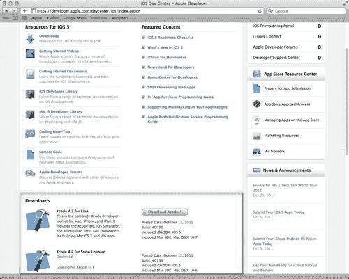

下载 SDK 后，您可以继续安装它。您将需要接受一些许可协议。然后，您将看到一个屏幕，用于指定安装 SDK 的目标文件夹：

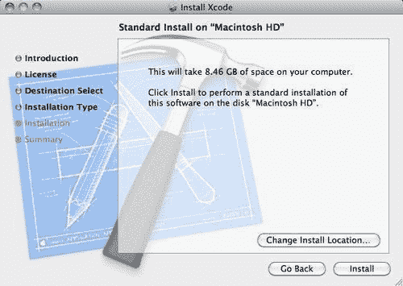

如果您在安装阶段选择默认设置，各种工具（将在后面详细解释）将被安装在 `/Developer/Applications` 文件夹中。

安装过程将引导您通过自定义安装选项屏幕。如果您安装过其他 Mac 软件，您可能已经看到了类似的屏幕。以下截图显示了您将在这里看到的内容：

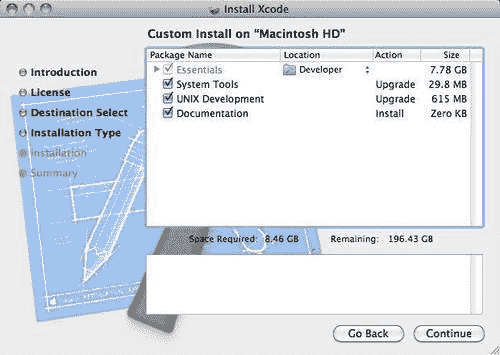

这些选项使您对安装过程有更多的控制。例如，您可以选择安装 Xcode 的文件夹位置，以及各种其他选项的设置。

iOS 5 SDK 是 Xcode 开发工具下载的一部分，您可以在 [`developer.apple.com/devcenter/ios/index.action`](http://https://developer.apple.com/devcenter/ios/index.action) 找到。

SDK 包含以下组件：

+   **Xcode:** 这是主要的 **集成开发环境**（**IDE**），它使您能够管理、编辑和调试您的项目

+   **Dashcode:** 这使您能够开发基于 Web 的 iOS 应用程序和仪表板小工具

+   **iOS 模拟器:** 这是一个基于 Cocoa 的应用程序，它提供了一个软件模拟器，可以在您的 Mac OS X 上模拟 iOS 设备

+   **仪器:** 这些是帮助您优化应用程序并实时监控内存泄漏的分析工具

以下截图显示了在安装阶段作为默认设置安装的各种工具列表。这些工具安装在 `/Developer/Applications` 文件夹中：

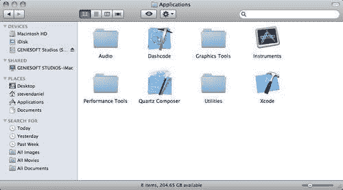

在下一节中，我们将探讨如何利用 Newsstand Kit 框架的强大功能，使开发者能够开发一个将项目添加到我们的 Newsstand 的应用程序，而不是作为一个独立的 iOS 应用程序启动。

# 创建 MyMagazineArticle 应用程序

在我们开始创建 `MyMagazineArticle` 应用程序之前，我们必须首先启动 Xcode4.2 开发环境。双击位于 `/Developer/Applications` 文件夹中的 Xcode 图标。

或者，您可以使用 Spotlight 搜索此内容：只需在搜索框中输入 `Xcode`，Xcode 应该会显示在顶部列表中。当 Xcode 启动时，您应该会看到**欢迎使用 Xcode**屏幕，如下面的截图所示。

可能值得将 Xcode 图标停靠到您的 Mac OS X 启动栏上以便于访问，因为我们将在这本书的整个过程中大量使用它。

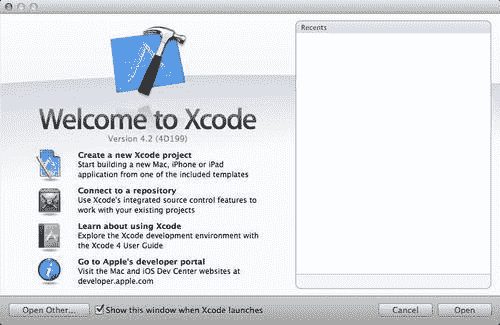

在 Xcode 中创建 MyMagazineArticle 应用程序非常简单。只需按照这里列出的步骤操作：

1.  选择**创建一个新的 Xcode 项目**，然后在左侧选择**iOS 应用程序**。

1.  从**项目**模板对话框中选择**基于页面的应用程序**模板。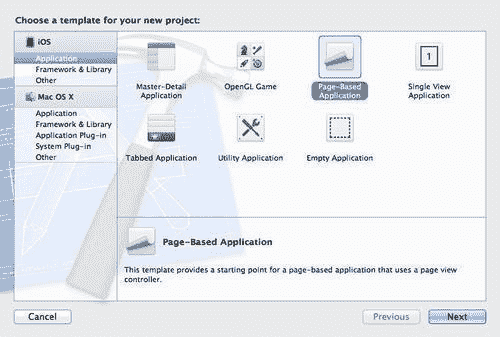

1.  然后，点击**下一步**按钮以进入向导的下一步，这将允许您输入**产品名称**和您的**公司标识符**。

    ### 注意

    您的应用程序的公司标识符需要是唯一的。苹果建议您使用反向域名样式（例如，`com.DomainName.AppName`）。

    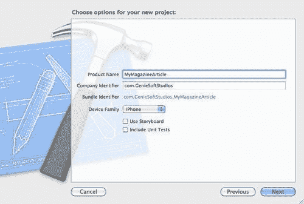

1.  在**产品名称**中输入 `MyMagazineArticle`，并在**公司标识符**字段中输入一个唯一的标识符，确保您已从**设备家族**下拉框中选择**iPhone**。

1.  然后，点击**下一步**按钮以进入向导的最后一步。

1.  选择您想要保存项目的文件夹位置。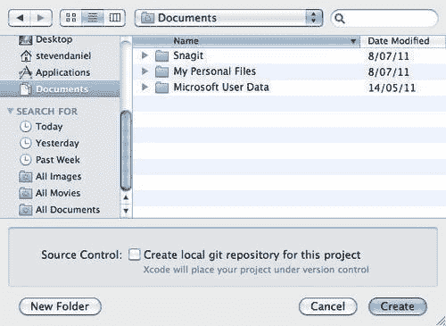

1.  然后，点击**创建**按钮以在指定位置保存您的项目。

一旦创建好项目，您将在**项目导航**窗口中看到 Xcode 开发界面以及模板为您创建的项目文件。

## 将 Newsstand Kit 框架添加到我们的项目中

现在我们已经创建了项目，我们需要将 Newsstand Kit 框架添加到我们的项目中。这是一个重要的框架，它为我们提供了将我们的应用程序显示在最新 iOS 5 版本提供的 Newsstand 应用程序中的能力。

要将此框架和其他框架添加到项目中，请选择**项目导航组**，然后按照这里概述的简单步骤操作：

1.  在**项目导航窗口**中选择您的项目。

1.  在**TARGETS**组下选择您的项目目标。

1.  选择**构建阶段**选项卡。

1.  展开**链接二进制与库**的展开三角形。

1.  在列表中向下滚动并选择**NewsstandKit.framework**，然后点击**添加**按钮将该条目添加到我们的项目中。您可以使用**+**按钮添加您想要添加的库；要删除框架，从组中选择它，然后点击按钮。如果您在显示的列表中找不到它，还有搜索框架的能力。

1.  如果你仍然不清楚如何添加 `NewsstandKit.framework`，你可以参考以下截图，其中突出显示了你需要选择的部分（由矩形突出显示）。

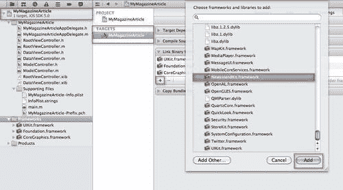

### 向我们的应用程序添加属性

现在我们已经将 `NewsstandKit.framework` 添加到我们的项目中，我们的下一步是开始添加一些属性，使我们的应用程序在新闻亭应用程序中显示。

与其他 iOS 应用程序不同，你创建的新闻亭应用程序将仅出现在新闻亭应用程序中，而不是像当前 iOS 应用程序那样显示在用户的首页上。而不是显示应用程序图标，应用程序将显示封面和一些新闻亭提供的附加信息。当用户点击你的应用程序封面时，它将自动启动你的应用程序并向他们展示与该文章相关的信息。

创建使用新闻亭套件的应用程序需要在你的应用程序和托管你内容的服务器之间进行通信。你的服务器负责在有任何新的更新或发布可用时通知应用程序，通常使用 **推送** 通知。

### 注意

关于推送通知的更多信息，请参阅 Apple 开发者连接文档，该文档可在以下地址找到：[`developer.apple.com/library/ios/#documentation/NetworkingInternet/Conceptual/RemoteNotificationsPG/Introduction/Introduction.html`](http://developer.apple.com/library/ios/#documentation/NetworkingInternet/Conceptual/RemoteNotificationsPG/Introduction/Introduction.html)。

为了使我们的应用程序表现得像新闻亭应用程序，并出现在架子上，需要三个步骤。这些步骤是：

1.  将新闻亭套件框架添加到你的项目中。

1.  在你的 **MyMagazineArticle-Info.plist** 文件中包含 **UINewsstandApp** 键，以指示它支持新闻亭。这可以通过单击 **MyMagazineArticle-Info.plist** 文件，然后在面板中心右键单击，并从弹出列表中选择 **Add Row** 来实现，如下面的截图所示：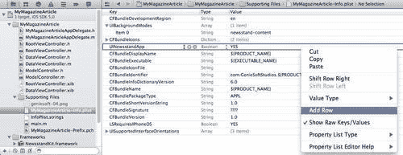

1.  包含具有 newsstand-content 值的 **Required background modes** 键，以便在后台启动应用程序，以便它可以开始下载最新内容。这可以通过单击 MyMagazineArticle-Info.plist 文件，然后在面板中心右键单击并从弹出列表中选择 Add Row 来实现。

以下截图显示了需要分配给选项，使其出现在新闻亭文件夹中：

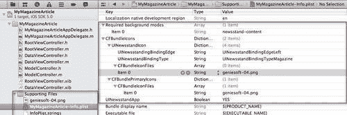

如果您的新闻架应用在**MyMagazineArticle-Info.plist**文件中的**newsstand-content**值内包含所需的背景模式键，您的新闻架应用将在后台启动，以便开始下载最新版本的杂志或报纸文章。

下载过程由系统自行管理，并在内容完全下载并可供使用时通知您的应用。

为了使我们的应用出现在新闻架文件夹中，您需要在**CFBundlePrimaryIcons**下创建一个名为**CFBundleIconFiles**的数组条目，以包含您的标准应用图标。

您还需要创建一个包含**CFBundle**的**UINewsstandIcon**，因为这是您设置报纸或杂志封面以及指定装订类型的地方，这会给您的应用赋予图标形状和装订边缘。

在以下屏幕截图中，展示了如何通过将**UINewsstandBindingType**属性更改为**UINewsstandBindingTypeNewspaper**来自定义我们的应用，使其显示为报纸：

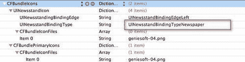

一旦您在应用程序的`.plist`文件中创建了这些条目，并确保您已将实际的图标`.png`文件添加到项目中，您就可以准备编译、构建和运行您的应用了。以下屏幕截图将显示，我们的应用已成功添加到**Newsstand**文件夹应用中，其图标已更改为显示为报纸文章。

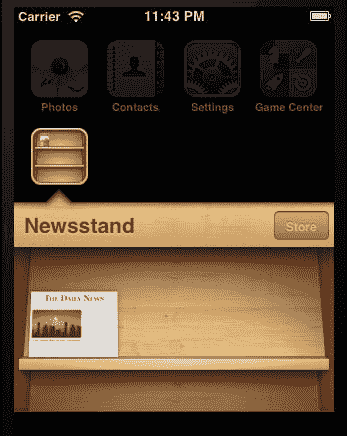

当将图标添加到您的项目中时，注意图标的大小非常重要。这取决于您是否为 iPhone 或 iPad 开发此应用。以下表格列出了图标的相关名称、大小和平台。

| **图像名称** | **尺寸（像素）** | **iOS 平台** |
| --- | --- | --- |
| `Icon.png` | `57x57` | 通用应用图标 |
| `Icon-72.png` | `72x72` | iPad |
| `Icon-64.png` | `64x64` | iPad |
| `Icon-32.png` | `32x32` | iPad/iPhone |
| `Icon-24.png` | `24x24` | iPad/iPhone |
| `Icon-16.png` | `16x16` | iPad/iPhone |

如果我们将**UINewsstandBindingType**属性改回**UINewsstandBindingTypeMagazine**，它将显示我们的图标为杂志封面。

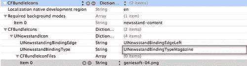

一旦您修改了应用程序的`.plist`文件中的此条目，您就可以准备编译、构建和运行此应用了。以下屏幕截图将显示，我们的应用已成功添加到**Newsstand**文件夹应用中，其图标已更改为显示为**杂志**封面。

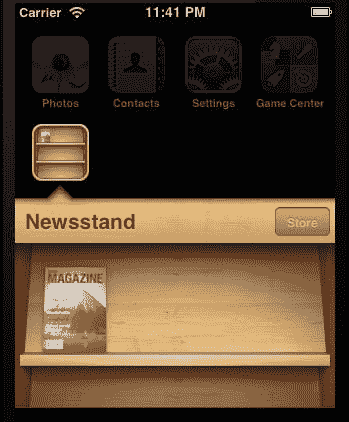

所以这就是全部内容。正如您所看到的，通过在您的应用程序的`.plist`文件中添加一些简单的属性，您可以自定义应用程序，使其图标显示为杂志封面，或报纸文章。

### 注意

需要提到的一个重要事项是，Newsstand 应用程序必须在项目的**.plist**文件中包含**UINewsstandApp**键，以表明它支持 Newsstand 功能。如果没有这样做，您的应用程序将显示为普通应用程序，将在用户的首页上显示。

# 创建 MyEmailApp 应用程序

在您的应用程序内发送电子邮件确保您在发送电子邮件后不需要重新启动应用程序。这可以是一件好事，因为它使您的应用程序用户友好，使用户可以在不重新启动应用程序的情况下继续使用它。

在本节中，我们将使用`MessageUI`框架创建一个简单的应用程序，允许在应用程序内发送电子邮件，而无需用户退出您的应用程序然后重新启动它。

我们还将探讨如何自动填写**收件人、主题**和**消息正文**字段，最后我们将看到如何访问和自定义导航栏颜色以适应您的应用程序。要了解如何实现这一点，只需按照以下简单步骤操作：

1.  从`/Developer/Applications`文件夹中启动 Xcode。

1.  然后，从项目模板对话框中选择**单视图应用程序**模板：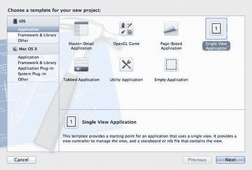

1.  点击**下一步**按钮，继续向导中的下一个步骤。

1.  通过填写**产品名称**和**公司标识符**字段为您的项目提供一个名称。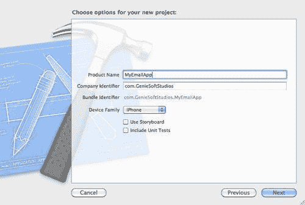

1.  在**产品名称**中输入`MyEmailApp`。

1.  确保从**设备家族**下拉框中选择**iPhone**。

1.  点击**下一步**，继续向导中的最后一步。

1.  选择您想要保存项目的文件夹位置。

1.  然后，点击**创建**按钮以在指定的位置保存项目。

## 将 MessageUI 框架添加到我们的项目中

现在我们已经创建了项目，我们需要将`MessageUI`框架添加到项目中。这是一个重要的框架，将为我们提供发送电子邮件消息的能力。

要添加此框架，请按照以下简单步骤操作：

1.  在**项目导航窗口**中选择您的项目。

1.  然后，从**TARGETS**组下选择您的项目目标。

1.  选择**构建阶段**选项卡。

1.  使用**库**展开三角符号展开**链接库**。

1.  然后，在列表中向下滚动并选择`MessageUI.framework`，然后点击**添加**按钮将该项目添加到我们的项目中。您可以使用**+**按钮添加您想要添加的库；要删除框架，从组中选择它，然后点击按钮。

1.  如果你仍然不清楚如何添加**MessageUI.framework**，可以参考以下图片，该图片突出显示了需要选择的部分（由矩形突出显示）。

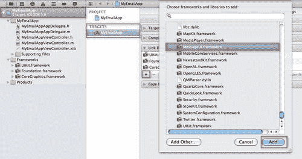

## 构建 TheMyEmailApp 用户界面

在本节中，我们将开始构建`MyEmailApp`的用户界面。我们需要包含`MessageUI`框架的头文件信息，这是我们之前章节中添加的。

这公开了所有函数方法和参数调用。要了解如何实现这一点，请按照以下简单步骤操作：

1.  现在我们已经添加了所需的框架，我们的下一步是将框架头文件导入到我们的`MyEmailAppViewController.h`头文件中，如下所示：

    ```swift
    #import <MessageUI/MessageUI.h>

    ```

1.  接下来，在资源文件夹下，打开`MyEmailAppViewController.xib`文件，然后从**对象库**中拖动一个`UIButton`控制，并通过其文本属性设置按钮标题以显示`Send Email`，或者您可以双击按钮并输入`Send Email`文本。

    我们需要创建一个方法动作事件，当按下此按钮时将执行。

1.  在`MyEmailAppViewController.m`实现文件中，添加以下代码：

    ```swift
    - (IBAction)composeEmail{
    MFMailComposeViewController *controller = [[MFMailComposeViewControlleralloc] init];
    [selfpresentModalViewController:controlleranimated:YES];
    controller.mailComposeDelegate = self [controller release];
    }

    ```

1.  这创建了一个`MFMailComposeViewController`对象，并将我们设置为代理，以便我们可以接收回调。

1.  在我们发送消息后，我们需要关闭电子邮件窗口视图。为此，我们需要实现一个代理处理程序到我们的邮件编写视图控制器`MFMailComposeViewControllerDelegate`。这设置了您的应用程序视图控制器作为代理，以便在用户发送或取消电子邮件时通知您。

1.  打开`MyEmailAppViewController.h`接口文件，然后添加以下代码：

    ```swift
    #import <UIKit/UIKit.h>
    #import <MessageUI/MessageUI.h>
    @interface MyEmailAppViewController: UIViewController<MFMailComposeViewControllerDelegate> {}
    @end

    ```

1.  我们现在需要实现一个回调方法，当用户发送或取消电子邮件时，将用于关闭视图控制器。

1.  打开`MyEmailAppViewController.m`实现文件，并添加以下代码：

    ```swift
    - (void)mailComposeController:(MFMailComposeViewController*) controller didFinishWithResult:(MFMailComposeResult)result error:(NSError*)error {
    [selfdismissModalViewControllerAnimated:YES];
    }

    ```

### 自动填充字段

到目前为止，我们已经添加了足够的程序逻辑，使我们的应用程序能够正确运行，但这不允许某些字段自动填充，因此这些需要手动填写。为此，我们首先需要添加一些额外的代码。

1.  打开`MyEmailAppViewController.m`实现文件，并将以下代码添加到`composeEmail`方法中，如下所示：

    ```swift
    [controllersetSubject:@"Program Bug"];
    [controllersetToRecipients:[NSArrayarrayWithObject: [NSStringstringWithString:@"YourEmail@companyname.com"]]];
    [controllersetMessageBody:@"An application error has occurred within module XcodeFunctions.m" isHTML:NO];
    [controller.navigationBarsetTintColor:[UIColorredColor]];
    [selfpresentModalViewController:controlleranimated:YES];
    controller.mailComposeDelegate = self;
    [controller release];

    ```

1.  还可以选择更改位于电子邮件窗口顶部的导航栏的颜色。为了实现这一点，我们需要使用`navigationBar`控制的`setTintColor`方法。您需要将其添加到`composeEmail`方法中，就在读取到`[self presentModalViewController:controller:]`的行之前。

    ```swift
    [controller.navigationBarsetTintColor:[UIColorredColor]];
    [selfpresentModalViewController:controlleranimated:YES];

    ```

在本节中，我们成功地将代码添加到我们的电子邮件草稿表中，以预填充默认项目详情，并查看我们如何设置导航栏的颜色。在下一节中，我们将探讨如何构建和运行我们的应用程序。

# 构建和运行 MyEmailApp 应用程序

一旦您实现了前面的代码，就是时候编译、构建和运行您的应用程序，以查看它如何工作了。下面的截图显示了在 iOS 模拟器中运行的`MyEmailApp`应用程序，所有字段都已填充：

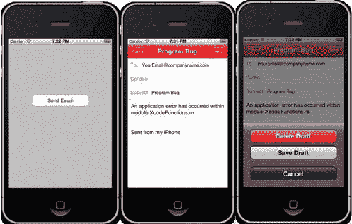

因此，这就是全部内容。您已经成功使用`MessageUI`框架构建了一个应用程序，该应用程序可以发送新的电子邮件消息。当您按下**发送电子邮件**按钮时，它将在您的应用程序中直接显示新的电子邮件视图控制器窗口，所有字段都已预先填充，并且导航栏的颜色设置得当。在最后一张截图中所显示的动作表单会在您按下**取消**按钮时显示。

## iMessage

**iMessage**是我们已经熟悉并喜爱的现有消息应用程序的一个集成插件。iMessage 允许您轻松地向运行 iOS 5 的 iOS 设备上的个人或一组人发送文本消息、照片、视频或其他内容，这些设备可以通过 Wi-Fi 或 3G 连接。

这些消息也会自动推送到您的所有其他 iOS 设备，这使得在所有设备上维护一个会话变得更加容易。当使用 iMessage 发送消息时，您的手机会自动检查您要发送的人是否运行 iOS 5，如果是这种情况，它会发送一个 iMessage 消息而不是标准的 SMS 文本。

到目前为止，您的通讯录将被更新，并在联系人的名字旁边出现一个小的蓝色聊天气泡，以表明他们可以接收 iMessages。如果该人没有运行 iOS 5，那么通讯录将更新为一个绿色的聊天气泡。在下面的截图中，它显示了 iMessages 功能，并以小蓝色气泡显示会话，以表明两个人都在运行 iOS 5：

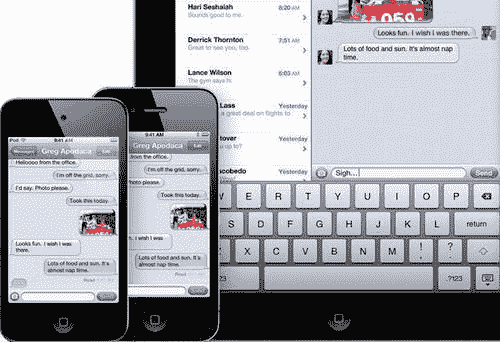

下面的项目符号总结了使用 iMessage 而不是标准消息组件的一些优点。

+   iMessage 将消息应用程序扩展到所有运行 iOS 5 的 iOS 设备，包括 iPhone、iPod touch 和 iPad。消息会推送到您的所有设备，因此如果您在 iPhone 上开始一个会话，您可以在任何 iOS 设备上继续并接收到它。

+   iMessage 服务集成在消息应用中，因此用户可以免费向拥有 iOS 设备的家人和朋友发送无限量的文本、照片、视频、联系人、位置和群组消息。值得一提的是，虽然这项功能不会产生任何短信费用，但它确实会使用你的带宽分配，而且根据你的使用量，可能会让你花费更多。

+   iMessage 可以让你轻松地通过类似即时通讯应用中看到的省略号形式，了解某人是否正在回复你的消息。

+   iMessage 可选地允许你通过投递回执和已读回执跟踪你的消息。

+   你可以通过 Wi-Fi 以及 3G 发送消息。

+   通过 iMessage 发送的消息在空中进行加密。

## iPhone 摄像头

在这次最新版本中，iPhone 的另一个组件也得到了更新，那就是 **iPhone 摄像头**。由于摄像头是捕捉那些特殊和意外时刻最广泛使用的应用程序，苹果公司使这一功能更加易于访问。

此应用程序现在可以直接从你的 iPhone 锁屏访问，并具有以下改进功能：

+   **网格线**：这些线非常有帮助，可以确定相机是否水平，以确保你每次都能拍出完美的照片，通过使用地平线或建筑物的边缘等物体。

+   **捏合缩放手势**：此功能允许你直接在摄像头应用程序中手动放大和缩小，而不是使用屏幕底部的滑块。

+   **单指点击对焦**：此功能允许你将焦点和曝光锁定在屏幕上的一个区域。只需在屏幕上的任何位置轻触你的手指即可。

+   **曝光锁定以即时构图图片**：此功能允许你通过在屏幕上放置并保持手指，简单地锁定你的图像的焦点和曝光。

在 **照片** 应用程序中也增加了新的照片编辑改进，以便你可以直接在照片应用程序中操作你的图像，无论是裁剪或旋转图像，还是提供照片增强，例如从你的照片中移除红眼，所有这些操作都在照片应用程序内完成。

如果你正在使用 iCloud（我们将在 第二章 中介绍，*使用 iCloud 和存储 API*），你也可以自动将新照片加载到你的电脑桌面上，如果你更喜欢在那里使用你喜欢的照片编辑工具进行编辑。

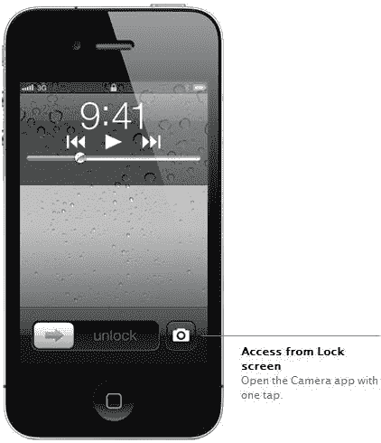

## PC 无需

随着 iOS 5 中新推出的 **PC 无需** 功能，用户可以在无需电脑的情况下设置和激活他们的设备。任何新的 iOS 软件更新都将直接部署到你的 iOS 设备上，以及你在设备上通过 iTunes 或 App Store 进行购买的任何内容。这些内容将通过 Wi-Fi 使用 **安全套接字层**（**SSL**）安全地传输回你的 iTunes 库。

一旦您正确设置和配置了 iCloud，您的备份和恢复将自动为您完成，并存储在云端，这使得您更容易将任何 iOS 更新部署到使用相同 Apple ID 的每个 iOS 设备或计算机。

以下截图显示了如何设置您的手机、从 iCloud 备份或从您的 iTunes 库中恢复设备选项。完成此操作后，您将收到一个最终的**感谢**屏幕，您可以在其中开始使用您的 iOS 设备。

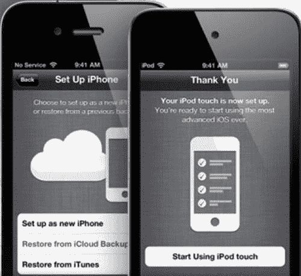

## Wi-Fi 同步

在 iOS 5 中，苹果为用户提供了更简单的方式，通过共享 Wi-Fi 连接无线同步所有 iOS 设备直接回您的 Mac 或 PC，无需像以前那样直接连接到您的计算机。

发生的情况是，每次您决定为 iOS 设备充电时，它将自动搜索任何新购买的项目或添加到设备中的项目，然后自动将其同步回您的 iTunes 库。

以这种方式，您将始终有一个备份副本，包括所有电影、珍贵的家庭视频和照片专辑，您可以在需要时随时访问。

## 多任务手势

很遗憾，这些功能从未在 iOS 4 版本中实现；它们仅包含在 iOS 4 SDK 开发者版本中，但最终在 iPad 上运行得非常好。在 iOS 5 中，这得到了极大的改进，并增加了一些新功能，使访问内容变得更加容易。苹果的工程师使其更加简单，尽可能少地移动就能轻松导航。他们还添加了快捷菜单，以帮助您在 iPad 上更快地导航。

这些手势是通过使用四个或五个手指，向上滑动以显示多任务栏，并使用捏合动作返回**主页**屏幕来实现的。甚至增加了左右滑动以在应用之间切换的支持。

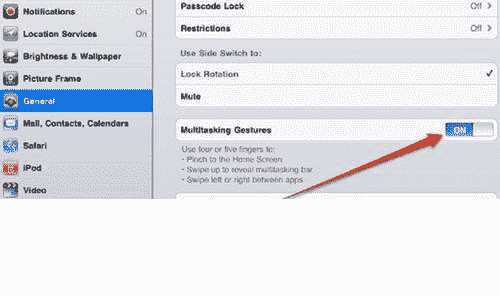

## 卸载 Xcode 开发者工具

如果您想卸载 Xcode（在安装过程中出现错误或您只想卸载 Xcode 开发者工具的情况下），这是一个非常简单的过程。打开一个终端窗口实例并运行 `uninstall-devtools` 脚本：

```swift
sudo <Xcode>/Library/uninstall-devtools --mode=all

```

`<Xcode>` 是安装工具的目录。对于典型安装，完整路径是 `/Developer/Library/uninstall-devtools`。

`<sudo>` 是一个系统管理员命令，在继续之前需要您输入管理员密码。

### 注意

在您继续之前，请确保这是您真正想要做的，因为一旦删除，它将永久删除。无论如何，您总是可以选择重新安装 Xcode 开发者工具。值得检查 `/Developer/Library/Xcode/` 文件夹是否也已删除。如果没有，只需将其移动到垃圾桶。

# 摘要

在本章中，我们了解了 iOS 5 的新特性，以及如何下载和安装 iOS 5 SDK，以及熟悉一些 Xcode 开发工具。

然后，我们继续前进，探讨了如何使用 Newsstand Kit 框架构建一个简单的 Newsstand 应用程序，以展示我们如何将报纸和杂志添加到 Newsstand 应用程序文件夹中。接下来，我们探讨了如何使用`MessageUI`框架构建一个简单的电子邮件应用程序，并学习了如何自定义导航栏 UI 以设置背景颜色。

为了结束本章，我们回顾了如何使用命令行卸载 Xcode 开发者工具的步骤。

在下一章中，我们将学习我们经常听说的**iCloud**究竟是什么，并且我们将关注作为 iCloud 一部分的存储 API。我们将探讨如何创建一个 iCloud 应用程序来在云中存储文档和键值数据，如何将备份到云中，最后看看我们如何处理文件版本冲突。
